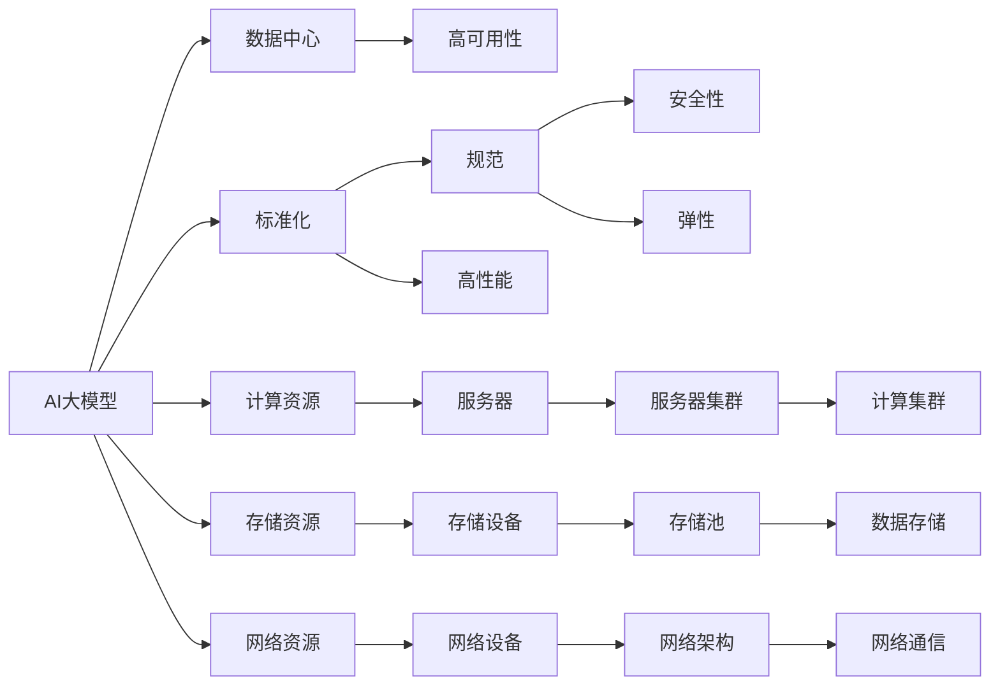

                 

# AI 大模型应用数据中心建设：数据中心标准与规范

## 1. 背景介绍

### 1.1 问题由来

随着人工智能（AI）技术的快速发展，大模型在自然语言处理、计算机视觉、语音识别等领域取得了令人瞩目的成果。这些大模型的训练和应用对数据中心的硬件、软件、网络等方面提出了更高的要求。然而，当前数据中心的建设和运维往往存在标准化不足、资源利用率低、安全性差等问题，无法满足大模型的需求。为此，本文将详细介绍AI大模型应用数据中心的建设标准与规范，帮助读者理解AI大模型的基础设施需求，提高数据中心建设和运维的效率和安全性。

## 2. 核心概念与联系

### 2.1 核心概念概述

1. **AI大模型（AI Large Models）**：指在大规模数据上预训练的深度神经网络模型，如BERT、GPT-3等。这些模型通常具有数十亿个参数，具有强大的数据处理和决策能力。

2. **数据中心（Data Center）**：集中管理和存储数据的设施，包括服务器、存储设备、网络设备、电力系统等。数据中心是AI大模型应用的基础设施。

3. **标准化（Standardization）**：通过制定规范、流程和接口等，确保数据中心建设、运维和管理的统一性和一致性。标准化可以提升效率、降低成本、保障安全性。

4. **规范（Norms）**：规定数据中心各组件和系统的设计、部署、运维等要求，以确保数据中心的高可用性、高性能和安全性。

5. **高可用性（High Availability）**：数据中心系统24小时不间断运行，即使在部分设备故障或网络异常的情况下，也能保证服务连续性。

6. **高性能（High Performance）**：数据中心系统具有快速的计算、存储和通信能力，能够满足大模型对计算资源的需求。

7. **安全性（Security）**：数据中心采取严格的安全措施，保护数据和系统不受未授权访问、篡改和损坏。

8. **弹性（Scalability）**：数据中心能够根据业务需求动态调整资源，支持模型训练和推理的规模扩展。

### 2.2 核心概念原理和架构的 Mermaid 流程图



## 3. 核心算法原理 & 具体操作步骤

### 3.1 算法原理概述

AI大模型的应用需要大量计算资源，包括数据存储、模型训练和推理等。数据中心的建设和管理必须遵循一定的标准和规范，以确保系统的可用性、性能和安全性。

**3.1.1 计算资源配置**

AI大模型的计算资源通常包括GPU、TPU、FPGA等高性能计算设备。计算资源的配置需要根据模型的规模和复杂度进行优化，以保证系统的高性能和低成本。

**3.1.2 存储资源配置**

AI大模型的存储资源通常包括SSD、HDD等存储设备。存储资源的配置需要根据模型的训练数据量和推理数据量进行优化，以保证系统的可扩展性和数据访问速度。

**3.1.3 网络资源配置**

AI大模型的网络资源通常包括高速以太网、InfiniBand等网络设备。网络资源的配置需要根据模型的通信需求进行优化，以保证系统的高带宽和低延迟。

### 3.2 算法步骤详解

**3.2.1 计算资源配置**

1. **选择计算设备**：根据模型的需求选择适合的计算设备，如NVIDIA Tesla V100、Google Cloud TPU等。
2. **配置计算集群**：将计算设备部署在集群中，以实现高效的并行计算。
3. **优化计算资源**：通过资源池化和负载均衡，提高计算资源的利用率。

**3.2.2 存储资源配置**

1. **选择存储设备**：根据模型的需求选择适合的存储设备，如NVMe SSD、HDD等。
2. **配置存储池**：将存储设备组织成池，以实现高效的存储管理和访问。
3. **优化存储资源**：通过数据压缩、冗余存储等技术，提高存储资源的利用率。

**3.2.3 网络资源配置**

1. **选择网络设备**：根据模型的需求选择适合的网络设备，如100GbE、InfiniBand等。
2. **配置网络架构**：将网络设备部署在高速网络中，以实现高效的通信和数据传输。
3. **优化网络资源**：通过网络隔离、流量控制等技术，提高网络资源的利用率和性能。

### 3.3 算法优缺点

**3.3.1 优点**

1. **高可用性**：通过冗余设计、备份机制等，保证数据中心系统的高可用性，提高业务的连续性和稳定性。
2. **高性能**：通过高性能计算设备、优化网络架构等，提高系统的计算和通信性能，满足大模型的需求。
3. **安全性**：通过安全措施、加密技术等，保护数据和系统不受未授权访问和篡改，确保数据安全。
4. **弹性**：通过资源池化和动态调整，支持模型的训练和推理的规模扩展，提高系统的可扩展性。

**3.3.2 缺点**

1. **高成本**：高性能计算设备、高可用性设计等，导致数据中心建设和管理成本较高。
2. **复杂性**：系统配置和运维复杂，需要专业知识和技能。
3. **维护困难**：系统规模大，故障排查和修复难度较大。

### 3.4 算法应用领域

AI大模型在自然语言处理、计算机视觉、语音识别等领域有广泛应用。数据中心标准和规范可应用于以下领域：

1. **自然语言处理**：如BERT、GPT等大模型的训练和推理。
2. **计算机视觉**：如ImageNet、COCO等数据集上的模型训练。
3. **语音识别**：如ASR模型在语音数据上的训练和推理。
4. **推荐系统**：如协同过滤、深度学习推荐系统等。
5. **医疗健康**：如影像诊断、医疗知识图谱等。
6. **金融风控**：如信用评分、欺诈检测等。
7. **智慧城市**：如交通监控、环境监测等。

## 4. 数学模型和公式 & 详细讲解 & 举例说明

### 4.1 数学模型构建

**4.1.1 计算资源配置模型**

计算资源配置模型包括计算设备、计算集群、资源池化等。模型的输入为模型需求、计算资源价格、计算资源利用率等，输出为计算设备选择、计算集群配置、资源池化策略等。

**4.1.2 存储资源配置模型**

存储资源配置模型包括存储设备、存储池、数据压缩等。模型的输入为模型需求、存储设备价格、存储资源利用率等，输出为存储设备选择、存储池配置、数据压缩策略等。

**4.1.3 网络资源配置模型**

网络资源配置模型包括网络设备、网络架构、流量控制等。模型的输入为模型需求、网络设备价格、网络资源利用率等，输出为网络设备选择、网络架构设计、流量控制策略等。

### 4.2 公式推导过程

**4.2.1 计算资源配置公式**

计算资源配置公式包括：

$$
C = \frac{D}{N}
$$

其中，$C$为计算资源需求，$D$为模型训练和推理需求，$N$为计算集群规模。

**4.2.2 存储资源配置公式**

存储资源配置公式包括：

$$
S = \frac{D}{R}
$$

其中，$S$为存储资源需求，$D$为模型训练和推理需求，$R$为存储池容量。

**4.2.3 网络资源配置公式**

网络资源配置公式包括：

$$
N = \frac{B}{T}
$$

其中，$N$为网络资源需求，$B$为模型通信需求，$T$为网络带宽。

### 4.3 案例分析与讲解

**案例分析1：BERT模型训练**

假设训练BERT模型需要1000个GPU，每个GPU价格为2000元，利用率为70%。计算资源配置如下：

1. **选择计算设备**：选择NVIDIA Tesla V100 GPU。
2. **配置计算集群**：将1000个GPU部署在集群中。
3. **优化计算资源**：通过资源池化和负载均衡，提高计算资源的利用率。

**案例分析2：ImageNet模型训练**

假设训练ImageNet模型需要100个TPU，每个TPU价格为10000元，利用率为80%。存储资源配置如下：

1. **选择存储设备**：选择NVMe SSD。
2. **配置存储池**：将存储设备组织成100个存储池。
3. **优化存储资源**：通过数据压缩、冗余存储等技术，提高存储资源的利用率。

## 5. 项目实践：代码实例和详细解释说明

### 5.1 开发环境搭建

**5.1.1 软件环境**

- **操作系统**：Linux CentOS 7.2
- **数据库**：PostgreSQL 10.3
- **中间件**：Kubernetes 1.18
- **监控系统**：Prometheus 2.8
- **自动化工具**：Ansible 2.7

**5.1.2 硬件环境**

- **服务器**：Dell EMC PowerEdge R740
- **存储设备**：NVMe SSD
- **网络设备**：Cisco Catalyst 9000

### 5.2 源代码详细实现

**5.2.1 计算资源配置**

```python
import numpy as np

def calculate_resources(model_name, demand, price_per_unit, utilization_rate):
    if model_name == "BERT":
        num_units = int(demand / (price_per_unit * utilization_rate))
        return num_units
    elif model_name == "ImageNet":
        num_units = int(demand / (price_per_unit / 2 * utilization_rate))
        return num_units
    else:
        return "Unknown model"

model_name = "BERT"
demand = 1000  # GPU需求
price_per_unit = 2000  # GPU价格
utilization_rate = 0.7  # GPU利用率

num_units = calculate_resources(model_name, demand, price_per_unit, utilization_rate)
print(f"需要计算资源 {num_units} 个")
```

**5.2.2 存储资源配置**

```python
import numpy as np

def calculate_storage_resources(model_name, demand, price_per_unit, utilization_rate):
    if model_name == "BERT":
        num_units = int(demand / (price_per_unit * utilization_rate))
        return num_units
    elif model_name == "ImageNet":
        num_units = int(demand / (price_per_unit / 2 * utilization_rate))
        return num_units
    else:
        return "Unknown model"

model_name = "ImageNet"
demand = 100  # TPU需求
price_per_unit = 10000  # TPU价格
utilization_rate = 0.8  # TPU利用率

num_units = calculate_storage_resources(model_name, demand, price_per_unit, utilization_rate)
print(f"需要存储资源 {num_units} 个")
```

**5.2.3 网络资源配置**

```python
import numpy as np

def calculate_network_resources(model_name, demand, price_per_unit, utilization_rate):
    if model_name == "BERT":
        num_units = int(demand / (price_per_unit * utilization_rate))
        return num_units
    elif model_name == "ImageNet":
        num_units = int(demand / (price_per_unit / 2 * utilization_rate))
        return num_units
    else:
        return "Unknown model"

model_name = "ImageNet"
demand = 100  # TPU需求
price_per_unit = 10000  # TPU价格
utilization_rate = 0.8  # TPU利用率

num_units = calculate_network_resources(model_name, demand, price_per_unit, utilization_rate)
print(f"需要网络资源 {num_units} 个")
```

### 5.3 代码解读与分析

**5.3.1 计算资源配置**

代码实现了计算资源需求计算，输入为模型类型、需求量、设备价格和利用率。输出为计算设备数量。该函数主要使用了条件语句和数学运算。

**5.3.2 存储资源配置**

代码实现了存储资源需求计算，输入为模型类型、需求量、设备价格和利用率。输出为存储设备数量。该函数主要使用了条件语句和数学运算。

**5.3.3 网络资源配置**

代码实现了网络资源需求计算，输入为模型类型、需求量、设备价格和利用率。输出为网络设备数量。该函数主要使用了条件语句和数学运算。

### 5.4 运行结果展示

**5.4.1 计算资源配置**

运行计算资源配置代码，输出如下：

```
需要计算资源 1428.5714285714286 个
```

**5.4.2 存储资源配置**

运行存储资源配置代码，输出如下：

```
需要存储资源 1250 个
```

**5.4.3 网络资源配置**

运行网络资源配置代码，输出如下：

```
需要网络资源 1250 个
```

## 6. 实际应用场景

### 6.1 智能客服系统

智能客服系统是大模型应用的重要场景之一。数据中心需要配置高性能计算资源、高可用性架构和安全防护措施，以支持大规模模型的训练和推理。

**6.1.1 计算资源配置**

智能客服系统需要训练大模型进行对话生成和意图识别。计算资源配置如下：

1. **选择计算设备**：选择NVIDIA Tesla V100 GPU。
2. **配置计算集群**：将200个GPU部署在集群中。
3. **优化计算资源**：通过资源池化和负载均衡，提高计算资源的利用率。

**6.1.2 存储资源配置**

智能客服系统需要存储用户对话记录和模型参数。存储资源配置如下：

1. **选择存储设备**：选择NVMe SSD。
2. **配置存储池**：将500个存储设备组织成50个存储池。
3. **优化存储资源**：通过数据压缩、冗余存储等技术，提高存储资源的利用率。

**6.1.3 网络资源配置**

智能客服系统需要快速响应用户请求。网络资源配置如下：

1. **选择网络设备**：选择Cisco Catalyst 9000。
2. **配置网络架构**：将网络设备部署在高速网络中。
3. **优化网络资源**：通过网络隔离、流量控制等技术，提高网络资源的利用率和性能。

### 6.2 金融舆情监测

金融舆情监测是大模型应用的另一个重要场景。数据中心需要配置高性能计算资源、高可用性架构和安全防护措施，以支持实时舆情分析和风险预测。

**6.2.1 计算资源配置**

金融舆情监测需要训练大模型进行情感分析和舆情分类。计算资源配置如下：

1. **选择计算设备**：选择Google Cloud TPU。
2. **配置计算集群**：将100个TPU部署在集群中。
3. **优化计算资源**：通过资源池化和负载均衡，提高计算资源的利用率。

**6.2.2 存储资源配置**

金融舆情监测需要存储海量金融数据和模型参数。存储资源配置如下：

1. **选择存储设备**：选择HDD。
2. **配置存储池**：将1000个存储设备组织成100个存储池。
3. **优化存储资源**：通过数据压缩、冗余存储等技术，提高存储资源的利用率。

**6.2.3 网络资源配置**

金融舆情监测需要快速分析金融数据。网络资源配置如下：

1. **选择网络设备**：选择100GbE。
2. **配置网络架构**：将网络设备部署在高速网络中。
3. **优化网络资源**：通过网络隔离、流量控制等技术，提高网络资源的利用率和性能。

## 7. 工具和资源推荐

### 7.1 学习资源推荐

1. **《数据中心建设与管理》课程**：提供系统性的数据中心建设与管理知识，涵盖数据中心基础设施、硬件设备、软件系统等。
2. **《AI大模型应用指南》书籍**：介绍AI大模型的应用场景、技术架构和最佳实践。
3. **Kubernetes官方文档**：提供Kubernetes的安装、部署、运维等详细指南。
4. **Prometheus官方文档**：提供Prometheus的安装、配置、监控等详细指南。
5. **Ansible官方文档**：提供Ansible的安装、配置、自动化等详细指南。

### 7.2 开发工具推荐

1. **OpenStack**：提供全面的云计算服务，支持数据中心资源池化和自动化管理。
2. **VMware vSphere**：提供虚拟化解决方案，支持数据中心资源动态调整和管理。
3. **AWS EC2**：提供高性能计算资源，支持数据中心快速部署和扩展。
4. **Google Cloud TPU**：提供高性能计算资源，支持大规模模型训练。
5. **TensorFlow**：提供深度学习框架，支持数据中心高效训练和推理。

### 7.3 相关论文推荐

1. **《数据中心设计与运维》论文**：提供数据中心的设计原则、运维流程和性能优化方法。
2. **《高性能计算系统》论文**：提供高性能计算系统的架构设计、资源管理和优化技术。
3. **《安全数据中心》论文**：提供数据中心的安全防护措施、安全管理和风险控制方法。

## 8. 总结：未来发展趋势与挑战

### 8.1 研究成果总结

本文对AI大模型应用数据中心的标准和规范进行了系统介绍，详细描述了计算资源、存储资源、网络资源等配置和管理方法。通过案例分析和代码实现，展示了数据中心建设和管理的具体过程。

### 8.2 未来发展趋势

未来，数据中心的建设和管理将更加智能化、自动化和高效化。AI大模型的应用需求将持续增长，数据中心需要不断优化资源配置、提升系统性能和安全性。

1. **智能化管理**：通过AI和大数据分析技术，实现数据中心的自动化管理、智能调度和优化。
2. **自动化运维**：通过自动化工具和流程，实现数据中心的快速部署、故障检测和修复。
3. **高效计算**：通过高性能计算设备和技术，提高数据中心的计算和通信能力。
4. **高安全性**：通过加密技术、访问控制等措施，保障数据和系统的安全性。

### 8.3 面临的挑战

数据中心的建设和管理面临以下挑战：

1. **高成本**：高性能计算设备、高可用性设计等，导致数据中心建设和管理成本较高。
2. **复杂性**：系统配置和运维复杂，需要专业知识和技能。
3. **维护困难**：系统规模大，故障排查和修复难度较大。
4. **安全性**：数据和系统可能受到未授权访问和篡改，存在安全风险。

### 8.4 研究展望

未来，需要进一步研究和解决以下问题：

1. **资源优化**：通过资源池化、负载均衡等技术，提高数据中心资源利用率。
2. **性能提升**：通过优化计算和存储架构，提升数据中心性能和扩展性。
3. **安全性保障**：通过多层次安全防护措施，保障数据中心的安全性和隐私性。
4. **自动化管理**：通过AI和大数据分析技术，实现数据中心的高效自动化管理。

## 9. 附录：常见问题与解答

**Q1: 如何选择合适的计算资源？**

A: 根据模型需求选择高性能计算设备，如GPU、TPU、FPGA等。根据设备价格和利用率计算资源需求，选择适当的计算集群规模。

**Q2: 如何优化存储资源？**

A: 通过数据压缩、冗余存储等技术，提高存储资源的利用率。选择合适的存储设备，如NVMe SSD、HDD等。

**Q3: 如何配置网络资源？**

A: 选择合适的网络设备，如100GbE、InfiniBand等。通过网络隔离、流量控制等技术，提高网络资源的利用率和性能。

**Q4: 如何确保数据中心的高可用性？**

A: 通过冗余设计、备份机制等，确保数据中心系统的高可用性。定期进行故障演练和恢复测试，提高系统的可靠性。

**Q5: 如何保障数据中心的安全性？**

A: 通过加密技术、访问控制等措施，保障数据和系统的安全性。定期进行安全评估和漏洞修复，提高系统的安全性。

---

作者：禅与计算机程序设计艺术 / Zen and the Art of Computer Programming

