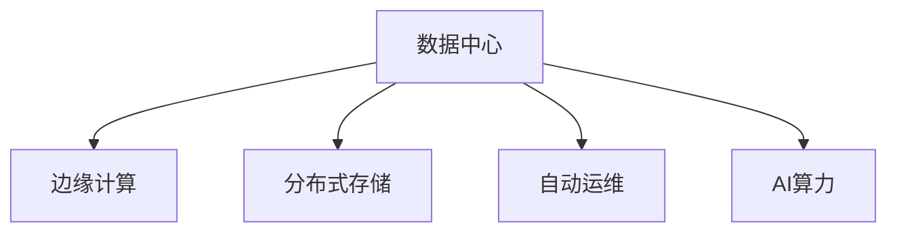

                 

## 1. 背景介绍

### 1.1 问题由来
近年来，人工智能(AI)技术迅猛发展，大模型在自然语言处理(NLP)、计算机视觉(CV)、语音识别(SR)等诸多领域展示了强大的应用潜力。然而，大规模模型的训练和部署，需要巨量的数据和强大的计算资源，这对数据中心建设和管理提出了巨大挑战。数据中心不仅是AI技术的重要基础设施，也是企业数字化转型不可或缺的支撑平台。

### 1.2 问题核心关键点
构建高效、稳定、安全的数据中心，对于推动AI大模型的落地应用至关重要。本文将详细介绍数据中心运营与管理的关键问题，从硬件选择、网络部署、安全策略、维护管理等多个方面进行全面解析。

## 2. 核心概念与联系

### 2.1 核心概念概述

为更好地理解AI大模型应用的数据中心运营与管理方法，本节将介绍几个密切相关的核心概念：

- **数据中心(Data Center, DC)**：提供AI计算和存储服务的设施，包含服务器、存储设备、网络设备、安全系统等。
- **边缘计算(Edge Computing)**：在网络边缘（靠近数据源）部署计算资源，减小数据传输延迟，提高应用响应速度。
- **分布式存储(Distributed Storage)**：将数据分散存储在多个节点上，提高数据可靠性和访问效率。
- **自动运维(Auto-Operations)**：通过自动化工具和系统，减少人工干预，提升运维效率。
- **AI算力(CAI)**：指数据中心为AI模型提供的计算和存储能力，包括CPU/GPU、TPU、FPGA等多种计算资源。

这些核心概念之间的逻辑关系可以通过以下Mermaid流程图来展示：



这个流程图展示了数据中心与AI应用的关键组成部分及其关系：

1. **数据中心**是AI计算的核心设施，负责提供计算和存储服务。
2. **边缘计算**通过减少数据传输，提高AI应用的响应速度。
3. **分布式存储**通过分散数据，提升数据可靠性和访问效率。
4. **自动运维**通过自动化手段，提升运维效率。
5. **AI算力**是数据中心为AI应用提供的计算和存储能力，包括多种计算资源。

这些概念共同构成了数据中心运营与管理的基本框架，使其能够高效支撑AI大模型的训练与部署。

## 3. 核心算法原理 & 具体操作步骤
### 3.1 算法原理概述

AI大模型应用的数据中心运营与管理，本质上是一个系统化的多目标优化问题。其核心目标包括：

- **高效性**：最大化数据中心的利用率，减少计算资源浪费。
- **稳定性**：确保数据中心的系统稳定运行，保障数据中心服务的安全可靠。
- **安全性**：保护数据和计算资源不受未授权访问，防止数据泄露和系统攻击。
- **可扩展性**：能够动态调整资源配置，适应业务需求的快速变化。

数据中心运营与管理的优化目标是找到一组最优的配置参数，使得上述目标函数达到最优。常用的目标函数包括：

$$
\min \{C_1 \times U_1 + C_2 \times U_2 + C_3 \times U_3 + C_4 \times U_4\}
$$

其中 $C_i$ 为第 $i$ 个目标的权重，$U_i$ 为第 $i$ 个目标的函数表达式。例如，计算资源的利用率 $U_1$ 可以通过服务器的负载率、CPU/GPU的使用率等指标来衡量。

### 3.2 算法步骤详解

基于上述目标函数，AI大模型应用的数据中心运营与管理可以分为以下关键步骤：

**Step 1: 确定目标函数和权重**
- 根据数据中心的具体需求，明确目标函数和各个目标的权重。例如，高利用率与高安全性的权衡，高稳定性与高可扩展性的权衡等。

**Step 2: 设计优化模型**
- 设计适用于目标函数的优化模型，如线性规划、整数规划、非线性优化等。例如，求解最小化计算资源消耗，最大化利用率的目标函数，可以得到最优的服务器配置方案。

**Step 3: 收集数据与建模**
- 收集数据中心的各种运行数据，如服务器状态、网络流量、存储容量、电力消耗等。
- 建立数学模型，将数据转化为优化模型所需的参数和变量。

**Step 4: 求解优化问题**
- 使用优化算法求解目标函数的最优解。例如，使用遗传算法、模拟退火、线性规划等算法求解计算资源配置的优化问题。

**Step 5: 实施与监控**
- 根据优化结果，调整数据中心的配置。例如，调整服务器数量、部署边缘计算节点、配置分布式存储系统等。
- 监控数据中心的运行状态，确保系统稳定运行，及时处理异常情况。

**Step 6: 持续优化**
- 定期收集新数据，更新优化模型，持续优化数据中心的资源配置和运营策略。

### 3.3 算法优缺点

数据中心运营与管理的优化算法具有以下优点：

1. **系统性优化**：综合考虑多个目标，从全局视角进行优化，避免单一目标导致的资源浪费。
2. **高效性**：通过系统优化，最大化计算资源利用率，降低运营成本。
3. **稳定性**：通过稳定运行监控和异常处理机制，保障数据中心的安全和可靠性。
4. **可扩展性**：能够动态调整资源配置，灵活适应业务需求的变化。

然而，该算法也存在以下局限性：

1. **数据收集复杂性**：需要全面收集数据中心的各种运行数据，数据来源和格式可能不一致，需要整合处理。
2. **模型复杂性**：优化模型的设计和求解可能非常复杂，需要具备较强的数学和工程能力。
3. **系统稳定性**：优化结果可能受限于现有硬件和软件环境，难以完全达到预期目标。
4. **运行成本**：优化算法和模型求解可能需要大量计算资源和时间，增加运营成本。

尽管存在这些局限性，但就目前而言，系统优化算法是数据中心运营与管理的主流方法。未来相关研究的重点在于如何进一步简化数据模型和求解过程，提升优化效率，同时兼顾资源配置的多目标优化。

### 3.4 算法应用领域

AI大模型应用的数据中心运营与管理，在以下领域得到了广泛应用：

- **企业数据中心**：通过优化资源配置，提升计算效率，降低运营成本。
- **云服务平台**：通过优化资源分配，提升服务质量和响应速度，增强用户满意度。
- **科研机构**：通过优化计算资源，支持大规模模型训练，推动科研创新。
- **智能制造**：通过优化数据中心运营，保障智能生产线的高效运行。
- **智慧城市**：通过优化城市数据中心，支撑智能交通、智能安防、智能医疗等应用。

随着AI技术的持续演进，数据中心运营与管理的应用范围将进一步扩展，为AI大模型的落地应用提供更坚实的技术支撑。

## 4. 数学模型和公式 & 详细讲解 & 举例说明

### 4.1 数学模型构建

本节将使用数学语言对AI大模型应用的数据中心运营与管理进行更加严格的刻画。

记数据中心为 $DC$，其运行状态为 $S$，可用计算资源为 $R$，可用存储资源为 $S$。定义目标函数 $F(S, R, S)$ 为数据中心的运行成本、利用率、安全性和稳定性，优化目标为：

$$
\min F(S, R, S)
$$

其中 $F$ 可以表示为：

$$
F = C_1 \times U_1 + C_2 \times U_2 + C_3 \times U_3 + C_4 \times U_4
$$

其中 $C_i$ 为第 $i$ 个目标的权重，$U_i$ 为第 $i$ 个目标的函数表达式。例如，计算资源的利用率 $U_1$ 可以通过服务器的负载率、CPU/GPU的使用率等指标来衡量。

### 4.2 公式推导过程

以下我们以计算资源利用率优化为例，推导最小化计算资源利用率的目标函数及其求解过程。

假设数据中心有 $N$ 台服务器，每台服务器的计算能力为 $P$，当前负载为 $L_i$，目标是最小化总计算资源的利用率 $U_1$。则优化目标为：

$$
\min U_1 = \frac{1}{N} \sum_{i=1}^N \frac{L_i}{P}
$$

令 $x_i$ 表示是否开启第 $i$ 台服务器的二进制变量，则有 $x_i = 1$ 表示开启第 $i$ 台服务器，$x_i = 0$ 表示关闭第 $i$ 台服务器。因此，优化问题可以表示为：

$$
\min \sum_{i=1}^N L_i
$$

受限于服务器的总数 $N$ 和计算能力 $P$，约束条件为：

$$
\begin{cases}
\sum_{i=1}^N x_i \leq N \\
x_i \in \{0, 1\} \\
\sum_{i=1}^N P \times x_i \geq P
\end{cases}
$$

该问题为整数规划问题，可以使用分支定界法、割平面法等求解。求解后得到的 $x_i$ 表示是否开启第 $i$ 台服务器，从而得到最小化计算资源利用率的方案。

### 4.3 案例分析与讲解

假设某企业数据中心有10台服务器，每台服务器的计算能力为4核CPU。当前总负载为150核CPU，目标是最小化计算资源利用率。

使用上述整数规划模型求解，可以得到开启5台服务器的最优方案，从而最小化计算资源利用率。

## 5. 项目实践：代码实例和详细解释说明
### 5.1 开发环境搭建

在进行数据中心运营与管理的项目实践前，我们需要准备好开发环境。以下是使用Python进行环境搭建的步骤：

1. 安装Anaconda：从官网下载并安装Anaconda，用于创建独立的Python环境。

2. 创建并激活虚拟环境：
```bash
conda create -n data-center python=3.8 
conda activate data-center
```

3. 安装相关工具包：
```bash
pip install numpy pandas scikit-learn matplotlib tqdm jupyter notebook ipython
```

完成上述步骤后，即可在`data-center`环境中进行项目开发。

### 5.2 源代码详细实现

下面我们以计算资源利用率优化为例，给出数据中心运营与管理的Python代码实现。

```python
from ortools.linear_solver import pywraplp

# 定义变量
n = 10  # 服务器总数
p = 4   # 每台服务器计算能力
l = 150 # 当前总负载

# 创建线性规划求解器
solver = pywraplp.Solver("DC_Optimization", pywraplp.Solver.GLOP_LINEAR_PROGRAMMING)

# 定义变量
x = [solver.NumVar(0, 1, "x") for i in range(n)]

# 定义目标函数
objective = solver.Minimize(sum(x[i] * p for i in range(n)))

# 定义约束条件
constraints = [
    solver.Add(sum(x[i] for i in range(n)) <= n),  # 总服务器数
    solver.Add(sum(x[i] * p for i in range(n)) >= p)  # 总计算能力
]

# 求解优化问题
solution = solver.Solve()

# 输出结果
for i in range(n):
    if solution.Value(x[i]) == 1:
        print(f"开启第{i+1}台服务器")
    else:
        print(f"关闭第{i+1}台服务器")
```

以上就是使用Python对数据中心计算资源利用率进行优化的完整代码实现。可以看到，通过使用线性规划工具，可以方便地求解优化问题，找到最小化计算资源利用率的方案。

### 5.3 代码解读与分析

让我们再详细解读一下关键代码的实现细节：

**变量定义**：
- `n`表示服务器总数，`p`表示每台服务器的计算能力，`l`表示当前总负载。

**线性规划求解器**：
- 使用Google OR-Tools库中的线性规划求解器，设置求解目标为最小化计算资源利用率。

**变量定义**：
- `x[i]`表示是否开启第 `i` 台服务器的二进制变量。

**目标函数**：
- 目标函数为最小化总计算资源的利用率，即所有开启服务器的计算能力之和。

**约束条件**：
- 约束条件包括总服务器数不超过 `n` 和总计算能力不小于 `p`。

**求解优化问题**：
- 调用求解器求解线性规划问题，得到最优解 `solution`。

**输出结果**：
- 根据求解结果，输出开启或关闭每台服务器的状态。

可以看到，Python配合OR-Tools库，使得数据中心计算资源利用率优化的代码实现变得简洁高效。开发者可以将更多精力放在数据处理、模型改进等高层逻辑上，而不必过多关注底层的实现细节。

## 6. 实际应用场景
### 6.1 企业数据中心

企业数据中心是AI技术的重要基础设施，通过优化资源配置，可以显著提升计算效率，降低运营成本。

在实际应用中，企业数据中心可以通过以下方式进行优化：

1. **资源池化**：将服务器、存储设备等资源进行池化管理，按需分配，避免资源浪费。
2. **计算资源共享**：采用虚拟化技术，将一台物理服务器划分为多个虚拟服务器，提升资源利用率。
3. **边缘计算部署**：在靠近数据源的地方部署边缘计算节点，减小数据传输延迟，提高应用响应速度。
4. **分布式存储优化**：通过合理规划存储资源，实现数据的高可用性和访问效率。
5. **自动运维系统**：引入自动化运维工具，如Prometheus、Kubernetes等，减少人工干预，提升运维效率。

这些措施可以有效提升企业数据中心的运营效率，支持AI大模型的训练和部署。

### 6.2 云服务平台

云服务平台通过优化资源分配，提升服务质量和响应速度，增强用户满意度。

在云服务平台中，可以通过以下方式进行优化：

1. **自动伸缩**：根据应用负载实时调整计算资源，避免资源浪费和不足。
2. **计算资源池化**：将计算资源进行池化管理，按需分配，提升资源利用率。
3. **边缘计算优化**：在靠近数据源的地方部署边缘计算节点，减小数据传输延迟，提高应用响应速度。
4. **分布式存储优化**：通过合理规划存储资源，实现数据的高可用性和访问效率。
5. **自动运维系统**：引入自动化运维工具，如Kubernetes、Prometheus等，减少人工干预，提升运维效率。

这些措施可以有效提升云服务平台的运营效率，支持AI大模型的训练和部署。

### 6.3 科研机构

科研机构通过优化计算资源，支持大规模模型训练，推动科研创新。

在科研机构中，可以通过以下方式进行优化：

1. **高性能计算集群**：构建高性能计算集群，提升大规模模型训练的效率。
2. **资源共享**：通过资源共享平台，实现计算资源的有效分配，避免资源浪费。
3. **边缘计算优化**：在靠近数据源的地方部署边缘计算节点，减小数据传输延迟，提高应用响应速度。
4. **分布式存储优化**：通过合理规划存储资源，实现数据的高可用性和访问效率。
5. **自动运维系统**：引入自动化运维工具，如SLURM、Gemini等，减少人工干预，提升运维效率。

这些措施可以有效提升科研机构的运营效率，支持AI大模型的训练和部署。

## 7. 工具和资源推荐
### 7.1 学习资源推荐

为了帮助开发者系统掌握数据中心运营与管理的技术基础和实践技巧，这里推荐一些优质的学习资源：

1. **《数据中心运营与管理》系列书籍**：详细介绍了数据中心的基础设施、网络部署、安全策略、运维管理等内容。
2. **《云计算：原理与技术》课程**：介绍云计算平台的设计原理和核心技术，涵盖数据中心运营管理的多个方面。
3. **《数据中心能源管理》教材**：专注于数据中心的能源消耗和环境控制，提供详细的数据中心能源管理和优化方法。
4. **Google Cloud Platform (GCP) 文档**：提供丰富的数据中心运营管理文档，涵盖从基础架构到云服务的所有内容。
5. **AWS 数据中心技术博客**：提供亚马逊AWS平台的数据中心技术实践和优化经验。

通过对这些资源的学习实践，相信你一定能够快速掌握数据中心运营与管理的关键技术，并用于支持AI大模型的训练和部署。

### 7.2 开发工具推荐

高效的开发离不开优秀的工具支持。以下是几款用于数据中心运营与管理开发的常用工具：

1. **Google Cloud Platform (GCP)**：提供丰富的云服务，包括计算、存储、网络、安全等，支持大规模数据中心的应用部署。
2. **AWS (Amazon Web Services)**：提供全球领先的云服务，涵盖数据中心运营管理的各个方面。
3. **Microsoft Azure**：提供广泛的云服务，支持大规模数据中心的构建和运营。
4. **VMware vSphere**：提供企业级虚拟化平台，支持高效的数据中心资源管理和调度。
5. **OpenStack**：提供开源云计算平台，支持数据中心基础设施的构建和运维。

合理利用这些工具，可以显著提升数据中心运营与管理的效率，加快创新迭代的步伐。

### 7.3 相关论文推荐

数据中心运营与管理的研究源于学界的持续研究。以下是几篇奠基性的相关论文，推荐阅读：

1. **"Power Aware Data Center Management and Optimization"**：介绍数据中心能耗优化的方法，提供详尽的电力消耗分析和优化策略。
2. **"The Design and Operation of Large-Scale Data Centers"**：详细介绍了大规模数据中心的构建和运营方法，涵盖网络、存储、安全等多个方面。
3. **"Cost-Aware Resource Allocation in Multi-Cloud Environments"**：研究多云环境下的资源分配和优化方法，提供详细的成本分析和管理策略。
4. **"Energy-Efficient Data Center Design and Operations"**：介绍数据中心能源管理的方法，提供高效能源使用的优化策略。
5. **"Cloud Computing: Principles and Practice"**：详细介绍云计算平台的设计原理和核心技术，涵盖数据中心运营管理的多个方面。

这些论文代表了大模型数据中心运营与管理的发展脉络。通过学习这些前沿成果，可以帮助研究者把握学科前进方向，激发更多的创新灵感。

## 8. 总结：未来发展趋势与挑战

### 8.1 总结

本文对AI大模型应用的数据中心运营与管理方法进行了全面系统的介绍。首先阐述了数据中心建设和管理的重要性，明确了数据中心在AI应用中的核心作用。其次，从原理到实践，详细讲解了数据中心运营与管理的数学模型和关键步骤，给出了数据中心计算资源利用率优化的代码实例。同时，本文还广泛探讨了数据中心在企业、云平台、科研机构等诸多行业领域的应用前景，展示了数据中心运营管理的巨大潜力。此外，本文精选了数据中心运营管理的各类学习资源，力求为读者提供全方位的技术指引。

通过本文的系统梳理，可以看到，数据中心运营与管理对于AI大模型的落地应用至关重要。这些措施不仅可以显著提升计算资源的利用效率，降低运营成本，还能保障数据中心的安全和稳定性，为AI应用的可持续发展提供坚实的技术保障。未来，伴随数据中心技术的不断演进，数据中心将迎来更多创新应用，为AI大模型的广泛落地提供更坚实的基础。

### 8.2 未来发展趋势

展望未来，数据中心运营与管理技术将呈现以下几个发展趋势：

1. **智能化管理**：引入人工智能技术，进行更精准的资源优化和预测分析，提升数据中心的管理水平。
2. **自动化运维**：通过自动化运维工具，减少人工干预，提升运维效率和可靠性。
3. **边缘计算普及**：在更多应用场景中引入边缘计算，减小数据传输延迟，提高应用响应速度。
4. **分布式存储优化**：采用更加先进的分层存储技术，提升数据存储和访问效率。
5. **绿色低碳**：采用节能减排技术，减少数据中心的能源消耗和环境影响。
6. **安全防护升级**：引入更加强大的安全防护措施，保护数据和计算资源不受未授权访问和攻击。

这些趋势凸显了数据中心运营与管理技术的广阔前景。这些方向的探索发展，必将进一步提升数据中心的运营效率和安全性，为AI大模型的落地应用提供更坚实的技术支撑。

### 8.3 面临的挑战

尽管数据中心运营与管理技术已经取得了瞩目成就，但在迈向更加智能化、普适化应用的过程中，它仍面临着诸多挑战：

1. **资源优化复杂性**：数据中心涉及的资源种类繁多，优化过程复杂，需要全面考虑多目标优化。
2. **运行稳定性**：数据中心的硬件和软件环境复杂，系统稳定性难以完全保障。
3. **成本控制**：数据中心建设和运营成本高昂，如何在资源优化和成本控制之间找到平衡，需要更多实践经验的积累。
4. **数据安全**：数据中心的存储和传输过程中，数据安全和隐私保护成为重要问题。
5. **能效管理**：数据中心的能耗管理需要更高效的能源使用和更先进的节能技术。

尽管存在这些挑战，但就目前而言，数据中心运营与管理技术是AI大模型应用的重要保障。未来相关研究的重点在于如何进一步简化数据模型和求解过程，提升优化效率，同时兼顾资源配置的多目标优化和能效管理，确保数据中心的安全和稳定运行。

### 8.4 研究展望

面向未来，数据中心运营与管理技术需要从以下几个方面进行深入研究：

1. **人工智能技术引入**：通过引入人工智能技术，进行更精准的资源优化和预测分析，提升数据中心的管理水平。
2. **自动化运维优化**：进一步优化自动化运维工具，减少人工干预，提升运维效率和可靠性。
3. **边缘计算研究**：研究边缘计算的应用场景和优化方法，提升数据传输效率和应用响应速度。
4. **分布式存储创新**：研究更先进的分布式存储技术，提升数据存储和访问效率。
5. **能效管理创新**：引入更高效的节能技术和更先进的能源使用策略，实现绿色低碳的数据中心运营。
6. **安全防护技术**：研究更强大的安全防护措施，保护数据和计算资源不受未授权访问和攻击。

这些研究方向的探索，必将引领数据中心运营与管理技术迈向更高的台阶，为AI大模型的落地应用提供更坚实的技术保障。面向未来，数据中心运营与管理技术还需要与其他人工智能技术进行更深入的融合，如知识表示、因果推理、强化学习等，多路径协同发力，共同推动AI技术的发展和应用。只有勇于创新、敢于突破，才能不断拓展数据中心的边界，为AI大模型的广泛落地提供更坚实的基础。

## 9. 附录：常见问题与解答

**Q1：数据中心如何实现高效资源管理？**

A: 数据中心可以通过以下方式实现高效资源管理：

1. **资源池化**：将服务器、存储设备等资源进行池化管理，按需分配，避免资源浪费。
2. **计算资源共享**：采用虚拟化技术，将一台物理服务器划分为多个虚拟服务器，提升资源利用率。
3. **自动化运维系统**：引入自动化运维工具，如Prometheus、Kubernetes等，减少人工干预，提升运维效率。
4. **边缘计算优化**：在靠近数据源的地方部署边缘计算节点，减小数据传输延迟，提高应用响应速度。
5. **分布式存储优化**：通过合理规划存储资源，实现数据的高可用性和访问效率。

这些措施可以有效提升数据中心的资源管理效率，支持AI大模型的训练和部署。

**Q2：数据中心如何保障系统的稳定性？**

A: 数据中心可以通过以下方式保障系统的稳定性：

1. **冗余设计**：在硬件和网络设计中引入冗余机制，提高系统的容错能力。
2. **故障检测和恢复**：实时监控系统的运行状态，及时发现并处理故障，保障系统的连续运行。
3. **自动化运维**：引入自动化运维工具，如Kubernetes、Prometheus等，减少人工干预，提升系统的稳定性和可靠性。
4. **安全防护措施**：引入防火墙、入侵检测系统等安全措施，保护数据中心的安全。
5. **负载均衡**：通过负载均衡技术，合理分配系统负载，避免系统过载崩溃。

这些措施可以有效提升数据中心的系统稳定性，保障AI大模型的训练和部署。

**Q3：数据中心如何降低运营成本？**

A: 数据中心可以通过以下方式降低运营成本：

1. **资源池化**：将服务器、存储设备等资源进行池化管理，按需分配，避免资源浪费。
2. **计算资源共享**：采用虚拟化技术，将一台物理服务器划分为多个虚拟服务器，提升资源利用率。
3. **边缘计算部署**：在靠近数据源的地方部署边缘计算节点，减小数据传输延迟，提高应用响应速度。
4. **分布式存储优化**：通过合理规划存储资源，实现数据的高可用性和访问效率。
5. **自动运维系统**：引入自动化运维工具，如Kubernetes、Prometheus等，减少人工干预，提升运维效率。
6. **节能减排技术**：采用更高效的能源使用和更先进的节能技术，实现绿色低碳的数据中心运营。

这些措施可以有效降低数据中心的运营成本，支持AI大模型的训练和部署。

**Q4：数据中心如何实现能效管理？**

A: 数据中心可以通过以下方式实现能效管理：

1. **高效能源使用**：采用更高效的能源使用技术，如电力电子、新材料等，提升能源使用效率。
2. **节能减排技术**：引入更先进的节能技术，如热回收、自然冷却等，实现绿色低碳的数据中心运营。
3. **数据中心优化设计**：优化数据中心的结构设计，降低能耗和空间占用。
4. **能源管理系统**：引入能源管理系统，实时监控和调整能源使用，优化能效。
5. **节能政策**：引入政府的节能政策和激励措施，推动数据中心的节能减排。

这些措施可以有效提升数据中心的能效管理，支持AI大模型的训练和部署。

**Q5：数据中心如何保障数据安全？**

A: 数据中心可以通过以下方式保障数据安全：

1. **数据加密**：对存储和传输的数据进行加密处理，防止数据泄露。
2. **访问控制**：通过身份认证、权限控制等技术，保障数据中心的安全。
3. **安全防护措施**：引入防火墙、入侵检测系统等安全措施，保护数据中心的安全。
4. **数据备份和恢复**：定期备份数据，实现数据的快速恢复，保障数据的完整性和可用性。
5. **安全审计**：实时监控数据中心的访问日志，及时发现和处理安全威胁。

这些措施可以有效保障数据中心的数据安全，支持AI大模型的训练和部署。

**Q6：数据中心如何应对数据中心硬件和软件环境复杂性？**

A: 数据中心可以通过以下方式应对数据中心硬件和软件环境复杂性：

1. **冗余设计**：在硬件和网络设计中引入冗余机制，提高系统的容错能力。
2. **故障检测和恢复**：实时监控系统的运行状态，及时发现并处理故障，保障系统的连续运行。
3. **自动化运维**：引入自动化运维工具，如Kubernetes、Prometheus等，减少人工干预，提升系统的稳定性和可靠性。
4. **系统优化**：通过系统优化，提升硬件和软件的运行效率，减少故障和性能瓶颈。
5. **灾难恢复计划**：制定灾难恢复计划，确保数据中心在灾难发生时能够快速恢复。

这些措施可以有效应对数据中心硬件和软件环境复杂性，保障AI大模型的训练和部署。

**Q7：数据中心如何优化分布式存储系统？**

A: 数据中心可以通过以下方式优化分布式存储系统：

1. **分层存储**：将数据分为热数据、温数据和冷数据，根据访问频率选择不同存储层，提升存储效率。
2. **数据冗余**：通过数据冗余技术，提高数据的可靠性和可用性。
3. **数据压缩**：对存储数据进行压缩处理，减小存储容量和传输带宽。
4. **数据加密**：对存储数据进行加密处理，保护数据安全。
5. **负载均衡**：通过负载均衡技术，合理分配数据存储，提升存储系统的扩展性和性能。

这些措施可以有效优化数据中心的分布式存储系统，支持AI大模型的训练和部署。

**Q8：数据中心如何引入人工智能技术？**

A: 数据中心可以通过以下方式引入人工智能技术：

1. **智能运维系统**：引入智能运维系统，通过机器学习和数据分析，进行更精准的资源优化和故障预测。
2. **预测分析**：通过预测分析技术，进行更精准的资源预测和管理，提升数据中心的管理效率。
3. **自动化流程**：通过自动化流程，提升数据中心的操作效率和稳定性。
4. **优化算法**：引入优化算法，进行更高效的资源分配和调度。

这些措施可以有效引入人工智能技术，提升数据中心的运营效率和管理系统。

---

作者：禅与计算机程序设计艺术 / Zen and the Art of Computer Programming

