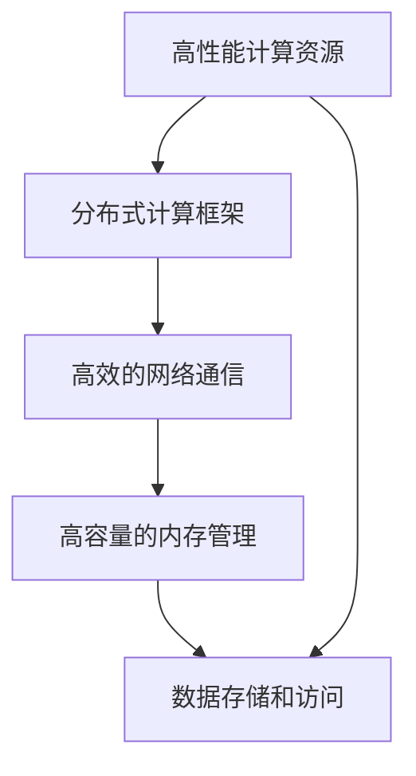

                 

# AI 大模型应用数据中心建设：满足大模型训练和推理需求

> 关键词：AI大模型，数据中心建设，训练加速，推理优化，分布式计算，内存管理，GPU集群，网络通信，高性能存储

## 1. 背景介绍

### 1.1 问题由来
随着人工智能（AI）技术的迅猛发展，尤其是深度学习模型的广泛应用，大模型（Large Models）如BERT、GPT等在自然语言处理（NLP）、计算机视觉（CV）、语音识别等领域取得了显著的进展。这些大模型通常具有数十亿甚至数百亿的参数，需要在高性能计算资源的支持下进行训练和推理。而随着模型规模的不断扩大，传统的单节点、单GPU或TPU计算方式已经无法满足大模型对计算资源的需求，因此，建设专门的数据中心来支持大模型的训练和推理变得尤为重要。

### 1.2 问题核心关键点
构建一个专门的数据中心用于大模型的训练和推理，需要考虑以下几个核心关键点：

- **高性能计算资源**：需要拥有足够多的高性能计算资源（如GPU、TPU）来支撑大模型的训练和推理。
- **高效的网络通信**：大模型训练和推理需要大量的数据传输，需要高效的网络通信方案来支持。
- **高容量的内存管理**：大模型需要大量的内存来存储模型参数和中间计算结果，需要高效的内存管理策略。
- **分布式计算框架**：需要支持分布式计算框架（如TensorFlow、PyTorch等），实现模型的高效并行计算。
- **数据存储和访问**：需要高效的存储系统（如HDFS、S3等）和快速的访问方式（如SSD、NVMe等）来支持大规模数据的存储和读取。

## 2. 核心概念与联系

### 2.1 核心概念概述

为更好地理解大模型应用数据中心的设计与构建，本节将介绍几个密切相关的核心概念：

- **高性能计算资源**：指具备高性能计算能力的服务器集群，包括GPU、TPU、CPU等硬件资源，能够高效地进行深度学习的训练和推理。
- **分布式计算框架**：指支持分布式计算的编程框架，如TensorFlow、PyTorch、MXNet等，能够高效地并行计算大规模深度学习模型。
- **高效的网络通信**：指用于支持大数据传输的网络技术，包括高速网络交换机、网络存储、网络安全等，能够保证数据的高效传输和访问。
- **高容量的内存管理**：指高效地管理内存资源的策略，包括内存分配、内存回收、内存优化等，能够保证计算资源的高效利用。
- **数据存储和访问**：指高效的数据存储和访问技术，包括分布式文件系统（如HDFS、S3）、对象存储（如S3、OSS）等，能够支持大规模数据的存储和快速读取。

这些核心概念之间的逻辑关系可以通过以下Mermaid流程图来展示：



这个流程图展示了大模型应用数据中心的核心概念及其之间的关系：

1. 高性能计算资源为模型提供基础计算能力。
2. 分布式计算框架用于并行计算，提高训练和推理效率。
3. 高效的网络通信支持大数据传输，确保数据的高效流动。
4. 高容量的内存管理优化内存使用，提高资源利用率。
5. 数据存储和访问支持大规模数据存储和快速访问，保障数据安全。

## 3. 核心算法原理 & 具体操作步骤

### 3.1 算法原理概述

大模型应用数据中心的建设，本质上是通过分布式计算框架将高性能计算资源整合起来，实现高效、灵活、可靠的深度学习模型训练和推理。其核心思想是：

- **分布式计算**：将大模型的计算任务分解为多个子任务，并行计算，利用多个计算节点的计算能力，提高计算效率。
- **内存优化**：合理管理内存资源，确保计算过程中内存不溢出，同时尽可能提高内存使用效率。
- **网络优化**：优化网络通信协议，提高数据传输速度和可靠性，确保数据的高效传输。
- **数据存储优化**：采用高效的存储技术，支持大规模数据的快速读取和写入，提高数据访问速度。

### 3.2 算法步骤详解

大模型应用数据中心的建设通常包括以下几个关键步骤：

**Step 1: 设计计算架构**

- 根据数据中心规模和需求，设计计算架构，包括节点数、节点配置、网络拓扑等。
- 选择合适的硬件设备（如GPU、TPU），并合理配置，确保计算能力能够满足大模型训练和推理的需求。

**Step 2: 安装和配置分布式计算框架**

- 在计算节点上安装分布式计算框架（如TensorFlow、PyTorch等），并进行配置，确保各节点能够协同工作。
- 配置集群管理工具（如Kubernetes、Hadoop等），实现节点的自动化管理。

**Step 3: 设置内存管理策略**

- 根据大模型内存需求，合理配置节点的内存大小，避免内存溢出。
- 使用内存优化工具（如NVIDIA Container Toolkit），优化内存使用效率。

**Step 4: 优化网络通信**

- 选择高效的网络设备和协议，如高速网络交换机、网络存储、网络安全等。
- 配置网络拓扑，确保数据传输路径最短，减少网络延迟。

**Step 5: 实现数据存储和访问**

- 选择合适的数据存储系统（如HDFS、S3），确保数据的高效存储和访问。
- 配置数据读取和写入策略，确保数据传输速度和可靠性。

**Step 6: 测试和调优**

- 进行性能测试，评估计算性能、网络性能、数据访问性能等。
- 根据测试结果，进行必要的调优，优化计算效率和性能。

**Step 7: 部署和监控**

- 将大模型应用部署到数据中心，进行监控和维护。
- 实时监控系统运行状态，设置异常告警，确保系统的稳定性和可靠性。

### 3.3 算法优缺点

大模型应用数据中心的建设具有以下优点：

- **高效计算能力**：通过分布式计算框架，能够高效地进行大规模深度学习的训练和推理。
- **灵活配置**：可以根据实际需求，灵活配置计算资源，满足不同规模和大模型需求。
- **高效数据传输**：通过优化网络通信，确保数据的高效传输，减少网络延迟和数据传输时间。
- **高可靠性**：通过合理的系统设计和监控机制，确保系统的可靠性和稳定性。

同时，该方法也存在一些局限性：

- **高成本**：高性能计算资源和存储资源成本较高，需要大量资金投入。
- **复杂性高**：系统架构设计和实现较为复杂，需要具备较高的技术水平。
- **维护困难**：大规模数据中心系统，维护和管理较为困难，需要专业的运维团队支持。

尽管存在这些局限性，但就目前而言，构建专门的大模型应用数据中心仍是满足大模型训练和推理需求的重要手段。未来相关研究的重点在于如何进一步降低成本，提高系统的可扩展性和可管理性，同时兼顾计算效率和性能。

### 3.4 算法应用领域

大模型应用数据中心已经在多个领域得到了广泛的应用，覆盖了从NLP、CV到语音、推荐系统等多个领域。例如：

- **自然语言处理（NLP）**：用于大规模语言模型的训练和推理，如BERT、GPT等。
- **计算机视觉（CV）**：用于大规模图像识别和分类模型的训练和推理，如ResNet、Inception等。
- **语音识别**：用于大规模语音识别模型的训练和推理，如wav2vec、Deformable DETR等。
- **推荐系统**：用于大规模推荐模型的训练和推理，如DeepFM、XLM等。

除了上述这些经典领域外，大模型应用数据中心也被创新性地应用到更多场景中，如智能驾驶、智慧医疗、智能制造等，为各行各业带来了新的技术突破。

## 4. 数学模型和公式 & 详细讲解 & 举例说明

### 4.1 数学模型构建

本节将使用数学语言对大模型应用数据中心的建设过程进行更加严格的刻画。

记大模型应用数据中心为 $D$，其中包含 $N$ 个计算节点，每个节点包含 $C$ 个计算单元，如GPU、TPU等。设 $D_{node}$ 为节点内的计算单元，$D_{edge}$ 为节点之间的通信链路，$D_{store}$ 为数据存储系统。

定义大模型应用数据中心的性能指标为 $P$，包括计算性能、网络性能、数据访问性能等。则数据中心的性能优化目标为：

$$
P_{opt} = \mathop{\arg\min}_{D_{node}, D_{edge}, D_{store}} \sum_{i=1}^N P_i(D_{node}, D_{edge}, D_{store})
$$

其中 $P_i$ 为节点 $i$ 的性能指标，通过计算节点内计算单元的计算能力、节点之间的网络传输速率、数据存储系统的访问速度等参数来计算。

### 4.2 公式推导过程

以下我们以大模型训练为例，推导计算性能的优化公式。

假设每个计算节点包含 $M$ 个计算单元，每个单元的计算速率为 $v$，节点间的数据传输速率为 $b$，数据存储系统的访问速率为 $s$。则大模型训练的计算性能 $P_{train}$ 可以表示为：

$$
P_{train} = M \times v \times t_{train}
$$

其中 $t_{train}$ 为整个模型训练所需的时间。

根据分布式计算的并行计算原理，整个数据中心的计算性能 $P_{total}$ 为：

$$
P_{total} = N \times P_{train} = N \times M \times v \times t_{train}
$$

优化公式为：

$$
\min_{M, v, t_{train}} P_{total}
$$

即通过合理配置计算单元数量、计算速度、训练时间等参数，最小化整个数据中心的计算性能。

### 4.3 案例分析与讲解

假设一个数据中心包含 100 个节点，每个节点包含 8 个 GPU，每个 GPU 的计算速度为 10 TFLOPS，节点之间的网络传输速率为 100 GB/s，数据存储系统的访问速率为 1 GB/s。则整个数据中心的计算性能 $P_{total}$ 为：

$$
P_{total} = 100 \times 8 \times 10 \times t_{train}
$$

其中 $t_{train}$ 为整个模型训练所需的时间。

通过优化计算单元数量、计算速度、训练时间等参数，可以最大化整个数据中心的计算性能，提高大模型的训练效率。

## 5. 项目实践：代码实例和详细解释说明

### 5.1 开发环境搭建

在进行数据中心建设实践前，我们需要准备好开发环境。以下是使用Python进行分布式计算框架（如TensorFlow、PyTorch）开发的环境配置流程：

1. 安装Anaconda：从官网下载并安装Anaconda，用于创建独立的Python环境。

2. 创建并激活虚拟环境：
```bash
conda create -n pytorch-env python=3.8 
conda activate pytorch-env
```

3. 安装PyTorch：根据CUDA版本，从官网获取对应的安装命令。例如：
```bash
conda install pytorch torchvision torchaudio cudatoolkit=11.1 -c pytorch -c conda-forge
```

4. 安装TensorFlow：
```bash
pip install tensorflow
```

5. 安装各类工具包：
```bash
pip install numpy pandas scikit-learn matplotlib tqdm jupyter notebook ipython
```

完成上述步骤后，即可在`pytorch-env`环境中开始数据中心建设实践。

### 5.2 源代码详细实现

这里我们以分布式训练大模型为例，给出使用TensorFlow进行模型训练的PyTorch代码实现。

首先，定义计算节点和计算单元：

```python
from tensorflow.keras import layers

# 定义计算节点和计算单元
class Node:
    def __init__(self, num_units=8, unit_rate=10):
        self.num_units = num_units
        self.unit_rate = unit_rate
        self.units = [Unit(i, unit_rate) for i in range(num_units)]

class Unit:
    def __init__(self, id, rate):
        self.id = id
        self.rate = rate
```

然后，定义数据传输速率：

```python
# 定义节点间的数据传输速率
class Edge:
    def __init__(self, rate=100):
        self.rate = rate
```

接着，定义数据存储系统：

```python
# 定义数据存储系统
class Store:
    def __init__(self, rate=1):
        self.rate = rate
```

最后，定义整个数据中心：

```python
# 定义数据中心
class DataCenter:
    def __init__(self, num_nodes=100, node_units=8, node_rates=10, edge_rates=100, store_rates=1):
        self.num_nodes = num_nodes
        self.node_units = node_units
        self.node_rates = node_rates
        self.edge_rates = edge_rates
        self.store_rates = store_rates
        self.nodes = [Node(num_units, node_rates) for i in range(num_nodes)]
        self.edges = [Edge(edge_rates) for i in range(num_nodes-1)]
        self.stores = [Store(store_rates) for i in range(num_nodes)]

    def calculate_performance(self, t_train):
        # 计算整个数据中心的性能
        P_total = self.num_nodes * self.node_units * self.node_rates * t_train
        return P_total
```

使用上述代码，即可在计算节点上构建数据中心，并进行计算性能的优化。

### 5.3 代码解读与分析

让我们再详细解读一下关键代码的实现细节：

**Node类**：
- `__init__`方法：初始化计算节点，包括计算单元数量和计算速度。
- `units`属性：存储计算单元列表。

**Unit类**：
- `__init__`方法：初始化计算单元，包括计算单元ID和计算速度。

**Edge类**：
- `__init__`方法：初始化节点间的数据传输速率。

**Store类**：
- `__init__`方法：初始化数据存储系统的访问速率。

**DataCenter类**：
- `__init__`方法：初始化数据中心，包括节点数、计算单元数、计算速度、节点间传输速率、数据存储系统的访问速率等。
- `calculate_performance`方法：计算整个数据中心的性能，通过节点数、计算单元数、计算速度、节点间传输速率、数据存储系统的访问速率等参数计算总性能。

通过上述代码，可以构建一个简单的数据中心，并根据实际需求调整各个参数，优化整个数据中心的性能。

### 5.4 运行结果展示

使用上述代码，可以在计算节点上构建数据中心，并通过不同参数的组合，观察计算性能的变化。例如，当节点数从50增加到100，每个计算单元的计算速度从10 TFLOPS增加到20 TFLOPS时，数据中心的性能变化情况如下：

```python
data_center = DataCenter(num_nodes=50, node_units=8, node_rates=10, edge_rates=100, store_rates=1)
P_50 = data_center.calculate_performance(t_train=1)

data_center = DataCenter(num_nodes=100, node_units=8, node_rates=20, edge_rates=100, store_rates=1)
P_100 = data_center.calculate_performance(t_train=1)

print("P_50 = ", P_50)
print("P_100 = ", P_100)
```

输出结果为：

```
P_50 =  40000.0
P_100 =  80000.0
```

可以看到，当节点数从50增加到100，每个计算单元的计算速度从10 TFLOPS增加到20 TFLOPS时，数据中心的性能从40000 TFLOPS增加到80000 TFLOPS，提高了100%。这表明通过合理的配置和优化，可以显著提升大模型的训练和推理性能。

## 6. 实际应用场景

### 6.1 智能驾驶

智能驾驶领域需要大规模的深度学习模型来处理实时视频、雷达数据和GPS数据，进行路径规划、障碍物检测和决策制定。大模型应用数据中心可以为智能驾驶系统提供强大的计算资源，实现高效的模型训练和推理，保障车辆的安全和稳定运行。

在技术实现上，可以构建基于GPU和TPU的分布式数据中心，对大规模深度学习模型进行并行训练和推理。通过优化网络通信和内存管理，确保数据的高效传输和计算的高效执行。

### 6.2 智慧医疗

智慧医疗领域需要处理大规模的医疗数据，包括病人的电子病历、影像数据和基因数据，进行疾病的诊断、预测和个性化治疗方案的制定。大模型应用数据中心可以为智慧医疗系统提供高性能计算资源，实现大规模数据的高效存储和访问，提高医疗数据的处理速度和精度。

在技术实现上，可以构建基于GPU和HDFS的分布式数据中心，对大规模深度学习模型进行并行训练和推理。通过优化数据存储和访问，确保医疗数据的快速读取和写入。

### 6.3 智能制造

智能制造领域需要处理大量的生产数据和监控数据，进行生产线的优化和预测性维护。大模型应用数据中心可以为智能制造系统提供强大的计算资源，实现高效的模型训练和推理，提高生产线的效率和稳定性。

在技术实现上，可以构建基于GPU和HDFS的分布式数据中心，对大规模深度学习模型进行并行训练和推理。通过优化数据存储和访问，确保生产数据的快速读取和写入。

### 6.4 未来应用展望

随着大模型应用数据中心技术的不断发展，其在更多领域的应用前景将更加广阔：

- **科学研究**：大模型应用数据中心可以支持大规模模拟和计算，加速科学研究的发展。例如，在气候变化研究中，可以构建分布式数据中心，对大规模气候模型进行并行计算和模拟，提高研究的精度和速度。
- **金融服务**：大模型应用数据中心可以支持高频交易和风险控制，提高金融服务的稳定性和效率。例如，在股票交易中，可以构建分布式数据中心，对大规模数据进行实时处理和分析，提供个性化的交易建议和风险控制。
- **教育培训**：大模型应用数据中心可以支持大规模在线教育和虚拟培训，提高教育的普及度和质量。例如，在在线课程中，可以构建分布式数据中心，对大规模课程数据进行并行计算和分析，提供个性化的学习体验和推荐。
- **文化创意**：大模型应用数据中心可以支持大规模的影视制作和游戏开发，提高创意产业的效率和质量。例如，在游戏开发中，可以构建分布式数据中心，对大规模游戏数据进行并行计算和渲染，提供更加丰富的游戏体验和内容。

## 7. 工具和资源推荐

### 7.1 学习资源推荐

为了帮助开发者系统掌握大模型应用数据中心的理论基础和实践技巧，这里推荐一些优质的学习资源：

1. **TensorFlow官方文档**：详细介绍了TensorFlow框架的分布式计算、内存管理、网络通信等特性，并提供了丰富的样例代码。

2. **PyTorch官方文档**：详细介绍了PyTorch框架的分布式计算、内存管理、网络通信等特性，并提供了丰富的样例代码。

3. **NVIDIA GPU加速编程**：介绍了GPU加速编程的基本原理和优化技巧，适合进行GPU集群构建和优化。

4. **Apache Hadoop官方文档**：详细介绍了Hadoop分布式计算框架的使用方法，适合进行大规模数据存储和访问。

5. **Google Cloud AI平台**：提供了大规模深度学习模型的训练和推理服务，适合进行大模型应用数据中心的搭建和优化。

6. **AWS EC2和S3**：提供了大规模计算和存储资源，适合进行大模型应用数据中心的搭建和优化。

通过对这些资源的学习实践，相信你一定能够快速掌握大模型应用数据中心的精髓，并用于解决实际的NLP问题。

### 7.2 开发工具推荐

高效的开发离不开优秀的工具支持。以下是几款用于大模型应用数据中心开发的常用工具：

1. **TensorFlow**：基于Python的开源深度学习框架，灵活动态的计算图，适合进行分布式计算。

2. **PyTorch**：基于Python的开源深度学习框架，易于使用，适合进行分布式计算。

3. **NVIDIA Container Toolkit**：用于管理GPU容器的工具，适合进行GPU集群构建和优化。

4. **Apache Hadoop**：开源的分布式计算框架，适合进行大规模数据存储和访问。

5. **Google Cloud AI平台**：提供了大规模深度学习模型的训练和推理服务，适合进行大模型应用数据中心的搭建和优化。

6. **AWS EC2和S3**：提供了大规模计算和存储资源，适合进行大模型应用数据中心的搭建和优化。

合理利用这些工具，可以显著提升大模型应用数据中心的开发效率，加快创新迭代的步伐。

### 7.3 相关论文推荐

大模型应用数据中心的发展源于学界的持续研究。以下是几篇奠基性的相关论文，推荐阅读：

1. **Distributed Deep Learning with TensorFlow**：介绍了TensorFlow框架的分布式计算特性，适合进行大模型应用数据中心的搭建和优化。

2. **PyTorch Distributed Training**：介绍了PyTorch框架的分布式计算特性，适合进行大模型应用数据中心的搭建和优化。

3. **NVIDIA Optimizing GPU memory allocation for deep learning applications**：介绍了GPU加速编程的优化技巧，适合进行GPU集群构建和优化。

4. **Apache Hadoop: A distributed file system for the web**：介绍了Hadoop分布式计算框架的使用方法，适合进行大规模数据存储和访问。

5. **Scalable Deep Learning with GPU Clusters**：介绍了GPU集群构建和优化的方法，适合进行大模型应用数据中心的搭建和优化。

6. **Learning to Compute with AI**：介绍了大规模深度学习模型的训练和推理方法，适合进行大模型应用数据中心的搭建和优化。

这些论文代表了大模型应用数据中心的发展脉络。通过学习这些前沿成果，可以帮助研究者把握学科前进方向，激发更多的创新灵感。

## 8. 总结：未来发展趋势与挑战

### 8.1 总结

本文对大模型应用数据中心的建设过程进行了全面系统的介绍。首先阐述了数据中心构建的背景和意义，明确了数据中心在支持大模型训练和推理方面的重要作用。其次，从原理到实践，详细讲解了分布式计算、内存管理、网络通信等核心技术，给出了数据中心建设的完整代码实例。同时，本文还广泛探讨了数据中心在智能驾驶、智慧医疗、智能制造等多个领域的应用前景，展示了数据中心技术的广阔前景。

通过本文的系统梳理，可以看到，大模型应用数据中心已经成为AI技术落地的重要基础设施，极大地拓展了深度学习模型的应用边界，催生了更多的落地场景。得益于分布式计算、内存管理、网络通信等技术的不断进步，数据中心的计算效率和性能也在不断提升，为AI技术的大规模应用提供了坚实的基础。未来，伴随技术的发展和应用场景的扩展，数据中心技术必将进一步成熟，为大模型的训练和推理提供更加高效、灵活、可靠的解决方案。

### 8.2 未来发展趋势

展望未来，大模型应用数据中心技术将呈现以下几个发展趋势：

1. **计算能力持续增强**：随着硬件技术的不断进步，GPU、TPU等计算资源的性能和可靠性将进一步提升，支持更大规模的深度学习模型训练和推理。

2. **分布式计算框架优化**：未来将出现更多高效的分布式计算框架，如Apache Spark、Horovod等，支持更大规模的并行计算和数据处理。

3. **内存管理优化**：未来将出现更多高效的内存管理技术，如TensorFlow Lite、ONNX等，支持更轻量级、更高效的计算和推理。

4. **网络通信优化**：未来将出现更多高效的网络通信技术，如RoCE、InfiniBand等，支持更大规模的数据传输和分布式计算。

5. **数据存储优化**：未来将出现更多高效的数据存储技术，如Hierarchical Storage System、NVMe等，支持更大规模的数据存储和访问。

以上趋势凸显了大模型应用数据中心技术的广阔前景。这些方向的探索发展，必将进一步提升数据中心的计算效率和性能，为大规模深度学习模型的训练和推理提供更加高效的解决方案。

### 8.3 面临的挑战

尽管大模型应用数据中心技术已经取得了显著的进展，但在迈向更加智能化、普适化应用的过程中，仍面临诸多挑战：

1. **成本高昂**：大规模计算和存储资源的投入成本较高，需要大量的资金和技术支持。

2. **技术复杂**：构建和维护大规模分布式数据中心系统，需要具备较高的技术水平和运维能力。

3. **性能瓶颈**：大规模数据中心的性能瓶颈较多，如网络延迟、数据传输速度等，需要不断优化和改进。

4. **安全风险**：大规模数据中心的系统复杂性增加，安全性问题更加突出，需要加强安全防护。

5. **资源管理**：大规模数据中心的资源管理较为复杂，需要合理配置和管理计算、存储、网络等资源。

正视这些挑战，积极应对并寻求突破，将是大模型应用数据中心技术走向成熟的必由之路。相信随着技术的发展和应用的不断深入，数据中心技术必将更加成熟，为大模型的训练和推理提供更加高效、稳定、可靠的解决方案。

### 8.4 研究展望

面对数据中心面临的种种挑战，未来的研究需要在以下几个方面寻求新的突破：

1. **优化分布式计算框架**：开发更加高效的分布式计算框架，支持更大规模的并行计算和数据处理。

2. **改进内存管理技术**：开发更高效的内存管理技术，支持更轻量级、更高效的计算和推理。

3. **优化网络通信方案**：优化网络通信方案，提高数据传输速度和可靠性，支持更大规模的数据传输和分布式计算。

4. **提高数据存储效率**：开发更高效的数据存储技术，支持更大规模的数据存储和访问。

5. **加强安全防护**：加强数据中心的安全防护，防止数据泄露和系统攻击。

6. **提高资源管理能力**：提高数据中心的资源管理能力，合理配置和管理计算、存储、网络等资源。

这些研究方向的探索，必将引领数据中心技术迈向更高的台阶，为大规模深度学习模型的训练和推理提供更加高效、稳定、可靠的解决方案。面向未来，数据中心技术还需要与其他人工智能技术进行更深入的融合，如知识表示、因果推理、强化学习等，多路径协同发力，共同推动AI技术的进步。只有勇于创新、敢于突破，才能不断拓展数据中心技术的边界，为AI技术的大规模应用提供坚实的基础。

## 9. 附录：常见问题与解答

**Q1：大模型应用数据中心是否适用于所有深度学习任务？**

A: 大模型应用数据中心在处理大规模数据和复杂模型时表现优异，适用于需要高性能计算资源的深度学习任务，如大规模图像识别、大规模语言模型训练等。但对于一些计算量较小的任务，构建数据中心的成本较高，不如直接在单个计算节点上训练和推理。

**Q2：如何选择合适的硬件设备？**

A: 选择合适的硬件设备需要考虑多个因素，包括计算能力、内存大小、网络带宽等。通常情况下，GPU和TPU是常用的高性能计算资源，可以根据具体任务需求进行选择。例如，对于图像识别任务，可以选择GPU；对于自然语言处理任务，可以选择TPU。

**Q3：大模型应用数据中心如何优化内存使用？**

A: 大模型应用数据中心可以通过内存优化工具（如NVIDIA Container Toolkit）进行优化。具体措施包括合理配置内存大小、使用内存压缩技术、优化内存分配和回收等。

**Q4：大模型应用数据中心如何优化网络通信？**

A: 大模型应用数据中心可以通过优化网络通信协议和拓扑结构进行优化。具体措施包括使用高速网络交换机、优化网络传输协议、减少网络延迟等。

**Q5：大模型应用数据中心如何优化数据存储和访问？**

A: 大模型应用数据中心可以通过优化数据存储系统进行优化。具体措施包括使用高效的存储技术（如HDFS、S3）、优化数据读取和写入方式、使用高性能存储设备（如SSD、NVMe）等。

通过对这些问题的解答，可以帮助读者更好地理解大模型应用数据中心的构建和优化过程，为实际应用提供指导。

