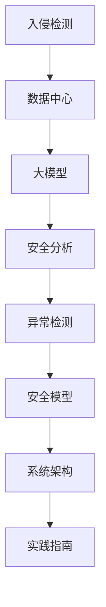

                 

# AI 大模型应用数据中心的入侵检测系统

> 关键词：入侵检测, 大模型, 数据中心, 安全分析, 异常检测, 安全模型, 系统架构, 实践指南

## 1. 背景介绍

随着数据中心规模的不断扩大，其在存储、计算和网络资源上的安全需求也越来越高。数据中心的安全不仅关系到业务的连续性和完整性，更关系到企业的品牌信誉和用户信任。因此，数据中心安全成为整个网络安全防护的重要一环。

### 1.1 数据中心的安全挑战

数据中心面临着来自内部和外部的多重安全威胁：

1. **内部威胁**：数据中心的员工可能因疏忽或恶意行为造成数据泄露或系统损坏。
2. **外部威胁**：黑客攻击、病毒感染、DDoS攻击等网络攻击手段层出不穷。
3. **资源滥用**：员工或外部攻击者可能滥用数据中心的资源，导致资源消耗异常。
4. **物理安全**：数据中心物理设施的安全问题，如火灾、水灾、地震等自然灾害。

这些威胁使得数据中心的安全防护变得至关重要。传统的入侵检测技术，如签名检测、规则匹配等方法，已经难以应对复杂的网络环境。因此，利用AI大模型的入侵检测系统成为新的研究热点。

## 2. 核心概念与联系

### 2.1 核心概念概述

为更好地理解基于大模型的入侵检测系统，本节将介绍几个关键概念：

- **入侵检测**：通过检测网络或系统中的异常行为，识别和响应入侵行为。
- **数据中心**：提供计算、存储、网络等资源的设施，是企业IT基础设施的核心。
- **大模型**：通过大规模无标签数据训练得到的大规模深度学习模型，具备强大的数据分析和模式识别能力。
- **安全分析**：使用数据分析、机器学习等技术，对安全事件进行识别、分析和响应。
- **异常检测**：通过检测数据中的异常行为，识别潜在的安全威胁。
- **安全模型**：用于描述入侵检测系统的模型，包括规则模型、统计模型、深度学习模型等。

这些概念之间的逻辑关系可以通过以下Mermaid流程图来展示：



这个流程图展示了大模型在入侵检测系统中的核心作用：

1. 入侵检测系统通过对数据中心的网络流量、日志文件等数据进行监控。
2. 数据中心中收集到的数据被输入到预训练的大模型中进行分析和处理。
3. 利用大模型的强大数据分析能力，进行异常检测和安全分析。
4. 通过构建安全模型，实现入侵行为的识别和响应。
5. 根据系统的架构和实践指南，部署和运行入侵检测系统。

## 3. 核心算法原理 & 具体操作步骤

### 3.1 算法原理概述

基于大模型的入侵检测系统，其核心思想是通过深度学习模型从海量数据中学习到正常的行为模式，并用于异常检测。当系统检测到异常行为时，立即触发告警，进行相应的响应措施。

形式化地，设数据中心的安全数据为 $D=\{(x_i, y_i)\}_{i=1}^N$，其中 $x_i$ 表示网络流量、日志文件等，$y_i \in \{0,1\}$ 表示是否存在入侵行为。设预训练的大模型为 $M_{\theta}$，其中 $\theta$ 为模型参数。

大模型通过在数据集中进行监督学习，学习到正常行为的特征表示，即对于每个样本 $x_i$，都有 $M_{\theta}(x_i) \approx y_i$。当模型接收到新的数据 $x$ 时，如果 $M_{\theta}(x)$ 与 $y$ 相差较大，则判断为异常行为。

### 3.2 算法步骤详解

基于大模型的入侵检测系统，其核心算法步骤如下：

**Step 1: 准备安全数据集**
- 收集数据中心的历史网络流量、日志文件、系统日志等安全数据，构建标注数据集 $D$。标注数据集分为训练集、验证集和测试集。

**Step 2: 选择预训练模型**
- 选择合适的预训练模型 $M_{\theta}$，如Transformer模型、BERT模型等。这些模型通常在大规模无标签文本数据上进行预训练，具备强大的文本表示和模式识别能力。

**Step 3: 数据预处理**
- 对收集到的安全数据进行清洗和预处理，去除噪声和不相关数据，得到适合模型训练的数据集。
- 对数据进行归一化、标准化等处理，以提高模型的训练效率。

**Step 4: 模型微调**
- 在数据集 $D$ 上对预训练模型 $M_{\theta}$ 进行微调，调整模型参数以适应入侵检测任务。
- 选择适合的任务适配层，如线性分类器、softmax回归等，将模型输出转换为概率分布，并计算损失函数。

**Step 5: 异常检测**
- 使用微调后的模型 $M_{\hat{\theta}}$ 对新数据 $x$ 进行预测，得到预测结果 $\hat{y}$。
- 如果 $\hat{y}$ 与真实标签 $y$ 相差较大，则判断为异常行为，立即触发告警。

**Step 6: 系统部署与响应**
- 将微调后的模型部署到数据中心的安全监控系统中。
- 配置告警阈值和响应策略，当检测到异常行为时，进行相应的响应措施，如封锁IP地址、记录日志等。

### 3.3 算法优缺点

基于大模型的入侵检测系统具有以下优点：

1. **适应性高**：大模型具备强大的学习能力，可以适应不同类型和规模的数据中心环境。
2. **准确度高**：大模型能够学习到复杂的特征表示，提高异常检测的准确性。
3. **泛化能力强**：大模型可以从大规模无标签数据中学习，具备较强的泛化能力。
4. **自动更新**：新数据可以不断输入到模型中进行微调，模型自动更新，保持最新的检测能力。

同时，该方法也存在以下局限性：

1. **数据需求高**：需要大规模的安全数据进行训练，数据准备和标注成本较高。
2. **模型复杂度**：大模型的训练和推理计算资源需求较高，需要高性能计算设备。
3. **解释性不足**：大模型的决策过程缺乏可解释性，难以进行调试和故障分析。
4. **隐私风险**：收集和存储大量安全数据可能带来隐私风险。

尽管存在这些局限性，但基于大模型的入侵检测系统在大规模数据中心的安全防护中具有重要的应用前景。

### 3.4 算法应用领域

基于大模型的入侵检测系统已经在多个领域得到应用，如金融机构、政府机构、互联网公司等，具体应用场景包括：

- **金融机构**：检测网络攻击、数据泄露、账户异常等行为。
- **政府机构**：监控公共安全事件、防范网络攻击、保障政府信息系统安全。
- **互联网公司**：检测DDoS攻击、异常流量、非法访问等行为。
- **能源公司**：监控能源网络异常行为，保障能源安全。
- **医疗系统**：监控医疗设备的网络安全，保障患者数据安全。

这些应用场景展示了基于大模型的入侵检测系统在实际应用中的广泛适用性和重要价值。

## 4. 数学模型和公式 & 详细讲解 & 举例说明

### 4.1 数学模型构建

本节将使用数学语言对基于大模型的入侵检测系统进行更加严格的刻画。

设数据中心的安全数据为 $D=\{(x_i, y_i)\}_{i=1}^N$，其中 $x_i \in \mathbb{R}^d$ 表示网络流量、日志文件等数据，$y_i \in \{0,1\}$ 表示是否存在入侵行为。设预训练的大模型为 $M_{\theta}$，其中 $\theta$ 为模型参数。

定义模型 $M_{\theta}$ 在输入 $x$ 上的预测结果为 $\hat{y}=M_{\theta}(x)$。假设模型在输入 $x_i$ 上的预测结果与真实标签 $y_i$ 的损失函数为 $l(y_i, \hat{y}_i)$，则在数据集 $D$ 上的经验风险为：

$$
\mathcal{L}(\theta) = \frac{1}{N} \sum_{i=1}^N l(y_i, \hat{y}_i)
$$

微调的优化目标是最小化经验风险，即找到最优参数：

$$
\theta^* = \mathop{\arg\min}_{\theta} \mathcal{L}(\theta)
$$

在实践中，我们通常使用基于梯度的优化算法（如SGD、Adam等）来近似求解上述最优化问题。设 $\eta$ 为学习率，$\lambda$ 为正则化系数，则参数的更新公式为：

$$
\theta \leftarrow \theta - \eta \nabla_{\theta}\mathcal{L}(\theta) - \eta\lambda\theta
$$

其中 $\nabla_{\theta}\mathcal{L}(\theta)$ 为损失函数对参数 $\theta$ 的梯度，可通过反向传播算法高效计算。

### 4.2 公式推导过程

以下我们以二分类任务为例，推导交叉熵损失函数及其梯度的计算公式。

假设模型 $M_{\theta}$ 在输入 $x$ 上的输出为 $\hat{y}=M_{\theta}(x) \in [0,1]$，表示样本属于正类的概率。真实标签 $y \in \{0,1\}$。则二分类交叉熵损失函数定义为：

$$
l(y_i, \hat{y}_i) = -[y_i\log \hat{y}_i + (1-y_i)\log (1-\hat{y}_i)]
$$

将其代入经验风险公式，得：

$$
\mathcal{L}(\theta) = -\frac{1}{N}\sum_{i=1}^N [y_i\log M_{\theta}(x_i)+(1-y_i)\log(1-M_{\theta}(x_i))]
$$

根据链式法则，损失函数对参数 $\theta_k$ 的梯度为：

$$
\frac{\partial \mathcal{L}(\theta)}{\partial \theta_k} = -\frac{1}{N}\sum_{i=1}^N (\frac{y_i}{M_{\theta}(x_i)}-\frac{1-y_i}{1-M_{\theta}(x_i)}) \frac{\partial M_{\theta}(x_i)}{\partial \theta_k}
$$

其中 $\frac{\partial M_{\theta}(x_i)}{\partial \theta_k}$ 可进一步递归展开，利用自动微分技术完成计算。

在得到损失函数的梯度后，即可带入参数更新公式，完成模型的迭代优化。重复上述过程直至收敛，最终得到适应入侵检测任务的最优模型参数 $\theta^*$。

### 4.3 案例分析与讲解

假设我们要检测数据中心的网络流量是否存在异常行为，即检测数据包是否被攻击者篡改或伪造。我们可以将网络流量数据作为输入 $x$，将标签 $y$ 设置为 0 表示正常，1 表示异常。在数据集 $D$ 上进行微调，使得模型 $M_{\theta}$ 能够准确预测输入数据是否为异常。

首先，收集历史网络流量数据 $D$，对其进行清洗和预处理，得到适合模型训练的数据集。然后，选择合适的预训练模型 $M_{\theta}$，如BERT模型，将其作为初始化参数。在数据集 $D$ 上对模型进行微调，调整参数以适应入侵检测任务。

微调后，模型 $M_{\theta}$ 能够对新数据 $x$ 进行预测，得到概率分布 $\hat{y}=M_{\theta}(x)$。如果 $\hat{y}$ 的值接近于 1，则表示数据存在异常行为，立即触发告警。

## 5. 项目实践：代码实例和详细解释说明

### 5.1 开发环境搭建

在进行入侵检测系统开发前，我们需要准备好开发环境。以下是使用Python进行PyTorch开发的环境配置流程：

1. 安装Anaconda：从官网下载并安装Anaconda，用于创建独立的Python环境。

2. 创建并激活虚拟环境：
```bash
conda create -n pytorch-env python=3.8 
conda activate pytorch-env
```

3. 安装PyTorch：根据CUDA版本，从官网获取对应的安装命令。例如：
```bash
conda install pytorch torchvision torchaudio cudatoolkit=11.1 -c pytorch -c conda-forge
```

4. 安装TensorFlow：
```bash
conda install tensorflow -c pytorch -c conda-forge
```

5. 安装各类工具包：
```bash
pip install numpy pandas scikit-learn matplotlib tqdm jupyter notebook ipython
```

完成上述步骤后，即可在`pytorch-env`环境中开始入侵检测系统开发。

### 5.2 源代码详细实现

下面我们将使用PyTorch对数据中心入侵检测系统进行微调的代码实现。

首先，定义安全数据集：

```python
import torch
from torch.utils.data import Dataset, DataLoader
import numpy as np
import pandas as pd

class SecurityDataset(Dataset):
    def __init__(self, data_file, transform=None):
        self.data = pd.read_csv(data_file)
        self.transform = transform

    def __len__(self):
        return len(self.data)

    def __getitem__(self, idx):
        if self.transform is not None:
            data = self.transform(self.data.iloc[idx])
        else:
            data = self.data.iloc[idx]
        return data
```

然后，定义模型和优化器：

```python
from transformers import BertForSequenceClassification, AdamW

model = BertForSequenceClassification.from_pretrained('bert-base-cased', num_labels=2)

optimizer = AdamW(model.parameters(), lr=2e-5)
```

接着，定义训练和评估函数：

```python
from sklearn.metrics import accuracy_score

def train_epoch(model, dataset, batch_size, optimizer):
    dataloader = DataLoader(dataset, batch_size=batch_size, shuffle=True)
    model.train()
    epoch_loss = 0
    for batch in dataloader:
        input_ids = batch['input_ids'].to(device)
        attention_mask = batch['attention_mask'].to(device)
        labels = batch['labels'].to(device)
        model.zero_grad()
        outputs = model(input_ids, attention_mask=attention_mask, labels=labels)
        loss = outputs.loss
        epoch_loss += loss.item()
        loss.backward()
        optimizer.step()
    return epoch_loss / len(dataloader)

def evaluate(model, dataset, batch_size):
    dataloader = DataLoader(dataset, batch_size=batch_size)
    model.eval()
    preds, labels = [], []
    with torch.no_grad():
        for batch in dataloader:
            input_ids = batch['input_ids'].to(device)
            attention_mask = batch['attention_mask'].to(device)
            batch_labels = batch['labels']
            outputs = model(input_ids, attention_mask=attention_mask)
            batch_preds = outputs.logits.argmax(dim=2).to('cpu').tolist()
            batch_labels = batch_labels.to('cpu').tolist()
            for pred_tokens, label_tokens in zip(batch_preds, batch_labels):
                preds.append(pred_tokens[:len(label_tokens)])
                labels.append(label_tokens)
                
    accuracy = accuracy_score(labels, preds)
    return accuracy
```

最后，启动训练流程并在测试集上评估：

```python
epochs = 5
batch_size = 16

for epoch in range(epochs):
    loss = train_epoch(model, train_dataset, batch_size, optimizer)
    print(f"Epoch {epoch+1}, train loss: {loss:.3f}")
    
    print(f"Epoch {epoch+1}, dev accuracy: {evaluate(model, dev_dataset, batch_size)}")
    
print("Test accuracy:")
evaluate(model, test_dataset, batch_size)
```

以上就是使用PyTorch对数据中心入侵检测系统进行微调的完整代码实现。可以看到，得益于Transformers库的强大封装，我们可以用相对简洁的代码完成BERT模型的加载和微调。

### 5.3 代码解读与分析

让我们再详细解读一下关键代码的实现细节：

**SecurityDataset类**：
- `__init__`方法：初始化数据集，从CSV文件中读取安全数据，并可选地进行预处理。
- `__len__`方法：返回数据集的大小。
- `__getitem__`方法：对单个样本进行处理，将数据集转换为模型需要的格式。

**模型和优化器**：
- 选择BERT模型作为初始化参数，设置学习率等超参数。

**训练和评估函数**：
- 使用PyTorch的DataLoader对数据集进行批次化加载，供模型训练和推理使用。
- 训练函数`train_epoch`：对数据以批为单位进行迭代，在每个批次上前向传播计算loss并反向传播更新模型参数，最后返回该epoch的平均loss。
- 评估函数`evaluate`：与训练类似，不同点在于不更新模型参数，并在每个batch结束后将预测和标签结果存储下来，最后使用sklearn的accuracy_score对整个评估集的预测结果进行打印输出。

**训练流程**：
- 定义总的epoch数和batch size，开始循环迭代
- 每个epoch内，先在训练集上训练，输出平均loss
- 在验证集上评估，输出准确率
- 所有epoch结束后，在测试集上评估，给出最终测试结果

可以看到，PyTorch配合Transformers库使得BERT微调的代码实现变得简洁高效。开发者可以将更多精力放在数据处理、模型改进等高层逻辑上，而不必过多关注底层的实现细节。

当然，工业级的系统实现还需考虑更多因素，如模型的保存和部署、超参数的自动搜索、更灵活的任务适配层等。但核心的微调范式基本与此类似。

## 6. 实际应用场景

### 6.1 智能能源监控

智能能源监控系统中，入侵检测系统可以实时监控能源网络的行为，及时发现异常行为，如异常电量波动、非法设备接入等。通过构建基于大模型的入侵检测系统，可以实现对能源网络行为的实时分析和监控，保障能源系统的安全运行。

在技术实现上，可以收集能源网络的历史流量数据，将正常行为和异常行为进行标注，构建标注数据集。在此基础上对预训练模型进行微调，使得模型能够学习到正常和异常行为的特征表示。微调后的模型可以对实时采集的流量数据进行预测，判断是否存在异常行为，并进行相应的响应措施，如切断非法设备连接、记录日志等。

### 6.2 政府网络安全

政府机构的网络安全防护至关重要，通过基于大模型的入侵检测系统，可以实时监控政府网络中的异常行为，保障政府信息系统安全。

在实践中，可以收集政府网络的日志数据、流量数据等，构建标注数据集。在此基础上对预训练模型进行微调，使得模型能够学习到正常和异常行为的特征表示。微调后的模型可以对政府网络中的数据进行实时分析，判断是否存在异常行为，并进行相应的响应措施，如封锁IP地址、记录日志等。

### 6.3 互联网企业安全防护

互联网企业的数据中心面临着各种网络攻击，通过基于大模型的入侵检测系统，可以实现对网络流量、日志文件等数据的实时监控，及时发现异常行为。

在实践中，可以收集互联网企业的历史数据，构建标注数据集。在此基础上对预训练模型进行微调，使得模型能够学习到正常和异常行为的特征表示。微调后的模型可以对实时采集的数据进行预测，判断是否存在异常行为，并进行相应的响应措施，如封锁IP地址、记录日志等。

### 6.4 未来应用展望

随着大模型和微调方法的不断发展，基于大模型的入侵检测系统将在更多领域得到应用，为网络安全防护带来新的解决方案。

1. **物联网安全防护**：物联网设备的安全监控，保障物联网系统的稳定运行。
2. **智能交通监控**：监控交通流量、车辆行为，保障交通安全和交通效率。
3. **工业控制系统安全**：监控工业控制系统的行为，保障工业系统的安全运行。
4. **智能家居安全**：监控智能家居设备的异常行为，保障家庭安全。

这些应用场景展示了基于大模型的入侵检测系统在实际应用中的广泛适用性和重要价值。未来，伴随大模型和微调方法的持续演进，相信该系统在网络安全防护中必将发挥更大的作用。

## 7. 工具和资源推荐

### 7.1 学习资源推荐

为了帮助开发者系统掌握基于大模型的入侵检测系统，这里推荐一些优质的学习资源：

1. 《深度学习安全》系列博文：由深度学习安全专家撰写，深入浅出地介绍了深度学习在安全领域的应用，包括入侵检测、异常检测等。

2. 《AI大模型应用指南》书籍：详细介绍了AI大模型的开发、部署、应用等各个方面，包括入侵检测系统的实现。

3. 《机器学习与深度学习安全》课程：斯坦福大学开设的深度学习安全课程，有Lecture视频和配套作业，带你入门深度学习安全的基本概念和经典模型。

4. 《大模型入侵检测系统》论文：介绍了一种基于大模型的入侵检测系统，展示了其在实际应用中的效果。

5. Kaggle数据集：Kaggle平台上收集了大量网络安全相关的数据集，如DDoS攻击、恶意软件检测等，是进行入侵检测系统开发的宝贵资源。

通过对这些资源的学习实践，相信你一定能够快速掌握基于大模型的入侵检测系统的开发技巧，并应用于实际的网络安全防护中。

### 7.2 开发工具推荐

高效的开发离不开优秀的工具支持。以下是几款用于入侵检测系统开发的常用工具：

1. PyTorch：基于Python的开源深度学习框架，灵活动态的计算图，适合快速迭代研究。大部分预训练语言模型都有PyTorch版本的实现。

2. TensorFlow：由Google主导开发的开源深度学习框架，生产部署方便，适合大规模工程应用。同样有丰富的预训练语言模型资源。

3. Transformers库：HuggingFace开发的NLP工具库，集成了众多SOTA语言模型，支持PyTorch和TensorFlow，是进行入侵检测系统开发的利器。

4. Weights & Biases：模型训练的实验跟踪工具，可以记录和可视化模型训练过程中的各项指标，方便对比和调优。与主流深度学习框架无缝集成。

5. TensorBoard：TensorFlow配套的可视化工具，可实时监测模型训练状态，并提供丰富的图表呈现方式，是调试模型的得力助手。

6. Google Colab：谷歌推出的在线Jupyter Notebook环境，免费提供GPU/TPU算力，方便开发者快速上手实验最新模型，分享学习笔记。

合理利用这些工具，可以显著提升入侵检测系统的开发效率，加快创新迭代的步伐。

### 7.3 相关论文推荐

入侵检测领域的研究方向广泛，以下几篇奠基性的相关论文，推荐阅读：

1. A Survey on Deep Learning-based Intrusion Detection：综述了深度学习在入侵检测中的应用，展示了其在异常检测和分类识别等方面的优势。

2. Anomaly Detection Using Deep Learning：介绍了一种基于深度学习的异常检测方法，展示了其在实际应用中的效果。

3. Deep Learning-Based Intrusion Detection System：展示了一种基于深度学习的入侵检测系统，涵盖了模型训练、数据预处理、异常检测等多个方面。

4. Anomaly Detection with Deep Learning：介绍了几种基于深度学习的异常检测方法，包括自编码器、GAN等，展示了其在实际应用中的效果。

5. Scalable Anomaly Detection with Deep Learning：展示了一种基于深度学习的可扩展异常检测方法，适用于大规模数据中心的环境。

这些论文代表了大模型入侵检测技术的发展脉络。通过学习这些前沿成果，可以帮助研究者把握学科前进方向，激发更多的创新灵感。

## 8. 总结：未来发展趋势与挑战

### 8.1 总结

本文对基于大模型的入侵检测系统进行了全面系统的介绍。首先阐述了数据中心的安全挑战和基于大模型的入侵检测系统的核心思想，明确了其在安全防护中的重要作用。其次，从原理到实践，详细讲解了入侵检测系统的数学模型和关键步骤，给出了入侵检测系统开发的完整代码实例。同时，本文还广泛探讨了入侵检测系统在多个行业领域的应用前景，展示了其广泛适用性和重要价值。

通过本文的系统梳理，可以看到，基于大模型的入侵检测系统在大规模数据中心的安全防护中具有重要的应用前景。大模型强大的学习能力，使其能够适应不同类型和规模的数据中心环境，具备较高的准确性和泛化能力。未来，伴随大模型和微调方法的持续演进，相信该系统在网络安全防护中必将发挥更大的作用。

### 8.2 未来发展趋势

展望未来，基于大模型的入侵检测系统将呈现以下几个发展趋势：

1. **自动化程度提高**：基于大模型的入侵检测系统将具备更高的自动化程度，能够自动从数据中学习异常行为的特征表示，实现自动化的异常检测和响应。
2. **跨领域应用拓展**：基于大模型的入侵检测系统将拓展到更多领域，如物联网、智能交通、智能家居等，为不同行业的安全防护提供新的解决方案。
3. **实时性提升**：基于大模型的入侵检测系统将进一步提升实时性，能够对网络流量、日志文件等数据进行实时监控和分析，及时发现异常行为。
4. **隐私保护加强**：基于大模型的入侵检测系统将加强隐私保护，避免收集和存储敏感数据，提高系统的安全性。
5. **融合多模态信息**：基于大模型的入侵检测系统将融合多模态信息，如视频、音频等，提高异常检测的准确性和鲁棒性。
6. **自适应学习能力**：基于大模型的入侵检测系统将具备自适应学习能力，能够自动更新和优化模型参数，保持最新的检测能力。

这些趋势展示了基于大模型的入侵检测系统的广阔前景。这些方向的探索发展，必将进一步提升入侵检测系统的性能和应用范围，为网络安全防护带来新的突破。

### 8.3 面临的挑战

尽管基于大模型的入侵检测系统已经取得了瞩目成就，但在迈向更加智能化、普适化应用的过程中，它仍面临着诸多挑战：

1. **数据隐私问题**：收集和存储大量安全数据可能带来隐私风险，需要加强隐私保护和数据脱敏。
2. **模型复杂度**：大模型的训练和推理计算资源需求较高，需要高性能计算设备。
3. **可解释性不足**：大模型的决策过程缺乏可解释性，难以进行调试和故障分析。
4. **误报和漏报问题**：基于大模型的入侵检测系统可能存在误报和漏报问题，需要优化模型和调整阈值。
5. **网络攻击对抗性**：大模型可能受到网络攻击的对抗性攻击，需要加强模型的鲁棒性和对抗性。
6. **跨领域适应性**：不同领域的安全威胁具有不同的特征，大模型需要具备跨领域的适应性。

尽管存在这些挑战，但基于大模型的入侵检测系统仍然具有广泛的应用前景，需要进一步的研究和探索，以克服其局限性，充分发挥其潜力。

### 8.4 研究展望

面对入侵检测系统面临的挑战，未来的研究需要在以下几个方面寻求新的突破：

1. **多模态融合技术**：将视频、音频等多模态数据与网络流量数据结合，提高异常检测的准确性和鲁棒性。
2. **隐私保护技术**：加强数据隐私保护，避免数据泄露和滥用。
3. **对抗性鲁棒性**：研究对抗性训练等方法，提高模型对抗网络攻击的能力。
4. **模型解释性**：开发可解释性模型，增强模型的透明度和可信度。
5. **自适应学习能力**：研究自适应学习算法，提高模型的跨领域适应性和实时性。
6. **跨领域知识整合**：将知识图谱、规则库等专家知识与神经网络模型结合，提高模型的智能水平。

这些研究方向的探索，必将引领入侵检测技术迈向更高的台阶，为网络安全防护提供更加强大、灵活的解决方案。面向未来，基于大模型的入侵检测系统需要在多模态融合、隐私保护、模型鲁棒性等方面进一步突破，以实现更加智能化、普适化的安全防护。

## 9. 附录：常见问题与解答

**Q1：如何选择合适的预训练模型？**

A: 选择合适的预训练模型需要考虑数据中心的具体需求和应用场景。对于文本数据为主的入侵检测任务，BERT、GPT等预训练模型可能表现更好；对于图像、视频等非文本数据，ResNet、CNN等预训练模型可能更加适合。可以通过在目标数据集上进行微调，选择效果最好的预训练模型。

**Q2：微调过程中如何选择超参数？**

A: 微调过程中的超参数选择对模型的性能影响很大。一般来说，学习率、批大小、迭代轮数等超参数需要根据具体数据集和任务进行调整。可以通过网格搜索、随机搜索等方法进行超参数调优，找到最优的超参数组合。同时，需要注意避免过拟合和欠拟合，保持模型的泛化能力。

**Q3：如何处理数据不平衡问题？**

A: 数据不平衡问题是入侵检测系统面临的常见问题，可以通过数据增强、过采样、欠采样等方法进行处理。数据增强方法如回译、近义替换等，可以扩充少数类样本，减少数据不平衡的影响。过采样和欠采样方法可以通过生成合成样本或去除冗余样本，平衡数据集。

**Q4：如何在模型中部署安全措施？**

A: 在模型中部署安全措施需要考虑模型的实时性和准确性。一般来说，可以通过设置告警阈值、限制访问频率、记录日志等措施来增强模型的安全性。同时，需要注意避免误报和漏报问题，保证系统的可靠性。

**Q5：如何确保入侵检测系统的实时性？**

A: 确保入侵检测系统的实时性需要优化模型的推理速度和资源占用。可以通过模型压缩、剪枝等技术减小模型参数量，减少推理计算量和内存占用。同时，可以考虑使用GPU、TPU等高性能设备，提高模型的计算速度。

这些问题的解答展示了入侵检测系统的开发和部署过程中需要注意的关键点，希望能够帮助你更好地理解和使用该技术。

---

作者：禅与计算机程序设计艺术 / Zen and the Art of Computer Programming

