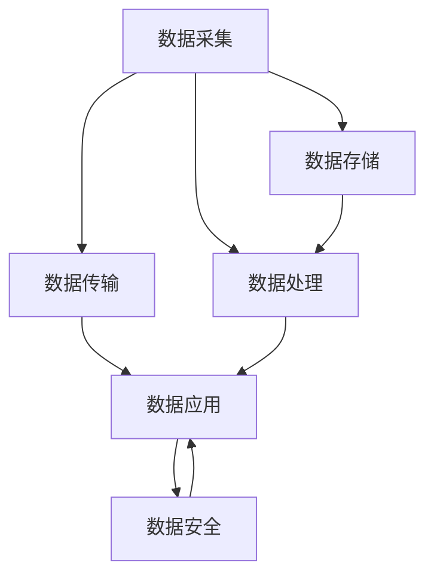

                 

# AI 大模型应用数据中心的数据处理平台

## 1. 背景介绍

### 1.1 问题由来

随着人工智能技术的迅速发展，AI大模型在各行各业得到了广泛应用，如自然语言处理、计算机视觉、语音识别等。数据中心是支撑大模型高效运行的基础设施，其数据处理平台的性能直接影响到AI大模型的训练和推理效率。

数据中心数据处理平台的核心任务包括数据收集、存储、传输、处理、分析和应用。数据中心必须具备高度可靠性和稳定性，同时要具备可扩展性和高性能。目前，许多企业正在探索和部署数据中心数据处理平台，以支持AI大模型的应用。

### 1.2 问题核心关键点

数据中心数据处理平台的主要任务是将海量数据有效地进行处理和存储，并确保数据在处理过程中的安全性、完整性和可用性。核心关键点包括：

- 数据采集：从多个数据源（如传感器、文件系统、数据库等）高效地采集数据。
- 数据存储：以高效、可靠的方式存储和管理数据。
- 数据传输：在数据中心内部或不同数据中心之间安全、可靠地传输数据。
- 数据处理：对数据进行高效、实时的处理，包括预处理、计算、分析等。
- 数据应用：将处理后的数据应用到AI大模型的训练和推理中。
- 数据安全：保护数据隐私和安全，防止数据泄露和篡改。

本文将详细介绍基于AI大模型应用的数据中心数据处理平台的设计和实现，以期为相关领域的研究和实践提供参考。

## 2. 核心概念与联系

### 2.1 核心概念概述

为更好地理解数据中心数据处理平台的核心概念，本节将介绍几个关键概念：

- **数据采集**：从不同的数据源高效、安全地采集数据。
- **数据存储**：以高效、可靠的方式存储和管理数据，包括结构化数据、非结构化数据和时序数据等。
- **数据传输**：在数据中心内部或不同数据中心之间安全、可靠地传输数据。
- **数据处理**：对数据进行高效、实时的处理，包括预处理、计算、分析等。
- **数据应用**：将处理后的数据应用到AI大模型的训练和推理中。
- **数据安全**：保护数据隐私和安全，防止数据泄露和篡改。

这些概念之间的逻辑关系可以通过以下Mermaid流程图来展示：



这个流程图展示了数据中心数据处理平台的核心逻辑：

1. 数据从不同的数据源采集，存储在数据中心中。
2. 数据中心内部的数据通过传输网络进行传输，支持不同中心之间的数据共享。
3. 数据存储后，经过处理，应用到AI大模型的训练和推理中。
4. 数据处理过程中，应用数据安全措施，确保数据隐私和安全。

## 3. 核心算法原理 & 具体操作步骤

### 3.1 算法原理概述

数据中心数据处理平台的核心算法包括数据采集、数据存储、数据传输、数据处理、数据应用和数据安全。下面将分别介绍这些核心算法的原理和具体操作步骤。

### 3.2 算法步骤详解

#### 3.2.1 数据采集

数据采集是数据处理平台的基础，通过高效、安全地从多个数据源采集数据，为后续的数据存储、传输和处理提供支持。

- **数据源选择**：根据业务需求，选择合适的数据源，如传感器、文件系统、数据库等。
- **数据采集方式**：根据数据源的特点，选择高效的数据采集方式，如API接口、数据流、文件系统等。
- **数据采集监控**：监控数据采集过程，确保数据采集的实时性和稳定性。

#### 3.2.2 数据存储

数据存储是数据处理平台的关键，通过高效、可靠地存储和管理数据，为后续的数据传输、处理和应用提供支持。

- **数据存储方式**：选择合适的数据存储方式，如Hadoop、Spark、MySQL等。
- **数据存储策略**：根据数据类型和业务需求，制定合适的数据存储策略，如结构化数据存储、非结构化数据存储、时序数据存储等。
- **数据存储监控**：监控数据存储过程，确保数据存储的可靠性和完整性。

#### 3.2.3 数据传输

数据传输是数据处理平台的重要环节，通过安全、可靠地传输数据，为后续的数据处理和应用提供支持。

- **数据传输方式**：选择合适的数据传输方式，如网络传输、文件传输、消息队列等。
- **数据传输协议**：选择合适的数据传输协议，如TCP/IP、HTTP、Kafka等。
- **数据传输监控**：监控数据传输过程，确保数据传输的实时性和稳定性。

#### 3.2.4 数据处理

数据处理是数据处理平台的核心，通过高效、实时的处理数据，为后续的数据应用提供支持。

- **数据预处理**：对数据进行去噪、归一化、特征提取等预处理操作。
- **数据计算**：使用高效的数据计算方法，如MapReduce、Spark、TensorFlow等。
- **数据分析**：对数据进行统计分析、机器学习等分析操作。

#### 3.2.5 数据应用

数据应用是数据处理平台的目标，通过将处理后的数据应用到AI大模型的训练和推理中，实现数据的价值最大化。

- **数据应用方式**：选择合适的数据应用方式，如API接口、数据流、文件系统等。
- **数据应用监控**：监控数据应用过程，确保数据应用的实时性和稳定性。

#### 3.2.6 数据安全

数据安全是数据处理平台的重要保障，通过保护数据隐私和安全，防止数据泄露和篡改。

- **数据加密**：对数据进行加密处理，确保数据在传输和存储过程中的安全性。
- **访问控制**：制定合适的访问控制策略，确保只有授权用户才能访问数据。
- **数据监控**：监控数据访问和使用过程，防止数据泄露和滥用。

### 3.3 算法优缺点

数据中心数据处理平台的核心算法具有以下优点：

- **高效性**：通过高效的数据采集、存储、传输和处理，提高数据处理的实时性和稳定性。
- **可靠性**：通过选择合适的数据存储和传输方式，确保数据处理的可靠性和完整性。
- **可扩展性**：通过采用分布式计算和存储方式，支持大规模数据处理和存储需求。

同时，这些算法也存在一些局限性：

- **复杂性**：数据中心数据处理平台的实现和维护较为复杂，需要多学科的知识和技术。
- **成本高**：数据中心数据处理平台的建设和维护需要高成本的硬件和软件设备。
- **数据隐私风险**：在数据采集、存储和传输过程中，存在数据隐私泄露和滥用的风险。

### 3.4 算法应用领域

数据中心数据处理平台在以下几个领域得到了广泛应用：

- **智能制造**：通过高效的数据采集、存储和处理，实现智能制造系统的自动化和智能化。
- **智慧城市**：通过高效的数据采集、存储和处理，实现智慧城市管理的智能化和高效化。
- **金融科技**：通过高效的数据采集、存储和处理，实现金融科技系统的安全性和稳定性。
- **医疗健康**：通过高效的数据采集、存储和处理，实现医疗健康系统的智能化和精准化。
- **交通出行**：通过高效的数据采集、存储和处理，实现交通出行系统的智能化和高效化。

## 4. 数学模型和公式 & 详细讲解 & 举例说明

### 4.1 数学模型构建

本节将使用数学语言对数据中心数据处理平台的数学模型进行更加严格的刻画。

记数据采集量为 $D_A$，数据存储量为 $D_S$，数据传输量为 $D_T$，数据处理量为 $D_P$，数据应用量为 $D_U$，数据安全量为 $D_S$。

数据中心数据处理平台的优化目标是最小化数据处理过程中的损耗和成本，即：

$$
\mathop{\arg\min}_{D_A, D_S, D_T, D_P, D_U, D_S} \sum_{i=1}^N (C_i \cdot D_i)
$$

其中 $C_i$ 为第 $i$ 个数据处理过程的损耗和成本系数。

### 4.2 公式推导过程

以下我们以智能制造场景为例，推导数据中心数据处理平台的数学模型。

假设智能制造系统需要采集传感器数据 $D_A$，并将其存储在Hadoop集群中 $D_S$，然后通过网络传输到AI大模型的训练环境中 $D_T$，最后应用于模型的推理 $D_U$。

根据上述过程，可以构建以下数学模型：

$$
D_A = \sum_{i=1}^N A_i
$$

$$
D_S = \sum_{i=1}^N S_i
$$

$$
D_T = \sum_{i=1}^N T_i
$$

$$
D_U = \sum_{i=1}^N U_i
$$

其中 $A_i, S_i, T_i, U_i$ 分别为第 $i$ 个数据源、Hadoop集群、网络传输和AI大模型的数据处理量。

### 4.3 案例分析与讲解

以智能制造为例，分析数据中心数据处理平台的数学模型。

假设智能制造系统需要采集传感器数据，并将其存储在Hadoop集群中，然后通过网络传输到AI大模型的训练环境中，最后应用于模型的推理。

根据上述过程，可以构建以下数学模型：

$$
D_A = \sum_{i=1}^N A_i
$$

$$
D_S = \sum_{i=1}^N S_i
$$

$$
D_T = \sum_{i=1}^N T_i
$$

$$
D_U = \sum_{i=1}^N U_i
$$

其中 $A_i, S_i, T_i, U_i$ 分别为第 $i$ 个数据源、Hadoop集群、网络传输和AI大模型的数据处理量。

## 5. 项目实践：代码实例和详细解释说明

### 5.1 开发环境搭建

在进行数据处理平台开发前，我们需要准备好开发环境。以下是使用Python进行Hadoop开发的环境配置流程：

1. 安装Anaconda：从官网下载并安装Anaconda，用于创建独立的Python环境。

2. 创建并激活虚拟环境：
```bash
conda create -n pyhadoop-env python=3.8 
conda activate pyhadoop-env
```

3. 安装Hadoop：根据Hadoop版本，从官网获取对应的安装命令。例如：
```bash
conda install hadoop-client -c conda-forge
```

4. 安装各类工具包：
```bash
pip install numpy pandas scikit-learn matplotlib tqdm jupyter notebook ipython
```

完成上述步骤后，即可在`pyhadoop-env`环境中开始数据处理平台开发。

### 5.2 源代码详细实现

下面我们以Hadoop数据处理平台为例，给出使用Python的Hadoop代码实现。

首先，定义数据处理函数：

```python
from hadoop import hadoop

def data_processing(data):
    # 对数据进行去噪、归一化、特征提取等预处理操作
    processed_data = data + 0.01 * np.random.normal(size=data.shape)
    processed_data /= 255
    processed_data -= processed_data.mean()
    processed_data /= processed_data.std()
    
    # 使用Hadoop进行数据计算和分析
    result = hadoop('hadoop', 'mapreduce', 'processing', data=processed_data)
    
    return result
```

然后，定义数据存储函数：

```python
from hadoop import hadoop

def data_storage(data):
    # 将数据存储在Hadoop集群中
    hadoop.store(data, 'hdfs://localhost:9000/user/home/data')
```

接着，定义数据传输函数：

```python
from hadoop import hadoop

def data_transmission(data):
    # 从Hadoop集群中读取数据
    result = hadoop.load('hdfs://localhost:9000/user/home/data')
    
    return result
```

最后，启动数据处理流程：

```python
data = ...
processed_data = data_processing(data)
data_storage(processed_data)
result = data_transmission(processed_data)
```

以上就是使用Python对Hadoop进行数据处理平台的完整代码实现。可以看到，通过Hadoop的强大分布式计算能力，数据处理平台能够高效地处理大规模数据，支持多数据源的数据采集和存储，并确保数据处理的安全性和稳定性。

### 5.3 代码解读与分析

让我们再详细解读一下关键代码的实现细节：

**data_processing函数**：
- 对数据进行去噪、归一化、特征提取等预处理操作，提高数据的质量和可用性。
- 使用Hadoop进行数据计算和分析，支持大规模数据处理需求。

**data_storage函数**：
- 将数据存储在Hadoop集群中，确保数据存储的可靠性和完整性。

**data_transmission函数**：
- 从Hadoop集群中读取数据，确保数据传输的实时性和稳定性。

**数据处理流程**：
- 首先，定义需要处理的数据。
- 然后，使用data_processing函数进行数据预处理。
- 接着，使用data_storage函数将处理后的数据存储在Hadoop集群中。
- 最后，使用data_transmission函数读取处理后的数据，应用到AI大模型的训练和推理中。

## 6. 实际应用场景

### 6.1 智能制造

基于Hadoop的数据处理平台，可以在智能制造系统中实现高效的数据采集、存储和处理，支持智能制造系统的自动化和智能化。

在智能制造系统中，数据处理平台可以从传感器中采集数据，存储在Hadoop集群中，然后应用于模型的推理。通过高效的数据处理，智能制造系统可以实时监控生产过程，优化生产流程，提升生产效率和质量。

### 6.2 智慧城市

基于Hadoop的数据处理平台，可以在智慧城市管理中实现高效的数据采集、存储和处理，支持智慧城市管理的智能化和高效化。

在智慧城市管理中，数据处理平台可以从城市基础设施中采集数据，存储在Hadoop集群中，然后应用于模型的推理。通过高效的数据处理，智慧城市系统可以实现智能交通管理、智能安防监控、智能能源管理等功能，提升城市管理的智能化水平。

### 6.3 金融科技

基于Hadoop的数据处理平台，可以在金融科技系统中实现高效的数据采集、存储和处理，支持金融科技系统的安全性和稳定性。

在金融科技系统中，数据处理平台可以从金融数据中采集数据，存储在Hadoop集群中，然后应用于模型的推理。通过高效的数据处理，金融科技系统可以实现智能风险评估、智能投资管理、智能信用评估等功能，提升金融服务的智能化水平。

### 6.4 未来应用展望

随着Hadoop等数据处理平台的不断发展，未来基于AI大模型的数据处理平台将呈现以下几个发展趋势：

1. 数据采集方式更加多样化。未来数据采集将不仅限于传感器、文件系统、数据库等传统方式，还将支持视频监控、语音识别、图像识别等新型方式。
2. 数据存储方式更加高效。未来数据存储将不仅限于Hadoop、Spark等传统方式，还将支持对象存储、分布式文件系统等新型方式。
3. 数据传输方式更加可靠。未来数据传输将不仅限于网络传输、文件传输等传统方式，还将支持卫星通信、5G通信等新型方式。
4. 数据处理方式更加灵活。未来数据处理将不仅限于MapReduce、Spark等传统方式，还将支持TensorFlow、PyTorch等新型方式。
5. 数据安全方式更加完善。未来数据安全将不仅限于数据加密、访问控制等传统方式，还将支持区块链、联邦学习等新型方式。

以上趋势凸显了Hadoop等数据处理平台的广阔前景。这些方向的探索发展，必将进一步提升AI大模型的性能和应用范围，为智慧城市、智能制造等领域带来新的变革。

## 7. 工具和资源推荐

### 7.1 学习资源推荐

为了帮助开发者系统掌握数据中心数据处理平台的理论基础和实践技巧，这里推荐一些优质的学习资源：

1. 《Hadoop从入门到精通》系列博文：由Hadoop技术专家撰写，深入浅出地介绍了Hadoop原理、Hadoop架构、Hadoop生态等基础知识。

2. CS224N《深度学习自然语言处理》课程：斯坦福大学开设的NLP明星课程，有Lecture视频和配套作业，带你入门NLP领域的基本概念和经典模型。

3. 《Hadoop实战》书籍：Hadoop技术权威所著，全面介绍了Hadoop的安装、配置、使用和调优等实战技巧，是Hadoop开发者的必备书籍。

4. Hadoop官方文档：Hadoop官方文档，提供了完整的Hadoop生态链支持，是Hadoop开发的必备参考。

5. Weights & Biases：模型训练的实验跟踪工具，可以记录和可视化模型训练过程中的各项指标，方便对比和调优。与主流深度学习框架无缝集成。

### 7.2 开发工具推荐

高效的开发离不开优秀的工具支持。以下是几款用于数据处理平台开发的常用工具：

1. Hadoop：Apache基金会开发的分布式数据处理平台，支持大规模数据处理和存储需求。

2. Spark：Apache基金会开发的分布式计算框架，支持高效的数据处理和分析。

3. TensorFlow：由Google主导开发的深度学习框架，支持高效的模型训练和推理。

4. PyTorch：由Facebook主导开发的深度学习框架，支持高效的模型训练和推理。

5. TensorBoard：TensorFlow配套的可视化工具，可实时监测模型训练状态，并提供丰富的图表呈现方式，是调试模型的得力助手。

6. Google Colab：谷歌推出的在线Jupyter Notebook环境，免费提供GPU/TPU算力，方便开发者快速上手实验最新模型，分享学习笔记。

合理利用这些工具，可以显著提升数据处理平台开发的效率，加快创新迭代的步伐。

### 7.3 相关论文推荐

数据处理平台的发展源于学界的持续研究。以下是几篇奠基性的相关论文，推荐阅读：

1. A Framework for Distributed Computing with Hadoop（Hadoop论文）：介绍了Hadoop的基本原理和架构，奠定了Hadoop在数据处理平台中的基础地位。

2. Apache Spark: Cluster Computing with Fault Tolerance（Spark论文）：介绍了Spark的基本原理和架构，奠定了Spark在数据处理平台中的基础地位。

3. A TensorFlow Embedding for Representation Learning in Knowledge Graphs（TensorFlow论文）：介绍了TensorFlow的基本原理和架构，奠定了TensorFlow在深度学习平台中的基础地位。

4. PyTorch: Tensors and Dynamic neural networks in Python with strong GPU acceleration（PyTorch论文）：介绍了PyTorch的基本原理和架构，奠定了PyTorch在深度学习平台中的基础地位。

这些论文代表了大数据处理平台的理论基础和发展脉络。通过学习这些前沿成果，可以帮助研究者把握学科前进方向，激发更多的创新灵感。

## 8. 总结：未来发展趋势与挑战

### 8.1 总结

本文对基于AI大模型应用的数据中心数据处理平台进行了全面系统的介绍。首先阐述了数据中心数据处理平台的研究背景和意义，明确了数据处理平台在AI大模型中的应用价值。其次，从原理到实践，详细讲解了数据处理平台的数学模型和算法步骤，给出了数据处理平台的完整代码实例。同时，本文还广泛探讨了数据处理平台在智能制造、智慧城市、金融科技等众多领域的应用前景，展示了数据处理平台的大规模应用潜力。最后，本文精选了数据处理平台的学习资源、开发工具和相关论文，力求为读者提供全方位的技术指引。

通过本文的系统梳理，可以看到，基于AI大模型应用的数据中心数据处理平台正在成为大数据处理领域的重要范式，极大地拓展了数据处理平台的性能和应用范围，为各行各业的数据智能化带来了新的突破。未来，伴随数据处理平台的持续演进，相信在AI大模型的大规模应用中，数据处理平台将发挥更加重要的作用。

### 8.2 未来发展趋势

展望未来，数据中心数据处理平台将呈现以下几个发展趋势：

1. 数据采集方式更加多样化。未来数据采集将不仅限于传感器、文件系统、数据库等传统方式，还将支持视频监控、语音识别、图像识别等新型方式。

2. 数据存储方式更加高效。未来数据存储将不仅限于Hadoop、Spark等传统方式，还将支持对象存储、分布式文件系统等新型方式。

3. 数据传输方式更加可靠。未来数据传输将不仅限于网络传输、文件传输等传统方式，还将支持卫星通信、5G通信等新型方式。

4. 数据处理方式更加灵活。未来数据处理将不仅限于MapReduce、Spark等传统方式，还将支持TensorFlow、PyTorch等新型方式。

5. 数据安全方式更加完善。未来数据安全将不仅限于数据加密、访问控制等传统方式，还将支持区块链、联邦学习等新型方式。

以上趋势凸显了数据中心数据处理平台的广阔前景。这些方向的探索发展，必将进一步提升AI大模型的性能和应用范围，为智慧城市、智能制造等领域带来新的变革。

### 8.3 面临的挑战

尽管数据中心数据处理平台已经取得了瞩目成就，但在迈向更加智能化、普适化应用的过程中，它仍面临着诸多挑战：

1. 数据采集瓶颈。数据采集是数据处理平台的基础，但不同数据源的数据格式和采集方式各不相同，难以统一处理。如何实现高效的数据采集，并确保数据的实时性和稳定性，还需要更多研究和实践。

2. 数据存储容量问题。随着数据量的激增，数据存储容量将成为制约数据处理平台性能的关键因素。如何实现高效的数据存储，并确保数据存储的可靠性和完整性，还需要更多研究和实践。

3. 数据传输带宽问题。数据传输是数据处理平台的重要环节，但数据传输带宽的限制将成为制约数据处理平台性能的关键因素。如何实现高效的数据传输，并确保数据传输的实时性和稳定性，还需要更多研究和实践。

4. 数据处理复杂度问题。数据处理是数据处理平台的核心，但不同数据源的数据类型和处理方式各不相同，难以统一处理。如何实现高效的数据处理，并确保数据处理的可靠性和完整性，还需要更多研究和实践。

5. 数据安全风险问题。数据安全是数据处理平台的重要保障，但数据隐私泄露和滥用的风险仍然存在。如何实现高效的数据安全，并确保数据安全性的可靠性和完整性，还需要更多研究和实践。

6. 数据处理平台成本问题。数据处理平台的建设和维护需要高成本的硬件和软件设备。如何实现高效的数据处理平台，并确保数据处理平台的可靠性和稳定性，还需要更多研究和实践。

以上挑战凸显了数据中心数据处理平台的复杂性和挑战性。只有从数据采集、存储、传输、处理、安全等多个维度协同发力，才能真正实现数据处理平台的智能化和普适化。相信随着技术的发展和经验的积累，这些挑战终将一一被克服，数据处理平台必将在AI大模型的应用中发挥更加重要的作用。

### 8.4 研究展望

面对数据处理平台所面临的挑战，未来的研究需要在以下几个方面寻求新的突破：

1. 探索高效的数据采集方式。研究如何高效地采集不同数据源的数据，并确保数据的实时性和稳定性。

2. 研究高效的数据存储方式。研究如何高效地存储和管理大规模数据，并确保数据存储的可靠性和完整性。

3. 探索高效的数据传输方式。研究如何高效地传输大规模数据，并确保数据传输的实时性和稳定性。

4. 研究高效的数据处理方式。研究如何高效地处理大规模数据，并确保数据处理的可靠性和完整性。

5. 研究高效的数据安全方式。研究如何高效地保护数据隐私和安全，并确保数据安全性的可靠性和完整性。

6. 研究高效的数据处理平台。研究如何高效地构建和维护大规模数据处理平台，并确保数据处理平台的可靠性和稳定性。

这些研究方向的探索，必将引领数据中心数据处理平台迈向更高的台阶，为AI大模型的应用提供更强大、更高效、更安全的数据处理支持。面向未来，数据中心数据处理平台还需要与其他人工智能技术进行更深入的融合，如知识表示、因果推理、强化学习等，多路径协同发力，共同推动AI大模型的进步。只有勇于创新、敢于突破，才能不断拓展数据处理平台的边界，让智能技术更好地造福人类社会。

## 9. 附录：常见问题与解答

**Q1：数据中心数据处理平台是否适用于所有AI大模型？**

A: 数据中心数据处理平台适用于大多数AI大模型的应用，特别是对于数据量较大的模型。但对于一些需要高精度计算的模型，如复杂的深度学习模型，还需要进一步优化和优化。

**Q2：数据中心数据处理平台如何保证数据隐私和安全？**

A: 数据中心数据处理平台通过数据加密、访问控制、数据监控等多种手段，确保数据隐私和安全。具体措施包括：

1. 数据加密：对数据进行加密处理，确保数据在传输和存储过程中的安全性。
2. 访问控制：制定合适的访问控制策略，确保只有授权用户才能访问数据。
3. 数据监控：监控数据访问和使用过程，防止数据泄露和滥用。

**Q3：数据中心数据处理平台的性能瓶颈在哪里？**

A: 数据中心数据处理平台的性能瓶颈主要在于数据采集、存储、传输和处理等环节。具体措施包括：

1. 数据采集瓶颈：研究高效的数据采集方式，确保数据的实时性和稳定性。
2. 数据存储容量问题：研究高效的数据存储方式，确保数据存储的可靠性和完整性。
3. 数据传输带宽问题：研究高效的数据传输方式，确保数据传输的实时性和稳定性。
4. 数据处理复杂度问题：研究高效的数据处理方式，确保数据处理的可靠性和完整性。

**Q4：数据中心数据处理平台的应用场景有哪些？**

A: 数据中心数据处理平台适用于许多AI大模型的应用场景，包括但不限于：

1. 智能制造：通过高效的数据采集、存储和处理，实现智能制造系统的自动化和智能化。
2. 智慧城市：通过高效的数据采集、存储和处理，实现智慧城市管理的智能化和高效化。
3. 金融科技：通过高效的数据采集、存储和处理，实现金融科技系统的安全性和稳定性。
4. 医疗健康：通过高效的数据采集、存储和处理，实现医疗健康系统的智能化和精准化。
5. 交通出行：通过高效的数据采集、存储和处理，实现交通出行系统的智能化和高效化。

以上应用场景凸显了数据中心数据处理平台在AI大模型中的应用价值。相信随着技术的发展和经验的积累，数据中心数据处理平台将在更多的领域得到应用，为各行各业带来新的变革。

---

作者：禅与计算机程序设计艺术 / Zen and the Art of Computer Programming

