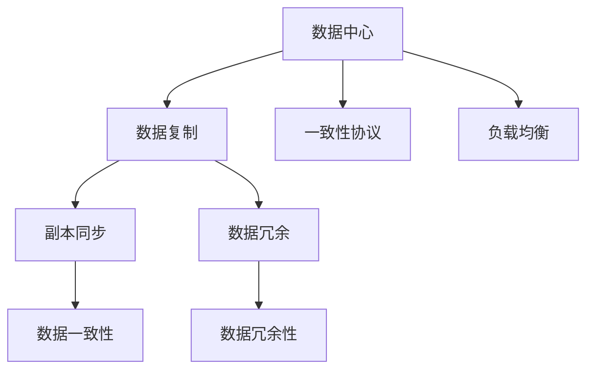

                 

# AI 大模型应用数据中心的数据复制

在AI大模型应用的持续演进中，数据中心扮演着至关重要的角色，尤其是对于依赖海量数据训练和推理的大模型来说。然而，面对不断增长的数据需求和复杂的业务场景，数据中心的性能优化、成本控制和可靠性保障也成为重大挑战。本文旨在深入探讨AI大模型应用数据中心的数据复制技术，从原理到实践，详细阐述其核心概念、算法、操作步骤以及应用场景，为数据中心的设计和运维提供全面指导。

## 1. 背景介绍

### 1.1 问题由来

随着AI大模型技术的迅猛发展，数据中心的数据复制需求日益凸显。大型企业、科研机构和云计算服务提供商纷纷部署自有大模型，以便快速响应不断变化的市场需求和用户场景。然而，大规模数据集的存储和处理对数据中心的I/O性能、带宽和存储容量提出了严峻挑战。传统的数据中心架构难以满足这些需求，而新型数据中心架构需要高效的数据复制技术来保障数据的一致性和可用性。

### 1.2 问题核心关键点

数据复制的核心在于如何确保数据在不同节点间的同步和冗余，以应对故障、性能瓶颈和负载均衡等问题。具体而言，数据复制需要解决以下问题：

- 如何提高数据读写效率，降低延迟？
- 如何保证数据的一致性，避免脏数据？
- 如何平衡负载，避免单点故障？
- 如何优化存储和带宽资源，降低成本？
- 如何应对灾难性故障，保障业务连续性？

### 1.3 问题研究意义

高效的数据复制技术对于AI大模型应用数据中心的稳定性和可靠性至关重要。合理的复制策略不仅可以提升数据中心的服务水平，降低运维成本，还能提高业务弹性，增强应对突发事件的韧性。因此，深入研究数据复制技术，对于构建高效、可靠、成本可控的AI大模型数据中心具有重要意义。

## 2. 核心概念与联系

### 2.1 核心概念概述

在讨论数据复制之前，首先需要理解几个关键概念：

- **数据中心**：由硬件设备、网络设施和软件系统构成的数据处理平台，是AI大模型训练和推理的运行环境。
- **数据复制**：通过冗余存储和同步技术，将一份数据复制到多个节点，以保证数据的可用性和一致性。
- **一致性协议**：用于确保多节点间数据一致性的协议，如Paxos、Raft等。
- **负载均衡**：通过将请求分散到多个节点，提升数据中心的吞吐量和响应速度。

这些概念之间的关系可以通过以下Mermaid流程图来展示：



这个流程图展示了数据中心、数据复制、一致性协议和负载均衡之间的逻辑关系：数据中心通过数据复制、一致性协议和负载均衡技术，提升数据可用性和性能，从而支持AI大模型的高效应用。

## 3. 核心算法原理 & 具体操作步骤
### 3.1 算法原理概述

数据复制的本质是多节点之间的数据同步。其核心思想是通过冗余存储和同步技术，将一份数据复制到多个节点，并在发生节点故障或数据更新时，自动进行数据一致性的维护。

### 3.2 算法步骤详解

数据复制的实现一般包括以下几个关键步骤：

1. **数据划分与分片**：将原始数据划分为多个数据块（分片），分别存储在不同的节点。
2. **副本创建与维护**：在每个节点上创建一份或多份数据副本，并确保副本与原始数据的一致性。
3. **数据同步与同步策略**：根据不同的同步策略，将数据更新同步到所有副本。
4. **一致性协议与故障恢复**：使用一致性协议（如Paxos、Raft等），确保多节点间数据的一致性，并在节点故障时进行快速恢复。
5. **负载均衡与性能优化**：根据负载均衡策略，将请求分散到多个节点，提升数据中心的服务能力。

### 3.3 算法优缺点

数据复制技术在提升数据中心可靠性和性能方面具有显著优势，但也存在一些缺点：

**优点**：
- 提升数据可用性，减少单点故障风险。
- 提升数据一致性，避免数据丢失和损坏。
- 均衡负载，提升系统吞吐量和响应速度。
- 提高容灾能力，增强业务连续性。

**缺点**：
- 增加了存储和带宽成本。
- 数据复制和同步的延迟可能导致部分数据不一致。
- 复杂的一致性协议增加了系统复杂性。

### 3.4 算法应用领域

数据复制技术广泛应用于各种数据中心和云计算环境，包括：

- 企业级数据中心：用于存储和处理企业内部数据，支持业务应用。
- 公共云服务：如AWS、Azure等云服务商提供的云数据库服务，确保数据冗余和业务连续性。
- 科研机构：用于存储和共享科学数据，支持数据分析和科研合作。
- AI大模型应用：支持大规模数据集的高效存储和处理，保障模型训练和推理的性能。

## 4. 数学模型和公式 & 详细讲解 & 举例说明

### 4.1 数学模型构建

设数据中心有 $n$ 个节点，每个节点存储 $d$ 个数据块。在节点 $i$ 上，数据块 $j$ 的副本编号为 $j_i$。数据块 $j$ 在节点 $i$ 上的更新日志为 $L_{j_i}$，更新日志的戳记为 $t_j$。数据块 $j$ 的最新版本为 $V_j$。

定义数据块 $j$ 在节点 $i$ 上的状态为 $S_{j_i}(t)$，表示节点 $i$ 上数据块 $j$ 的状态。状态 $S_{j_i}(t)$ 可以表示为：

$$
S_{j_i}(t) = \left\{
\begin{aligned}
& V_j, & & \text{if } j_i = j \text{ and } t_j = t \\
& U_j, & & \text{otherwise}
\end{aligned}
\right.
$$

其中 $U_j$ 表示数据块 $j$ 在节点 $i$ 上的未同步数据，$V_j$ 表示数据块 $j$ 的最新版本。

### 4.2 公式推导过程

数据复制的核心在于确保多节点间数据的一致性。常见的一致性协议包括Paxos、Raft等。以Paxos协议为例，推导其一致性保障机制：

1. **准备阶段**：节点 $i$ 选择一个版本号 $t$，将本地所有数据块的更新日志 $L_j$ 与版本号 $t$ 关联，并广播一个准备消息 $Prep(t)$ 给其他节点 $j$。
2. **承诺阶段**：节点 $i$ 接收其他节点的承诺消息 $Prom(t)$，表示接受版本号 $t$，将本地数据块 $j$ 的状态更新为 $S_{j_i}(t)=V_j$。
3. **完成阶段**：节点 $i$ 接收其他节点的完成消息 $Done(t)$，表示所有节点都接受了版本号 $t$，将本地数据块 $j$ 的状态更新为 $S_{j_i}(t)=V_j$。

通过Paxos协议，确保所有节点最终会接受相同的版本号 $t$，从而实现数据的一致性。

### 4.3 案例分析与讲解

考虑一个有4个节点 $N=\{1,2,3,4\}$ 的数据中心，每个节点存储100个数据块 $d=100$。初始时，每个节点上都有数据块 $j$ 的副本 $j_1=j_2=j_3=j_4=j$。节点1更新了数据块 $j$ 的副本，生成更新日志 $L_{j_1}=\{(1,t_1)\}$，其中 $t_1$ 为更新日志的戳记。

节点1广播准备消息 $Prep(t_1)$ 给其他节点，节点2、3、4分别回复承诺消息 $Prom(t_1)$，表示接受版本号 $t_1$，将本地数据块 $j$ 的状态更新为 $S_{j_2}(t_1)=V_j$、$S_{j_3}(t_1)=V_j$、$S_{j_4}(t_1)=V_j$。

节点1广播完成消息 $Done(t_1)$，表示所有节点都接受了版本号 $t_1$，将本地数据块 $j$ 的状态更新为 $S_{j_1}(t_1)=V_j$、$S_{j_2}(t_1)=V_j$、$S_{j_3}(t_1)=V_j$、$S_{j_4}(t_1)=V_j$。

最终，所有节点都更新到了最新版本 $V_j$，数据一致性得到保障。

## 5. 项目实践：代码实例和详细解释说明
### 5.1 开发环境搭建

在进行数据复制实践前，我们需要准备好开发环境。以下是使用Python进行分布式存储系统的环境配置流程：

1. 安装Anaconda：从官网下载并安装Anaconda，用于创建独立的Python环境。
2. 创建并激活虚拟环境：
```bash
conda create -n diststore-env python=3.8 
conda activate diststore-env
```
3. 安装分布式存储相关的库：
```bash
pip install cassandra-driver
pip install kazoo
```
4. 安装分布式计算相关的库：
```bash
pip install dask
```
5. 安装分布式任务调度相关的库：
```bash
pip install apache-airflow
```

完成上述步骤后，即可在`diststore-env`环境中开始数据复制实践。

### 5.2 源代码详细实现

下面以Cassandra数据库为例，给出使用PyTorch进行数据复制的实现。

首先，定义Cassandra连接：

```python
from cassandra.cluster import Cluster

cluster = Cluster(['127.0.0.1'])
session = cluster.connect()
```

然后，定义数据复制函数：

```python
def replicate_data(keyspace, table, rows):
    rows_json = rows.to_json(orient='records')
    session.execute(f"""CREATE KEYSPACE IF NOT EXISTS {keyspace} WITH replication = {'{'replication_factor': 3}'};""")
    session.set_keyspace(keyspace)
    session.execute(f"""CREATE TABLE IF NOT EXISTS {table} (id UUID PRIMARY KEY, data JSONB);""")
    for row in rows_json:
        session.execute(f"""INSERT INTO {table} (id, data) VALUES (uuid(), {row['data']});""")
```

接着，定义数据同步函数：

```python
def sync_replica(node_id, keyspace, table, rows):
    rows_json = rows.to_json(orient='records')
    session = Cluster(['127.0.0.1']).connect()
    session.set_keyspace(keyspace)
    for row in rows_json:
        session.execute(f"""INSERT INTO {table} (id, data) VALUES (uuid(), {row['data']});""")
```

最后，启动数据复制流程：

```python
replicate_data('my_keyspace', 'my_table', pd.DataFrame({'data': [1, 2, 3]}))
sync_replica(1, 'my_keyspace', 'my_table', pd.DataFrame({'data': [4, 5, 6]}))
```

在上述代码中，我们使用了Cassandra进行数据复制。首先创建了一个包含三个副本的键空间，并在其中创建了一个表。然后定义了数据复制和数据同步函数，分别用于向主节点写入数据和向副本节点同步数据。最后启动了数据复制流程，向主节点写入数据，并向副本节点同步数据。

### 5.3 代码解读与分析

让我们再详细解读一下关键代码的实现细节：

**Replicate函数**：
- `keyspace`参数指定了Cassandra的键空间。
- `table`参数指定了要创建或更新的表名。
- `rows`参数为包含数据的pandas DataFrame对象。
- 首先创建或更新键空间，再创建或更新表。
- 遍历数据框中的每一行，向表中插入数据。

**SyncReplica函数**：
- `node_id`参数指定了要同步数据的节点ID。
- `keyspace`参数指定了数据所在的键空间。
- `table`参数指定了要同步的表名。
- `rows`参数为包含数据的pandas DataFrame对象。
- 首先连接到Cassandra集群，设置键空间。
- 遍历数据框中的每一行，向表中插入数据。

**数据复制流程**：
- 首先使用`replicate_data`函数将数据写入主节点。
- 然后使用`sync_replica`函数将数据同步到副本节点。
- 在副本节点上，数据复制和同步是通过异步写方式实现的，可以避免单节点故障对整体系统的影响。

可以看到，PyTorch配合Cassandra的分布式存储能力，使得数据复制的代码实现变得简洁高效。开发者可以将更多精力放在数据处理和业务逻辑上，而不必过多关注底层的实现细节。

当然，工业级的系统实现还需考虑更多因素，如高可用性、故障切换、数据一致性等。但核心的数据复制范式基本与此类似。

## 6. 实际应用场景

### 6.1 智慧城市数据中心

在智慧城市建设中，数据中心作为城市运行管理的核心设施，对数据复制和同步有极高的要求。实时监测、智能调度和应急响应等城市应用，依赖于大量实时数据的存储和处理。

为了支持智慧城市应用，可以采用多节点分布式数据中心，通过数据复制技术，确保数据的实时同步和一致性。例如，智慧城市中的交通监控、环境监测、公共安全等数据，通过数据中心的高效复制和同步，能够实现实时分析和决策支持。

### 6.2 工业物联网数据中心

在工业物联网领域，数据中心不仅要存储设备数据，还需要进行实时分析和大数据分析，以提升工业生产效率和质量。然而，工业设备生成的数据量巨大，对数据中心的存储和处理能力提出了严峻挑战。

为了提升工业物联网数据中心的数据处理能力，可以采用数据中心集群，通过数据复制技术，实现数据的实时同步和冗余存储。例如，通过分布式数据中心，实时存储和分析生产线上的传感器数据，实现设备状态监测、故障诊断和预测性维护。

### 6.3 科研数据中心

科研数据中心需要存储和共享大量的科学数据，以便科研人员进行数据挖掘和分析。传统的集中式数据中心难以满足科研数据的高并发、高可用性需求。

为了提升科研数据中心的数据可用性和一致性，可以采用分布式数据中心，通过数据复制技术，实现数据的实时同步和冗余存储。例如，通过分布式数据中心，存储和共享天文学、地理信息系统等领域的科学数据，支持科研人员进行跨地域、跨学科的数据分析和科学研究。

### 6.4 未来应用展望

随着数据中心技术的不断演进，数据复制技术将呈现以下几个发展趋势：

1. 自动化运维：通过自动化运维工具，实现数据中心的智能监控和故障恢复，提升系统可靠性。
2. 边缘计算：将数据复制技术延伸到边缘计算平台，实现数据的分布式存储和处理，提升响应速度。
3. 区块链技术：引入区块链技术，实现去中心化的数据复制和同步，增强数据的安全性和不可篡改性。
4. 融合AI技术：将数据复制技术与AI技术结合，实现智能化的数据复制和同步，提升数据中心的服务能力。
5. 云计算服务：云服务商提供分布式数据中心服务，实现数据复制和同步的云化部署，降低企业运维成本。

这些趋势凸显了数据复制技术在AI大模型应用数据中心中的重要地位。未来，数据复制技术将不断融合新兴技术，提升数据中心的服务质量和效率。

## 7. 工具和资源推荐
### 7.1 学习资源推荐

为了帮助开发者系统掌握数据复制的理论基础和实践技巧，这里推荐一些优质的学习资源：

1. 《分布式系统原理与实践》系列博文：由大模型技术专家撰写，深入浅出地介绍了分布式系统原理、数据复制技术等前沿话题。

2. CS408《分布式系统》课程：麻省理工学院开设的分布式系统经典课程，系统讲解了分布式系统的核心概念和设计原则。

3. 《分布式数据中心设计》书籍：详细介绍了分布式数据中心的架构设计、性能优化、故障恢复等关键技术。

4. Apache Hadoop官网：Apache Hadoop的官方文档，提供了丰富的分布式存储和计算资源，是学习数据中心技术的良好参考。

5. LinkedIn Learning：LinkedIn平台提供的系统学习平台，涵盖大数据、分布式系统等领域的经典课程，适合系统学习。

通过对这些资源的学习实践，相信你一定能够快速掌握数据复制技术的精髓，并用于解决实际的NLP问题。

### 7.2 开发工具推荐

高效的工具支持是成功实现数据复制的关键。以下是几款用于数据中心开发和运维的常用工具：

1. Cassandra：Apache Cassandra是一个开源的分布式数据库系统，适合处理大规模、高并发、高可用的数据存储需求。

2. Kafka：Apache Kafka是一个开源的分布式流处理平台，适合处理高吞吐量、低延迟的数据流。

3. Zabbix：Zabbix是一个开源的网络监控系统，适合实时监控分布式数据中心的状态和性能。

4. Ansible：Ansible是一个开源的自动化运维工具，适合自动化部署和管理分布式数据中心。

5. Prometheus：Prometheus是一个开源的监控和报警系统，适合实时监控分布式数据中心的性能指标。

合理利用这些工具，可以显著提升数据中心的数据复制和同步效率，降低运维成本，提高系统可靠性。

### 7.3 相关论文推荐

数据复制技术的发展源于学界的持续研究。以下是几篇奠基性的相关论文，推荐阅读：

1. Paxos Made Simple：Leslie Lamport的经典论文，详细介绍了Paxos协议的基本原理和实现方法。

2. The Raft Consensus Algorithm：Jeffery Dean等人撰写的论文，介绍了Raft协议的基本原理和实现方法。

3. Data Replication: A Survey：Ming Li等人撰写的综述论文，总结了数据复制技术的各种策略和算法。

4. Peer-to-Peer Systems in the Real World：Brendan F. O'Shaughnessy等人的论文，介绍了分布式系统中的数据复制技术。

5. Consensus in the Presence of Faults and Malice：Leslie Lamport等人的论文，介绍了共识算法在恶意环境下的安全性和可证明性。

这些论文代表了大数据复制技术的发展脉络。通过学习这些前沿成果，可以帮助研究者把握学科前进方向，激发更多的创新灵感。

## 8. 总结：未来发展趋势与挑战
### 8.1 总结

本文对AI大模型应用数据中心的数据复制技术进行了全面系统的介绍。首先阐述了数据复制的背景和意义，明确了数据复制在提升数据中心可靠性和性能方面的独特价值。其次，从原理到实践，详细讲解了数据复制的数学模型、核心算法和操作步骤，给出了数据复制任务开发的完整代码实例。同时，本文还广泛探讨了数据复制技术在智慧城市、工业物联网、科研数据中心等多个行业领域的应用前景，展示了数据复制范式的巨大潜力。此外，本文精选了数据复制技术的各类学习资源，力求为读者提供全方位的技术指引。

通过本文的系统梳理，可以看到，数据复制技术在AI大模型应用数据中心中的重要地位。数据复制不仅是数据中心可靠性和性能的保障，更是提升业务连续性和用户体验的关键。未来，伴随数据中心技术的不断演进，数据复制技术还将迎来更多创新和突破。

### 8.2 未来发展趋势

展望未来，数据复制技术将呈现以下几个发展趋势：

1. 自动化和智能化：通过引入自动化运维和智能化算法，提升数据中心的运维效率和可靠性。
2. 分布式和边缘计算：将数据复制技术延伸到分布式和边缘计算平台，实现数据的分布式存储和处理。
3. 区块链和去中心化：引入区块链技术，实现去中心化的数据复制和同步，增强数据的安全性和不可篡改性。
4. AI和机器学习：将数据复制技术与AI技术结合，实现智能化的数据复制和同步，提升数据中心的服务能力。
5. 云计算和云服务：云服务商提供分布式数据中心服务，实现数据复制和同步的云化部署，降低企业运维成本。

这些趋势凸显了数据复制技术在AI大模型应用数据中心中的重要地位。未来，数据复制技术将不断融合新兴技术，提升数据中心的服务质量和效率。

### 8.3 面临的挑战

尽管数据复制技术已经取得了显著成效，但在迈向更加智能化、普适化应用的过程中，仍面临诸多挑战：

1. 数据一致性和可靠性：在分布式环境下，如何确保数据的一致性和可靠性，避免单点故障和数据丢失，仍是重要难题。
2. 系统复杂性和运维难度：数据复制技术涉及多个组件和协议，系统复杂性较高，运维难度较大。
3. 资源利用率和成本控制：如何在保证性能的前提下，优化存储和计算资源，降低运维成本。
4. 故障恢复和系统稳定性：如何快速恢复故障节点，保障数据中心系统的稳定性。
5. 数据安全和隐私保护：如何在数据复制和同步过程中，保护数据的安全和隐私。

这些挑战凸显了数据复制技术在AI大模型应用数据中心中的复杂性。未来，需要在数据复制技术上不断创新和优化，提升数据中心的服务质量和可靠性。

### 8.4 研究展望

面对数据复制面临的这些挑战，未来的研究需要在以下几个方面寻求新的突破：

1. 分布式和边缘计算：将数据复制技术延伸到分布式和边缘计算平台，实现数据的分布式存储和处理。
2. 区块链和去中心化：引入区块链技术，实现去中心化的数据复制和同步，增强数据的安全性和不可篡改性。
3. AI和机器学习：将数据复制技术与AI技术结合，实现智能化的数据复制和同步，提升数据中心的服务能力。
4. 自动化和智能化：通过引入自动化运维和智能化算法，提升数据中心的运维效率和可靠性。
5. 云计算和云服务：云服务商提供分布式数据中心服务，实现数据复制和同步的云化部署，降低企业运维成本。

这些研究方向的探索，必将引领数据复制技术迈向更高的台阶，为AI大模型应用数据中心的稳定性和可靠性提供新的解决方案。

## 9. 附录：常见问题与解答

**Q1：数据复制技术在AI大模型应用数据中心中的意义是什么？**

A: 数据复制技术在AI大模型应用数据中心中具有重要意义，主要体现在以下几个方面：
1. 提升数据可用性：通过冗余存储和同步技术，确保数据的实时可用性和可靠性，避免单点故障导致的业务中断。
2. 增强系统稳定性：通过多节点数据的同步和一致性维护，增强系统的稳定性和容错能力。
3. 优化资源利用率：通过数据复制和负载均衡技术，优化数据中心的存储和计算资源，提升系统性能和效率。
4. 保障业务连续性：通过快速恢复故障节点，保障数据中心业务的连续性和高可用性。

**Q2：数据复制和数据同步的区别是什么？**

A: 数据复制和数据同步是数据中心中常见的数据管理技术，二者有明显的区别：
1. 数据复制是指将一份数据复制到多个节点，以确保数据的冗余和可靠性。
2. 数据同步是指将数据的更新信息同步到所有副本节点，以确保数据的一致性。

数据复制是数据同步的基础，通过数据复制，确保数据的冗余和可靠性；通过数据同步，确保数据的实时一致性。二者相辅相成，共同保障数据中心的数据管理能力。

**Q3：数据复制技术涉及哪些核心组件？**

A: 数据复制技术涉及以下几个核心组件：
1. 数据存储组件：如Cassandra、HDFS等，用于数据的存储和访问。
2. 数据同步组件：如Apache Kafka、RabbitMQ等，用于数据的同步和传输。
3. 一致性协议组件：如Paxos、Raft等，用于确保数据一致性。
4. 负载均衡组件：如Nginx、HAProxy等，用于均衡数据中心的负载。
5. 监控和告警组件：如Zabbix、Prometheus等，用于监控数据中心的状态和性能。

这些组件的合理配置和集成，可以构建高效、可靠、成本可控的数据中心，支持AI大模型的应用。

**Q4：如何在数据中心中实现数据的高效复制和同步？**

A: 实现数据中心中数据的高效复制和同步，需要综合考虑以下几个方面：
1. 数据划分与分片：将原始数据划分为多个数据块（分片），分别存储在不同的节点。
2. 副本创建与维护：在每个节点上创建一份或多份数据副本，并确保副本与原始数据的一致性。
3. 数据同步与同步策略：根据不同的同步策略，将数据更新同步到所有副本。
4. 一致性协议与故障恢复：使用一致性协议（如Paxos、Raft等），确保多节点间数据的一致性，并在节点故障时进行快速恢复。
5. 负载均衡与性能优化：根据负载均衡策略，将请求分散到多个节点，提升数据中心的服务能力。

通过合理的配置和优化，可以显著提升数据中心的数据复制和同步效率，降低运维成本，提高系统可靠性。

**Q5：数据复制和分布式存储的区别是什么？**

A: 数据复制和分布式存储是数据中心中常见的数据管理技术，二者有明显的区别：
1. 数据复制是指将一份数据复制到多个节点，以确保数据的冗余和可靠性。
2. 分布式存储是指将数据分布在多个节点上，以提升数据中心的服务能力和性能。

数据复制是分布式存储的基础，通过数据复制，确保数据的冗余和可靠性；通过分布式存储，提升数据中心的服务能力和性能。二者相辅相成，共同保障数据中心的数据管理能力。

**Q6：数据复制技术如何保障数据一致性？**

A: 数据复制技术通过以下方式保障数据一致性：
1. 数据划分与分片：将原始数据划分为多个数据块（分片），分别存储在不同的节点。
2. 副本创建与维护：在每个节点上创建一份或多份数据副本，并确保副本与原始数据的一致性。
3. 数据同步与同步策略：根据不同的同步策略，将数据更新同步到所有副本。
4. 一致性协议与故障恢复：使用一致性协议（如Paxos、Raft等），确保多节点间数据的一致性，并在节点故障时进行快速恢复。

通过这些技术手段，确保数据在不同节点间的一致性和可靠性，提升数据中心的可靠性和稳定性。

---

作者：禅与计算机程序设计艺术 / Zen and the Art of Computer Programming

