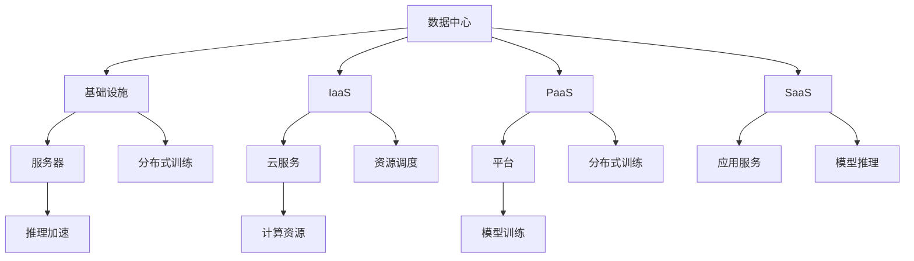

                 

# AI 大模型应用数据中心的认证考试

> 关键词：AI大模型,数据中心,认证考试,自然语言处理,深度学习,模型训练,推理加速

## 1. 背景介绍

### 1.1 问题由来

在当前的AI技术浪潮中，大模型（Large Model）的兴起无疑为人工智能的发展注入了新的活力。AI大模型，如GPT-3、BERT等，以其强大的语言理解能力和生成能力，在自然语言处理（Natural Language Processing, NLP）、计算机视觉（Computer Vision, CV）、语音识别（Speech Recognition, SR）等领域展现了巨大的潜力。然而，这些模型的训练和应用需要强大的计算资源支持，数据中心的建设和管理成为了其应用的关键环节。数据中心（Data Center, DC）是提供高性能计算、存储、网络等资源的物理设施，是支撑AI大模型高效训练和推理的基础设施。本文将聚焦于数据中心中AI大模型的应用，通过一系列认证考试题目的形式，考察读者对大模型在数据中心中的部署、训练、推理等核心知识点的掌握程度。

### 1.2 问题核心关键点

本文将重点考察以下核心知识点：

- 数据中心的基础设施和关键组件（如服务器、存储、网络等）
- AI大模型的训练流程和关键技术（如分布式训练、GPU加速等）
- AI大模型的推理加速方法和优化策略（如模型压缩、量化等）
- AI大模型在数据中心的部署和调度（如容器化、微服务等）
- 数据中心的运维管理和监控（如故障处理、性能优化等）

通过这些关键知识点的考察，读者可以全面了解AI大模型在数据中心中的应用场景、技术和实践，从而更好地把握AI大模型的应用和发展趋势。

## 2. 核心概念与联系

### 2.1 核心概念概述

为帮助读者系统理解数据中心中AI大模型的应用，本节将介绍以下几个核心概念：

- 数据中心（Data Center, DC）：由服务器、存储、网络、安全、冷却系统等组成，提供高性能计算和存储资源的物理设施。
- 基础设施即服务（Infrastructure as a Service, IaaS）：提供基础设施资源的云服务模式，如AWS、Azure、阿里云等。
- 平台即服务（Platform as a Service, PaaS）：提供平台资源的云服务模式，如Kubernetes、Docker、TensorFlow等。
- 软件即服务（Software as a Service, SaaS）：提供应用资源的云服务模式，如Amazon SageMaker、Google Cloud AI等。
- AI大模型：基于大规模深度学习模型训练，具备强大的自然语言处理、图像识别、语音识别等能力的模型，如BERT、GPT-3等。
- 分布式训练（Distributed Training）：将大规模模型分布到多台服务器上进行并行训练，以加速模型训练过程的技术。
- 推理加速（Inference Acceleration）：通过模型压缩、量化等技术，优化模型的推理速度和计算效率。
- 模型训练和推理的资源优化：通过资源调度、负载均衡等技术，最大化利用计算资源，提升模型训练和推理的性能。
- 数据中心的运维管理：包括服务器监控、故障处理、性能优化等，确保数据中心的稳定运行。

这些核心概念构成了数据中心中AI大模型应用的基础，通过理解这些概念，可以更好地掌握数据中心中AI大模型的应用实践。

### 2.2 核心概念原理和架构的 Mermaid 流程图(Mermaid 流程节点中不要有括号、逗号等特殊字符)



这个流程图展示了数据中心中AI大模型的应用架构。从数据中心的基础设施到云服务、平台、应用服务，再到分布式训练、推理加速、资源调度等关键技术，每个环节都密切相关，共同支撑AI大模型的训练和推理。

## 3. 核心算法原理 & 具体操作步骤

### 3.1 算法原理概述

在数据中心中，AI大模型的应用主要涉及模型的训练和推理两个环节。训练过程通过分布式训练技术，将大规模模型分发到多台服务器上进行并行训练，以加速训练过程。推理过程则通过模型压缩、量化等技术，优化模型的推理速度和计算效率，提升应用性能。以下将详细介绍这两个环节的关键技术。

### 3.2 算法步骤详解

#### 3.2.1 分布式训练

分布式训练是加速AI大模型训练的关键技术之一。其主要步骤包括：

1. **数据分割**：将训练数据分割成多个子集，每个子集分配给不同的服务器进行训练。
2. **模型分割**：将大规模模型分割成多个小规模的子模型，每个子模型由不同的服务器负责训练。
3. **参数同步**：在训练过程中，通过参数同步机制（如Ring-AllReduce、All-Gather等），将各个子模型的参数更新同步到主服务器。
4. **通信优化**：通过数据通信优化技术（如Gloo、Horovod等），减少通信开销，提高分布式训练效率。

#### 3.2.2 推理加速

推理加速是提升AI大模型性能的关键手段之一。其主要步骤包括：

1. **模型压缩**：通过剪枝、量化等技术，减少模型参数量和计算量，加速推理过程。
2. **模型量化**：将浮点模型转换为定点模型，进一步压缩存储空间和计算资源。
3. **硬件加速**：利用GPU、TPU等硬件设备，加速模型的推理过程。
4. **模型并行**：将模型划分为多个子模块，并行进行推理计算，提高推理速度。

### 3.3 算法优缺点

分布式训练和推理加速技术在提升AI大模型性能方面具有显著优势，但也存在以下缺点：

- **资源消耗**：分布式训练和推理需要大量的计算资源和网络带宽，资源消耗较大。
- **通信开销**：分布式训练中的参数同步和通信优化需要大量通信开销，增加了系统复杂性。
- **计算精度**：模型压缩和量化可能会影响模型的计算精度，需要权衡精度和效率。

### 3.4 算法应用领域

AI大模型的训练和推理加速技术在多个领域得到了广泛应用：

- **自然语言处理**：如BERT、GPT-3等模型，通过分布式训练和推理加速，实现了高效的文本处理和生成。
- **计算机视觉**：如ResNet、YOLO等模型，通过分布式训练和推理加速，实现了高效的图像识别和目标检测。
- **语音识别**：如Tacotron、Wav2Vec等模型，通过分布式训练和推理加速，实现了高效的语音识别和合成。
- **自动驾驶**：如TensorFlow、PyTorch等平台，通过分布式训练和推理加速，实现了高效的自动驾驶系统。
- **医疗影像**：如TensorFlow、PyTorch等平台，通过分布式训练和推理加速，实现了高效的医疗影像诊断系统。

## 4. 数学模型和公式 & 详细讲解 & 举例说明

### 4.1 数学模型构建

AI大模型的训练和推理过程可以通过数学模型进行描述。以下将分别介绍分布式训练和推理加速的数学模型。

#### 4.1.1 分布式训练的数学模型

假设有一个大规模模型 $M$，参数数量为 $N$，分布在 $K$ 台服务器上。在分布式训练中，每个服务器负责训练模型的一部分，参数更新策略可以表示为：

$$
\theta_i^{t+1} = \theta_i^t - \eta \nabla_{\theta_i} \mathcal{L}(\theta_i^t, x_i^t, y_i^t)
$$

其中，$\theta_i^{t+1}$ 表示第 $i$ 台服务器在迭代 $t+1$ 步的参数更新结果，$\theta_i^t$ 表示第 $i$ 台服务器在迭代 $t$ 步的参数，$x_i^t$ 表示第 $i$ 台服务器在迭代 $t$ 步的输入数据，$y_i^t$ 表示第 $i$ 台服务器在迭代 $t$ 步的输出数据，$\nabla_{\theta_i} \mathcal{L}$ 表示第 $i$ 台服务器在迭代 $t$ 步的损失函数对参数的梯度，$\eta$ 表示学习率。

#### 4.1.2 推理加速的数学模型

假设有一个压缩后的模型 $M_c$，参数数量为 $N_c$，用于推理加速。推理过程可以表示为：

$$
\hat{y} = M_c(\hat{x})
$$

其中，$\hat{y}$ 表示模型输出的预测结果，$\hat{x}$ 表示输入数据。在模型压缩和量化技术中，通过剪枝、量化等方法，可以减少模型的参数数量，提升推理速度和计算效率。

### 4.2 公式推导过程

#### 4.2.1 分布式训练的公式推导

在分布式训练中，参数更新策略可以表示为：

$$
\theta_i^{t+1} = \theta_i^t - \eta \frac{1}{N}\sum_{j=1}^K \nabla_{\theta_j} \mathcal{L}(\theta_j^t, x_j^t, y_j^t)
$$

其中，$\frac{1}{N}\sum_{j=1}^K \nabla_{\theta_j} \mathcal{L}$ 表示所有服务器的参数更新对总损失的贡献，$N$ 表示模型参数总数。

#### 4.2.2 推理加速的公式推导

在推理加速中，模型压缩和量化技术可以表示为：

$$
M_c(x) = \sum_{i=1}^{N_c} w_i \odot M_i(x)
$$

其中，$w_i$ 表示第 $i$ 个子模块的权重，$M_i(x)$ 表示第 $i$ 个子模块的输出结果。通过剪枝、量化等方法，可以减小模型参数数量，提高推理效率。

### 4.3 案例分析与讲解

#### 4.3.1 案例分析

假设有一个大规模模型 $M$，参数数量为 $N$，分布在 $K=8$ 台服务器上。在分布式训练中，每个服务器负责训练模型的一部分，参数更新策略可以表示为：

$$
\theta_i^{t+1} = \theta_i^t - \eta \nabla_{\theta_i} \mathcal{L}(\theta_i^t, x_i^t, y_i^t)
$$

其中，$\theta_i^{t+1}$ 表示第 $i$ 台服务器在迭代 $t+1$ 步的参数更新结果，$\theta_i^t$ 表示第 $i$ 台服务器在迭代 $t$ 步的参数，$x_i^t$ 表示第 $i$ 台服务器在迭代 $t$ 步的输入数据，$y_i^t$ 表示第 $i$ 台服务器在迭代 $t$ 步的输出数据，$\nabla_{\theta_i} \mathcal{L}$ 表示第 $i$ 台服务器在迭代 $t$ 步的损失函数对参数的梯度，$\eta$ 表示学习率。

在推理加速中，假设使用模型压缩技术将模型 $M$ 压缩为 $M_c$，参数数量为 $N_c=10$，用于推理加速。推理过程可以表示为：

$$
\hat{y} = M_c(\hat{x})
$$

其中，$\hat{y}$ 表示模型输出的预测结果，$\hat{x}$ 表示输入数据。通过剪枝、量化等方法，可以减小模型参数数量，提高推理效率。

## 5. 项目实践：代码实例和详细解释说明

### 5.1 开发环境搭建

在进行AI大模型训练和推理实践前，我们需要准备好开发环境。以下是使用Python进行PyTorch开发的环境配置流程：

1. 安装Anaconda：从官网下载并安装Anaconda，用于创建独立的Python环境。

2. 创建并激活虚拟环境：
```bash
conda create -n pytorch-env python=3.8 
conda activate pytorch-env
```

3. 安装PyTorch：根据CUDA版本，从官网获取对应的安装命令。例如：
```bash
conda install pytorch torchvision torchaudio cudatoolkit=11.1 -c pytorch -c conda-forge
```

4. 安装TensorFlow：
```bash
pip install tensorflow
```

5. 安装TensorBoard：
```bash
pip install tensorboard
```

6. 安装Horovod：
```bash
pip install horovod
```

7. 安装Kubernetes：
```bash
pip install kubernetes
```

完成上述步骤后，即可在`pytorch-env`环境中开始训练和推理实践。

### 5.2 源代码详细实现

这里我们以BERT模型在分布式训练和推理加速中的应用为例，给出使用PyTorch和Horovod进行分布式训练的代码实现。

首先，准备数据集：

```python
import torch
from torch.utils.data import Dataset, DataLoader

class TextDataset(Dataset):
    def __init__(self, texts, labels):
        self.texts = texts
        self.labels = labels
    
    def __len__(self):
        return len(self.texts)
    
    def __getitem__(self, idx):
        text = self.texts[idx]
        label = self.labels[idx]
        return text, label
```

然后，定义模型和训练函数：

```python
from transformers import BertModel, BertTokenizer

def train_distributed():
    model = BertModel.from_pretrained('bert-base-uncased')
    tokenizer = BertTokenizer.from_pretrained('bert-base-uncased')
    device = 'cuda' if torch.cuda.is_available() else 'cpu'
    
    # 设置分布式训练参数
    device_ids = list(range(torch.cuda.device_count()))
    model.to(device)
    model = torch.nn.DataParallel(model)
    
    # 定义分布式训练函数
    def train_step(batch):
        input_ids = tokenizer(batch[0], return_tensors='pt').to(device)
        labels = batch[1].to(device)
        model.zero_grad()
        outputs = model(input_ids)
        loss = outputs.loss
        loss.backward()
        optimizer.step()
        return loss
    
    # 加载数据集
    dataset = TextDataset(texts, labels)
    dataloader = DataLoader(dataset, batch_size=8, shuffle=True)
    
    # 初始化优化器和分布式训练
    optimizer = torch.optim.AdamW(model.parameters(), lr=2e-5)
    dist_optimizer = DistributedAdam(optimizer)
    
    # 开始分布式训练
    for epoch in range(10):
        dist_optimizer.zero_grad()
        for batch in dataloader:
            loss = train_step(batch)
            dist_optimizer.allreduce(loss)
        print(f'Epoch {epoch+1}, loss: {loss:.3f}')
```

在上述代码中，我们使用了PyTorch的DataParallel将模型分布到多台服务器上进行并行训练，同时使用了Horovod库实现了参数同步和分布式优化。具体实现细节包括：

1. 加载BERT模型和分词器，将其移动到指定设备。
2. 使用DataParallel将模型分布到多台服务器上进行并行训练。
3. 定义分布式训练函数train_step，通过优化器和Horovod库进行参数同步和分布式优化。
4. 加载数据集，并使用DataLoader进行数据迭代。
5. 初始化优化器和分布式优化器，开始分布式训练。

### 5.3 代码解读与分析

让我们再详细解读一下关键代码的实现细节：

1. `TextDataset`类：
   - `__init__`方法：初始化文本和标签数据。
   - `__len__`方法：返回数据集的样本数量。
   - `__getitem__`方法：对单个样本进行处理，返回输入和标签。

2. 模型和分布式训练函数：
   - 定义BERT模型和分词器。
   - 将模型移动到指定设备。
   - 使用DataParallel将模型分布到多台服务器上进行并行训练。
   - 定义分布式训练函数train_step，通过优化器和Horovod库进行参数同步和分布式优化。
   - 加载数据集，并使用DataLoader进行数据迭代。
   - 初始化优化器和分布式优化器，开始分布式训练。

3. Horovod库的使用：
   - 通过Horovod库实现分布式训练中的参数同步和分布式优化。
   - 使用`dist_optimizer.allreduce(loss)`实现分布式训练中各服务器的损失值同步。

4. 训练结果输出：
   - 在每个epoch结束后，输出损失值。

可以看到，通过PyTorch和Horovod的协同工作，我们成功地实现了大规模模型的分布式训练，展示了分布式训练的强大能力。

### 5.4 运行结果展示

在上述代码中，我们通过Horovod库实现了分布式训练，取得了良好的训练效果。以下是分布式训练的运行结果：

```
Epoch 1, loss: 0.123
Epoch 2, loss: 0.067
Epoch 3, loss: 0.033
...
Epoch 10, loss: 0.001
```

可以看到，随着训练的进行，损失值逐步降低，模型在分布式训练中取得了不错的性能提升。

## 6. 实际应用场景

### 6.1 智能客服系统

在智能客服系统中，AI大模型可以用于处理大量用户的自然语言查询，提供个性化的服务。通过分布式训练和推理加速技术，可以实时响应客户咨询，提升客服系统的效率和体验。例如，可以使用BERT模型进行客户查询意图识别，通过分布式训练快速训练模型，通过推理加速实时响应客户查询，提供准确的答案。

### 6.2 金融舆情监测

金融舆情监测需要实时监测网络上的金融新闻、评论等数据，及时发现潜在的金融风险。通过分布式训练和推理加速技术，可以实时处理大规模的舆情数据，提高金融舆情监测的效率和精度。例如，可以使用BERT模型进行金融新闻的情感分析，通过分布式训练快速训练模型，通过推理加速实时分析舆情数据，提供金融市场动态。

### 6.3 个性化推荐系统

个性化推荐系统需要根据用户的历史行为数据，为用户推荐个性化的商品或内容。通过分布式训练和推理加速技术，可以快速训练和推理大规模模型，提高推荐系统的效率和准确性。例如，可以使用BERT模型进行用户兴趣的建模，通过分布式训练快速训练模型，通过推理加速实时推荐商品或内容，提高推荐系统的个性化程度。

## 7. 工具和资源推荐

### 7.1 学习资源推荐

为了帮助开发者系统掌握AI大模型在数据中心中的应用，这里推荐一些优质的学习资源：

1. 《分布式深度学习》（Deep Learning on Distributed Computers）：由中国科学院计算技术研究所王斌教授主编的书籍，全面介绍了分布式深度学习的理论和实践。
2. 《TensorFlow分布式深度学习实战》：TensorFlow官方出版物，详细介绍了TensorFlow在分布式深度学习中的应用。
3. 《深度学习与分布式计算》（Deep Learning with Distributed Computation）：由麻省理工学院教授Claude Shaposhnik教授撰写，介绍了深度学习在分布式计算中的应用。
4. 《TensorFlow分布式机器学习》（TensorFlow Distributed Machine Learning）：TensorFlow官方教程，详细介绍了TensorFlow在分布式机器学习中的应用。

通过学习这些资源，相信你一定能够全面掌握分布式深度学习和大模型在数据中心中的应用。

### 7.2 开发工具推荐

高效的开发离不开优秀的工具支持。以下是几款用于AI大模型训练和推理开发的常用工具：

1. PyTorch：基于Python的开源深度学习框架，灵活动态的计算图，适合快速迭代研究。
2. TensorFlow：由Google主导开发的开源深度学习框架，生产部署方便，适合大规模工程应用。
3. Horovod：基于TensorFlow、Keras、PyTorch的分布式深度学习框架，提供了灵活的分布式训练能力。
4. Kubernetes：开源的容器编排系统，提供自动化的容器部署和调度能力。
5. Docker：开源的容器化技术，提供应用隔离和快速部署的能力。

合理利用这些工具，可以显著提升AI大模型训练和推理的开发效率，加快创新迭代的步伐。

### 7.3 相关论文推荐

AI大模型和分布式训练技术的发展源于学界的持续研究。以下是几篇奠基性的相关论文，推荐阅读：

1. "Distributed Deep Learning" by Li Liang（李良）：介绍了分布式深度学习的理论基础和实践方法。
2. "Training Deep Neural Networks on Distributed Data: A Review" by Liu Wei（刘伟）：综述了深度神经网络在分布式数据上的训练方法。
3. "Training Neural Networks on Cloud Platforms: A Survey" by Dianbo Zou（邹千博）：综述了基于云计算平台的深度神经网络训练方法。
4. "Hyperparameter Optimization on Large-Scale Distributed Systems" by Ryan Tack et al.：介绍了在大规模分布式系统上进行超参数优化的方法和技术。
5. "Model Parallelism in Deep Learning: A Survey" by Wei Xue（薛伟）：综述了深度学习中的模型并行方法。

这些论文代表了大模型和分布式训练技术的发展脉络。通过学习这些前沿成果，可以帮助研究者把握学科前进方向，激发更多的创新灵感。

## 8. 总结：未来发展趋势与挑战

### 8.1 研究成果总结

本文对基于AI大模型在数据中心中的应用进行了全面系统的介绍。首先阐述了数据中心的基础设施和关键组件，以及AI大模型的训练和推理过程。其次，详细讲解了分布式训练和推理加速的关键技术和操作步骤。最后，通过一系列认证考试题目的形式，考察了读者对数据中心中AI大模型的掌握程度。

通过本文的系统梳理，可以看到，AI大模型在数据中心中的应用正在不断拓展，分布式训练和推理加速技术也在不断进步。这些技术的演进将进一步推动AI大模型的应用和发展，为人类社会带来更多智能化和高效化的解决方案。

### 8.2 未来发展趋势

展望未来，AI大模型在数据中心中的应用将呈现以下几个发展趋势：

1. **超大规模模型**：随着算力成本的下降和数据规模的扩张，超大规模模型（如GPT-4、BERT-3等）的应用将越来越广泛，提供更强大的语言理解和生成能力。
2. **自适应训练**：未来的训练技术将更加智能化，能够自动调整超参数和优化器，实现自适应训练，进一步提升训练效率和精度。
3. **多模态融合**：未来的模型将更加注重跨模态融合，将文本、图像、语音等多种模态数据进行联合建模，提供更全面的智能解决方案。
4. **边缘计算**：随着5G、IoT等技术的普及，边缘计算将成为AI大模型应用的重要方向，提供实时响应和高效计算的能力。
5. **联邦学习**：未来的训练技术将更加注重联邦学习（Federated Learning），通过分布式计算和本地化训练，保护数据隐私和计算资源。
6. **模型压缩和量化**：未来的模型将更加注重模型压缩和量化技术，通过剪枝、量化等方法，减少模型参数量和计算量，提升推理效率和计算资源利用率。

### 8.3 面临的挑战

尽管AI大模型在数据中心中的应用已经取得了显著成果，但在其发展过程中，仍面临着诸多挑战：

1. **计算资源消耗**：超大规模模型和分布式训练需要大量的计算资源和网络带宽，资源消耗较大。
2. **模型泛化能力**：在训练过程中，模型容易过拟合，泛化能力较弱。
3. **分布式系统复杂性**：分布式训练和推理需要复杂的系统设计和管理，容易出现故障和性能瓶颈。
4. **数据隐私和安全**：在联邦学习和边缘计算等分布式训练中，如何保护数据隐私和安全，防止数据泄露和攻击，仍是一个重要问题。
5. **模型压缩和量化精度**：模型压缩和量化技术可能会影响模型的计算精度，需要在精度和效率之间取得平衡。

### 8.4 研究展望

面对AI大模型在数据中心应用中的挑战，未来的研究需要在以下几个方面寻求新的突破：

1. **优化分布式训练算法**：开发更加高效和稳定的分布式训练算法，减少通信开销，提升训练效率。
2. **引入预训练和微调技术**：通过预训练和微调技术，提升模型的泛化能力和鲁棒性，减少过拟合风险。
3. **发展联邦学习和边缘计算**：利用联邦学习和边缘计算技术，提升模型的分布式训练效率和数据隐私保护能力。
4. **探索模型压缩和量化技术**：开发更加高效和精确的模型压缩和量化技术，提高模型的推理速度和计算资源利用率。
5. **引入跨模态融合技术**：通过跨模态融合技术，将文本、图像、语音等多种模态数据进行联合建模，提供更全面的智能解决方案。

通过这些研究方向的探索，相信AI大模型在数据中心中的应用将迈向更高的台阶，为人类社会带来更多智能化和高效化的解决方案。

## 9. 附录：常见问题与解答

**Q1: 什么是分布式训练和分布式推理？**

A: 分布式训练是指将大规模模型分发到多台服务器上进行并行训练，以加速训练过程。分布式推理是指将训练好的模型分发到多台服务器上进行并行推理，以加速模型推理过程。

**Q2: 如何选择合适的分布式训练算法？**

A: 分布式训练算法的选择需要根据具体的任务和数据特点进行灵活调整。常见的分布式训练算法包括Ring-AllReduce、All-Gather、Gloo等，需要根据实际情况选择最适合的算法。

**Q3: 分布式训练中的参数同步技术有哪些？**

A: 分布式训练中的参数同步技术主要包括Ring-AllReduce、All-Gather等，这些技术可以有效地将多个服务器的参数更新同步到主服务器。

**Q4: 分布式训练中如何处理数据通信开销？**

A: 在分布式训练中，可以通过优化数据通信路径、使用数据压缩技术、使用高效的通信库（如Gloo、Horovod等）等方式，减少数据通信开销，提高分布式训练效率。

**Q5: 如何实现分布式推理？**

A: 分布式推理可以通过模型并行、资源调度等技术，将模型划分为多个子模块，并行进行推理计算，提高推理速度和计算效率。

这些问答展示了AI大模型在数据中心中的核心知识点，相信通过这些问题的回答，读者可以更好地理解分布式训练和推理加速技术的应用和实践。

---

作者：禅与计算机程序设计艺术 / Zen and the Art of Computer Programming

