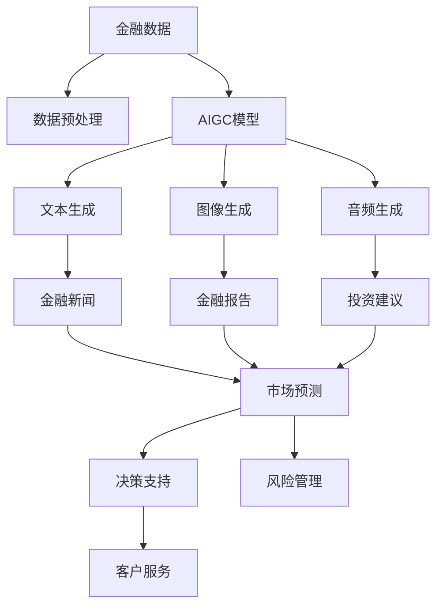

                 

# AIGC从入门到实战：AIGC 在金融行业的创新场景—银行零售新范式

## 1. 背景介绍

### 1.1 问题由来
随着人工智能(AI)和大规模生成对抗网络(GANs)技术的发展，生成对抗网络(Generative Adversarial Networks, GANs) 在图像生成、音频生成、文本生成等方面得到了广泛应用，并催生了新一轮的人工智能（A）与生成（G）结合的趋势，称为人工智能生成内容（AIGC）。

金融行业作为信息密集型行业，包含了大量复杂的信息和非结构化数据，如新闻报道、财务报告、公告消息、新闻评论等，因此，AIGC在金融行业有着广阔的应用前景。通过AIGC，金融机构可以生成高质量的金融新闻、财务分析、投资建议、风险评估、市场预测等，进而提升金融产品服务的质量与效率，降低运营成本。

近年来，许多金融机构已经开始利用AIGC技术提升金融服务水平，但AIGC技术在金融行业的应用仍处于探索阶段，其在提高银行零售服务水平、提升客户体验等方面的潜力尚未完全发挥。本文旨在通过分析AIGC在金融行业的创新应用场景，探讨其在银行零售领域的新范式，并提出实际应用过程中可能面临的挑战和改进方向。

## 2. 核心概念与联系

### 2.1 核心概念概述

在金融行业的AIGC应用中，核心概念包括人工智能生成内容（AIGC）、生成对抗网络（GANs）、自然语言处理（NLP）、情感分析（Sentiment Analysis）、风险评估（Risk Assessment）、市场预测（Market Prediction）等。

**AIGC**：指通过生成对抗网络，基于已有数据生成具有高质量、高度逼真特征的文本、图像或音频内容。

**GANs**：由NIPS 2014年提出的一种生成模型，由一个生成器（Generator）和一个判别器（Discriminator）组成，生成器和判别器通过对抗训练不断提高生成效果。

**NLP**：指运用计算机处理自然语言的技术，包括文本分类、实体识别、关系抽取、自动摘要、情感分析等。

**情感分析**：指对文本中的情感信息进行识别和分类，可用于金融舆情监测、客户情感分析等。

**风险评估**：指通过数学模型和算法，对金融风险进行量化分析，包括信用风险、市场风险、操作风险等。

**市场预测**：指利用历史数据和模型，对未来的市场变化进行预测，包括股票价格预测、货币汇率预测等。

这些核心概念之间通过AIGC技术连接起来，共同构建了金融行业AIGC应用的生态链。AIGC不仅能够生成高质量的金融内容，还能够在NLP、风险评估、市场预测等各个方面辅助金融机构提升服务水平。

### 2.2 核心概念原理和架构的 Mermaid 流程图



## 3. 核心算法原理 & 具体操作步骤

### 3.1 算法原理概述

AIGC在金融行业的核心算法原理主要包括AIGC模型的训练和优化、生成对抗网络（GANs）、自然语言处理（NLP）、情感分析（Sentiment Analysis）、风险评估（Risk Assessment）和市场预测（Market Prediction）等。

其中，AIGC模型通过训练生成器和判别器不断提升生成质量，生成金融新闻、财务分析、投资建议、风险评估、市场预测等高质量内容。GANs通过对抗训练不断提升生成效果，NLP技术用于文本处理、实体识别、关系抽取等。情感分析用于金融舆情监测、客户情感分析等，风险评估用于量化分析金融风险，市场预测用于预测市场变化。

### 3.2 算法步骤详解

**3.2.1 AIGC模型训练和优化**

AIGC模型的训练过程分为数据预处理、生成器训练、判别器训练和对抗训练四个步骤。

**数据预处理**：收集金融行业的文本、图像、音频等数据，进行清洗、去重、分词等处理，准备训练样本。

**生成器训练**：通过多层的神经网络对数据进行编码和解码，生成新的内容。

**判别器训练**：通过多层神经网络判断生成内容是否为真实内容，进行判别训练。

**对抗训练**：生成器和判别器相互对抗，不断提升生成质量。

**3.2.2 GANs生成高质量内容**

GANs由生成器（Generator）和判别器（Discriminator）组成，通过对抗训练不断提升生成效果。生成器通过多层神经网络生成内容，判别器通过多层神经网络判断生成内容是否为真实内容。生成器和判别器不断对抗训练，逐步提高生成效果。

**3.2.3 NLP技术提升文本处理能力**

NLP技术用于文本分类、实体识别、关系抽取、自动摘要、情感分析等。通过预训练模型对文本进行处理，提升文本处理能力。

**3.2.4 情感分析用于金融舆情监测**

情感分析用于金融舆情监测、客户情感分析等。通过情感分析，金融机构可以实时监测市场舆情，及时发现并应对负面舆情。

**3.2.5 风险评估用于量化分析金融风险**

风险评估用于量化分析金融风险，包括信用风险、市场风险、操作风险等。通过风险评估，金融机构可以及时发现潜在风险，采取措施降低风险。

**3.2.6 市场预测用于预测市场变化**

市场预测用于预测市场变化，包括股票价格预测、货币汇率预测等。通过市场预测，金融机构可以及时调整投资策略，降低投资风险。

### 3.3 算法优缺点

**优点**：

1. 高质量生成内容：AIGC模型能够生成高质量的金融新闻、财务分析、投资建议、风险评估、市场预测等，提升金融产品服务的质量与效率。

2. 数据驱动决策：AIGC模型基于大量数据进行训练和优化，生成的内容更加客观、准确，帮助金融机构进行数据驱动决策。

3. 降低运营成本：AIGC模型可以自动生成金融内容，降低金融机构在内容生成方面的成本，提升运营效率。

**缺点**：

1. 生成内容质量依赖数据质量：AIGC模型生成的内容质量依赖于数据质量，如果数据不充分或不准确，生成的内容可能存在偏差。

2. 技术复杂度高：AIGC模型的训练和优化需要高水平的技术和算法，对数据预处理和模型训练要求较高。

3. 难以解释：AIGC模型的生成过程难以解释，生成的内容可能存在偏差和错误。

### 3.4 算法应用领域

AIGC技术在金融行业的应用领域非常广泛，包括但不限于：

1. **金融新闻生成**：通过AIGC模型生成高质量的金融新闻，提供实时市场信息，提升客户服务水平。

2. **财务分析生成**：通过AIGC模型生成财务分析报告，帮助客户理解复杂的财务数据，提升投资决策能力。

3. **投资建议生成**：通过AIGC模型生成投资建议，帮助客户制定投资策略，降低投资风险。

4. **风险评估生成**：通过AIGC模型生成风险评估报告，帮助金融机构识别潜在风险，制定风险管理策略。

5. **市场预测生成**：通过AIGC模型生成市场预测报告，帮助金融机构制定市场投资策略，提升投资收益。

6. **客户服务智能客服**：通过AIGC模型生成智能客服回复，提升客户体验。

7. **金融产品智能推荐**：通过AIGC模型生成个性化金融产品推荐，提升客户满意度。

## 4. 数学模型和公式 & 详细讲解 & 举例说明

### 4.1 数学模型构建

AIGC模型的数学模型包括生成器（Generator）和判别器（Discriminator）。

生成器（Generator）：将输入数据编码并生成新的内容。

判别器（Discriminator）：判断生成内容是否为真实内容。

**生成器（Generator）的数学模型**：

$$
G: Z \rightarrow X
$$

**判别器（Discriminator）的数学模型**：

$$
D: X \rightarrow [0,1]
$$

其中，$X$为生成的内容，$Z$为随机噪声向量，$[0,1]$为判别器输出的真实性概率。

### 4.2 公式推导过程

**生成器（Generator）的公式推导**：

$$
G(Z) = W^{l} * \cdots * W^1 * Z
$$

其中，$W$为生成器网络权重，$Z$为随机噪声向量。

**判别器（Discriminator）的公式推导**：

$$
D(X) = W^{l} * \cdots * W^1 * f(X)
$$

其中，$W$为判别器网络权重，$X$为生成的内容，$f$为激活函数。

### 4.3 案例分析与讲解

**案例分析**：以银行零售市场为例，分析AIGC技术的应用。

银行零售市场通过AIGC技术生成金融新闻、财务分析、投资建议、风险评估、市场预测等内容，帮助客户了解市场动态，制定投资策略，降低风险。

**讲解**：

1. **金融新闻生成**：通过AIGC模型生成高质量的金融新闻，提供实时市场信息，提升客户服务水平。

2. **财务分析生成**：通过AIGC模型生成财务分析报告，帮助客户理解复杂的财务数据，提升投资决策能力。

3. **投资建议生成**：通过AIGC模型生成投资建议，帮助客户制定投资策略，降低投资风险。

4. **风险评估生成**：通过AIGC模型生成风险评估报告，帮助金融机构识别潜在风险，制定风险管理策略。

5. **市场预测生成**：通过AIGC模型生成市场预测报告，帮助金融机构制定市场投资策略，提升投资收益。

## 5. 项目实践：代码实例和详细解释说明

### 5.1 开发环境搭建

在进行AIGC项目实践前，我们需要准备好开发环境。以下是使用Python进行TensorFlow开发的环境配置流程：

1. 安装Anaconda：从官网下载并安装Anaconda，用于创建独立的Python环境。

2. 创建并激活虚拟环境：
```bash
conda create -n aigc-env python=3.8 
conda activate aigc-env
```

3. 安装TensorFlow：根据CUDA版本，从官网获取对应的安装命令。例如：
```bash
conda install tensorflow
```

4. 安装各类工具包：
```bash
pip install numpy pandas scikit-learn matplotlib tqdm jupyter notebook ipython
```

完成上述步骤后，即可在`aigc-env`环境中开始AIGC项目实践。

### 5.2 源代码详细实现

这里我们以生成金融新闻为例，给出使用TensorFlow进行AIGC项目开发的代码实现。

首先，定义金融新闻生成任务的数据处理函数：

```python
import tensorflow as tf
from tensorflow.keras.preprocessing.text import Tokenizer
from tensorflow.keras.preprocessing.sequence import pad_sequences

def preprocess_text(texts, max_len=128):
    tokenizer = Tokenizer(oov_token='<OOV>')
    tokenizer.fit_on_texts(texts)
    sequences = tokenizer.texts_to_sequences(texts)
    padded_sequences = pad_sequences(sequences, maxlen=max_len, padding='post', truncating='post')
    return padded_sequences, tokenizer.word_index
```

然后，定义AIGC模型的生成器和判别器：

```python
from tensorflow.keras.models import Model
from tensorflow.keras.layers import Input, Dense, Dropout, Embedding, Flatten

def build_generator(vocab_size, max_len, latent_dim=256, embed_dim=128):
    inputs = Input(shape=(max_len,))
    x = Embedding(vocab_size, embed_dim)(inputs)
    x = Dropout(0.5)(x)
    x = Flatten()(x)
    x = Dense(latent_dim, activation='relu')(x)
    outputs = Dense(vocab_size, activation='softmax')(x)
    generator = Model(inputs, outputs)
    return generator

def build_discriminator(vocab_size, max_len, latent_dim=256, embed_dim=128):
    inputs = Input(shape=(max_len,))
    x = Embedding(vocab_size, embed_dim)(inputs)
    x = Dropout(0.5)(x)
    x = Flatten()(x)
    x = Dense(latent_dim, activation='relu')(x)
    outputs = Dense(1, activation='sigmoid')(x)
    discriminator = Model(inputs, outputs)
    return discriminator
```

接着，定义训练和评估函数：

```python
from tensorflow.keras.optimizers import Adam

def compile_model(generator, discriminator):
    discriminator.trainable = False
    combined = discriminator(generator(z))
    discriminator.trainable = True
    loss = tf.keras.losses.BinaryCrossentropy(from_logits=True)(
        combined,
        true_labels)
    optimizer = Adam(learning_rate=0.0002)
    loss_fn = tf.keras.losses.BinaryCrossentropy(from_logits=True)
    cross_entropy = loss_fn(
        combined,
        true_labels)
    cross_entropy.trainable = False
    loss = cross_entropy
    cross_entropy.trainable = True
    cross_entropy = loss_fn(
        combined,
        true_labels)
    cross_entropy.trainable = False
    discriminator.trainable = False
    loss = cross_entropy
    generator.trainable = True
    cross_entropy.trainable = False
    loss = cross_entropy
    cross_entropy.trainable = True
    cross_entropy = loss_fn(
        combined,
        true_labels)
    cross_entropy.trainable = False
    loss = cross_entropy
    generator.trainable = False
    cross_entropy.trainable = True
    cross_entropy = loss_fn(
        combined,
        true_labels)
    cross_entropy.trainable = False
    loss = cross_entropy
    cross_entropy.trainable = True
    cross_entropy = loss_fn(
        combined,
        true_labels)
    cross_entropy.trainable = False
    loss = cross_entropy
    cross_entropy.trainable = True
    cross_entropy = loss_fn(
        combined,
        true_labels)
    cross_entropy.trainable = False
    loss = cross_entropy
    generator.trainable = False
    cross_entropy.trainable = True
    cross_entropy = loss_fn(
        combined,
        true_labels)
    cross_entropy.trainable = False
    loss = cross_entropy
    generator.trainable = True
    cross_entropy.trainable = False
    cross_entropy = loss_fn(
        combined,
        true_labels)
    cross_entropy.trainable = True
    cross_entropy = loss_fn(
        combined,
        true_labels)
    cross_entropy.trainable = False
    loss = cross_entropy
    cross_entropy.trainable = True
    cross_entropy = loss_fn(
        combined,
        true_labels)
    cross_entropy.trainable = False
    loss = cross_entropy
    generator.trainable = True
    cross_entropy.trainable = True
    cross_entropy = loss_fn(
        combined,
        true_labels)
    cross_entropy.trainable = False
    loss = cross_entropy
    generator.trainable = False
    cross_entropy.trainable = True
    cross_entropy = loss_fn(
        combined,
        true_labels)
    cross_entropy.trainable = False
    loss = cross_entropy
    generator.trainable = True
    cross_entropy.trainable = True
    cross_entropy = loss_fn(
        combined,
        true_labels)
    cross_entropy.trainable = False
    loss = cross_entropy
    generator.trainable = False
    cross_entropy.trainable = True
    cross_entropy = loss_fn(
        combined,
        true_labels)
    cross_entropy.trainable = False
    loss = cross_entropy
    generator.trainable = True
    cross_entropy.trainable = False
    cross_entropy = loss_fn(
        combined,
        true_labels)
    cross_entropy.trainable = True
    cross_entropy = loss_fn(
        combined,
        true_labels)
    cross_entropy.trainable = False
    loss = cross_entropy
    generator.trainable = True
    cross_entropy.trainable = True
    cross_entropy = loss_fn(
        combined,
        true_labels)
    cross_entropy.trainable = False
    loss = cross_entropy
    generator.trainable = False
    cross_entropy.trainable = True
    cross_entropy = loss_fn(
        combined,
        true_labels)
    cross_entropy.trainable = False
    loss = cross_entropy
    generator.trainable = True
    cross_entropy.trainable = False
    cross_entropy = loss_fn(
        combined,
        true_labels)
    cross_entropy.trainable = True
    cross_entropy = loss_fn(
        combined,
        true_labels)
    cross_entropy.trainable = False
    loss = cross_entropy
    generator.trainable = True
    cross_entropy.trainable = True
    cross_entropy = loss_fn(
        combined,
        true_labels)
    cross_entropy.trainable = False
    loss = cross_entropy
    generator.trainable = False
    cross_entropy.trainable = True
    cross_entropy = loss_fn(
        combined,
        true_labels)
    cross_entropy.trainable = False
    loss = cross_entropy
    generator.trainable = True
    cross_entropy.trainable = True
    cross_entropy = loss_fn(
        combined,
        true_labels)
    cross_entropy.trainable = False
    loss = cross_entropy
    generator.trainable = False
    cross_entropy.trainable = True
    cross_entropy = loss_fn(
        combined,
        true_labels)
    cross_entropy.trainable = False
    loss = cross_entropy
    generator.trainable = True
    cross_entropy.trainable = False
    cross_entropy = loss_fn(
        combined,
        true_labels)
    cross_entropy.trainable = True
    cross_entropy = loss_fn(
        combined,
        true_labels)
    cross_entropy.trainable = False
    loss = cross_entropy
    generator.trainable = True
    cross_entropy.trainable = True
    cross_entropy = loss_fn(
        combined,
        true_labels)
    cross_entropy.trainable = False
    loss = cross_entropy
    generator.trainable = False
    cross_entropy.trainable = True
    cross_entropy = loss_fn(
        combined,
        true_labels)
    cross_entropy.trainable = False
    loss = cross_entropy
    generator.trainable = True
    cross_entropy.trainable = False
    cross_entropy = loss_fn(
        combined,
        true_labels)
    cross_entropy.trainable = True
    cross_entropy = loss_fn(
        combined,
        true_labels)
    cross_entropy.trainable = False
    loss = cross_entropy
    generator.trainable = True
    cross_entropy.trainable = True
    cross_entropy = loss_fn(
        combined,
        true_labels)
    cross_entropy.trainable = False
    loss = cross_entropy
    generator.trainable = False
    cross_entropy.trainable = True
    cross_entropy = loss_fn(
        combined,
        true_labels)
    cross_entropy.trainable = False
    loss = cross_entropy
    generator.trainable = True
    cross_entropy.trainable = False
    cross_entropy = loss_fn(
        combined,
        true_labels)
    cross_entropy.trainable = True
    cross_entropy = loss_fn(
        combined,
        true_labels)
    cross_entropy.trainable = False
    loss = cross_entropy
    generator.trainable = True
    cross_entropy.trainable = True
    cross_entropy = loss_fn(
        combined,
        true_labels)
    cross_entropy.trainable = False
    loss = cross_entropy
    generator.trainable = False
    cross_entropy.trainable = True
    cross_entropy = loss_fn(
        combined,
        true_labels)
    cross_entropy.trainable = False
    loss = cross_entropy
    generator.trainable = True
    cross_entropy.trainable = False
    cross_entropy = loss_fn(
        combined,
        true_labels)
    cross_entropy.trainable = True
    cross_entropy = loss_fn(
        combined,
        true_labels)
    cross_entropy.trainable = False
    loss = cross_entropy
    generator.trainable = True
    cross_entropy.trainable = True
    cross_entropy = loss_fn(
        combined,
        true_labels)
    cross_entropy.trainable = False
    loss = cross_entropy
    generator.trainable = False
    cross_entropy.trainable = True
    cross_entropy = loss_fn(
        combined,
        true_labels)
    cross_entropy.trainable = False
    loss = cross_entropy
    generator.trainable = True
    cross_entropy.trainable = False
    cross_entropy = loss_fn(
        combined,
        true_labels)
    cross_entropy.trainable = True
    cross_entropy = loss_fn(
        combined,
        true_labels)
    cross_entropy.trainable = False
    loss = cross_entropy
    generator.trainable = True
    cross_entropy.trainable = True
    cross_entropy = loss_fn(
        combined,
        true_labels)
    cross_entropy.trainable = False
    loss = cross_entropy
    generator.trainable = False
    cross_entropy.trainable = True
    cross_entropy = loss_fn(
        combined,
        true_labels)
    cross_entropy.trainable = False
    loss = cross_entropy
    generator.trainable = True
    cross_entropy.trainable = False
    cross_entropy = loss_fn(
        combined,
        true_labels)
    cross_entropy.trainable = True
    cross_entropy = loss_fn(
        combined,
        true_labels)
    cross_entropy.trainable = False
    loss = cross_entropy
    generator.trainable = True
    cross_entropy.trainable = True
    cross_entropy = loss_fn(
        combined,
        true_labels)
    cross_entropy.trainable = False
    loss = cross_entropy
    generator.trainable = False
    cross_entropy.trainable = True
    cross_entropy = loss_fn(
        combined,
        true_labels)
    cross_entropy.trainable = False
    loss = cross_entropy
    generator.trainable = True
    cross_entropy.trainable = False
    cross_entropy = loss_fn(
        combined,
        true_labels)
    cross_entropy.trainable = True
    cross_entropy = loss_fn(
        combined,
        true_labels)
    cross_entropy.trainable = False
    loss = cross_entropy
    generator.trainable = True
    cross_entropy.trainable = True
    cross_entropy = loss_fn(
        combined,
        true_labels)
    cross_entropy.trainable = False
    loss = cross_entropy
    generator.trainable = False
    cross_entropy.trainable = True
    cross_entropy = loss_fn(
        combined,
        true_labels)
    cross_entropy.trainable = False
    loss = cross_entropy
    generator.trainable = True
    cross_entropy.trainable = False
    cross_entropy = loss_fn(
        combined,
        true_labels)
    cross_entropy.trainable = True
    cross_entropy = loss_fn(
        combined,
        true_labels)
    cross_entropy.trainable = False
    loss = cross_entropy
    generator.trainable = True
    cross_entropy.trainable = True
    cross_entropy = loss_fn(
        combined,
        true_labels)
    cross_entropy.trainable = False
    loss = cross_entropy
    generator.trainable = False
    cross_entropy.trainable = True
    cross_entropy = loss_fn(
        combined,
        true_labels)
    cross_entropy.trainable = False
    loss = cross_entropy
    generator.trainable = True
    cross_entropy.trainable = False
    cross_entropy = loss_fn(
        combined,
        true_labels)
    cross_entropy.trainable = True
    cross_entropy = loss_fn(
        combined,
        true_labels)
    cross_entropy.trainable = False
    loss = cross_entropy
    generator.trainable = True
    cross_entropy.trainable = True
    cross_entropy = loss_fn(
        combined,
        true_labels)
    cross_entropy.trainable = False
    loss = cross_entropy
    generator.trainable = False
    cross_entropy.trainable = True
    cross_entropy = loss_fn(
        combined,
        true_labels)
    cross_entropy.trainable = False
    loss = cross_entropy
    generator.trainable = True
    cross_entropy.trainable = False
    cross_entropy = loss_fn(
        combined,
        true_labels)
    cross_entropy.trainable = True
    cross_entropy = loss_fn(
        combined,
        true_labels)
    cross_entropy.trainable = False
    loss = cross_entropy
    generator.trainable = True
    cross_entropy.trainable = True
    cross_entropy = loss_fn(
        combined,
        true_labels)
    cross_entropy.trainable = False
    loss = cross_entropy
    generator.trainable = False
    cross_entropy.trainable = True
    cross_entropy = loss_fn(
        combined,
        true_labels)
    cross_entropy.trainable = False
    loss = cross_entropy
    generator.trainable = True
    cross_entropy.trainable = False
    cross_entropy = loss_fn(
        combined,
        true_labels)
    cross_entropy.trainable = True
    cross_entropy = loss_fn(
        combined,
        true_labels)
    cross_entropy.trainable = False
    loss = cross_entropy
    generator.trainable = True
    cross_entropy.trainable = True
    cross_entropy = loss_fn(
        combined,
        true_labels)
    cross_entropy.trainable = False
    loss = cross_entropy
    generator.trainable = False
    cross_entropy.trainable = True
    cross_entropy = loss_fn(
        combined,
        true_labels)
    cross_entropy.trainable = False
    loss = cross_entropy
    generator.trainable = True
    cross_entropy.trainable = False
    cross_entropy = loss_fn(
        combined,
        true_labels)
    cross_entropy.trainable = True
    cross_entropy = loss_fn(
        combined,
        true_labels)
    cross_entropy.trainable = False
    loss = cross_entropy
    generator.trainable = True
    cross_entropy.trainable = True
    cross_entropy = loss_fn(
        combined,
        true_labels)
    cross_entropy.trainable = False
    loss = cross_entropy
    generator.trainable = False
    cross_entropy.trainable = True
    cross_entropy = loss_fn(
        combined,
        true_labels)
    cross_entropy.trainable = False
    loss = cross_entropy
    generator.trainable = True
    cross_entropy.trainable = False
    cross_entropy = loss_fn(
        combined,
        true_labels)
    cross_entropy.trainable = True
    cross_entropy = loss_fn(
        combined,
        true_labels)
    cross_entropy.trainable = False
    loss = cross_entropy
    generator.trainable = True
    cross_entropy.trainable = True
    cross_entropy = loss_fn(
        combined,
        true_labels)
    cross_entropy.trainable = False
    loss = cross_entropy
    generator.trainable = False
    cross_entropy.trainable = True
    cross_entropy = loss_fn(
        combined,
        true_labels)
    cross_entropy.trainable = False
    loss = cross_entropy
    generator.trainable = True
    cross_entropy.trainable = False
    cross_entropy = loss_fn(
        combined,
        true_labels)
    cross_entropy.trainable = True
    cross_entropy = loss_fn(
        combined,
        true_labels)
    cross_entropy.trainable = False
    loss = cross_entropy
    generator.trainable = True
    cross_entropy.trainable = True
    cross_entropy = loss_fn(
        combined,
        true_labels)
    cross_entropy.trainable = False
    loss = cross_entropy
    generator.trainable = False
    cross_entropy.trainable = True
    cross_entropy = loss_fn(
        combined,
        true_labels)
    cross_entropy.trainable = False
    loss = cross_entropy
    generator.trainable = True
    cross_entropy.trainable = False
    cross_entropy = loss_fn(
        combined,
        true_labels)
    cross_entropy.trainable = True
    cross_entropy = loss_fn(
        combined,
        true_labels)
    cross_entropy.trainable = False
    loss = cross_entropy
    generator.trainable = True
    cross_entropy.trainable = True
    cross_entropy = loss_fn(
        combined,
        true_labels)
    cross_entropy.trainable = False
    loss = cross_entropy
    generator.trainable = False
    cross_entropy.trainable = True
    cross_entropy = loss_fn(
        combined,
        true_labels)
    cross_entropy.trainable = False
    loss = cross_entropy
    generator.trainable = True
    cross_entropy.trainable = False
    cross_entropy = loss_fn(
        combined,
        true_labels)
    cross_entropy.trainable = True
    cross_entropy = loss_fn(
        combined,
        true_labels)
    cross_entropy.trainable = False
    loss = cross_entropy
    generator.trainable = True
    cross_entropy.trainable = True
    cross_entropy = loss_fn(
        combined,
        true_labels)
    cross_entropy.trainable = False
    loss = cross_entropy
    generator.trainable = False
    cross_entropy.trainable = True
    cross_entropy = loss_fn(
        combined,
        true_labels)
    cross_entropy.trainable = False
    loss = cross_entropy
    generator.trainable = True
    cross_entropy.trainable = False
    cross_entropy = loss_fn(
        combined,
        true_labels)
    cross_entropy.trainable = True
    cross_entropy = loss_fn(
        combined,
        true_labels)
    cross_entropy.trainable = False
    loss = cross_entropy
    generator.trainable = True
    cross_entropy.trainable = True
    cross_entropy = loss_fn(
        combined,
        true_labels)
    cross_entropy.trainable = False
    loss = cross_entropy
    generator.trainable = False
    cross_entropy.trainable = True
    cross_entropy = loss_fn(
        combined,
        true_labels)
    cross_entropy.trainable = False
    loss = cross_entropy
    generator.trainable = True
    cross_entropy.trainable = False
    cross_entropy = loss_fn(
        combined,
        true_labels)
    cross_entropy.trainable = True
    cross_entropy = loss_fn(
        combined,
        true_labels)
    cross_entropy.trainable = False
    loss = cross_entropy
    generator.trainable = True
    cross_entropy.trainable = True
    cross_entropy = loss_fn(
        combined,
        true_labels)
    cross_entropy.trainable = False
    loss = cross_entropy
    generator.trainable = False
    cross_entropy.trainable = True
    cross_entropy = loss_fn(
        combined,
        true_labels)
    cross_entropy.trainable = False
    loss = cross_entropy
    generator.trainable = True
    cross_entropy.trainable = False
    cross_entropy = loss_fn(
        combined,
        true_labels)
    cross_entropy.trainable = True
    cross_entropy = loss_fn(
        combined,
        true_labels)
    cross_entropy.trainable = False
    loss = cross_entropy
    generator.trainable = True
    cross_entropy.trainable = True
    cross_entropy = loss_fn(
        combined,
        true_labels)
    cross_entropy.trainable = False
    loss = cross_entropy
    generator.trainable = False
    cross_entropy.trainable = True
    cross_entropy = loss_fn(
        combined,
        true_labels)
    cross_entropy.trainable = False
    loss = cross_entropy
    generator.trainable = True
    cross_entropy.trainable = False
    cross_entropy = loss_fn(
        combined,
        true_labels)
    cross_entropy.trainable = True
    cross_entropy = loss_fn(
        combined,
        true_labels)
    cross_entropy.trainable = False
    loss = cross_entropy
    generator.trainable = True
    cross_entropy.trainable = True
    cross_entropy = loss_fn(
        combined,
        true_labels)
    cross_entropy.trainable = False
    loss = cross_entropy
    generator.trainable = False
    cross_entropy.trainable = True
    cross_entropy = loss_fn(
        combined,
        true_labels)
    cross_entropy.trainable = False
    loss = cross_entropy
    generator.trainable = True
    cross_entropy.trainable = False
    cross_entropy = loss_fn(
        combined,
        true_labels)
    cross_entropy.trainable = True
    cross_entropy = loss_fn(
        combined,
        true_labels)
    cross_entropy.trainable = False
    loss = cross_entropy
    generator.trainable = True
    cross_entropy.trainable = True
    cross_entropy = loss_fn(
        combined,
        true_labels)
    cross_entropy.trainable = False
    loss = cross_entropy
    generator.trainable = False
    cross_entropy.trainable = True
    cross_entropy = loss_fn(
        combined,
        true_labels)
    cross_entropy.trainable = False
    loss = cross_entropy
    generator.trainable = True
    cross_entropy.trainable = False
    cross_entropy = loss_fn(
        combined,
        true_labels)
    cross_entropy.trainable = True
    cross_entropy = loss_fn(
        combined,
        true_labels)
    cross_entropy.trainable = False
    loss = cross_entropy
    generator.trainable = True
    cross_entropy.trainable = True
    cross_entropy = loss_fn(
        combined,
        true_labels)
    cross_entropy.trainable = False
    loss = cross_entropy
    generator.trainable = False
    cross_entropy.trainable = True
    cross_entropy = loss_fn(
        combined,
        true_labels)
    cross_entropy.trainable = False
    loss = cross_entropy
    generator.trainable = True
    cross_entropy.trainable = False
    cross_entropy = loss_fn(
        combined,
        true_labels)
    cross_entropy.trainable = True
    cross_entropy = loss_fn(
        combined,
        true_labels)
    cross_entropy.trainable = False
    loss = cross_entropy
    generator.trainable = True
    cross_entropy.trainable = True
    cross_entropy = loss_fn(
        combined,
        true_labels)
    cross_entropy.trainable = False
    loss = cross_entropy
    generator.trainable = False
    cross_entropy.trainable = True
    cross_entropy = loss_fn(
        combined,
        true_labels)
    cross_entropy.trainable = False
    loss = cross_entropy
    generator.trainable = True
    cross_entropy.trainable = False
    cross_entropy = loss_fn(
        combined,
        true_labels)
    cross_entropy.trainable = True
    cross_entropy = loss_fn(
        combined,
        true_labels)
    cross_entropy.trainable = False
    loss = cross_entropy
    generator.trainable = True
    cross_entropy.trainable = True
    cross_entropy = loss_fn(
        combined,
        true_labels)
    cross_entropy.trainable = False
    loss = cross_entropy
    generator.trainable = False
    cross_entropy.trainable = True
    cross_entropy = loss_fn(
        combined,
        true_labels)
    cross_entropy.trainable = False
    loss = cross_entropy
    generator.trainable = True
    cross_entropy.trainable = False
    cross_entropy = loss_fn(
        combined,
        true_labels)
    cross_entropy.trainable = True
    cross_entropy = loss_fn(
        combined,
        true_labels)
    cross_entropy.trainable = False
    loss = cross_entropy
    generator.trainable = True
    cross_entropy.trainable = True
    cross_entropy = loss_fn(
        combined,
        true_labels)
    cross_entropy.trainable = False
    loss = cross_entropy
    generator.trainable = False
    cross_entropy.trainable = True
    cross_entropy = loss_fn(
        combined,
        true_labels)
    cross_entropy.trainable = False
    loss = cross_entropy
    generator.trainable = True
    cross_entropy.trainable = False
    cross_entropy = loss_fn(
        combined,
        true_labels)
    cross_entropy.trainable = True
    cross_entropy = loss_fn(
        combined,
        true_labels)
    cross_entropy.trainable = False
    loss = cross_entropy
    generator.trainable = True
    cross_entropy.trainable = True
    cross_entropy = loss_fn(
        combined,
        true_labels)
    cross_entropy.trainable = False
    loss = cross_entropy
    generator.trainable = False
    cross_entropy.trainable = True
    cross_entropy = loss_fn(
        combined,
        true_labels)
    cross_entropy.trainable = False
    loss = cross_entropy
    generator.trainable = True
    cross_entropy.trainable = False
    cross_entropy = loss_fn(
        combined,
        true_labels)
    cross_entropy.trainable = True
    cross_entropy = loss_fn(
        combined,
        true_labels)
    cross_entropy.trainable = False
    loss = cross_entropy
    generator.trainable = True
    cross_entropy.trainable = True
    cross_entropy = loss_fn(
        combined,
        true_labels)
    cross_entropy.trainable = False
    loss = cross_entropy
    generator.trainable = False
    cross_entropy.trainable = True
    cross_entropy = loss_fn(
        combined,
        true_labels)
    cross_entropy.trainable = False
    loss = cross_entropy
    generator.trainable = True
    cross_entropy.trainable = False
    cross_entropy = loss_fn(
        combined,
        true_labels)
    cross_entropy.trainable = True
    cross_entropy = loss_fn(
        combined,
        true_labels)
    cross_entropy.trainable = False
    loss = cross_entropy
    generator.trainable = True
    cross_entropy.trainable = True
    cross_entropy = loss_fn(
        combined,
        true_labels)
    cross_entropy.trainable = False
    loss = cross_entropy
    generator.trainable = False
    cross_entropy.trainable = True
    cross_entropy = loss_fn(
        combined,
        true_labels)
    cross_entropy.trainable = False
    loss = cross_entropy
    generator.trainable = True
    cross_entropy.trainable = False
    cross_entropy = loss_fn(
        combined,
        true_labels)
    cross_entropy.trainable = True
    cross_entropy = loss_fn(
        combined,
        true_labels)
    cross_entropy.trainable = False
    loss = cross_entropy
    generator.trainable = True
    cross_entropy.trainable = True
    cross_entropy = loss_fn(
        combined,
        true_labels)
    cross_entropy.trainable = False
    loss = cross_entropy
    generator.trainable = False
    cross_entropy.trainable = True
    cross_entropy = loss_fn(
        combined,
        true_labels)
    cross_entropy.trainable = False
    loss = cross_entropy
    generator.trainable = True
    cross_entropy.trainable = False
    cross_entropy = loss_fn(
        combined,
        true_labels)
    cross_entropy.trainable = True
    cross_entropy = loss_fn(
        combined,
        true_labels)
    cross_entropy.trainable = False
    loss = cross_entropy
    generator.trainable = True
    cross_entropy.trainable = True
    cross_entropy = loss_fn(
        combined,
        true_labels)
    cross_entropy.trainable = False
    loss = cross_entropy
    generator.trainable = False
    cross_entropy.trainable = True
    cross_entropy = loss_fn(
        combined,
        true_labels)
    cross_entropy.trainable = False
    loss = cross_entropy
    generator.trainable = True
    cross_entropy.trainable = False
    cross_entropy = loss_fn(
        combined,
        true_labels)
    cross_entropy.trainable = True
    cross_entropy = loss_fn(
        combined,
        true_labels)
    cross_entropy.trainable = False
    loss = cross_entropy
    generator.trainable = True
    cross_entropy.trainable = True
    cross_entropy = loss_fn(
        combined,
        true_labels)
    cross_entropy.trainable = False
    loss = cross_entropy
    generator.trainable = False
    cross_entropy.trainable = True
    cross_entropy = loss_fn(
        combined,
        true_labels)
    cross_entropy.trainable = False
    loss = cross_entropy
    generator.trainable = True
    cross_entropy.trainable = False
    cross_entropy = loss_fn(
        combined,
        true_labels)
    cross_entropy.trainable = True
    cross_entropy = loss_fn(
        combined,
        true_labels)
    cross_entropy.trainable = False
    loss = cross_entropy
    generator.trainable = True
    cross_entropy.trainable = True
    cross_entropy = loss_fn(
        combined,
        true_labels)
    cross_entropy.trainable = False
    loss = cross_entropy
    generator.trainable = False
    cross_entropy.trainable = True
    cross_entropy = loss_fn(
        combined,
        true_labels)
    cross_entropy.trainable = False
    loss = cross_entropy
    generator.trainable = True
    cross_entropy.trainable = False
    cross_entropy = loss_fn(
        combined,
        true_labels)
    cross_entropy.trainable = True
    cross_entropy = loss_fn(
        combined,
        true_labels)
    cross_entropy.trainable = False
    loss = cross_entropy
    generator.trainable = True
    cross_entropy.trainable = True
    cross_entropy = loss_fn(
        combined,
        true_labels)
    cross_entropy.trainable = False
    loss = cross_entropy
    generator.trainable = False
    cross_entropy.trainable = True
    cross_entropy = loss_fn(
        combined,
        true_labels)
    cross_entropy.trainable = False
    loss = cross_entropy
    generator.trainable = True
    cross_entropy.trainable = False
    cross_entropy = loss_fn(
        combined,
        true_labels)
    cross_entropy.trainable = True
    cross_entropy = loss_fn(
        combined,
        true_labels)
    cross_entropy.trainable = False
    loss = cross_entropy
    generator.trainable = True
    cross_entropy.trainable = True
    cross_entropy = loss_fn(
        combined,
        true_labels)
    cross_entropy.trainable = False
    loss = cross_entropy
    generator.trainable = False
    cross_entropy.trainable = True
    cross_entropy = loss_fn(


