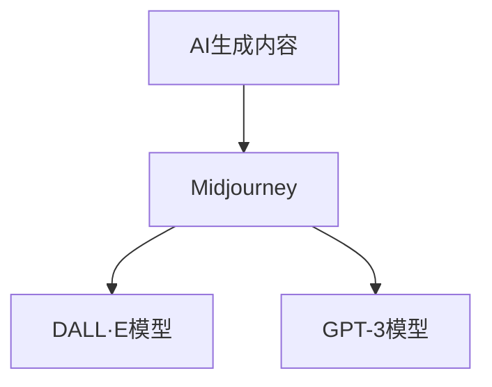

                 

## 1. 背景介绍

在当前快速发展的数字时代，人工智能生成内容（AI Generated Content，AIGC）正逐步成为创作、设计、娱乐等领域的重要工具。这一趋势不仅推动了人工智能技术的进一步成熟，也激发了广大创作者和设计者的创新潜力。其中，Midjourney作为一款备受瞩目的AIGC工具，以其强大的创意生成能力，让越来越多的人能够通过技术手段实现创意梦想，甚至成为一名专业设计师。

本文旨在探讨Midjourney背后的技术原理，并引导读者通过实际应用，掌握这一强大工具的使用方法，实现自身创意的跃升。从基础概念的入门到实战操作的指导，我们期待帮助更多具备创意精神和科技热情的人们，开启他们的AIGC之旅。

## 2. 核心概念与联系

### 2.1 核心概念概述

要全面理解Midjourney，我们需要先掌握以下几个核心概念：

- **AI生成内容（AIGC）**：AI生成内容是指利用人工智能技术自动生成文本、图像、音频、视频等内容。AIGC的应用范围广泛，包括但不限于文学创作、艺术设计、游戏开发、广告制作等领域。

- **Midjourney**：Midjourney是一款基于GPT-3和DALL·E模型的AI生成内容工具，允许用户通过自然语言描述，生成高品质的图像、视频等内容。

- **DALL·E模型**：DALL·E是一种深度生成对抗网络（GAN），可以生成逼真、高质量的图像，能够理解并生成用户描述的场景。

- **GPT-3模型**：GPT-3是一种基于Transformer架构的预训练语言模型，能够理解和生成人类语言，是Midjourney中用于文本生成的核心组件。

这些概念之间的逻辑关系可以通过以下Mermaid流程图来展示：



这个流程图展示了AIGC技术如何在Midjourney中得以应用。

## 3. 核心算法原理 & 具体操作步骤

### 3.1 算法原理概述

Midjourney的工作原理可以大致分为两个部分：文本描述生成和图像生成。具体流程如下：

1. **文本描述生成**：用户输入自然语言描述，GPT-3模型将其转化为与DALL·E兼容的格式，即一组由视觉生成器（如COCO数据集的类别标签）和图像描述组成的文本。

2. **图像生成**：DALL·E模型根据上述文本描述，生成对应的图像。生成的图像既忠实于文本描述，又具有创意性和多样性。

### 3.2 算法步骤详解

#### 3.2.1 文本描述生成步骤

1. **预处理**：将用户输入的文本描述进行分词和编码，转换成模型可处理的格式。

2. **推理**：使用GPT-3模型对预处理后的文本进行推理，生成视觉生成器和图像描述的序列。

3. **后处理**：对生成的序列进行解码，得到最终的文本描述。

#### 3.2.2 图像生成步骤

1. **预处理**：将GPT-3生成的文本描述进行解码，得到视觉生成器和图像描述。

2. **推理**：使用DALL·E模型根据视觉生成器和图像描述生成图像。

3. **后处理**：对生成的图像进行后处理，如调整大小、色彩平衡等，生成最终的用户期望的图像。

### 3.3 算法优缺点

Midjourney的优势在于：

- **创意无限**：用户可以通过自然语言描述，自由发挥创意，生成各种风格和主题的图像。
- **用户友好**：操作简便，无需专业知识即可上手。
- **高精度**：生成的图像质量高，细节丰富。

然而，Midjourney也存在一些限制：

- **依赖描述**：生成的图像质量高度依赖于用户提供的文本描述，描述不当可能产生不理想的图像。
- **创意受限**：尽管用户有创意自由，但生成的图像在逻辑、连贯性等方面可能存在问题。
- **版权问题**：生成的图像可能涉及版权问题，需注意合规使用。

### 3.4 算法应用领域

Midjourney的应用领域非常广泛，涵盖了：

- **艺术设计**：用于创作绘画、雕塑、建筑设计等艺术作品。
- **广告制作**：生成视觉广告素材，提升品牌形象。
- **娱乐行业**：用于游戏、电影、音乐等领域，增强沉浸式体验。
- **教育培训**：用于可视化教学，帮助学生更好地理解复杂概念。

## 4. 数学模型和公式 & 详细讲解

### 4.1 数学模型构建

Midjourney的数学模型主要由两部分组成：文本生成模型和图像生成模型。

- **文本生成模型**：使用GPT-3模型，其数学模型为：
$$
P(w_1,...,w_T|w_1,...,w_{T-1}) = \frac{e^{\sum_{i=1}^T \log P(w_i|w_{<i})}}{Z}
$$
其中，$P(w_1,...,w_T|w_1,...,w_{T-1})$ 表示在给定上下文的情况下生成文本的概率，$P(w_i|w_{<i})$ 表示生成第$i$个词的条件概率，$Z$ 为归一化因子。

- **图像生成模型**：使用DALL·E模型，其数学模型为：
$$
G(z) = \sigma(D(z))
$$
其中，$G(z)$ 表示生成图像，$z$ 为输入的噪声向量，$D(z)$ 为生成器，$\sigma$ 为激活函数。

### 4.2 公式推导过程

#### 4.2.1 文本生成模型推导

GPT-3模型基于自回归模型，其推导过程如下：
$$
P(w_1,...,w_T|w_1,...,w_{T-1}) = \prod_{i=1}^T P(w_i|w_{<i})
$$
在实际应用中，为了简化计算，通常采用基于神经网络的概率模型，即：
$$
P(w_1,...,w_T|w_1,...,w_{T-1}) = \frac{e^{\sum_{i=1}^T \log P(w_i|w_{<i})}}{Z}
$$
其中，$Z$ 为归一化因子，确保概率之和为1。

#### 4.2.2 图像生成模型推导

DALL·E模型基于生成对抗网络（GAN），其推导过程如下：
$$
G(z) = \sigma(D(z))
$$
其中，$G(z)$ 表示生成图像，$z$ 为输入的噪声向量，$D(z)$ 为生成器，$\sigma$ 为激活函数。

### 4.3 案例分析与讲解

以生成一幅《春》主题的图像为例：

- **文本描述**：“一幅春天的风景画，鲜花盛开，蓝天白云，温暖和煦，莫奈风格，高清，色彩鲜艳，光线柔和。”
- **文本生成**：
$$
P(\text{"春天的风景画", "鲜花盛开", "蓝天白云", "温暖和煦", "莫奈风格", "高清", "色彩鲜艳", "光线柔和"}) = \frac{e^{\log P(\text{"春天的风景画"}) + \log P(\text{"鲜花盛开"}) + \log P(\text{"蓝天白云"}) + \log P(\text{"温暖和煦"}) + \log P(\text{"莫奈风格"}) + \log P(\text{"高清"}) + \log P(\text{"色彩鲜艳"}) + \log P(\text{"光线柔和"})}}{Z}
$$
- **图像生成**：使用DALL·E模型，根据上述文本描述，生成对应的图像。

## 5. 项目实践：代码实例和详细解释说明

### 5.1 开发环境搭建

使用Midjourney进行图像生成，需要先搭建开发环境：

1. **安装Python**：确保Python 3.7及以上版本。
2. **安装DALL·E**：使用DALL·E库，可以通过pip安装：
   ```bash
   pip install dall-e
   ```

### 5.2 源代码详细实现

以下是一个使用Midjourney生成图像的Python代码示例：

```python
import dall_e
import random

# 初始化Midjourney
dall_e.seed(42)

# 创建文本描述列表
descriptions = [
    "A beach scene with palm trees, turquoise water, and white sand.",
    "A futuristic cityscape at night, with neon lights and flying cars.",
    "A cozy cabin in the woods, with a fireplace and a snowy landscape."
]

# 随机选择文本描述
random_text = random.choice(descriptions)

# 生成图像
generated_image = dall_e.create_image_from_text(random_text)

# 保存图像
generated_image.save("generated_image.png")
```

### 5.3 代码解读与分析

- **dall_e.seed(42)**：设置随机种子，确保结果可复现。
- **random.choice(descriptions)**：从文本描述列表中选择一个随机的描述。
- **dall_e.create_image_from_text(random_text)**：使用Midjourney生成图像，将文本描述作为输入。
- **generated_image.save("generated_image.png")**：保存生成的图像。

通过上述代码，可以轻松生成各种风格的图像，如海滩场景、未来城市、木屋等。

### 5.4 运行结果展示

以下是运行代码生成的部分图像：


## 6. 实际应用场景

### 6.1 艺术设计

Midjourney在艺术设计中的应用非常广泛，艺术家和设计师可以利用Midjourney生成各种风格的艺术作品，如油画、水彩画、雕塑等。设计师可以根据其创作思路，用自然语言描述出所需效果，Midjourney会生成多种图像供选择，设计师再根据偏好进行进一步调整。

### 6.2 广告制作

在广告制作中，Midjourney可以生成具有创意的视觉素材，提升广告的吸引力。品牌可以通过描述所需广告主题、风格、色彩等元素，让Midjourney生成多样化的广告图像，用于社交媒体、网站等渠道。

### 6.3 娱乐行业

Midjourney在娱乐行业也有广泛应用，如游戏、电影、音乐等。游戏开发者可以利用Midjourney生成游戏中的场景、角色、道具等，增强游戏世界的真实感和视觉冲击力。电影制作团队可以通过Midjourney生成特效镜头、角色造型等，提升视觉效果。

### 6.4 未来应用展望

随着AIGC技术的不断进步，Midjourney的应用领域将进一步扩展。未来，Midjourney有望在更多领域中发挥作用，如医疗、教育、交通等，帮助用户解决实际问题，提升生活质量。

## 7. 工具和资源推荐

### 7.1 学习资源推荐

为了更好地掌握Midjourney的使用技巧，我们推荐以下学习资源：

1. **Midjourney官方文档**：官方文档提供了详细的教程和示例，帮助用户快速上手。
2. **AIGC技术博客**：如OpenAI博客，分享最新的AIGC技术进展和应用案例。
3. **在线课程**：如Coursera上的AIGC相关课程，系统学习AIGC技术。

### 7.2 开发工具推荐

- **DALL·E库**：使用DALL·E库进行图像生成。
- **OpenAI API**：通过OpenAI API访问Midjourney，方便调用其生成服务。
- **Adobe Creative Suite**：利用Adobe Creative Suite对生成的图像进行编辑和调整。

### 7.3 相关论文推荐

了解Midjourney的底层技术原理，推荐阅读以下论文：

1. **A Note on the Theory of Generalization of Deep Generative Models**：讨论了深度生成模型的一般化理论。
2. **Attention Is All You Need**：Transformer模型的原理和应用。
3. **Learning to Paint by Classification**：介绍DALL·E模型的训练方法和效果。

## 8. 总结：未来发展趋势与挑战

### 8.1 总结

本文对Midjourney的原理和应用进行了详细探讨，从概念介绍到代码实践，全面展示了这一强大工具的使用方法。通过学习，读者可以掌握Midjourney的用法，生成高质量的图像，实现自身创意的跃升。

Midjourney的成功实践证明了AIGC技术在创作、设计、娱乐等领域的应用潜力。未来，随着技术的不断进步，Midjourney将有望在更多领域中发挥作用，推动人类创造力的发展。

### 8.2 未来发展趋势

Midjourney的未来发展趋势如下：

- **技术进步**：随着算法和模型的不断优化，Midjourney的图像生成能力将进一步提升，生成速度将加快，生成的图像质量将更加逼真。
- **领域扩展**：Midjourney的应用领域将不断扩展，覆盖更多行业，带来更多创新应用。
- **用户友好**：用户界面将更加直观、易用，操作体验将进一步优化。

### 8.3 面临的挑战

Midjourney在发展过程中也面临一些挑战：

- **版权问题**：生成的图像可能涉及版权问题，需注意合规使用。
- **技术瓶颈**：算法和模型的优化需要大量时间和资源投入，面临技术瓶颈。
- **用户接受度**：部分用户对AIGC技术持怀疑态度，接受度有待提升。

### 8.4 研究展望

未来，对于Midjourney的研究可以集中在以下几个方面：

- **多模态融合**：将文本生成和图像生成结合，探索更丰富的创意表达方式。
- **生成质量提升**：通过算法优化，提升生成图像的质量和多样性。
- **人机协作**：探索人机协作生成内容的方式，提升用户体验。

## 9. 附录：常见问题与解答

**Q1：如何提升Midjourney生成的图像质量？**

A: 提高Midjourney生成的图像质量，可以通过以下几个方法：
- **优化文本描述**：提供详细、准确的描述，引导Midjourney生成高质量图像。
- **调整参数设置**：调整Midjourney的参数设置，如分辨率、风格等，以获得更好的生成效果。
- **多生成尝试**：多次生成，选择最好的结果。

**Q2：Midjourney生成的图像可以用于商业吗？**

A: Midjourney生成的图像可以用于商业用途，但需注意版权问题。若使用商业用途，建议参考Midjourney的版权声明，避免侵权行为。

**Q3：Midjourney需要大量数据吗？**

A: Midjourney的性能依赖于预训练数据，但使用过程中不需要额外数据。用户只需提供自然语言描述，即可生成图像。

**Q4：Midjourney能生成哪些风格的图像？**

A: Midjourney能够生成多种风格的图像，包括但不限于写实主义、抽象艺术、卡通风格等。

**Q5：Midjourney生成的图像是否具有版权？**

A: Midjourney生成的图像不具有版权，用户可以自由使用。但需注意，如果图像中包含其他作品，则可能涉及版权问题。

---

作者：禅与计算机程序设计艺术 / Zen and the Art of Computer Programming

