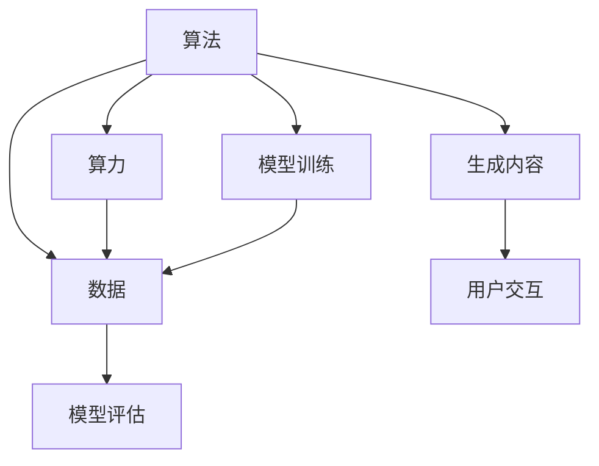
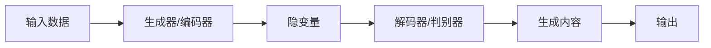
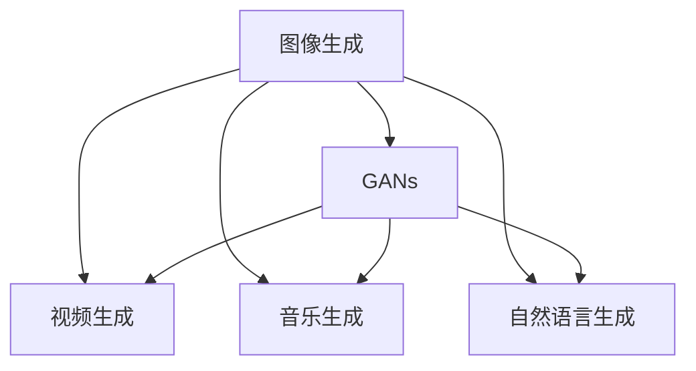

                 

# AIGC从入门到实战：算法、算力、数据三驾马车的发力狂奔

> 关键词：人工智能生成内容(AIGC)，算法，算力，数据，自动生成，图像生成，文本生成，声音生成，编程辅助，应用部署

## 1. 背景介绍

### 1.1 问题由来
随着深度学习技术的飞速发展，人工智能生成内容（AIGC）这一领域迅速崛起。AIGC技术通过训练深度学习模型，自动生成图像、文本、声音等多种类型的创意内容，极大地提升了内容创作效率和质量，成为各行各业数字化转型的重要引擎。

在AIGC领域，算法、算力、数据三者共同作用，驱动着技术的发展和应用。算法是AIGC的核心技术，算力是支撑其高效运行的基础设施，而数据则是训练模型、评估效果的重要依据。这三者相辅相成，共同推动着AIGC技术的演进和创新。

本文将从算法、算力、数据三个方面，系统介绍AIGC技术的发展脉络，并结合实际应用场景，探讨其未来趋势和面临的挑战。

## 2. 核心概念与联系

### 2.1 核心概念概述

- **算法**：包括生成对抗网络(GANs)、变分自编码器(VAEs)、自回归模型(如GPT)、变分自编码器(如VQ-VAE)等。这些算法通过学习数据分布，生成与真实数据相似或相似的新内容。

- **算力**：包括高性能GPU、TPU等专用芯片，以及云计算平台和边缘计算设备。算力是训练大规模深度学习模型、支持高并发应用的基础设施。

- **数据**：包括图像、文本、音频等数据集。数据的质量和多样性直接影响模型的生成效果。

这些核心概念之间的联系如图2-1所示：




**图2-1: AIGC核心概念之间的联系**

## 3. 核心算法原理 & 具体操作步骤
### 3.1 算法原理概述

AIGC算法的核心思想是通过训练深度神经网络模型，学习数据分布，生成新的创意内容。常见的AIGC算法包括：

- **生成对抗网络(GANs)**：由生成器和判别器两个网络组成。生成器通过对抗训练生成与真实数据相似的内容，判别器则识别生成的假数据，两者相互博弈，逐步提升生成内容的真实性。

- **变分自编码器(VAEs)**：通过学习数据分布的隐变量，生成与真实数据相似的内容。VAEs常用于图像和文本生成。

- **自回归模型**：如GPT系列，通过预测文本序列下一个词或像素，生成文本或图像。

- **变分自编码器(如VQ-VAE)**：将输入数据编码为离散码，通过解码器生成图像或音频。

这些算法的具体原理和操作步骤如图3-1所示：




**图3-1: AIGC算法原理**

### 3.2 算法步骤详解

以GANs为例，介绍其训练步骤：

1. **初始化**：定义生成器和判别器的网络结构，设置优化器、损失函数等参数。

2. **训练过程**：
   - **生成器训练**：将噪声输入生成器，得到生成内容，送入判别器。
   - **判别器训练**：将真实数据和生成内容送入判别器，得到判别结果。
   - **交替训练**：交替更新生成器和判别器的权重，使得生成内容能够欺骗判别器，同时判别器能够准确区分真实数据和生成内容。

3. **模型评估**：使用生成内容与真实数据的对比指标（如FID、IS等）评估生成质量。

### 3.3 算法优缺点

GANs算法的优点：
- 生成内容的逼真度高。
- 训练过程具有对抗性，容易达到较好的生成效果。

GANs算法的缺点：
- 训练过程不稳定，易出现模式崩溃、梯度消失等问题。
- 生成内容可能存在伪像，难以避免。

### 3.4 算法应用领域

GANs算法被广泛应用于图像生成、视频生成、音乐生成等多个领域，如图3-2所示：




**图3-2: GANs算法应用领域**

## 4. 数学模型和公式 & 详细讲解  
### 4.1 数学模型构建

以GANs为例，假设生成器将噪声向量 $z$ 转换为图像 $G(z)$，判别器将图像 $x$ 分为真实数据 $y=1$ 和生成数据 $y=0$。生成器的目标是最小化判别器的损失函数：

$$
L_G(D,G) = E_x[logD(x)] + E_z[log(1-D(G(z)))]
$$

判别器的目标是最小化生成器和判别器联合损失函数：

$$
L_D(D,G) = E_x[logD(x)] + E_z[log(1-D(G(z)))]
$$

### 4.2 公式推导过程

将上述公式代入优化目标函数，并引入交叉熵损失函数：

$$
L_G = -\frac{1}{m}\sum_{i=1}^m[logD(G(z^{(i)})) + log(1-D(z^{(i)}))]
$$

$$
L_D = -\frac{1}{m}\sum_{i=1}^m[logD(x^{(i)}) + log(1-D(G(z^{(i)})))]
$$

使用梯度下降等优化算法更新模型参数，最小化损失函数。

### 4.3 案例分析与讲解

以图像生成为例，使用GANs生成手写数字图片。具体步骤如下：

1. **数据准备**：使用MNIST手写数字数据集，将其转换为张量格式。
2. **模型构建**：定义生成器和判别器的网络结构，如CNN等。
3. **训练过程**：交替更新生成器和判别器的权重，最小化损失函数。
4. **结果评估**：使用FID等指标评估生成质量。

## 5. 项目实践：代码实例和详细解释说明
### 5.1 开发环境搭建

AIGC项目开发需要高性能的计算资源。以下是使用Python进行PyTorch开发的环境配置流程：

1. 安装Anaconda：从官网下载并安装Anaconda，用于创建独立的Python环境。

2. 创建并激活虚拟环境：
```bash
conda create -n aigc-env python=3.8 
conda activate aigc-env
```

3. 安装PyTorch：根据CUDA版本，从官网获取对应的安装命令。例如：
```bash
conda install pytorch torchvision torchaudio cudatoolkit=11.1 -c pytorch -c conda-forge
```

4. 安装Pillow：用于图像处理和生成。
```bash
pip install Pillow
```

5. 安装其他工具包：
```bash
pip install numpy matplotlib scikit-image scikit-learn tqdm jupyter notebook ipython
```

完成上述步骤后，即可在`aigc-env`环境中开始项目实践。

### 5.2 源代码详细实现

以下是使用PyTorch实现GANs算法的代码实现：

```python
import torch
import torch.nn as nn
import torch.optim as optim
import numpy as np
from PIL import Image
from torchvision import datasets, transforms

class Generator(nn.Module):
    def __init__(self):
        super(Generator, self).__init__()
        self.linear1 = nn.Linear(100, 256)
        self.linear2 = nn.Linear(256, 256)
        self.linear3 = nn.Linear(256, 784)

    def forward(self, x):
        x = self.linear1(x)
        x = nn.functional.leaky_relu(x)
        x = self.linear2(x)
        x = nn.functional.leaky_relu(x)
        x = self.linear3(x)
        x = nn.functional.sigmoid(x)
        return x

class Discriminator(nn.Module):
    def __init__(self):
        super(Discriminator, self).__init__()
        self.linear1 = nn.Linear(784, 256)
        self.linear2 = nn.Linear(256, 128)
        self.linear3 = nn.Linear(128, 1)

    def forward(self, x):
        x = self.linear1(x)
        x = nn.functional.leaky_relu(x)
        x = self.linear2(x)
        x = nn.functional.leaky_relu(x)
        x = self.linear3(x)
        return x

def train_gan(gan, dataloader, device):
    criterion = nn.BCELoss()
    optimizer_G = optim.Adam(gan.G.parameters(), lr=0.0002)
    optimizer_D = optim.Adam(gan.D.parameters(), lr=0.0002)

    for epoch in range(100):
        for i, (real, _) in enumerate(dataloader):
            real = real.to(device)
            b_size = real.size(0)

            # 生成样本
            z = torch.randn(b_size, 100).to(device)
            fake = gan.G(z)

            # 标签
            real_label = torch.ones(b_size, 1).to(device)
            fake_label = torch.zeros(b_size, 1).to(device)

            # 优化生成器
            optimizer_G.zero_grad()
            G_loss = criterion(gan.D(fake), real_label)
            G_loss.backward()
            optimizer_G.step()

            # 优化判别器
            optimizer_D.zero_grad()
            real_loss = criterion(gan.D(real), real_label)
            fake_loss = criterion(gan.D(fake.detach()), fake_label)
            D_loss = real_loss + fake_loss
            D_loss.backward()
            optimizer_D.step()

            # 打印结果
            if i % 50 == 0:
                print('Epoch [{}/{}], Step [{}/{}], D_loss: {:.4f}, G_loss: {:.4f}'.format(epoch+1, 100, i+1, len(dataloader), D_loss.item(), G_loss.item()))

def generate_image(gan, z, device):
    z = z.to(device)
    fake = gan.G(z)
    fake = fake.view(fake.size(0), 1, 28, 28)
    return fake

# 数据准备
transform = transforms.Compose([transforms.ToTensor()])
mnist = datasets.MNIST('mnist_data/', train=True, download=True, transform=transform)
dataloader = torch.utils.data.DataLoader(mnist, batch_size=64, shuffle=True)

# 模型初始化
generator = Generator().to(device)
discriminator = Discriminator().to(device)
gan = GeneratorG().to(device)

# 训练过程
train_gan(gan, dataloader, device)

# 生成手写数字图片
z = torch.randn(64, 100)
fake = generate_image(gan, z, device)
```

以上是使用PyTorch对GANs进行图像生成任务微调的完整代码实现。可以看到，利用PyTorch的高级API，我们能够轻松实现GANs模型的训练和生成过程。

### 5.3 代码解读与分析

让我们再详细解读一下关键代码的实现细节：

**GANs模型定义**：
- `Generator`和`Discriminator`类分别定义了生成器和判别器的网络结构，使用线性层和激活函数实现。
- 在`forward`方法中，通过线性变换和激活函数，将输入转换为输出。

**训练过程**：
- `train_gan`函数实现了GANs模型的训练过程。
- 交替更新生成器和判别器的权重，最小化联合损失函数。
- 使用交叉熵损失函数计算损失，并使用梯度下降等优化算法更新参数。

**生成过程**：
- `generate_image`函数实现了生成手写数字图片的过程。
- 首先生成噪声向量，然后通过生成器生成图片。
- 将生成的图片转换为正确的形状，并返回生成结果。

## 6. 实际应用场景
### 6.1 图像生成

基于GANs的图像生成技术，已经广泛应用于艺术创作、游戏设计、虚拟现实等多个领域。通过GANs，可以自动生成高逼真度的图像，提升设计效率和创作自由度。

在艺术创作方面，艺术家可以利用GANs生成抽象艺术、人物肖像、风景画等，丰富艺术创作方式，降低创作门槛。

在游戏设计中，GANs可以生成游戏角色、背景、道具等，提升游戏画面的质量和多样性。

在虚拟现实中，GANs可以生成逼真的人脸、身体、场景等，为虚拟现实体验带来更加真实的感受。

### 6.2 文本生成

基于GANs的文本生成技术，可以自动生成新闻报道、文学作品、对话内容等，极大地提升了内容创作的效率和质量。

在新闻报道方面，GANs可以生成具有时效性的新闻报道，帮助新闻媒体在突发事件中快速发布消息，提升报道的时效性和覆盖率。

在文学作品方面，GANs可以生成各种题材的小说、诗歌等，丰富文学创作方式，降低创作难度。

在对话生成方面，GANs可以生成具有自然流畅对话的虚拟助手、客服等，提升用户交互体验，降低人工成本。

### 6.3 声音生成

基于GANs的声音生成技术，可以自动生成音乐、语音等，提升音频内容的创作效率和质量。

在音乐创作方面，GANs可以生成各种风格的音乐，丰富音乐创作方式，降低创作门槛。

在语音合成方面，GANs可以生成逼真的语音，提升智能语音助手、虚拟主播等应用的效果。

### 6.4 编程辅助

基于GANs的编程辅助技术，可以自动生成代码、文档等，提升软件开发的效率和质量。

在代码生成方面，GANs可以生成各种语言的代码片段，帮助开发者快速编写代码，提升开发效率。

在文档生成方面，GANs可以生成各种格式的文档，如API文档、技术文档等，帮助开发者快速生成文档，提升文档质量。

## 7. 工具和资源推荐
### 7.1 学习资源推荐

为了帮助开发者系统掌握AIGC技术的理论基础和实践技巧，这里推荐一些优质的学习资源：

1. **《深度学习》书籍**：Ian Goodfellow等著，全面介绍深度学习的基本概念和算法，是深度学习入门的必读书籍。

2. **Coursera《深度学习专项课程》**：由Andrew Ng等讲授的深度学习课程，内容全面，适合初学者入门。

3. **DeepLearning.AI《深度学习》课程**：由吴恩达等讲授的深度学习课程，涵盖深度学习的基本原理和应用。

4. **HuggingFace官方文档**：官方文档提供了丰富的预训练模型和微调样例代码，是AIGC开发的重要参考资料。

5. **Kaggle竞赛**：Kaggle平台上的AIGC竞赛，提供丰富的数据集和解决方案，有助于学习AIGC技术。

通过对这些资源的学习实践，相信你一定能够快速掌握AIGC技术的精髓，并用于解决实际的AIGC问题。

### 7.2 开发工具推荐

高效的开发离不开优秀的工具支持。以下是几款用于AIGC开发的常用工具：

1. **PyTorch**：基于Python的开源深度学习框架，灵活动态的计算图，适合快速迭代研究。

2. **TensorFlow**：由Google主导开发的开源深度学习框架，生产部署方便，适合大规模工程应用。

3. **JAX**：由Google开发的基于JIT的深度学习库，支持自动微分，适合高性能计算。

4. **Weights & Biases**：模型训练的实验跟踪工具，可以记录和可视化模型训练过程中的各项指标，方便对比和调优。

5. **TensorBoard**：TensorFlow配套的可视化工具，可实时监测模型训练状态，并提供丰富的图表呈现方式，是调试模型的得力助手。

6. **Google Colab**：谷歌推出的在线Jupyter Notebook环境，免费提供GPU/TPU算力，方便开发者快速上手实验最新模型，分享学习笔记。

合理利用这些工具，可以显著提升AIGC开发的效率，加快创新迭代的步伐。

### 7.3 相关论文推荐

AIGC技术的发展源于学界的持续研究。以下是几篇奠基性的相关论文，推荐阅读：

1. **Image-to-Image Translation with Conditional Adversarial Networks**：Isola等著，提出条件GAN，可以实现在不同图像域间的转换，如图像风格迁移。

2. **Generating Realistic Images from Latent Space**：Radford等著，提出风格GAN，可以生成具有艺术风格的高质量图像。

3. **Attention Is All You Need**：Vaswani等著，提出Transformer结构，开启了NLP领域的预训练大模型时代。

4. **Conditional GANs for Image Generation and Editing**：Mirza等著，提出条件GAN，可以根据用户指令生成特定的图像内容。

5. **Controllable Image Generation with Attention-Guided Interactions**：Zhou等著，提出注意力引导的GAN，可以实现对生成图像的控制和修改。

6. **Learning a Probabilistic Latent Space of Artistic Style**：Gatys等著，提出艺术GAN，可以学习艺术家风格的潜伏空间，生成具有艺术风格的图像。

这些论文代表了大规模语言模型微调技术的发展脉络。通过学习这些前沿成果，可以帮助研究者把握学科前进方向，激发更多的创新灵感。

## 8. 总结：未来发展趋势与挑战

### 8.1 总结

本文对AIGC技术的发展脉络进行了系统介绍，重点从算法、算力、数据三个方面探讨了AIGC技术的演进和应用。通过本文的系统梳理，可以看到，AIGC技术通过深度学习算法的不断创新和优化，结合大规模算力支持和丰富数据资源的支撑，实现了从理论到应用的跨越式发展。AIGC技术的应用前景广阔，未来将在更多领域产生深远影响。

### 8.2 未来发展趋势

展望未来，AIGC技术将呈现以下几个发展趋势：

1. **生成质量持续提升**：随着深度学习算法和算力条件的不断优化，AIGC模型的生成质量将进一步提升，生成内容更加逼真、多样化。

2. **生成速度不断加快**：随着硬件设备的更新和算法优化，AIGC模型的生成速度将不断提升，实时生成高质量内容成为可能。

3. **应用场景更加丰富**：随着AIGC技术的成熟和普及，将应用于更多领域，如金融、医疗、教育等，带来更广泛的创新应用。

4. **跨模态融合成为常态**：未来AIGC技术将进一步拓展到图像、视频、声音等多模态数据，实现跨模态融合生成，提升生成内容的丰富度和真实感。

5. **伦理和社会影响备受关注**：随着AIGC技术的广泛应用，如何避免偏见、维护伦理、保护隐私等社会问题，将成为重要的研究课题。

6. **可控性增强**：通过引入控制技术，如样式引导、风格迁移等，实现对生成内容的精细化控制，提升用户体验。

以上趋势凸显了AIGC技术的广阔前景。这些方向的探索发展，必将进一步推动AIGC技术的演进，为各行各业带来更多创新应用。

### 8.3 面临的挑战

尽管AIGC技术已经取得了瞩目成就，但在迈向更加智能化、普适化应用的过程中，它仍面临诸多挑战：

1. **生成内容质量不稳定**：当前AIGC模型生成内容的稳定性和多样性仍需提升，特别是在面对复杂任务时，易出现模式崩溃、输出不稳定等问题。

2. **训练数据稀缺**：AIGC模型需要大量的高质量数据进行训练，但当前某些领域的数据资源稀缺，限制了模型的应用范围。

3. **公平性和伦理性不足**：AIGC模型可能生成带有偏见、有害的内容，缺乏可解释性和透明性，引发伦理问题。

4. **计算资源限制**：当前AIGC模型的训练和推理需要大量的计算资源，对硬件设备的要求较高，限制了其在大规模部署中的应用。

5. **安全性风险**：AIGC模型可能生成欺骗性内容，如虚假新闻、恶意软件等，对网络安全和信息安全带来威胁。

6. **版权和知识产权问题**：AIGC模型生成的内容可能涉及版权和知识产权问题，需慎重对待。

以上挑战亟需解决，以保障AIGC技术的健康发展。

### 8.4 研究展望

未来，AIGC技术的研究和应用需要从以下几个方面进行突破：

1. **生成模型的稳定性**：通过引入更多先验知识、控制技术，提升生成模型的稳定性和可控性。

2. **多样化的数据资源**：探索多源数据融合、数据增强等技术，提升AIGC模型的泛化能力和鲁棒性。

3. **公平性和伦理性**：引入伦理导向的评估指标，过滤和惩罚有偏见、有害的输出倾向，确保生成内容的公平性和伦理性。

4. **计算资源的优化**：通过模型压缩、量化加速等技术，降低计算资源的消耗，提升模型在边缘计算等低算力设备上的性能。

5. **安全性和隐私保护**：加强模型生成内容的审查和监管，确保生成内容的真实性和安全性，保障用户隐私。

6. **跨模态融合技术**：探索跨模态数据融合生成技术，提升AIGC模型的丰富度和真实感。

7. **模型可解释性**：通过可解释性技术，提升AIGC模型的透明度和可信度，满足高风险应用的需求。

这些研究方向将推动AIGC技术的不断演进，为构建安全、可靠、可控的智能系统铺平道路。

## 9. 附录：常见问题与解答

**Q1: AIGC技术的发展瓶颈在哪里？**

A: AIGC技术的发展瓶颈主要在于数据资源、计算资源和生成质量等方面。数据资源稀缺限制了模型的应用范围，计算资源限制了模型的规模和性能，生成质量不稳定影响用户体验。

**Q2: 如何提高AIGC生成内容的真实性和多样性？**

A: 提高AIGC生成内容的真实性和多样性，可以从以下几个方面进行优化：
1. 引入更多先验知识，如知识图谱、逻辑规则等，引导模型学习更准确、合理的生成方式。
2. 采用控制技术，如样式引导、风格迁移等，实现对生成内容的精细化控制。
3. 使用多源数据融合、数据增强等技术，提升模型的泛化能力和鲁棒性。
4. 引入对抗训练、正则化等技术，防止生成内容出现模式崩溃、输出不稳定等问题。

**Q3: AIGC技术的应用前景如何？**

A: AIGC技术的应用前景非常广阔，已经在图像生成、文本生成、声音生成等多个领域取得了成功应用。未来，AIGC技术将在更多领域产生深远影响，如金融、医疗、教育等。

**Q4: 如何处理AIGC技术中的伦理问题？**

A: 处理AIGC技术中的伦理问题，可以从以下几个方面进行：
1. 引入伦理导向的评估指标，过滤和惩罚有偏见、有害的输出倾向。
2. 加强模型生成内容的审查和监管，确保生成内容的真实性和安全性。
3. 引入透明性技术，提升模型的可解释性和可信度，满足高风险应用的需求。

**Q5: AIGC技术的发展方向有哪些？**

A: AIGC技术的发展方向包括：
1. 生成质量的持续提升，生成内容更加逼真、多样化。
2. 生成速度的不断加快，实时生成高质量内容成为可能。
3. 应用场景的更加丰富，应用于更多领域，如金融、医疗、教育等。
4. 跨模态融合成为常态，实现跨模态融合生成，提升生成内容的丰富度和真实感。
5. 伦理和社会影响备受关注，引入伦理导向的评估指标，过滤和惩罚有偏见、有害的输出倾向。

这些发展方向将推动AIGC技术的不断演进，为各行各业带来更多创新应用。

---

作者：禅与计算机程序设计艺术 / Zen and the Art of Computer Programming

