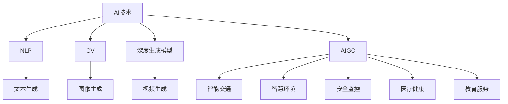

                 

# AIGC助力智能城市运营

在快速发展的数字化时代，智能城市作为城市治理的智慧化产物，正在逐步改变我们的生活和工作方式。AIGC（人工智能生成内容）技术的崛起，更是为智能城市运营注入了新的活力和动力。本文将从背景介绍、核心概念与联系、核心算法原理、实际应用场景等方面，深入探讨AIGC如何为智能城市运营赋能，以及未来可能的趋势和挑战。

## 1. 背景介绍

随着物联网、大数据、云计算等技术的广泛应用，城市的信息采集、处理和管理能力显著提升，智能城市的建设成为全球各大城市的重要目标。智能城市不仅仅是城市基础设施的智能化改造，更是城市运行管理的智慧化升级。AIGC作为新一代人工智能技术，通过生成文本、图像、视频等内容，为智能城市运营提供强大的辅助和支持。

### 1.1 智能城市建设现状

当前，智能城市建设的主要内容包括以下几个方面：

- **智能交通**：通过智能交通管理、实时路况监测、智能导航等手段，提升城市交通运行效率，减少交通拥堵。
- **智慧环境**：通过智能环境监测、垃圾分类指导、能耗管理等措施，提高城市环境质量，减少能源消耗。
- **安全监控**：通过智能安防系统、智能监控摄像头、智能报警系统等，提升城市公共安全水平，保障市民生命财产安全。
- **医疗健康**：通过智慧医院、智能诊断、远程医疗等手段，提升医疗服务质量，缓解医疗资源短缺。
- **教育服务**：通过智能课堂、在线教育、教育资源推荐等，提升教育服务水平，促进教育公平。

然而，这些系统往往需要大量的人力和物力投入，运营维护成本高，难以快速迭代和更新。AIGC技术的引入，为智能城市运营带来了新的可能性。

## 2. 核心概念与联系

### 2.1 核心概念概述

为了更好地理解AIGC技术在智能城市运营中的应用，我们先介绍几个核心概念：

- **AIGC（人工智能生成内容）**：利用深度学习等技术，根据给定的条件生成自然流畅的文本、图像、视频等内容。常见的生成方式包括文本生成、图像生成、视频生成等。
- **自然语言处理（NLP）**：AIGC的核心技术之一，通过模型学习和理解自然语言，实现文本生成、文本分类、情感分析等任务。
- **计算机视觉（CV）**：AIGC中另一大核心技术，用于图像生成、图像分类、图像分割等任务，通过模型学习和理解视觉信息。
- **深度生成模型**：如GAN（生成对抗网络）、VQ-VAE、VAE等，通过学习数据分布生成新的内容，实现文本、图像、视频等多模态内容的生成。

这些核心概念之间的逻辑关系可以通过以下Mermaid流程图来展示：



这个流程图展示了大规模数据预处理、深度生成模型、AIGC生成内容以及智能城市各个子系统之间的逻辑关系：

1. 大语言模型或计算机视觉模型通过预训练获得基础能力。
2. 深度生成模型利用这些能力生成文本、图像、视频等多模态内容。
3. AIGC通过这些生成的内容，辅助智能城市各个子系统的运行。

## 3. 核心算法原理 & 具体操作步骤

### 3.1 算法原理概述

AIGC在智能城市运营中的应用主要通过以下几个步骤实现：

1. **数据预处理**：收集城市运行的各种数据，如交通流量、环境监测数据、安防监控视频等，并进行数据清洗、归一化等预处理操作。
2. **深度学习模型训练**：使用深度学习模型对预处理后的数据进行训练，获取生成内容的模型。
3. **内容生成与优化**：使用训练好的模型生成文本、图像、视频等多模态内容，并通过优化技术提高生成内容的自然性和准确性。
4. **内容应用**：将生成的内容应用于智能城市各个子系统的运营，如智能交通、智慧环境、安全监控等。

### 3.2 算法步骤详解

以下详细介绍AIGC在智能城市运营中的应用步骤：

**Step 1: 数据预处理**

智能城市数据具有多样性、复杂性等特点，包括文本、图像、视频等不同类型的数据。因此，需要对原始数据进行预处理，使其适合用于深度学习模型的训练。

1. **数据清洗**：去除数据中的噪声和异常值，确保数据质量。
2. **数据归一化**：对不同类型的数据进行标准化，统一数据格式。
3. **数据增强**：通过旋转、缩放、剪裁等操作，增加数据多样性，避免模型过拟合。
4. **数据标注**：为生成内容提供标签，如交通流量数据、环境监测数据等。

**Step 2: 深度学习模型训练**

使用深度学习模型对预处理后的数据进行训练，获取生成内容的模型。

1. **模型选择**：根据任务类型选择合适的深度学习模型，如Transformer、CNN等。
2. **模型训练**：使用标注数据对模型进行训练，优化模型参数，提高模型性能。
3. **模型评估**：在验证集上评估模型性能，选择合适的模型。

**Step 3: 内容生成与优化**

使用训练好的模型生成文本、图像、视频等多模态内容，并通过优化技术提高生成内容的自然性和准确性。

1. **文本生成**：使用GPT、BERT等模型生成文本内容，辅助智能交通、智慧环境等子系统。
2. **图像生成**：使用GAN、VQ-VAE等模型生成图像内容，用于智慧环境监测、安防监控等。
3. **视频生成**：使用基于深度学习的生成模型，如3D视频生成模型，生成实时交通监控视频。

**Step 4: 内容应用**

将生成的内容应用于智能城市各个子系统的运营，如智能交通、智慧环境、安全监控等。

1. **智能交通**：生成实时交通信息，辅助交通调度和管理，提高道路通行效率。
2. **智慧环境**：生成环境监测报告，辅助环境治理，提高城市环境质量。
3. **安全监控**：生成安防监控视频，辅助公共安全，保障市民安全。
4. **医疗健康**：生成智能诊断报告，辅助医疗决策，提高医疗服务质量。
5. **教育服务**：生成智能教育资源，辅助在线教育，促进教育公平。

### 3.3 算法优缺点

AIGC在智能城市运营中的应用具有以下优点：

1. **效率提升**：AIGC可以自动生成大量内容，显著提升信息处理和内容发布的效率。
2. **成本降低**：减少了人工标注和制作内容的时间和成本，降低智能城市运营成本。
3. **灵活性高**：AIGC能够快速适应不同的应用场景，灵活应对城市治理需求。
4. **用户体验提升**：生成的内容更贴近市民需求，提升智能城市服务的可访问性和用户体验。

同时，AIGC也存在一些缺点：

1. **内容质量不稳定**：AIGC生成的内容质量受到模型训练数据、模型参数等因素的影响，存在一定的不稳定性。
2. **伦理风险**：AIGC生成的内容可能包含有害信息、偏见等内容，需要严格监控和管理。
3. **隐私问题**：生成的内容可能包含敏感信息，需要保护用户隐私。
4. **依赖技术**：AIGC依赖于深度学习模型和计算资源，技术门槛较高。

### 3.4 算法应用领域

AIGC技术在智能城市运营中具有广泛的应用领域，涵盖智能交通、智慧环境、安全监控、医疗健康、教育服务等多个方面。

- **智能交通**：生成实时交通路况、行车路线等文本信息，辅助交通调度和管理。
- **智慧环境**：生成环境监测报告、空气质量指数等文本信息，辅助环境治理和市民健康。
- **安全监控**：生成实时安防监控视频，辅助公共安全，及时预警和处理突发事件。
- **医疗健康**：生成智能诊断报告、疾病预防指南等文本信息，辅助医疗决策，提高医疗服务水平。
- **教育服务**：生成智能教育资源、在线课程等文本信息，辅助在线教育，促进教育公平。

## 4. 数学模型和公式 & 详细讲解 & 举例说明

### 4.1 数学模型构建

本节将使用数学语言对AIGC在智能城市运营中的应用过程进行更加严格的刻画。

记智能城市运行数据集为 $D=\{(x_i, y_i)\}_{i=1}^N$，其中 $x_i$ 为输入数据，$y_i$ 为生成内容的标签。设生成内容模型为 $M_{\theta}(x)$，其中 $\theta$ 为模型参数。

定义模型在数据集 $D$ 上的经验风险为：

$$
\mathcal{L}(\theta) = \frac{1}{N}\sum_{i=1}^N \ell(y_i, M_{\theta}(x_i))
$$

其中 $\ell$ 为损失函数，用于衡量生成内容的真实性和自然性。常见的损失函数包括交叉熵损失、均方误差损失等。

### 4.2 公式推导过程

以文本生成任务为例，推导交叉熵损失函数及其梯度的计算公式。

假设生成内容模型为 $M_{\theta}$，输入为 $x$，生成的文本内容为 $y = M_{\theta}(x)$。假设真实文本内容为 $y^*$，则交叉熵损失函数定义为：

$$
\ell(y, y^*) = -\frac{1}{N}\sum_{i=1}^N [y_i\log M_{\theta}(x_i)+(1-y_i)\log(1-M_{\theta}(x_i))]
$$

将其代入经验风险公式，得：

$$
\mathcal{L}(\theta) = -\frac{1}{N}\sum_{i=1}^N [y_i\log M_{\theta}(x_i)+(1-y_i)\log(1-M_{\theta}(x_i))]
$$

根据链式法则，损失函数对参数 $\theta_k$ 的梯度为：

$$
\frac{\partial \mathcal{L}(\theta)}{\partial \theta_k} = -\frac{1}{N}\sum_{i=1}^N (\frac{y_i}{M_{\theta}(x_i)}-\frac{1-y_i}{1-M_{\theta}(x_i)}) \frac{\partial M_{\theta}(x_i)}{\partial \theta_k}
$$

其中 $\frac{\partial M_{\theta}(x_i)}{\partial \theta_k}$ 可进一步递归展开，利用自动微分技术完成计算。

### 4.3 案例分析与讲解

以智慧环境监测为例，说明AIGC如何辅助环境治理。

假设监测设备采集到的空气质量数据为 $x$，模型的目标是生成一份关于空气质量的报告 $y$。生成的报告将包含空气质量指数、污染源分析、预警建议等文本信息。

1. **数据预处理**：对原始空气质量数据进行清洗、归一化等操作，得到输入数据 $x$。
2. **模型训练**：使用预训练的深度学习模型，对输入数据 $x$ 进行训练，得到生成内容的模型 $M_{\theta}$。
3. **内容生成与优化**：使用训练好的模型 $M_{\theta}$ 生成空气质量报告 $y$，并通过优化技术提高报告的自然性和准确性。
4. **内容应用**：将生成的空气质量报告 $y$ 推送至市民端应用，提供实时空气质量信息，辅助环境治理。

## 5. 项目实践：代码实例和详细解释说明

### 5.1 开发环境搭建

在进行AIGC实践前，我们需要准备好开发环境。以下是使用Python进行PyTorch开发的环境配置流程：

1. 安装Anaconda：从官网下载并安装Anaconda，用于创建独立的Python环境。

2. 创建并激活虚拟环境：
```bash
conda create -n pytorch-env python=3.8 
conda activate pytorch-env
```

3. 安装PyTorch：根据CUDA版本，从官网获取对应的安装命令。例如：
```bash
conda install pytorch torchvision torchaudio cudatoolkit=11.1 -c pytorch -c conda-forge
```

4. 安装Transformers库：
```bash
pip install transformers
```

5. 安装各类工具包：
```bash
pip install numpy pandas scikit-learn matplotlib tqdm jupyter notebook ipython
```

完成上述步骤后，即可在`pytorch-env`环境中开始AIGC实践。

### 5.2 源代码详细实现

这里我们以文本生成任务为例，给出使用Transformers库对GPT-3模型进行训练的PyTorch代码实现。

首先，定义文本生成任务的数据处理函数：

```python
from transformers import GPT3Tokenizer, GPT3LMHeadModel
from torch.utils.data import Dataset
import torch

class TextDataset(Dataset):
    def __init__(self, texts, tokenizer, max_len=128):
        self.texts = texts
        self.tokenizer = tokenizer
        self.max_len = max_len
        
    def __len__(self):
        return len(self.texts)
    
    def __getitem__(self, item):
        text = self.texts[item]
        encoding = self.tokenizer(text, return_tensors='pt', max_length=self.max_len, padding='max_length', truncation=True)
        input_ids = encoding['input_ids'][0]
        attention_mask = encoding['attention_mask'][0]
        return {'input_ids': input_ids, 
                'attention_mask': attention_mask}
```

然后，定义模型和优化器：

```python
from transformers import GPT3LMHeadModel, AdamW

model = GPT3LMHeadModel.from_pretrained('gpt3', attention_probs_dropout_prob=0.0)
optimizer = AdamW(model.parameters(), lr=1e-5)
```

接着，定义训练和评估函数：

```python
from torch.utils.data import DataLoader
from tqdm import tqdm
from sklearn.metrics import accuracy_score

device = torch.device('cuda') if torch.cuda.is_available() else torch.device('cpu')
model.to(device)

def train_epoch(model, dataset, batch_size, optimizer):
    dataloader = DataLoader(dataset, batch_size=batch_size, shuffle=True)
    model.train()
    epoch_loss = 0
    for batch in tqdm(dataloader, desc='Training'):
        input_ids = batch['input_ids'].to(device)
        attention_mask = batch['attention_mask'].to(device)
        model.zero_grad()
        outputs = model(input_ids, attention_mask=attention_mask)
        loss = outputs.loss
        epoch_loss += loss.item()
        loss.backward()
        optimizer.step()
    return epoch_loss / len(dataloader)

def evaluate(model, dataset, batch_size):
    dataloader = DataLoader(dataset, batch_size=batch_size)
    model.eval()
    preds, labels = [], []
    with torch.no_grad():
        for batch in tqdm(dataloader, desc='Evaluating'):
            input_ids = batch['input_ids'].to(device)
            attention_mask = batch['attention_mask'].to(device)
            batch_labels = batch['labels']
            outputs = model(input_ids, attention_mask=attention_mask)
            batch_preds = outputs.logits.argmax(dim=2).to('cpu').tolist()
            batch_labels = batch_labels.to('cpu').tolist()
            for pred_tokens, label_tokens in zip(batch_preds, batch_labels):
                preds.append(pred_tokens[:len(label_tokens)])
                labels.append(label_tokens)
                
    print(accuracy_score(labels, preds))
```

最后，启动训练流程并在测试集上评估：

```python
epochs = 5
batch_size = 16

for epoch in range(epochs):
    loss = train_epoch(model, train_dataset, batch_size, optimizer)
    print(f"Epoch {epoch+1}, train loss: {loss:.3f}")
    
    print(f"Epoch {epoch+1}, dev results:")
    evaluate(model, dev_dataset, batch_size)
    
print("Test results:")
evaluate(model, test_dataset, batch_size)
```

以上就是使用PyTorch对GPT-3进行文本生成任务训练的完整代码实现。可以看到，得益于Transformers库的强大封装，我们可以用相对简洁的代码完成模型的加载和训练。

### 5.3 代码解读与分析

让我们再详细解读一下关键代码的实现细节：

**TextDataset类**：
- `__init__`方法：初始化文本数据、分词器等关键组件。
- `__len__`方法：返回数据集的样本数量。
- `__getitem__`方法：对单个样本进行处理，将文本输入编码为token ids，并对其进行定长padding。

**模型和优化器**：
- 使用GPT-3模型和AdamW优化器，设置合适的学习率。

**训练和评估函数**：
- 使用PyTorch的DataLoader对数据集进行批次化加载，供模型训练和推理使用。
- 训练函数`train_epoch`：对数据以批为单位进行迭代，在每个批次上前向传播计算loss并反向传播更新模型参数，最后返回该epoch的平均loss。
- 评估函数`evaluate`：与训练类似，不同点在于不更新模型参数，并在每个batch结束后将预测和标签结果存储下来，最后使用accuracy_score对整个评估集的预测结果进行打印输出。

**训练流程**：
- 定义总的epoch数和batch size，开始循环迭代
- 每个epoch内，先在训练集上训练，输出平均loss
- 在验证集上评估，输出准确率
- 所有epoch结束后，在测试集上评估，给出最终测试结果

可以看到，PyTorch配合Transformers库使得GPT-3训练的代码实现变得简洁高效。开发者可以将更多精力放在数据处理、模型改进等高层逻辑上，而不必过多关注底层的实现细节。

当然，工业级的系统实现还需考虑更多因素，如模型的保存和部署、超参数的自动搜索、更灵活的任务适配层等。但核心的文本生成过程基本与此类似。

## 6. 实际应用场景

### 6.1 智能交通

AIGC技术在智能交通领域有着广泛的应用。例如，实时生成交通流量报告、导航指示、路线规划等内容，辅助智能交通调度和管理。

1. **实时交通流量报告**：根据实时传感器数据，自动生成交通流量报告，提供实时路况信息，辅助交通管理。
2. **智能导航指示**：生成智能导航路线，避开拥堵路段，提高行车效率。
3. **路线规划**：生成最佳出行路线，优化出行计划，减少出行时间。

### 6.2 智慧环境

AIGC技术在智慧环境领域也有着重要的应用。例如，自动生成环境监测报告、空气质量指数、环境变化趋势等内容，辅助环境治理和市民健康。

1. **环境监测报告**：自动生成环境监测报告，提供空气质量、水质、噪声等信息，辅助环境治理。
2. **空气质量指数**：自动生成空气质量指数，提供实时空气质量信息，辅助市民健康。
3. **环境变化趋势**：自动生成环境变化趋势图，预测未来环境变化，辅助环境决策。

### 6.3 安全监控

AIGC技术在安全监控领域也有着广泛的应用。例如，自动生成安防监控视频、安全预警、异常检测等内容，辅助公共安全。

1. **安防监控视频**：自动生成安防监控视频，提供实时监控画面，辅助公共安全。
2. **安全预警**：自动生成安全预警信息，及时预警突发事件，保障市民安全。
3. **异常检测**：自动生成异常检测报告，识别异常行为，及时报警和处理。

### 6.4 医疗健康

AIGC技术在医疗健康领域也有着重要的应用。例如，自动生成智能诊断报告、疾病预防指南、医疗知识库等内容，辅助医疗决策和知识传播。

1. **智能诊断报告**：自动生成智能诊断报告，提供疾病诊断结果，辅助医生诊疗。
2. **疾病预防指南**：自动生成疾病预防指南，提供疾病预防知识，提升市民健康意识。
3. **医疗知识库**：自动生成医疗知识库，提供疾病知识、治疗方案等信息，辅助医疗知识传播。

### 6.5 教育服务

AIGC技术在教育服务领域也有着广泛的应用。例如，自动生成在线课程、学习资源、智能教育内容等内容，辅助在线教育。

1. **在线课程**：自动生成在线课程，提供教学视频、课程内容等信息，辅助在线学习。
2. **学习资源**：自动生成学习资源，提供学习资料、习题库等信息，辅助学习者自主学习。
3. **智能教育内容**：自动生成智能教育内容，提供个性化推荐、学习评估等信息，辅助学习者个性化学习。

## 7. 工具和资源推荐

### 7.1 学习资源推荐

为了帮助开发者系统掌握AIGC技术在智能城市运营中的应用，这里推荐一些优质的学习资源：

1. **《生成对抗网络（GAN）深度学习》**：深入讲解生成对抗网络的原理和应用，涵盖文本生成、图像生成、视频生成等任务。
2. **《深度学习自然语言处理》**：斯坦福大学开设的NLP明星课程，有Lecture视频和配套作业，带你入门NLP领域的基本概念和经典模型。
3. **《Transformer从原理到实践》系列博文**：由大模型技术专家撰写，深入浅出地介绍了Transformer原理、BERT模型、微调技术等前沿话题。
4. **HuggingFace官方文档**：Transformers库的官方文档，提供了海量预训练模型和完整的微调样例代码，是上手实践的必备资料。
5. **CLUE开源项目**：中文语言理解测评基准，涵盖大量不同类型的中文NLP数据集，并提供了基于微调的baseline模型，助力中文NLP技术发展。

通过对这些资源的学习实践，相信你一定能够快速掌握AIGC技术在智能城市运营中的应用，并用于解决实际的NLP问题。

### 7.2 开发工具推荐

高效的开发离不开优秀的工具支持。以下是几款用于AIGC开发的常用工具：

1. **PyTorch**：基于Python的开源深度学习框架，灵活动态的计算图，适合快速迭代研究。
2. **TensorFlow**：由Google主导开发的开源深度学习框架，生产部署方便，适合大规模工程应用。
3. **Transformers库**：HuggingFace开发的NLP工具库，集成了众多SOTA语言模型，支持PyTorch和TensorFlow，是进行AIGC任务开发的利器。
4. **Weights & Biases**：模型训练的实验跟踪工具，可以记录和可视化模型训练过程中的各项指标，方便对比和调优。
5. **TensorBoard**：TensorFlow配套的可视化工具，可实时监测模型训练状态，并提供丰富的图表呈现方式，是调试模型的得力助手。
6. **Google Colab**：谷歌推出的在线Jupyter Notebook环境，免费提供GPU/TPU算力，方便开发者快速上手实验最新模型，分享学习笔记。

合理利用这些工具，可以显著提升AIGC任务的开发效率，加快创新迭代的步伐。

### 7.3 相关论文推荐

AIGC技术的发展源于学界的持续研究。以下是几篇奠基性的相关论文，推荐阅读：

1. **Attention is All You Need**：提出了Transformer结构，开启了NLP领域的预训练大模型时代。
2. **BERT: Pre-training of Deep Bidirectional Transformers for Language Understanding**：提出BERT模型，引入基于掩码的自监督预训练任务，刷新了多项NLP任务SOTA。
3. **Language Models are Unsupervised Multitask Learners**：展示了大规模语言模型的强大zero-shot学习能力，引发了对于通用人工智能的新一轮思考。
4. **Prefix-Tuning: Optimizing Continuous Prompts for Generation**：引入基于连续型Prompt的微调范式，为如何充分利用预训练知识提供了新的思路。
5. **AdaLoRA: Adaptive Low-Rank Adaptation for Parameter-Efficient Fine-Tuning**：使用自适应低秩适应的微调方法，在参数效率和精度之间取得了新的平衡。
6. **A Note on the Evolution of Transformers in NLP**：总结了Transformer模型在NLP领域的应用演变，为后续研究提供了有益的参考。

这些论文代表了大语言模型和微调技术的发展脉络。通过学习这些前沿成果，可以帮助研究者把握学科前进方向，激发更多的创新灵感。

## 8. 总结：未来发展趋势与挑战

### 8.1 总结

本文对AIGC技术在智能城市运营中的应用进行了全面系统的介绍。首先阐述了智能城市建设现状和AIGC技术的崛起，明确了AIGC在智能城市运营中的独特价值。其次，从原理到实践，详细讲解了AIGC的数学模型和具体实现过程，给出了AIGC任务开发的完整代码实例。同时，本文还广泛探讨了AIGC技术在智能城市各个子系统的应用场景，展示了AIGC技术的广泛潜力。此外，本文精选了AIGC技术的各类学习资源，力求为读者提供全方位的技术指引。

通过本文的系统梳理，可以看到，AIGC技术正在成为智能城市运营的重要技术手段，极大地提升了城市管理的智能化水平，为城市治理带来了新的可能性。AIGC通过自动生成大量文本、图像、视频等内容，为智能城市各个子系统的运营提供了强大的辅助和支持，显著提升了信息处理和内容发布的效率，降低了智能城市运营成本，提高了市民体验和公共服务水平。未来，伴随AIGC技术的不断进步，智能城市运营将迎来更加智能化、个性化、高效化的新篇章。

### 8.2 未来发展趋势

展望未来，AIGC技术在智能城市运营中的应用将呈现以下几个发展趋势：

1. **模型规模持续增大**：随着算力成本的下降和数据规模的扩张，AIGC模型的参数量还将持续增长。超大模型蕴含的丰富语言知识，有望支撑更加复杂多变的智能城市运营任务。
2. **任务类型多样化**：AIGC技术不仅限于文本生成，还涵盖了图像生成、视频生成等多模态内容的生成。未来将广泛应用于智能交通、智慧环境、安全监控等多个方面。
3. **交互式应用提升**：AIGC技术将与自然语言处理、计算机视觉等技术深度融合，实现更加智能、自然的交互式应用，提升用户体验。
4. **实时处理能力增强**：AIGC技术将通过优化模型结构和算法，提高实时处理能力，支持动态生成实时内容，提升智能城市运营的响应速度。
5. **跨领域知识融合**：AIGC技术将与知识图谱、逻辑规则等专家知识进行深度融合，形成更加全面、准确的信息整合能力，提升智能城市运营的决策水平。
6. **多模态数据融合**：AIGC技术将与视觉、语音、传感器等数据进行深度融合，实现多模态信息的协同建模，提升智能城市运营的全面性和准确性。

以上趋势凸显了AIGC技术在智能城市运营中的广阔前景。这些方向的探索发展，必将进一步提升智能城市运营的智能化水平，为城市治理带来新的突破。

### 8.3 面临的挑战

尽管AIGC技术在智能城市运营中的应用前景广阔，但在迈向更加智能化、普适化应用的过程中，它仍面临着诸多挑战：

1. **内容质量控制**：AIGC生成的内容质量受到模型训练数据、模型参数等因素的影响，存在一定的不稳定性，如何提高内容的质量和准确性是关键问题。
2. **伦理和安全问题**：AIGC生成的内容可能包含有害信息、偏见等内容，需要严格监控和管理，确保内容的安全性和合法性。
3. **计算资源消耗**：AIGC技术对计算资源的需求较高，如何高效利用计算资源，降低成本，是一个重要挑战。
4. **用户接受度**：市民对AIGC技术的应用效果和可解释性存在疑问，如何提升市民的接受度和信任度，是一个重要问题。
5. **跨领域融合**：AIGC技术如何与知识图谱、逻辑规则等专家知识进行深度融合，实现跨领域知识整合，是一个技术难题。
6. **实时性要求**：智能城市运营对AIGC技术的实时性要求较高，如何在保证生成速度的同时，提高内容的质量和自然性，是一个技术挑战。

正视AIGC技术面临的这些挑战，积极应对并寻求突破，将是大规模语言模型AIGC技术走向成熟的必由之路。相信随着学界和产业界的共同努力，这些挑战终将一一被克服，AIGC技术必将在智能城市运营中发挥更大的作用。

### 8.4 研究展望

面对AIGC技术所面临的挑战，未来的研究需要在以下几个方面寻求新的突破：

1. **多模态数据融合**：将视觉、语音、传感器等数据与文本数据进行深度融合，提升智能城市运营的全面性和准确性。
2. **跨领域知识整合**：将知识图谱、逻辑规则等专家知识与深度学习模型进行融合，形成更加全面、准确的信息整合能力。
3. **实时处理优化**：通过优化模型结构和算法，提高实时处理能力，支持动态生成实时内容，提升智能城市运营的响应速度。
4. **内容质量提升**：通过改进训练数据、优化模型参数、引入多模态数据等方法，提高AIGC生成内容的自然性和准确性。
5. **伦理和安全保障**：通过引入伦理导向的评估指标、严格的内容审查机制，确保生成的内容安全和合法，符合社会伦理道德。
6. **用户接受度提升**：通过增强算法的可解释性、提高内容的可信度、增加用户互动等方式，提升市民对AIGC技术的接受度和信任度。

这些研究方向的探索，必将引领AIGC技术在智能城市运营中迈向更高的台阶，为构建安全、可靠、可解释、可控的智能系统铺平道路。面向未来，AIGC技术还需要与其他人工智能技术进行更深入的融合，如知识表示、因果推理、强化学习等，多路径协同发力，共同推动智能城市运营技术的进步。只有勇于创新、敢于突破，才能不断拓展AIGC技术的边界，让智能城市运营技术更好地造福人类社会。

## 9. 附录：常见问题与解答

**Q1：AIGC在智能城市运营中是否适用于所有场景？**

A: AIGC技术在智能城市运营中具有广泛的应用场景，但并不适用于所有场景。例如，对于需要高度精确、高度可信的场景，如医疗诊断、法律判决等，仍然需要专业人员的参与。而对于一些需要快速响应、高灵活性的场景，如实时交通调度、紧急事件响应等，AIGC技术能够发挥重要作用。

**Q2：AIGC生成内容的准确性和自然性如何保证？**

A: AIGC生成内容的准确性和自然性受到模型训练数据、模型参数等因素的影响。通过数据清洗、模型优化、超参数调优等方法，可以提高生成内容的准确性和自然性。例如，通过引入多模态数据、优化模型结构、引入对抗样本等方式，可以提升生成内容的自然性和准确性。

**Q3：AIGC在智能城市运营中面临哪些伦理和安全问题？**

A: AIGC在智能城市运营中面临的伦理和安全问题主要包括以下几个方面：
1. **内容偏见和歧视**：AIGC生成的内容可能包含偏见和歧视，需要严格监控和管理，确保内容的公平性和公正性。
2. **数据隐私保护**：AIGC需要处理大量市民的隐私数据，如何保护数据隐私，避免数据泄露，是一个重要问题。
3. **算法透明性**：AIGC生成内容的决策过程缺乏可解释性，需要提高算法的透明性和可解释性，确保市民对AIGC技术的理解和信任。

**Q4：如何提高AIGC技术的实时处理能力？**

A: 提高AIGC技术的实时处理能力可以从以下几个方面入手：
1. **优化模型结构**：通过优化模型结构和算法，减少计算量，提高处理速度。
2. **模型并行化**：通过模型并行化，利用分布式计算资源，提升处理能力。
3. **数据预处理优化**：通过优化数据预处理流程，减少数据处理时间，提高处理速度。
4. **增量式训练**：通过增量式训练，使用少量的实时数据进行快速更新，提升处理能力。

**Q5：如何提升AIGC技术的用户接受度？**

A: 提升AIGC技术的用户接受度可以从以下几个方面入手：
1. **内容可解释性**：通过增强算法的可解释性，提高市民对AIGC技术的理解和信任。
2. **用户互动**：通过与市民进行互动，收集反馈意见，优化AIGC技术。
3. **个性化服务**：通过提供个性化服务，提升市民对AIGC技术的认可度。
4. **透明性**：通过提高AIGC技术的透明性和可解释性，确保市民对AIGC技术的理解和信任。

这些问题的探讨，将有助于更好地理解和应用AIGC技术在智能城市运营中的潜力，推动智能城市治理的进步。

