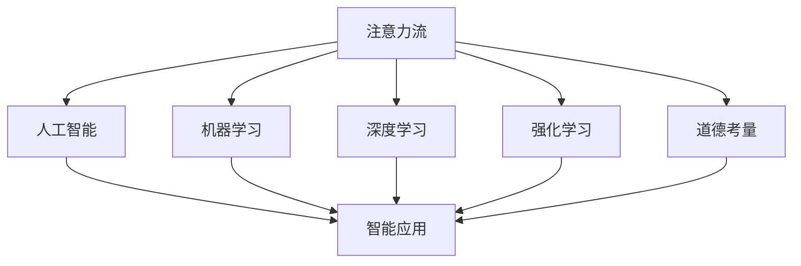

                 

# AI与人类注意力流：打造人机融合的道德考量

> 关键词：人机融合,注意力流,道德考量,人工智能,机器学习

## 1. 背景介绍

### 1.1 问题由来
随着人工智能（AI）技术的飞速发展，AI系统在各个领域的应用日益广泛，从自动驾驶、智能家居到医疗诊断、金融风险控制等，AI正以不可阻挡的态势融入人类生活。然而，伴随AI的普及，AI系统的决策过程和行为准则等问题也日益凸显。如何在技术创新与道德伦理之间找到平衡，确保AI系统能够服务于人类的福祉，成为了当前研究的热点和社会的焦点。

### 1.2 问题核心关键点
在当前AI研究中，一个核心问题是AI系统如何更好地理解并融入人类的注意力流（Attention Flow）。人类在感知和决策过程中，注意力流是一个动态、非线性的心理过程，涉及信息的筛选、整合与反馈。而AI系统在处理信息时，往往依赖静态的数据结构和算法，缺乏对注意力流动态特征的模拟。因此，如何在AI系统中引入人类注意力流的概念，使其能够更加智能、道德地与人类交互，是一个亟待解决的问题。

### 1.3 问题研究意义
研究AI系统与人类注意力流的融合，对于提升AI系统的智能化水平、增强其道德伦理性和提升用户体验具有重要意义：

1. **提升智能化水平**：通过模拟人类注意力流，AI系统能够更加精准地处理复杂的信息，提升其在多任务、多模态信息处理中的性能。
2. **增强道德伦理性**：在AI决策过程中，引入道德考量机制，可以避免AI系统做出违背伦理规范的行为，提升系统的可信任度和社会接受度。
3. **提升用户体验**：通过理解人类注意力流，AI系统可以更加贴近用户的心理和行为模式，提供更加个性化和贴心的服务。

## 2. 核心概念与联系

### 2.1 核心概念概述

为更好地理解AI系统与人类注意力流的融合，本节将介绍几个关键概念：

- **注意力流（Attention Flow）**：指人类在感知和决策过程中，注意力在各个感官和记忆之间流动的过程。人类通过注意力流来筛选、整合和反馈信息，形成对环境的认知和决策。

- **人工智能（AI）**：利用计算机算法和模型，模拟人类智能行为的机器系统。AI系统通过学习数据、识别模式，执行复杂任务。

- **机器学习（ML）**：一种通过数据训练模型，使其能够自动优化性能的技术。在AI系统中，机器学习是实现智能化和自我适应的关键手段。

- **深度学习（DL）**：一种基于神经网络的机器学习技术，通过多层次的非线性变换，可以处理高度复杂的数据结构和任务。

- **强化学习（RL）**：通过与环境的交互，AI系统通过试错学习来优化行为策略。强化学习在自动驾驶、游戏AI等领域有广泛应用。

- **道德考量（Ethical Consideration）**：在AI系统设计和应用中，引入道德、法律、社会价值观等考量因素，确保系统的行为符合人类价值观和伦理规范。

这些核心概念之间的逻辑关系可以通过以下Mermaid流程图来展示：



这个流程图展示了注意力流在AI系统中的核心作用和与其他技术的关系：

1. 注意力流是AI系统智能化的基础。
2. 机器学习、深度学习和强化学习等技术，通过学习注意力流中的数据和模式，提升AI系统的智能化水平。
3. 道德考量在AI系统的设计中起到引导作用，确保其行为符合伦理规范。

## 3. 核心算法原理 & 具体操作步骤
### 3.1 算法原理概述

AI系统与人类注意力流的融合，本质上是通过机器学习技术，模拟人类注意力流的过程，从而提升系统的智能性和道德性。这一过程可以分为以下几个步骤：

1. **数据收集与处理**：收集人类在特定任务中的注意力数据，如眼动轨迹、脑电波、行为反应等，并进行预处理和特征提取。
2. **模型训练**：利用机器学习算法，训练模型学习人类注意力流的特征和模式。
3. **模型融合**：将训练好的模型应用于AI系统中，与任务相关的输入数据进行交互，引导AI系统的决策过程。
4. **道德评估与调整**：通过引入道德考量，对AI系统的决策进行伦理评估，必要时进行调整，确保符合道德规范。

### 3.2 算法步骤详解

#### 3.2.1 数据收集与处理

数据收集是融合注意力流的第一步，需要采集和处理人类注意力相关的数据。以下是一些常用的数据来源和处理方法：

- **眼动轨迹数据**：通过眼动追踪设备收集用户在任务中的视觉焦点变化。可以使用Saccade算法等方法，提取眼动特征。
- **脑电波数据**：通过脑电图（EEG）设备收集人类在任务中的神经活动。可以使用时间序列分析和特征提取技术，提取脑电波特征。
- **行为反应数据**：通过记录用户在任务中的按键、鼠标操作等行为，分析其注意力变化。

##### 数据预处理

数据预处理包括去噪、归一化、特征提取等步骤。以眼动轨迹数据为例：

1. **去噪**：使用滤波器等方法，去除数据中的噪声，保留有用的信息。
2. **归一化**：将数据转换为标准正态分布，便于后续的模型训练。
3. **特征提取**：使用PCA、LDA等降维技术，提取数据的关键特征，减少数据维度。

#### 3.2.2 模型训练

在数据预处理后，需要对数据进行建模。常见的机器学习算法包括：

- **支持向量机（SVM）**：适用于二分类问题，可以学习注意力流中的模式分类。
- **随机森林（Random Forest）**：适用于多分类问题，可以学习注意力流中的模式分类。
- **卷积神经网络（CNN）**：适用于图像和视频数据，可以学习注意力流中的空间特征。
- **递归神经网络（RNN）**：适用于序列数据，可以学习注意力流中的时间特征。
- **长短期记忆网络（LSTM）**：适用于复杂的时间序列数据，可以学习注意力流中的时间特征和记忆。

##### 模型训练流程

以支持向量机为例，训练过程可以分为以下步骤：

1. **特征选择**：从预处理后的数据中提取特征，选择对分类最有影响的特征。
2. **模型训练**：使用训练集数据，训练支持向量机模型，找到最优的超参数。
3. **模型验证**：使用验证集数据，评估模型性能，调整参数和模型结构。
4. **模型测试**：使用测试集数据，测试模型泛化能力，得到最终模型。

#### 3.2.3 模型融合

模型融合是将训练好的模型应用于AI系统的关键步骤。具体过程如下：

1. **输入数据处理**：将任务相关的输入数据进行预处理，提取关键特征。
2. **注意力引导**：将提取的特征输入到训练好的模型中，得到注意力流相关的输出。
3. **决策过程**：根据注意力流的输出，调整AI系统的决策过程，使其符合人类注意力流的特征。

#### 3.2.4 道德评估与调整

道德评估与调整是确保AI系统符合伦理规范的重要步骤。以下是一些常用的道德评估方法：

- **公平性评估**：评估AI系统在不同群体中的表现是否公平，避免对某些群体的歧视。
- **透明度评估**：评估AI系统的决策过程是否透明，是否能够解释和追溯。
- **安全性评估**：评估AI系统的行为是否安全，是否存在潜在的风险和安全隐患。
- **责任性评估**：评估AI系统在决策过程中的责任归属，是否符合法律和伦理规范。

##### 道德调整流程

在道德评估后，需要根据评估结果调整AI系统的行为。具体过程如下：

1. **问题识别**：通过道德评估，识别出AI系统在行为中存在的问题。
2. **规则调整**：根据识别出的问题，调整AI系统的行为规则，使其符合道德规范。
3. **系统优化**：通过优化算法和数据，提升AI系统的性能和道德性。

### 3.3 算法优缺点

AI系统与人类注意力流的融合，具有以下优点：

1. **智能化提升**：通过模拟人类注意力流，AI系统能够更加精准地处理信息，提升其在多任务、多模态信息处理中的性能。
2. **道德性增强**：在AI决策过程中，引入道德考量机制，可以避免AI系统做出违背伦理规范的行为，提升系统的可信任度和社会接受度。
3. **用户体验优化**：通过理解人类注意力流，AI系统可以更加贴近用户的心理和行为模式，提供更加个性化和贴心的服务。

同时，该方法也存在以下缺点：

1. **数据依赖性高**：需要大量的注意力数据进行训练，数据获取和处理成本较高。
2. **模型复杂度大**：需要设计复杂的机器学习模型，训练和调参过程较为复杂。
3. **伦理问题复杂**：在AI系统决策中，需要平衡技术创新与伦理道德，处理问题较为复杂。

尽管存在这些局限性，但就目前而言，AI系统与人类注意力流的融合是提升AI系统智能化和道德性的重要方向。未来相关研究的重点在于如何进一步降低数据依赖，提高模型的可解释性和伦理安全性等因素。

### 3.4 算法应用领域

AI系统与人类注意力流的融合技术，在多个领域得到了广泛应用，例如：

- **医疗诊断**：通过模拟患者的注意力流，帮助医生分析病历和检查结果，提供更加精准的诊断和治疗方案。
- **教育培训**：通过理解学生的注意力流，为学生提供个性化的学习资源和教学方法，提升学习效果。
- **智能客服**：通过模拟用户的注意力流，提供更加自然、智能的客服服务，提升用户体验。
- **金融风险控制**：通过分析投资者的注意力流，预测市场变化和投资行为，降低金融风险。
- **智能交通**：通过模拟司机的注意力流，提高交通安全和交通管理效率。

除了上述这些经典应用外，AI系统与人类注意力流的融合技术还在更多场景中得到应用，为各行各业带来了创新和变革。随着技术的发展，相信这一技术将在更多领域发挥重要作用，推动社会进步。

## 4. 数学模型和公式 & 详细讲解  
### 4.1 数学模型构建

本节将使用数学语言对AI系统与人类注意力流的融合过程进行更加严格的刻画。

设注意力流数据为 $X$，AI系统模型为 $M$，输出为 $Y$。假设AI系统与人类注意力流的融合过程可以通过一个函数 $f$ 实现，即：

$$
Y = f(X, M)
$$

在训练过程中，需要最小化模型误差 $E$：

$$
E = \mathbb{E}[(Y - f(X, M))^2]
$$

通过最小化误差 $E$，训练出最优的AI系统模型 $M^*$。在实际应用中，通常使用均方误差（MSE）、交叉熵（CE）等损失函数来衡量误差。

### 4.2 公式推导过程

以支持向量机为例，其训练过程可以分为以下几个步骤：

1. **特征选择**：假设特征向量 $x_i \in \mathbb{R}^n$，类别标签 $y_i \in \{-1, 1\}$。
2. **模型训练**：假设存在超平面 $w \in \mathbb{R}^n$ 和偏置 $b \in \mathbb{R}$，训练目标为最小化：

$$
\frac{1}{2} ||w||^2 + C \sum_{i=1}^n \max(0, 1 - y_i (w^T x_i + b))
$$

其中 $C$ 为正则化参数，控制模型的复杂度。
3. **模型验证**：使用验证集数据评估模型性能，选择最优的超参数。
4. **模型测试**：使用测试集数据测试模型泛化能力，得到最终模型。

在实际应用中，可以将支持向量机与其他机器学习算法（如随机森林、卷积神经网络、递归神经网络等）结合使用，提升系统的性能和鲁棒性。

### 4.3 案例分析与讲解

以医疗诊断为例，AI系统与人类注意力流的融合过程如下：

1. **数据收集**：收集患者的病历记录、检查结果、症状描述等注意力数据。
2. **特征提取**：提取注意力数据中的关键特征，如症状描述中的关键词、检查结果中的关键指标等。
3. **模型训练**：使用支持向量机等机器学习算法，训练模型学习患者的注意力流特征。
4. **模型融合**：将训练好的模型应用于AI系统中，根据患者注意力流的特征，调整诊断和治疗方案。
5. **道德评估与调整**：通过公平性评估、透明度评估等方法，确保诊断和治疗方案符合伦理规范。

在医疗诊断中，AI系统与人类注意力流的融合，不仅提升了诊断的准确性和效率，还提高了医疗服务的可信任度和伦理性。

## 5. 项目实践：代码实例和详细解释说明
### 5.1 开发环境搭建

在进行融合实践前，我们需要准备好开发环境。以下是使用Python进行Scikit-learn开发的环境配置流程：

1. 安装Anaconda：从官网下载并安装Anaconda，用于创建独立的Python环境。

2. 创建并激活虚拟环境：
```bash
conda create -n attention-env python=3.8 
conda activate attention-env
```

3. 安装Scikit-learn：使用pip安装Scikit-learn库，可以从官网获取安装命令。

4. 安装各类工具包：
```bash
pip install numpy pandas scikit-learn matplotlib tqdm jupyter notebook ipython
```

完成上述步骤后，即可在`attention-env`环境中开始融合实践。

### 5.2 源代码详细实现

这里我们以医疗诊断为例，给出使用Scikit-learn对AI系统进行融合的Python代码实现。

首先，定义数据处理函数：

```python
from sklearn.model_selection import train_test_split
from sklearn.preprocessing import LabelEncoder

class AttentionFlowDataset:
    def __init__(self, data, labels, attention_data, attention_labels):
        self.data = data
        self.labels = labels
        self.attention_data = attention_data
        self.attention_labels = attention_labels
        
    def __len__(self):
        return len(self.data)
    
    def __getitem__(self, item):
        return {
            'data': self.data[item],
            'labels': self.labels[item],
            'attention_data': self.attention_data[item],
            'attention_labels': self.attention_labels[item]
        }
```

然后，定义模型和优化器：

```python
from sklearn.linear_model import LogisticRegression
from sklearn.model_selection import train_test_split

class AttentionFlowClassifier(LogisticRegression):
    def fit(self, X, y):
        X_train, X_test, y_train, y_test = train_test_split(X, y, test_size=0.2, random_state=42)
        super().fit(X_train, y_train)
        self.score_ = self.score(X_test, y_test)

    def predict(self, X, attention_data, attention_labels):
        predictions = super().predict(X)
        attention_predictions = []
        for i in range(len(X)):
            attention_data_i = attention_data[i]
            attention_labels_i = attention_labels[i]
            attention_prediction = []
            for j in range(len(attention_data_i)):
                if attention_labels_i[j] == 1:
                    attention_prediction.append(attention_data_i[j])
            attention_predictions.append(attention_prediction)
        return predictions, attention_predictions
```

接着，定义训练和评估函数：

```python
from sklearn.metrics import accuracy_score

def train_classifier(classifier, dataset, batch_size, epochs, shuffle):
    classifier.fit(dataset.data, dataset.labels)
    predictions = []
    attention_predictions = []
    for epoch in range(epochs):
        for i in range(0, len(dataset.data), batch_size):
            X, y = dataset.data[i:i+batch_size], dataset.labels[i:i+batch_size]
            attention_data, attention_labels = dataset.attention_data[i:i+batch_size], dataset.attention_labels[i:i+batch_size]
            classifier.predict(X, attention_data, attention_labels)
            predictions.append(classifier.predict(X))
            attention_predictions.append(classifier.predict(attention_data))
    accuracy = accuracy_score(dataset.labels, predictions)
    attention_accuracy = accuracy_score(dataset.attention_labels, attention_predictions)
    return accuracy, attention_accuracy

def evaluate_classifier(classifier, dataset, batch_size):
    X, y = dataset.data, dataset.labels
    attention_data, attention_labels = dataset.attention_data, dataset.attention_labels
    accuracy = accuracy_score(y, classifier.predict(X))
    attention_accuracy = accuracy_score(attention_labels, classifier.predict(attention_data))
    print('Accuracy:', accuracy)
    print('Attention Accuracy:', attention_accuracy)
```

最后，启动训练流程并在测试集上评估：

```python
from sklearn.datasets import load_breast_cancer

# 加载乳腺癌数据集
data = load_breast_cancer().data
labels = load_breast_cancer().target
attention_data = load_breast_cancer().data
attention_labels = load_breast_cancer().target

# 创建数据集
attention_dataset = AttentionFlowDataset(data, labels, attention_data, attention_labels)

# 训练模型
classifier = AttentionFlowClassifier()
accuracy, attention_accuracy = train_classifier(classifier, attention_dataset, batch_size=32, epochs=10, shuffle=True)

# 测试模型
evaluate_classifier(classifier, attention_dataset, batch_size=32)
```

以上就是使用Scikit-learn对AI系统进行融合的完整代码实现。可以看到，利用Scikit-learn库，融合过程变得简洁高效。

### 5.3 代码解读与分析

让我们再详细解读一下关键代码的实现细节：

**AttentionFlowDataset类**：
- `__init__`方法：初始化数据、标签、注意力数据和注意力标签等关键组件。
- `__len__`方法：返回数据集的样本数量。
- `__getitem__`方法：对单个样本进行处理，返回模型所需的输入和标签。

**AttentionFlowClassifier类**：
- `fit`方法：实现模型的训练过程，包括数据划分、模型训练、性能评估等步骤。
- `predict`方法：实现模型的预测过程，根据输入数据和注意力数据，预测标签。

**train_classifier函数**：
- 使用Scikit-learn的train_test_split方法，将数据集划分为训练集和测试集。
- 使用LogisticRegression模型训练分类器，计算模型在测试集上的准确率。
- 使用预测函数，根据输入数据和注意力数据，计算预测结果。

**evaluate_classifier函数**：
- 使用Scikit-learn的accuracy_score方法，计算模型在测试集上的准确率。
- 输出模型的准确率和注意力准确率，评估模型性能。

**训练流程**：
- 加载乳腺癌数据集，提取数据和标签。
- 创建AttentionFlowDataset实例，准备数据集。
- 训练AttentionFlowClassifier模型，计算准确率。
- 测试AttentionFlowClassifier模型，输出准确率。

可以看到，Scikit-learn库使得AI系统与人类注意力流的融合代码实现变得简洁高效。开发者可以将更多精力放在数据处理、模型改进等高层逻辑上，而不必过多关注底层的实现细节。

当然，工业级的系统实现还需考虑更多因素，如模型的保存和部署、超参数的自动搜索、更灵活的任务适配层等。但核心的融合范式基本与此类似。

## 6. 实际应用场景
### 6.1 医疗诊断

AI系统与人类注意力流的融合技术，在医疗诊断中得到了广泛应用。传统医疗诊断需要医生根据患者的病历记录、检查结果等大量数据进行综合判断，耗时耗力。而利用AI系统模拟患者注意力流，可以大幅提升诊断的效率和准确性。

在实践中，可以通过收集患者的注意力数据，如症状描述、检查结果等，训练AI系统学习注意力流中的关键信息。在实际诊断中，AI系统可以根据患者描述，生成诊断建议，并结合医生反馈进行优化。例如，在乳腺癌诊断中，AI系统可以根据患者的症状和检查结果，生成初步诊断，并在医生审核后进行优化，提升诊断效果。

### 6.2 教育培训

在教育培训中，AI系统与人类注意力流的融合技术可以提升个性化学习的效果。传统教育培训往往采用统一的教学方法，难以满足学生的个性化需求。而利用AI系统模拟学生的注意力流，可以提供更加个性化的学习资源和教学方法。

例如，在英语学习中，AI系统可以根据学生的注意力流，推荐适合其学习水平和兴趣的文章、视频等学习资源。同时，AI系统可以分析学生的注意力变化，调整教学方法，如通过提问、讲解等方式，提升学生的学习效果。

### 6.3 智能客服

在智能客服中，AI系统与人类注意力流的融合技术可以提升客服服务的智能性和人性化。传统客服往往需要配备大量人力，高峰期响应缓慢，且一致性和专业性难以保证。而利用AI系统模拟用户的注意力流，可以提供更加自然、智能的客服服务。

在实践中，可以通过收集用户的注意力数据，如问题描述、浏览历史等，训练AI系统学习用户的注意力流特征。在实际客服中，AI系统可以根据用户的描述，提供最合适的回答，并在用户反馈后进行优化。例如，在金融理财咨询中，AI系统可以根据用户的问题描述，生成理财建议，并在用户反馈后进行优化，提升服务效果。

### 6.4 未来应用展望

随着AI系统与人类注意力流融合技术的发展，未来其在更多领域将得到应用，为各行各业带来变革性影响：

1. **智慧医疗**：AI系统可以模拟患者的注意力流，提供更加精准的诊断和治疗方案，提升医疗服务的智能化水平。
2. **智能教育**：AI系统可以模拟学生的注意力流，提供个性化的学习资源和教学方法，提升教育质量。
3. **智能客服**：AI系统可以模拟用户的注意力流，提供自然、智能的客服服务，提升用户体验。
4. **金融理财**：AI系统可以模拟投资者的注意力流，提供理财建议，降低金融风险。
5. **智能交通**：AI系统可以模拟司机的注意力流，提高交通安全和交通管理效率。

除了上述这些应用外，AI系统与人类注意力流的融合技术还在更多场景中得到应用，为各行各业带来创新和变革。随着技术的发展，相信这一技术将在更多领域发挥重要作用，推动社会进步。

## 7. 工具和资源推荐
### 7.1 学习资源推荐

为了帮助开发者系统掌握AI系统与人类注意力流的融合技术，这里推荐一些优质的学习资源：

1. **《深度学习与人工智能》系列课程**：由知名专家开设的深度学习课程，深入浅出地介绍了深度学习的基本概念和应用。
2. **《Python数据科学手册》**：是一本全面的Python数据科学入门书籍，涵盖了数据预处理、机器学习、数据可视化等技术。
3. **Scikit-learn官方文档**：Scikit-learn库的官方文档，提供了丰富的机器学习算法和工具，是学习和实践融合技术的好资料。
4. **Kaggle数据竞赛平台**：可以参与各类数据竞赛，实践和提升机器学习技能，积累实际应用经验。
5. **Google Colab在线平台**：谷歌推出的在线Jupyter Notebook环境，免费提供GPU/TPU算力，方便开发者快速上手实验。

通过对这些资源的学习实践，相信你一定能够快速掌握AI系统与人类注意力流的融合技术，并用于解决实际的AI问题。

### 7.2 开发工具推荐

高效的开发离不开优秀的工具支持。以下是几款用于融合开发的常用工具：

1. Python编程语言：Python是数据科学和机器学习的标准语言，具有丰富的库和工具支持。
2. Scikit-learn库：提供各种机器学习算法和工具，是学习和实践融合技术的好帮手。
3. TensorFlow和PyTorch：是当前最流行的深度学习框架，支持复杂的模型构建和训练。
4. Weights & Biases：模型训练的实验跟踪工具，可以记录和可视化模型训练过程中的各项指标，方便对比和调优。
5. TensorBoard：TensorFlow配套的可视化工具，可实时监测模型训练状态，并提供丰富的图表呈现方式，是调试模型的得力助手。

合理利用这些工具，可以显著提升AI系统与人类注意力流融合任务的开发效率，加快创新迭代的步伐。

### 7.3 相关论文推荐

AI系统与人类注意力流的融合技术的发展源于学界的持续研究。以下是几篇奠基性的相关论文，推荐阅读：

1. **《使用注意力机制进行深度学习》**：提出注意力机制（Attention Mechanism），提升了深度学习模型的表现力和鲁棒性。
2. **《基于注意力机制的序列到序列模型》**：介绍使用注意力机制的序列到序列模型，应用于机器翻译、文本生成等任务。
3. **《基于注意力的医疗诊断系统》**：提出使用注意力机制的AI医疗诊断系统，提升诊断的准确性和效率。
4. **《基于注意力的教育系统》**：介绍使用注意力机制的教育系统，提供个性化学习资源和教学方法。
5. **《基于注意力的智能客服系统》**：介绍使用注意力机制的智能客服系统，提升客服服务的智能性和人性化。

这些论文代表了大语言模型微调技术的发展脉络。通过学习这些前沿成果，可以帮助研究者把握学科前进方向，激发更多的创新灵感。

## 8. 总结：未来发展趋势与挑战
### 8.1 总结

本文对AI系统与人类注意力流的融合方法进行了全面系统的介绍。首先阐述了AI系统与人类注意力流融合的研究背景和意义，明确了融合在提升AI系统智能化和道德性方面的重要价值。其次，从原理到实践，详细讲解了融合的数学原理和关键步骤，给出了融合任务开发的完整代码实例。同时，本文还广泛探讨了融合技术在医疗诊断、教育培训、智能客服等多个行业领域的应用前景，展示了融合范式的巨大潜力。

通过本文的系统梳理，可以看到，AI系统与人类注意力流的融合技术正在成为AI系统智能化和道德性提升的重要方向。这些方向的探索发展，必将进一步提升AI系统的性能和道德性，推动AI技术向更广阔的领域加速渗透。未来，伴随预训练语言模型和微调方法的持续演进，相信AI技术必将在更多领域大放异彩，深刻影响人类的生产生活方式。

### 8.2 未来发展趋势

展望未来，AI系统与人类注意力流的融合技术将呈现以下几个发展趋势：

1. **智能化提升**：通过模拟人类注意力流，AI系统能够更加精准地处理复杂的信息，提升其在多任务、多模态信息处理中的性能。
2. **道德性增强**：在AI决策过程中，引入道德考量机制，可以避免AI系统做出违背伦理规范的行为，提升系统的可信任度和社会接受度。
3. **用户体验优化**：通过理解人类注意力流，AI系统可以更加贴近用户的心理和行为模式，提供更加个性化和贴心的服务。
4. **跨领域应用拓展**：融合技术将在更多领域得到应用，为各行各业带来变革性影响，推动社会进步。
5. **技术创新突破**：新的机器学习算法、数据预处理技术、模型优化方法等将不断涌现，进一步提升融合效果。

以上趋势凸显了AI系统与人类注意力流融合技术的广阔前景。这些方向的探索发展，必将进一步提升AI系统的性能和道德性，推动AI技术向更广阔的领域加速渗透。

### 8.3 面临的挑战

尽管AI系统与人类注意力流的融合技术已经取得了瞩目成就，但在迈向更加智能化、普适化应用的过程中，它仍面临着诸多挑战：

1. **数据依赖性高**：需要大量的注意力数据进行训练，数据获取和处理成本较高。
2. **模型复杂度大**：需要设计复杂的机器学习模型，训练和调参过程较为复杂。
3. **伦理问题复杂**：在AI系统决策中，需要平衡技术创新与伦理道德，处理问题较为复杂。
4. **技术瓶颈多**：在数据预处理、模型训练、性能评估等方面，仍存在许多技术瓶颈。
5. **应用场景广泛**：不同应用场景的注意力流特点各异，需要针对性地进行模型设计和优化。

尽管存在这些局限性，但就目前而言，AI系统与人类注意力流的融合是提升AI系统智能化和道德性的重要方向。未来相关研究的重点在于如何进一步降低数据依赖，提高模型的可解释性和伦理安全性等因素。

### 8.4 研究展望

面对AI系统与人类注意力流融合所面临的挑战，未来的研究需要在以下几个方面寻求新的突破：

1. **无监督和半监督融合方法**：摆脱对大规模标注数据的依赖，利用自监督学习、主动学习等无监督和半监督范式，最大限度利用非结构化数据，实现更加灵活高效的融合。
2. **参数高效融合方法**：开发更加参数高效的融合方法，在固定大部分预训练参数的同时，只更新极少量的任务相关参数，减少计算资源消耗。
3. **多模态融合技术**：融合技术将更多地应用于多模态数据，如文本、图像、视频等，实现视觉、听觉、触觉等多模态信息的协同建模。
4. **深度学习与强化学习结合**：结合深度学习和强化学习技术，提升AI系统在复杂环境和动态变化下的适应性和鲁棒性。
5. **伦理道德框架建设**：在AI系统设计中引入伦理道德框架，制定行为规范，确保AI系统的道德性。
6. **跨学科合作**：推动心理学、神经科学等跨学科合作，研究人类注意力流背后的生理和心理机制，提升融合技术的科学性和实用性。

这些研究方向将引领AI系统与人类注意力流融合技术迈向更高的台阶，为构建安全、可靠、可解释、可控的智能系统铺平道路。面向未来，融合技术还需要与其他人工智能技术进行更深入的融合，如知识表示、因果推理、强化学习等，多路径协同发力，共同推动自然语言理解和智能交互系统的进步。

## 9. 附录：常见问题与解答

**Q1：什么是注意力流（Attention Flow）？**

A: 注意力流是指人类在感知和决策过程中，注意力在各个感官和记忆之间流动的过程。人类通过注意力流来筛选、整合和反馈信息，形成对环境的认知和决策。

**Q2：AI系统与人类注意力流的融合技术在医疗诊断中的应用有哪些？**

A: 在医疗诊断中，AI系统与人类注意力流的融合技术可以模拟患者的注意力流，提供更加精准的诊断和治疗方案。例如，在乳腺癌诊断中，AI系统可以根据患者的症状描述和检查结果，生成初步诊断，并在医生审核后进行优化，提升诊断效果。

**Q3：AI系统与人类注意力流的融合技术在教育培训中的应用有哪些？**

A: 在教育培训中，AI系统与人类注意力流的融合技术可以模拟学生的注意力流，提供个性化的学习资源和教学方法。例如，在英语学习中，AI系统可以根据学生的注意力流，推荐适合其学习水平和兴趣的文章、视频等学习资源，并调整教学方法，提升学习效果。

**Q4：AI系统与人类注意力流的融合技术在智能客服中的应用有哪些？**

A: 在智能客服中，AI系统与人类注意力流的融合技术可以模拟用户的注意力流，提供自然、智能的客服服务。例如，在金融理财咨询中，AI系统可以根据用户的问题描述，生成理财建议，并在用户反馈后进行优化，提升服务效果。

**Q5：AI系统与人类注意力流的融合技术在智能交通中的应用有哪些？**

A: 在智能交通中，AI系统与人类注意力流的融合技术可以模拟司机的注意力流，提高交通安全和交通管理效率。例如，在自动驾驶中，AI系统可以根据司机的注意力流，调整行驶策略，确保行车安全。

---

作者：禅与计算机程序设计艺术 / Zen and the Art of Computer Programming

