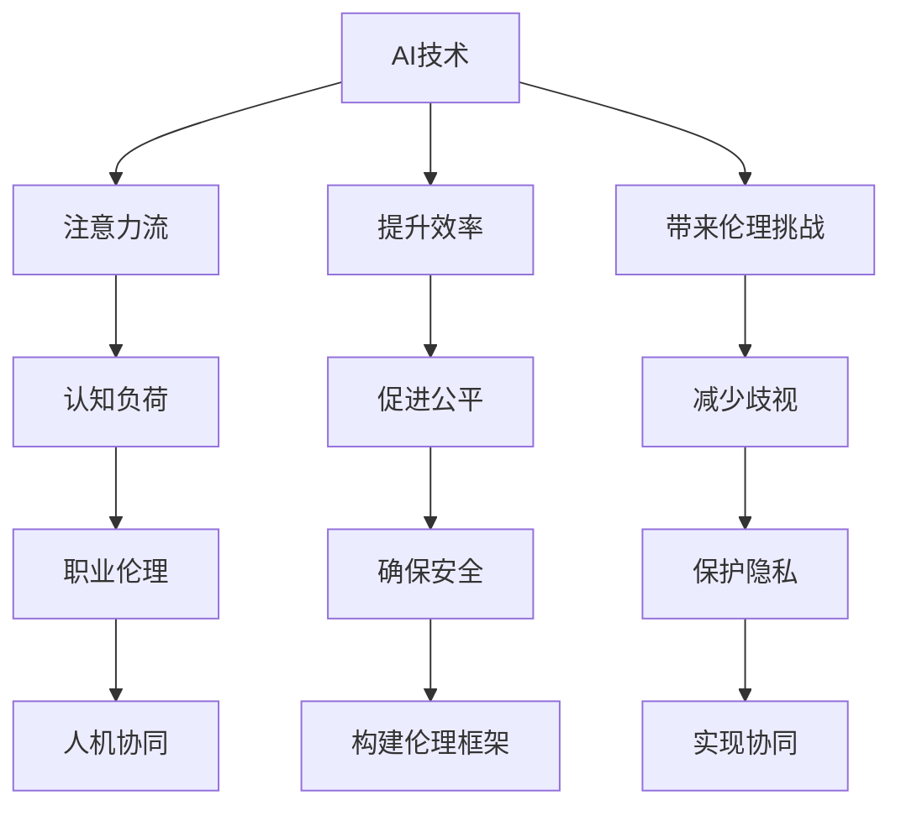

                 

# AI与人类注意力流：未来的工作和道德

## 1. 背景介绍

### 1.1 问题由来

在快速发展的科技浪潮中，人工智能（AI）正日益深入我们的日常生活和工作。从智能助手到自动驾驶，从机器人到自然语言处理，AI技术的广泛应用正在重塑人类的工作方式和社会结构。然而，随着AI技术的普及，其对人类工作形态的影响也引发了广泛关注。特别是在注意力分配、伦理道德和工作安全等议题上，社会各界人士纷纷提出了种种担忧和质疑。本文将围绕AI与人类注意力流，探讨AI技术在未来工作中的可能影响及其伦理道德问题。

### 1.2 问题核心关键点

AI与人类注意力流的关键问题可以概括为以下几个方面：

- AI如何影响人类在工作中的注意力分配，进而改变其认知能力和情感体验？
- AI如何带来职业伦理挑战，如自动化导致的失业、隐私泄露、算法歧视等问题？
- 在AI技术广泛应用的背景下，如何确保工作场所的安全与公正，保护人类权益？

理解这些核心问题，对于指导未来AI技术的健康发展至关重要。本文将从AI对人类注意力流的影响入手，进一步探讨其带来的伦理道德挑战和解决策略。

### 1.3 问题研究意义

研究AI与人类注意力流对未来工作的道德影响，不仅有助于构建和谐的人机关系，还能为AI技术的进一步发展提供伦理指导。

1. **提升认知效率**：了解AI如何优化工作流程，通过注意力分配的科学利用，提升人类认知效率和工作质量。
2. **确保工作公平**：在AI技术普及过程中，关注职业伦理，减少技术带来的不平等和歧视，保护劳动者的权益。
3. **促进社会和谐**：通过技术伦理框架的建设，引导AI技术健康发展，促进社会的和谐与进步。
4. **推动持续创新**：在技术开发过程中，秉持伦理原则，激发更多有益于社会进步的AI应用创新。
5. **实现人机协同**：探索人机协同工作的最佳实践，促进AI技术与人类需求的深度融合。

本文旨在通过深入剖析AI与人类注意力流，为构建未来和谐、公正、高效的工作环境提供有益的参考和建议。

## 2. 核心概念与联系

### 2.1 核心概念概述

在探讨AI与人类注意力流时，需要理解几个关键概念：

- **人工智能（AI）**：一种模拟人类智能的技术，包括机器学习、深度学习、自然语言处理等。
- **注意力流（Attention Flow）**：在AI与人类交互过程中，注意力在两者之间动态分配的过程。
- **认知负荷（Cognitive Load）**：个体在认知任务中的心理负担，受到注意力集中度和信息处理能力的影响。
- **职业伦理（Professional Ethics）**：涉及职业行为规范、责任与义务、隐私保护等方面的伦理原则。
- **人机协同（Human-Machine Collaboration）**：AI与人类在任务执行中的合作模式，强调互利共赢和共同进步。

这些概念相互联系，共同构成未来工作环境的复杂生态。通过理解这些概念，我们可以更好地把握AI技术在职场中的作用和影响。

### 2.2 核心概念原理和架构的 Mermaid 流程图



这个流程图展示了AI技术在职场中可能的作用和影响，以及提升效率、带来伦理挑战、促进公平、减少歧视、确保安全和保护隐私等关键任务之间的关系。通过这一架构，我们可以更好地理解AI技术在实际应用中的多重角色和潜在影响。

## 3. 核心算法原理 & 具体操作步骤

### 3.1 算法原理概述

AI与人类注意力流的互动，本质上是通过注意力机制来实现的。注意力机制是一种模拟人类注意力集中方式的技术，它可以根据输入的不同重要性，动态地分配计算资源。在职场中，AI技术通过优化注意力分配，帮助人类更高效地完成任务，从而提升整体工作效率。

例如，在自然语言处理（NLP）中，AI通过注意力机制，可以识别出文本中的关键信息，并将其优先处理。在图像识别中，AI可以根据图像的重要特征，集中注意力进行特征提取。这些机制帮助AI在不同应用场景中优化注意力分配，提高任务执行的效率和准确性。

### 3.2 算法步骤详解

AI与人类注意力流的优化主要包括以下几个步骤：

1. **任务建模**：确定具体任务及其目标，如文本分类、图像识别、语音识别等。
2. **数据准备**：收集和准备与任务相关的数据集，并进行预处理，如分词、归一化等。
3. **模型训练**：使用深度学习模型进行训练，通过反向传播算法更新模型参数，优化注意力机制。
4. **注意力优化**：在模型训练过程中，不断调整注意力分配策略，以适应不同任务的需求。
5. **实际应用**：将训练好的模型应用于具体任务中，监测注意力分配效果，进行实时优化。
6. **反馈调整**：根据任务执行结果，收集反馈信息，不断调整注意力分配策略。

### 3.3 算法优缺点

AI与人类注意力流的优化算法具有以下优点：

1. **提升工作效率**：通过优化注意力分配，AI可以自动处理复杂任务，减少人类认知负荷，提升工作效率。
2. **提高任务准确性**：通过关注关键信息，AI可以有效提升任务的执行精度，减少错误率。
3. **促进认知扩展**：AI可以辅助人类处理大量信息，拓展认知边界，提高问题解决能力。

然而，该算法也存在一些缺点：

1. **依赖数据质量**：算法的有效性很大程度上依赖于数据的质量和多样性。数据偏差可能导致算法输出偏差。
2. **模型复杂性**：优化注意力分配的模型往往结构复杂，需要大量计算资源和训练时间。
3. **黑盒特性**：注意力机制的具体工作原理较为复杂，难以进行解释和调试，缺乏透明度。
4. **伦理风险**：优化后的模型可能因注意力分配偏差，导致不公平或歧视性的决策。

### 3.4 算法应用领域

AI与人类注意力流的优化算法在多个领域具有广泛应用：

1. **自然语言处理（NLP）**：如文本分类、情感分析、机器翻译等任务中，AI通过优化注意力机制，提高处理效率和准确性。
2. **计算机视觉（CV）**：如目标检测、图像识别、视频分析等任务中，AI通过优化注意力机制，提升图像处理能力。
3. **机器人与自动化**：如路径规划、避障导航等任务中，AI通过优化注意力分配，提高机器人自主决策能力。
4. **金融分析**：如市场预测、风险评估等任务中，AI通过优化注意力机制，提高数据处理和决策速度。
5. **医疗诊断**：如疾病检测、影像分析等任务中，AI通过优化注意力机制，提高诊断准确性。

这些应用领域展示了AI技术在提升工作效率和任务处理精度方面的巨大潜力，同时也提示我们需注意算法伦理问题，确保技术应用的安全性和公平性。

## 4. 数学模型和公式 & 详细讲解 & 举例说明

### 4.1 数学模型构建

在AI与人类注意力流的优化中，注意力机制的数学模型通常基于注意力网络（Attention Network）构建。注意力网络通过计算注意力权重，动态调整模型对输入数据的关注点，从而优化注意力分配。

假设输入数据为 $X$，注意力权重为 $W$，注意力机制的输出为 $Y$。注意力网络的数学模型可以表示为：

$$ Y = \text{Softmax}(WX^\top)X $$

其中，$\text{Softmax}$ 函数将注意力权重 $W$ 归一化，$X^\top$ 表示矩阵的转置。

### 4.2 公式推导过程

注意力网络的具体推导过程如下：

1. **计算注意力权重**：
   $$ W = \text{Softmax}(X^\top \Theta) $$
   其中 $\Theta$ 为注意力权重矩阵，$X$ 表示输入数据。

2. **计算注意力机制输出**：
   $$ Y = WX $$
   通过注意力权重 $W$ 对输入数据 $X$ 进行加权，得到注意力机制的输出 $Y$。

3. **优化注意力分配**：
   在实际应用中，通过反向传播算法，不断调整注意力权重 $W$ 和权重矩阵 $\Theta$，优化注意力分配，使得 $Y$ 尽可能逼近目标输出 $T$。

### 4.3 案例分析与讲解

以文本分类任务为例，考虑使用注意力网络进行优化。假设输入文本为 $X$，目标分类为 $T$，模型的优化目标为最小化分类误差：

$$ \text{loss} = \log\text{Softmax}(X^\top \Theta)T $$

通过反向传播算法，计算梯度并更新参数，实现注意力机制的优化。在模型训练过程中，不断调整 $\Theta$ 和注意力权重 $W$，使得模型对文本的关注点更加精确，提升分类准确性。

## 5. 项目实践：代码实例和详细解释说明

### 5.1 开发环境搭建

要实现AI与人类注意力流的优化，首先需要搭建合适的开发环境。以下是使用Python和PyTorch进行开发的环境配置步骤：

1. 安装Anaconda：从官网下载并安装Anaconda，用于创建独立的Python环境。
2. 创建并激活虚拟环境：
   ```bash
   conda create -n ai_env python=3.8 
   conda activate ai_env
   ```
3. 安装PyTorch：根据CUDA版本，从官网获取对应的安装命令。例如：
   ```bash
   conda install pytorch torchvision torchaudio cudatoolkit=11.1 -c pytorch -c conda-forge
   ```
4. 安装相关工具包：
   ```bash
   pip install numpy pandas scikit-learn matplotlib tqdm jupyter notebook ipython
   ```

完成上述步骤后，即可在 `ai_env` 环境中进行AI与人类注意力流的优化实践。

### 5.2 源代码详细实现

下面以文本分类任务为例，给出使用PyTorch进行注意力机制优化的代码实现。

首先，定义注意力网络的模型类：

```python
import torch
import torch.nn as nn
import torch.nn.functional as F

class AttentionNetwork(nn.Module):
    def __init__(self, input_size, output_size, attention_size):
        super(AttentionNetwork, self).__init__()
        self.W = nn.Linear(input_size, attention_size)
        self.V = nn.Linear(attention_size, 1)
        self.attention = nn.Softmax(dim=1)
        self.fc = nn.Linear(attention_size, output_size)
        
    def forward(self, X):
        W = self.W(X)
        attention = self.attention(W)
        Y = attention * W
        Y = self.fc(Y.sum(dim=1))
        return Y
```

接着，定义优化过程：

```python
from torch.optim import Adam
import torch.nn.init as init

# 定义模型
model = AttentionNetwork(input_size, output_size, attention_size)

# 定义优化器
optimizer = Adam(model.parameters(), lr=learning_rate)

# 训练过程
for epoch in range(num_epochs):
    for batch in train_loader:
        X, T = batch
        Y = model(X)
        loss = F.cross_entropy(Y, T)
        optimizer.zero_grad()
        loss.backward()
        optimizer.step()
```

通过上述代码，我们可以构建一个简单的注意力网络模型，并使用Adam优化器进行优化。模型在训练过程中，通过不断调整注意力权重 $W$ 和权重矩阵 $\Theta$，优化注意力分配，最终得到优化的模型。

### 5.3 代码解读与分析

**AttentionNetwork类**：
- `__init__`方法：初始化模型的各层参数。
- `forward`方法：定义前向传播过程，计算注意力机制的输出。

**训练过程**：
- 使用PyTorch的DataLoader对数据集进行批次化加载，供模型训练和推理使用。
- 在每个批次上前向传播计算损失函数，并通过反向传播更新模型参数。
- 在每个epoch结束后，计算平均损失，并根据损失值调整学习率。

**注意点**：
- 在训练过程中，需要注意模型是否过拟合。可以通过定期在验证集上评估模型，并在模型表现不佳时进行调整。
- 注意力机制的优化需要合理设置注意力权重矩阵 $\Theta$ 和权重矩阵 $\Theta$ 的大小，以确保模型能够有效处理输入数据。

## 6. 实际应用场景

### 6.1 智能客服系统

AI与人类注意力流的优化技术可以广泛应用于智能客服系统的构建。传统客服往往需要配备大量人力，高峰期响应缓慢，且一致性和专业性难以保证。通过优化注意力机制，智能客服系统可以7x24小时不间断服务，快速响应客户咨询，用自然流畅的语言解答各类常见问题。

在技术实现上，可以收集企业内部的历史客服对话记录，将问题和最佳答复构建成监督数据，在此基础上对预训练模型进行优化。优化后的模型能够自动理解用户意图，匹配最合适的答案模板进行回复。对于客户提出的新问题，还可以接入检索系统实时搜索相关内容，动态组织生成回答。如此构建的智能客服系统，能大幅提升客户咨询体验和问题解决效率。

### 6.2 金融舆情监测

金融机构需要实时监测市场舆论动向，以便及时应对负面信息传播，规避金融风险。传统的人工监测方式成本高、效率低，难以应对网络时代海量信息爆发的挑战。通过优化注意力机制，基于自然语言处理技术的金融舆情监测系统可以自动判断文本属于何种主题，情感倾向是正面、中性还是负面。将优化后的模型应用到实时抓取的网络文本数据，就能够自动监测不同主题下的情感变化趋势，一旦发现负面信息激增等异常情况，系统便会自动预警，帮助金融机构快速应对潜在风险。

### 6.3 个性化推荐系统

当前的推荐系统往往只依赖用户的历史行为数据进行物品推荐，无法深入理解用户的真实兴趣偏好。通过优化注意力机制，个性化推荐系统可以更好地挖掘用户行为背后的语义信息，从而提供更精准、多样的推荐内容。

在实践中，可以收集用户浏览、点击、评论、分享等行为数据，提取和用户交互的物品标题、描述、标签等文本内容。将文本内容作为模型输入，用户的后续行为（如是否点击、购买等）作为监督信号，在此基础上优化预训练语言模型。优化后的模型能够从文本内容中准确把握用户的兴趣点。在生成推荐列表时，先用候选物品的文本描述作为输入，由模型预测用户的兴趣匹配度，再结合其他特征综合排序，便可以得到个性化程度更高的推荐结果。

### 6.4 未来应用展望

随着AI技术的不断发展，AI与人类注意力流的优化技术将在更多领域得到应用，为传统行业带来变革性影响。

在智慧医疗领域，基于优化后的自然语言处理技术，医疗问答、病历分析、药物研发等应用将提升医疗服务的智能化水平，辅助医生诊疗，加速新药开发进程。

在智能教育领域，优化后的推荐系统可以应用于作业批改、学情分析、知识推荐等方面，因材施教，促进教育公平，提高教学质量。

在智慧城市治理中，优化后的自然语言处理技术可应用于城市事件监测、舆情分析、应急指挥等环节，提高城市管理的自动化和智能化水平，构建更安全、高效的未来城市。

此外，在企业生产、社会治理、文娱传媒等众多领域，基于优化后的自然语言处理技术的人工智能应用也将不断涌现，为经济社会发展注入新的动力。相信随着技术的日益成熟，优化后的自然语言处理技术将成为NLP技术落地的重要范式，推动人工智能技术向更广阔的领域加速渗透。

## 7. 工具和资源推荐

### 7.1 学习资源推荐

为了帮助开发者系统掌握AI与人类注意力流优化理论基础和实践技巧，这里推荐一些优质的学习资源：

1. **《深度学习》课程**：斯坦福大学开设的深度学习课程，涵盖深度学习的基础知识、算法和应用，适合初学者和进阶者。
2. **《自然语言处理》课程**：由MIT等高校联合开发的NLP课程，介绍了自然语言处理的基本概念、技术和应用，适合NLP领域的从业者和研究者。
3. **NLP相关书籍**：如《深度学习与自然语言处理》《自然语言处理综论》等，系统介绍NLP技术及其应用，适合深入学习。
4. **PyTorch官方文档**：详细介绍了PyTorch的API和使用方法，适合开发者快速上手和深入研究。
5. **HuggingFace Transformers库**：提供了丰富的预训练语言模型和优化工具，适合快速构建和优化自然语言处理应用。

通过对这些资源的学习实践，相信你一定能够快速掌握AI与人类注意力流优化技术的精髓，并用于解决实际的NLP问题。

### 7.2 开发工具推荐

高效的开发离不开优秀的工具支持。以下是几款用于AI与人类注意力流优化的常用工具：

1. **PyTorch**：基于Python的开源深度学习框架，灵活动态的计算图，适合快速迭代研究。大部分预训练语言模型都有PyTorch版本的实现。
2. **TensorFlow**：由Google主导开发的开源深度学习框架，生产部署方便，适合大规模工程应用。同样有丰富的预训练语言模型资源。
3. **Transformers库**：HuggingFace开发的NLP工具库，集成了众多SOTA语言模型，支持PyTorch和TensorFlow，是进行自然语言处理优化的利器。
4. **Weights & Biases**：模型训练的实验跟踪工具，可以记录和可视化模型训练过程中的各项指标，方便对比和调优。与主流深度学习框架无缝集成。
5. **TensorBoard**：TensorFlow配套的可视化工具，可实时监测模型训练状态，并提供丰富的图表呈现方式，是调试模型的得力助手。

合理利用这些工具，可以显著提升AI与人类注意力流优化任务的开发效率，加快创新迭代的步伐。

### 7.3 相关论文推荐

AI与人类注意力流优化技术的发展源于学界的持续研究。以下是几篇奠基性的相关论文，推荐阅读：

1. **Attention Is All You Need**：提出了Transformer结构，开启了NLP领域的预训练大模型时代。
2. **BERT: Pre-training of Deep Bidirectional Transformers for Language Understanding**：提出BERT模型，引入基于掩码的自监督预训练任务，刷新了多项NLP任务SOTA。
3. **Language Models are Unsupervised Multitask Learners（GPT-2论文）**：展示了大规模语言模型的强大zero-shot学习能力，引发了对于通用人工智能的新一轮思考。
4. **Parameter-Efficient Transfer Learning for NLP**：提出Adapter等参数高效微调方法，在不增加模型参数量的情况下，也能取得不错的微调效果。
5. **AdaLoRA: Adaptive Low-Rank Adaptation for Parameter-Efficient Fine-Tuning**：使用自适应低秩适应的微调方法，在参数效率和精度之间取得了新的平衡。
6. **Adaptive Inference for Transformers**：通过优化推理过程，减少模型计算资源消耗，提升推理效率。

这些论文代表了大语言模型微调技术的发展脉络。通过学习这些前沿成果，可以帮助研究者把握学科前进方向，激发更多的创新灵感。

## 8. 总结：未来发展趋势与挑战

### 8.1 总结

本文对AI与人类注意力流优化技术进行了全面系统的介绍。首先阐述了AI技术在未来工作中的潜在影响，明确了注意力流在提升工作效率和优化认知负荷方面的重要作用。其次，从算法原理到实际操作，详细讲解了注意力机制的优化过程，并通过案例分析展示了其应用价值。同时，本文还广泛探讨了AI技术在职场中面临的伦理道德挑战和解决策略，为构建未来和谐、公正、高效的工作环境提供了有益的参考和建议。

通过本文的系统梳理，可以看到，AI与人类注意力流优化技术正在成为职场中不可或缺的重要工具，极大地提升人类的工作效率和认知能力。然而，随着技术的发展，也伴随着一系列伦理道德问题，需要社会各界共同关注和解决。

### 8.2 未来发展趋势

展望未来，AI与人类注意力流优化技术将呈现以下几个发展趋势：

1. **认知能力提升**：随着AI技术的不断进步，其在认知负荷优化、注意力分配等方面的能力将进一步增强，能够更好地辅助人类完成复杂任务。
2. **个性化定制**：AI技术将更加注重用户个性化需求，通过优化注意力分配，实现更精准、个性化的服务。
3. **跨领域融合**：AI与人类注意力流优化技术将在更多领域得到应用，如医疗、金融、教育等，为这些领域带来新的创新和发展。
4. **多模态整合**：AI与人类注意力流优化技术将与图像、声音等多模态数据进行深度融合，实现多感官协同工作。
5. **伦理与法律**：随着AI技术的广泛应用，其伦理与法律问题将逐渐凸显，相关研究和立法将得到更多关注。

以上趋势凸显了AI与人类注意力流优化技术的广阔前景。这些方向的探索发展，必将进一步提升AI技术的实用性和人性化，促进社会的和谐与进步。

### 8.3 面临的挑战

尽管AI与人类注意力流优化技术已经取得了显著成就，但在迈向更加智能化、普适化应用的过程中，仍面临诸多挑战：

1. **数据质量**：优化算法依赖于高质量的数据集，数据的准确性和多样性直接影响模型的性能。
2. **模型复杂性**：优化算法中的注意力机制和深度神经网络结构复杂，需要大量计算资源和训练时间。
3. **公平性与歧视**：优化后的模型可能因注意力分配偏差，导致不公平或歧视性的决策，需要进一步改进和监管。
4. **隐私保护**：在处理敏感数据时，如何保障用户隐私和数据安全，是优化技术应用中的重要问题。
5. **伦理与法律**：在AI技术广泛应用的过程中，如何避免算法偏见和伦理风险，构建公平、透明、可解释的AI系统，是未来研究的重要方向。

正视这些挑战，积极应对并寻求突破，将是未来AI技术发展中的关键任务。相信随着技术、法律和伦理研究的不断深入，AI与人类注意力流优化技术将更加成熟，为构建未来和谐、公正、高效的工作环境提供坚实保障。

### 8.4 研究展望

面对AI与人类注意力流优化技术所面临的挑战，未来的研究需要在以下几个方面寻求新的突破：

1. **数据增强与多源融合**：通过数据增强和多源数据融合，提高模型的泛化能力和鲁棒性，减少因数据质量问题带来的偏见和误差。
2. **可解释性与透明性**：开发可解释性和透明性更强的优化算法，提升模型决策过程的可理解性和可解释性，减少黑盒系统的使用。
3. **公平性与包容性**：研究公平性优化算法，减少模型偏见，提升算法的包容性和公平性，确保不同群体的权益。
4. **隐私保护与安全**：在数据处理过程中，引入隐私保护技术，确保用户隐私和数据安全，构建可信的AI系统。
5. **伦理与法律框架**：构建AI伦理与法律框架，明确AI技术在各领域的应用规范和法律责任，保障技术应用的安全性和合规性。

这些研究方向的探索，必将引领AI与人类注意力流优化技术迈向更高的台阶，为构建安全、可靠、可解释、可控的智能系统铺平道路。面向未来，AI与人类注意力流优化技术还需要与其他人工智能技术进行更深入的融合，如知识表示、因果推理、强化学习等，多路径协同发力，共同推动自然语言理解和智能交互系统的进步。只有勇于创新、敢于突破，才能不断拓展AI技术在职场中的边界，让智能技术更好地造福人类社会。

## 9. 附录：常见问题与解答

**Q1：AI与人类注意力流的优化对人类工作有负面影响吗？**

A: AI与人类注意力流的优化技术旨在提升工作效率和认知能力，但过度依赖AI可能会导致人类在注意力分配、信息处理等方面的能力下降。合理使用AI技术，将AI与人类进行有效协同，可以最大程度地发挥其优势，避免负面影响。

**Q2：AI与人类注意力流的优化技术如何确保公平性与公正性？**

A: 优化后的模型可能因注意力分配偏差，导致不公平或歧视性的决策。确保公平性和公正性，需要：
1. 在数据采集和预处理阶段，采用公平性评估指标，减少数据偏见。
2. 在模型设计中，引入公平性约束，如在优化目标中加入公平性损失。
3. 对模型进行公平性审计，发现和修正潜在的不公平性。
4. 制定伦理规范和法律法规，确保AI技术应用的公平性和公正性。

**Q3：AI与人类注意力流的优化技术如何应对伦理挑战？**

A: 应对伦理挑战，需要：
1. 建立伦理审查机制，对AI技术的应用进行全面评估和监管。
2. 引入伦理原则，如隐私保护、透明性、可解释性等，指导AI技术的设计和应用。
3. 与伦理学家、法律专家合作，制定AI技术的伦理规范和法律法规。
4. 定期对AI技术进行伦理审查，确保其应用符合伦理原则。

**Q4：AI与人类注意力流的优化技术如何与多模态数据融合？**

A: 与多模态数据融合，需要：
1. 引入多模态注意力机制，同时关注文本、图像、声音等多种数据源的信息。
2. 在模型设计中，引入多模态表示学习技术，实现不同模态数据的高效融合。
3. 通过数据增强和迁移学习，提高模型对不同模态数据的适应能力。
4. 对多模态数据进行协同处理，实现跨模态的智能交互和协同工作。

通过这些方法，AI与人类注意力流的优化技术可以在多模态数据融合中发挥更大作用，为跨领域应用提供有力支持。

---

作者：禅与计算机程序设计艺术 / Zen and the Art of Computer Programming

