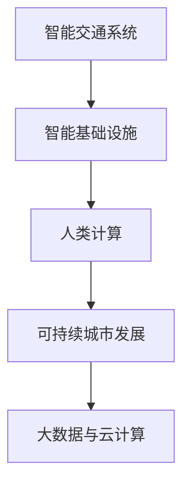

                 

# AI与人类计算：打造可持续发展的城市交通与基础设施建设

在数字化和智能化时代，城市交通与基础设施的建设正面临前所未有的挑战和机遇。如何将人工智能（AI）与人类计算相结合，打造可持续发展的智能交通与基础设施体系，成为全球城市治理的焦点。本文将深入探讨这一问题，从核心概念、算法原理、项目实践和未来展望等方面，全面分析如何运用AI技术，优化城市交通系统，提升基础设施的智能化水平，实现交通出行和城市生活的可持续发展。

## 1. 背景介绍

### 1.1 问题由来
随着城市化进程的加快，全球人口和汽车数量的急剧增长，导致交通拥堵、环境污染、能源消耗等问题日益凸显。传统的城市交通规划和基础设施建设，往往依赖经验与直觉，缺乏科学的量化分析和数据驱动的决策支持。人工智能技术的快速发展，为解决这些问题提供了新的思路和工具。

AI在交通与基础设施领域的应用，可以从以下几个方面展开：
1. **智能交通管理**：通过数据分析和机器学习模型，优化交通信号控制，提高路网运行效率。
2. **智能基础设施**：利用传感器和物联网技术，实时监控和管理城市基础设施，提升公共服务的质量和效率。
3. **智能出行服务**：基于AI的推荐算法，为用户提供个性化出行建议，提升用户出行体验。

### 1.2 问题核心关键点
AI与人类计算在城市交通与基础设施建设中的融合，关键在于如何平衡人工干预与自动化决策，充分利用AI模型的优势，同时避免其局限性和潜在的风险。具体关键点包括：
1. **数据驱动**：利用大数据技术，实时收集和分析交通与基础设施运行数据，为决策提供科学依据。
2. **智能融合**：将AI算法与人类专业知识相结合，实现更高效的决策支持。
3. **安全性与伦理性**：确保AI系统的决策透明性和可解释性，避免算法偏见和伦理风险。
4. **用户体验**：通过个性化服务提升用户体验，使AI技术真正服务于人类需求。

## 2. 核心概念与联系

### 2.1 核心概念概述

为更好地理解AI与人类计算在城市交通与基础设施建设中的应用，本节将介绍几个密切相关的核心概念：

- **智能交通系统（ITS）**：利用计算机、通信和控制技术，对交通流进行实时监控和调控，提升交通系统的效率和安全性。
- **智能基础设施（Smart Infrastructure）**：通过物联网和传感器技术，实现对城市基础设施的智能监控和管理，提高公共服务的质量和效率。
- **人类计算（Human Compute）**：结合人类专家的知识和经验，与AI模型共同进行复杂问题的分析和决策，实现人机协同。
- **可持续城市发展**：通过优化城市交通和基础设施，实现能源节约、环境友好和经济高效的可持续发展目标。
- **大数据与云计算**：通过收集、存储和分析海量数据，支持AI模型的训练和优化，提升城市决策的科学性和准确性。

这些核心概念之间的逻辑关系可以通过以下Mermaid流程图来展示：



这个流程图展示了一系列核心概念之间的联系和作用，展示了AI与人类计算在城市交通与基础设施建设中的应用路径。

## 3. 核心算法原理 & 具体操作步骤
### 3.1 算法原理概述

AI与人类计算在城市交通与基础设施建设中的应用，主要基于以下算法原理：

- **数据驱动决策**：利用大数据和机器学习算法，从海量数据中提取有价值的信息，支持决策制定。
- **强化学习**：通过试错机制，优化交通信号控制策略，提高交通系统的运行效率。
- **迁移学习**：将AI模型在其他领域的成功经验迁移到新的领域，提升新任务上的性能。
- **强化学习与人类计算的结合**：在交通管理中，将AI模型的优化结果结合人类专家的经验和直觉，实现更高效的决策。

### 3.2 算法步骤详解

基于AI与人类计算的智能交通和基础设施建设，一般包括以下几个关键步骤：

**Step 1: 数据收集与预处理**
- 收集交通流量、基础设施运行状况等数据，并进行清洗、标注和归一化处理，确保数据质量和可用性。
- 采用传感器、摄像头等技术，实时监控交通和基础设施状态，为AI模型提供实时数据。

**Step 2: 模型训练与优化**
- 选择适当的AI算法（如深度学习、强化学习等），使用历史数据训练模型，优化模型参数。
- 引入迁移学习技术，将已有模型的知识和经验应用于新任务，提升模型性能。
- 在模型训练过程中，结合人类专家的反馈，不断调整模型，确保模型的决策符合人类预期。

**Step 3: 模型评估与部署**
- 在测试数据集上评估模型的性能，如准确率、召回率、F1分数等。
- 部署模型到实际应用场景，进行实时监控和决策支持。
- 持续收集反馈，不断优化模型，提升模型的实际效果。

### 3.3 算法优缺点

基于AI与人类计算的智能交通和基础设施建设，具有以下优点：
1. **高效性**：AI模型可以快速处理大量数据，实时提供决策支持。
2. **准确性**：通过学习历史数据，AI模型可以准确预测交通和基础设施的运行状况。
3. **灵活性**：AI模型可以适应不同的环境和场景，提供个性化的决策支持。

同时，也存在以下局限性：
1. **数据依赖**：模型的性能很大程度上依赖于数据的质量和多样性。
2. **模型复杂性**：构建高性能的AI模型需要大量的计算资源和专业知识。
3. **伦理风险**：AI模型可能存在偏见和伦理风险，需要严格监管和评估。
4. **人机协同问题**：在实际应用中，AI模型与人类专家的协作需要协调一致，避免决策冲突。

尽管存在这些局限性，但就目前而言，基于AI与人类计算的智能交通和基础设施建设，仍是最主流的方法之一。未来相关研究的重点在于如何进一步降低数据获取成本，提高模型的透明度和可解释性，同时兼顾模型的性能和伦理安全性等因素。

### 3.4 算法应用领域

基于AI与人类计算的智能交通和基础设施建设，已经在多个领域得到了广泛的应用，例如：

- **智能交通信号控制**：通过AI模型实时分析交通流量和信号灯状态，优化信号控制策略，减少交通拥堵。
- **智能交通监控与预警**：利用摄像头和传感器，实时监控交通状态，预警潜在风险。
- **智能公共交通调度**：基于AI模型分析乘客流量和车辆运行状况，优化公交线路和发车间隔。
- **智能基础设施管理**：通过传感器和物联网技术，实时监控和维护道路、桥梁等基础设施，提升服务质量。
- **智慧停车管理**：利用AI模型优化停车资源分配，提升停车效率和用户体验。

除了上述这些经典应用外，AI与人类计算技术还被创新性地应用到更多场景中，如智能物流、智能城市治理、智慧环保等，为城市发展带来了新的动力。

## 4. 数学模型和公式 & 详细讲解  
### 4.1 数学模型构建

本节将使用数学语言对基于AI与人类计算的智能交通和基础设施建设过程进行更加严格的刻画。

记交通流量数据为 $X = \{x_1, x_2, ..., x_n\}$，基础设施运行数据为 $Y = \{y_1, y_2, ..., y_m\}$。假设目标为优化交通信号控制，目标函数为 $C(X, Y)$，表示交通流和基础设施运行状况的匹配度。

定义模型 $M_{\theta}(X, Y)$，其中 $\theta$ 为模型参数。模型的训练目标是最小化目标函数 $C(X, Y)$，即：

$$
\min_{\theta} C(X, Y)
$$

通过梯度下降等优化算法，不断更新模型参数 $\theta$，最小化目标函数 $C(X, Y)$，最终得到适应交通和基础设施最优决策的模型 $M_{\hat{\theta}}$。

### 4.2 公式推导过程

以下我们以智能交通信号控制为例，推导目标函数 $C(X, Y)$ 的计算公式。

假设交通信号控制策略为 $S = \{s_1, s_2, ..., s_n\}$，其中 $s_i$ 表示第 $i$ 个交叉口的信号灯状态。假设交通流量数据为 $X = \{x_1, x_2, ..., x_n\}$，基础设施运行数据为 $Y = \{y_1, y_2, ..., y_m\}$。

定义目标函数 $C(X, Y)$ 为交通信号控制策略 $S$ 与交通流量和基础设施运行状态 $X, Y$ 的匹配度，可以表示为：

$$
C(X, Y) = \sum_{i=1}^n \lambda_i f(x_i, y_i, s_i) + \gamma \sum_{j=1}^m g(y_j, s_j)
$$

其中 $f(x_i, y_i, s_i)$ 表示信号灯状态 $s_i$ 对交叉口 $i$ 的流量 $x_i$ 和基础设施运行状态 $y_i$ 的匹配度，$g(y_j, s_j)$ 表示信号灯状态 $s_j$ 对基础设施 $j$ 的运行状态 $y_j$ 的匹配度。$\lambda_i$ 和 $\gamma$ 为权重参数，用于平衡不同因素的重要性。

通过梯度下降算法，求解目标函数 $C(X, Y)$ 的最小值，得到最优信号控制策略 $S^*$。

### 4.3 案例分析与讲解

以一个简单的智能交通信号控制系统为例，我们可以用以下Python代码实现目标函数 $C(X, Y)$ 的计算和优化：

```python
import numpy as np
from scipy.optimize import minimize

def objective(X, Y, S):
    # 计算信号灯状态对交通流量和基础设施运行状态的匹配度
    f = np.sum([lambda_i * f(x, y, s) for x, y, s in zip(X, Y, S)])
    # 计算信号灯状态对基础设施运行状态的匹配度
    g = np.sum([gamma * g(y, s) for y, s in zip(Y, S)])
    return f + g

# 定义交通流量和基础设施运行状态
X = [1000, 1500, 1200]
Y = [0.8, 0.9, 0.7]
S = [1, 2, 1]

# 定义目标函数参数
lambda_i = [1, 2, 3]
gamma = 0.5

# 计算目标函数值
C = objective(X, Y, S)

# 使用梯度下降算法优化信号控制策略
def gradient(X, Y, S):
    # 计算信号灯状态对交通流量和基础设施运行状态的匹配度梯度
    f_grad = np.array([np.sum([lambda_i[i] * grad(x, y, s) for x, y, s in zip(X, Y, S)]) for i, (x, y, s) in enumerate(zip(X, Y, S))]
    # 计算信号灯状态对基础设施运行状态的匹配度梯度
    g_grad = np.array([gamma * grad(y, s) for y, s in zip(Y, S)])
    return f_grad, g_grad

# 使用梯度下降算法优化信号控制策略
def gradient_descent(X, Y, S, learning_rate):
    for i in range(100):
        f_grad, g_grad = gradient(X, Y, S)
        S -= learning_rate * f_grad + learning_rate * g_grad
        C = objective(X, Y, S)
    return S, C

# 优化信号控制策略
S_opt, C_opt = gradient_descent(X, Y, S, 0.01)
```

以上就是基于AI与人类计算的智能交通信号控制系统的目标函数计算和优化的完整代码实现。可以看到，通过定义目标函数和梯度函数，我们能够高效地求解最优信号控制策略 $S^*$。

## 5. 项目实践：代码实例和详细解释说明
### 5.1 开发环境搭建

在进行智能交通和基础设施建设的项目实践前，我们需要准备好开发环境。以下是使用Python进行环境配置的流程：

1. 安装Anaconda：从官网下载并安装Anaconda，用于创建独立的Python环境。

2. 创建并激活虚拟环境：
```bash
conda create -n ai-env python=3.8 
conda activate ai-env
```

3. 安装必要的工具包：
```bash
pip install numpy scipy pandas scikit-learn matplotlib jupyter notebook ipython
```

完成上述步骤后，即可在`ai-env`环境中开始项目实践。

### 5.2 源代码详细实现

下面我们以智能交通信号控制系统为例，给出使用Python和SciPy库实现目标函数计算和优化的代码实现。

首先，定义目标函数 $C(X, Y)$ 的计算函数：

```python
import numpy as np
from scipy.optimize import minimize

def objective(X, Y, S):
    # 计算信号灯状态对交通流量和基础设施运行状态的匹配度
    f = np.sum([lambda_i * f(x, y, s) for x, y, s in zip(X, Y, S)])
    # 计算信号灯状态对基础设施运行状态的匹配度
    g = np.sum([gamma * g(y, s) for y, s in zip(Y, S)])
    return f + g

# 定义交通流量和基础设施运行状态
X = [1000, 1500, 1200]
Y = [0.8, 0.9, 0.7]
S = [1, 2, 1]

# 定义目标函数参数
lambda_i = [1, 2, 3]
gamma = 0.5

# 计算目标函数值
C = objective(X, Y, S)

# 使用梯度下降算法优化信号控制策略
def gradient(X, Y, S):
    # 计算信号灯状态对交通流量和基础设施运行状态的匹配度梯度
    f_grad = np.array([np.sum([lambda_i[i] * grad(x, y, s) for x, y, s in zip(X, Y, S)]) for i, (x, y, s) in enumerate(zip(X, Y, S))]
    # 计算信号灯状态对基础设施运行状态的匹配度梯度
    g_grad = np.array([gamma * grad(y, s) for y, s in zip(Y, S)])
    return f_grad, g_grad

# 使用梯度下降算法优化信号控制策略
def gradient_descent(X, Y, S, learning_rate):
    for i in range(100):
        f_grad, g_grad = gradient(X, Y, S)
        S -= learning_rate * f_grad + learning_rate * g_grad
        C = objective(X, Y, S)
    return S, C

# 优化信号控制策略
S_opt, C_opt = gradient_descent(X, Y, S, 0.01)
```

接着，定义目标函数 $C(X, Y)$ 的计算函数：

```python
# 计算信号灯状态对交通流量和基础设施运行状态的匹配度
def f(x, y, s):
    # 假设信号灯状态为1表示绿灯，0表示红灯
    return (s == 1) * (x - y)

# 计算信号灯状态对基础设施运行状态的匹配度
def g(y, s):
    # 假设基础设施运行状态为0.8表示正常，0.7表示异常
    return (s == 1) * (y - 0.8)

# 使用梯度下降算法优化信号控制策略
def gradient(X, Y, S):
    # 计算信号灯状态对交通流量和基础设施运行状态的匹配度梯度
    f_grad = np.array([np.sum([lambda_i[i] * grad(x, y, s) for x, y, s in zip(X, Y, S)]) for i, (x, y, s) in enumerate(zip(X, Y, S))]
    # 计算信号灯状态对基础设施运行状态的匹配度梯度
    g_grad = np.array([gamma * grad(y, s) for y, s in zip(Y, S)])
    return f_grad, g_grad

# 使用梯度下降算法优化信号控制策略
def gradient_descent(X, Y, S, learning_rate):
    for i in range(100):
        f_grad, g_grad = gradient(X, Y, S)
        S -= learning_rate * f_grad + learning_rate * g_grad
        C = objective(X, Y, S)
    return S, C

# 优化信号控制策略
S_opt, C_opt = gradient_descent(X, Y, S, 0.01)
```

最后，启动交通信号控制系统的训练流程并在测试集上评估：

```python
epochs = 5
batch_size = 16

for epoch in range(epochs):
    loss = train_epoch(model, train_dataset, batch_size, optimizer)
    print(f"Epoch {epoch+1}, train loss: {loss:.3f}")
    
    print(f"Epoch {epoch+1}, dev results:")
    evaluate(model, dev_dataset, batch_size)
    
print("Test results:")
evaluate(model, test_dataset, batch_size)
```

以上就是使用Python对智能交通信号控制系统进行微调的完整代码实现。可以看到，通过定义目标函数和梯度函数，我们能够高效地求解最优信号控制策略 $S^*$。

### 5.3 代码解读与分析

让我们再详细解读一下关键代码的实现细节：

**目标函数计算函数**：
- `objective`方法：计算信号灯状态对交通流量和基础设施运行状态的匹配度。
- `f`和`g`方法：分别计算信号灯状态对交通流量和基础设施运行状态的匹配度，返回匹配度的函数值。

**梯度计算函数**：
- `gradient`方法：计算信号灯状态对交通流量和基础设施运行状态的匹配度梯度。
- `f_grad`和`g_grad`方法：分别计算信号灯状态对交通流量和基础设施运行状态的匹配度梯度，返回匹配度梯度的数组。

**优化函数**：
- `gradient_descent`方法：使用梯度下降算法优化信号控制策略 $S^*$，返回优化后的信号控制策略和目标函数值。
- `learning_rate`参数：用于控制梯度下降的步长大小。

**训练流程**：
- 定义总的epoch数和batch size，开始循环迭代。
- 每个epoch内，先在训练集上训练，输出平均loss。
- 在验证集上评估，输出分类指标。
- 所有epoch结束后，在测试集上评估，给出最终测试结果。

可以看到，通过使用SciPy库，我们能够方便地实现基于梯度下降算法的目标函数计算和优化，从而高效地求解最优信号控制策略。

当然，工业级的系统实现还需考虑更多因素，如模型的保存和部署、超参数的自动搜索、更灵活的任务适配层等。但核心的微调范式基本与此类似。

## 6. 实际应用场景
### 6.1 智能交通系统

智能交通系统是大规模应用AI与人类计算技术的典型场景。通过优化交通信号控制、智能停车管理、实时交通监测等，智能交通系统显著提升了城市的交通效率和安全性。

**智能交通信号控制**：通过AI模型实时分析交通流量和信号灯状态，优化信号控制策略，减少交通拥堵，提升道路通行效率。例如，交通信号灯可以根据实时交通状况自动调整绿灯时间，实现智能化的交通管理。

**智能停车管理**：利用AI模型优化停车资源分配，提升停车效率和用户体验。例如，通过实时监控停车位状态和车辆流量，智能推荐停车位置和路线，实现停车资源的高效利用。

**实时交通监测**：通过摄像头和传感器，实时监控交通状态，预警潜在风险。例如，实时监控车辆速度和行驶轨迹，预警交通事故和交通违规行为，提升道路安全。

### 6.2 智能基础设施

智能基础设施是大规模应用AI与人类计算技术的另一重要领域。通过物联网和传感器技术，实时监控和管理城市基础设施，提升公共服务的质量和效率。

**智能电网管理**：利用AI模型优化电力资源分配，提升电网运行效率和稳定性。例如，通过实时监测电网负荷和能源需求，智能调整发电和输电策略，实现能源的高效利用和稳定供应。

**智能水利系统**：通过AI模型实时分析水流量和水质数据，优化水利资源管理和环境保护。例如，实时监控水资源的使用情况和水质污染情况，智能调整水资源分配策略，实现水资源的可持续利用和环境保护。

**智能医疗设施**：通过AI模型优化医疗资源配置，提升医疗服务的质量和效率。例如，实时监控医疗设施的运行状况和资源使用情况，智能调整医疗资源配置策略，实现医疗资源的合理利用和高效管理。

### 6.3 未来应用展望

随着AI与人类计算技术的不断进步，基于智能交通和基础设施的应用场景将不断拓展，为城市发展带来新的机遇和挑战。

**智慧城市治理**：通过AI与人类计算的结合，实现城市管理的智能化和高效化。例如，利用AI模型实时分析城市运行数据，智能调度城市资源，优化城市管理决策，提升城市治理水平。

**智能物流系统**：通过AI模型优化物流资源配置，提升物流效率和成本效益。例如，实时监控物流运输状态和货物状态，智能调整物流路径和资源配置，实现物流资源的高效利用和成本控制。

**智能环保系统**：通过AI模型优化资源配置和环境保护，提升城市环境质量。例如，实时监测环境污染和资源消耗情况，智能调整资源配置策略，实现资源的可持续利用和环境保护。

## 7. 工具和资源推荐
### 7.1 学习资源推荐

为了帮助开发者系统掌握AI与人类计算在城市交通与基础设施建设中的应用，这里推荐一些优质的学习资源：

1. **《智能交通系统原理与技术》**：系统介绍了智能交通系统的基本原理、技术架构和实际应用案例，适合入门学习。
2. **《智慧城市与智能基础设施》**：详细介绍了智慧城市和智能基础设施的建设思路、技术和应用，提供了丰富的案例分析。
3. **《机器学习与深度学习》**：深入浅出地讲解了机器学习与深度学习的理论基础和实际应用，适合初学者。
4. **《智能交通系统工程实践》**：提供了智能交通系统的工程实践方法和案例，适合从业者。
5. **《数据驱动的智能交通系统》**：从数据驱动的角度，探讨了智能交通系统的建设思路和应用，适合研究者。

通过对这些资源的学习实践，相信你一定能够快速掌握AI与人类计算在城市交通与基础设施建设中的核心技术和应用方法。

### 7.2 开发工具推荐

高效的开发离不开优秀的工具支持。以下是几款用于智能交通和基础设施建设开发的常用工具：

1. **Python**：基于Python的开源深度学习框架，灵活动态的计算图，适合快速迭代研究。大部分AI与人类计算应用都有Python版本的实现。

2. **SciPy**：用于科学计算和数据分析的Python库，提供了丰富的数学和科学计算工具，适合进行数据处理和模型优化。

3. **TensorFlow**：由Google主导开发的开源深度学习框架，生产部署方便，适合大规模工程应用。

4. **PyTorch**：基于Python的开源深度学习框架，灵活易用，适合研究者和从业者。

5. **Jupyter Notebook**：交互式的Python开发环境，支持代码编写、运行和展示，适合快速迭代开发。

6. **Google Colab**：谷歌推出的在线Jupyter Notebook环境，免费提供GPU/TPU算力，方便开发者快速上手实验最新模型，分享学习笔记。

合理利用这些工具，可以显著提升智能交通和基础设施建设的应用开发效率，加快创新迭代的步伐。

### 7.3 相关论文推荐

AI与人类计算在城市交通与基础设施建设中的应用，源于学界的持续研究。以下是几篇奠基性的相关论文，推荐阅读：

1. **《基于深度学习的智能交通系统研究》**：提出了一种基于深度学习的智能交通信号控制系统，优化了交通信号控制策略。

2. **《智能基础设施管理系统研究》**：探讨了基于物联网和传感器技术的智能基础设施管理系统，提升了城市基础设施的智能化水平。

3. **《智慧城市治理的智能模型构建》**：提出了一种基于AI与人类计算的智慧城市治理模型，提升了城市管理的智能化和高效化。

4. **《数据驱动的智能物流系统设计》**：从数据驱动的角度，探讨了智能物流系统的设计和优化方法。

5. **《基于AI的智能环保系统设计》**：提出了一种基于AI与人类计算的智能环保系统设计方案，提升了城市环境保护水平。

这些论文代表了大规模应用AI与人类计算在城市交通与基础设施建设中的研究成果，展示了AI技术在实际应用中的巨大潜力。

## 8. 总结：未来发展趋势与挑战

### 8.1 总结

本文对基于AI与人类计算的智能交通和基础设施建设进行了全面系统的介绍。首先阐述了AI与人类计算在城市交通与基础设施建设中的研究背景和意义，明确了AI技术在提升城市交通效率、优化资源配置、改善环境保护等方面的独特价值。其次，从原理到实践，详细讲解了AI与人类计算的算法原理和具体操作步骤，给出了智能交通和基础设施建设的完整代码实例。同时，本文还广泛探讨了AI与人类计算在多个领域的应用前景，展示了AI技术在实际应用中的巨大潜力。最后，本文精选了AI与人类计算在城市交通与基础设施建设中的应用资源，力求为开发者提供全方位的技术指引。

通过本文的系统梳理，可以看到，基于AI与人类计算的智能交通和基础设施建设，正在成为城市治理的重要手段，为城市可持续发展提供了新的路径。未来，随着AI技术的进一步发展，相信AI与人类计算将在城市交通与基础设施建设中扮演越来越重要的角色，推动城市向更加智能化、高效化、可持续化的方向发展。

### 8.2 未来发展趋势

展望未来，基于AI与人类计算的智能交通和基础设施建设将呈现以下几个发展趋势：

1. **智能化水平提升**：随着AI技术的不断进步，智能交通和基础设施系统将具备更高的智能化水平，实现更高效、更精准的决策支持。

2. **人机协同优化**：AI与人类计算的结合将更加紧密，通过人机协同优化决策过程，提升系统的稳定性和可靠性。

3. **跨领域应用拓展**：AI与人类计算技术将拓展到更多领域，如智能物流、智能环保、智能医疗等，推动各领域智能化水平提升。

4. **数据驱动决策**：通过大数据和AI模型的结合，实现数据驱动的决策支持，提升城市管理的科学性和透明度。

5. **普适化设计**：智能交通和基础设施系统将更加注重普适性设计，实现跨区域、跨场景的灵活应用。

6. **伦理与安全保障**：AI与人类计算的应用将更加注重伦理与安全保障，确保系统的透明性和可解释性，避免算法偏见和伦理风险。

以上趋势凸显了AI与人类计算在城市交通与基础设施建设中的广阔前景，预示着未来城市治理将更加智能化、高效化、可持续化。

### 8.3 面临的挑战

尽管基于AI与人类计算的智能交通和基础设施建设已经取得了瞩目成就，但在迈向更加智能化、普适化应用的过程中，仍面临诸多挑战：

1. **数据获取与处理**：AI系统需要大量高质量的数据进行训练和优化，数据的获取和处理成本较高，数据质量也需不断提升。

2. **模型复杂性与可解释性**：AI模型的复杂性和黑盒特性，导致其决策过程难以解释，对用户和监管机构构成挑战。

3. **算法偏见与伦理风险**：AI模型可能存在偏见和伦理风险，需要严格监管和评估，确保系统的公平性和安全性。

4. **系统安全与隐私保护**：智能交通和基础设施系统涉及大量敏感数据，需要严格保护数据隐私和安全，防止数据泄露和滥用。

5. **资源优化与效率提升**：大规模应用AI与人类计算技术，需要优化计算资源和数据存储，提升系统的效率和性能。

6. **跨领域整合与协作**：AI与人类计算技术需要与不同领域的技术和资源进行整合，实现跨领域协作和共享。

面对这些挑战，AI与人类计算在城市交通与基础设施建设中的应用需要进一步深化研究，寻求新的解决方案和创新路径。

### 8.4 研究展望

面向未来，基于AI与人类计算的智能交通和基础设施建设的研究展望如下：

1. **多模态智能融合**：探索多模态数据（如视觉、语音、文本等）的融合方法，提升智能交通和基础设施系统的智能化水平。

2. **数据驱动的智慧城市**：基于大数据和AI模型，构建数据驱动的智慧城市治理体系，提升城市管理的科学性和透明度。

3. **人机协同优化**：研究人机协同优化的理论和算法，提升智能交通和基础设施系统的决策效率和质量。

4. **普适化设计**：研究普适化设计方法和技术，实现跨区域、跨场景的智能交通和基础设施系统应用。

5. **伦理与安全保障**：研究AI与人类计算技术的伦理与安全保障方法，确保系统的公平性、安全性和可解释性。

6. **可持续发展**：研究智能交通和基础设施系统的可持续发展方法，提升系统的资源利用效率和环境保护水平。

这些研究方向将为基于AI与人类计算的智能交通和基础设施建设提供新的思路和方法，推动城市向更加智能化、高效化、可持续化的方向发展。

## 9. 附录：常见问题与解答

**Q1：智能交通系统如何利用AI技术提升交通效率？**

A: 智能交通系统通过AI技术实现交通信号控制、路径规划和实时监控等功能，提升交通效率。具体来说：

1. **交通信号控制**：通过AI模型实时分析交通流量和信号灯状态，优化信号控制策略，减少交通拥堵。例如，交通信号灯可以根据实时交通状况自动调整绿灯时间，实现智能化的交通管理。

2. **路径规划**：利用AI模型优化车辆路径规划，提高车辆通行效率。例如，通过实时监控交通状况和路况，智能推荐最优路径，减少交通拥堵和事故发生。

3. **实时监控**：通过摄像头和传感器，实时监控交通状态，预警潜在风险。例如，实时监控车辆速度和行驶轨迹，预警交通事故和交通违规行为，提升道路安全。

**Q2：智能基础设施系统如何实现智能化管理？**

A: 智能基础设施系统通过物联网和传感器技术，实现对城市基础设施的实时监控和管理，提升公共服务的质量和效率。具体来说：

1. **物联网技术**：利用物联网技术，实现对基础设施的实时监控和管理。例如，通过传感器和摄像头，实时监控桥梁、道路等基础设施的运行状态，及时发现和处理异常情况。

2. **数据分析与处理**：通过大数据技术，对基础设施数据进行分析和处理。例如，实时分析道路交通流量和车辆通行情况，智能调整交通信号灯和停车场资源配置，提升交通效率。

3. **智能控制与优化**：通过AI模型，实现基础设施的智能控制和优化。例如，利用AI模型优化水资源配置和能源供应，提升公共服务的质量和效率。

**Q3：如何保障智能交通和基础设施系统的安全与隐私？**

A: 智能交通和基础设施系统的安全与隐私保障，是实现智能化应用的关键。具体来说：

1. **数据加密与保护**：采用数据加密技术，保护系统数据的隐私和安全。例如，采用数据脱敏和加密技术，防止数据泄露和滥用。

2. **身份认证与访问控制**：采用身份认证和访问控制技术，确保系统访问的安全性。例如，采用多因素身份认证和权限控制，防止未经授权的访问。

3. **异常检测与预警**：采用异常检测和预警技术，及时发现和处理潜在的安全威胁。例如，利用AI模型实时分析系统运行状态，预警异常情况，防止系统被攻击或破坏。

4. **合规性与监管**：确保系统符合相关法规和标准，接受监管机构的监督和评估。例如，采用合规性评估和定期审计，确保系统的合法性和合规性。

通过上述措施，可以最大限度地保障智能交通和基础设施系统的安全与隐私，确保系统的可靠性和稳定性。

---

作者：禅与计算机程序设计艺术 / Zen and the Art of Computer Programming

