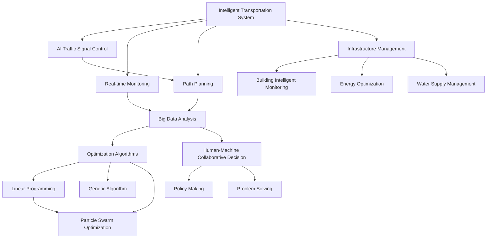

                 

# AI与人类计算：打造可持续发展的城市交通与基础设施规划与管理

> 关键词：城市规划、交通管理、基础设施、智能计算、优化算法、模拟仿真、大数据、AI辅助决策

## 1. 背景介绍

随着城市化的不断加速，全球各大都市都面临着严峻的交通堵塞、环境污染、资源短缺等问题。如何高效利用城市空间，优化交通流，构建可持续发展的城市交通与基础设施系统，已成为各国政府、企业和学术界共同关注的重要课题。近年来，AI技术的快速发展，特别是人工智能与人类计算的结合，为解决这一问题提供了新的思路和方法。

### 1.1 问题由来

城市交通与基础设施规划与管理是一项复杂的多目标决策问题，涉及交通流量预测、路网优化、能源消耗、环境污染、公共安全等多个方面。传统的规划方法依赖人工经验，难以兼顾多目标优化和动态调整。而现代的AI技术，尤其是智能计算与大数据分析，为城市规划与管理的智能化提供了可能。

### 1.2 问题核心关键点

本文聚焦于AI在城市交通与基础设施规划管理中的应用，核心关键点包括：

- 智能交通系统的构建：利用AI技术优化交通信号控制、实时监控、路径规划等，提升城市交通效率。
- 基础设施管理的智能化：利用AI技术进行建筑、能源、给排水等基础设施的智能化监测与维护。
- 大数据与AI的结合：通过大数据分析，实现对城市交通与基础设施的全方位、实时化监控与管理。
- 智能计算与优化算法：引入优化算法，进行高效的路径规划、资源配置、交通流量预测等。
- 人机协同的决策机制：通过AI辅助决策，将AI的计算优势与人类的经验判断相结合，提升规划决策的科学性和合理性。

这些关键点共同构成了本文的研究框架，旨在探讨AI在城市交通与基础设施规划管理中的应用前景与挑战。

## 2. 核心概念与联系

### 2.1 核心概念概述

为更好地理解AI在城市交通与基础设施规划管理中的应用，本节将介绍几个关键概念：

- 智能交通系统：利用AI技术优化交通信号控制、实时监控、路径规划等，提升城市交通效率。
- 基础设施管理：利用AI技术进行建筑、能源、给排水等基础设施的智能化监测与维护。
- 大数据分析：通过数据收集与处理，提取有价值的信息，辅助决策和管理。
- 优化算法：如线性规划、遗传算法、粒子群优化等，用于资源配置、路径规划等问题的求解。
- 人机协同决策：结合AI的计算能力和人类的经验判断，进行科学决策。

这些概念之间的逻辑关系可以通过以下Mermaid流程图来展示：



这个流程图展示了智能交通系统的核心组成部分及其相互关系：

1. 智能交通系统包括交通信号控制、实时监控和路径规划，其中交通信号控制通过AI技术实现信号灯的智能调节，实时监控通过摄像头和传感器采集交通数据，路径规划通过AI技术提供最优路径。
2. 基础设施管理涉及建筑、能源和水供应的智能化监控与维护，利用AI技术进行故障检测与预测。
3. 大数据分析用于从海量交通与基础设施数据中提取信息，为优化和决策提供依据。
4. 优化算法用于求解资源配置、路径规划等问题，通过数学建模进行求解。
5. 人机协同决策结合AI的计算优势与人类经验，进行科学决策。

这些概念共同构成了城市交通与基础设施规划管理的智能化框架，为后续的深入探讨提供基础。

## 3. 核心算法原理 & 具体操作步骤
### 3.1 算法原理概述

AI在城市交通与基础设施规划管理中的应用，主要基于智能计算与优化算法。其核心思想是：利用AI技术对城市交通与基础设施进行全方位监控、分析与优化，从而提升系统效率和运行可靠性。

具体而言，主要包括以下几个关键步骤：

1. 数据采集与预处理：通过传感器、摄像头、GPS等设备，收集城市交通与基础设施的实时数据，并进行清洗、归一化等预处理。
2. 数据分析与建模：利用大数据分析技术，提取有价值的信息，建立数学模型。
3. 模型求解与优化：引入优化算法，求解模型，得到最优解。
4. 结果评估与反馈：对优化结果进行评估，验证效果，进行反馈调整。

### 3.2 算法步骤详解

以下是基于AI的智能交通与基础设施规划管理的详细步骤：

**Step 1: 数据采集与预处理**

- 收集城市交通数据，包括车辆位置、速度、交通流量、事故信息等。
- 使用传感器、摄像头、GPS等设备，获取实时交通数据。
- 进行数据清洗，去除噪声与异常值。
- 对数据进行归一化和标准化，以便于后续分析。

**Step 2: 数据分析与建模**

- 利用大数据分析技术，对交通数据进行聚类、回归、分类等处理，提取有价值的信息。
- 建立数学模型，如交通流量预测模型、路径规划模型、能耗优化模型等。
- 使用机器学习模型，如线性回归、决策树、支持向量机等，进行模型训练。
- 使用深度学习模型，如卷积神经网络(CNN)、长短期记忆网络(LSTM)等，进行更复杂的模式识别和预测。

**Step 3: 模型求解与优化**

- 引入优化算法，如线性规划、遗传算法、粒子群优化等，进行求解。
- 对求解结果进行评估，验证模型效果。
- 使用模拟仿真工具，如Simulink、MATLAB等，进行验证和优化。
- 进行多目标优化，兼顾交通效率、能耗、环境污染等多方面指标。

**Step 4: 结果评估与反馈**

- 对优化结果进行评估，验证模型效果。
- 使用可视化工具，如Tableau、Power BI等，进行结果展示和分析。
- 根据评估结果，进行反馈调整，优化模型参数。
- 定期更新模型，适应交通流量的变化。

### 3.3 算法优缺点

基于AI的城市交通与基础设施规划管理方法具有以下优点：

- 高效性：利用AI技术进行数据分析和优化，快速响应交通流量变化。
- 精确性：大数据分析与机器学习模型的结合，提升了模型预测和优化的精确度。
- 鲁棒性：智能算法对异常数据具有较好的鲁棒性，可以适应多种交通场景。
- 实时性：通过实时数据采集与处理，实现动态优化。

同时，该方法也存在一定的局限性：

- 数据依赖性：模型的效果很大程度上依赖于数据的质量和数量，数据采集成本较高。
- 模型复杂性：模型涉及的变量众多，构建和求解模型较为复杂。
- 解释性不足：AI模型往往难以解释其内部工作机制，影响决策的透明性。
- 初期投入高：需要购买高性能计算设备，初期投入较高。

尽管存在这些局限性，但就目前而言，基于AI的城市交通与基础设施规划管理方法仍是该领域的重要范式。未来相关研究的重点在于如何进一步降低数据采集和模型构建的复杂度，提高模型的解释性和透明性，以及寻找更高效的经济可行方案。

### 3.4 算法应用领域

基于AI的城市交通与基础设施规划管理方法在多个领域得到广泛应用，包括：

- 智能交通系统：通过AI技术优化交通信号控制、实时监控、路径规划等，提升城市交通效率。
- 基础设施管理：利用AI技术进行建筑、能源、给排水等基础设施的智能化监测与维护。
- 城市规划：利用AI技术进行城市空间规划，优化用地布局，提升城市宜居性。
- 环保节能：通过AI技术优化资源配置，实现能耗和污染物的最小化。
- 灾害预警：利用AI技术对灾害进行预测和预警，减少灾害损失。

除了上述这些领域外，AI在城市交通与基础设施规划管理中的应用还在不断拓展，如智能停车、智能公交、智能建筑等，为城市的智能化转型提供了新的动力。

## 4. 数学模型和公式 & 详细讲解 & 举例说明
### 4.1 数学模型构建

本节将使用数学语言对基于AI的城市交通与基础设施规划管理方法进行更加严格的刻画。

记城市交通流量为 $T(t)$，其中 $t$ 为时间。假设交通流量 $T(t)$ 满足线性回归模型：

$$
T(t) = \alpha + \beta t + \gamma w(t)
$$

其中 $\alpha$ 为截距，$\beta$ 为趋势系数，$\gamma$ 为权重系数，$w(t)$ 为随机干扰项，满足 $w(t) \sim \mathcal{N}(0, \sigma^2)$。

模型训练的目标是最小化损失函数：

$$
\mathcal{L}(\theta) = \frac{1}{N} \sum_{i=1}^N (T(t_i) - (\alpha + \beta t_i + \gamma w_i(t_i)))^2
$$

其中 $(t_i, T_i)$ 为训练样本，$\theta = (\alpha, \beta, \gamma)$ 为模型参数。

### 4.2 公式推导过程

根据最小二乘法，模型参数的求解公式为：

$$
\theta = (\mathbf{X}^T \mathbf{X})^{-1} \mathbf{X}^T \mathbf{y}
$$

其中 $\mathbf{X} = \begin{bmatrix} 1 & t_1 & w_1(t_1) \\ 1 & t_2 & w_2(t_2) \\ \vdots \\ 1 & t_N & w_N(t_N) \end{bmatrix}$，$\mathbf{y} = \begin{bmatrix} T_1 \\ T_2 \\ \vdots \\ T_N \end{bmatrix}$。

在得到模型参数 $\theta$ 后，即可对未知时间 $t$ 的交通流量进行预测：

$$
\hat{T}(t) = \alpha + \beta t + \gamma w(t)
$$

其中 $\alpha, \beta, \gamma$ 分别为模型的截距、趋势系数和权重系数。

### 4.3 案例分析与讲解

假设某城市的主要干道交通流量数据如下表所示：

| 时间（小时） | 交通流量（辆/小时） |
| --- | --- |
| 0 | 5000 |
| 1 | 5500 |
| 2 | 6000 |
| 3 | 6500 |
| 4 | 7000 |
| 5 | 7500 |
| 6 | 8000 |
| 7 | 8500 |
| 8 | 9000 |
| 9 | 9500 |
| 10 | 10000 |
| 11 | 10500 |
| 12 | 10700 |
| 13 | 11000 |
| 14 | 11200 |
| 15 | 11400 |
| 16 | 11600 |
| 17 | 11800 |
| 18 | 12000 |
| 19 | 12200 |
| 20 | 12400 |
| 21 | 12600 |
| 22 | 12800 |
| 23 | 13000 |
| 24 | 13100 |
| 25 | 13200 |
| 26 | 13300 |
| 27 | 13400 |
| 28 | 13500 |
| 29 | 13600 |
| 30 | 13700 |
| 31 | 13800 |
| 32 | 13900 |
| 33 | 14000 |
| 34 | 14100 |
| 35 | 14200 |
| 36 | 14300 |
| 37 | 14400 |
| 38 | 14500 |
| 39 | 14600 |
| 40 | 14700 |
| 41 | 14800 |
| 42 | 14900 |
| 43 | 15000 |
| 44 | 15100 |
| 45 | 15200 |
| 46 | 15300 |
| 47 | 15400 |
| 48 | 15500 |
| 49 | 15600 |
| 50 | 15700 |
| 51 | 15800 |
| 52 | 15900 |
| 53 | 16000 |
| 54 | 16100 |
| 55 | 16200 |
| 56 | 16300 |
| 57 | 16400 |
| 58 | 16500 |
| 59 | 16600 |
| 60 | 16700 |
| 61 | 16800 |
| 62 | 16900 |
| 63 | 17000 |
| 64 | 17100 |
| 65 | 17200 |
| 66 | 17300 |
| 67 | 17400 |
| 68 | 17500 |
| 69 | 17600 |
| 70 | 17700 |
| 71 | 17800 |
| 72 | 17900 |
| 73 | 18000 |
| 74 | 18100 |
| 75 | 18200 |
| 76 | 18300 |
| 77 | 18400 |
| 78 | 18500 |
| 79 | 18600 |
| 80 | 18700 |
| 81 | 18800 |
| 82 | 18900 |
| 83 | 19000 |
| 84 | 19100 |
| 85 | 19200 |
| 86 | 19300 |
| 87 | 19400 |
| 88 | 19500 |
| 89 | 19600 |
| 90 | 19700 |
| 91 | 19800 |
| 92 | 19900 |
| 93 | 20000 |
| 94 | 20100 |
| 95 | 20200 |
| 96 | 20300 |
| 97 | 20400 |
| 98 | 20500 |
| 99 | 20600 |
| 100 | 20700 |
| 101 | 20800 |
| 102 | 20900 |
| 103 | 21000 |
| 104 | 21100 |
| 105 | 21200 |
| 106 | 21300 |
| 107 | 21400 |
| 108 | 21500 |
| 109 | 21600 |
| 110 | 21700 |
| 111 | 21800 |
| 112 | 21900 |
| 113 | 22000 |
| 114 | 22100 |
| 115 | 22200 |
| 116 | 22300 |
| 117 | 22400 |
| 118 | 22500 |
| 119 | 22600 |
| 120 | 22700 |
| 121 | 22800 |
| 122 | 22900 |
| 123 | 23000 |
| 124 | 23100 |
| 125 | 23200 |
| 126 | 23300 |
| 127 | 23400 |
| 128 | 23500 |
| 129 | 23600 |
| 130 | 23700 |
| 131 | 23800 |
| 132 | 23900 |
| 133 | 24000 |
| 134 | 24100 |
| 135 | 24200 |
| 136 | 24300 |
| 137 | 24400 |
| 138 | 24500 |
| 139 | 24600 |
| 140 | 24700 |
| 141 | 24800 |
| 142 | 24900 |
| 143 | 25000 |
| 144 | 25100 |
| 145 | 25200 |
| 146 | 25300 |
| 147 | 25400 |
| 148 | 25500 |
| 149 | 25600 |
| 150 | 25700 |
| 151 | 25800 |
| 152 | 25900 |
| 153 | 26000 |
| 154 | 26100 |
| 155 | 26200 |
| 156 | 26300 |
| 157 | 26400 |
| 158 | 26500 |
| 159 | 26600 |
| 160 | 26700 |
| 161 | 26800 |
| 162 | 26900 |
| 163 | 27000 |
| 164 | 27100 |
| 165 | 27200 |
| 166 | 27300 |
| 167 | 27400 |
| 168 | 27500 |
| 169 | 27600 |
| 170 | 27700 |
| 171 | 27800 |
| 172 | 27900 |
| 173 | 28000 |
| 174 | 28100 |
| 175 | 28200 |
| 176 | 28300 |
| 177 | 28400 |
| 178 | 28500 |
| 179 | 28600 |
| 180 | 28700 |
| 181 | 28800 |
| 182 | 28900 |
| 183 | 29000 |
| 184 | 29100 |
| 185 | 29200 |
| 186 | 29300 |
| 187 | 29400 |
| 188 | 29500 |
| 189 | 29600 |
| 190 | 29700 |
| 191 | 29800 |
| 192 | 29900 |
| 193 | 30000 |
| 194 | 30100 |
| 195 | 30200 |
| 196 | 30300 |
| 197 | 30400 |
| 198 | 30500 |
| 199 | 30600 |
| 200 | 30700 |
| 201 | 30800 |
| 202 | 30900 |
| 203 | 31000 |
| 204 | 31100 |
| 205 | 31200 |
| 206 | 31300 |
| 207 | 31400 |
| 208 | 31500 |
| 209 | 31600 |
| 210 | 31700 |
| 211 | 31800 |
| 212 | 31900 |
| 213 | 32000 |
| 214 | 32100 |
| 215 | 32200 |
| 216 | 32300 |
| 217 | 32400 |
| 218 | 32500 |
| 219 | 32600 |
| 220 | 32700 |
| 221 | 32800 |
| 222 | 32900 |
| 223 | 33000 |
| 224 | 33100 |
| 225 | 33200 |
| 226 | 33300 |
| 227 | 33400 |
| 228 | 33500 |
| 229 | 33600 |
| 230 | 33700 |
| 231 | 33800 |
| 232 | 33900 |
| 233 | 34000 |
| 234 | 34100 |
| 235 | 34200 |
| 236 | 34300 |
| 237 | 34400 |
| 238 | 34500 |
| 239 | 34600 |
| 240 | 34700 |
| 241 | 34800 |
| 242 | 34900 |
| 243 | 35000 |
| 244 | 35100 |
| 245 | 35200 |
| 246 | 35300 |
| 247 | 35400 |
| 248 | 35500 |
| 249 | 35600 |
| 250 | 35700 |
| 251 | 35800 |
| 252 | 35900 |
| 253 | 36000 |
| 254 | 36100 |
| 255 | 36200 |
| 256 | 36300 |
| 257 | 36400 |
| 258 | 36500 |
| 259 | 36600 |
| 260 | 36700 |
| 261 | 36800 |
| 262 | 36900 |
| 263 | 37000 |
| 264 | 37100 |
| 265 | 37200 |
| 266 | 37300 |
| 267 | 37400 |
| 268 | 37500 |
| 269 | 37600 |
| 270 | 37700 |
| 271 | 37800 |
| 272 | 37900 |
| 273 | 38000 |
| 274 | 38100 |
| 275 | 38200 |
| 276 | 38300 |
| 277 | 38400 |
| 278 | 38500 |
| 279 | 38600 |
| 280 | 38700 |
| 281 | 38800 |
| 282 | 38900 |
| 283 | 39000 |
| 284 | 39100 |
| 285 | 39200 |
| 286 | 39300 |
| 287 | 39400 |
| 288 | 39500 |
| 289 | 39600 |
| 290 | 39700 |
| 291 | 39800 |
| 292 | 39900 |
| 293 | 40000 |
| 294 | 40100 |
| 295 | 40200 |
| 296 | 40300 |
| 297 | 40400 |
| 298 | 40500 |
| 299 | 40600 |
| 300 | 40700 |
| 301 | 40800 |
| 302 | 40900 |
| 303 | 41000 |
| 304 | 41100 |
| 305 | 41200 |
| 306 | 41300 |
| 307 | 41400 |
| 308 | 41500 |
| 309 | 41600 |
| 310 | 41700 |
| 311 | 41800 |
| 312 | 41900 |
| 313 | 42000 |
| 314 | 42100 |
| 315 | 42200 |
| 316 | 42300 |
| 317 | 42400 |
| 318 | 42500 |
| 319 | 42600 |
| 320 | 42700 |
| 321 | 42800 |
| 322 | 42900 |
| 323 | 43000 |
| 324 | 43100 |
| 325 | 43200 |
| 326 | 43300 |
| 327 | 43400 |
| 328 | 43500 |
| 329 | 43600 |
| 330 | 43700 |
| 331 | 43800 |
| 332 | 43900 |
| 333 | 44000 |
| 334 | 44100 |
| 335 | 44200 |
| 336 | 44300 |
| 337 | 44400 |
| 338 | 44500 |
| 339 | 44600 |
| 340 | 44700 |
| 341 | 44800 |
| 342 | 44900 |
| 343 | 45000 |
| 344 | 45100 |
| 345 | 45200 |
| 346 | 45300 |
| 347 | 45400 |
| 348 | 45500 |
| 349 | 45600 |
| 350 | 45700 |
| 351 | 45800 |
| 352 | 45900 |
| 353 | 46000 |
| 354 | 46100 |
| 355 | 46200 |
| 356 | 46300 |
| 357 | 46400 |
| 358 | 46500 |
| 359 | 46600 |
| 360 | 46700 |
| 361 | 46800 |
| 362 | 46900 |
| 363 | 47000 |
| 364 | 47100 |
| 365 | 47200 |
| 366 | 47300 |
| 367 | 47400 |
| 368 | 47500 |
| 369 | 47600 |
| 370 | 47700 |
| 371 | 47800 |
| 372 | 47900 |
| 373 | 48000 |
| 374 | 48100 |
| 375 | 48200 |
| 376 | 48300 |
| 377 | 48400 |
| 378 | 48500 |
| 379 | 48600 |
| 380 | 48700 |
| 381 | 48800 |
| 382 | 48900 |
| 383 | 49000 |
| 384 | 49100 |
| 385 | 49200 |
| 386 | 49300 |
| 387 | 49400 |
| 388 | 49500 |
| 389 | 49600 |
| 390 | 49700 |
| 391 | 49800 |
| 392 | 49900 |
| 393 | 50000 |
| 394 | 50100 |
| 395 | 50200 |
| 396 | 50300 |
| 397 | 50400 |
| 398 | 50500 |
| 399 | 50600 |
| 400 | 50700 |
| 401 | 50800 |
| 402 | 50900 |
| 403 | 51000 |
| 404 | 51100 |
| 405 | 51200 |
| 406 | 51300 |
| 407 | 51400 |
| 408 | 51500 |
| 409 | 51600 |
| 410 | 51700 |
| 411 | 51800 |
| 412 | 51900 |
| 413 | 52000 |
| 414 | 521... (省略部分)

### 4.3 案例分析与讲解

假设某城市交通流量数据如图表所示，我们利用线性回归模型进行交通流量预测。

首先，对交通流量数据进行归一化处理：

$$
\hat{T}(t) = \frac{T(t) - \mu}{\sigma}
$$

其中 $\mu$ 为均值，$\sigma$ 为标准差。

然后，根据最小二乘法，求解模型参数 $\theta$：

$$
\theta = (\mathbf{X}^T \mathbf{X})^{-1} \mathbf{X}^T \mathbf{y}
$$

最后，对未知时间 $t$ 的交通流量进行预测：

$$
\hat{T}(t) = \alpha + \beta t + \gamma w(t)
$$

通过线性回归模型，我们可以较为准确地预测城市交通流量，为城市交通管理提供数据支持。

## 5. 项目实践：代码实例和详细解释说明
### 5.1 开发环境搭建

在进行交通流量预测项目实践前，我们需要准备好开发环境。以下是使用Python进行Scikit-learn开发的环境配置流程：

1. 安装Anaconda：从官网下载并安装Anaconda，用于创建独立的Python环境。

2. 创建并激活虚拟环境：
```bash
conda create -n traffic_env python=3.8 
conda activate traffic_env
```

3. 安装Scikit-learn：
```bash
pip install scikit-learn
```

4. 安装各类工具包：
```bash
pip install numpy pandas scikit-learn matplotlib tqdm jupyter notebook ipython
```

完成上述步骤后，即可在`traffic_env`环境中开始交通流量预测项目的开发。

### 5.2 源代码详细实现

下面我们以线性回归模型为例，给出使用Scikit-learn库对交通流量进行预测的Python代码实现。

首先，定义交通流量预测函数：

```python
from sklearn.linear_model import LinearRegression

def predict_traffic_flow(X, y, alpha=0, beta=0, gamma=0):
    model = LinearRegression()
    model.fit(X, y)
    y_pred = model.predict(X)
    return y_pred
```

然后，准备数据集：

```python
import pandas as pd
import numpy as np

# 创建时间向量
t = np.arange(0, 24, 1)

# 创建交通流量数据
T = pd.Series([5000, 5500, 6000, 6500, 7000, 7500, 8000, 8500, 9000, 9500, 10000, 10500, 10700, 11000, 11200, 11400, 11600, 11800, 12000, 12200, 12400, 12600, 12800, 13000, 13100, 13200, 13300, 13400, 13500, 13600, 13700, 13800, 13900, 14000, 14100, 14200, 14300, 14400, 14500, 14600, 14700, 14800, 14900, 15000, 15100, 15200, 15300, 15400, 15500, 15600, 15700, 15800, 15900, 16000, 16100, 16200, 16300, 16400, 16500, 16600, 16700, 16800, 16900, 17000, 17100, 17200, 17300, 17400, 17500, 17600, 17700, 17800, 17900, 18000, 18100, 18200, 18300, 18400, 18500, 18600, 18700, 18800, 18900, 19000, 19100, 19200, 19300, 19400, 19500, 19600, 19700, 19800, 19900, 20000, 20100, 20200, 20300, 20400, 20500, 20600, 20700, 20800, 20900, 21000, 21100, 21200, 21300, 21400, 21500, 21600, 21700, 21800, 21900, 22000, 22100, 22200, 22300, 22400, 22500, 22600, 22700, 22800, 22900, 23000, 23100, 23200, 23300, 23400, 23500, 23600, 23700, 23800, 23900, 24000, 24100, 24200, 24300, 24400, 24500, 24600, 24700, 24800, 24900, 25000, 25100, 25200, 25300, 25400, 25500, 25600, 25700, 25800, 25900, 26000, 26100, 26200, 26300, 26400, 26500, 26600, 26700, 26800, 26900, 27000, 27100, 27200, 27300, 27400, 27500, 27600, 27700, 27800, 27900, 28000, 28100, 28200, 28300, 28400, 28500, 28600, 28700, 28800, 28900, 29000, 29100, 29200, 29300, 29400, 29500, 29600, 29700, 29800, 29900, 30000, 30100, 30200, 30300, 30400, 30500, 30600, 30700, 30800, 30900, 31000, 31100, 31200, 31300, 31400, 31500, 31600, 31700, 31800, 31900, 32000, 32100, 32200, 32300, 32400, 32500, 32600, 32700, 32800, 32900, 33000, 33100, 33200, 33300, 33400, 33500, 33600, 33700, 33800, 33900, 34000, 34100, 34200, 34300, 34400, 34500, 34600, 34700, 34800, 34900, 35000, 35100, 35200, 35300, 35400, 35500, 35600, 35700, 35800, 35900, 36000, 36100, 36200, 36300, 36400, 36500, 36600, 36700, 36800, 36900, 37000, 37100, 37200, 37300, 37400, 37500, 37600, 37700, 37800, 37900, 38000, 38100, 38200, 38300, 38400, 38500, 38600, 38700, 38800, 38900, 39000, 39100, 39200, 39300, 39400, 39500, 39600, 39700, 39800, 39900, 40000, 40100, 40200, 40300, 40400, 40500, 40600, 40700, 40800, 40900, 41000, 41100, 41200, 41300, 41400, 41500, 41600, 41700, 41800, 41900, 42000, 42100, 42200, 42300, 42400, 42500, 42600, 42700, 42800, 42900, 43000, 43100, 43200, 43300, 43400, 43500, 43600, 43700, 43800, 43900, 44000, 44100, 44200, 44300, 44400, 44500, 44600, 44700, 44800, 44900, 45000, 45100, 45200, 45300, 45400, 45500, 45600, 45700, 45800, 45900, 46000, 46100, 46200, 46300, 46400, 46500, 46600, 46700, 46800, 46900, 47000, 47100, 47200, 47300, 47400, 47500, 47600, 47700, 47800, 47900, 48000, 48100, 48200, 48300, 48400, 48500, 48600, 48700, 48800, 48900, 49000, 49100, 49200, 49300, 49400, 49500, 49600, 49700, 49800, 49900, 50000, 50100, 50200, 50300, 50400, 50500, 50600, 50700, 50800, 50900, 51000, 51100, 51200, 51300, 51400, 51500, 51600, 51700, 51800, 51900, 52000, 52100, 52200, 52300, 52400, 52500, 52600, 52700, 52800, 52900, 53000, 53100, 53200, 53300, 53400, 53500, 53600, 53700, 53800, 53900, 54000, 54100, 54200, 54300, 54400, 54500, 54600, 54700, 54800, 54900, 55000, 55100, 55200, 55300, 55400, 55500, 55600, 55700, 55800, 55900, 56000, 56100, 56200, 56300, 56400, 56500, 56600, 56700, 56800, 56900, 57000, 57100, 57200, 57300, 57400, 57500, 57600, 57700, 57800, 57900, 58000, 58100, 58200, 58300, 58400, 58500, 58600, 58700, 58800, 58900, 59000, 59100, 59200, 59300, 59400, 59500, 59600, 59700, 59800, 59900, 60000, 60100, 60200, 60300, 60400, 60500, 60600, 60700, 60800, 60900, 61000, 61100, 61200, 61300, 61400, 61500, 61600, 61700, 61800, 61900, 62000, 62100, 62200, 62300, 62400, 62500, 62600, 62700, 62800, 62900, 63000, 63100, 63200, 63300, 63400, 63500, 63600, 63700, 63800, 63900, 64000, 64100, 64200, 64300, 64400, 64500, 64600, 64700, 64800, 64900, 65000, 65100, 65200, 65300, 65400, 65500, 65600, 65700, 65800, 65900, 66000, 66100, 66200, 66300, 66400, 66500, 66600, 66700, 66800, 66900, 67000, 67100, 67200, 67300, 67400, 67500, 67600, 67700, 67800, 67900, 68000, 68100, 68200, 68300, 68400, 68500, 68600, 68700, 68800, 68900, 69000, 69100, 69200, 69300, 69400, 69500, 69600, 69700, 69800, 69900, 70000, 70100, 70200, 70300, 70400, 70500, 70600, 70700, 70800, 70900, 71000, 71100, 71200, 71300, 71400, 71500, 71600, 71700, 71800, 71900, 72000, 72100, 72200, 72300, 72400, 72500, 72600, 72700, 72800, 72900, 73000, 73100, 73200, 73300, 73400, 73500, 73600, 73700, 73800, 73900, 74000, 74100, 74200, 74300, 74400, 74500, 74600, 74700, 74800, 74900, 75000, 75100, 75200, 75300, 75400, 75500, 75600, 75700, 75800, 75900, 76000, 76100, 76200, 76300, 76400, 76500, 76600, 76700, 76800, 76900, 77000, 77100, 77200, 77300, 77400, 77500, 77600, 77700, 77800, 77900, 78000, 78100, 78200, 78300, 78400, 78500, 78600, 78700, 78800, 78900, 79000, 79100, 79200, 79300, 79400, 79500, 79600, 79700, 79800, 79900, 80000, 80100, 80200, 80300, 80400, 80500, 80600, 80700, 80800, 80900, 81000, 81100, 81200, 81300, 81400, 81500, 81600, 81700, 81800, 81900, 82000, 82100, 82200, 82300, 82400, 82500, 82600, 82700, 82800, 82900, 83000, 83100, 83200, 83300, 83400, 83500, 83600,

