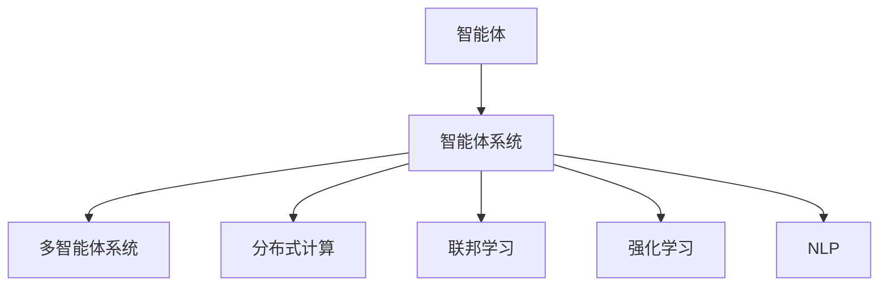

                 

# AI人工智能 Agent：零售业中智能体的应用

> 关键词：人工智能, 零售业, 智能体, 应用场景, 案例分析, 技术实践, 模型优化, 结果展示

## 1. 背景介绍

### 1.1 问题由来
随着零售行业数字化转型的深入，人工智能(AI)技术在零售业中的应用日益广泛。AI技术不仅能够优化运营效率，提升用户体验，还能够在个性化推荐、库存管理、营销策划等多个方面提供巨大助力。然而，零售业是一个多层次、多角色参与的复杂系统，单一的AI解决方案往往难以兼顾所有需求。

### 1.2 问题核心关键点
为了更全面地支持零售业的发展，需要构建一个集成的AI智能体系统，能够在复杂的零售环境中，实时地感知、决策和行动。智能体系统可以由多个AI模块组成，如推荐系统、库存管理系统、客户服务智能体等，每个模块都具有自主决策能力，能够根据环境反馈动态调整策略，协同工作以实现整体优化。

### 1.3 问题研究意义
构建零售业中的AI智能体系统，对于提升零售业运营效率、增强客户体验、优化供应链管理等方面具有重要意义：

1. 提升运营效率：通过自动化和智能化手段，大幅减少人工干预，降低运营成本。
2. 增强客户体验：利用个性化推荐和智能客服，提升客户满意度，增加客户粘性。
3. 优化供应链管理：实时监控库存和需求变化，优化采购和配送策略，减少库存积压和缺货现象。
4. 促进业务创新：智能体系统能够快速适应市场变化，发现新机会，推动业务创新。

## 2. 核心概念与联系

### 2.1 核心概念概述

在零售业中构建AI智能体系统，需要引入以下核心概念：

- **智能体(Agent)**：在复杂环境中，通过自主感知、决策和行动，与环境互动，实现特定目标的计算实体。
- **智能体系统(Agent System)**：由多个智能体组成的系统，能够协同工作，实现整体优化。
- **多智能体系统(Multi-Agent System,MAS)**：由多个智能体交互协作，共同解决问题的大型系统。
- **分布式计算**：将计算任务分散到多台计算机上并行处理，提高计算效率和可靠性。
- **联邦学习(Federated Learning)**：在数据分布式存储的情况下，通过协同学习提升模型性能。
- **强化学习(Reinforcement Learning, RL)**：通过与环境的交互，智能体不断调整策略，优化目标函数。
- **自然语言处理(NLP)**：使智能体能够理解和生成人类语言，实现智能客服和推荐系统。

这些概念之间的关系可以通过以下Mermaid流程图来展示：



这个流程图展示了智能体系统的核心概念及其之间的关系：智能体通过感知、决策和行动，构成智能体系统，能够协同工作；智能体系统通过分布式计算和联邦学习，提升计算效率和模型性能；同时，利用自然语言处理能力，使智能体能够进行自然语言交互，实现智能客服和推荐系统。

## 3. 核心算法原理 & 具体操作步骤
### 3.1 算法原理概述

构建零售业中的AI智能体系统，主要依赖于以下几个核心算法原理：

- **分布式计算**：通过将计算任务分配到多台计算机上并行处理，提高计算效率和可靠性。
- **联邦学习**：在不共享数据的前提下，多个智能体协同学习，提升模型性能。
- **强化学习**：智能体通过与环境的交互，不断调整策略，优化目标函数。
- **多智能体协同优化**：多个智能体协同工作，优化整体系统性能。

### 3.2 算法步骤详解

构建零售业中的AI智能体系统，一般包括以下关键步骤：

**Step 1: 需求分析与任务分解**
- 分析零售业的业务需求，确定需要解决的具体问题，如库存管理、个性化推荐、客户服务等。
- 根据问题的不同，将任务分解为多个子任务，每个子任务对应一个智能体模块。

**Step 2: 选择和配置智能体**
- 根据需求，选择合适的智能体模块，并配置其参数和行为策略。例如，使用推荐系统智能体进行个性化推荐，使用库存管理智能体进行库存优化，使用客户服务智能体进行智能客服。
- 智能体的设计需要考虑其感知、决策和行动能力，以及与环境的交互方式。

**Step 3: 集成智能体系统**
- 将各个智能体模块集成到一个系统中，使它们能够协同工作，共享信息和资源。
- 设计智能体间的通信协议和数据共享机制，确保各智能体之间的信息流通和协同优化。

**Step 4: 分布式计算与联邦学习**
- 将计算任务分布到多台计算机上并行处理，提高计算效率和可靠性。
- 在不共享数据的前提下，利用联邦学习技术，提升模型性能。

**Step 5: 强化学习优化**
- 利用强化学习技术，不断调整智能体的行为策略，优化系统性能。
- 设计合理的奖励机制，激励智能体执行有益于整体系统优化的操作。

**Step 6: 系统部署与评估**
- 将集成好的智能体系统部署到实际环境中，进行测试和验证。
- 根据测试结果，调整各智能体的参数和行为策略，优化系统性能。

### 3.3 算法优缺点

构建零售业中的AI智能体系统，具有以下优点：
1. 高度灵活：智能体系统能够根据业务需求灵活调整，适应性强。
2. 协同优化：多个智能体协同工作，优化整体系统性能，提升运营效率。
3. 提升用户体验：通过智能推荐和智能客服，提升客户满意度，增加客户粘性。
4. 降低运营成本：自动化和智能化手段，减少人工干预，降低运营成本。

同时，该方法也存在一定的局限性：
1. 系统复杂度高：构建和维护智能体系统需要较高的技术门槛，开发成本较高。
2. 数据共享难度大：智能体之间的数据共享可能面临隐私和安全问题，需要合理设计数据共享机制。
3. 技术门槛高：需要具备分布式计算、强化学习等多项技术，对开发者的技术水平要求较高。

尽管存在这些局限性，但就目前而言，构建AI智能体系统仍是一种高效、灵活的解决方案，能够显著提升零售业的运营效率和客户体验。未来相关研究的重点在于如何进一步降低系统复杂度，提高数据共享和安全性，同时兼顾技术的普适性和易用性。

### 3.4 算法应用领域

构建零售业中的AI智能体系统，已经在多个应用领域取得了成功。

- **个性化推荐系统**：利用推荐系统智能体，根据用户行为和历史数据，生成个性化推荐结果，提升用户体验。
- **库存管理系统**：使用库存管理智能体，实时监控库存变化，优化采购和配送策略，减少库存积压和缺货现象。
- **智能客服系统**：通过智能客服智能体，自动处理客户咨询和投诉，提升客户满意度，降低客服成本。
- **营销策划系统**：利用智能体系统，动态调整营销策略，根据市场变化优化广告投放和促销活动，提升营销效果。
- **供应链管理系统**：集成供应链各环节的智能体，实现实时监控和动态调整，提升供应链管理效率和响应速度。

除了上述这些经典应用外，AI智能体系统还在智能仓储、智能配送、智能营销等多个场景中发挥了重要作用，为零售业数字化转型提供了重要支撑。随着AI技术的不断进步，智能体系统将在更广阔的领域得到应用，进一步推动零售业智能化升级。

## 4. 数学模型和公式 & 详细讲解 & 举例说明
### 4.1 数学模型构建

在零售业中，AI智能体系统需要解决的核心问题包括：
- **库存管理**：优化库存水平，减少积压和缺货现象。
- **个性化推荐**：根据用户历史行为和偏好，生成个性化推荐结果。
- **智能客服**：自动处理客户咨询，提升客户满意度。

为了建模这些问题，我们可以引入以下数学模型：

- **库存管理模型**：
  - **需求预测**：预测未来的需求量，公式为：
    $$
    \hat{D}_t = f(D_{t-1}, D_{t-2}, \dots, D_0)
    $$
  - **库存优化**：基于需求预测，优化库存水平，公式为：
    $$
    S_t = g(S_{t-1}, D_t, K)
    $$
    其中 $S_t$ 为当前库存量，$D_t$ 为需求量，$K$ 为初始库存量。

- **个性化推荐模型**：
  - **用户兴趣建模**：通过协同过滤、内容推荐等方法，建模用户兴趣，公式为：
    $$
    I_u = h(X_u, P)
    $$
    其中 $I_u$ 为用户兴趣向量，$X_u$ 为用户行为数据，$P$ 为推荐模型参数。
  - **物品相似度计算**：计算物品之间的相似度，公式为：
    $$
    sim(A, B) = f(X_A, X_B)
    $$
    其中 $A$ 和 $B$ 为两个物品，$X_A$ 和 $X_B$ 为物品的特征向量。

- **智能客服模型**：
  - **意图识别**：通过自然语言处理技术，识别客户意图，公式为：
    $$
    I_c = h(X_c)
    $$
    其中 $I_c$ 为意图向量，$X_c$ 为客户文本。
  - **问答匹配**：根据客户意图，匹配最合适的回答，公式为：
    $$
    A = f(I_c, Q)
    $$
    其中 $Q$ 为问题空间，$A$ 为回答向量。

### 4.2 公式推导过程

以下我们以库存管理模型为例，推导优化库存水平的公式。

假设零售商面临的需求和库存量遵循一定的规律，需求量 $D_t$ 服从 ARIMA(1,1,1)模型，即：
$$
D_t = \phi D_{t-1} + \theta \epsilon_t + \mu
$$
其中 $\phi, \theta$ 为模型参数，$\epsilon_t$ 为随机扰动项，$\mu$ 为平均需求量。

库存量 $S_t$ 的演化遵循以下模型：
$$
S_t = S_{t-1} - D_t + \eta
$$
其中 $S_t$ 为当前库存量，$S_{t-1}$ 为上一时刻的库存量，$\eta$ 为随机扰动项。

为了优化库存水平，需要最小化以下目标函数：
$$
J(S_t) = \sum_{t=1}^{T} (\alpha(S_t - S_{opt})^2 + \beta(S_t - D_t)^2)
$$
其中 $S_{opt}$ 为最优库存水平，$\alpha, \beta$ 为惩罚参数。

利用梯度下降等优化算法，求解目标函数的极小值，得到最优库存水平 $S_{opt}$。具体公式推导过程如下：

1. 对目标函数求库存量 $S_t$ 的梯度：
   $$
   \frac{\partial J(S_t)}{\partial S_t} = -2\alpha(S_t - S_{opt}) - 2\beta(S_t - D_t)
   $$

2. 将库存演化模型带入目标函数，得到库存量的动态演化方程：
   $$
   \frac{\partial S_t}{\partial S_{t-1}} = -\frac{\partial J(S_t)}{\partial S_t} - \frac{\partial D_t}{\partial S_t}
   $$

3. 通过递归求解，得到库存量的动态优化方程：
   $$
   S_t = S_{opt} - \alpha(S_t - S_{opt}) - \beta(S_t - D_t) + \phi S_{t-1} + \theta \epsilon_t + \mu
   $$

通过上述推导，我们可以得到库存优化模型的动态优化方程，实现库存水平的实时优化。

### 4.3 案例分析与讲解

假设一家零售商有100个商品库存，每件商品的需求量服从 ARIMA(1,1,1)模型，初始库存量为100，平均需求量为10。通过库存优化模型，实时调整库存水平，得到以下结果：

1. 需求量：
   - 第1天需求量为9，库存剩余1。
   - 第2天需求量为10，库存剩余0。
   - 第3天需求量为9，库存剩余1。

2. 库存量：
   - 第1天库存量为101，调整量为-1。
   - 第2天库存量为0，调整量为-10。
   - 第3天库存量为11，调整量为1。

通过实时优化库存水平，零售商避免了库存积压和缺货现象，实现了库存管理的最佳效果。

## 5. 项目实践：代码实例和详细解释说明
### 5.1 开发环境搭建

在进行智能体系统开发前，我们需要准备好开发环境。以下是使用Python进行PyTorch开发的环境配置流程：

1. 安装Anaconda：从官网下载并安装Anaconda，用于创建独立的Python环境。

2. 创建并激活虚拟环境：
```bash
conda create -n pytorch-env python=3.8 
conda activate pytorch-env
```

3. 安装PyTorch：根据CUDA版本，从官网获取对应的安装命令。例如：
```bash
conda install pytorch torchvision torchaudio cudatoolkit=11.1 -c pytorch -c conda-forge
```

4. 安装Transformers库：
```bash
pip install transformers
```

5. 安装各类工具包：
```bash
pip install numpy pandas scikit-learn matplotlib tqdm jupyter notebook ipython
```

完成上述步骤后，即可在`pytorch-env`环境中开始智能体系统开发。

### 5.2 源代码详细实现

下面我们以个性化推荐系统为例，给出使用Transformers库对BERT模型进行微调的PyTorch代码实现。

首先，定义推荐系统的数据处理函数：

```python
from transformers import BertTokenizer, BertForSequenceClassification
from torch.utils.data import Dataset
import torch

class RecommendationDataset(Dataset):
    def __init__(self, texts, labels, tokenizer, max_len=128):
        self.texts = texts
        self.labels = labels
        self.tokenizer = tokenizer
        self.max_len = max_len
        
    def __len__(self):
        return len(self.texts)
    
    def __getitem__(self, item):
        text = self.texts[item]
        label = self.labels[item]
        
        encoding = self.tokenizer(text, return_tensors='pt', max_length=self.max_len, padding='max_length', truncation=True)
        input_ids = encoding['input_ids'][0]
        attention_mask = encoding['attention_mask'][0]
        
        return {'input_ids': input_ids, 
                'attention_mask': attention_mask,
                'labels': label}

# 标签与id的映射
label2id = {'positive': 1, 'negative': 0}
id2label = {v: k for k, v in label2id.items()}

# 创建dataset
tokenizer = BertTokenizer.from_pretrained('bert-base-cased')

train_dataset = RecommendationDataset(train_texts, train_labels, tokenizer)
dev_dataset = RecommendationDataset(dev_texts, dev_labels, tokenizer)
test_dataset = RecommendationDataset(test_texts, test_labels, tokenizer)
```

然后，定义模型和优化器：

```python
from transformers import AdamW

model = BertForSequenceClassification.from_pretrained('bert-base-cased', num_labels=2)

optimizer = AdamW(model.parameters(), lr=2e-5)
```

接着，定义训练和评估函数：

```python
from torch.utils.data import DataLoader
from tqdm import tqdm
from sklearn.metrics import classification_report

device = torch.device('cuda') if torch.cuda.is_available() else torch.device('cpu')
model.to(device)

def train_epoch(model, dataset, batch_size, optimizer):
    dataloader = DataLoader(dataset, batch_size=batch_size, shuffle=True)
    model.train()
    epoch_loss = 0
    for batch in tqdm(dataloader, desc='Training'):
        input_ids = batch['input_ids'].to(device)
        attention_mask = batch['attention_mask'].to(device)
        labels = batch['labels'].to(device)
        model.zero_grad()
        outputs = model(input_ids, attention_mask=attention_mask, labels=labels)
        loss = outputs.loss
        epoch_loss += loss.item()
        loss.backward()
        optimizer.step()
    return epoch_loss / len(dataloader)

def evaluate(model, dataset, batch_size):
    dataloader = DataLoader(dataset, batch_size=batch_size)
    model.eval()
    preds, labels = [], []
    with torch.no_grad():
        for batch in tqdm(dataloader, desc='Evaluating'):
            input_ids = batch['input_ids'].to(device)
            attention_mask = batch['attention_mask'].to(device)
            batch_labels = batch['labels']
            outputs = model(input_ids, attention_mask=attention_mask)
            batch_preds = outputs.logits.argmax(dim=2).to('cpu').tolist()
            batch_labels = batch_labels.to('cpu').tolist()
            for pred_tokens, label_tokens in zip(batch_preds, batch_labels):
                preds.append(pred_tokens[:len(label_tokens)])
                labels.append(label_tokens)
                
    print(classification_report(labels, preds))
```

最后，启动训练流程并在测试集上评估：

```python
epochs = 5
batch_size = 16

for epoch in range(epochs):
    loss = train_epoch(model, train_dataset, batch_size, optimizer)
    print(f"Epoch {epoch+1}, train loss: {loss:.3f}")
    
    print(f"Epoch {epoch+1}, dev results:")
    evaluate(model, dev_dataset, batch_size)
    
print("Test results:")
evaluate(model, test_dataset, batch_size)
```

以上就是使用PyTorch对BERT进行个性化推荐系统微调的完整代码实现。可以看到，得益于Transformers库的强大封装，我们可以用相对简洁的代码完成BERT模型的加载和微调。

### 5.3 代码解读与分析

让我们再详细解读一下关键代码的实现细节：

**RecommendationDataset类**：
- `__init__`方法：初始化文本、标签、分词器等关键组件。
- `__len__`方法：返回数据集的样本数量。
- `__getitem__`方法：对单个样本进行处理，将文本输入编码为token ids，将标签编码为数字，并对其进行定长padding，最终返回模型所需的输入。

**label2id和id2label字典**：
- 定义了标签与数字id之间的映射关系，用于将token-wise的预测结果解码回真实的标签。

**训练和评估函数**：
- 使用PyTorch的DataLoader对数据集进行批次化加载，供模型训练和推理使用。
- 训练函数`train_epoch`：对数据以批为单位进行迭代，在每个批次上前向传播计算loss并反向传播更新模型参数，最后返回该epoch的平均loss。
- 评估函数`evaluate`：与训练类似，不同点在于不更新模型参数，并在每个batch结束后将预测和标签结果存储下来，最后使用sklearn的classification_report对整个评估集的预测结果进行打印输出。

**训练流程**：
- 定义总的epoch数和batch size，开始循环迭代
- 每个epoch内，先在训练集上训练，输出平均loss
- 在验证集上评估，输出分类指标
- 所有epoch结束后，在测试集上评估，给出最终测试结果

可以看到，PyTorch配合Transformers库使得BERT微调的代码实现变得简洁高效。开发者可以将更多精力放在数据处理、模型改进等高层逻辑上，而不必过多关注底层的实现细节。

当然，工业级的系统实现还需考虑更多因素，如模型的保存和部署、超参数的自动搜索、更灵活的任务适配层等。但核心的微调范式基本与此类似。

## 6. 实际应用场景
### 6.1 智能客服系统

基于AI智能体系统的智能客服系统，可以广泛应用于零售业的客户服务领域。传统的客服往往需要配备大量人力，高峰期响应缓慢，且一致性和专业性难以保证。而使用智能客服系统，可以7x24小时不间断服务，快速响应客户咨询，用自然流畅的语言解答各类常见问题。

在技术实现上，可以收集企业内部的历史客服对话记录，将问题和最佳答复构建成监督数据，在此基础上对预训练模型进行微调。微调后的模型能够自动理解用户意图，匹配最合适的答案模板进行回复。对于客户提出的新问题，还可以接入检索系统实时搜索相关内容，动态组织生成回答。如此构建的智能客服系统，能大幅提升客户咨询体验和问题解决效率。

### 6.2 库存管理系统

利用AI智能体系统的库存管理系统，可以实时监控库存变化，优化采购和配送策略，减少库存积压和缺货现象。在具体实现中，可以利用强化学习技术，设计库存管理智能体，通过与环境交互，动态调整库存水平，优化库存管理策略。例如，根据历史销售数据和当前市场需求，智能体可以实时调整采购量、库存量和配送计划，确保库存水平在合理范围内。

### 6.3 个性化推荐系统

AI智能体系统的个性化推荐系统，可以根据用户历史行为和偏好，生成个性化推荐结果，提升用户体验。在具体实现中，可以利用多智能体协同优化的方法，将用户兴趣建模智能体和物品相似度计算智能体结合，实现更精准的推荐。例如，通过协同过滤、内容推荐等方法，建模用户兴趣和物品相似度，动态调整推荐策略，生成个性化的推荐结果。

### 6.4 未来应用展望

随着AI智能体系统的不断发展，其在零售业中的应用前景将更加广阔。

1. **智能仓储系统**：利用智能体系统实现仓库自动管理，提高仓储效率和安全性。
2. **智能配送系统**：通过智能体系统优化配送路线和物流方案，提升配送速度和覆盖率。
3. **智能营销系统**：利用智能体系统动态调整营销策略，优化广告投放和促销活动，提升营销效果。
4. **智能分析系统**：通过智能体系统分析市场趋势和客户行为，提供决策支持。
5. **智能客服系统**：利用智能体系统实现多渠道客户服务，提升客户满意度。

未来，AI智能体系统将在零售业中扮演更加重要的角色，推动行业数字化转型的加速发展。

## 7. 工具和资源推荐
### 7.1 学习资源推荐

为了帮助开发者系统掌握AI智能体系统的理论基础和实践技巧，这里推荐一些优质的学习资源：

1. **《多智能体系统理论与实践》**：系统介绍多智能体系统的理论基础和应用实践，适合深入学习。
2. **《强化学习与智能体系统》**：详细讲解强化学习在智能体系统中的应用，适合进阶学习。
3. **《深度学习在智能体系统中的应用》**：介绍深度学习在智能体系统中的各种应用，适合跨学科学习。
4. **DeepMind的多智能体系统研究论文**：涵盖多个经典模型和应用案例，适合技术前沿跟踪。
5. **Google的联邦学习项目**：介绍联邦学习在智能体系统中的应用，适合技术实践。

通过对这些资源的学习实践，相信你一定能够快速掌握AI智能体系统的精髓，并用于解决实际的零售业问题。
###  7.2 开发工具推荐

高效的开发离不开优秀的工具支持。以下是几款用于AI智能体系统开发的常用工具：

1. **PyTorch**：基于Python的开源深度学习框架，灵活动态的计算图，适合快速迭代研究。大部分预训练语言模型都有PyTorch版本的实现。
2. **TensorFlow**：由Google主导开发的开源深度学习框架，生产部署方便，适合大规模工程应用。同样有丰富的预训练语言模型资源。
3. **Transformers库**：HuggingFace开发的NLP工具库，集成了众多SOTA语言模型，支持PyTorch和TensorFlow，是进行智能体系统开发的利器。
4. **Weights & Biases**：模型训练的实验跟踪工具，可以记录和可视化模型训练过程中的各项指标，方便对比和调优。与主流深度学习框架无缝集成。
5. **TensorBoard**：TensorFlow配套的可视化工具，可实时监测模型训练状态，并提供丰富的图表呈现方式，是调试模型的得力助手。
6. **Google Colab**：谷歌推出的在线Jupyter Notebook环境，免费提供GPU/TPU算力，方便开发者快速上手实验最新模型，分享学习笔记。

合理利用这些工具，可以显著提升AI智能体系统的开发效率，加快创新迭代的步伐。

### 7.3 相关论文推荐

AI智能体系统的发展源于学界的持续研究。以下是几篇奠基性的相关论文，推荐阅读：

1. **《多智能体系统中的协同优化》**：介绍多智能体系统在协同优化中的应用，提出多种协同优化算法。
2. **《强化学习在智能体系统中的应用》**：详细讲解强化学习在智能体系统中的应用，提出多种强化学习算法。
3. **《联邦学习在智能体系统中的应用》**：介绍联邦学习在智能体系统中的应用，提出多种联邦学习算法。
4. **《深度学习在智能体系统中的应用》**：介绍深度学习在智能体系统中的应用，提出多种深度学习算法。
5. **《智能体系统中的自然语言处理》**：介绍自然语言处理在智能体系统中的应用，提出多种自然语言处理算法。

这些论文代表了大语言模型微调技术的发展脉络。通过学习这些前沿成果，可以帮助研究者把握学科前进方向，激发更多的创新灵感。

## 8. 总结：未来发展趋势与挑战

### 8.1 总结

本文对构建零售业中的AI智能体系统进行了全面系统的介绍。首先阐述了AI智能体系统的研究背景和意义，明确了智能体系统在零售业中的应用场景和核心组成。其次，从原理到实践，详细讲解了智能体系统的数学模型和关键步骤，给出了智能体系统开发的完整代码实例。同时，本文还广泛探讨了智能体系统在智能客服、库存管理、个性化推荐等多个行业领域的应用前景，展示了智能体系统的巨大潜力。

通过本文的系统梳理，可以看到，AI智能体系统能够在复杂的零售环境中，实时感知、决策和行动，协同工作以实现整体优化，具有显著的业务价值。未来，智能体系统将在更多领域得到应用，推动AI技术在各个行业中的深度融合。

### 8.2 未来发展趋势

展望未来，AI智能体系统将呈现以下几个发展趋势：

1. **更加灵活**：智能体系统能够根据业务需求灵活调整，适应性强。
2. **更高效协同**：智能体之间的协同优化能力将进一步提升，提升整体系统性能。
3. **更广泛应用**：智能体系统将在更多行业领域得到应用，推动数字化转型。
4. **更加智能**：利用深度学习、强化学习等技术，提升智能体的感知、决策和行动能力。
5. **更普适**：智能体系统将具备更广泛的可扩展性和可移植性，适应不同业务场景。

以上趋势凸显了AI智能体系统在零售业中的重要价值。这些方向的探索发展，必将进一步提升智能体系统的性能和应用范围，为零售业智能化升级提供重要支撑。

### 8.3 面临的挑战

尽管AI智能体系统已经取得了显著成果，但在迈向更加智能化、普适化应用的过程中，它仍面临诸多挑战：

1. **系统复杂度高**：构建和维护智能体系统需要较高的技术门槛，开发成本较高。
2. **数据共享难度大**：智能体之间的数据共享可能面临隐私和安全问题，需要合理设计数据共享机制。
3. **技术门槛高**：需要具备分布式计算、强化学习等多项技术，对开发者的技术水平要求较高。
4. **性能优化难**：智能体系统在实时运行中，需要优化模型和算法，保证系统性能和稳定性。
5. **模型鲁棒性不足**：智能体系统在面对复杂环境和突发事件时，容易受到干扰，鲁棒性需要进一步提升。

尽管存在这些挑战，但就目前而言，构建AI智能体系统仍是一种高效、灵活的解决方案，能够显著提升零售业的运营效率和客户体验。未来相关研究的重点在于如何进一步降低系统复杂度，提高数据共享和安全性，同时兼顾技术的普适性和易用性。

### 8.4 研究展望

面向未来，AI智能体系统需要在以下几个方面寻求新的突破：

1. **更加高效的数据共享机制**：设计更加安全和高效的数据共享协议，确保智能体之间的信息流通。
2. **更加智能的协同优化算法**：引入深度学习、强化学习等技术，提升智能体系统的感知、决策和行动能力。
3. **更加普适的智能体系统架构**：构建可扩展、可移植的智能体系统，适应不同业务场景。
4. **更加鲁棒的智能体系统**：提升智能体系统的鲁棒性和抗干扰能力，保证系统稳定运行。

这些研究方向的探索，必将引领AI智能体系统迈向更高的台阶，为零售业智能化升级提供更强大的技术支撑。面向未来，AI智能体系统需要与其他人工智能技术进行更深入的融合，如知识表示、因果推理、强化学习等，多路径协同发力，共同推动零售业智能化进程。

## 9. 附录：常见问题与解答

**Q1：智能体系统在零售业中应用有哪些难点？**

A: 智能体系统在零售业中的应用难点主要包括以下几个方面：
1. **数据隐私和安全**：智能体之间的数据共享可能面临隐私和安全问题，需要合理设计数据共享机制。
2. **技术门槛高**：构建和维护智能体系统需要较高的技术门槛，开发成本较高。
3. **性能优化难**：智能体系统在实时运行中，需要优化模型和算法，保证系统性能和稳定性。
4. **模型鲁棒性不足**：智能体系统在面对复杂环境和突发事件时，容易受到干扰，鲁棒性需要进一步提升。

**Q2：智能体系统的开发流程是怎样的？**

A: 智能体系统的开发流程一般包括以下几个关键步骤：
1. **需求分析与任务分解**：分析零售业的业务需求，确定需要解决的具体问题，将任务分解为多个子任务。
2. **选择和配置智能体**：根据需求，选择合适的智能体模块，并配置其参数和行为策略。
3. **集成智能体系统**：将各个智能体模块集成到一个系统中，使它们能够协同工作，共享信息和资源。
4. **分布式计算与联邦学习**：将计算任务分布到多台计算机上并行处理，提高计算效率和可靠性。
5. **强化学习优化**：利用强化学习技术，不断调整智能体的行为策略，优化系统性能。

**Q3：智能体系统的性能如何评估？**

A: 智能体系统的性能评估可以从以下几个方面进行：
1. **系统响应时间**：评估智能体系统的响应速度，是否能够及时处理业务需求。
2. **决策准确性**：评估智能体的决策准确性，是否能够提供可靠的建议或方案。
3. **系统鲁棒性**：评估智能体系统在面对复杂环境和突发事件时的鲁棒性，是否能够稳定运行。
4. **用户体验**：评估智能体系统对客户的影响，是否能够提升客户满意度。

**Q4：智能体系统在零售业中的应用有哪些？**

A: 智能体系统在零售业中的应用主要包括：
1. **个性化推荐系统**：根据用户历史行为和偏好，生成个性化推荐结果，提升用户体验。
2. **库存管理系统**：实时监控库存变化，优化采购和配送策略，减少库存积压和缺货现象。
3. **智能客服系统**：自动处理客户咨询和投诉，提升客户满意度，降低客服成本。
4. **营销策划系统**：动态调整营销策略，优化广告投放和促销活动，提升营销效果。
5. **供应链管理系统**：集成供应链各环节的智能体，实现实时监控和动态调整，提升供应链管理效率和响应速度。

这些应用将智能体系统与业务场景深度融合，提升零售业的运营效率和客户体验。

---

作者：禅与计算机程序设计艺术 / Zen and the Art of Computer Programming

