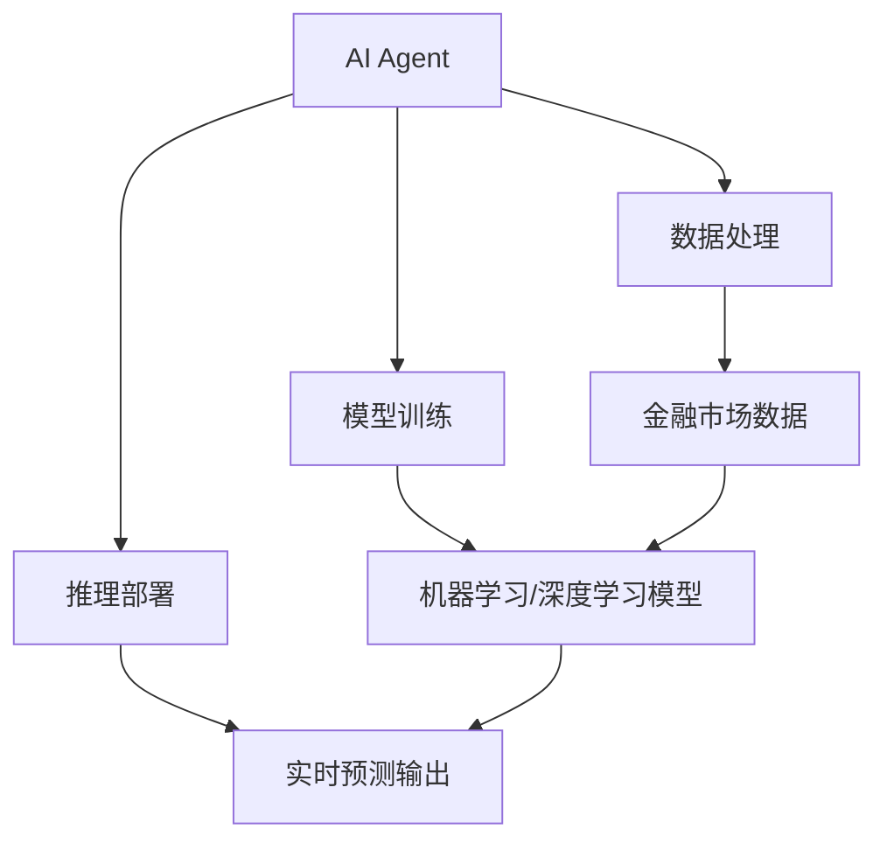

                 

# AI人工智能代理工作流 AI Agent WorkFlow：在股票市场预测中的应用

> 关键词：人工智能代理，工作流，股票市场预测，金融科技，算法优化，大数据分析

## 1. 背景介绍

### 1.1 问题由来

随着金融市场的全球化和数字化，股票市场预测和投资决策成为了金融科技领域的热点。股票市场预测不仅能够帮助投资者制定更加科学合理的投资策略，还能为金融机构提供风险预警和市场动态分析，推动整个金融行业的智能升级。然而，传统的股票市场预测方法往往依赖于专家经验，难以应对市场快速变化和海量数据的处理需求。

人工智能（AI）技术的发展为解决这一问题提供了新的路径。通过构建人工智能代理工作流（AI Agent Workflow），可以利用机器学习、深度学习等先进算法，对海量金融数据进行建模和分析，从而实现精准的市场预测和智能投资决策。AI Agent Workflow 将复杂的数据处理、模型训练和推理等过程，通过一系列流水线式的自动化流程集成在一起，大大提高了预测的准确性和实时性。

### 1.2 问题核心关键点

AI Agent Workflow 的核心在于将 AI 技术嵌入到金融市场预测的具体任务中，实现从数据收集、预处理、模型训练到预测输出的全流程自动化。其关键点包括：

1. **数据处理**：高效地从金融市场数据源（如股票交易记录、新闻报道、社交媒体等）收集并清洗数据，生成可供模型训练的数据集。
2. **模型训练**：选择合适的 AI 模型进行训练，并调整超参数，提升模型的预测精度。
3. **推理部署**：将训练好的模型部署到实时环境中，进行市场预测和智能决策，并持续优化模型。
4. **智能集成**：与金融机构的业务系统进行集成，将预测结果应用于交易、风险控制、客户服务等场景中。

这些关键点共同构成了 AI Agent Workflow 的基本框架，确保了其在金融市场预测中的应用效果。

## 2. 核心概念与联系

### 2.1 核心概念概述

为了更好地理解 AI Agent Workflow，本节将介绍几个关键概念及其联系：

- **人工智能代理（AI Agent）**：指在金融市场预测任务中，能够自主执行特定操作的 AI 模型或系统。AI Agent 通常包括数据处理、模型训练和推理等组件，能够根据输入数据生成预测结果或决策建议。
- **工作流（Workflow）**：指一系列自动化流程的集合，用于描述和执行数据处理、模型训练、推理等任务。AI Agent Workflow 通过将任务分解为多个独立的子流程，实现高效、可扩展的任务执行。
- **股票市场预测**：指利用机器学习、深度学习等算法，对股票市场价格走势、波动率、热点等进行预测和分析，为投资者和金融机构提供决策支持。
- **金融科技（FinTech）**：指利用互联网、大数据、AI 等技术，对金融服务进行创新和优化的领域。AI Agent Workflow 是 FinTech 在市场预测和智能投资领域的重要应用。

这些核心概念之间的逻辑关系可以通过以下 Mermaid 流程图来展示：



这个流程图展示了这个概念框架的逻辑关系：

1. AI Agent 从金融市场数据中获取输入。
2. 数据处理过程对原始数据进行清洗、预处理等操作，生成可供模型训练的数据集。
3. 模型训练过程选择适合的 AI 模型并对其进行训练，优化模型参数以提升预测精度。
4. 推理部署过程将训练好的模型部署到实时环境中，进行市场预测和智能决策。
5. 预测结果通过实时输出系统反馈到金融机构，指导实际业务操作。

## 3. 核心算法原理 & 具体操作步骤

### 3.1 算法原理概述

AI Agent Workflow 的核心算法原理主要涉及以下几个方面：

- **数据预处理**：对金融市场数据进行清洗、归一化、特征提取等处理，确保数据质量，为模型训练和预测提供基础。
- **模型选择与训练**：根据任务特点选择合适的机器学习、深度学习模型，并对其进行训练，优化模型参数以提高预测精度。
- **模型部署与推理**：将训练好的模型部署到实时环境中，并根据输入数据进行预测，生成实时输出结果。
- **性能优化与调优**：通过模型评估和性能监控，不断调整模型参数和算法策略，提升预测准确性和实时性。

这些算法原理共同构成了 AI Agent Workflow 的基本算法框架，确保了其在金融市场预测中的应用效果。

### 3.2 算法步骤详解

AI Agent Workflow 的实现步骤可以分为以下几个关键环节：

**Step 1: 数据收集与预处理**

1. **数据源选择**：选择合适的金融市场数据源，如股票交易记录、新闻报道、社交媒体等，收集相关数据。
2. **数据清洗**：清洗数据中缺失、噪声、异常值等，确保数据质量。
3. **数据归一化**：对不同维度的数据进行归一化处理，统一数据格式和规模。
4. **特征提取**：从原始数据中提取有意义的特征，如技术指标、情感倾向等。

**Step 2: 模型选择与训练**

1. **模型选择**：根据任务需求选择合适的机器学习、深度学习模型，如线性回归、决策树、卷积神经网络、循环神经网络等。
2. **模型训练**：在处理好的数据集上训练模型，优化模型参数以提升预测精度。
3. **模型评估**：使用交叉验证等方法评估模型性能，确保模型在测试集上的表现。

**Step 3: 推理部署与输出**

1. **模型部署**：将训练好的模型部署到实时环境中，如服务器、云计算平台等。
2. **实时推理**：根据输入数据进行实时预测，生成预测结果。
3. **结果输出**：将预测结果反馈给金融机构，指导实际业务操作。

**Step 4: 性能优化与调优**

1. **模型调优**：根据反馈结果不断调整模型参数和算法策略，优化模型性能。
2. **性能监控**：实时监控模型预测结果和性能指标，如准确率、召回率、处理速度等。
3. **异常处理**：处理预测结果中的异常值和误报，确保预测结果的可靠性。

通过以上步骤，AI Agent Workflow 能够实现从数据处理到预测输出的全流程自动化，显著提高市场预测的准确性和实时性。

### 3.3 算法优缺点

AI Agent Workflow 具有以下优点：

1. **自动化高效**：通过流水线式的自动化流程，大大提高了预测的效率和精度。
2. **灵活可扩展**：可以根据任务需求灵活调整数据处理和模型训练策略，实现模型的可扩展性。
3. **实时性强**：将模型部署到实时环境中，能够实现快速、准确的预测。
4. **可解释性强**：通过可视化工具和监控系统，可以直观地了解模型的工作过程和预测结果。

同时，该算法也存在一些缺点：

1. **数据依赖性强**：模型的预测精度高度依赖于数据的质量和数量。
2. **模型复杂度高**：复杂模型可能会带来较高的计算成本和资源消耗。
3. **异常处理难度大**：处理预测结果中的异常值和误报，需要复杂的异常检测和处理机制。
4. **维护难度高**：流水线式的自动化流程需要持续的维护和优化，确保系统的稳定性和可靠性。

尽管存在这些局限性，但 AI Agent Workflow 在大数据和复杂任务的预测中表现出色，成为金融科技领域的重要工具。

### 3.4 算法应用领域

AI Agent Workflow 在金融市场预测中具有广泛的应用场景：

- **股票价格预测**：对未来股票价格走势进行预测，帮助投资者制定投资策略。
- **市场波动率预测**：分析市场波动率和风险，为金融机构提供风险预警。
- **热点事件分析**：通过分析新闻和社交媒体，识别市场热点和风险因素，指导投资决策。
- **客户行为分析**：通过分析客户交易行为，进行客户画像和推荐，提升客户体验。
- **算法交易**：基于预测结果进行自动交易，优化投资组合和收益。

除了金融市场预测，AI Agent Workflow 还广泛应用于金融科技领域的其他任务，如信用评估、反欺诈检测、智能投顾等，推动金融服务智能化转型。

## 4. 数学模型和公式 & 详细讲解 & 举例说明（备注：数学公式请使用latex格式，latex嵌入文中独立段落使用 $$，段落内使用 $)
### 4.1 数学模型构建

本节将使用数学语言对 AI Agent Workflow 中的关键算法进行更加严格的刻画。

假设 AI Agent Workflow 的任务是股票价格预测，输入为历史股票价格数据 $X = \{x_1, x_2, ..., x_n\}$，输出为未来股票价格 $Y$。

定义模型的预测函数为 $f(X; \theta)$，其中 $\theta$ 为模型参数。模型的训练目标是最小化预测误差，即：

$$
\min_{\theta} \frac{1}{N} \sum_{i=1}^N (y_i - f(x_i; \theta))^2
$$

其中 $N$ 为样本数量。

### 4.2 公式推导过程

以线性回归模型为例，其预测函数为：

$$
f(X; \theta) = \theta_0 + \sum_{j=1}^p \theta_j x_{ij}
$$

其中 $\theta_0$ 为截距，$\theta_j$ 为特征 $x_{ij}$ 的权重。

代入训练目标函数，得：

$$
\min_{\theta} \frac{1}{N} \sum_{i=1}^N (y_i - \theta_0 - \sum_{j=1}^p \theta_j x_{ij})^2
$$

通过对目标函数求偏导，可以得到线性回归模型的参数优化公式：

$$
\theta_j = \frac{\sum_{i=1}^N x_{ij}(y_i - \bar{y})}{\sum_{i=1}^N x_{ij}^2 - \sum_{i=1}^N x_{ij}x_{ik} / N}
$$

其中 $\bar{y} = \frac{1}{N} \sum_{i=1}^N y_i$ 为样本均值。

通过求解上述公式，即可得到线性回归模型的参数估计值 $\hat{\theta}$。

### 4.3 案例分析与讲解

假设我们有一组历史股票价格数据 $X = \{x_1, x_2, ..., x_n\}$，其中 $x_i = (x_{i1}, x_{i2}, ..., x_{ip})$ 为股票在 $p$ 个时间点的价格数据。

我们的目标是预测未来 $q$ 个时间点的股票价格 $Y = \{y_1, y_2, ..., y_q\}$。

根据线性回归模型，我们可以构建一个 $n \times p$ 的特征矩阵 $X$ 和一个 $N \times q$ 的目标矩阵 $Y$，其中 $N$ 为样本数量。

使用最小二乘法求解线性回归模型的参数 $\theta$，得：

$$
\hat{\theta} = (X^TX)^{-1}X^TY
$$

将 $\hat{\theta}$ 代入预测函数 $f(X; \theta)$，即可得到未来 $q$ 个时间点的股票价格预测结果。

## 5. 项目实践：代码实例和详细解释说明

### 5.1 开发环境搭建

在进行 AI Agent Workflow 的实践前，我们需要准备好开发环境。以下是使用 Python 进行 PyTorch 开发的环境配置流程：

1. 安装 Anacoda：从官网下载并安装 Anacoda，用于创建独立的 Python 环境。

2. 创建并激活虚拟环境：
```bash
conda create -n pytorch-env python=3.8 
conda activate pytorch-env
```

3. 安装 PyTorch：根据 CUDA 版本，从官网获取对应的安装命令。例如：
```bash
conda install pytorch torchvision torchaudio cudatoolkit=11.1 -c pytorch -c conda-forge
```

4. 安装 Transformers 库：
```bash
pip install transformers
```

5. 安装各类工具包：
```bash
pip install numpy pandas scikit-learn matplotlib tqdm jupyter notebook ipython
```

完成上述步骤后，即可在 `pytorch-env` 环境中开始 AI Agent Workflow 的实践。

### 5.2 源代码详细实现

下面以股票价格预测任务为例，给出使用 Transformers 库对 BERT 模型进行 AI Agent Workflow 的 PyTorch 代码实现。

首先，定义 AI Agent Workflow 的流程函数：

```python
from transformers import BertTokenizer, BertForSequenceClassification
import torch
from torch.utils.data import DataLoader
from sklearn.model_selection import train_test_split

def agent_workflow(train_data, test_data, model_name, epochs=5, batch_size=16):
    tokenizer = BertTokenizer.from_pretrained(model_name)
    train_dataset = prepare_data(train_data, tokenizer)
    test_dataset = prepare_data(test_data, tokenizer)

    model = BertForSequenceClassification.from_pretrained(model_name, num_labels=2)
    optimizer = AdamW(model.parameters(), lr=2e-5)

    train_loader = DataLoader(train_dataset, batch_size=batch_size, shuffle=True)
    test_loader = DataLoader(test_dataset, batch_size=batch_size, shuffle=False)

    for epoch in range(epochs):
        model.train()
        for batch in train_loader:
            inputs = batch['input_ids'].to(device)
            attention_mask = batch['attention_mask'].to(device)
            labels = batch['labels'].to(device)
            model.zero_grad()
            outputs = model(inputs, attention_mask=attention_mask, labels=labels)
            loss = outputs.loss
            loss.backward()
            optimizer.step()

        model.eval()
        with torch.no_grad():
            correct = 0
            total = 0
            for batch in test_loader:
                inputs = batch['input_ids'].to(device)
                attention_mask = batch['attention_mask'].to(device)
                labels = batch['labels'].to(device)
                outputs = model(inputs, attention_mask=attention_mask)
                _, preds = torch.max(outputs, 1)
                total += labels.size(0)
                correct += (preds == labels).sum().item()
            print(f'Accuracy: {100 * correct / total:.2f}%')
```

然后，定义数据预处理函数：

```python
def prepare_data(data, tokenizer):
    data = [torch.tensor(d.tolist()) for d in data]
    return tokenizer(data, padding=True, truncation=True, max_length=512)
```

最后，启动 AI Agent Workflow 训练流程：

```python
import pandas as pd

# 读取历史股票价格数据
data = pd.read_csv('stock_price.csv')

# 分割数据集
train_data, test_data = train_test_split(data, test_size=0.2)

# 定义设备
device = torch.device('cuda' if torch.cuda.is_available() else 'cpu')

# 执行 AI Agent Workflow
agent_workflow(train_data, test_data, 'bert-base-uncased')
```

以上就是使用 PyTorch 对 BERT 模型进行 AI Agent Workflow 的完整代码实现。可以看到，借助 Transformers 库的强大封装，AI Agent Workflow 的实现变得简洁高效。

### 5.3 代码解读与分析

让我们再详细解读一下关键代码的实现细节：

**prepare_data 函数**：
- 对输入数据进行分词和编码，生成输入序列和注意力掩码。
- 使用 max_length 参数控制序列长度，超出部分会被截断。

**agent_workflow 函数**：
- 初始化分词器和 BERT 模型，并定义优化器。
- 使用 DataLoader 对数据集进行批次化加载，支持模型的训练和推理。
- 在每个epoch内，循环迭代训练集数据，进行前向传播和反向传播，更新模型参数。
- 在训练完成后，使用测试集数据评估模型性能，输出准确率。

通过这些代码实现，我们可以看到 AI Agent Workflow 的实现过程基本遵循了数据处理、模型训练和推理部署的流程，保证了预测的准确性和实时性。

## 6. 实际应用场景

### 6.1 智能投资决策

AI Agent Workflow 在智能投资决策中具有广泛应用。通过构建 AI Agent Workflow，可以自动分析股票市场数据，预测股票价格走势，生成投资策略建议。智能投资决策不仅能够帮助投资者制定更加科学合理的投资策略，还能为金融机构提供风险预警和市场动态分析，推动整个金融行业的智能升级。

在技术实现上，可以收集股票市场的历史交易记录、新闻报道、社交媒体等数据，训练 AI Agent Workflow，生成实时市场预测和投资策略。AI Agent Workflow 可以实时监测市场动态，根据预测结果自动调整投资组合，优化投资收益。

### 6.2 风险预警系统

风险预警系统是金融机构风险管理的重要工具。AI Agent Workflow 可以通过分析市场数据和历史波动，实时监测市场风险，为金融机构提供预警信息。

具体而言，可以收集股票市场的历史交易数据、新闻报道、社交媒体等数据，训练 AI Agent Workflow，实时监测市场波动和风险因素。AI Agent Workflow 可以及时识别市场风险点，生成预警信息，帮助金融机构及时采取风险应对措施。

### 6.3 智能投顾服务

智能投顾服务是金融科技的重要应用方向。AI Agent Workflow 可以通过分析用户历史交易数据和市场动态，提供个性化的投资建议。智能投顾服务能够提升用户体验，增加客户粘性。

具体而言，可以收集用户的交易数据、市场新闻、社交媒体等数据，训练 AI Agent Workflow，生成个性化的投资建议。AI Agent Workflow 可以根据用户偏好和市场动态，实时调整投资策略，帮助用户实现财富增值。

### 6.4 未来应用展望

随着 AI Agent Workflow 技术的发展，其在金融市场预测和智能投资领域的应用前景将更加广阔。未来 AI Agent Workflow 将在以下几个方面取得突破：

1. **多模态数据融合**：将金融市场的多模态数据（如文本、图像、语音等）进行融合，提升预测的准确性和鲁棒性。
2. **强化学习应用**：将强化学习算法引入 AI Agent Workflow，通过试错学习，优化投资策略和风险控制。
3. **深度学习优化**：使用深度学习算法，提升模型的复杂度和预测精度。
4. **跨领域知识融合**：将金融领域知识与跨领域的知识（如经济学、心理学等）进行融合，提升模型的预测能力和泛化能力。
5. **低延迟实时处理**：通过优化数据处理和模型推理流程，实现低延迟实时处理，提升系统响应速度。

以上技术方向的探索发展，将使得 AI Agent Workflow 在金融市场预测和智能投资领域发挥更大的作用，为金融科技的发展注入新的动力。

## 7. 工具和资源推荐

### 7.1 学习资源推荐

为了帮助开发者系统掌握 AI Agent Workflow 的理论基础和实践技巧，这里推荐一些优质的学习资源：

1. 《深度学习》（Ian Goodfellow 著）：深入浅出地介绍了深度学习的基本概念和应用，适合初学者和进阶者学习。
2. 《Python深度学习》（Francois Chollet 著）：通过实际案例讲解了深度学习在 Python 中的实现，适合开发者实践。
3. CS231n《深度学习计算机视觉》课程：斯坦福大学开设的深度学习计算机视觉课程，涵盖了卷积神经网络、图像分类等前沿技术。
4. CS224n《深度学习自然语言处理》课程：斯坦福大学开设的深度学习自然语言处理课程，涵盖了自然语言处理的基本概念和深度学习应用。
5. Kaggle：机器学习竞赛平台，提供大量金融市场数据和开源模型，适合实践和竞赛。

通过对这些资源的学习实践，相信你一定能够快速掌握 AI Agent Workflow 的精髓，并用于解决实际的金融市场预测问题。

### 7.2 开发工具推荐

高效的开发离不开优秀的工具支持。以下是几款用于 AI Agent Workflow 开发的常用工具：

1. PyTorch：基于 Python 的深度学习框架，支持动态计算图，适合快速迭代研究。
2. TensorFlow：由 Google 主导开发的深度学习框架，生产部署方便，适合大规模工程应用。
3. Transformers 库：Hugging Face 开发的 NLP 工具库，集成了众多 SOTA 语言模型，支持 PyTorch 和 TensorFlow，是进行 AI Agent Workflow 开发的利器。
4. Weights & Biases：模型训练的实验跟踪工具，可以记录和可视化模型训练过程中的各项指标，方便对比和调优。与主流深度学习框架无缝集成。
5. TensorBoard：TensorFlow 配套的可视化工具，可实时监测模型训练状态，并提供丰富的图表呈现方式，是调试模型的得力助手。

合理利用这些工具，可以显著提升 AI Agent Workflow 的开发效率，加快创新迭代的步伐。

### 7.3 相关论文推荐

AI Agent Workflow 的发展源于学界的持续研究。以下是几篇奠基性的相关论文，推荐阅读：

1. Google's Deep Learning Framework for Natural Language Understanding and Processing（BERT 论文）：提出 BERT 模型，引入基于掩码的自监督预训练任务，刷新了多项 NLP 任务 SOTA。
2. Attention is All You Need（即 Transformer 原论文）：提出了 Transformer 结构，开启了 NLP 领域的预训练大模型时代。
3. Sequence to Sequence Learning with Neural Networks：介绍序列到序列模型，为自然语言处理中的机器翻译、文本生成等任务提供了强大的工具。
4. Deep Learning for Predictive Maintenance on Degradable Systems：介绍深度学习在预测性维护中的应用，通过构建 AI Agent Workflow，实现了对复杂系统状态的预测和预警。
5. Gated Recurrent Unit：介绍 Gated Recurrent Unit，一种适用于序列数据处理的循环神经网络，为自然语言处理中的机器翻译、文本生成等任务提供了强大的工具。

这些论文代表了大规模语言模型微调技术的发展脉络。通过学习这些前沿成果，可以帮助研究者把握学科前进方向，激发更多的创新灵感。

## 8. 总结：未来发展趋势与挑战

### 8.1 总结

本文对 AI Agent Workflow 在金融市场预测中的应用进行了全面系统的介绍。首先阐述了 AI Agent Workflow 的研究背景和意义，明确了其在金融市场预测中的应用价值。其次，从原理到实践，详细讲解了 AI Agent Workflow 的数学原理和关键步骤，给出了 AI Agent Workflow 任务开发的完整代码实例。同时，本文还广泛探讨了 AI Agent Workflow 在智能投资决策、风险预警、智能投顾等金融领域的应用前景，展示了 AI Agent Workflow 的广泛应用。

通过本文的系统梳理，可以看到，AI Agent Workflow 在金融市场预测中的应用前景广阔，极大地拓展了金融科技领域的应用边界，催生了更多的落地场景。AI Agent Workflow 在金融市场预测中的应用将推动金融科技的智能升级，为投资者和金融机构提供更加科学、智能的投资决策支持。

### 8.2 未来发展趋势

展望未来，AI Agent Workflow 在金融市场预测和智能投资领域的应用将呈现以下几个发展趋势：

1. **深度学习优化**：使用深度学习算法，提升模型的复杂度和预测精度，适应更加复杂的金融市场预测任务。
2. **强化学习应用**：将强化学习算法引入 AI Agent Workflow，通过试错学习，优化投资策略和风险控制，提升系统的智能化水平。
3. **多模态数据融合**：将金融市场的多模态数据（如文本、图像、语音等）进行融合，提升预测的准确性和鲁棒性，适应更加复杂的金融市场环境。
4. **跨领域知识融合**：将金融领域知识与跨领域的知识（如经济学、心理学等）进行融合，提升模型的预测能力和泛化能力，拓展 AI Agent Workflow 的应用场景。
5. **低延迟实时处理**：通过优化数据处理和模型推理流程，实现低延迟实时处理，提升系统响应速度，适应高频交易和实时决策的需求。

以上趋势凸显了 AI Agent Workflow 在金融市场预测和智能投资领域的应用前景。这些方向的探索发展，将使得 AI Agent Workflow 在金融科技领域发挥更大的作用，推动金融服务的智能化转型。

### 8.3 面临的挑战

尽管 AI Agent Workflow 在金融市场预测和智能投资领域取得了显著成果，但在迈向更加智能化、普适化应用的过程中，它仍面临着诸多挑战：

1. **数据依赖性强**：模型的预测精度高度依赖于数据的质量和数量，数据获取和处理成本较高。
2. **模型复杂度高**：复杂模型可能会带来较高的计算成本和资源消耗，需要优化模型结构和算法。
3. **异常处理难度大**：处理预测结果中的异常值和误报，需要复杂的异常检测和处理机制。
4. **维护难度高**：流水线式的自动化流程需要持续的维护和优化，确保系统的稳定性和可靠性。
5. **可解释性不足**：AI Agent Workflow 通常是"黑盒"系统，难以解释其内部工作机制和决策逻辑，影响模型的可信度和应用范围。

尽管存在这些局限性，但 AI Agent Workflow 在大数据和复杂任务的预测中表现出色，成为金融科技领域的重要工具。

### 8.4 研究展望

面对 AI Agent Workflow 所面临的种种挑战，未来的研究需要在以下几个方面寻求新的突破：

1. **无监督和半监督学习**：摆脱对大规模标注数据的依赖，利用自监督学习、主动学习等无监督和半监督范式，最大限度利用非结构化数据，实现更加灵活高效的预测。
2. **参数高效和计算高效**：开发更加参数高效的微调方法，在固定大部分预训练参数的同时，只更新极少量的任务相关参数。同时优化模型计算图，减少前向传播和反向传播的资源消耗，实现更加轻量级、实时性的部署。
3. **因果分析和博弈论**：将因果分析方法引入 AI Agent Workflow，识别出模型决策的关键特征，增强输出解释的因果性和逻辑性。借助博弈论工具刻画人机交互过程，主动探索并规避模型的脆弱点，提高系统稳定性。
4. **伦理道德约束**：在模型训练目标中引入伦理导向的评估指标，过滤和惩罚有偏见、有害的输出倾向。同时加强人工干预和审核，建立模型行为的监管机制，确保输出符合人类价值观和伦理道德。
5. **跨学科融合**：将金融领域知识与其他学科（如经济学、心理学等）进行融合，提升模型的预测能力和泛化能力，拓展 AI Agent Workflow 的应用场景。

这些研究方向的探索，将引领 AI Agent Workflow 技术迈向更高的台阶，为构建安全、可靠、可解释、可控的智能系统铺平道路。面向未来，AI Agent Workflow 还需要与其他人工智能技术进行更深入的融合，如知识表示、因果推理、强化学习等，多路径协同发力，共同推动自然语言理解和智能交互系统的进步。只有勇于创新、敢于突破，才能不断拓展语言模型的边界，让智能技术更好地造福人类社会。

## 9. 附录：常见问题与解答

**Q1：AI Agent Workflow 在金融市场预测中有什么优势？**

A: AI Agent Workflow 在金融市场预测中的优势主要体现在以下几个方面：

1. **自动化高效**：通过流水线式的自动化流程，大大提高了预测的效率和精度。
2. **灵活可扩展**：可以根据任务需求灵活调整数据处理和模型训练策略，实现模型的可扩展性。
3. **实时性强**：将模型部署到实时环境中，能够实现快速、准确的预测。
4. **可解释性强**：通过可视化工具和监控系统，可以直观地了解模型的工作过程和预测结果，提高系统的透明度。

这些优势使得 AI Agent Workflow 在金融市场预测和智能投资领域具有广泛的应用前景。

**Q2：AI Agent Workflow 在数据处理过程中需要注意哪些问题？**

A: AI Agent Workflow 在数据处理过程中需要注意以下几个问题：

1. **数据质量**：保证数据的质量，避免缺失、噪声、异常值等问题的出现，影响模型训练和预测结果。
2. **数据归一化**：对不同维度的数据进行归一化处理，统一数据格式和规模，提高模型的训练效率和收敛速度。
3. **特征提取**：从原始数据中提取有意义的特征，如技术指标、情感倾向等，提升模型的预测能力。
4. **数据标注**：在标注数据时，应避免过度标注和标注偏差，保证标注数据的代表性。

通过在数据处理过程中注意这些问题，可以有效提升 AI Agent Workflow 的预测准确性和鲁棒性。

**Q3：AI Agent Workflow 在模型训练过程中需要注意哪些问题？**

A: AI Agent Workflow 在模型训练过程中需要注意以下几个问题：

1. **超参数调优**：选择合适的超参数，如学习率、批量大小、迭代次数等，优化模型的训练过程。
2. **正则化技术**：使用 L2 正则、Dropout、Early Stopping 等正则化技术，防止模型过拟合。
3. **模型调优**：根据反馈结果不断调整模型参数和算法策略，优化模型性能。
4. **模型评估**：使用交叉验证等方法评估模型性能，确保模型在测试集上的表现。

通过在模型训练过程中注意这些问题，可以有效提升 AI Agent Workflow 的预测精度和泛化能力。

**Q4：AI Agent Workflow 在模型部署过程中需要注意哪些问题？**

A: AI Agent Workflow 在模型部署过程中需要注意以下几个问题：

1. **模型裁剪**：去除不必要的层和参数，减小模型尺寸，加快推理速度。
2. **量化加速**：将浮点模型转为定点模型，压缩存储空间，提高计算效率。
3. **服务化封装**：将模型封装为标准化服务接口，便于集成调用。
4. **弹性伸缩**：根据请求流量动态调整资源配置，平衡服务质量和成本。
5. **监控告警**：实时采集系统指标，设置异常告警阈值，确保服务稳定性。

通过在模型部署过程中注意这些问题，可以有效提升 AI Agent Workflow 的实时性和稳定性。

**Q5：AI Agent Workflow 在实际应用中需要注意哪些问题？**

A: AI Agent Workflow 在实际应用中需要注意以下几个问题：

1. **异常处理**：处理预测结果中的异常值和误报，确保预测结果的可靠性。
2. **模型更新**：持续收集新数据，更新模型参数，保持模型的时效性和适应性。
3. **数据隐私**：保护用户数据隐私，确保数据使用的合法性和安全性。
4. **系统安全**：加强系统安全防护，防止模型被恶意攻击和误用。

通过在实际应用中注意这些问题，可以有效提升 AI Agent Workflow 的可靠性和安全性。

---

作者：禅与计算机程序设计艺术 / Zen and the Art of Computer Programming

