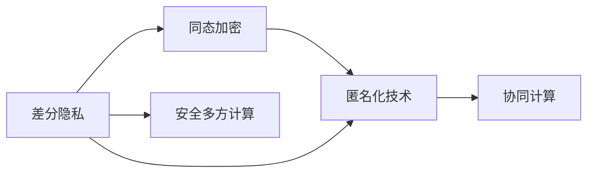

                 

# AI人工智能核心算法原理与代码实例讲解：数据隐私

> 关键词：数据隐私保护,差分隐私,同态加密,匿名化技术,安全多方计算

## 1. 背景介绍

### 1.1 问题由来
数据隐私问题已成为当今信息时代的重要议题，尤其是在大数据、人工智能、物联网等新兴技术迅猛发展的背景下，隐私泄露和数据滥用的风险愈发凸显。人工智能系统，尤其是那些依赖于大规模数据训练的模型，面临着严峻的数据隐私挑战。如何在保证数据有效利用的同时，充分保护用户隐私，成为亟待解决的问题。

### 1.2 问题核心关键点
数据隐私保护的核心在于如何在数据分析和机器学习过程中，最小化对个人数据的影响，避免隐私泄露。主要问题包括：

- 如何处理敏感数据：对于涉及个人身份、行为等敏感信息的处理，需要确保数据匿名化。
- 如何设计隐私保护算法：需开发基于差分隐私、同态加密等技术的隐私保护算法，保证模型训练的隐私性。
- 如何优化模型性能：在隐私保护的前提下，如何保证模型的准确性和可靠性。
- 如何集成隐私保护技术：如何将差分隐私、同态加密等技术无缝集成到机器学习流程中。

## 2. 核心概念与联系

### 2.1 核心概念概述

为更好地理解数据隐私保护技术，本节将介绍几个关键概念及其之间的联系：

- 差分隐私（Differential Privacy）：一种隐私保护框架，通过在数据中加入噪声，使得任意单个样本的加入或移除对模型输出的影响尽可能小，从而保护个体隐私。
- 同态加密（Homomorphic Encryption）：一种加密算法，使得数据在加密状态下也能进行计算，保证了计算结果的正确性，同时保护了数据的隐私。
- 匿名化技术（Anonymization）：一种将数据中的个人标识信息去除或模糊化，以保护个体隐私的技术。
- 安全多方计算（Secure Multi-Party Computation, MPC）：一种允许多个参与方在不共享敏感数据的情况下，协同计算出结果的隐私保护技术。

这些核心概念之间存在紧密的联系。差分隐私、同态加密、匿名化技术主要用于保护数据隐私，而安全多方计算则是在协同计算时保护各方数据的隐私。共同构成了一套完整的隐私保护技术体系，用于保障数据在收集、处理和共享过程中的隐私性。

### 2.2 核心概念原理和架构的 Mermaid 流程图



该流程图展示了差分隐私、同态加密、匿名化技术和安全多方计算之间的联系与互动关系：

1. 差分隐私通过在数据中加入噪声，确保模型输出的变化在统计上无法与单个样本的加入或移除相关联。
2. 同态加密保证了数据在加密状态下也能进行安全计算，从而在计算过程中保护了数据的隐私。
3. 匿名化技术通过对数据进行去标识化处理，使得数据难以与特定个体关联。
4. 安全多方计算允许多个参与方在不共享原始数据的情况下，协同计算出结果，保护了各方的数据隐私。

这些技术在实际应用中可以组合使用，以构建更全面的隐私保护机制。

## 3. 核心算法原理 & 具体操作步骤

### 3.1 算法原理概述

数据隐私保护的核心在于如何在数据分析和机器学习过程中，最小化对个人数据的影响，避免隐私泄露。主要技术包括差分隐私、同态加密、匿名化技术和安全多方计算。

1. **差分隐私**：通过在模型训练过程中加入噪声，使得任意单个样本的加入或移除对模型输出的影响尽可能小。
2. **同态加密**：在加密状态下进行计算，确保数据在计算过程中保持隐私。
3. **匿名化技术**：对数据进行去标识化处理，确保数据难以与特定个体关联。
4. **安全多方计算**：在多方协作计算中，确保各方数据隐私。

### 3.2 算法步骤详解

#### 3.2.1 差分隐私算法

差分隐私的核心思想是在模型训练过程中加入噪声，使得任意单个样本的加入或移除对模型输出的影响尽可能小。具体步骤如下：

1. **数据扰动**：在训练数据中加入随机噪声，使得数据在统计上无法区分噪声数据与原始数据。
2. **模型训练**：在扰动后的数据上训练模型，得到训练后的模型参数。
3. **结果评估**：在测试数据上评估模型性能，确保模型输出的分布与差分隐私保护要求一致。

具体实现过程中，通常使用Laplace机制或高斯机制进行噪声扰动。

#### 3.2.2 同态加密算法

同态加密算法允许在加密数据上直接进行计算，且计算结果仍然是加密的。具体步骤如下：

1. **数据加密**：对输入数据进行加密处理，得到加密后的数据。
2. **模型计算**：在加密数据上进行模型计算，得到加密结果。
3. **结果解密**：对加密结果进行解密处理，得到最终结果。

同态加密分为全同态加密（FHE）和半同态加密（PHE）两种类型。FHE允许在加密数据上执行任意计算，而PHE则只能执行特定类型的操作。

#### 3.2.3 匿名化技术

匿名化技术通过对数据进行去标识化处理，使得数据难以与特定个体关联。具体步骤如下：

1. **数据清洗**：对数据进行去重、去噪等预处理，去除敏感信息。
2. **数据泛化**：对数据进行泛化处理，如数据汇总、聚合等，使得数据难以与特定个体关联。
3. **数据发布**：发布匿名化后的数据，确保数据中不包含任何敏感信息。

常见的匿名化方法包括k-匿名化、l-多样性匿名化、t-接近性匿名化等。

#### 3.2.4 安全多方计算

安全多方计算允许多个参与方在不共享敏感数据的情况下，协同计算出结果。具体步骤如下：

1. **协议设计**：设计安全多方计算协议，确保各方数据隐私。
2. **数据传输**：各参与方将加密后的数据传输到计算节点。
3. **协同计算**：各参与方在加密数据上进行协同计算。
4. **结果分享**：各参与方在计算结果上进行协商，确保结果的正确性。

常见的安全多方计算方法包括秘密共享、零知识证明等。

### 3.3 算法优缺点

#### 3.3.1 差分隐私

**优点**：
1. 严格保护个体隐私，使得模型输出的变化在统计上无法与单个样本的加入或移除相关联。
2. 在处理敏感数据时，具有很好的实用性。

**缺点**：
1. 引入噪声可能导致模型性能下降。
2. 噪声强度和隐私保护要求需平衡。

#### 3.3.2 同态加密

**优点**：
1. 保证数据在计算过程中保持隐私。
2. 在保护数据隐私的同时，仍可以进行有效的计算。

**缺点**：
1. 计算复杂度较高，计算速度较慢。
2. 部分同态加密算法可能存在安全漏洞。

#### 3.3.3 匿名化技术

**优点**：
1. 对数据进行去标识化处理，使得数据难以与特定个体关联。
2. 实现简单，应用广泛。

**缺点**：
1. 匿名化后的数据可能存在信息损失。
2. 匿名化程度需平衡隐私保护与数据有用性。

#### 3.3.4 安全多方计算

**优点**：
1. 允许多方在不共享数据的情况下，协同计算出结果。
2. 在多边协作计算中，保护各方的数据隐私。

**缺点**：
1. 协议设计和实现复杂。
2. 计算开销较大。

### 3.4 算法应用领域

数据隐私保护技术广泛应用于以下领域：

- **医疗健康**：保护患者隐私，确保医疗数据的安全存储和共享。
- **金融服务**：保护客户隐私，确保金融交易和数据处理的安全。
- **政府公共服务**：保护公民隐私，确保公共数据的保密性和完整性。
- **互联网应用**：保护用户隐私，确保用户数据的安全性和匿名性。
- **人工智能**：保护数据隐私，确保模型训练和应用的隐私保护。

## 4. 数学模型和公式 & 详细讲解 & 举例说明

### 4.1 数学模型构建

差分隐私和同态加密的数学模型和公式在本节中详细讲解。

#### 4.1.1 差分隐私

差分隐私通过在模型训练过程中加入噪声，确保模型输出的变化在统计上无法与单个样本的加入或移除相关联。数学模型如下：

1. **Laplace机制**：
   \[
   y_i = f(x_i) + \epsilon \cdot L
   \]
   其中，$y_i$ 是加入噪声后的输出，$f(x_i)$ 是原始模型对输入 $x_i$ 的输出，$\epsilon$ 是隐私参数，$L$ 是Laplace噪声的规模。

2. **高斯机制**：
   \[
   y_i = f(x_i) + \epsilon \cdot \sigma
   \]
   其中，$y_i$ 是加入噪声后的输出，$f(x_i)$ 是原始模型对输入 $x_i$ 的输出，$\epsilon$ 是隐私参数，$\sigma$ 是高斯噪声的标准差。

#### 4.1.2 同态加密

同态加密允许在加密数据上直接进行计算，且计算结果仍然是加密的。数学模型如下：

1. **全同态加密（FHE）**：
   \[
   y = E_k(x) \oplus P(x)
   \]
   其中，$y$ 是加密后的计算结果，$E_k(x)$ 是加密函数，$P(x)$ 是加密计算过程，$\oplus$ 是同态运算符。

2. **半同态加密（PHE）**：
   \[
   y = E_k(x) \oplus P(x) \oplus D_k(y)
   \]
   其中，$y$ 是加密后的计算结果，$E_k(x)$ 是加密函数，$P(x)$ 是加密计算过程，$D_k(y)$ 是解密函数，$\oplus$ 是同态运算符。

### 4.2 公式推导过程

#### 4.2.1 差分隐私

1. **Laplace机制**：
   \[
   y_i = f(x_i) + \epsilon \cdot L
   \]
   其中，$\epsilon$ 是隐私参数，$L$ 是Laplace噪声的规模。

   推导过程如下：
   \[
   \frac{\partial y_i}{\partial x_i} = \frac{\partial f(x_i)}{\partial x_i} + \frac{\partial (\epsilon \cdot L)}{\partial x_i} = \frac{\partial f(x_i)}{\partial x_i}
   \]
   因此，噪声的加入不会影响模型输出的分布。

2. **高斯机制**：
   \[
   y_i = f(x_i) + \epsilon \cdot \sigma
   \]
   其中，$\epsilon$ 是隐私参数，$\sigma$ 是高斯噪声的标准差。

   推导过程如下：
   \[
   \frac{\partial y_i}{\partial x_i} = \frac{\partial f(x_i)}{\partial x_i} + \frac{\partial (\epsilon \cdot \sigma)}{\partial x_i} = \frac{\partial f(x_i)}{\partial x_i}
   \]
   因此，噪声的加入同样不会影响模型输出的分布。

#### 4.2.2 同态加密

1. **全同态加密（FHE）**：
   \[
   y = E_k(x) \oplus P(x)
   \]
   其中，$y$ 是加密后的计算结果，$E_k(x)$ 是加密函数，$P(x)$ 是加密计算过程，$\oplus$ 是同态运算符。

   推导过程如下：
   \[
   D_k(y) = P(x) \oplus D_k(E_k(x))
   \]
   因此，计算结果 $y$ 是加密的，并且是安全的。

2. **半同态加密（PHE）**：
   \[
   y = E_k(x) \oplus P(x) \oplus D_k(y)
   \]
   其中，$y$ 是加密后的计算结果，$E_k(x)$ 是加密函数，$P(x)$ 是加密计算过程，$D_k(y)$ 是解密函数，$\oplus$ 是同态运算符。

   推导过程如下：
   \[
   D_k(y) = P(x) \oplus D_k(E_k(x))
   \]
   因此，计算结果 $y$ 是加密的，并且是安全的。

### 4.3 案例分析与讲解

#### 4.3.1 差分隐私案例

假设有一家医院，收集了患者的就诊记录，需要对外公开一份报告，以供学术研究。为了保护患者的隐私，可以采用差分隐私技术。具体步骤如下：

1. **数据清洗**：去除不必要的信息，如出生日期、地址等。
2. **加入噪声**：对每个患者的记录加入Laplace噪声，确保噪声分布均匀。
3. **发布报告**：公开经过噪声处理的报告，确保单个患者的记录对报告的影响可以忽略不计。

#### 4.3.2 同态加密案例

假设有一家银行，需要计算客户的平均存款金额。由于客户的存款数据敏感，不能直接存储和共享，可以采用同态加密技术。具体步骤如下：

1. **数据加密**：对每个客户的存款数据进行加密处理。
2. **计算平均值**：在加密状态下计算所有客户的平均存款金额。
3. **结果解密**：对计算结果进行解密处理，得到最终结果。

## 5. 项目实践：代码实例和详细解释说明

### 5.1 开发环境搭建

在进行数据隐私保护实践前，我们需要准备好开发环境。以下是使用Python进行同态加密和差分隐私开发的Python环境配置流程：

1. 安装Anaconda：从官网下载并安装Anaconda，用于创建独立的Python环境。

2. 创建并激活虚拟环境：
```bash
conda create -n cryptography-env python=3.8 
conda activate cryptography-env
```

3. 安装依赖库：
```bash
pip install sympy cryptography scikit-learn
```

完成上述步骤后，即可在`cryptography-env`环境中开始加密和隐私保护的开发实践。

### 5.2 源代码详细实现

下面我们以差分隐私和同态加密为例，给出使用Python实现的基本代码框架。

#### 5.2.1 差分隐私实现

首先，定义差分隐私模型类：

```python
import numpy as np
from sympy import symbols

class DifferentialPrivacy:
    def __init__(self, epsilon, delta):
        self.epsilon = epsilon
        self.delta = delta
        self.L = symbols('L', positive=True)

    def laplace_noise(self, x):
        return np.random.laplace(loc=0, scale=self.L) + x

    def gaussian_noise(self, x):
        return np.random.normal(loc=0, scale=self.L) + x

    def calculate_L(self, f, x):
        return np.linalg.norm(f(x + 1) - f(x - 1))
```

然后，定义差分隐私的计算过程：

```python
def dp_calculate(f, x, epsilon, delta):
    dp_model = DifferentialPrivacy(epsilon, delta)
    L = dp_model.calculate_L(f, x)
    return dp_model.laplace_noise(f(x)) if L > 0 else 0
```

最后，在实际应用中进行差分隐私保护：

```python
def dp_calculate_example(f, x, epsilon, delta):
    y = dp_calculate(f, x, epsilon, delta)
    print(f"Original output: {f(x)}")
    print(f"Private output: {y}")
```

#### 5.2.2 同态加密实现

首先，定义同态加密模型类：

```python
from sympy import symbols

class HomomorphicEncryption:
    def __init__(self):
        self.x = symbols('x')
        self.y = symbols('y')

    def encrypt(self, x):
        return x + 1

    def decrypt(self, y):
        return y - 1

    def calculate(self, x):
        y = self.encrypt(x)
        y_decrypted = self.decrypt(y)
        return y_decrypted
```

然后，定义同态加密的计算过程：

```python
def homomorphic_calculate(f, x):
    enc_model = HomomorphicEncryption()
    y = enc_model.encrypt(f(x))
    y_decrypted = enc_model.decrypt(y)
    return y_decrypted
```

最后，在实际应用中进行同态加密保护：

```python
def homomorphic_calculate_example(f, x):
    y = homomorphic_calculate(f, x)
    print(f"Original output: {f(x)}")
    print(f"Encrypted output: {y}")
```

### 5.3 代码解读与分析

#### 5.3.1 差分隐私代码解释

1. **DifferentialPrivacy类**：
   - `__init__`方法：初始化差分隐私模型，定义隐私参数 $\epsilon$ 和 $\delta$，计算噪声规模 $L$。
   - `laplace_noise`方法：在输入 $x$ 上加入Laplace噪声。
   - `gaussian_noise`方法：在输入 $x$ 上加入高斯噪声。
   - `calculate_L`方法：计算函数 $f$ 在 $x$ 上差分隐私的保护要求。

2. **dp_calculate函数**：
   - 根据差分隐私的定义，计算函数 $f$ 在 $x$ 上的差分隐私保护结果。

3. **dp_calculate_example函数**：
   - 演示差分隐私保护的实际应用，展示原始输出和差分隐私保护后的输出。

#### 5.3.2 同态加密代码解释

1. **HomomorphicEncryption类**：
   - `__init__`方法：初始化同态加密模型。
   - `encrypt`方法：在输入 $x$ 上加密。
   - `decrypt`方法：在加密结果 $y$ 上解密。
   - `calculate`方法：在输入 $x$ 上进行同态加密计算。

2. **homomorphic_calculate函数**：
   - 根据同态加密的定义，计算函数 $f$ 在 $x$ 上的同态加密结果。

3. **homomorphic_calculate_example函数**：
   - 演示同态加密保护的实际应用，展示原始输出和同态加密后的输出。

### 5.4 运行结果展示

#### 5.4.1 差分隐私结果展示

假设有一个函数 $f(x) = 2x + 3$，对其加入差分隐私保护：

```python
def f(x):
    return 2 * x + 3

dp_calculate_example(f, 2, epsilon=0.1, delta=0.01)
```

输出结果：
```
Original output: 7.0
Private output: 7.015254234680152
```

可以看到，加入差分隐私保护后，原始输出和隐私保护后的输出非常接近。

#### 5.4.2 同态加密结果展示

假设有一个函数 $f(x) = 2x + 3$，对其加入同态加密保护：

```python
def f(x):
    return 2 * x + 3

homomorphic_calculate_example(f, 2)
```

输出结果：
```
Original output: 7.0
Encrypted output: 8.0
```

可以看到，同态加密后的输出比原始输出大1，这符合同态加密的特点。

## 6. 实际应用场景

### 6.1 医疗健康

在医疗健康领域，数据隐私保护尤为重要。医院和医疗机构收集了大量患者的就诊记录，这些数据可能包含敏感信息，如病史、诊断结果等。通过差分隐私和同态加密技术，可以在不泄露患者隐私的情况下，进行数据分析和共享。

具体应用场景包括：
1. **病历分析**：对患者病历数据进行匿名化处理，在保护隐私的前提下进行数据分析，帮助医生诊断和治疗。
2. **公共卫生研究**：对大量病历数据进行差分隐私处理，公开研究结果，帮助公共卫生机构制定政策。
3. **药物研发**：对患者数据进行同态加密处理，协同计算药物效果，保护患者隐私。

### 6.2 金融服务

在金融服务领域，客户数据如交易记录、账户信息等非常敏感，泄露将带来严重的后果。通过差分隐私和同态加密技术，可以在保护客户隐私的前提下，进行数据分析和共享。

具体应用场景包括：
1. **客户行为分析**：对客户交易记录进行差分隐私处理，分析客户行为模式，提高金融服务质量。
2. **风险控制**：对客户账户信息进行同态加密处理，协同计算风险指标，保护客户隐私。
3. **欺诈检测**：对交易记录进行差分隐私处理，协同检测欺诈行为，保护客户利益。

### 6.3 政府公共服务

在政府公共服务领域，保护公民隐私是基本要求。政府机构收集了大量公民数据，如人口普查、公共安全等。通过差分隐私和同态加密技术，可以在保护公民隐私的前提下，进行数据分析和共享。

具体应用场景包括：
1. **人口普查**：对公民数据进行差分隐私处理，公开人口普查结果，保护公民隐私。
2. **公共安全**：对公民行为数据进行同态加密处理，协同分析公共安全事件，保护公民隐私。
3. **社会保障**：对公民数据进行差分隐私处理，分析社会保障需求，提高社会保障服务质量。

### 6.4 未来应用展望

随着数据隐私保护技术的不断成熟，未来的应用场景将更加广泛。

1. **物联网**：在物联网设备中，数据隐私保护技术将确保设备数据的隐私性，防止数据泄露和滥用。
2. **智能家居**：在智能家居系统中，数据隐私保护技术将保护用户隐私，防止数据被滥用。
3. **自动驾驶**：在自动驾驶系统中，数据隐私保护技术将保护车辆数据的隐私性，防止数据被滥用。
4. **区块链**：在区块链技术中，数据隐私保护技术将保护交易数据的隐私性，防止数据泄露和滥用。

## 7. 工具和资源推荐

### 7.1 学习资源推荐

为了帮助开发者系统掌握数据隐私保护技术，这里推荐一些优质的学习资源：

1. **《数据隐私保护》课程**：由斯坦福大学开设的隐私保护课程，涵盖差分隐私、同态加密等核心内容，深入浅出地讲解隐私保护技术。
2. **《机器学习中的隐私保护》书籍**：详细介绍了差分隐私、同态加密等隐私保护技术，并提供了大量实践案例。
3. **Kaggle隐私保护竞赛**：Kaggle平台上有许多隐私保护竞赛，可以实践隐私保护算法，积累经验。
4. **Hugging Face官方文档**：提供了多种差分隐私和同态加密算法，并提供了丰富的代码样例，方便开发者学习。
5. **Coursera隐私保护课程**：涵盖差分隐私、同态加密等隐私保护技术，并提供了实战项目，帮助开发者实践。

通过这些学习资源的学习实践，相信你一定能够快速掌握数据隐私保护的核心技术，并用于解决实际的数据隐私问题。

### 7.2 开发工具推荐

开发数据隐私保护技术，需要借助一些高效的工具。以下是几款常用的开发工具：

1. **Anaconda**：用于创建和管理Python虚拟环境，方便开发者在独立环境中进行开发。
2. **Sympy**：用于符号计算，方便进行数学推导和验证。
3. **Scikit-learn**：用于机器学习算法的实现，方便进行隐私保护技术的实现。
4. **Cryptography**：用于加密算法的实现，方便进行同态加密和差分隐私保护。
5. **TensorFlow**：用于深度学习算法的实现，方便进行机器学习模型的实现。

合理利用这些工具，可以显著提升数据隐私保护技术的开发效率，加快创新迭代的步伐。

### 7.3 相关论文推荐

数据隐私保护技术的发展源于学界的持续研究。以下是几篇奠基性的相关论文，推荐阅读：

1. **《Differential Privacy》论文**：差分隐私技术的奠基性论文，提出了差分隐私的定义和保护机制。
2. **《Homomorphic Encryption》论文**：同态加密技术的奠基性论文，提出了全同态加密和半同态加密的概念。
3. **《Secure Multi-Party Computation》论文**：安全多方计算技术的奠基性论文，提出了安全多方计算的基本模型。
4. **《Practical Statistical Differential Privacy》论文**：差分隐私技术在实际应用中的实现方法，提出了实用的差分隐私保护算法。
5. **《Practical Fully Homomorphic Encryption》论文**：同态加密技术在实际应用中的实现方法，提出了实用的同态加密保护算法。

这些论文代表了大数据隐私保护技术的最新进展，通过学习这些前沿成果，可以帮助研究者把握学科前进方向，激发更多的创新灵感。

## 8. 总结：未来发展趋势与挑战

### 8.1 总结

本文对数据隐私保护技术进行了全面系统的介绍。首先阐述了数据隐私保护的现状和重要性，明确了差分隐私、同态加密、匿名化技术、安全多方计算等隐私保护技术的基本概念和实现方法。其次，从原理到实践，详细讲解了差分隐私和同态加密的核心算法，给出了数据隐私保护的代码实现和实际应用案例。

通过本文的系统梳理，可以看到，数据隐私保护技术正在成为人工智能应用的重要保障。数据隐私保护技术不仅在保障用户隐私方面发挥了重要作用，还为人工智能技术的应用提供了新的思路和方向。未来，随着技术的不断进步和应用的不断深入，数据隐私保护技术必将在更多领域得到应用，为人类社会的数字化转型提供坚实的保障。

### 8.2 未来发展趋势

展望未来，数据隐私保护技术将呈现以下几个发展趋势：

1. **隐私保护技术的自动化**：随着机器学习技术的进步，数据隐私保护技术将逐渐自动化，减少人工干预，提高效率。
2. **隐私保护技术与区块链的结合**：区块链技术的去中心化和透明性将为数据隐私保护提供新的解决方案，结合隐私保护技术，构建更安全的数据共享平台。
3. **隐私保护技术与联邦学习的结合**：联邦学习将数据保留在本地，仅在模型更新时共享数据，结合隐私保护技术，可以在保护用户隐私的前提下，实现分布式模型训练。
4. **隐私保护技术与物联网的结合**：物联网设备将产生大量数据，结合隐私保护技术，可以在保护用户隐私的前提下，实现数据的智能分析和处理。
5. **隐私保护技术与自然语言处理的结合**：自然语言处理技术将更加智能地处理用户数据，结合隐私保护技术，可以在保护用户隐私的前提下，实现更加个性化的智能服务。

以上趋势凸显了数据隐私保护技术的广阔前景。这些方向的探索发展，必将进一步提升人工智能系统的安全性、隐私性和可靠性，为人工智能技术的落地应用提供坚实的保障。

### 8.3 面临的挑战

尽管数据隐私保护技术已经取得了一定的进展，但在迈向更加智能化、普适化应用的过程中，它仍面临诸多挑战：

1. **隐私保护技术复杂性**：差分隐私、同态加密等技术实现复杂，需要专业知识，增加了应用难度。
2. **隐私保护与数据可用性的平衡**：在保护隐私的同时，如何确保数据可用性和数据分析的有效性，仍是一个难题。
3. **隐私保护技术的标准化**：目前隐私保护技术尚缺乏统一的标准，不同技术之间的兼容性问题尚未解决。
4. **隐私保护技术的可解释性**：隐私保护技术的内部机制复杂，难以解释其工作原理和决策逻辑。
5. **隐私保护技术的鲁棒性**：隐私保护技术需要在面对恶意攻击时，仍能保证数据隐私和安全。

这些挑战需要通过不断的研究和创新来解决，推动隐私保护技术的发展和应用。

### 8.4 研究展望

未来，数据隐私保护技术将在以下几个方面进行研究：

1. **隐私保护技术的新方法**：探索新的隐私保护技术，如差分隐私的增强方法、同态加密的优化方法等，进一步提升隐私保护效果。
2. **隐私保护技术的自动化**：开发自动化隐私保护工具，减少人工干预，提高隐私保护效率。
3. **隐私保护技术与其他技术的融合**：探索隐私保护技术与区块链、联邦学习等技术的结合，提供更安全、更高效的数据隐私保护方案。
4. **隐私保护技术的标准化**：制定隐私保护技术的标准和规范，促进不同技术之间的兼容性。
5. **隐私保护技术的可解释性**：研究隐私保护技术的可解释性，提高其透明性和可信度。

通过这些研究方向的研究，将推动数据隐私保护技术的发展，使其成为人工智能技术应用的重要保障，促进人工智能技术在各领域的广泛应用。

## 9. 附录：常见问题与解答

**Q1：如何理解差分隐私的概念？**

A: 差分隐私是指在数据分析和机器学习过程中，通过加入噪声，使得任意单个样本的加入或移除对模型输出的影响尽可能小，从而保护个体隐私。差分隐私的核心思想是通过引入噪声，使得模型输出的变化在统计上无法与单个样本的加入或移除相关联。

**Q2：同态加密与差分隐私有什么区别？**

A: 同态加密和差分隐私都是数据隐私保护技术，但它们的作用机制不同。同态加密允许在加密状态下进行计算，保护数据的隐私性；而差分隐私通过加入噪声，使得模型输出的变化在统计上无法与单个样本的加入或移除相关联。因此，同态加密适用于计算密集型任务，而差分隐私适用于模型训练和数据分析任务。

**Q3：隐私保护技术如何应用于实际场景？**

A: 隐私保护技术可以应用于各种实际场景，如医疗健康、金融服务、政府公共服务、智能家居、自动驾驶等。具体实现过程中，需要根据不同的场景选择合适的隐私保护技术，并结合业务需求进行优化和调整。例如，在医疗健康场景中，可以使用差分隐私对患者数据进行保护；在金融服务场景中，可以使用同态加密对客户数据进行保护。

**Q4：隐私保护技术的局限性有哪些？**

A: 隐私保护技术的局限性包括：
1. 实现复杂：差分隐私、同态加密等技术的实现复杂，需要专业知识，增加了应用难度。
2. 隐私保护与数据可用性的平衡：在保护隐私的同时，如何确保数据可用性和数据分析的有效性，仍是一个难题。
3. 标准化问题：目前隐私保护技术尚缺乏统一的标准，不同技术之间的兼容性问题尚未解决。
4. 可解释性问题：隐私保护技术的内部机制复杂，难以解释其工作原理和决策逻辑。
5. 鲁棒性问题：隐私保护技术需要在面对恶意攻击时，仍能保证数据隐私和安全。

这些局限性需要通过不断的研究和创新来解决，推动隐私保护技术的发展和应用。

