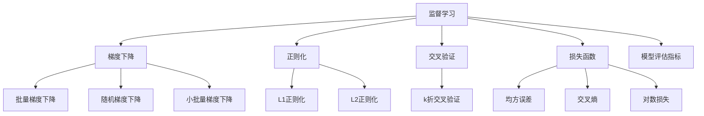

                 

# AI人工智能核心算法原理与代码实例讲解：监督学习

> 关键词：监督学习, 算法原理, 数学模型, 代码实现, 实际应用

## 1. 背景介绍

### 1.1 问题由来

监督学习(Supervised Learning)是机器学习中的一种基本范式，通过有标签的数据进行训练，学习输入与输出之间的映射关系。其广泛应用于图像分类、文本分类、回归分析等任务，成为AI人工智能研究的重要基石。

然而，监督学习的效果很大程度上依赖于数据质量、数据量、特征选择等因素，其应用复杂度较高，需要跨领域、跨学科的深入研究。为了帮助读者深入理解监督学习，本文将从算法原理、操作步骤、实际应用等多个维度进行详细讲解，并通过代码实例进行直观展示。

### 1.2 问题核心关键点

监督学习的主要研究内容包括：
1. 算法原理：包括梯度下降、正则化、交叉验证等基本概念和思想。
2. 操作步骤：包括数据准备、模型选择、模型训练、模型评估等关键环节。
3. 算法优缺点：分析监督学习在模型复杂度、泛化能力、训练成本等方面的优劣。
4. 应用领域：展示监督学习在图像处理、文本分析、推荐系统、智能问答等多个领域的应用。

## 2. 核心概念与联系

### 2.1 核心概念概述

为更好地理解监督学习，本节将介绍几个核心概念及其相互联系：

- **监督学习**：通过有标签的数据进行训练，学习输入与输出之间的映射关系。其基本思想是：利用训练集对模型进行优化，使得模型在测试集上泛化性能最佳。
- **梯度下降**：通过计算损失函数对模型参数的梯度，更新参数，最小化损失函数，从而优化模型。梯度下降分为批量梯度下降(Batch Gradient Descent)、随机梯度下降(Stochastic Gradient Descent)和小批量梯度下降(Mini-Batch Gradient Descent)等多种形式。
- **正则化**：通过引入正则项，如L1、L2正则化，避免模型过拟合。正则化包括L1正则化（Lasso）和L2正则化（Ridge）等形式。
- **交叉验证**：通过将数据集划分为训练集和验证集，多次训练模型，使用验证集评估模型性能，选择最优模型。常用的交叉验证方法包括k折交叉验证(K-fold Cross Validation)等。
- **损失函数**：定义损失函数，如均方误差、交叉熵、对数损失等，用于衡量模型预测值与真实值之间的差异。
- **模型评估指标**：常用的模型评估指标包括准确率(Accuracy)、精确率(Precision)、召回率(Recall)、F1值(F1 Score)等。

这些核心概念之间的逻辑关系可以通过以下Mermaid流程图来展示：



这个流程图展示出监督学习的基本流程和核心概念之间的联系：

1. 监督学习通过有标签数据进行模型训练。
2. 梯度下降通过优化损失函数来更新模型参数。
3. 正则化通过引入正则项，避免模型过拟合。
4. 交叉验证通过多次训练评估模型泛化性能。
5. 损失函数定义模型预测值与真实值之间的差异。
6. 模型评估指标用于衡量模型预测结果的质量。

这些概念共同构成了监督学习的研究框架，使其在各个领域得到广泛应用。

## 3. 核心算法原理 & 具体操作步骤

### 3.1 算法原理概述

监督学习的基本流程包括数据准备、模型选择、模型训练、模型评估和模型调优等关键步骤。下面将逐一介绍这些步骤及其原理。

### 3.2 算法步骤详解

#### 3.2.1 数据准备

数据准备是监督学习的首要步骤，主要包括以下几个方面：
1. 数据收集：收集与任务相关的数据，如图像、文本、表格等。
2. 数据预处理：对数据进行清洗、归一化、编码等处理，准备训练和测试数据集。
3. 数据划分：将数据划分为训练集、验证集和测试集，一般按照70%、15%、15%的比例进行划分。

#### 3.2.2 模型选择

模型选择是监督学习的核心步骤，需要根据任务类型选择合适的算法模型。
1. 线性回归模型：适用于回归问题，如房价预测、股票预测等。
2. 逻辑回归模型：适用于二分类问题，如垃圾邮件分类、疾病诊断等。
3. 决策树模型：适用于分类和回归问题，如客户流失预测、信用评分等。
4. 随机森林模型：适用于分类和回归问题，提升模型的泛化能力和鲁棒性。
5. 支持向量机(SVM)模型：适用于分类问题，通过将数据映射到高维空间，提高模型准确率。
6. 神经网络模型：适用于复杂分类和回归问题，如图像分类、自然语言处理等。

#### 3.2.3 模型训练

模型训练是监督学习的关键步骤，主要包括以下几个环节：
1. 初始化模型参数：设置模型超参数，如学习率、正则化系数等。
2. 迭代训练：通过梯度下降算法，迭代更新模型参数，最小化损失函数。
3. 参数更新：使用训练集数据计算损失函数的梯度，更新模型参数。
4. 正则化：通过L1、L2正则化等方法，防止模型过拟合。
5. 交叉验证：使用k折交叉验证等方法，评估模型性能，选择最优模型。

#### 3.2.4 模型评估

模型评估是监督学习的最后步骤，主要包括以下几个环节：
1. 计算模型性能指标：使用准确率、精确率、召回率、F1值等指标评估模型性能。
2. 可视化结果：使用混淆矩阵、ROC曲线等可视化方法展示模型结果。
3. 模型调优：根据评估结果，调整模型超参数，提升模型性能。

### 3.3 算法优缺点

监督学习具有以下优点：
1. 数据导向：通过有标签数据进行训练，能够直接针对任务进行优化。
2. 模型效果好：在数据充足的情况下，监督学习能够获得较高的模型精度。
3. 应用广泛：广泛应用于图像分类、文本分类、回归分析等多个领域。

监督学习也存在以下缺点：
1. 数据依赖：对标注数据的依赖较高，获取高质量标注数据成本较高。
2. 模型复杂：模型选择和调参较为复杂，需要跨领域、跨学科知识。
3. 训练成本：数据量较大，训练时间较长，计算资源消耗较高。

### 3.4 算法应用领域

监督学习在多个领域得到广泛应用，具体包括：
1. 图像分类：如图像识别、物体检测等，使用卷积神经网络模型。
2. 文本分类：如情感分析、文本分类等，使用循环神经网络模型或Transformer模型。
3. 推荐系统：如商品推荐、用户画像等，使用协同过滤算法或神经网络模型。
4. 自然语言处理(NLP)：如机器翻译、文本生成等，使用序列到序列模型。
5. 医学诊断：如疾病预测、病理分析等，使用支持向量机模型。
6. 金融预测：如股票预测、信用评分等，使用随机森林模型。

## 4. 数学模型和公式 & 详细讲解

### 4.1 数学模型构建

本节将使用数学语言对监督学习的核心模型进行系统构建。

假设监督学习任务为$y=f(x)$，其中$x$为输入，$y$为输出，$f$为模型函数，$\theta$为模型参数。已知训练集为$\{(x_i, y_i)\}_{i=1}^N$，其中$x_i$为输入，$y_i$为输出，$N$为样本数。

定义损失函数为$\ell(y_i, f(x_i))$，其中$y_i$为真实输出，$f(x_i)$为模型输出。假设训练集和测试集分别为$D=\{(x_i, y_i)\}_{i=1}^N$和$T=\{(x_i, y_i)\}_{i=N+1}^M$，其中$M$为总样本数。

定义模型在测试集上的泛化误差为：
$$
\epsilon(f) = \frac{1}{M-N}\sum_{i=N+1}^M \ell(y_i, f(x_i))
$$

监督学习的目标是最小化泛化误差，即：
$$
\min_{\theta} \epsilon(f_\theta)
$$

常用的损失函数包括均方误差、交叉熵、对数损失等。

### 4.2 公式推导过程

以均方误差损失函数为例，推导其梯度计算公式。

均方误差损失函数定义为：
$$
\ell(y_i, f(x_i)) = \frac{1}{2}(y_i - f(x_i))^2
$$

在训练集上，均方误差损失函数的均值为：
$$
\mathcal{L}(\theta) = \frac{1}{N}\sum_{i=1}^N \frac{1}{2}(y_i - f(x_i))^2
$$

对模型函数$f(x_i)$求梯度，得到：
$$
\nabla_{\theta} \mathcal{L}(\theta) = \frac{1}{N}\sum_{i=1}^N \nabla_{\theta} f(x_i) (-y_i + f(x_i))
$$

其中$\nabla_{\theta} f(x_i)$为模型函数对参数$\theta$的梯度，可以通过反向传播算法计算。

使用梯度下降算法更新参数$\theta$，得到：
$$
\theta \leftarrow \theta - \eta \nabla_{\theta} \mathcal{L}(\theta)
$$

其中$\eta$为学习率。

### 4.3 案例分析与讲解

以线性回归为例，推导其数学模型和梯度计算公式。

假设线性回归模型为$y = \theta_0 + \theta_1 x_1 + \theta_2 x_2 + ... + \theta_p x_p$，其中$\theta_0, \theta_1, ..., \theta_p$为模型参数。

均方误差损失函数定义为：
$$
\ell(y, f(x)) = \frac{1}{2}(y - f(x))^2 = \frac{1}{2}(y - (\theta_0 + \theta_1 x_1 + \theta_2 x_2 + ... + \theta_p x_p))^2
$$

在训练集上，均方误差损失函数的均值为：
$$
\mathcal{L}(\theta) = \frac{1}{N}\sum_{i=1}^N \frac{1}{2}(y_i - (\theta_0 + \theta_1 x_{1,i} + \theta_2 x_{2,i} + ... + \theta_p x_{p,i}))^2
$$

对模型函数$f(x)$求梯度，得到：
$$
\nabla_{\theta} \mathcal{L}(\theta) = \frac{1}{N}\sum_{i=1}^N (x_{1,i} x_{1,i} + x_{2,i} x_{2,i} + ... + x_{p,i} x_{p,i}) \nabla_{\theta} f(x_i) - \frac{1}{N}\sum_{i=1}^N (x_{1,i} y_i + x_{2,i} y_i + ... + x_{p,i} y_i) \nabla_{\theta} f(x_i)
$$

其中$\nabla_{\theta} f(x_i) = [x_{1,i}, x_{2,i}, ..., x_{p,i}]$。

使用梯度下降算法更新参数$\theta$，得到：
$$
\theta \leftarrow \theta - \eta (x_{1,i} x_{1,i} + x_{2,i} x_{2,i} + ... + x_{p,i} x_{p,i}) - \eta (x_{1,i} y_i + x_{2,i} y_i + ... + x_{p,i} y_i)
$$

## 5. 项目实践：代码实例和详细解释说明

### 5.1 开发环境搭建

在进行监督学习实践前，我们需要准备好开发环境。以下是使用Python进行Scikit-Learn开发的环境配置流程：

1. 安装Anaconda：从官网下载并安装Anaconda，用于创建独立的Python环境。

2. 创建并激活虚拟环境：
```bash
conda create -n sklearn-env python=3.8 
conda activate sklearn-env
```

3. 安装Scikit-Learn：使用pip安装Scikit-Learn库及其依赖。
```bash
pip install scikit-learn
```

4. 安装各类工具包：
```bash
pip install numpy pandas matplotlib seaborn
```

完成上述步骤后，即可在`sklearn-env`环境中开始监督学习实践。

### 5.2 源代码详细实现

下面我们以线性回归为例，给出使用Scikit-Learn进行监督学习的PyTorch代码实现。

首先，定义线性回归模型和数据集：

```python
from sklearn.linear_model import LinearRegression
from sklearn.metrics import mean_squared_error, r2_score
import numpy as np
import pandas as pd

# 创建线性回归模型
model = LinearRegression()

# 加载数据集
data = pd.read_csv('data.csv')
X = data.iloc[:, :-1].values
y = data.iloc[:, -1].values
```

接着，训练模型并评估性能：

```python
# 划分为训练集和测试集
from sklearn.model_selection import train_test_split
X_train, X_test, y_train, y_test = train_test_split(X, y, test_size=0.2, random_state=0)

# 训练模型
model.fit(X_train, y_train)

# 在测试集上评估模型性能
y_pred = model.predict(X_test)
mse = mean_squared_error(y_test, y_pred)
r2 = r2_score(y_test, y_pred)
print('均方误差:', mse)
print('R²:', r2)
```

最后，使用可视化工具进行结果展示：

```python
import matplotlib.pyplot as plt

# 绘制散点图
plt.scatter(X_test, y_test, color='red')
plt.plot(X_test, y_pred, color='blue')
plt.xlabel('X')
plt.ylabel('y')
plt.title('线性回归结果')
plt.show()
```

以上就是使用Scikit-Learn进行线性回归实践的完整代码实现。可以看到，Scikit-Learn提供了丰富的模型选择和评估方法，能够快速完成监督学习任务。

### 5.3 代码解读与分析

让我们再详细解读一下关键代码的实现细节：

**LinearRegression类**：
- `fit`方法：训练模型，使用训练集数据进行参数估计。
- `predict`方法：在测试集上预测模型结果，返回预测值。

**train_test_split函数**：
- 将数据集划分为训练集和测试集，默认按照70%、30%的比例进行划分。

**均方误差和R²值**：
- 使用均方误差和R²值评估模型性能，均方误差越小，R²值越接近1，模型性能越好。

**散点图可视化**：
- 使用Matplotlib库绘制散点图和拟合曲线，展示模型预测结果。

可以看出，Scikit-Learn的实现非常简单，适合快速完成监督学习任务。在实际应用中，还需要根据具体任务进行更多的数据预处理、特征工程和模型调参，才能得到更好的效果。

## 6. 实际应用场景

### 6.1 智能推荐系统

智能推荐系统是监督学习的重要应用场景，通过用户行为数据和物品特征数据进行训练，推荐用户可能感兴趣的商品、视频、新闻等。

在技术实现上，可以使用协同过滤算法或深度神经网络模型，通过点击率、评分、浏览时间等行为数据进行训练，生成推荐列表。推荐系统能够个性化推荐用户感兴趣的内容，提升用户体验，增加用户黏性。

### 6.2 金融风险预测

金融风险预测是监督学习的经典应用，通过历史交易数据进行训练，预测用户信用评分、贷款违约率等。

在技术实现上，可以使用支持向量机、随机森林、神经网络等模型，通过交易金额、交易频率、信用评分等特征数据进行训练，生成风险预测结果。风险预测模型能够及时发现潜在风险，避免损失，提高金融机构的业务决策水平。

### 6.3 医学诊断

医学诊断是监督学习的重要应用领域，通过医疗记录、影像数据等进行训练，预测疾病风险、诊断结果等。

在技术实现上，可以使用支持向量机、随机森林、神经网络等模型，通过病历、影像、基因数据等特征数据进行训练，生成诊断结果。医学诊断模型能够辅助医生进行诊断，提升诊断准确率，减少误诊率，提高医疗服务水平。

### 6.4 未来应用展望

随着监督学习算法的不断发展，未来将涌现更多新的应用场景，带来更广泛的商业价值和社会效益。

在智慧城市治理中，通过交通数据、环境数据等进行训练，预测交通流量、环境污染等，提高城市管理水平，构建智慧城市。

在智能交通系统中，通过车辆数据、道路数据等进行训练，预测车辆行驶路径、交通拥堵情况等，优化交通管理，提升出行体验。

在智能制造领域，通过生产数据、设备数据等进行训练，预测设备故障、生产效率等，提高生产效率，降低生产成本。

## 7. 工具和资源推荐

### 7.1 学习资源推荐

为了帮助开发者系统掌握监督学习的理论基础和实践技巧，这里推荐一些优质的学习资源：

1. 《机器学习》书籍：由Tom Mitchell著，系统介绍了机器学习的基本概念和算法。
2. 《Python机器学习》书籍：由Sebastian Raschka著，详细讲解了Python中常用的机器学习库和算法。
3. Coursera《机器学习》课程：由斯坦福大学Andrew Ng教授主讲，深入浅出地介绍了机器学习的基本概念和算法。
4. Kaggle：全球最大的数据科学竞赛平台，提供大量数据集和竞赛题目，实践监督学习算法。
5. Scikit-Learn官方文档：Scikit-Learn的官方文档，提供了详尽的模型选择和评估方法，适合快速入门。

通过对这些资源的学习实践，相信你一定能够快速掌握监督学习的精髓，并用于解决实际的机器学习问题。

### 7.2 开发工具推荐

高效的开发离不开优秀的工具支持。以下是几款用于监督学习开发的常用工具：

1. Scikit-Learn：Python中的机器学习库，提供了丰富的模型选择和评估方法。
2. TensorFlow：Google开发的深度学习框架，支持分布式训练，适合大规模模型开发。
3. PyTorch：Facebook开发的深度学习框架，支持动态计算图，适合快速迭代研究。
4. Jupyter Notebook：Python交互式编程环境，支持代码、数据和结果的快速迭代和共享。
5. Anaconda：Python的科学计算平台，提供丰富的环境配置和管理工具。

合理利用这些工具，可以显著提升监督学习任务的开发效率，加快创新迭代的步伐。

### 7.3 相关论文推荐

监督学习的研究源于学界的持续研究。以下是几篇奠基性的相关论文，推荐阅读：

1. Perceptron: A Probabilistic Model for Multiclass Recognition（1972）：Hinton等，提出了感知机算法，为监督学习奠定了基础。
2. A Taxonomy of Multiclass Learning Problems（1995）：Clarke等，详细介绍了多分类问题的分类方法，包括One-vs-All、One-vs-One等。
3. Bagging Boosting and Cross-Validation（2003）：Breiman等，提出了Bagging、Boosting等集成学习方法，提高了模型的泛化能力。
4. Deep Learning（2012）：Goodfellow等，详细介绍了深度神经网络的架构和训练方法，推动了深度学习的发展。
5. Cross-Entropy Loss for Multi-Label Classification（2007）：Cheng等，提出了多标签分类问题中的交叉熵损失函数，提高了多标签分类的效果。

这些论文代表了大监督学习算法的演进脉络。通过学习这些前沿成果，可以帮助研究者把握学科前进方向，激发更多的创新灵感。

## 8. 总结：未来发展趋势与挑战

### 8.1 总结

本文对监督学习进行了全面系统的介绍。首先阐述了监督学习的基本原理和应用背景，明确了监督学习在机器学习中的重要地位。其次，从算法原理到具体步骤，详细讲解了监督学习的各个环节，并通过代码实例进行直观展示。同时，本文还探讨了监督学习在智能推荐、金融预测、医学诊断等多个领域的应用，展示了监督学习的广泛前景。最后，本文精选了监督学习的各类学习资源，力求为读者提供全方位的技术指引。

通过本文的系统梳理，可以看到，监督学习作为机器学习的重要范式，其应用广泛、效果显著，在多个领域得到深入研究。未来，随着数据量的增加和算力成本的下降，监督学习将继续推动机器学习的发展，带来更多实际应用。

### 8.2 未来发展趋势

展望未来，监督学习将呈现以下几个发展趋势：

1. 模型复杂度提升。随着深度学习的发展，监督学习模型的复杂度将进一步提升，能够处理更加复杂多变的任务。
2. 数据多样化。监督学习将从传统的数值型数据，拓展到图像、视频、文本等多模态数据，提高模型的适应性。
3. 集成学习普及。集成学习将在大规模监督学习任务中得到广泛应用，提升模型的泛化能力和鲁棒性。
4. 自动化调参。基于贝叶斯优化等方法，监督学习的模型选择和调参将更加自动化、智能化。
5. 自监督学习融合。自监督学习与监督学习相结合，提高数据的利用效率，提升模型的性能。
6. 实时学习。基于在线学习、增量学习等技术，监督学习模型能够实时学习新数据，更新模型参数。

以上趋势凸显了监督学习的发展方向，将在未来推动机器学习技术的不断进步。

### 8.3 面临的挑战

尽管监督学习在各个领域都取得了显著成效，但在迈向更加智能化、普适化应用的过程中，它仍面临诸多挑战：

1. 数据获取难度。大规模标注数据难以获取，特别是对于长尾应用场景，获取高质量标注数据成本较高。
2. 模型复杂度高。随着模型复杂度的提升，训练时间和计算资源消耗增加，难以应对大规模数据集。
3. 泛化能力不足。模型在训练集上表现优秀，但在测试集或实际应用中性能下降，泛化能力不足。
4. 可解释性问题。监督学习模型往往是一个黑盒系统，难以解释其内部工作机制和决策逻辑。
5. 公平性问题。监督学习模型可能存在偏见，对某些群体的预测不准确或产生歧视。

面对这些挑战，未来的研究需要在以下几个方面寻求新的突破：

1. 数据生成与增强。利用生成对抗网络等技术，生成更多高质量标注数据，缓解数据获取难度。
2. 模型压缩与优化。基于模型压缩、稀疏化存储等方法，降低模型的复杂度，减少计算资源消耗。
3. 模型集成与融合。通过集成学习、融合多种模型，提升模型的泛化能力和鲁棒性。
4. 可解释性与公平性。引入可解释性方法，如注意力机制、因果推断等，提高模型的透明度和公平性。

只有勇于创新、敢于突破，才能不断拓展监督学习的边界，提升模型的性能和应用范围，为人工智能技术的未来发展铺平道路。

### 8.4 研究展望

未来监督学习的研究方向包括：

1. 弱监督学习。在数据标注成本较高的情况下，利用弱标注数据进行监督学习，提高数据利用率。
2. 无监督学习。在标注数据难以获取的情况下，利用自监督学习、半监督学习等方法，提升模型的泛化能力。
3. 对抗学习。通过引入对抗样本，提高模型的鲁棒性和泛化能力。
4. 迁移学习。将预训练模型应用于新任务，提高模型的泛化能力和鲁棒性。
5. 零样本学习。在无标注数据的情况下，利用预训练模型进行预测，提升模型的适应性。
6. 多模态学习。将图像、视频、文本等多种数据融合，提升模型的适应性和鲁棒性。

以上研究方向将推动监督学习技术的不断进步，为人工智能技术的未来发展提供新的动力。

## 9. 附录：常见问题与解答

**Q1：监督学习和非监督学习有什么区别？**

A: 监督学习和非监督学习是机器学习的两大基本范式。监督学习通过有标签数据进行训练，学习输入与输出之间的映射关系；非监督学习则通过无标签数据进行训练，学习数据的内在结构和模式。监督学习适用于标注数据充足的任务，如分类、回归等；非监督学习适用于无标注数据或难以获取标注数据的任务，如聚类、降维等。

**Q2：什么是交叉验证？如何选择合适的交叉验证方法？**

A: 交叉验证是一种常用的模型评估方法，通过将数据集划分为训练集和验证集，多次训练模型，使用验证集评估模型性能，选择最优模型。常用的交叉验证方法包括k折交叉验证(K-fold Cross Validation)、留一法(Leave-One-Out Cross Validation)等。

**Q3：什么是模型正则化？常用的正则化方法有哪些？**

A: 模型正则化是通过引入正则项，避免模型过拟合。常用的正则化方法包括L1正则化（Lasso）和L2正则化（Ridge）等。L1正则化通过约束参数的绝对值之和，使模型参数稀疏化；L2正则化通过约束参数的平方和，防止模型参数过大。

**Q4：什么是学习率？如何选择合适的学习率？**

A: 学习率是梯度下降算法中的重要参数，控制每次参数更新的步长。学习率过大可能导致模型发散，过小可能导致收敛速度慢。常用的学习率调整策略包括固定学习率、学习率衰减、学习率恢复等。

**Q5：什么是梯度下降？常用的梯度下降算法有哪些？**

A: 梯度下降是通过计算损失函数对模型参数的梯度，更新参数，最小化损失函数。常用的梯度下降算法包括批量梯度下降(Batch Gradient Descent)、随机梯度下降(Stochastic Gradient Descent)和小批量梯度下降(Mini-Batch Gradient Descent)等。批量梯度下降计算所有样本的梯度，计算量较大；随机梯度下降每次随机抽取一个样本进行梯度计算，计算量较小；小批量梯度下降每次抽取一小批样本进行梯度计算，综合了批量和随机梯度下降的优点。

---

作者：禅与计算机程序设计艺术 / Zen and the Art of Computer Programming

