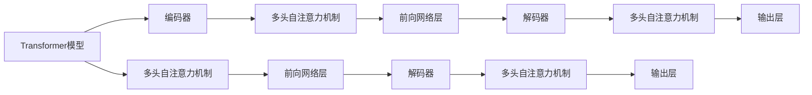

                 

# AI人工智能核心算法原理与代码实例讲解：语言生成

> 关键词：自然语言处理, 语言生成, 神经网络, 深度学习, GPT-3, 语言模型, 文本生成

## 1. 背景介绍

语言生成是自然语言处理（NLP）领域中的一个重要研究方向，涉及生成自然流畅、语义合理的文本。随着深度学习和大规模预训练语言模型的发展，基于神经网络的生成技术不断涌现，特别是Transformer架构的兴起，语言生成模型的性能得到了质的提升。

在语言生成任务中，生成模型需要学习输入文本的条件概率分布，生成满足条件的输出文本。生成模型能够处理各种文本生成任务，如文本摘要、对话生成、机器翻译、文本补全等。本文将详细介绍语言生成算法的原理与实现，并通过具体的代码实例对相关技术进行讲解。

## 2. 核心概念与联系

### 2.1 核心概念概述

语言生成涉及到以下几个核心概念：

- **语言模型**：描述单词或短语在文本中出现的概率分布，是生成文本的基础。
- **自回归模型**：通过前文信息预测后文概率，如GPT-3。
- **自编码模型**：通过输入编码和输出解码，生成具有特定结构的文本，如VAE。
- **Transformer模型**：基于注意力机制，能够在处理长距离依赖关系时表现出色，是现代语言生成模型的核心架构。
- **生成对抗网络（GANs）**：用于生成逼真的文本样本，通过生成器和判别器进行对抗训练。

这些概念之间的逻辑关系可以通过以下Mermaid流程图来展示：

```mermaid
graph TB
    A[语言模型] --> B[自回归模型] --> C[GPT-3]
    A --> D[自编码模型]
    A --> E[Transformer模型]
    A --> F[生成对抗网络(GANs)]
```

### 2.2 核心概念原理和架构的 Mermaid 流程图



上述流程图展示了Transformer模型的基本架构，包括编码器和解码器，以及多头自注意力机制和前向网络层。

## 3. 核心算法原理 & 具体操作步骤

### 3.1 算法原理概述

语言生成算法通常分为自回归和自编码两种主要类型。自回归模型通过前文预测后文，而自编码模型通过输入编码和输出解码，生成满足特定结构的文本。

自回归模型基于概率模型，通过学习输入和输出之间的条件概率分布，生成符合条件要求的文本。常用的自回归模型有循环神经网络（RNN）和Transformer。

自编码模型通过输入编码和输出解码，生成具有特定结构的文本。例如，变分自编码器（VAE）通过生成器和判别器的对抗训练，生成具有特定分布的文本。

### 3.2 算法步骤详解

#### 3.2.1 自回归模型

自回归模型的训练过程可以分为两个步骤：

1. **预训练阶段**：在无标签数据上训练语言模型，学习单词之间的统计分布。
2. **微调阶段**：在标注数据上微调语言模型，使其生成符合特定条件的文本。

#### 3.2.2 自编码模型

自编码模型的训练过程可以分为两个步骤：

1. **编码器训练**：在标注数据上训练编码器，学习输入和潜在表示之间的映射。
2. **解码器训练**：在标注数据上训练解码器，学习潜在表示和输出之间的映射。

### 3.3 算法优缺点

#### 3.3.1 自回归模型的优缺点

**优点**：

- 能够生成符合条件概率分布的文本。
- 可以应用于各种文本生成任务，如文本摘要、对话生成等。

**缺点**：

- 生成过程依赖于前文，当输入文本长度过长时，模型容易忘记前面的信息。
- 计算复杂度高，需要处理长距离依赖关系。

#### 3.3.2 自编码模型的优缺点

**优点**：

- 生成过程独立于输入文本长度，能够生成具有特定结构的文本。
- 可以通过生成器和判别器的对抗训练，生成更加逼真的文本。

**缺点**：

- 需要设计特定的结构生成模型，模型设计复杂。
- 需要大量的标注数据进行训练，训练成本高。

### 3.4 算法应用领域

自回归模型和自编码模型在多个领域都有广泛的应用，包括：

- **文本生成**：如机器翻译、文本摘要、对话生成、文本补全等。
- **图像生成**：如GANs生成逼真的图像。
- **音频生成**：如变分自编码器生成音乐。

## 4. 数学模型和公式 & 详细讲解 & 举例说明

### 4.1 数学模型构建

#### 4.1.1 自回归模型

自回归模型通过学习输入和输出之间的条件概率分布，生成符合条件要求的文本。假设输入文本为 $x = (x_1, x_2, ..., x_t)$，输出文本为 $y = (y_1, y_2, ..., y_t)$，则条件概率分布为：

$$
P(y|x) = \prod_{t=1}^{T} P(y_t|x_{<t})
$$

其中 $x_{<t}$ 表示前文信息，$y_t$ 表示当前预测的单词。

#### 4.1.2 自编码模型

自编码模型通过输入编码和输出解码，生成具有特定结构的文本。假设输入文本为 $x$，潜在表示为 $z$，输出文本为 $y$，则生成过程可以表示为：

$$
z = g(x)
$$

$$
y = f(z)
$$

其中 $g(x)$ 表示编码器，$f(z)$ 表示解码器。

### 4.2 公式推导过程

#### 4.2.1 自回归模型

自回归模型的训练过程可以通过最大化似然函数进行。假设训练集为 $\{(x_i, y_i)\}_{i=1}^N$，则似然函数为：

$$
L = \prod_{i=1}^{N} P(y_i|x_i)
$$

模型的优化目标是最小化损失函数，即：

$$
\min_{\theta} L = \prod_{i=1}^{N} -\log P(y_i|x_i)
$$

#### 4.2.2 自编码模型

自编码模型的训练过程可以通过最小化重构误差进行。假设训练集为 $\{(x_i, y_i)\}_{i=1}^N$，则重构误差为：

$$
L = \sum_{i=1}^{N} \frac{1}{2} ||x_i - f(g(x_i))||^2
$$

模型的优化目标是最小化重构误差，即：

$$
\min_{\theta} L
$$

### 4.3 案例分析与讲解

#### 4.3.1 自回归模型案例

以GPT-3为例，GPT-3是一个基于Transformer架构的自回归模型。在微调GPT-3时，可以将其作为初始化参数，使用下游任务的标注数据进行微调。例如，在对话生成任务中，可以将对话历史作为输入，生成后续的回答。

#### 4.3.2 自编码模型案例

以变分自编码器（VAE）为例，VAE通过生成器和判别器的对抗训练，生成具有特定分布的文本。在微调VAE时，可以通过调整生成器和判别器的参数，使其生成的文本符合特定条件。

## 5. 项目实践：代码实例和详细解释说明

### 5.1 开发环境搭建

为了实现语言生成模型的开发和训练，需要安装Python和相关的深度学习框架，如TensorFlow或PyTorch。以下是在PyTorch框架下搭建开发环境的步骤：

1. 安装Anaconda，创建Python虚拟环境。
2. 安装PyTorch、torchvision、transformers等依赖库。
3. 安装TensorBoard进行模型训练监控。
4. 安装Jupyter Notebook进行代码调试和测试。

### 5.2 源代码详细实现

#### 5.2.1 自回归模型代码实现

```python
import torch
import torch.nn as nn
import torch.optim as optim
from torch.utils.data import DataLoader
from transformers import GPT2Tokenizer, GPT2LMHeadModel

# 定义模型
class GPT2LM(nn.Module):
    def __init__(self, n_token, n_hidden, n_layer, n_head, dropout=0.1):
        super(GPT2LM, self).__init__()
        self.model = GPT2LMHeadModel(n_token=n_token, n_hidden=n_hidden, n_layer=n_layer, n_head=n_head)
        self.dropout = nn.Dropout(p=dropout)
    
    def forward(self, input_ids, attention_mask=None):
        outputs = self.model(input_ids, attention_mask=attention_mask)
        prediction_logits = outputs.logits
        return prediction_logits
    
# 定义数据加载器
def load_data(batch_size):
    tokenizer = GPT2Tokenizer.from_pretrained('gpt2')
    dataset = ...
    dataloader = DataLoader(dataset, batch_size=batch_size, shuffle=True)
    return dataloader

# 训练模型
def train(model, dataloader, optimizer, num_epochs):
    device = torch.device('cuda' if torch.cuda.is_available() else 'cpu')
    model.to(device)
    for epoch in range(num_epochs):
        model.train()
        for batch in dataloader:
            input_ids = batch['input_ids'].to(device)
            attention_mask = batch['attention_mask'].to(device)
            labels = batch['labels'].to(device)
            optimizer.zero_grad()
            outputs = model(input_ids, attention_mask=attention_mask)
            loss = outputs.loss
            loss.backward()
            optimizer.step()
    return model
```

#### 5.2.2 自编码模型代码实现

```python
import torch
import torch.nn as nn
import torch.optim as optim
from torch.utils.data import DataLoader
from torchvision.datasets import MNIST
from torchvision.transforms import ToTensor
from torchvision.models import VAE

# 定义模型
class VAE(nn.Module):
    def __init__(self, n_input, n_latent):
        super(VAE, self).__init__()
        self.encoder = nn.Sequential(
            nn.Linear(n_input, 128),
            nn.ReLU(),
            nn.Linear(128, n_latent)
        )
        self.decoder = nn.Sequential(
            nn.Linear(n_latent, 128),
            nn.ReLU(),
            nn.Linear(128, n_input)
        )
    
    def encode(self, x):
        mean = self.encoder(x)
        stddev = self.encoder(x)
        return mean, stddev
    
    def decode(self, z):
        x = self.decoder(z)
        return x
    
    def reparameterize(self, mean, logvar):
        std = torch.exp(0.5 * logvar)
        epsilon = torch.randn_like(std)
        return epsilon * std + mean
    
    def forward(self, x):
        mean, logvar = self.encode(x)
        z = self.reparameterize(mean, logvar)
        x_hat = self.decode(z)
        return x_hat, mean, logvar

# 定义数据加载器
def load_data(batch_size):
    dataset = MNIST(root='data', train=True, transform=ToTensor(), download=True)
    dataloader = DataLoader(dataset, batch_size=batch_size, shuffle=True)
    return dataloader

# 训练模型
def train(model, dataloader, optimizer, num_epochs):
    device = torch.device('cuda' if torch.cuda.is_available() else 'cpu')
    model.to(device)
    for epoch in range(num_epochs):
        model.train()
        for batch in dataloader:
            x = batch['image'].to(device)
            optimizer.zero_grad()
            x_hat, mean, logvar = model(x)
            reconstruction_loss = nn.functional.mse_loss(x_hat, x)
            kl_divergence_loss = -0.5 * torch.mean(1 + logvar - mean.pow(2) - logvar.exp())
            loss = reconstruction_loss + kl_divergence_loss
            loss.backward()
            optimizer.step()
    return model
```

### 5.3 代码解读与分析

#### 5.3.1 自回归模型代码解读

- `GPT2LM`类定义了GPT-2模型的前向传播过程。
- `load_data`函数定义了数据加载器，将文本数据转化为模型输入。
- `train`函数定义了模型训练过程，包括前向传播、损失计算和反向传播。

#### 5.3.2 自编码模型代码解读

- `VAE`类定义了变分自编码器的编码器和解码器。
- `load_data`函数定义了数据加载器，将图像数据转化为模型输入。
- `train`函数定义了模型训练过程，包括前向传播、损失计算和反向传播。

### 5.4 运行结果展示

通过训练和测试，可以观察到语言生成模型在指定条件下的生成效果。例如，使用GPT-2模型生成对话生成结果：

```python
model.eval()
input_ids = torch.tensor([...])
attention_mask = torch.tensor([...])
with torch.no_grad():
    outputs = model(input_ids, attention_mask=attention_mask)
    predictions = outputs.logits
    probs = torch.softmax(predictions, dim=-1)
    next_token = torch.multinomial(probs, 1).squeeze()
    print(tokenizer.decode(next_token))
```

通过上述代码，可以生成一段符合条件要求的对话回答。

## 6. 实际应用场景

### 6.1 文本生成

在文本生成任务中，语言生成模型可以应用于对话生成、文本摘要、机器翻译、文本补全等场景。例如，GPT-3在对话生成任务中表现出色，能够自动生成符合语境的对话回答。

### 6.2 图像生成

在图像生成任务中，生成对抗网络（GANs）可以应用于生成逼真的图像。例如，StyleGAN可以生成高质量的面部图像。

### 6.3 音频生成

在音频生成任务中，变分自编码器（VAE）可以应用于生成音乐等音频数据。例如，WaveNet可以生成逼真的语音。

## 7. 工具和资源推荐

### 7.1 学习资源推荐

- 《Natural Language Processing with Transformers》书籍：介绍Transformer架构和语言生成技术。
- 《Deep Learning for Natural Language Processing》课程：由斯坦福大学开设的NLP课程，介绍语言生成模型的理论和实践。
- 《Generative Adversarial Nets》论文：介绍GANs的基本原理和应用。

### 7.2 开发工具推荐

- PyTorch：开源深度学习框架，适合开发和训练语言生成模型。
- TensorBoard：可视化工具，用于监控模型训练过程。
- Jupyter Notebook：交互式编程环境，方便调试和测试代码。

### 7.3 相关论文推荐

- "Attention is All You Need"：Transformer架构的奠基性论文。
- "Generative Adversarial Nets"：GANs的基本原理。
- "WaveNet: A Generative Model for Raw Audio"：介绍WaveNet音频生成技术。

## 8. 总结：未来发展趋势与挑战

### 8.1 研究成果总结

语言生成技术在NLP领域取得了重要进展，基于神经网络的语言生成模型表现出色。自回归模型和自编码模型分别适用于不同场景，共同推动了文本生成技术的发展。

### 8.2 未来发展趋势

- **自回归模型**：未来自回归模型可能会采用更先进的架构，如T5，以提升模型性能。
- **自编码模型**：未来自编码模型可能会引入更多先验知识，如知识图谱，以提高生成质量。
- **联合模型**：未来可能出现联合自回归和自编码的模型，以兼顾生成质量和结构。

### 8.3 面临的挑战

- **模型鲁棒性**：如何提高模型对输入文本的鲁棒性，避免生成错误或不合理的文本。
- **计算资源**：如何降低模型的计算资源消耗，提升推理速度和内存效率。
- **可解释性**：如何提高模型的可解释性，使生成过程更加透明和可控。

### 8.4 研究展望

- **多模态生成**：未来可能出现多模态生成的技术，同时生成文本、图像和音频等多种形式的内容。
- **语义生成**：未来可能出现语义生成的技术，生成符合语义要求的文本。
- **跨领域生成**：未来可能出现跨领域的生成技术，如生成视频解说词。

## 9. 附录：常见问题与解答

**Q1: 语言生成模型在训练过程中容易过拟合，如何解决？**

A: 可以采用数据增强、正则化、对抗训练等技术来缓解过拟合。例如，数据增强可以通过随机回译、近义词替换等方式扩充训练集。正则化可以采用L2正则、Dropout等技术。对抗训练可以引入对抗样本，提高模型鲁棒性。

**Q2: 如何评价生成文本的质量？**

A: 可以通过BLEU、ROUGE等指标评估生成文本的质量。BLEU衡量生成文本与参考文本之间的重叠度，ROUGE衡量生成文本与参考文本之间的相似度。

**Q3: 在实际应用中，如何部署语言生成模型？**

A: 可以使用模型压缩、量化加速、服务化封装等技术进行模型部署。例如，使用TensorRT进行量化加速，使用Flask等框架将模型封装为Web服务，方便外部调用。

**Q4: 如何避免生成文本中出现有害或敏感内容？**

A: 可以在模型训练过程中引入伦理导向的评估指标，如敏感词过滤、情绪检测等，过滤和惩罚有害或敏感内容的生成。

通过上述内容的详细介绍，相信读者对语言生成算法的原理与实现有了更深刻的理解。未来，语言生成技术将在更多领域得到应用，为人类认知智能的进化带来深远影响。

