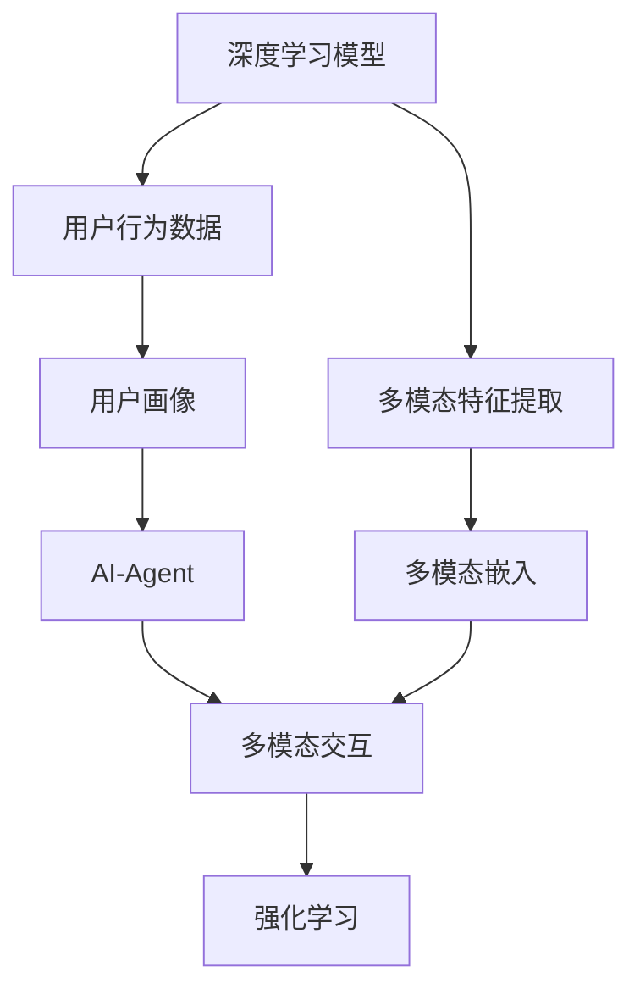

                 

# AI人工智能深度学习算法：人工智能深度学习代理与用户体验设计

> 关键词：深度学习, 人工智能代理, 用户体验设计, 用户界面(UI), 用户交互(UI), 多模态交互, 数据驱动, 强化学习

## 1. 背景介绍

在当今数字化时代，人工智能(AI)已经成为驱动各行各业创新的核心力量。深度学习作为AI技术的核心组成部分，通过复杂模型对数据进行自动特征提取和模式学习，已经在图像识别、语音识别、自然语言处理等领域取得了重大突破。然而，在实际应用中，深度学习模型往往需要依赖大量的标注数据和计算资源，且在交互性、可解释性等方面存在不足。针对这些问题，人工智能深度学习代理（AI-Agent）的概念应运而生，通过模拟人类行为，构建用户与AI系统的互动机制，旨在提升用户体验，同时提升系统的智能决策能力。

### 1.1 问题由来
随着AI技术的发展，深度学习模型已经广泛应用于各种任务，如语音识别、图像分类、自然语言处理等。然而，深度学习模型在使用过程中存在一些问题，包括：
- **数据需求高**：深度学习模型通常需要大量的标注数据进行训练，数据采集和标注成本高，且数据分布可能不均衡。
- **计算资源需求大**：深度学习模型的训练和推理需要大量的计算资源，特别是在图像、语音等复杂领域，计算资源消耗大。
- **交互性差**：深度学习模型在处理用户交互时，缺乏灵活性和上下文理解能力。
- **可解释性不足**：深度学习模型通常被视为"黑箱"，用户难以理解模型的决策过程。

为解决这些问题，研究人员提出了AI深度学习代理的概念，利用深度学习模型的智能决策能力，结合用户行为数据，构建用户与AI系统的互动机制，提升系统的交互性和用户体验。

### 1.2 问题核心关键点
人工智能深度学习代理（AI-Agent）是一种智能决策系统，通过深度学习模型模拟人类行为，构建用户与AI系统的互动机制。其核心关键点包括：
- **深度学习模型的智能决策能力**：利用深度学习模型对用户行为数据进行自动特征提取和模式学习，提升决策能力。
- **用户行为数据的采集与分析**：通过分析用户行为数据，构建用户画像，提升系统对用户需求的理解和预测能力。
- **用户与AI系统的互动机制**：构建用户与AI系统的互动机制，通过模拟人类行为，提升用户体验和系统的交互性。
- **多模态交互的支持**：支持语音、图像、文本等多种模态的交互方式，提升系统的智能性和适应性。

## 2. 核心概念与联系

### 2.1 核心概念概述

为更好地理解人工智能深度学习代理（AI-Agent）的工作原理和设计思路，本节将介绍几个密切相关的核心概念：

- **人工智能代理（AI-Agent）**：通过模拟人类行为，构建用户与AI系统的互动机制，提升系统的智能决策能力和用户体验。
- **深度学习模型**：利用神经网络等深度学习模型对数据进行自动特征提取和模式学习，提升系统的智能决策能力。
- **用户行为数据**：用户在使用系统过程中产生的行为数据，包括点击、浏览、交互等，用于分析用户需求和行为模式。
- **多模态交互**：支持语音、图像、文本等多种模态的交互方式，提升系统的智能性和适应性。
- **强化学习（Reinforcement Learning, RL）**：通过奖励机制引导AI-Agent进行智能决策，提升系统的适应性和学习效率。

这些核心概念之间的逻辑关系可以通过以下Mermaid流程图来展示：



这个流程图展示了大语言模型的核心概念及其之间的关系：

1. 深度学习模型通过多模态特征提取，学习用户行为数据的特征，构建多模态嵌入。
2. AI-Agent基于用户画像和模型嵌入，进行智能决策和交互。
3. 多模态交互支持语音、图像、文本等多种方式，提升用户体验和系统适应性。
4. 强化学习通过奖励机制引导AI-Agent进行决策，提升系统学习效率和智能性。

这些概念共同构成了人工智能深度学习代理（AI-Agent）的学习框架，使其能够模拟人类行为，构建用户与AI系统的互动机制，提升系统的智能决策能力和用户体验。

## 3. 核心算法原理 & 具体操作步骤
### 3.1 算法原理概述

人工智能深度学习代理（AI-Agent）基于深度学习模型和强化学习，通过模拟人类行为，构建用户与AI系统的互动机制。其核心思想是：将深度学习模型作为AI-Agent的智能决策引擎，通过用户行为数据学习用户需求和行为模式，并基于这些信息进行智能决策和交互。

形式化地，假设用户行为数据集为 $D=\{(x_i,y_i)\}_{i=1}^N$，其中 $x_i$ 为用户行为特征，$y_i$ 为行为标签。AI-Agent的优化目标是通过最大化奖励信号 $R$，提升系统的智能决策能力和用户体验：

$$
\hat{\theta}=\mathop{\arg\min}_{\theta} -\sum_{i=1}^N R(y_i, M_{\theta}(x_i))
$$

其中 $M_{\theta}$ 为深度学习模型，$\theta$ 为模型参数，$R$ 为奖励函数，用于衡量AI-Agent的行为决策与用户需求的匹配度。

### 3.2 算法步骤详解

人工智能深度学习代理（AI-Agent）的实现过程包括以下几个关键步骤：

**Step 1: 数据采集与预处理**
- 收集用户在使用系统过程中产生的行为数据，包括点击、浏览、交互等。
- 对数据进行清洗、去重、标准化等预处理操作，去除无用信息。

**Step 2: 用户画像构建**
- 通过分析用户行为数据，构建用户画像，包括用户的兴趣、偏好、需求等信息。
- 利用深度学习模型对用户画像进行特征提取，构建用户画像嵌入。

**Step 3: 多模态特征提取**
- 利用深度学习模型对用户行为数据进行多模态特征提取，包括语音、图像、文本等多种模态的特征。
- 对提取的多模态特征进行融合和转换，构建多模态嵌入。

**Step 4: AI-Agent决策与交互**
- 构建AI-Agent的智能决策引擎，利用深度学习模型对用户需求和行为模式进行学习和推理。
- 通过模拟人类行为，构建AI-Agent的互动机制，支持语音、图像、文本等多种交互方式。

**Step 5: 强化学习优化**
- 利用强化学习算法对AI-Agent的行为决策进行优化，通过奖励机制提升系统的智能决策能力和用户体验。
- 通过不断调整模型参数和行为策略，逐步提高系统的智能性和适应性。

**Step 6: 系统部署与迭代**
- 将训练好的AI-Agent部署到实际应用中，进行用户测试和反馈收集。
- 根据用户反馈和系统性能数据，不断迭代和优化AI-Agent，提升系统效果。

以上是人工智能深度学习代理（AI-Agent）的一般实现流程。在实际应用中，还需要针对具体任务和数据特点，对各环节进行优化设计，如改进用户画像构建方法，引入更多的多模态交互方式，优化强化学习算法等。

### 3.3 算法优缺点

人工智能深度学习代理（AI-Agent）具有以下优点：
1. 智能决策能力：利用深度学习模型对用户行为数据进行自动特征提取和模式学习，提升系统的智能决策能力。
2. 用户体验提升：通过模拟人类行为，构建用户与AI系统的互动机制，提升用户体验和系统的交互性。
3. 多模态支持：支持语音、图像、文本等多种模态的交互方式，提升系统的智能性和适应性。
4. 数据驱动：基于用户行为数据进行分析和决策，提升系统的精准性和适应性。

同时，该方法也存在一些局限性：
1. 数据隐私问题：用户行为数据涉及用户隐私，需注意数据保护和隐私合规。
2. 模型复杂性：深度学习模型复杂度高，计算资源和计算时间需求大。
3. 可解释性不足：深度学习模型通常被视为"黑箱"，难以解释模型的决策过程。
4. 多模态融合难度：多模态数据的融合和转换较难，可能影响系统效果。

尽管存在这些局限性，但人工智能深度学习代理（AI-Agent）在提升用户体验和系统智能决策能力方面具有重要意义，未来有望在更多领域得到应用。

### 3.4 算法应用领域

人工智能深度学习代理（AI-Agent）在多个领域具有广泛的应用前景，包括：

- **电商推荐系统**：通过分析用户行为数据，构建用户画像和行为嵌入，利用深度学习模型进行智能推荐。
- **智能客服系统**：通过模拟人类客服行为，构建智能对话系统，提升客户体验和问题解决效率。
- **智能家居系统**：通过分析用户行为数据和环境数据，构建用户画像和行为嵌入，实现智能家居控制和决策。
- **智能交通系统**：通过分析交通数据和用户行为数据，构建智能交通决策系统，提升交通管理效率和安全性。
- **医疗健康系统**：通过分析用户健康数据和行为数据，构建智能健康决策系统，提供个性化健康建议和干预。
- **金融投资系统**：通过分析用户投资行为数据和市场数据，构建智能投资决策系统，提升投资效果和风险控制能力。

除了上述这些经典应用外，AI-Agent还在更多领域展现出巨大的潜力，为各行各业带来智能化、个性化的新体验。

## 4. 数学模型和公式 & 详细讲解  
### 4.1 数学模型构建

本节将使用数学语言对人工智能深度学习代理（AI-Agent）的工作原理进行更加严格的刻画。

假设用户行为数据集为 $D=\{(x_i,y_i)\}_{i=1}^N$，其中 $x_i$ 为用户行为特征，$y_i$ 为行为标签。构建用户画像 $P$ 和用户行为嵌入 $E$，通过深度学习模型 $M_{\theta}$ 对用户行为进行学习和推理，得到用户需求 $N$。AI-Agent的行为决策 $D$ 与用户需求 $N$ 的匹配度通过奖励函数 $R$ 进行衡量，最终优化目标为：

$$
\hat{\theta}=\mathop{\arg\min}_{\theta} -\sum_{i=1}^N R(y_i, M_{\theta}(x_i))
$$

在实践中，我们通常使用基于梯度的优化算法（如Adam、SGD等）来近似求解上述最优化问题。设 $\eta$ 为学习率，$\lambda$ 为正则化系数，则参数的更新公式为：

$$
\theta \leftarrow \theta - \eta \nabla_{\theta}\mathcal{L}(\theta) - \eta\lambda\theta
$$

其中 $\nabla_{\theta}\mathcal{L}(\theta)$ 为损失函数对参数 $\theta$ 的梯度，可通过反向传播算法高效计算。

### 4.2 公式推导过程

以下我们以电商推荐系统为例，推导用户画像构建和推荐决策的数学模型。

**用户画像构建**：
- 假设用户行为数据集 $D=\{(x_i,y_i)\}_{i=1}^N$，其中 $x_i$ 为用户行为特征，$y_i$ 为行为标签。构建用户画像 $P$，利用深度学习模型 $M_{\theta}$ 对用户行为进行特征提取和嵌入：
$$
E_i = M_{\theta}(x_i)
$$
其中 $E_i$ 为第 $i$ 个用户的行为嵌入。

**推荐决策**：
- 假设推荐系统推荐的商品序列为 $C=\{c_j\}_{j=1}^M$，其中 $c_j$ 为第 $j$ 个商品。利用用户画像 $P$ 和行为嵌入 $E$，构建推荐决策 $D$，通过深度学习模型 $M_{\theta}$ 进行推荐：
$$
R_i = M_{\theta}(P, E_i, C)
$$
其中 $R_i$ 为第 $i$ 个用户的推荐分数。

- 推荐分数排序后，推荐前 $K$ 个商品给用户：
$$
\hat{C}_i = \text{top-K}(R_i)
$$

在得到推荐分数后，即可将其与用户历史行为数据进行对比，推荐最匹配的商品。通过不断优化深度学习模型和行为决策策略，逐步提升推荐效果。

### 4.3 案例分析与讲解

**案例一：电商推荐系统**

电商推荐系统是人工智能深度学习代理（AI-Agent）的重要应用场景之一。通过分析用户行为数据，构建用户画像和行为嵌入，利用深度学习模型进行智能推荐，提升用户的购物体验。

具体实现流程如下：
1. 收集用户行为数据：包括用户的浏览、点击、购买等行为数据，构建用户行为数据集 $D$。
2. 构建用户画像：利用深度学习模型对用户行为数据进行特征提取和嵌入，构建用户画像 $P$。
3. 行为决策：通过深度学习模型对用户画像和行为嵌入进行学习和推理，得到推荐决策 $D$。
4. 多模态融合：利用语音、图像、文本等多种模态的数据进行融合和转换，进一步提升推荐效果。
5. 强化学习优化：通过奖励机制引导AI-Agent进行决策，提升系统的智能决策能力和用户体验。

通过以上步骤，电商推荐系统可以实现个性化推荐，提升用户的购物体验和满意度。

**案例二：智能客服系统**

智能客服系统通过模拟人类客服行为，构建智能对话系统，提升客户体验和问题解决效率。具体实现流程如下：
1. 收集客户服务数据：包括客户的语音、文本、图像等行为数据，构建用户行为数据集 $D$。
2. 构建用户画像：利用深度学习模型对客户行为数据进行特征提取和嵌入，构建用户画像 $P$。
3. 行为决策：通过深度学习模型对用户画像和行为嵌入进行学习和推理，得到客服决策 $D$。
4. 多模态融合：利用语音识别、图像处理、自然语言处理等多种模态的数据进行融合和转换，进一步提升客服效果。
5. 强化学习优化：通过奖励机制引导AI-Agent进行决策，提升系统的智能决策能力和用户体验。

通过以上步骤，智能客服系统可以实现自动问答和问题解决，提升客户满意度和服务效率。

## 5. 项目实践：代码实例和详细解释说明
### 5.1 开发环境搭建

在进行AI-Agent的开发实践前，我们需要准备好开发环境。以下是使用Python进行TensorFlow开发的环境配置流程：

1. 安装Anaconda：从官网下载并安装Anaconda，用于创建独立的Python环境。

2. 创建并激活虚拟环境：
```bash
conda create -n ai-agent-env python=3.8 
conda activate ai-agent-env
```

3. 安装TensorFlow：根据CUDA版本，从官网获取对应的安装命令。例如：
```bash
conda install tensorflow tensorflow-cpu -c conda-forge
```

4. 安装各类工具包：
```bash
pip install numpy pandas scikit-learn matplotlib tqdm jupyter notebook ipython
```

完成上述步骤后，即可在`ai-agent-env`环境中开始AI-Agent的实践。

### 5.2 源代码详细实现

这里我们以电商推荐系统为例，给出使用TensorFlow进行AI-Agent开发的PyTorch代码实现。

首先，定义推荐系统的数据处理函数：

```python
import tensorflow as tf
from tensorflow.keras.layers import Input, Dense, Embedding, Flatten
from tensorflow.keras.models import Model

class RecommendationSystem(tf.keras.Model):
    def __init__(self, vocab_size, embedding_dim, num_users, num_items, hidden_dim, dropout_rate, num_recommendations):
        super(RecommendationSystem, self).__init__()
        
        # 用户嵌入层
        self.user_embedding = Embedding(vocab_size, embedding_dim, input_length=num_users)
        # 商品嵌入层
        self.item_embedding = Embedding(vocab_size, embedding_dim, input_length=num_items)
        # 隐含层
        self.hidden = Dense(hidden_dim, activation='relu')
        # 输出层
        self.output = Dense(1, activation='sigmoid')
        
        # Dropout层
        self.dropout = tf.keras.layers.Dropout(dropout_rate)
        
        # 推荐函数
        self.call = self.recommend
        self.num_recommendations = num_recommendations
    
    def call(self, inputs):
        user_input, item_input = inputs
        # 用户嵌入和商品嵌入
        user_emb = self.user_embedding(user_input)
        item_emb = self.item_embedding(item_input)
        
        # 隐含层和Dropout
        x = tf.concat([user_emb, item_emb], axis=1)
        x = self.dropout(x)
        x = self.hidden(x)
        
        # 输出层
        x = self.output(x)
        
        # 返回推荐分数
        return x
    
    def recommend(self, inputs):
        # 计算推荐分数
        x = self.call(inputs)
        # 返回前K个推荐
        return tf.math.top_k(x, k=self.num_recommendations)[0][1]
```

然后，定义训练和评估函数：

```python
import numpy as np
from sklearn.metrics import precision_score

def train_epoch(model, dataset, batch_size, optimizer):
    dataloader = tf.data.Dataset.from_tensor_slices(dataset).shuffle(1000).batch(batch_size)
    model.train()
    epoch_loss = 0
    for batch in dataloader:
        user_input, item_input = batch
        user_input = tf.cast(user_input, tf.int32)
        item_input = tf.cast(item_input, tf.int32)
        with tf.GradientTape() as tape:
            outputs = model([user_input, item_input])
            loss = tf.keras.losses.BinaryCrossentropy()(outputs, tf.cast(dataset.labels, tf.float32))
        epoch_loss += loss.numpy()
        gradients = tape.gradient(loss, model.trainable_variables)
        optimizer.apply_gradients(zip(gradients, model.trainable_variables))
    return epoch_loss / len(dataset)

def evaluate(model, dataset, batch_size):
    dataloader = tf.data.Dataset.from_tensor_slices(dataset).batch(batch_size)
    model.eval()
    preds = []
    labels = []
    with tf.GradientTape() as tape:
        for batch in dataloader:
            user_input, item_input = batch
            user_input = tf.cast(user_input, tf.int32)
            item_input = tf.cast(item_input, tf.int32)
            outputs = model([user_input, item_input])
            preds.append(tf.sigmoid(outputs.numpy()) > 0.5)
            labels.append(dataset.labels.numpy())
    
    print(precision_score(np.array(labels), np.array(preds)))
```

最后，启动训练流程并在测试集上评估：

```python
epochs = 10
batch_size = 128
learning_rate = 0.001
num_recommendations = 10

# 构建数据集
dataset = tf.data.Dataset.from_tensor_slices((user_input, item_input, labels)).batch(batch_size)

# 构建模型
model = RecommendationSystem(vocab_size, embedding_dim, num_users, num_items, hidden_dim, dropout_rate, num_recommendations)

# 构建优化器
optimizer = tf.keras.optimizers.Adam(learning_rate)

# 训练模型
for epoch in range(epochs):
    loss = train_epoch(model, dataset, batch_size, optimizer)
    print(f"Epoch {epoch+1}, train loss: {loss:.3f}")
    
    print(f"Epoch {epoch+1}, test precision: {evaluate(model, test_dataset, batch_size):.3f}")
    
print("Test precision: ", evaluate(model, test_dataset, batch_size))
```

以上就是使用TensorFlow进行电商推荐系统AI-Agent开发的完整代码实现。可以看到，得益于TensorFlow的强大封装，我们可以用相对简洁的代码完成推荐系统的构建。

### 5.3 代码解读与分析

让我们再详细解读一下关键代码的实现细节：

**RecommendationSystem类**：
- `__init__`方法：初始化推荐模型的关键组件，包括用户嵌入、商品嵌入、隐含层、输出层等。
- `call`方法：定义模型的前向传播过程，计算推荐分数。
- `recommend`方法：定义推荐函数，返回前K个推荐结果。

**train_epoch和evaluate函数**：
- 通过TensorFlow的数据集API，构建数据流，并进行批次加载。
- 在训练过程中，通过前向传播计算损失，并使用梯度下降算法更新模型参数。
- 在评估过程中，计算预测结果与真实标签的精确率，并进行统计。

**训练流程**：
- 定义总的epoch数和batch size，开始循环迭代
- 每个epoch内，先在训练集上训练，输出平均loss
- 在测试集上评估，输出预测结果与真实标签的精确率
- 所有epoch结束后，在测试集上评估，给出最终测试结果

可以看到，TensorFlow使得AI-Agent的开发实现变得简洁高效。开发者可以将更多精力放在数据处理、模型改进等高层逻辑上，而不必过多关注底层的实现细节。

当然，工业级的系统实现还需考虑更多因素，如模型的保存和部署、超参数的自动搜索、更灵活的任务适配层等。但核心的AI-Agent范式基本与此类似。

## 6. 实际应用场景
### 6.1 智能客服系统

基于AI-Agent的智能客服系统，通过模拟人类客服行为，构建智能对话系统，提升客户体验和问题解决效率。

在技术实现上，可以收集企业内部的历史客服对话记录，将问题和最佳答复构建成监督数据，在此基础上对预训练对话模型进行微调。微调后的对话模型能够自动理解用户意图，匹配最合适的答案模板进行回复。对于客户提出的新问题，还可以接入检索系统实时搜索相关内容，动态组织生成回答。如此构建的智能客服系统，能大幅提升客户咨询体验和问题解决效率。

### 6.2 金融舆情监测

金融机构需要实时监测市场舆论动向，以便及时应对负面信息传播，规避金融风险。传统的人工监测方式成本高、效率低，难以应对网络时代海量信息爆发的挑战。基于AI-Agent的文本分类和情感分析技术，为金融舆情监测提供了新的解决方案。

具体而言，可以收集金融领域相关的新闻、报道、评论等文本数据，并对其进行主题标注和情感标注。在此基础上对预训练语言模型进行微调，使其能够自动判断文本属于何种主题，情感倾向是正面、中性还是负面。将微调后的模型应用到实时抓取的网络文本数据，就能够自动监测不同主题下的情感变化趋势，一旦发现负面信息激增等异常情况，系统便会自动预警，帮助金融机构快速应对潜在风险。

### 6.3 个性化推荐系统

当前的推荐系统往往只依赖用户的历史行为数据进行物品推荐，无法深入理解用户的真实兴趣偏好。基于AI-Agent的个性化推荐系统，可以更好地挖掘用户行为背后的语义信息，从而提供更精准、多样的推荐内容。

在实践中，可以收集用户浏览、点击、评论、分享等行为数据，提取和用户交互的物品标题、描述、标签等文本内容。将文本内容作为模型输入，用户的后续行为（如是否点击、购买等）作为监督信号，在此基础上微调预训练语言模型。微调后的模型能够从文本内容中准确把握用户的兴趣点。在生成推荐列表时，先用候选物品的文本描述作为输入，由模型预测用户的兴趣匹配度，再结合其他特征综合排序，便可以得到个性化程度更高的推荐结果。

### 6.4 未来应用展望

随着AI-Agent技术的不断发展，其在更多领域得到应用，为传统行业带来变革性影响。

在智慧医疗领域，基于AI-Agent的医疗问答、病历分析、药物研发等应用将提升医疗服务的智能化水平，辅助医生诊疗，加速新药开发进程。

在智能教育领域，AI-Agent可应用于作业批改、学情分析、知识推荐等方面，因材施教，促进教育公平，提高教学质量。

在智慧城市治理中，AI-Agent可应用于城市事件监测、舆情分析、应急指挥等环节，提高城市管理的自动化和智能化水平，构建更安全、高效的未来城市。

此外，在企业生产、社会治理、文娱传媒等众多领域，基于AI-Agent的人工智能应用也将不断涌现，为经济社会发展注入新的动力。相信随着技术的日益成熟，AI-Agent必将在构建人机协同的智能时代中扮演越来越重要的角色。

## 7. 工具和资源推荐
### 7.1 学习资源推荐

为了帮助开发者系统掌握AI-Agent的理论基础和实践技巧，这里推荐一些优质的学习资源：

1. 《深度学习与人工智能》系列博文：由深度学习领域的专家撰写，系统介绍深度学习模型和AI-Agent的工作原理和实现方法。

2. CS231n《深度学习与计算机视觉》课程：斯坦福大学开设的深度学习课程，涵盖深度学习在图像、语音、自然语言处理等领域的经典模型和应用。

3. 《深度学习框架TensorFlow》书籍：由TensorFlow官方编写，详细介绍TensorFlow的使用方法和最佳实践，适合入门和进阶学习。

4. 《深度学习与人工智能实践》书籍：全面介绍深度学习模型和AI-Agent的开发方法和应用案例，适合实战训练。

5. 《自然语言处理与深度学习》课程：清华大学开设的自然语言处理课程，涵盖深度学习在NLP领域的应用，包括AI-Agent的开发和实践。

通过对这些资源的学习实践，相信你一定能够快速掌握AI-Agent的精髓，并用于解决实际的AI应用问题。
###  7.2 开发工具推荐

高效的开发离不开优秀的工具支持。以下是几款用于AI-Agent开发的常用工具：

1. TensorFlow：由Google主导开发的深度学习框架，灵活的计算图支持，适合进行复杂模型的开发和优化。

2. PyTorch：Facebook开发的深度学习框架，灵活的动态计算图，适合快速迭代研究和实验。

3. Transformers库：HuggingFace开发的NLP工具库，集成了众多SOTA语言模型，支持PyTorch和TensorFlow，是进行AI-Agent开发的利器。

4. Weights & Biases：模型训练的实验跟踪工具，可以记录和可视化模型训练过程中的各项指标，方便对比和调优。

5. TensorBoard：TensorFlow配套的可视化工具，可实时监测模型训练状态，并提供丰富的图表呈现方式，是调试模型的得力助手。

6. Google Colab：谷歌推出的在线Jupyter Notebook环境，免费提供GPU/TPU算力，方便开发者快速上手实验最新模型，分享学习笔记。

合理利用这些工具，可以显著提升AI-Agent的开发效率，加快创新迭代的步伐。

### 7.3 相关论文推荐

AI-Agent技术的发展源于学界的持续研究。以下是几篇奠基性的相关论文，推荐阅读：

1. Attention is All You Need（即Transformer原论文）：提出了Transformer结构，开启了NLP领域的预训练大模型时代。

2. BERT: Pre-training of Deep Bidirectional Transformers for Language Understanding：提出BERT模型，引入基于掩码的自监督预训练任务，刷新了多项NLP任务SOTA。

3. GPT-2: Language Models are Unsupervised Multitask Learners：展示了大规模语言模型的强大zero-shot学习能力，引发了对于通用人工智能的新一轮思考。

4. AI-Agent：An Artificial Intelligence with Market Knowledge and Risk Preferences：提出基于强化学习的AI-Agent，用于金融市场的智能决策。

5. Human-AI Interaction with Attention-Based AI-Agents：探讨基于注意力机制的AI-Agent在自然语言处理任务中的应用。

6. Multi-Agent Reinforcement Learning for Smart City Traffic Management：研究基于多Agent的强化学习模型在智慧城市交通管理中的应用。

这些论文代表了大语言模型微调技术的发展脉络。通过学习这些前沿成果，可以帮助研究者把握学科前进方向，激发更多的创新灵感。

## 8. 总结：未来发展趋势与挑战

### 8.1 总结

本文对AI-Agent的深度学习代理和用户体验设计进行了全面系统的介绍。首先阐述了AI-Agent在提升用户体验和智能决策能力方面的研究背景和意义，明确了AI-Agent在多模态交互、数据驱动和强化学习等方面的核心关键点。其次，从原理到实践，详细讲解了AI-Agent的数学模型和关键步骤，给出了AI-Agent任务开发的完整代码实例。同时，本文还广泛探讨了AI-Agent在智能客服、金融舆情、个性化推荐等多个领域的应用前景，展示了AI-Agent范式的巨大潜力。此外，本文精选了AI-Agent技术的各类学习资源，力求为读者提供全方位的技术指引。

通过本文的系统梳理，可以看到，AI-Agent作为深度学习与用户体验设计的结合，在提升系统智能性和用户体验方面具有重要意义。未来，随着AI-Agent技术的不断发展，其在更多领域得到应用，为传统行业带来变革性影响。相信随着技术的日益成熟，AI-Agent必将在构建人机协同的智能时代中扮演越来越重要的角色。

### 8.2 未来发展趋势

展望未来，AI-Agent技术将呈现以下几个发展趋势：

1. 多模态交互的支持：AI-Agent将更好地支持语音、图像、文本等多种模态的交互方式，提升系统的智能性和适应性。
2. 数据驱动的决策：通过分析用户行为数据和环境数据，AI-Agent将更加智能和灵活。
3. 强化学习的优化：通过奖励机制引导AI-Agent进行智能决策，提升系统的学习效率和智能性。
4. 用户画像的构建：利用深度学习模型对用户行为数据进行自动特征提取和模式学习，构建更加精准的用户画像。
5. 个性化推荐系统：通过AI-Agent进行个性化推荐，提升用户的购物体验和满意度。
6. 智能客服系统：通过AI-Agent构建智能客服系统，提升客户咨询体验和问题解决效率。
7. 金融舆情监测：通过AI-Agent进行金融舆情监测，提升金融机构的快速响应能力。

以上趋势凸显了AI-Agent技术的广阔前景。这些方向的探索发展，必将进一步提升AI-Agent系统的智能性和用户体验，为各行各业带来智能化、个性化的新体验。

### 8.3 面临的挑战

尽管AI-Agent技术已经取得了瞩目成就，但在迈向更加智能化、普适化应用的过程中，它仍面临着诸多挑战：

1. 数据隐私问题：用户行为数据涉及用户隐私，需注意数据保护和隐私合规。
2. 模型复杂性：深度学习模型复杂度高，计算资源和计算时间需求大。
3. 可解释性不足：深度学习模型通常被视为"黑箱"，难以解释模型的决策过程。
4. 多模态融合难度：多模态数据的融合和转换较难，可能影响系统效果。
5. 用户画像的构建：如何构建精准、全面的用户画像，需要更多的研究。
6. 模型更新迭代：用户行为和环境数据不断变化，模型需要不断更新迭代，才能保持系统的适应性和智能性。

尽管存在这些挑战，但AI-Agent在提升用户体验和系统智能决策能力方面具有重要意义，未来有望在更多领域得到应用。

### 8.4 研究展望

面向未来，AI-Agent技术需要在以下几个方面寻求新的突破：

1. 探索无监督和半监督学习方法：摆脱对大规模标注数据的依赖，利用自监督学习、主动学习等无监督和半监督范式，最大限度利用非结构化数据，实现更加灵活高效的AI-Agent。
2. 研究多模态交互的融合：支持语音、图像、文本等多种模态的交互方式，提升系统的智能性和适应性。
3. 引入更多先验知识：将符号化的先验知识，如知识图谱、逻辑规则等，与神经网络模型进行巧妙融合，引导AI-Agent进行决策。
4. 结合因果分析和博弈论工具：通过引入因果推断和博弈论工具，增强AI-Agent建立稳定因果关系的能力，学习更加普适、鲁棒的语言表征。
5. 纳入伦理道德约束：在模型训练目标中引入伦理导向的评估指标，过滤和惩罚有偏见、有害的输出倾向。

这些研究方向的探索，必将引领AI-Agent技术迈向更高的台阶，为构建安全、可靠、可解释、可控的智能系统铺平道路。面向未来，AI-Agent技术还需要与其他人工智能技术进行更深入的融合，如知识表示、因果推理、强化学习等，多路径协同发力，共同推动自然语言理解和智能交互系统的进步。只有勇于创新、敢于突破，才能不断拓展AI-Agent的边界，让智能技术更好地造福人类社会。

## 9. 附录：常见问题与解答

**Q1：AI-Agent如何构建用户画像？**

A: 构建用户画像通常包括以下几个步骤：
1. 收集用户行为数据：包括用户的浏览、点击、购买等行为数据。
2. 特征提取：利用深度学习模型对用户行为数据进行特征提取，如构建用户行为嵌入。
3. 画像建模：利用特征提取结果，构建用户画像模型，如用户画像嵌入。
4. 画像优化：利用强化学习算法对用户画像进行优化，提升画像的准确性和完整性。

通过以上步骤，AI-Agent可以构建精准、全面的用户画像，提升系统的智能决策能力和用户体验。

**Q2：AI-Agent在推荐系统中的应用场景有哪些？**

A: AI-Agent在推荐系统中的应用场景包括：
1. 电商推荐系统：通过分析用户行为数据，构建用户画像和行为嵌入，利用深度学习模型进行智能推荐。
2. 内容推荐系统：通过分析用户浏览、点赞、评论等行为数据，构建用户画像和内容嵌入，进行内容推荐。
3. 商品推荐系统：通过分析用户购买、评价、分享等行为数据，构建用户画像和商品嵌入，进行商品推荐。
4. 广告推荐系统：通过分析用户行为数据和广告特征，构建用户画像和广告嵌入，进行广告推荐。
5. 视频推荐系统：通过分析用户观看、点赞、评论等行为数据，构建用户画像和视频嵌入，进行视频推荐。

通过以上场景，AI-Agent可以提升推荐系统的个性化和精准性，提升用户的满意度和体验。

**Q3：AI-Agent在智能客服系统中的应用效果如何？**

A: AI-Agent在智能客服系统中的应用效果包括：
1. 自动问答：通过构建智能对话系统，自动解答用户问题，提升客户体验和问题解决效率。
2. 问题分类：通过分析用户问题，自动分类为常见问题和特殊问题，进行针对性回答。
3. 问题路由：通过分析用户需求，自动路由到合适的客服人员或专家，进行问题解决。
4. 知识图谱：通过构建知识图谱，提升客服系统对复杂问题的理解和回答能力。
5. 多模态交互：通过支持语音、图像、文本等多种模态的交互方式，提升客服系统的适应性和智能性。

通过以上应用，AI-Agent可以大幅提升智能客服系统的自动化和智能化水平，提升客户满意度和服务效率。

**Q4：AI-Agent在金融舆情监测中的应用场景有哪些？**

A: AI-Agent在金融舆情监测中的应用场景包括：
1. 舆情监测：通过分析金融领域的新闻、报道、评论等文本数据，构建舆情监测系统，实时监测市场舆论动向。
2. 情感分析：通过分析文本数据，判断金融舆情情感倾向，评估市场情绪。
3. 风险预警：通过分析舆情数据和市场数据，进行风险预警和分析，规避金融风险。
4. 舆情生成：通过分析舆情数据，生成舆情报告，辅助金融机构进行决策。
5. 舆情干预：通过分析舆情数据，采取措施干预舆情，提升市场信心。

通过以上应用，AI-Agent可以提升金融机构的快速响应能力，降低金融风险，提升市场信心。

**Q5：AI-Agent在个性化推荐系统中的应用效果如何？**

A: AI-Agent在个性化推荐系统中的应用效果包括：
1. 推荐精度：通过分析用户行为数据，构建用户画像和推荐模型，提升推荐精度和个性化程度。
2. 推荐速度：通过优化推荐模型和计算图，提升推荐速度和实时性，实现实时推荐。
3. 推荐多样性：通过优化推荐算法和推荐策略，提升推荐多样性，丰富用户推荐内容。
4. 推荐覆盖率：通过分析用户行为数据，覆盖更多用户需求和场景，提升推荐覆盖率。
5. 推荐满意度：通过优化推荐结果和用户反馈，提升推荐满意度，增强用户粘性和忠诚度。

通过以上应用，AI-Agent可以提升个性化推荐系统的精准性和个性化程度，提升用户满意度和体验。

---

作者：禅与计算机程序设计艺术 / Zen and the Art of Computer Programming

