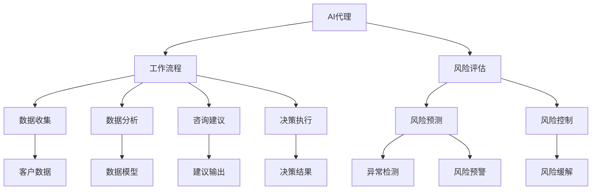

                 

# AI代理在金融服务中的工作流程与风险评估

> 关键词：AI代理,金融服务,工作流程,风险评估

## 1. 背景介绍

在当今金融服务领域，随着数字化转型的加速，AI技术，特别是人工智能代理(AI agents)，正迅速成为提升服务效率、降低运营成本的关键工具。AI代理不仅能够处理大量的客户查询，还能在复杂的金融场景中提供准确的建议和决策支持。然而，AI代理的广泛应用也带来了新的挑战，特别是在风险评估和合规性方面。本文将全面探讨AI代理在金融服务中的工作流程与风险评估方法，以期为金融机构的AI应用提供实用的参考。

## 2. 核心概念与联系

### 2.1 核心概念概述

为更好地理解AI代理在金融服务中的应用，本节将介绍几个关键概念：

- **AI代理(AI agent)**：使用人工智能技术构建的自动化系统，能够处理客户查询、提供咨询、进行决策等。常见的AI代理包括聊天机器人、虚拟助手、智能投顾等。

- **工作流程(Workflow)**：指AI代理在金融服务中的自动化工作流程，包括客户查询处理、数据收集、分析、咨询建议、决策执行等环节。

- **风险评估(Risk Assessment)**：指通过数据分析和机器学习算法，对AI代理在金融服务中的行为进行风险评估，确保其决策的准确性和合规性。

- **合规性(Compliance)**：指AI代理在金融服务中的行为符合法律法规和行业标准，如数据隐私保护、反洗钱、反欺诈等。

这些核心概念之间的逻辑关系可以通过以下Mermaid流程图来展示：



这个流程图展示了大语言模型的核心概念及其之间的关系：

1. AI代理通过工作流程在金融服务中自动化任务。
2. 风险评估对AI代理的决策和行为进行监控和预测，确保合规性。
3. 数据收集和分析为AI代理提供数据支持。
4. 咨询建议和决策执行是AI代理的核心功能。
5. 风险预测、异常检测、风险控制等方法用于风险评估。

## 3. 核心算法原理 & 具体操作步骤
### 3.1 算法原理概述

AI代理在金融服务中的工作流程主要包括以下几个关键环节：

1. **客户查询处理**：AI代理通过自然语言处理(NLP)技术，理解客户查询并匹配相应的处理逻辑。
2. **数据收集与分析**：AI代理从不同渠道收集客户数据，使用机器学习算法进行分析和挖掘。
3. **咨询建议**：根据数据和分析结果，AI代理生成咨询建议。
4. **决策执行**：AI代理根据决策规则，自动执行相关操作，如账户开户、贷款审批等。

在风险评估方面，主要包括以下几个步骤：

1. **风险预测**：使用机器学习模型预测AI代理在金融服务中的风险概率。
2. **异常检测**：通过监控AI代理的行为，识别异常操作和潜在风险。
3. **风险控制**：对识别出的风险采取相应的控制措施，如冻结账户、限制交易等。

### 3.2 算法步骤详解

**客户查询处理**：

1. **输入处理**：将客户查询转换为结构化数据。
2. **意图识别**：使用NLP技术，识别客户查询的意图。
3. **逻辑匹配**：将识别出的意图匹配到相应的处理逻辑。
4. **输出响应**：根据匹配的处理逻辑，生成响应文本或执行操作。

**数据收集与分析**：

1. **数据源整合**：从银行账户、信贷记录、交易记录等渠道收集客户数据。
2. **数据清洗**：去除噪声和异常值，确保数据质量。
3. **特征工程**：选择合适的特征，用于机器学习模型的训练。
4. **模型训练**：使用监督学习算法，训练数据模型，用于预测客户行为和风险。

**咨询建议**：

1. **信息抽取**：从客户数据中提取关键信息，如信用评分、收入水平等。
2. **知识图谱构建**：使用图神经网络等技术，构建客户与金融产品的关系图谱。
3. **推理引擎**：根据图谱和规则，生成咨询建议。
4. **输出响应**：将咨询建议转换为用户可理解的形式，提供给客户。

**决策执行**：

1. **规则引擎**：定义决策规则，用于指导AI代理的决策。
2. **模型调用**：调用机器学习模型，获取风险预测结果。
3. **决策生成**：根据规则和模型结果，生成决策指令。
4. **操作执行**：自动执行决策指令，如完成贷款审批、账户开户等。

### 3.3 算法优缺点

AI代理在金融服务中的工作流程与风险评估方法具有以下优点：

1. **效率提升**：AI代理能够处理大量的客户查询和决策任务，显著提升服务效率。
2. **成本降低**：通过自动化操作，减少人力需求，降低运营成本。
3. **一致性增强**：AI代理遵循预定义的规则和模型，提供一致性的服务。
4. **风险控制**：通过风险评估方法，能够提前识别和控制潜在风险，保障客户利益。

同时，该方法也存在以下局限性：

1. **数据依赖**：AI代理依赖高质量的数据输入，数据缺失或异常将影响其表现。
2. **模型鲁棒性**：机器学习模型可能过拟合于特定数据，泛化能力有限。
3. **解释性不足**：AI代理的决策过程难以解释，缺乏透明性。
4. **法律合规**：AI代理的决策需要符合法律法规，避免侵犯客户隐私和权益。

尽管存在这些局限性，但就目前而言，基于AI代理的金融服务工作流程和风险评估方法仍是大规模应用的主流范式。未来相关研究的重点在于如何进一步提高数据质量、增强模型鲁棒性、提升决策透明度，同时兼顾合规性要求。

### 3.4 算法应用领域

AI代理在金融服务中的应用领域广泛，涵盖多个关键环节：

- **客户服务**：提供24/7的客户查询处理、咨询建议、交易办理等。
- **信贷审批**：基于客户数据和模型预测，进行贷款审批和信用评估。
- **风险管理**：通过监控和预测，识别潜在风险，并采取相应的风险控制措施。
- **合规性审查**：确保AI代理的决策符合数据隐私保护、反洗钱、反欺诈等法律法规。

## 4. 数学模型和公式 & 详细讲解 & 举例说明

### 4.1 数学模型构建

在金融服务中，AI代理的风险评估通常基于以下数学模型：

1. **风险概率预测模型**：使用逻辑回归、随机森林等算法，预测客户行为的风险概率。
2. **异常检测模型**：使用孤立森林、One-Class SVM等算法，识别异常操作。
3. **风险控制模型**：使用规则引擎和决策树等算法，制定风险控制措施。

### 4.2 公式推导过程

以风险概率预测模型为例，假设有一个包含$m$个特征的客户样本数据集$D=\{(x_i,y_i)\}_{i=1}^m$，其中$x_i=(x_{i1},x_{i2},\dots,x_{im})$为特征向量，$y_i$为风险标签（0表示低风险，1表示高风险）。我们可以使用逻辑回归模型来预测客户行为的风险概率，公式如下：

$$
P(y_i=1|x_i;\theta) = \sigma(\theta^Tx_i)
$$

其中$\sigma$为逻辑函数，$\theta$为模型参数。根据训练数据集，可以使用最大似然估计求解$\theta$：

$$
\hat{\theta} = \arg\min_{\theta} \frac{1}{m}\sum_{i=1}^m [y_i\log\sigma(\theta^Tx_i)+(1-y_i)\log(1-\sigma(\theta^Tx_i))]
$$

### 4.3 案例分析与讲解

假设某银行希望使用AI代理进行贷款审批，并使用逻辑回归模型进行风险预测。我们可以从银行的数据库中收集到客户的个人信息、信用评分、收入水平、是否有逾期记录等特征。

1. **数据准备**：选择包含这些特征的客户样本数据，进行数据清洗和特征工程。
2. **模型训练**：使用逻辑回归算法训练模型，得到预测客户贷款风险的概率。
3. **模型评估**：在验证集上评估模型性能，选择最优模型进行部署。
4. **风险控制**：设定风险阈值，根据模型预测结果进行贷款审批。

## 5. 项目实践：代码实例和详细解释说明
### 5.1 开发环境搭建

在进行金融服务中的AI代理开发和风险评估前，我们需要准备好开发环境。以下是使用Python进行Scikit-learn和TensorFlow开发的环境配置流程：

1. 安装Anaconda：从官网下载并安装Anaconda，用于创建独立的Python环境。

2. 创建并激活虚拟环境：
```bash
conda create -n financial-agent python=3.8 
conda activate financial-agent
```

3. 安装Scikit-learn和TensorFlow：根据CUDA版本，从官网获取对应的安装命令。例如：
```bash
conda install scikit-learn tensorflow cudatoolkit=11.1 -c pytorch -c conda-forge
```

4. 安装各类工具包：
```bash
pip install pandas numpy matplotlib jupyter notebook ipython
```

完成上述步骤后，即可在`financial-agent`环境中开始开发。

### 5.2 源代码详细实现

这里我们以贷款审批任务为例，给出使用Scikit-learn和TensorFlow对AI代理进行风险评估的Python代码实现。

首先，定义贷款审批数据集：

```python
import pandas as pd

# 读取贷款审批数据集
loan_data = pd.read_csv('loan_approval.csv')

# 提取特征和标签
features = loan_data[['income', 'credit_score', 'loan_amount']]
labels = loan_data['default']
```

然后，定义模型并进行训练：

```python
from sklearn.linear_model import LogisticRegression
from sklearn.model_selection import train_test_split

# 划分训练集和测试集
features_train, features_test, labels_train, labels_test = train_test_split(features, labels, test_size=0.2, random_state=42)

# 初始化逻辑回归模型
model = LogisticRegression()

# 训练模型
model.fit(features_train, labels_train)

# 评估模型
score = model.score(features_test, labels_test)
print(f"模型评估得分：{score:.2f}")
```

接下来，进行异常检测和风险控制：

```python
from sklearn.ensemble import IsolationForest
from sklearn.tree import DecisionTreeClassifier

# 进行异常检测
model = IsolationForest()
model.fit(features_train)

# 进行风险控制
model = DecisionTreeClassifier()
model.fit(features_train, labels_train)
```

最后，启动贷款审批流程：

```python
import tensorflow as tf
from tensorflow.keras import layers

# 定义神经网络模型
model = tf.keras.Sequential([
    layers.Dense(64, activation='relu', input_shape=(features.shape[1],)),
    layers.Dense(1, activation='sigmoid')
])

# 编译模型
model.compile(optimizer='adam', loss='binary_crossentropy', metrics=['accuracy'])

# 训练模型
model.fit(features_train, labels_train)

# 评估模型
score = model.evaluate(features_test, labels_test)
print(f"模型评估得分：{score:.2f}")
```

以上就是使用Scikit-learn和TensorFlow对贷款审批任务进行AI代理开发和风险评估的完整代码实现。可以看到，Scikit-learn和TensorFlow提供了丰富的工具库，使得金融服务中的AI代理开发和风险评估变得更加简洁高效。

### 5.3 代码解读与分析

让我们再详细解读一下关键代码的实现细节：

**贷款审批数据集**：
- 使用Pandas库读取贷款审批数据集，提取特征和标签。

**模型训练**：
- 使用Scikit-learn的LogisticRegression算法进行训练，得到贷款风险预测模型。
- 在验证集上评估模型性能，得到模型评估得分。

**异常检测和风险控制**：
- 使用Scikit-learn的IsolationForest算法进行异常检测，识别出异常操作。
- 使用Scikit-learn的DecisionTreeClassifier算法进行风险控制，制定风险控制措施。

**神经网络模型**：
- 使用TensorFlow构建神经网络模型，进行端到端的贷款审批和风险评估。
- 使用TensorFlow的Sequential API定义模型结构，包含两个全连接层和输出层。
- 编译模型，并使用Adam优化器进行训练和评估。

可以看到，Scikit-learn和TensorFlow在金融服务中的AI代理开发和风险评估中发挥了重要作用。开发者可以灵活选择不同的模型和算法，根据具体任务进行调整和优化。

当然，工业级的系统实现还需考虑更多因素，如模型的保存和部署、超参数的自动搜索、更灵活的任务适配层等。但核心的AI代理开发和风险评估流程基本与此类似。

## 6. 实际应用场景
### 6.1 智能投顾

智能投顾是AI代理在金融服务中的重要应用场景。传统投顾依赖高成本的线下咨询，难以覆盖大量客户。而智能投顾通过分析客户数据，生成个性化的投资建议，帮助客户制定合理的资产配置策略。

在技术实现上，可以收集客户的历史交易记录、资产配置偏好、风险承受能力等数据，训练模型预测客户的最佳投资组合。同时，智能投顾还需要具备风险评估和控制能力，及时调整投资策略以应对市场波动。

### 6.2 反欺诈检测

金融欺诈是银行和金融机构面临的重大风险之一。传统的反欺诈检测依赖人工审查和规则匹配，难以应对复杂多变的欺诈手段。AI代理通过监控客户行为和交易记录，使用机器学习算法进行实时欺诈检测。

具体而言，可以收集客户的交易数据，使用异常检测算法识别出异常行为和交易，及时触发欺诈预警，并进行人工审核。同时，AI代理还需要具备一定的解释能力，帮助人工审核人员理解模型预测的逻辑和原因。

### 6.3 客户服务自动化

客户服务是金融机构的日常运营关键环节。AI代理能够自动处理客户咨询，提供快速响应的服务，缓解人力不足的压力。

在实际应用中，AI代理可以根据客户查询进行意图识别，自动匹配相应的知识库查询和回答，或者转接至人工客服。AI代理还需要具备一定的风险评估能力，识别潜在问题并及时提示人工客服处理。

### 6.4 未来应用展望

随着AI技术的不断发展，基于AI代理的金融服务将呈现以下几个发展趋势：

1. **多模态融合**：AI代理将支持文本、语音、图像等多模态数据融合，提供更加全面和准确的服务。
2. **跨领域应用**：AI代理将不仅仅局限于金融服务，还将在医疗、保险、零售等领域得到广泛应用。
3. **实时性和动态性**：AI代理将具备更高的实时性和动态性，能够快速响应市场变化和客户需求。
4. **可解释性和透明性**：AI代理将具备更高的可解释性和透明性，便于客户和监管机构理解和使用。
5. **人机协同**：AI代理将与人工服务相融合，形成人机协同的智能客服系统，提升服务质量和客户满意度。

这些趋势将使得AI代理在金融服务中的作用更加重要，推动金融机构智能化转型的加速发展。

## 7. 工具和资源推荐
### 7.1 学习资源推荐

为了帮助开发者系统掌握AI代理在金融服务中的应用，这里推荐一些优质的学习资源：

1. **《金融大数据与智能投顾》课程**：由上海交通大学开设的金融科技课程，涵盖AI在金融服务中的应用，包括智能投顾、风险评估、客户服务自动化等。

2. **Kaggle金融数据集**：Kaggle上提供了大量的金融数据集，可用于数据挖掘和机器学习模型的训练和评估。

3. **《深度学习与金融工程》书籍**：该书系统介绍了深度学习在金融工程中的应用，包括金融市场预测、量化交易、风险管理等。

4. **金融科技博客**：如FinTech Weekly、FinTech Today等，提供金融科技领域的最新动态和前沿技术。

5. **Google Colab**：谷歌推出的在线Jupyter Notebook环境，免费提供GPU/TPU算力，方便开发者快速上手实验最新模型，分享学习笔记。

通过对这些资源的学习实践，相信你一定能够快速掌握AI代理在金融服务中的应用，并用于解决实际的金融问题。

### 7.2 开发工具推荐

高效的开发离不开优秀的工具支持。以下是几款用于金融服务中的AI代理开发的常用工具：

1. **Python**：作为主流编程语言，Python在金融服务中的应用广泛，支持丰富的金融和数据处理库。

2. **Scikit-learn**：提供高效的数据处理和机器学习工具，适用于金融数据分析和模型训练。

3. **TensorFlow**：由Google主导开发的深度学习框架，支持分布式训练和模型部署，适用于大规模金融数据处理。

4. **Keras**：基于TensorFlow的高级神经网络API，适合快速原型开发和模型训练。

5. **Jupyter Notebook**：提供交互式编程环境，便于数据探索和模型调试。

6. **Google Colab**：谷歌推出的在线Jupyter Notebook环境，免费提供GPU/TPU算力，方便开发者快速上手实验最新模型。

合理利用这些工具，可以显著提升AI代理在金融服务中的开发效率，加快创新迭代的步伐。

### 7.3 相关论文推荐

AI代理在金融服务中的应用源于学界的持续研究。以下是几篇奠基性的相关论文，推荐阅读：

1. **“Deep learning for customer service”**：研究深度学习在客户服务中的应用，提出基于深度学习的智能客服系统。

2. **“Deep learning for fraud detection”**：提出使用深度学习进行金融欺诈检测，引入卷积神经网络(CNN)和长短期记忆网络(LSTM)等技术。

3. **“Adaptive AI in finance”**：研究金融场景下的自适应AI技术，提出基于自适应机制的智能投顾系统。

4. **“AI-driven financial risk management”**：研究AI在金融风险管理中的应用，包括信用风险、市场风险、操作风险等。

5. **“AI for real-time financial analysis”**：提出使用深度学习进行实时金融分析，引入时间序列预测和异常检测技术。

这些论文代表了大语言模型在金融服务中的应用发展脉络。通过学习这些前沿成果，可以帮助研究者把握学科前进方向，激发更多的创新灵感。

## 8. 总结：未来发展趋势与挑战

### 8.1 总结

本文对AI代理在金融服务中的工作流程与风险评估方法进行了全面系统的介绍。首先阐述了AI代理在金融服务中的应用背景和重要性，明确了其自动化任务、提高效率和降低成本的独特价值。其次，从原理到实践，详细讲解了AI代理的工作流程和风险评估方法，给出了AI代理开发和风险评估的完整代码实例。同时，本文还广泛探讨了AI代理在智能投顾、反欺诈检测、客户服务自动化等多个行业领域的应用前景，展示了AI代理的广泛应用价值。

通过本文的系统梳理，可以看到，AI代理在金融服务中的作用越来越重要，其自动化任务、提高效率和降低成本的独特价值，使其成为金融行业数字化转型的重要工具。未来，伴随AI技术的不断演进，AI代理必将在更多领域得到应用，推动金融服务的智能化转型。

### 8.2 未来发展趋势

展望未来，AI代理在金融服务中的应用将呈现以下几个发展趋势：

1. **技术进步**：深度学习、强化学习、生成对抗网络(GAN)等技术的不断进步，将推动AI代理的智能化和自动化水平不断提升。
2. **多模态融合**：金融数据的多样性和复杂性要求AI代理能够融合多种数据类型，包括文本、图像、语音等，提供更加全面和准确的服务。
3. **跨领域应用**：AI代理将不仅限于金融服务，还将在医疗、保险、零售等领域得到广泛应用，拓展AI代理的应用范围。
4. **实时性和动态性**：AI代理将具备更高的实时性和动态性，能够快速响应市场变化和客户需求，提供更加个性化的服务。
5. **可解释性和透明性**：AI代理将具备更高的可解释性和透明性，便于客户和监管机构理解和使用，增强信任和接受度。
6. **人机协同**：AI代理将与人工服务相融合，形成人机协同的智能客服系统，提升服务质量和客户满意度。

这些趋势将使得AI代理在金融服务中的作用更加重要，推动金融机构智能化转型的加速发展。

### 8.3 面临的挑战

尽管AI代理在金融服务中的应用取得了显著进展，但在迈向更加智能化、普适化应用的过程中，仍面临诸多挑战：

1. **数据质量瓶颈**：金融数据质量参差不齐，数据缺失、异常等问题将影响AI代理的性能。如何提升数据质量，增强数据的可靠性和准确性，是亟待解决的问题。
2. **模型鲁棒性不足**：金融数据的多样性和复杂性要求AI代理具备更高的鲁棒性，避免模型在面对异常数据时产生误判。如何增强模型的鲁棒性，提升泛化能力，是未来的研究重点。
3. **法律合规性**：金融服务的合规性要求较高，AI代理需要符合数据隐私保护、反洗钱、反欺诈等法律法规。如何确保AI代理的合规性，避免侵犯客户权益，是重要的研究方向。
4. **算法透明度**：AI代理的决策过程复杂，难以解释，缺乏透明性。如何增强算法的可解释性，便于客户和监管机构理解，是重要的研究课题。
5. **计算资源消耗**：金融服务的高实时性和高并发性要求AI代理具备高效的计算能力，避免计算资源消耗过大。如何优化模型和算法，提升计算效率，是重要的研究方向。

这些挑战凸显了AI代理在金融服务中的复杂性和难度。只有在技术、数据、法规等多方面协同发力，才能实现AI代理在金融服务中的广泛应用。

### 8.4 研究展望

面对AI代理在金融服务中的挑战，未来的研究需要在以下几个方面寻求新的突破：

1. **数据质量提升**：探索数据清洗、数据增强、数据融合等方法，提升金融数据的可靠性和准确性。
2. **模型鲁棒性增强**：研究鲁棒性增强方法，如对抗训练、噪声注入等，提升模型的泛化能力和鲁棒性。
3. **合规性保障**：引入法律约束和监管机制，制定AI代理的合规性标准和规范，确保其行为符合法律法规。
4. **算法透明性**：研究可解释性算法，如透明深度学习、公平性约束等，增强算法的透明性和可解释性。
5. **计算效率优化**：优化模型结构，引入分布式计算、异构计算等方法，提升计算效率和资源利用率。

这些研究方向将推动AI代理在金融服务中的技术进步和应用深化，为金融服务的智能化转型提供坚实的基础。总之，未来的AI代理研究需要在技术、数据、法规等多方面协同发力，共同推动金融服务智能化转型的加速发展。

## 9. 附录：常见问题与解答

**Q1：AI代理在金融服务中的应用有哪些具体场景？**

A: AI代理在金融服务中的应用场景广泛，包括但不限于以下几个方面：

1. **智能投顾**：分析客户数据，生成个性化的投资建议，帮助客户制定合理的资产配置策略。
2. **反欺诈检测**：监控客户行为和交易记录，使用机器学习算法进行实时欺诈检测，及时触发欺诈预警。
3. **客户服务自动化**：自动处理客户咨询，提供快速响应的服务，缓解人力不足的压力。
4. **风险管理**：分析客户数据，预测信用风险和市场风险，提供风险控制建议。
5. **量化交易**：使用机器学习算法进行市场预测和策略优化，提升投资收益。

这些应用场景展示了AI代理在金融服务中的强大能力，能够帮助金融机构提升服务效率、降低运营成本，同时保障客户权益和金融安全。

**Q2：AI代理在金融服务中的风险评估方法有哪些？**

A: AI代理在金融服务中的风险评估方法主要包括以下几种：

1. **逻辑回归**：使用逻辑回归模型预测客户行为的风险概率。
2. **随机森林**：使用随机森林算法构建决策树，预测客户行为的风险概率。
3. **孤立森林**：使用孤立森林算法进行异常检测，识别异常操作和交易。
4. **时间序列预测**：使用ARIMA、LSTM等模型预测金融市场趋势，评估风险。
5. **深度学习模型**：使用卷积神经网络(CNN)、循环神经网络(LSTM)等深度学习模型，预测金融风险。

这些方法结合了传统的统计方法和现代的机器学习技术，能够从不同角度评估AI代理在金融服务中的行为风险，确保金融服务的稳定和安全。

**Q3：AI代理在金融服务中的数据质量如何提升？**

A: 提升AI代理在金融服务中的数据质量，可以从以下几个方面进行：

1. **数据清洗**：去除噪声和异常值，确保数据质量。使用Python的Pandas库进行数据清洗和预处理。
2. **数据增强**：通过数据增强技术，如数据扩充、数据合成等，丰富数据集的多样性和数量。使用Python的TensorFlow库进行数据增强。
3. **数据融合**：融合多种数据源，包括客户交易记录、信用评分、收入水平等，提高数据的全面性和准确性。使用Python的Pandas库进行数据融合。
4. **数据标注**：对标注数据进行验证和修正，确保标注数据的准确性和一致性。使用Python的Scikit-learn库进行数据标注。
5. **数据可视化**：使用数据可视化工具，如Matplotlib、Seaborn等，对数据进行可视化分析，发现数据中的异常和规律。

通过这些方法，可以显著提升AI代理在金融服务中的数据质量，增强模型的泛化能力和鲁棒性。

**Q4：AI代理在金融服务中的算法透明性如何增强？**

A: 增强AI代理在金融服务中的算法透明性，可以从以下几个方面进行：

1. **模型可解释性**：使用可解释性算法，如LIME、SHAP等，生成模型特征的重要性和贡献度，帮助理解模型的决策过程。
2. **规则引擎**：将AI代理的决策过程映射为一系列规则，便于人工审核和解释。使用Python的Scikit-learn库进行规则引擎的构建。
3. **知识图谱**：构建客户与金融产品的关系图谱，可视化AI代理的决策逻辑和知识图谱。使用Python的PyTorch库进行知识图谱的构建和可视化。
4. **透明深度学习**：使用透明深度学习技术，生成AI代理的决策路径和特征贡献度，提高模型的透明性和可解释性。使用Python的TensorFlow库进行透明深度学习的构建。
5. **公平性约束**：在AI代理的决策过程中，引入公平性约束，确保不同群体间的公平性和无偏见。使用Python的Scikit-learn库进行公平性约束的实现。

通过这些方法，可以显著增强AI代理在金融服务中的算法透明性，便于客户和监管机构理解和使用，提升信任度和接受度。

---

作者：禅与计算机程序设计艺术 / Zen and the Art of Computer Programming

