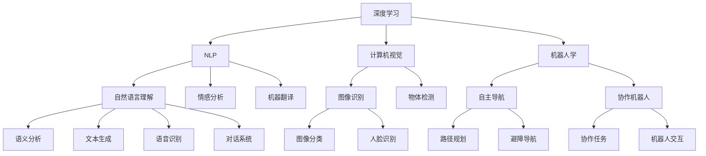

                 

# AI创业公司的未来发展

## 1. 背景介绍

在过去的几年里，人工智能（AI）技术以令人瞩目的速度发展，特别是在深度学习和机器学习领域。AI技术的进步催生了大批创新型创业公司，它们致力于开发前沿的AI解决方案，涵盖了从自然语言处理、计算机视觉到机器人学等各个方面。这些公司不仅推动了科技前沿的进步，也创造了巨大的经济价值和社会效益。然而，随着AI技术的不断发展和商业化进程的加速，AI创业公司也面临着前所未有的挑战和机遇。本文将从AI创业公司的现状、未来发展趋势以及面临的挑战三个方面，深入探讨这些公司的未来发展之路。

## 2. 核心概念与联系

### 2.1 核心概念概述

在探讨AI创业公司的未来发展之前，我们首先需要明确一些关键概念：

- **AI创业公司**：指那些专注于开发和部署人工智能技术的初创企业。这些公司通常拥有雄心勃勃的愿景，旨在通过AI技术解决特定领域的问题，提供创新性产品或服务。
- **深度学习**：一种基于人工神经网络的学习范式，通过多层次的特征提取和模式识别，实现对复杂数据的处理和分析。
- **自然语言处理（NLP）**：研究如何让计算机理解和生成人类语言的技术，广泛应用于机器翻译、情感分析、智能客服等领域。
- **计算机视觉**：利用图像处理和模式识别技术，使计算机能够“看”和“理解”图像和视频内容。
- **机器人学**：涉及机器人和自动化系统的设计、控制和应用，旨在实现自主决策和智能交互。

这些概念构成了AI创业公司技术研发和产品创新的基础，它们之间相互关联，共同推动着AI技术的进步和应用。

### 2.2 核心概念原理和架构的 Mermaid 流程图



## 3. 核心算法原理 & 具体操作步骤

### 3.1 算法原理概述

AI创业公司的核心竞争力在于其技术的先进性和商业模式的创新性。深度学习作为AI技术的核心，其原理是通过大规模数据训练神经网络，使其能够自动提取和抽象数据特征，从而实现复杂的任务处理和决策。自然语言处理和计算机视觉等技术则利用深度学习框架，将非结构化数据转化为结构化信息，为AI创业公司提供强大的数据处理能力。

### 3.2 算法步骤详解

AI创业公司的技术开发和产品实现一般遵循以下步骤：

1. **需求分析**：根据市场需求和用户痛点，确定AI应用的方向和目标。
2. **数据收集与预处理**：收集并清洗用于训练和测试模型的数据集。
3. **模型选择与训练**：选择合适的深度学习模型，利用训练数据进行模型训练。
4. **模型评估与调优**：使用验证集对模型性能进行评估，根据评估结果进行模型调优。
5. **产品开发与部署**：将训练好的模型嵌入到产品中，并进行系统集成和用户测试。
6. **持续优化与迭代**：根据用户反馈和实际应用中的表现，不断优化模型和产品功能。

### 3.3 算法优缺点

AI创业公司的技术优势在于其强大的数据处理能力和广泛的算法支持。然而，这些优势也带来了一些挑战：

- **高昂的研发成本**：深度学习模型的训练需要大量的计算资源和数据，初创公司可能难以负担。
- **模型复杂性**：深度学习模型复杂度高，难以解释其内部机制，增加了产品开发和维护的难度。
- **数据隐私问题**：AI应用依赖大量数据，数据隐私和安全成为重要考量。
- **市场竞争激烈**：AI创业公司众多，市场竞争激烈，产品差异化难度大。

### 3.4 算法应用领域

AI创业公司的应用领域非常广泛，涵盖了以下几个方面：

- **医疗健康**：通过深度学习和计算机视觉技术，AI公司能够开发智能诊断、个性化治疗等解决方案，提高医疗服务效率。
- **金融服务**：利用NLP和机器学习技术，AI公司能够提供智能投顾、风险控制、欺诈检测等服务。
- **自动驾驶**：AI公司通过计算机视觉和深度学习技术，开发自主驾驶汽车，提升交通安全和出行效率。
- **智能制造**：利用机器视觉和机器人技术，AI公司能够优化生产流程，实现智能制造和工业自动化。
- **零售电商**：通过NLP和推荐系统，AI公司能够提升用户购物体验，实现个性化推荐和营销。

## 4. 数学模型和公式 & 详细讲解 & 举例说明

### 4.1 数学模型构建

AI创业公司常用的数学模型包括深度神经网络、卷积神经网络、循环神经网络等。这些模型通过定义损失函数和优化算法，最小化模型预测与真实值之间的差异，从而不断优化模型参数。

### 4.2 公式推导过程

以卷积神经网络（CNN）为例，其基本原理是通过卷积层和池化层提取图像特征，再通过全连接层进行分类。公式推导如下：

- 卷积层：$y = f(x * w + b)$，其中$x$为输入数据，$w$为卷积核，$b$为偏置，$f$为激活函数。
- 池化层：$y = \max(x)$，对卷积层输出进行下采样。
- 全连接层：$y = f(w^T x + b)$，将池化层输出映射到分类结果。

### 4.3 案例分析与讲解

以Google的AutoML为例，AutoML使用深度神经网络进行图像分类任务。其核心算法包括数据增强、迁移学习和自动化模型调优。数据增强通过翻转、旋转等方式扩充训练集，迁移学习通过预训练模型转移知识，自动化调优通过网格搜索和随机搜索优化模型参数。

## 5. 项目实践：代码实例和详细解释说明

### 5.1 开发环境搭建

在开发AI产品时，需要搭建高性能的计算环境。以TensorFlow为例，其开发环境搭建步骤如下：

1. 安装Python：从Python官网下载并安装Python。
2. 安装TensorFlow：使用pip安装TensorFlow。
3. 配置环境：设置环境变量，确保TensorFlow可访问。
4. 安装依赖：安装所需的第三方库和工具。

### 5.2 源代码详细实现

以下是一个简单的图像分类模型的实现示例：

```python
import tensorflow as tf
from tensorflow.keras import layers

# 定义模型
model = tf.keras.Sequential([
    layers.Conv2D(32, (3, 3), activation='relu', input_shape=(32, 32, 3)),
    layers.MaxPooling2D((2, 2)),
    layers.Conv2D(64, (3, 3), activation='relu'),
    layers.MaxPooling2D((2, 2)),
    layers.Flatten(),
    layers.Dense(64, activation='relu'),
    layers.Dense(10, activation='softmax')
])

# 编译模型
model.compile(optimizer='adam', loss='sparse_categorical_crossentropy', metrics=['accuracy'])

# 训练模型
model.fit(train_images, train_labels, epochs=10, validation_data=(test_images, test_labels))
```

### 5.3 代码解读与分析

上述代码实现了一个简单的卷积神经网络模型，用于图像分类任务。其核心步骤包括定义模型、编译模型和训练模型。其中，卷积层和池化层用于特征提取，全连接层用于分类。通过训练，模型能够自动学习图像特征并进行分类。

### 5.4 运行结果展示

训练完成后，使用测试集进行评估，结果如下：

```python
test_loss, test_acc = model.evaluate(test_images, test_labels)
print('Test accuracy:', test_acc)
```

## 6. 实际应用场景

### 6.1 医疗健康

AI创业公司在医疗健康领域的应用包括智能诊断、个性化治疗和健康管理等。以智能诊断为例，利用深度学习技术，AI公司能够分析医学影像，自动诊断疾病，如癌症、心脏病等。通过计算机视觉技术，AI公司还可以开发虚拟医生，提供24/7的医疗咨询。

### 6.2 金融服务

金融领域的AI创业公司主要涉及风险控制、智能投顾和欺诈检测等方面。例如，通过NLP技术，AI公司能够自动处理客户咨询，提供个性化的金融建议。通过机器学习算法，AI公司能够分析交易数据，预测市场趋势，防范金融风险。

### 6.3 自动驾驶

自动驾驶是AI创业公司的重要应用方向之一。通过计算机视觉和深度学习技术，AI公司能够实现自动驾驶汽车的环境感知和路径规划，提升行驶安全性和效率。例如，Waymo和Tesla等公司已经展示了其在自动驾驶领域的成果。

### 6.4 智能制造

智能制造是AI创业公司的另一大应用领域。通过机器人技术和计算机视觉技术，AI公司能够优化生产流程，实现自动化和智能化。例如，在汽车制造领域，AI公司可以通过视觉检测技术，检测零件缺陷，提高生产质量。

### 6.5 零售电商

在零售电商领域，AI创业公司主要涉及个性化推荐和营销。通过NLP技术，AI公司能够分析客户评论和购买记录，提供个性化的购物建议。通过推荐系统，AI公司能够优化库存管理，提高销售效率。

## 7. 工具和资源推荐

### 7.1 学习资源推荐

- **深度学习与神经网络**：深度学习基础，包括神经网络、反向传播等核心概念。
- **TensorFlow官方文档**：TensorFlow详细文档，提供丰富的API和示例代码。
- **GitHub**：开源社区，提供大量AI项目和代码资源。
- **Kaggle**：数据科学竞赛平台，提供丰富的数据集和模型竞赛。

### 7.2 开发工具推荐

- **PyTorch**：深度学习框架，易于使用和调试。
- **TensorFlow**：主流深度学习框架，支持分布式计算。
- **Jupyter Notebook**：交互式编程环境，方便编写和调试代码。
- **TensorBoard**：可视化工具，帮助监控模型训练和性能。

### 7.3 相关论文推荐

- **ImageNet大规模视觉识别挑战赛**：ImageNet大规模视觉识别挑战赛论文，展示了深度学习在图像分类任务上的突破。
- **AlphaGo Zero**：AlphaGo Zero论文，展示了深度强化学习在围棋中的应用。
- **BERT：预训练表示为自然语言处理任务提供新方向**：BERT论文，展示了预训练语言模型在自然语言处理任务上的卓越表现。

## 8. 总结：未来发展趋势与挑战

### 8.1 研究成果总结

AI创业公司在过去几年里取得了显著的进步，深度学习、自然语言处理和计算机视觉等技术得到了广泛应用。然而，随着技术的发展，AI创业公司也面临诸多挑战，如高昂的研发成本、模型复杂性、数据隐私问题等。

### 8.2 未来发展趋势

未来，AI创业公司将继续在多个领域取得突破，主要包括：

- **技术突破**：深度学习、自然语言处理和计算机视觉等技术将进一步发展，推动AI创业公司的技术进步。
- **应用扩展**：AI创业公司将拓展更多应用场景，如智能交通、智能城市等，带来新的业务机会。
- **数据融合**：AI创业公司将整合多源数据，提高数据处理和分析能力。
- **协作创新**：AI创业公司将加强与学术界和行业的合作，推动技术创新和应用落地。

### 8.3 面临的挑战

未来，AI创业公司仍需应对以下挑战：

- **数据隐私和安全**：随着数据应用场景的扩展，数据隐私和安全问题将更加凸显。
- **市场竞争**：AI创业公司众多，市场竞争激烈，产品差异化难度大。
- **技术壁垒**：AI创业公司需要不断提升技术水平，才能保持竞争优势。
- **伦理和法律**：AI创业公司需要遵守伦理和法律规范，避免产生有害影响。

### 8.4 研究展望

未来的AI创业公司需要在技术创新和业务拓展上持续发力，推动AI技术的发展和应用。具体研究展望包括：

- **数据隐私保护**：开发数据隐私保护技术，确保用户数据安全。
- **模型可解释性**：提升AI模型的可解释性，增强用户信任。
- **跨领域应用**：探索AI技术在更多领域的应用，推动技术进步和产业发展。
- **协同创新**：加强与学术界、行业和其他创业公司的合作，共同推动AI技术的创新和发展。

## 9. 附录：常见问题与解答

### Q1：AI创业公司如何获取高质量数据？

A：AI创业公司可以通过多种方式获取高质量数据，包括公开数据集、数据采集、合作数据提供商等。例如，在医疗领域，AI公司可以与医院和研究机构合作，获取大规模的医学影像和病历数据。

### Q2：AI创业公司如何避免模型过拟合？

A：AI创业公司可以通过数据增强、正则化、早停等方法避免模型过拟合。例如，在图像分类任务中，可以通过旋转、裁剪等方式扩充训练集，防止模型对训练数据过度拟合。

### Q3：AI创业公司如何确保模型的可解释性？

A：AI创业公司可以通过模型可视化、特征分析等方法，增强模型的可解释性。例如，在自然语言处理任务中，可以通过词向量分析、语义树等方法，展示模型的推理过程。

### Q4：AI创业公司如何提升产品的用户体验？

A：AI创业公司可以通过用户反馈、A/B测试等方法，提升产品的用户体验。例如，在智能客服领域，可以通过用户调查和反馈，优化对话系统，提高用户满意度。

### Q5：AI创业公司如何应对市场竞争？

A：AI创业公司可以通过差异化定位、创新技术、高质量服务等手段，应对市场竞争。例如，在金融服务领域，可以通过精准的风险控制和个性化的金融建议，赢得用户信任和市场份额。

作者：禅与计算机程序设计艺术 / Zen and the Art of Computer Programming

