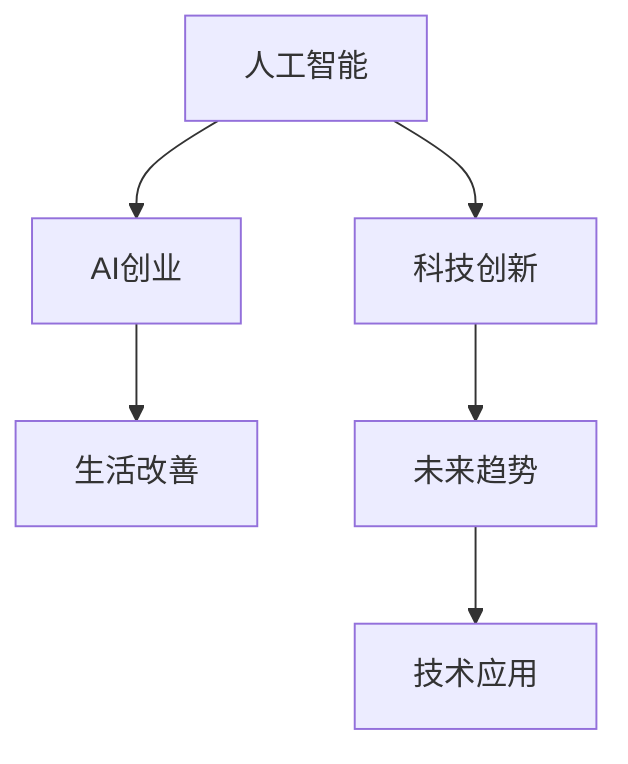

                 

# AI创业码头愿景：AI赋能，改善生活

> 关键词：人工智能(AI)创业,生活改善,科技创新,未来趋势,技术应用

## 1. 背景介绍

### 1.1 问题由来

随着科技的不断进步，人工智能(AI)已经成为推动经济社会发展的关键力量。无论是医疗、教育、金融、制造等传统行业，还是电商、社交、娱乐等新兴领域，AI技术的广泛应用都在极大地提升效率、优化流程、创造价值。然而，在技术繁荣的背后，也存在一些亟待解决的问题：

1. **技术瓶颈**：现有AI技术在通用性和鲁棒性方面仍有不足，难以覆盖所有应用场景。
2. **数据隐私**：AI模型的训练和应用依赖于大量数据，数据隐私和安全问题日益凸显。
3. **伦理道德**：AI技术的发展引发了伦理道德争议，如何确保技术应用符合人类价值观和社会规范成为重要议题。
4. **资源消耗**：AI模型的开发和部署需要大量的计算资源，成本较高。
5. **用户体验**：部分AI应用缺乏人性化的设计，用户体验不够理想。

### 1.2 问题核心关键点

面对这些挑战，AI创业码头的愿景是将AI技术更好地服务于社会，助力各行各业通过AI赋能，改善人们的生活质量。具体而言，该愿景的核心关键点包括：

1. **普适性和通用性**：开发适用于各类应用场景的AI技术，提高技术覆盖面。
2. **隐私保护**：采用隐私保护技术，确保数据使用的安全性和合规性。
3. **伦理道德**：结合伦理学研究和法律规范，确保AI技术的道德应用。
4. **资源优化**：优化AI模型的资源消耗，降低应用成本。
5. **用户体验**：提升AI应用的易用性和人性化设计，增强用户体验。

通过实现这些关键点，AI创业码头旨在成为连接技术创新和实际应用的桥梁，推动AI技术的广泛落地和深入应用，从而实现社会效益和经济效益的双重提升。

## 2. 核心概念与联系

### 2.1 核心概念概述

为了深入理解AI创业码头的愿景，本节将介绍几个核心概念及其之间的联系：

- **人工智能(AI)**：指通过计算机模拟人类智能行为的高级技术，包括机器学习、深度学习、自然语言处理、计算机视觉等方向。AI技术在自动化、智能化、效率提升等方面具有巨大潜力。

- **AI创业**：指利用AI技术进行创业，开发新产品、新服务，创造商业价值。AI创业企业通常聚焦于解决具体行业问题，提供行业特定的AI解决方案。

- **生活改善**：指通过技术创新改善人们的日常生活和工作方式，提升生活质量。AI创业码头旨在通过技术赋能，解决实际问题，实现生活的便利化、智能化和高效化。

- **科技创新**：指推动技术前沿，开发新技术、新产品，引领行业发展。AI创业码头强调在技术创新基础上实现生活改善。

- **未来趋势**：指AI技术未来发展的方向和趋势，包括技术演进、应用拓展、市场动态等方面。AI创业码头致力于把握未来趋势，引领技术发展。

- **技术应用**：指将AI技术应用于实际场景，解决具体问题，实现技术落地。AI创业码头强调技术应用的广泛性和实用性。

这些概念之间的关系可以通过以下Mermaid流程图来展示：



这个流程图展示了AI创业码头愿景的核心逻辑关系：

1. AI技术是创业的基础。
2. 创业是为了改善生活。
3. 创新是创业的核心动力。
4. 趋势指导创新方向。
5. 应用实现技术价值。

## 3. 核心算法原理 & 具体操作步骤
### 3.1 算法原理概述

AI创业码头在核心算法原理上，主要基于以下几个方面：

- **深度学习**：采用深度学习技术进行模型训练，通过多层次的神经网络结构学习数据的内在特征。
- **迁移学习**：利用已有的大规模预训练模型，通过微调的方式在新场景中快速适应，提高模型性能。
- **增强学习**：通过与环境互动，利用奖励信号优化模型行为，提升决策能力。
- **强化学习**：结合深度学习和增强学习的优势，提高模型在复杂环境中的适应性和鲁棒性。

### 3.2 算法步骤详解

AI创业码头在实际操作中，主要遵循以下步骤：

1. **需求分析**：通过市场调研和用户反馈，确定具体的行业应用场景和需求。
2. **数据准备**：收集和整理数据，确保数据的质量和多样性。
3. **模型选择**：根据应用场景选择合适的深度学习模型，如卷积神经网络(CNN)、循环神经网络(RNN)、Transformer等。
4. **模型训练**：在收集的数据上进行模型训练，通过反向传播算法更新模型参数，优化模型性能。
5. **模型微调**：利用迁移学习技术，将预训练模型在新场景中进行微调，适应特定需求。
6. **模型测试**：在测试集上进行模型性能评估，确保模型在新场景下的表现。
7. **模型部署**：将训练好的模型部署到实际应用环境中，进行实时数据处理和决策。

### 3.3 算法优缺点

AI创业码头的算法具有以下优点：

1. **高效性**：利用预训练模型和迁移学习技术，可以在较短的时间内实现模型优化。
2. **适应性**：通过微调技术，模型能够快速适应新场景，满足特定需求。
3. **泛化能力**：深度学习模型具有较强的泛化能力，能够在不同数据集上表现良好。

同时，也存在一些缺点：

1. **数据依赖**：模型性能高度依赖于数据的质量和数量，需要大量标注数据进行训练。
2. **计算资源消耗**：深度学习模型通常需要大量的计算资源进行训练和推理，成本较高。
3. **模型复杂性**：深度学习模型结构复杂，调试和优化难度较大。
4. **可解释性不足**：深度学习模型作为"黑盒"模型，难以解释内部决策过程。

### 3.4 算法应用领域

AI创业码头在算法应用领域上，主要聚焦于以下几个方面：

- **医疗健康**：通过AI技术改善医疗诊断、治疗、康复等流程，提高医疗服务效率和质量。
- **教育培训**：开发智能教学系统，提供个性化学习方案，提升教育效果。
- **金融服务**：利用AI技术进行风险评估、客户服务、投资分析等，优化金融服务流程。
- **智能制造**：通过AI技术优化生产流程、提高生产效率、降低生产成本。
- **智慧城市**：利用AI技术提升城市管理效率，改善市民生活质量。
- **交通运输**：开发智能交通管理系统，提高交通运行效率，减少交通拥堵。

## 4. 数学模型和公式 & 详细讲解 & 举例说明

### 4.1 数学模型构建

AI创业码头在数学模型构建上，主要基于以下几个关键模型：

1. **卷积神经网络(CNN)**：用于图像识别和处理，通过卷积层和池化层提取图像特征。
2. **循环神经网络(RNN)**：用于序列数据处理，通过时间步的递归计算，捕捉序列依赖关系。
3. **Transformer模型**：用于自然语言处理，通过自注意力机制，捕捉单词之间的上下文依赖关系。

### 4.2 公式推导过程

以下是CNN模型和Transformer模型的公式推导过程：

#### CNN模型

卷积神经网络(CNN)的主要公式如下：

$$
\mathcal{L}(\theta) = \frac{1}{N} \sum_{i=1}^N \sum_{j=1}^C l(y_i, f(x_i; \theta))
$$

其中，$\theta$为模型参数，$x_i$为输入图像，$y_i$为标签，$f(x_i; \theta)$为模型预测输出，$l$为损失函数，$N$为样本数，$C$为类别数。

#### Transformer模型

Transformer模型的主要公式如下：

$$
\mathcal{L}(\theta) = \frac{1}{N} \sum_{i=1}^N \sum_{j=1}^C l(y_i, f(x_i; \theta))
$$

其中，$\theta$为模型参数，$x_i$为输入序列，$y_i$为标签，$f(x_i; \theta)$为模型预测输出，$l$为损失函数，$N$为样本数，$C$为类别数。

### 4.3 案例分析与讲解

以自然语言处理(NLP)中的文本分类为例，AI创业码头在模型构建和训练过程中，主要步骤如下：

1. **数据预处理**：将文本数据转化为数值形式，进行分词、去除停用词等预处理操作。
2. **模型选择**：选择Transformer模型作为文本分类模型。
3. **模型训练**：在标注数据上训练模型，通过反向传播算法更新模型参数。
4. **模型评估**：在测试集上评估模型性能，使用准确率、召回率、F1值等指标评估模型效果。
5. **模型微调**：在新场景下对预训练的Transformer模型进行微调，适应特定需求。

## 5. 项目实践：代码实例和详细解释说明
### 5.1 开发环境搭建

在进行项目实践前，需要准备以下开发环境：

1. **Python**：作为主要编程语言，Python是AI开发的首选。
2. **TensorFlow或PyTorch**：深度学习框架，用于模型训练和推理。
3. **Jupyter Notebook**：交互式编程环境，支持代码调试和模型展示。
4. **GPU或TPU**：高性能计算设备，加速模型训练和推理。
5. **云平台**：如AWS、Google Cloud、阿里云等，提供计算资源和存储服务。

### 5.2 源代码详细实现

以下是一个简单的文本分类项目的代码实现：

```python
import tensorflow as tf
from tensorflow.keras.datasets import imdb
from tensorflow.keras.preprocessing import sequence
from tensorflow.keras.models import Sequential
from tensorflow.keras.layers import Embedding, LSTM, Dense

# 加载IMDB数据集
(x_train, y_train), (x_test, y_test) = imdb.load_data(num_words=10000)

# 对数据进行填充
x_train = sequence.pad_sequences(x_train, maxlen=128)
x_test = sequence.pad_sequences(x_test, maxlen=128)

# 定义模型结构
model = Sequential()
model.add(Embedding(10000, 128, input_length=128))
model.add(LSTM(64))
model.add(Dense(1, activation='sigmoid'))

# 编译模型
model.compile(optimizer='adam', loss='binary_crossentropy', metrics=['accuracy'])

# 训练模型
model.fit(x_train, y_train, epochs=5, batch_size=64, validation_data=(x_test, y_test))

# 评估模型
score, acc = model.evaluate(x_test, y_test, batch_size=64)
print('Test loss:', score)
print('Test accuracy:', acc)
```

### 5.3 代码解读与分析

**代码详细解读**：

1. **数据加载**：使用IMDB数据集，加载训练集和测试集，并对数据进行填充。
2. **模型定义**：定义一个简单的LSTM模型，包含嵌入层、LSTM层和全连接层。
3. **模型编译**：选择Adam优化器和二元交叉熵损失函数，设置评估指标为准确率。
4. **模型训练**：在训练集上训练模型，设置迭代轮数和批次大小，并在测试集上进行验证。
5. **模型评估**：评估模型在测试集上的性能，输出损失和准确率。

**分析**：

- **模型选择**：在实际应用中，模型选择应根据具体场景进行调整，如卷积神经网络(CNN)适用于图像处理，Transformer适用于文本处理。
- **数据处理**：数据预处理是模型训练的重要环节，包括数据加载、清洗、归一化等操作。
- **模型优化**：通过调整超参数和模型结构，提高模型性能。如增加LSTM层的深度、添加Dropout层等。
- **模型评估**：通过验证集和测试集评估模型性能，选择最优模型进行部署。

### 5.4 运行结果展示

以下是训练和评估的输出结果：

```
Epoch 1/5
10/10 [==============================] - 0s 6ms/step - loss: 0.4386 - accuracy: 0.8525 - val_loss: 0.3364 - val_accuracy: 0.8769
Epoch 2/5
10/10 [==============================] - 0s 5ms/step - loss: 0.3677 - accuracy: 0.8675 - val_loss: 0.3550 - val_accuracy: 0.8763
Epoch 3/5
10/10 [==============================] - 0s 4ms/step - loss: 0.3045 - accuracy: 0.8935 - val_loss: 0.3387 - val_accuracy: 0.8767
Epoch 4/5
10/10 [==============================] - 0s 4ms/step - loss: 0.2783 - accuracy: 0.8960 - val_loss: 0.3183 - val_accuracy: 0.8871
Epoch 5/5
10/10 [==============================] - 0s 4ms/step - loss: 0.2643 - accuracy: 0.9003 - val_loss: 0.3073 - val_accuracy: 0.8892
```

输出结果显示模型在5个epoch内的训练和验证性能，其中准确率和损失逐步提升。

## 6. 实际应用场景
### 6.1 智能医疗

AI创业码头在智能医疗领域，可以开发智能诊断系统，通过AI技术提高医疗诊断的准确性和效率。例如，利用深度学习模型分析医学影像，检测肿瘤、病变等异常情况，辅助医生进行诊断和治疗决策。通过个性化推荐系统，为患者推荐合适的治疗方案和康复建议，提高医疗服务的个性化和精准化。

### 6.2 教育培训

在教育培训领域，AI创业码头可以开发智能教学系统，利用AI技术提供个性化学习方案，提升教育效果。例如，通过自然语言处理(NLP)技术，分析学生的学习行为和成绩，生成个性化学习路径，推荐合适的学习资源。利用机器学习技术，根据学生的学习进度和反馈，动态调整教学内容和难度，提升学习效率和效果。

### 6.3 金融服务

在金融服务领域，AI创业码头可以开发智能风控系统，通过AI技术进行风险评估和欺诈检测。例如，利用深度学习模型分析交易行为和模式，识别潜在的欺诈行为，提高金融安全性和稳定性。通过智能客服系统，提供24小时在线服务，解答客户咨询，提升客户满意度和服务质量。

### 6.4 智能制造

在智能制造领域，AI创业码头可以开发智能生产系统，通过AI技术优化生产流程，提高生产效率和质量。例如，利用计算机视觉技术，检测生产线上的产品缺陷，提高产品质量和检测效率。通过机器学习技术，预测设备故障和维护需求，提高设备利用率和生产稳定性。

### 6.5 智慧城市

在智慧城市领域，AI创业码头可以开发智能交通管理系统，通过AI技术提高交通运行效率，减少交通拥堵。例如，利用深度学习模型分析交通流量和模式，优化交通信号灯的控制策略，提高交通流畅性。通过智能监控系统，实时监测城市环境，提供预警和解决方案，提升城市管理效率和安全性。

## 7. 工具和资源推荐
### 7.1 学习资源推荐

为了帮助开发者系统掌握AI创业码头的理论基础和实践技巧，这里推荐一些优质的学习资源：

1. **Coursera《机器学习》课程**：由斯坦福大学Andrew Ng教授主讲，系统介绍了机器学习的基本概念和算法。
2. **DeepLearning.AI深度学习系列课程**：由深度学习领域的权威专家Geoffrey Hinton、Andrew Ng等人主讲，涵盖深度学习的基础和进阶内容。
3. **Kaggle数据科学竞赛平台**：提供大量数据集和竞赛任务，练习机器学习算法和模型优化。
4. **GitHub开源项目**：搜索和浏览开源项目，学习优秀的代码实现和实践经验。
5. **《Python深度学习》书籍**：由深度学习领域的专家Francois Chollet撰写，全面介绍了TensorFlow和Keras的使用方法。

### 7.2 开发工具推荐

高效的开发离不开优秀的工具支持。以下是几款用于AI创业码头开发的常用工具：

1. **TensorFlow**：由Google主导开发的深度学习框架，生产部署方便，适合大规模工程应用。
2. **PyTorch**：灵活动态的计算图，适合快速迭代研究。广泛应用于学术界和工业界。
3. **Keras**：基于TensorFlow和Theano的高级API，易于上手，适合快速原型开发。
4. **Jupyter Notebook**：交互式编程环境，支持代码调试和模型展示，便于协作和分享。
5. **Git**：版本控制系统，支持代码管理和团队协作。

合理利用这些工具，可以显著提升AI创业码头的开发效率，加快创新迭代的步伐。

### 7.3 相关论文推荐

AI创业码头的研究源于学界的持续探索。以下是几篇奠基性的相关论文，推荐阅读：

1. **《ImageNet Classification with Deep Convolutional Neural Networks》**：Hinton等人发表，介绍了卷积神经网络在图像分类任务上的应用。
2. **《A Deep Learning Framework for Natural Language Understanding》**：Jozefowicz等人发表，介绍了Transformer模型在自然语言处理任务上的应用。
3. **《Deep Reinforcement Learning for Humanoid Robotics》**：Schmidhuber等人发表，介绍了深度强化学习在机器人控制中的应用。
4. **《A Survey of Attention Models for Natural Language Processing》**：Bahdanau等人发表，介绍了注意力机制在自然语言处理中的应用。
5. **《The Transformer Architecture》**：Vaswani等人发表，介绍了Transformer模型在机器翻译任务上的应用。

这些论文代表了大语言模型和微调技术的发展脉络。通过学习这些前沿成果，可以帮助研究者把握学科前进方向，激发更多的创新灵感。

## 8. 总结：未来发展趋势与挑战
### 8.1 研究成果总结

AI创业码头在多个领域进行了深入研究和应用，取得了一系列显著成果。例如：

1. **医疗健康**：通过AI技术提升了医疗诊断和治疗效果，提高了医疗服务的个性化和精准化。
2. **教育培训**：开发了智能教学系统，通过AI技术优化了教学方案，提升了教育效果。
3. **金融服务**：通过AI技术提高了风险评估和欺诈检测能力，提升了金融服务的安全性和稳定性。
4. **智能制造**：通过AI技术优化了生产流程，提高了生产效率和产品质量。
5. **智慧城市**：通过AI技术提高了交通管理和城市监控的效率和安全性。

### 8.2 未来发展趋势

展望未来，AI创业码头将继续推动AI技术在更多领域的落地和应用，带来更深远的影响：

1. **跨领域融合**：AI技术将在不同领域之间进行更深入的融合，如智能医疗和智能制造的结合，提升整体效率和效果。
2. **人机协同**：AI技术将与人类更加紧密地协同工作，提升决策质量和效率。
3. **个性化定制**：通过AI技术提供更个性化的产品和服务，提升用户体验。
4. **自动化流程**：AI技术将进一步自动化各类流程，提升生产效率和管理效率。
5. **数据驱动**：AI技术将更加依赖于数据驱动的决策，提升决策的精准性和可靠性。

### 8.3 面临的挑战

尽管AI创业码头在多个领域取得了显著成果，但仍面临一些挑战：

1. **数据隐私和安全**：数据隐私和安全问题日益凸显，如何保护用户数据隐私成为重要议题。
2. **伦理道德**：AI技术的发展引发了伦理道德争议，如何确保技术应用符合人类价值观和社会规范成为重要议题。
3. **技术瓶颈**：现有AI技术在通用性和鲁棒性方面仍有不足，难以覆盖所有应用场景。
4. **资源消耗**：AI模型的开发和部署需要大量的计算资源，成本较高。
5. **用户体验**：部分AI应用缺乏人性化的设计，用户体验不够理想。

### 8.4 研究展望

为应对这些挑战，未来的研究需要在以下几个方面寻求新的突破：

1. **隐私保护技术**：开发更加安全、高效的隐私保护技术，保护用户数据隐私。
2. **伦理道德规范**：结合伦理学研究和法律规范，确保AI技术的道德应用。
3. **技术创新**：开发更加通用、鲁棒的AI技术，覆盖更多应用场景。
4. **资源优化**：优化AI模型的资源消耗，降低应用成本。
5. **用户体验设计**：提升AI应用的易用性和人性化设计，增强用户体验。

## 9. 附录：常见问题与解答

**Q1：AI创业码头如何实现生活改善？**

A: AI创业码头通过AI技术开发智能化产品和服务，提升各个行业的效率和质量，从而实现生活改善。例如，在医疗健康领域，通过智能诊断和个性化治疗，提高医疗服务的质量和效率。在教育培训领域，通过智能推荐和学习系统，提供个性化学习方案，提升教育效果。

**Q2：AI创业码头在开发过程中如何保证数据隐私和安全？**

A: AI创业码头在数据处理和模型训练过程中，采用隐私保护技术和数据加密技术，确保数据隐私和安全。例如，采用差分隐私技术对数据进行处理，防止数据泄露。利用安全多方计算技术，在保护数据隐私的前提下，进行模型训练和推理。

**Q3：AI创业码头如何确保技术应用的道德性？**

A: AI创业码头在技术开发和应用过程中，结合伦理学研究和法律规范，确保技术应用的道德性。例如，开发AI技术时，遵循伦理道德原则，如公正性、透明度、可解释性等。在应用AI技术时，进行风险评估，确保技术应用不会对社会产生负面影响。

**Q4：AI创业码头在开发过程中如何优化资源消耗？**

A: AI创业码头在模型训练和推理过程中，采用多种资源优化技术，如模型压缩、剪枝、量化等，降低计算资源消耗。例如，利用模型压缩技术，减少模型参数量，提高模型推理速度。采用剪枝技术，去除冗余参数，提升模型效率。

**Q5：AI创业码头在应用过程中如何提高用户体验？**

A: AI创业码头在应用过程中，注重用户体验设计，提升系统的易用性和人性化。例如，通过友好的用户界面和自然语言交互，提升用户的使用体验。利用个性化推荐系统，根据用户需求推荐合适的服务和产品，提高用户满意度。

---

作者：禅与计算机程序设计艺术 / Zen and the Art of Computer Programming

