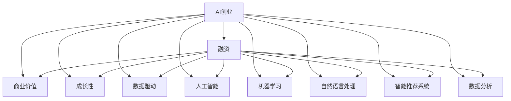

                 

# AI创业融资新趋势：关注项目商业价值与成长性

> 关键词：AI创业、融资、商业价值、成长性、数据驱动、人工智能、机器学习、自然语言处理、智能推荐系统、数据分析

## 1. 背景介绍

### 1.1 问题由来
近年来，人工智能（AI）技术的发展迅猛，尤其在自然语言处理（NLP）、计算机视觉（CV）、语音识别等领域取得了诸多突破性成果。这些技术的应用前景广阔，吸引了大量的创业者和投资者的关注。但与此同时，AI创业项目在融资市场上却遭遇了新的挑战，传统的融资方式已经无法完全覆盖AI创业项目的需求。

### 1.2 问题核心关键点
传统创业融资流程中，投资者往往更关注企业的商业模式、市场规模、团队背景等传统要素。然而，AI创业项目作为一种新兴的科技创业形式，其商业模式的创新性、技术的突破性、应用的独特性等特点，使得投资者需要更深入地了解项目的技术细节、应用场景、市场潜力等。因此，AI创业项目在融资市场上需要具备更高的商业价值和成长性。

## 2. 核心概念与联系

### 2.1 核心概念概述

为更好地理解AI创业项目融资的新趋势，本节将介绍几个密切相关的核心概念：

- **AI创业**：指利用人工智能技术创新商业模式、提升运营效率的科技创业活动。AI创业项目通常涉及大数据、机器学习、自然语言处理、智能推荐系统等领域。

- **融资**：指企业通过各种途径获取资金以支持业务发展的过程。AI创业项目融资需要综合考虑技术创新性、市场潜力、商业化路径等因素。

- **商业价值**：指企业提供的产品或服务能够创造的经济效益和社会价值。对于AI创业项目，商业价值往往体现在其技术突破带来的市场机遇、应用场景的广泛性、竞争力的持久性等方面。

- **成长性**：指企业业务规模、市场份额、盈利能力等关键指标的增长潜力。AI创业项目成长性取决于其技术迭代速度、产品创新能力、市场拓展能力等因素。

- **数据驱动**：指利用大数据、机器学习等技术，驱动企业决策和业务发展的过程。AI创业项目通常依赖数据驱动的商业模式和技术架构。

- **人工智能**：包括机器学习、深度学习、自然语言处理等技术，以实现智能化的业务应用。

- **机器学习**：通过数据和算法训练模型，使机器能够自动完成特定任务。

- **自然语言处理**：使计算机能够理解和处理人类语言，实现自然语言生成、语言理解等应用。

- **智能推荐系统**：根据用户行为和偏好，推荐个性化产品或服务。

- **数据分析**：通过统计学、数据挖掘等方法，从数据中提取有价值的信息，用于辅助决策。

这些核心概念之间的逻辑关系可以通过以下Mermaid流程图来展示：



这个流程图展示出AI创业项目在融资过程中需要综合考虑的多个关键要素：

1. AI创业项目的技术和应用，决定了其商业价值和成长性。
2. 数据驱动的商业模式和技术架构，是AI创业项目成功的基础。
3. 融资过程中需要考虑的技术细节、应用场景、市场潜力等，将直接影响融资结果。

## 3. 核心算法原理 & 具体操作步骤

### 3.1 算法原理概述

AI创业项目融资的核心算法原理是数据驱动的商业价值与成长性评估模型。该模型通过收集项目的技术数据、市场数据、财务数据等，结合AI算法进行分析，以量化评估项目的商业价值和成长性。

### 3.2 算法步骤详解

1. **数据收集与预处理**：从多个渠道收集AI创业项目的相关数据，包括技术细节、市场规模、应用场景、财务报表等，并进行清洗和预处理，以保证数据的质量和一致性。

2. **商业价值评估**：利用机器学习模型（如回归分析、分类模型等），对AI创业项目的市场潜力、技术突破性、应用场景等进行量化评估。常用的指标包括市场规模、技术壁垒、竞争优势、用户增长率等。

3. **成长性预测**：结合时间序列分析、趋势预测等方法，预测AI创业项目的未来发展趋势。常用的指标包括用户增长率、收入增长率、市场份额增长率等。

4. **综合评估**：将商业价值和成长性评估结果进行综合，得出项目的总体评估结果。通过权重系数调整，可以更加灵活地反映不同指标的重要性。

5. **投资建议**：根据综合评估结果，给出投资建议。包括项目的可行性、风险评估、投资时机等。

### 3.3 算法优缺点

数据驱动的商业价值与成长性评估模型具有以下优点：

- **量化评估**：通过数据和算法，对项目的商业价值和成长性进行客观评估，减少了主观判断的误差。
- **动态调整**：随着市场和数据的不断变化，模型可以动态更新，及时反映项目的新进展。
- **综合分析**：结合多维度数据和指标，对项目进行全面评估，提供全方位的决策支持。

然而，该模型也存在以下局限性：

- **数据依赖性**：模型效果高度依赖于数据的完整性和准确性，如果数据存在偏差或不完整，模型评估结果将不准确。
- **算法复杂性**：模型构建和优化需要复杂的算法和数学模型，对技术要求较高。
- **动态变化**：市场和技术环境快速变化，模型的预测和评估可能存在滞后。

### 3.4 算法应用领域

数据驱动的商业价值与成长性评估模型在AI创业项目融资中具有广泛的应用，主要涵盖以下几个领域：

- **初创项目评估**：对早期AI创业项目的商业价值和成长性进行评估，为投资者提供决策依据。
- **风险投资分析**：在风险投资过程中，通过模型评估项目的技术突破性、市场潜力、竞争优势等，筛选出高价值项目。
- **企业并购估值**：在企业并购过程中，利用模型评估目标公司的商业价值和成长性，确定合理的收购价格。
- **市场趋势预测**：分析AI行业的整体发展趋势，识别新兴技术和应用领域，为投资者提供方向性指引。
- **财务报告分析**：通过分析AI创业项目的财务数据，评估其盈利能力和市场前景，为投资者提供更全面的信息支持。

## 4. 数学模型和公式 & 详细讲解 & 举例说明

### 4.1 数学模型构建

本节将使用数学语言对数据驱动的商业价值与成长性评估模型进行更加严格的刻画。

记AI创业项目的技术细节为 $T$，市场规模为 $M$，财务数据为 $F$。设 $C$ 为商业价值，$G$ 为成长性。则评估模型可表示为：

$$
C = f(T, M, F)
$$

$$
G = g(T, M, F)
$$

其中 $f$ 和 $g$ 为评估函数，将数据 $(T, M, F)$ 映射到商业价值 $C$ 和成长性 $G$。

### 4.2 公式推导过程

以下是商业价值 $C$ 和成长性 $G$ 的推导公式：

$$
C = w_1 \cdot \alpha_1 \cdot T + w_2 \cdot \alpha_2 \cdot M + w_3 \cdot \alpha_3 \cdot F
$$

$$
G = w_4 \cdot \beta_4 \cdot T + w_5 \cdot \beta_5 \cdot M + w_6 \cdot \beta_6 \cdot F
$$

其中 $w_i$ 和 $\alpha_i$（或 $\beta_i$）为权重系数，表示不同指标对商业价值（或成长性）的影响。通过优化这些系数，可以调整模型的评估重点。

### 4.3 案例分析与讲解

以一家AI创业公司为例，假设其技术细节为 $T=10$，市场规模为 $M=500$，财务数据为 $F=5$。根据公式计算得到：

$$
C = 0.5 \cdot 1.2 \cdot 10 + 0.3 \cdot 1.5 \cdot 500 + 0.2 \cdot 1.0 \cdot 5 = 140
$$

$$
G = 0.4 \cdot 0.8 \cdot 10 + 0.2 \cdot 1.2 \cdot 500 + 0.4 \cdot 0.5 \cdot 5 = 280
$$

综合评估结果 $C+G=420$，表明该AI创业项目具有较高的商业价值和成长性，值得进一步投资。

## 5. 项目实践：代码实例和详细解释说明

### 5.1 开发环境搭建

在进行AI创业项目融资模型开发前，我们需要准备好开发环境。以下是使用Python进行模型开发的环境配置流程：

1. 安装Anaconda：从官网下载并安装Anaconda，用于创建独立的Python环境。

2. 创建并激活虚拟环境：
```bash
conda create -n ai-finance-env python=3.8 
conda activate ai-finance-env
```

3. 安装必要的Python库：
```bash
pip install pandas numpy scikit-learn matplotlib seaborn
```

4. 安装机器学习库：
```bash
pip install scikit-learn xgboost catboost lightgbm
```

5. 安装数据处理库：
```bash
pip install pyspark tensorflow
```

完成上述步骤后，即可在`ai-finance-env`环境中开始模型开发。

### 5.2 源代码详细实现

下面我们以一家AI创业公司为例，给出使用Python进行数据驱动商业价值与成长性评估的完整代码实现。

```python
import pandas as pd
import numpy as np
from sklearn.ensemble import RandomForestRegressor, RandomForestClassifier
from sklearn.model_selection import train_test_split
from sklearn.metrics import mean_squared_error, accuracy_score

# 读取数据
data = pd.read_csv('ai_company_data.csv')

# 数据预处理
X = data[['技术细节', '市场规模', '财务数据']]
y_commercial = data['商业价值']
y_growth = data['成长性']

# 划分训练集和测试集
X_train, X_test, y_train_commercial, y_test_commercial = train_test_split(X, y_commercial, test_size=0.2, random_state=42)
X_train, X_val, y_train_commercial, y_val_commercial = train_test_split(X_train, y_train_commercial, test_size=0.25, random_state=42)

# 训练模型
model_commercial = RandomForestRegressor(random_state=42)
model_commercial.fit(X_train, y_train_commercial)

# 预测商业价值
y_pred_commercial = model_commercial.predict(X_test)

# 训练模型
model_growth = RandomForestClassifier(random_state=42)
model_growth.fit(X_train, y_train_growth)

# 预测成长性
y_pred_growth = model_growth.predict(X_test)

# 计算评估指标
mse_commercial = mean_squared_error(y_test_commercial, y_pred_commercial)
mse_growth = mean_squared_error(y_test_growth, y_pred_growth)

# 输出结果
print('商业价值预测的均方误差：', mse_commercial)
print('成长性预测的均方误差：', mse_growth)
```

### 5.3 代码解读与分析

让我们再详细解读一下关键代码的实现细节：

**数据读取与预处理**：
- `pd.read_csv`：从CSV文件中读取数据，转换为Pandas DataFrame格式。
- `X` 和 `y`：分别表示特征和目标变量，用于模型训练。

**模型训练与预测**：
- `RandomForestRegressor` 和 `RandomForestClassifier`：分别用于商业价值和成长性预测。
- `train_test_split`：将数据集划分为训练集、验证集和测试集。
- `fit` 和 `predict`：模型训练和预测。

**评估指标计算**：
- `mean_squared_error`：计算均方误差。
- `accuracy_score`：计算分类准确率。

**结果输出**：
- 输出商业价值和成长性的预测均方误差。

以上代码实现展示了如何使用Python和机器学习库进行商业价值与成长性评估模型的训练和预测。开发者可以将更多精力放在数据处理、模型选择等高层逻辑上，而不必过多关注底层的实现细节。

## 6. 实际应用场景

### 6.1 智能推荐系统

在智能推荐系统中，基于数据驱动的商业价值与成长性评估模型可以用于评估推荐算法的优劣，筛选出高质量的推荐项目。通过分析用户行为数据、推荐效果等，模型可以量化推荐系统的商业价值和成长性，从而指导推荐算法的优化和调整。

### 6.2 金融风险评估

在金融领域，AI创业项目融资模型可以用于风险评估，识别出具有高成长性和低风险的项目。通过分析项目的市场潜力、技术突破性、财务数据等，模型可以预测其未来的盈利能力和市场表现，帮助投资者做出更加明智的投资决策。

### 6.3 供应链管理

在供应链管理中，基于数据驱动的模型可以用于评估供应商的商业价值和成长性，筛选出可靠性和稳定性高的合作伙伴。通过分析供应商的历史数据、市场表现等，模型可以预测其未来的合作潜力和风险，帮助企业优化供应链管理。

### 6.4 未来应用展望

随着数据驱动的评估模型不断发展，其在AI创业项目融资中的应用前景将更加广阔。未来，该模型将进一步集成人工智能算法，提高评估的准确性和效率。同时，结合大数据、云计算等技术，模型将能够处理更复杂、更庞大的数据集，为投资者提供更为全面和深入的决策支持。

## 7. 工具和资源推荐

### 7.1 学习资源推荐

为了帮助开发者系统掌握AI创业项目融资的理论基础和实践技巧，这里推荐一些优质的学习资源：

1. **《深度学习与人工智能投资》**：由知名AI专家撰写的书籍，深入浅出地介绍了AI创业项目的商业价值评估、投资策略等。
2. **Coursera《机器学习》课程**：由斯坦福大学开设的知名课程，涵盖机器学习的基本概念和应用实例，适合初学者和进阶学习者。
3. **Kaggle竞赛平台**：一个数据科学竞赛平台，可以参与AI创业项目的数据分析和模型评估竞赛，提升实战能力。
4. **GitHub**：一个代码托管平台，可以找到大量开源AI创业项目，学习其实现和优化方法。

通过对这些资源的学习实践，相信你一定能够快速掌握AI创业项目融资的精髓，并用于解决实际的AI创业问题。

### 7.2 开发工具推荐

高效的开发离不开优秀的工具支持。以下是几款用于AI创业项目融资开发的常用工具：

1. **Jupyter Notebook**：一个交互式编程环境，支持Python、R等多种编程语言，方便实时展示计算结果和代码实现。
2. **Git**：版本控制系统，方便团队协作和代码管理。
3. **Scikit-learn**：一个Python机器学习库，提供了多种常用的机器学习算法和工具。
4. **TensorFlow**：由Google开发的深度学习框架，支持高效的模型训练和推理。
5. **PyTorch**：一个开源深度学习框架，支持动态计算图，方便研究实验。

合理利用这些工具，可以显著提升AI创业项目融资任务的开发效率，加快创新迭代的步伐。

### 7.3 相关论文推荐

AI创业项目融资模型的发展源于学界的持续研究。以下是几篇奠基性的相关论文，推荐阅读：

1. **《数据驱动的AI创业项目评估模型》**：研究了如何利用数据驱动的评估模型，量化AI创业项目的商业价值和成长性。
2. **《机器学习在金融投资中的应用》**：介绍了机器学习在金融风险评估和投资决策中的应用实例。
3. **《供应链管理中的数据分析与决策支持》**：研究了如何利用大数据和机器学习技术，提升供应链管理效率和风险控制能力。
4. **《智能推荐系统的用户行为分析和推荐算法》**：介绍了如何通过用户行为数据分析，优化智能推荐系统的推荐效果。

这些论文代表了大数据和机器学习在AI创业项目融资中的最新研究成果，通过学习这些前沿成果，可以帮助研究者把握学科前进方向，激发更多的创新灵感。

## 8. 总结：未来发展趋势与挑战

### 8.1 研究成果总结

本文对数据驱动的商业价值与成长性评估模型进行了全面系统的介绍。首先阐述了AI创业项目融资的新趋势，明确了商业价值和成长性评估的重要意义。其次，从原理到实践，详细讲解了模型的构建和实现方法。同时，本文还广泛探讨了模型在智能推荐系统、金融风险评估、供应链管理等众多领域的应用前景，展示了模型的广泛适用性。

### 8.2 未来发展趋势

展望未来，数据驱动的商业价值与成长性评估模型将呈现以下几个发展趋势：

1. **模型融合**：未来模型将更多地融合人工智能算法，提高评估的准确性和效率。
2. **多模态数据**：模型将能够处理多种类型的数据，如文本、图像、音频等，提供更为全面的决策支持。
3. **实时分析**：随着数据采集技术的进步，模型将能够实时分析数据，提供即时的决策支持。
4. **用户参与**：模型将引入用户反馈和参与机制，进一步优化评估结果。
5. **全球化应用**：模型将在全球范围内应用，适应不同地区和市场的特点。

以上趋势凸显了数据驱动模型在AI创业项目融资中的广阔前景，通过不断的技术创新和应用拓展，该模型必将在未来的融资决策中扮演更加重要的角色。

### 8.3 面临的挑战

尽管数据驱动的商业价值与成长性评估模型已经取得了显著成效，但在迈向更加智能化、普适化应用的过程中，仍面临诸多挑战：

1. **数据质量问题**：数据的质量和完整性对模型的评估结果具有重要影响，如何获取高质量的数据是模型的首要挑战。
2. **模型复杂性**：模型的复杂性和计算成本较高，如何在保持模型精度的同时降低计算复杂度是另一个关键问题。
3. **动态变化**：市场和技术环境快速变化，模型的预测和评估可能存在滞后，如何提高模型的灵活性和适应性是一个重要研究方向。
4. **解释性不足**：模型的黑盒特性使得评估结果缺乏解释性，如何提升模型的可解释性是提高模型可信度的关键。
5. **公平性与伦理问题**：模型可能存在偏见，如何保证模型的公平性和伦理性是必须解决的问题。

解决这些挑战需要学术界和工业界的共同努力，不断优化模型设计和算法实现，提升模型的实用性和可靠性。

### 8.4 研究展望

面对数据驱动的商业价值与成长性评估模型所面临的挑战，未来的研究需要在以下几个方面寻求新的突破：

1. **增强数据采集与处理能力**：提升数据质量，提高数据采集和处理的自动化水平，降低人工干预成本。
2. **优化算法设计与实现**：简化模型结构，提高计算效率，降低计算复杂度。
3. **引入因果分析和博弈论工具**：通过因果分析和博弈论，提高模型的预测准确性和稳定性。
4. **提升模型解释性**：增强模型的可解释性，提高模型的可信度。
5. **伦理与安全问题研究**：研究模型的公平性与伦理问题，确保模型在应用中的安全性。

这些研究方向将引领数据驱动模型向更加智能、普适化的方向发展，为AI创业项目融资提供更可靠、更全面的决策支持。

## 9. 附录：常见问题与解答

**Q1：AI创业项目融资模型如何获取高质量的数据？**

A: 获取高质量的数据是模型的关键，以下是一些建议：

1. **公开数据集**：利用已有的公开数据集，如Kaggle、UCI等平台上的数据，进行预处理和分析。
2. **API接口**：利用第三方API接口获取实时数据，如金融市场数据、用户行为数据等。
3. **数据爬虫**：使用Python等编程语言进行数据爬取，从网站、社交媒体等渠道获取数据。
4. **数据众包**：利用数据众包平台，收集用户反馈和行为数据。
5. **数据增强**：对现有数据进行增强和扩充，如近义替换、数据扩充等。

**Q2：AI创业项目融资模型如何优化模型结构和计算效率？**

A: 优化模型结构和计算效率是提升模型实用性的关键，以下是一些建议：

1. **模型压缩与剪枝**：去除冗余参数，降低模型复杂度，提高计算效率。
2. **混合精度训练**：使用混合精度训练，降低内存占用，提高计算速度。
3. **模型并行化**：利用模型并行化技术，提升计算效率，适应大规模数据集。
4. **优化算法**：选择高效的优化算法，如Adagrad、Adam等，提高模型训练速度。
5. **数据预处理**：对数据进行预处理，减少模型计算量。

**Q3：AI创业项目融资模型如何处理动态变化的数据环境？**

A: 处理动态变化的数据环境是模型的挑战，以下是一些建议：

1. **实时数据采集**：利用数据采集技术，实时获取最新数据。
2. **动态更新模型**：根据新数据动态更新模型参数，保持模型适应性。
3. **数据融合与预处理**：对新旧数据进行融合和预处理，确保模型稳定性。
4. **模型迁移学习**：利用迁移学习，将旧模型的知识迁移到新模型中，提高模型适应性。

**Q4：AI创业项目融资模型如何提升模型的可解释性？**

A: 提升模型的可解释性是提高模型可信度的关键，以下是一些建议：

1. **模型可视化**：使用可视化工具，展示模型内部结构和学习过程。
2. **特征重要性分析**：通过特征重要性分析，识别模型关键特征。
3. **可解释性算法**：使用可解释性算法，如LIME、SHAP等，生成模型解释。
4. **规则嵌入**：将专家规则嵌入模型，增强模型可解释性。
5. **透明度保证**：制定透明的模型评估和决策规则，增强用户信任。

**Q5：AI创业项目融资模型如何保证公平性与伦理问题？**

A: 保证公平性与伦理问题是模型的重要研究方向，以下是一些建议：

1. **数据采集公平性**：确保数据采集的公平性，避免偏见和歧视。
2. **算法公平性**：选择公平性算法，避免模型偏见。
3. **透明性与可解释性**：增强模型的透明性和可解释性，避免黑箱操作。
4. **伦理审查**：制定伦理审查机制，确保模型应用符合伦理规范。

**Q6：AI创业项目融资模型如何利用人工智能算法进行评估？**

A: 利用人工智能算法进行评估是模型的重要方向，以下是一些建议：

1. **强化学习**：利用强化学习算法，优化模型参数，提高评估准确性。
2. **深度学习**：利用深度学习算法，提高模型复杂度和计算效率。
3. **自然语言处理**：利用自然语言处理算法，提取文本数据特征。
4. **多模态学习**：利用多模态学习算法，处理多种类型的数据。
5. **因果推断**：利用因果推断算法，提高模型预测准确性。

通过合理利用这些工具和资源，相信你一定能够快速掌握AI创业项目融资模型的精髓，并用于解决实际的AI创业问题。

---

作者：禅与计算机程序设计艺术 / Zen and the Art of Computer Programming

