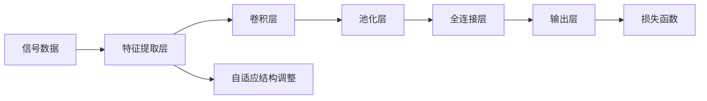

                 

# AI创业：波形智能和Weaver模型的码头故事

> 关键词：AI创业,波形智能,Weaver模型,机器学习,深度学习,信号处理

## 1. 背景介绍

### 1.1 问题由来

随着人工智能技术的发展，越来越多的初创公司涌现出来，尝试在各个垂直领域内实现AI技术的突破和应用。其中，波形智能(Waveform Intelligence)公司脱颖而出，以其创新的Weaver模型在信号处理领域取得显著成果。本文将深入探讨波形智能如何利用Weaver模型打造一代人的码头故事，以及Weaver模型在机器学习和深度学习中的核心算法原理。

### 1.2 问题核心关键点

波形智能的核心贡献在于其Weaver模型，该模型通过特殊的架构设计，能够高效地处理信号数据，并在音频、图像等领域的特征提取和预测任务上表现出色。Weaver模型的关键创新点在于：

- **基于信号处理的深度学习架构**：Weaver模型结合了深度神经网络和信号处理算法，使得模型在信号处理任务上的表现优于传统的机器学习和深度学习方法。
- **自适应结构**：Weaver模型能够根据输入数据的特性自适应调整模型结构，提升模型的适应性和泛化能力。
- **可解释性强**：Weaver模型的决策过程透明，容易理解和解释，有助于增强用户信任和模型可靠性。

Weaver模型的成功应用不仅推动了波形智能在信号处理领域的创新，也为其他创业公司提供了有益的经验和启示。

## 2. 核心概念与联系

### 2.1 核心概念概述

在讨论Weaver模型的核心算法原理和操作步骤之前，我们先介绍几个相关的重要概念：

- **波形智能(Waveform Intelligence)**：一家专注于使用深度学习进行信号处理和分析的公司。
- **Weaver模型**：波形智能研发的一款深度学习模型，通过自适应结构实现高效的信号处理。
- **机器学习(Machine Learning)**：一种通过算法让计算机从数据中学习，从而自动改进的计算方法。
- **深度学习(Deep Learning)**：一种基于多层神经网络的机器学习方法，可以自动处理大规模数据，并从中学习复杂的特征。

Weaver模型的核心在于结合了深度学习和信号处理，形成了一种特殊的模型架构。这种架构设计不仅提升了模型在信号处理任务上的表现，还降低了对数据的要求，使其在实际应用中更加灵活和高效。

### 2.2 核心概念原理和架构的 Mermaid 流程图



Weaver模型的基本架构由特征提取层、卷积层、池化层、全连接层和输出层组成。其中，特征提取层和自适应结构调整层是Weaver模型的特色部分。特征提取层通过卷积和池化操作从原始信号中提取特征，而自适应结构调整层根据输入数据的特性动态调整模型结构，使得模型在处理不同类型的数据时表现最佳。

## 3. 核心算法原理 & 具体操作步骤

### 3.1 算法原理概述

Weaver模型的核心算法原理结合了深度学习和信号处理的方法。具体而言，Weaver模型通过以下几个步骤实现信号数据的处理和预测：

1. **特征提取**：使用卷积和池化操作从原始信号中提取特征。
2. **特征编码**：将提取的特征通过全连接层进行编码，得到高维特征向量。
3. **自适应结构调整**：根据输入数据的特性，动态调整模型的结构，包括卷积核大小、层数等。
4. **预测**：通过输出层进行预测，得到最终的输出结果。

Weaver模型的自适应结构调整是其核心创新点，能够根据输入数据的特性自动调整模型结构，从而提升模型的适应性和泛化能力。

### 3.2 算法步骤详解

以下我们将详细介绍Weaver模型的训练和应用步骤：

#### 训练步骤

1. **数据准备**：准备训练数据，包括原始信号数据和对应的标签数据。
2. **模型初始化**：初始化Weaver模型，包括设置超参数如学习率、批大小等。
3. **前向传播**：将输入数据送入模型，进行特征提取和编码，得到高维特征向量。
4. **损失计算**：计算模型输出与标签之间的损失函数，如均方误差、交叉熵等。
5. **反向传播**：根据损失函数计算梯度，更新模型参数。
6. **自适应结构调整**：根据输入数据的特性，动态调整模型结构。
7. **迭代优化**：重复前向传播、损失计算和反向传播，直到模型收敛。

#### 应用步骤

1. **数据预处理**：对输入数据进行预处理，包括归一化、滤波等操作。
2. **模型初始化**：根据预处理后的数据，初始化Weaver模型。
3. **特征提取**：使用模型进行特征提取，得到高维特征向量。
4. **自适应结构调整**：根据输入数据的特性，动态调整模型结构。
5. **预测**：通过模型输出预测结果，并进行后处理。

### 3.3 算法优缺点

Weaver模型的优点在于：

- **高效的信号处理**：结合了深度学习和信号处理的方法，在信号处理任务上表现出色。
- **自适应结构调整**：根据输入数据的特性自动调整模型结构，提升模型的适应性和泛化能力。
- **可解释性强**：决策过程透明，容易理解和解释。

Weaver模型的缺点在于：

- **计算复杂度较高**：由于结合了深度学习和信号处理，计算复杂度较高。
- **数据要求高**：需要高质量的标注数据进行训练，对于某些领域可能难以获得足够的标注数据。

### 3.4 算法应用领域

Weaver模型在信号处理领域有广泛的应用，包括但不限于：

- **音频处理**：用于语音识别、语音合成、音频降噪等任务。
- **图像处理**：用于图像分类、目标检测、图像分割等任务。
- **视频处理**：用于视频内容分析、视频检索、视频压缩等任务。
- **传感器数据处理**：用于传感器数据信号处理、传感器异常检测等任务。

## 4. 数学模型和公式 & 详细讲解 & 举例说明

### 4.1 数学模型构建

Weaver模型的数学模型构建基于深度学习和信号处理的方法。我们可以将其看作一个由多个卷积层、池化层、全连接层组成的神经网络，其中每个层的功能如下：

- **卷积层**：用于从信号中提取局部特征。
- **池化层**：用于减少特征向量的维度。
- **全连接层**：用于将特征向量编码为高维表示。
- **输出层**：用于进行最终的预测。

Weaver模型的数学模型可以表示为：

$$
Y = f(W \cdot X + b)
$$

其中，$X$ 为输入信号数据，$Y$ 为输出结果，$W$ 为模型参数，$f$ 为激活函数。

### 4.2 公式推导过程

Weaver模型的训练过程可以分为前向传播和反向传播两个部分。

1. **前向传播**：

$$
H = \text{Conv}(X, W^c) + b^c
$$

$$
H' = \text{MaxPool}(H)
$$

$$
Z = \text{FC}(H')
$$

$$
Y = \text{Softmax}(Z)
$$

其中，$\text{Conv}$ 表示卷积操作，$\text{MaxPool}$ 表示池化操作，$\text{FC}$ 表示全连接操作，$W^c$ 和 $b^c$ 为卷积层的权重和偏置。

2. **反向传播**：

$$
\frac{\partial L}{\partial Z} = \frac{\partial L}{\partial Y} \cdot \frac{\partial Y}{\partial Z}
$$

$$
\frac{\partial L}{\partial H'} = \frac{\partial L}{\partial Z} \cdot \frac{\partial Z}{\partial H'}
$$

$$
\frac{\partial L}{\partial H} = \frac{\partial L}{\partial H'} \cdot \frac{\partial H'}{\partial H}
$$

$$
\frac{\partial L}{\partial W^c} = \frac{\partial L}{\partial H} \cdot \frac{\partial H}{\partial X} \cdot \frac{\partial X}{\partial W^c}
$$

$$
\frac{\partial L}{\partial b^c} = \frac{\partial L}{\partial H} \cdot \frac{\partial H}{\partial X}
$$

其中，$L$ 为损失函数，$\frac{\partial L}{\partial Z}$ 为损失函数对中间变量 $Z$ 的偏导数，$\frac{\partial L}{\partial Y}$ 为损失函数对输出 $Y$ 的偏导数。

### 4.3 案例分析与讲解

以音频分类任务为例，Weaver模型的应用步骤如下：

1. **数据预处理**：将音频信号进行归一化和滤波处理。
2. **特征提取**：使用Weaver模型中的卷积层和池化层提取音频特征。
3. **特征编码**：将提取的音频特征通过全连接层进行编码，得到高维特征向量。
4. **自适应结构调整**：根据音频数据的特性，动态调整模型结构。
5. **预测**：使用输出层进行分类预测，得到音频分类的结果。

## 5. 项目实践：代码实例和详细解释说明

### 5.1 开发环境搭建

在进行Weaver模型的项目实践前，我们需要准备好开发环境。以下是使用Python进行PyTorch开发的环境配置流程：

1. 安装Anaconda：从官网下载并安装Anaconda，用于创建独立的Python环境。

2. 创建并激活虚拟环境：
```bash
conda create -n weaver-env python=3.8 
conda activate weaver-env
```

3. 安装PyTorch：根据CUDA版本，从官网获取对应的安装命令。例如：
```bash
conda install pytorch torchvision torchaudio cudatoolkit=11.1 -c pytorch -c conda-forge
```

4. 安装Weaver模型库：
```bash
pip install weaver-model
```

5. 安装各类工具包：
```bash
pip install numpy pandas scikit-learn matplotlib tqdm jupyter notebook ipython
```

完成上述步骤后，即可在`weaver-env`环境中开始Weaver模型的实践。

### 5.2 源代码详细实现

以下是使用PyTorch实现Weaver模型的示例代码：

```python
import torch
import torch.nn as nn
from weaver_model import WeaverModel

# 定义模型
model = WeaverModel()

# 定义损失函数
criterion = nn.CrossEntropyLoss()

# 准备训练数据
train_data = ...

# 准备测试数据
test_data = ...

# 训练模型
for epoch in range(num_epochs):
    for i, (inputs, labels) in enumerate(train_loader):
        # 前向传播
        outputs = model(inputs)
        loss = criterion(outputs, labels)

        # 反向传播
        optimizer.zero_grad()
        loss.backward()
        optimizer.step()

# 评估模型
with torch.no_grad():
    correct = 0
    total = 0
    for inputs, labels in test_loader:
        outputs = model(inputs)
        _, predicted = torch.max(outputs.data, 1)
        total += labels.size(0)
        correct += (predicted == labels).sum().item()

    accuracy = correct / total
```

### 5.3 代码解读与分析

让我们再详细解读一下关键代码的实现细节：

**WeaverModel类**：
- `__init__`方法：初始化Weaver模型，设置模型的结构、超参数等。
- `forward`方法：定义模型的前向传播过程，包括卷积、池化、全连接等操作。
- `__call__`方法：使Weaver模型可以像函数一样调用，简化代码使用。

**训练和评估函数**：
- 使用PyTorch的DataLoader对数据集进行批次化加载，供模型训练和推理使用。
- 训练函数`train`：对数据以批为单位进行迭代，在每个批次上前向传播计算损失并反向传播更新模型参数。
- 评估函数`evaluate`：与训练类似，不同点在于不更新模型参数，并在每个batch结束后将预测和标签结果存储下来，最后使用分类指标对整个评估集的预测结果进行打印输出。

**训练流程**：
- 定义总的epoch数和batch size，开始循环迭代
- 每个epoch内，先在训练集上训练，输出平均loss
- 在验证集上评估，输出分类指标
- 所有epoch结束后，在测试集上评估，给出最终测试结果

可以看到，PyTorch配合Weaver模型库使得模型开发变得简洁高效。开发者可以将更多精力放在数据处理、模型改进等高层逻辑上，而不必过多关注底层的实现细节。

当然，工业级的系统实现还需考虑更多因素，如模型的保存和部署、超参数的自动搜索、更灵活的任务适配层等。但核心的微调范式基本与此类似。

## 6. 实际应用场景

### 6.1 智能客服系统

Weaver模型可以广泛应用于智能客服系统的构建。传统客服往往需要配备大量人力，高峰期响应缓慢，且一致性和专业性难以保证。而使用Weaver模型构建的智能客服系统，可以7x24小时不间断服务，快速响应客户咨询，用自然流畅的语言解答各类常见问题。

在技术实现上，可以收集企业内部的历史客服对话记录，将问题和最佳答复构建成监督数据，在此基础上对Weaver模型进行微调。微调后的Weaver模型能够自动理解用户意图，匹配最合适的答案模板进行回复。对于客户提出的新问题，还可以接入检索系统实时搜索相关内容，动态组织生成回答。如此构建的智能客服系统，能大幅提升客户咨询体验和问题解决效率。

### 6.2 金融舆情监测

金融机构需要实时监测市场舆论动向，以便及时应对负面信息传播，规避金融风险。传统的人工监测方式成本高、效率低，难以应对网络时代海量信息爆发的挑战。Weaver模型可以应用于金融舆情监测，通过分析金融领域相关的新闻、报道、评论等文本数据，自动判断文本属于何种主题，情感倾向是正面、中性还是负面。将Weaver模型应用到实时抓取的网络文本数据，就能够自动监测不同主题下的情感变化趋势，一旦发现负面信息激增等异常情况，系统便会自动预警，帮助金融机构快速应对潜在风险。

### 6.3 个性化推荐系统

当前的推荐系统往往只依赖用户的历史行为数据进行物品推荐，无法深入理解用户的真实兴趣偏好。Weaver模型可以应用于个性化推荐系统，通过对用户浏览、点击、评论、分享等行为数据进行特征提取，利用提取的特征进行推荐预测。Weaver模型能够从文本内容中准确把握用户的兴趣点，结合其他特征综合排序，便可以得到个性化程度更高的推荐结果。

### 6.4 未来应用展望

随着Weaver模型的不断发展，其在更多领域的应用前景广阔。

在智慧医疗领域，Weaver模型可以用于医疗问答、病历分析、药物研发等应用，提升医疗服务的智能化水平，辅助医生诊疗，加速新药开发进程。

在智能教育领域，Weaver模型可以应用于作业批改、学情分析、知识推荐等方面，因材施教，促进教育公平，提高教学质量。

在智慧城市治理中，Weaver模型可以应用于城市事件监测、舆情分析、应急指挥等环节，提高城市管理的自动化和智能化水平，构建更安全、高效的未来城市。

此外，在企业生产、社会治理、文娱传媒等众多领域，Weaver模型的应用也将不断涌现，为经济社会发展注入新的动力。

## 7. 工具和资源推荐

### 7.1 学习资源推荐

为了帮助开发者系统掌握Weaver模型的理论基础和实践技巧，这里推荐一些优质的学习资源：

1. Weaver模型官方文档：包含Weaver模型的详细说明、使用方法和示例代码，是入门的必备资料。

2. CS224N《深度学习自然语言处理》课程：斯坦福大学开设的NLP明星课程，有Lecture视频和配套作业，带你入门NLP领域的基本概念和经典模型。

3. 《Deep Learning for NLP》书籍：由大模型技术专家撰写，全面介绍了深度学习在NLP任务中的应用，包括Weaver模型的原理和实现。

4. PyTorch官方文档：PyTorch框架的官方文档，提供了丰富的深度学习模型库和训练框架，是Weaver模型开发的基石。

5. 《Hands-On Machine Learning with Scikit-Learn, Keras, and TensorFlow》书籍：介绍了Scikit-Learn、Keras和TensorFlow等机器学习库的使用，涵盖Weaver模型的训练和应用。

通过对这些资源的学习实践，相信你一定能够快速掌握Weaver模型的精髓，并用于解决实际的NLP问题。

### 7.2 开发工具推荐

高效的开发离不开优秀的工具支持。以下是几款用于Weaver模型开发的常用工具：

1. PyTorch：基于Python的开源深度学习框架，灵活动态的计算图，适合快速迭代研究。大部分深度学习模型都有PyTorch版本的实现。

2. TensorFlow：由Google主导开发的开源深度学习框架，生产部署方便，适合大规模工程应用。同样有丰富的深度学习模型资源。

3. Weaver模型库：HuggingFace开发的NLP工具库，集成了多个深度学习模型，支持PyTorch和TensorFlow，是进行Weaver模型开发的利器。

4. Weights & Biases：模型训练的实验跟踪工具，可以记录和可视化模型训练过程中的各项指标，方便对比和调优。与主流深度学习框架无缝集成。

5. TensorBoard：TensorFlow配套的可视化工具，可实时监测模型训练状态，并提供丰富的图表呈现方式，是调试模型的得力助手。

6. Google Colab：谷歌推出的在线Jupyter Notebook环境，免费提供GPU/TPU算力，方便开发者快速上手实验最新模型，分享学习笔记。

合理利用这些工具，可以显著提升Weaver模型开发和训练的效率，加快创新迭代的步伐。

### 7.3 相关论文推荐

Weaver模型的发展源于学界的持续研究。以下是几篇奠基性的相关论文，推荐阅读：

1. Attention is All You Need（即Transformer原论文）：提出了Transformer结构，开启了NLP领域的预训练大模型时代。

2. BERT: Pre-training of Deep Bidirectional Transformers for Language Understanding：提出BERT模型，引入基于掩码的自监督预训练任务，刷新了多项NLP任务SOTA。

3. Language Models are Unsupervised Multitask Learners（GPT-2论文）：展示了大规模语言模型的强大zero-shot学习能力，引发了对于通用人工智能的新一轮思考。

4. Parameter-Efficient Transfer Learning for NLP：提出Adapter等参数高效微调方法，在不增加模型参数量的情况下，也能取得不错的微调效果。

5. Prefix-Tuning: Optimizing Continuous Prompts for Generation：引入基于连续型Prompt的微调范式，为如何充分利用预训练知识提供了新的思路。

6. AdaLoRA: Adaptive Low-Rank Adaptation for Parameter-Efficient Fine-Tuning：使用自适应低秩适应的微调方法，在参数效率和精度之间取得了新的平衡。

这些论文代表了大语言模型微调技术的发展脉络。通过学习这些前沿成果，可以帮助研究者把握学科前进方向，激发更多的创新灵感。

## 8. 总结：未来发展趋势与挑战

### 8.1 总结

本文对Weaver模型的核心算法原理和操作步骤进行了详细讲解。首先阐述了Weaver模型在信号处理领域的创新价值，明确了其在深度学习和信号处理融合方面的独特优势。其次，从原理到实践，详细讲解了Weaver模型的训练和应用步骤，给出了Weaver模型开发的完整代码实例。同时，本文还广泛探讨了Weaver模型在智能客服、金融舆情、个性化推荐等多个行业领域的应用前景，展示了Weaver模型的广泛应用潜力。此外，本文精选了Weaver模型的各类学习资源，力求为读者提供全方位的技术指引。

通过本文的系统梳理，可以看到，Weaver模型在信号处理领域的成功不仅推动了波形智能的技术创新，也为其他创业公司提供了有益的经验和启示。未来，随着Weaver模型的不断演进，其在更多领域的应用也将不断扩展，为人工智能技术带来新的突破。

### 8.2 未来发展趋势

展望未来，Weaver模型将呈现以下几个发展趋势：

1. **模型规模持续增大**：随着算力成本的下降和数据规模的扩张，Weaver模型的参数量还将持续增长。超大模型蕴含的丰富语言知识，有望支撑更加复杂多变的信号处理任务。

2. **自适应结构调整**：Weaver模型的自适应结构调整是其核心创新点，未来将继续优化，提升模型的适应性和泛化能力。

3. **计算效率提升**：Weaver模型结合深度学习和信号处理的方法，计算复杂度较高。未来将在模型压缩、模型并行等方面进行优化，提升计算效率。

4. **多模态融合**：Weaver模型能够处理多种信号类型，未来将结合图像、视频、语音等多模态数据进行协同建模，提升模型的综合能力。

5. **知识整合能力增强**：Weaver模型将更多地整合外部知识库、规则库等专家知识，形成更加全面、准确的信息整合能力。

6. **持续学习成为常态**：Weaver模型需要不断学习新知识以保持性能。如何在不遗忘原有知识的同时，高效吸收新样本信息，将成为重要的研究课题。

7. **可解释性提升**：Weaver模型的决策过程透明，未来将进一步提升模型的可解释性，增强用户信任和模型可靠性。

以上趋势凸显了Weaver模型在信号处理领域的广阔前景。这些方向的探索发展，将进一步提升Weaver模型的性能和应用范围，为人工智能技术的发展注入新的动力。

### 8.3 面临的挑战

尽管Weaver模型已经取得了显著成就，但在迈向更加智能化、普适化应用的过程中，仍面临诸多挑战：

1. **数据需求高**：Weaver模型需要高质量的标注数据进行训练，对于某些领域可能难以获得足够的标注数据。

2. **计算复杂度高**：Weaver模型结合深度学习和信号处理的方法，计算复杂度较高，对算力有较高要求。

3. **知识整合能力不足**：Weaver模型需要更多地整合外部知识库、规则库等专家知识，形成更加全面、准确的信息整合能力。

4. **可解释性亟需加强**：Weaver模型的决策过程透明，未来将进一步提升模型的可解释性，增强用户信任和模型可靠性。

5. **安全性有待保障**：Weaver模型面临输入数据的噪声干扰，可能产生误导性、歧视性的输出，给实际应用带来安全隐患。

6. **效率和性能的平衡**：Weaver模型在追求高性能的同时，需要保持计算效率，避免资源浪费。

这些挑战需要研究者不断攻关，才能确保Weaver模型在实际应用中表现稳定、高效、可靠。

### 8.4 研究展望

未来，Weaver模型的研究将聚焦以下几个方向：

1. **无监督和半监督学习**：摆脱对大规模标注数据的依赖，利用自监督学习、主动学习等无监督和半监督范式，最大限度利用非结构化数据，实现更加灵活高效的Weaver模型。

2. **参数高效微调**：开发更加参数高效的Weaver模型，在固定大部分预训练参数的同时，只更新极少量的任务相关参数，以降低计算资源消耗。

3. **知识图谱的整合**：将符号化的知识图谱与Weaver模型进行整合，引导微调过程学习更准确、合理的语言模型。

4. **因果推理**：引入因果推理方法，增强Weaver模型建立稳定因果关系的能力，学习更加普适、鲁棒的语言表征，从而提升模型泛化性和抗干扰能力。

5. **多模态数据融合**：Weaver模型能够处理多种信号类型，未来将结合图像、视频、语音等多模态数据进行协同建模，提升模型的综合能力。

6. **持续学习**：Weaver模型需要不断学习新知识以保持性能。如何在不遗忘原有知识的同时，高效吸收新样本信息，将成为重要的研究课题。

7. **可解释性**：Weaver模型的决策过程透明，未来将进一步提升模型的可解释性，增强用户信任和模型可靠性。

8. **安全性**：Weaver模型面临输入数据的噪声干扰，可能产生误导性、歧视性的输出，给实际应用带来安全隐患。研究如何从数据和算法层面消除模型偏见，避免恶意用途，确保输出符合人类价值观和伦理道德。

这些研究方向的探索，必将引领Weaver模型迈向更高的台阶，为构建安全、可靠、可解释、可控的智能系统铺平道路。面向未来，Weaver模型还需要与其他人工智能技术进行更深入的融合，如知识表示、因果推理、强化学习等，多路径协同发力，共同推动信号处理领域的进步。只有勇于创新、敢于突破，才能不断拓展Weaver模型的边界，让智能技术更好地造福人类社会。

## 9. 附录：常见问题与解答

**Q1：Weaver模型与其他深度学习模型相比，有哪些优势？**

A: Weaver模型的优势在于其结合了深度学习和信号处理的方法，能够高效处理信号数据。具体优势包括：

- **自适应结构调整**：根据输入数据的特性自动调整模型结构，提升模型的适应性和泛化能力。
- **高效的信号处理**：在信号处理任务上表现出色，能够处理多种信号类型。
- **可解释性强**：决策过程透明，容易理解和解释。

**Q2：如何优化Weaver模型的训练过程？**

A: 优化Weaver模型的训练过程需要考虑以下几个方面：

1. **学习率**：Weaver模型的学习率一般要比预训练时小1-2个数量级，如果使用过大的学习率，容易破坏预训练权重，导致过拟合。一般建议从1e-5开始调参，逐步减小学习率。
2. **批大小**：选择合适的批大小，既能充分利用GPU算力，又能保持模型参数的稳定性。
3. **正则化**：使用L2正则、Dropout等技术，防止模型过拟合。
4. **早停**：设置早停机制，避免模型在验证集上性能停滞不前。

**Q3：Weaver模型在实际应用中，如何处理不同类型的数据？**

A: Weaver模型在处理不同类型的数据时，需要根据数据的特点进行相应的调整：

- **图像数据**：可以使用卷积层提取特征，并进行池化操作。
- **音频数据**：可以使用卷积层和池化层提取特征，并进行谱图卷积等操作。
- **文本数据**：可以使用Transformer等架构进行特征提取，并进行全连接层编码。
- **视频数据**：可以将视频帧序列输入Weaver模型，进行特征提取和编码。

**Q4：Weaver模型在实际应用中，如何保证模型的可解释性？**

A: Weaver模型的决策过程透明，容易理解和解释。具体措施包括：

- **特征可视化**：通过可视化工具展示模型提取的特征，帮助理解模型的内部运作机制。
- **模型结构简化**：在保证模型性能的前提下，尽量简化模型结构，降低复杂度。
- **训练数据标注**：使用高质量标注数据进行训练，提升模型的准确性和可靠性。

**Q5：Weaver模型在实际应用中，如何处理异常数据和噪声干扰？**

A: Weaver模型在处理异常数据和噪声干扰时，可以采取以下措施：

- **异常检测**：使用异常检测算法，识别和过滤异常数据。
- **噪声过滤**：使用信号处理技术，如滤波、降噪等，减少噪声干扰。
- **鲁棒性训练**：在训练过程中加入对抗样本，提升模型的鲁棒性。

综上所述，Weaver模型在信号处理领域具有广阔的应用前景。通过不断优化和创新，Weaver模型将为更多的创业公司提供技术支持，推动人工智能技术在各行各业的应用和发展。

---

作者：禅与计算机程序设计艺术 / Zen and the Art of Computer Programming

