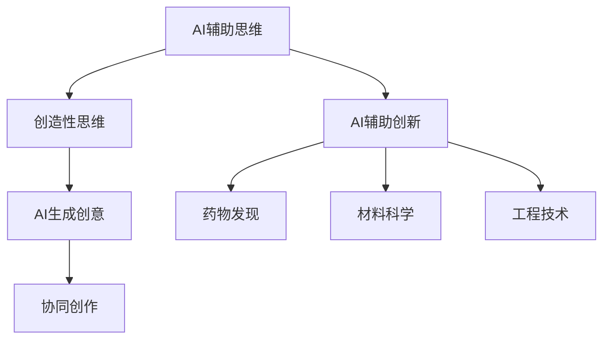

                 

## 1. 背景介绍

### 1.1 问题由来
在现代社会，信息技术的快速发展不仅改变了人类的生产方式，也极大地拓展了人类的思维疆界。人工智能（AI），特别是深度学习和神经网络技术的进步，为人类的思维与计算能力带来了革命性的提升。AI系统能够进行高阶的计算，处理海量数据，进行创造性思维，甚至在许多领域超越了人类的能力。然而，人类思维的局限性并未因AI的发展而消失，反而在AI的助力下，得以在更大的广度和深度上得到突破。

### 1.2 问题核心关键点
本文旨在深入探讨AI技术如何激发人类创意，突破思维局限，实现跨越式发展。我们将主要关注以下几个核心关键点：

- **AI辅助思维与创造力**：探讨AI如何在艺术、科学、工程等领域辅助人类进行创造性思维，激发新的创意。
- **AI生成创意**：介绍基于生成对抗网络（GANs）、变分自编码器（VAEs）等技术的AI生成创意方法，及其在艺术、设计、文学等领域的应用。
- **AI与人类协同创作**：分析AI如何与人类共同创作音乐、电影、文学等艺术作品，以及这种协同创作对人类创意的影响。
- **AI辅助创新**：研究AI在药物发现、材料科学、工程技术等领域如何辅助人类进行创新，推动科学进步。

## 2. 核心概念与联系

### 2.1 核心概念概述

为更好地理解AI在激发人类创意方面的作用，本节将介绍几个关键概念：

- **AI辅助思维**：指利用AI技术，如自然语言处理（NLP）、计算机视觉（CV）、语音识别（ASR）等，辅助人类进行思维与决策的过程。
- **创造性思维**：指通过非线性的、富有想象力的思维方式，产生新的想法和解决方案的过程。
- **AI生成创意**：指使用AI技术，如生成对抗网络（GANs）、变分自编码器（VAEs）等，直接生成具有创造性的内容，如艺术作品、音乐、文学等。
- **协同创作**：指AI与人类共同进行创作，将AI生成的内容与人类的创作意图相结合，产生新的艺术作品或技术成果。

这些核心概念之间的逻辑关系可以通过以下Mermaid流程图来展示：



这个流程图展示了AI在激发人类创意过程中的主要作用路径：AI辅助思维推动创造性思维，进而生成新的创意内容，并通过协同创作将AI生成的创意与人类创作相结合，产生新的成果。此外，AI还直接参与辅助人类在科技领域的创新，推动科学进步。

## 3. 核心算法原理 & 具体操作步骤

### 3.1 算法原理概述

AI在激发人类创意的过程中，主要基于以下几个核心算法原理：

- **生成对抗网络（GANs）**：一种通过对抗训练方式，生成与真实数据相似但不完全相同的伪数据的算法。GANs可以用于生成各种类型的创意内容，如艺术作品、音乐等。
- **变分自编码器（VAEs）**：一种利用变分推断生成数据的算法，可以用于生成高维数据，如音频、图像等。
- **神经网络与深度学习**：通过多层神经网络结构，学习数据的复杂模式，进而进行分类、生成等任务，是许多AI创意工具的基础。

### 3.2 算法步骤详解

AI激发创意的算法步骤主要包括以下几个关键步骤：

**Step 1: 数据准备与预处理**
- 收集并准备用于训练的创意数据集，如艺术作品、音乐、文学等。
- 对数据进行预处理，包括清洗、归一化、标注等操作，以适应模型的训练要求。

**Step 2: 选择合适的模型与架构**
- 根据任务需求，选择合适的AI模型，如GANs、VAEs、神经网络等。
- 设计模型的架构，包括网络层数、激活函数、损失函数等，以适应创意生成任务。

**Step 3: 训练与优化**
- 使用收集的数据集对模型进行训练，优化模型的参数，使其能够生成高质量的创意内容。
- 调整学习率、批大小、优化器等超参数，以提高训练效率和效果。

**Step 4: 创意生成与评估**
- 使用训练好的模型进行创意生成，输出新的内容。
- 对生成的创意进行评估，如通过专家评审、用户反馈等方式，优化模型生成效果。

**Step 5: 协同创作与迭代**
- 将AI生成的创意与人类创作进行结合，产生新的创意作品。
- 对协同创作过程进行迭代优化，不断提升AI辅助创意的效果。

### 3.3 算法优缺点

基于AI激发创意的方法具有以下优点：
1. **高效生成**：AI可以快速生成大量创意内容，极大节省人类创作时间。
2. **跨界融合**：AI可以将不同领域的创意进行融合，产生新颖的跨界作品。
3. **自动化创作**：AI在自动化创作过程中，可以生成具有独特风格的作品，打破传统创作模式。

同时，这些方法也存在一定的局限性：
1. **缺乏深度理解**：AI生成的创意可能缺乏人类深层的情感和思想，难以达到人类创作的高水准。
2. **版权与伦理问题**：AI生成的内容可能引发版权争议，同时需要关注伦理道德问题。
3. **依赖数据质量**：AI生成创意的效果高度依赖于训练数据的质量和多样性。

尽管存在这些局限性，AI激发创意的方法仍在大规模应用，为人类创作提供了新的工具和思路。

### 3.4 算法应用领域

基于AI激发创意的方法已经在多个领域得到了广泛应用，例如：

- **艺术创作**：AI可以生成绘画、音乐、舞蹈等艺术作品，辅助艺术家进行创作。
- **文学创作**：AI可以生成诗歌、小说等文学作品，辅助作家进行创作。
- **广告设计**：AI可以生成广告文案、海报等，辅助设计师进行创意表达。
- **游戏开发**：AI可以生成游戏场景、角色、剧情等，辅助游戏开发者进行创新。
- **科学研究**：AI可以生成模拟实验、模型预测等，辅助科学家进行新发现和新理论的探索。

## 4. 数学模型和公式 & 详细讲解 & 举例说明

### 4.1 数学模型构建

在本节中，我们将使用数学语言对AI激发创意的基本原理进行更加严格的刻画。

假设我们有一个生成模型 $G$，用于生成创意内容。模型的输入为随机噪声 $z$，输出为创意内容 $x$。模型的训练目标是最小化生成内容 $x$ 与真实数据 $x^*$ 之间的距离。

设 $\mathcal{X}$ 为创意内容的集合，$\mathcal{Z}$ 为噪声空间的集合。定义损失函数 $\mathcal{L}(x^*, x)$ 为创意内容 $x$ 与真实数据 $x^*$ 之间的差异。在训练过程中，我们希望最小化 $\mathcal{L}(x^*, G(z))$，即：

$$
\mathop{\min}_{G} \mathbb{E}_{x^* \sim p_{\text{data}}, z \sim p(z)} \mathcal{L}(x^*, G(z))
$$

其中 $p_{\text{data}}$ 为真实数据的分布，$p(z)$ 为噪声的分布。

### 4.2 公式推导过程

以生成对抗网络（GANs）为例，我们推导其基本公式。GANs由生成器 $G$ 和判别器 $D$ 两部分组成。生成器的目标是最小化其生成的创意内容 $G(z)$ 被判别器误判为真实数据的概率，即：

$$
\mathop{\min}_{G} \mathbb{E}_{x^* \sim p_{\text{data}}, z \sim p(z)} \log D(G(z))
$$

判别器的目标是最小化生成内容 $G(z)$ 被正确判别为假样本的概率，同时最大化生成内容 $x$ 被正确判别为真样本的概率，即：

$$
\mathop{\max}_{D} \mathbb{E}_{x^* \sim p_{\text{data}}} \log D(x^*) + \mathbb{E}_{z \sim p(z)} \log (1 - D(G(z)))
$$

结合两个目标，我们得到GANs的损失函数：

$$
\mathcal{L}_{\text{GAN}} = - \mathbb{E}_{x^* \sim p_{\text{data}}, z \sim p(z)} \log D(G(z)) - \mathbb{E}_{z \sim p(z)} \log (1 - D(G(z)))
$$

### 4.3 案例分析与讲解

以生成对抗网络（GANs）为例，其核心思想是通过对抗训练，使得生成器 $G$ 能够生成高质量的创意内容。以下是一个简单的GANs实现：

```python
import torch
import torch.nn as nn
import torch.optim as optim

# 定义生成器
class Generator(nn.Module):
    def __init__(self, input_dim, output_dim):
        super(Generator, self).__init__()
        self.fc1 = nn.Linear(input_dim, 256)
        self.fc2 = nn.Linear(256, 512)
        self.fc3 = nn.Linear(512, output_dim)

    def forward(self, x):
        x = nn.functional.leaky_relu(self.fc1(x))
        x = nn.functional.leaky_relu(self.fc2(x))
        x = self.fc3(x)
        return x

# 定义判别器
class Discriminator(nn.Module):
    def __init__(self, input_dim, output_dim):
        super(Discriminator, self).__init__()
        self.fc1 = nn.Linear(input_dim, 256)
        self.fc2 = nn.Linear(256, 512)
        self.fc3 = nn.Linear(512, 1)

    def forward(self, x):
        x = nn.functional.leaky_relu(self.fc1(x))
        x = nn.functional.leaky_relu(self.fc2(x))
        x = self.fc3(x)
        return x

# 定义损失函数
criterion = nn.BCELoss()

# 训练循环
for epoch in range(num_epochs):
    for batch in data_loader:
        real_images, _ = batch
        noise = torch.randn(real_images.size(0), latent_dim)
        fake_images = generator(noise)
        
        # 判别器训练
        real_labels = torch.ones_like(real_images)
        fake_labels = torch.zeros_like(fake_images)
        real_loss = criterion(discriminator(real_images), real_labels)
        fake_loss = criterion(discriminator(fake_images.detach()), fake_labels)
        d_loss = real_loss + fake_loss
        
        # 生成器训练
        g_loss = criterion(discriminator(fake_images), real_labels)
        
        # 更新参数
        discriminator_optimizer.zero_grad()
        d_loss.backward()
        discriminator_optimizer.step()
        
        generator_optimizer.zero_grad()
        g_loss.backward()
        generator_optimizer.step()
```

在这个示例中，我们使用了生成器 $G$ 和判别器 $D$ 分别对噪声进行编码生成创意内容，并通过交叉熵损失函数对 $D$ 进行训练，使得 $D$ 能够正确区分真实数据和生成数据。同时，对 $G$ 进行反向传播，以最小化 $D$ 对生成数据的误判。通过这种对抗训练方式，生成器 $G$ 逐渐能够生成高质量的创意内容。

## 5. 项目实践：代码实例和详细解释说明

### 5.1 开发环境搭建

在进行AI创意生成实践前，我们需要准备好开发环境。以下是使用Python进行TensorFlow开发的环境配置流程：

1. 安装Anaconda：从官网下载并安装Anaconda，用于创建独立的Python环境。

2. 创建并激活虚拟环境：
```bash
conda create -n tf-env python=3.8 
conda activate tf-env
```

3. 安装TensorFlow：根据CUDA版本，从官网获取对应的安装命令。例如：
```bash
conda install tensorflow-gpu -c conda-forge
```

4. 安装Keras：
```bash
pip install keras
```

5. 安装各类工具包：
```bash
pip install numpy pandas scikit-learn matplotlib tqdm jupyter notebook ipython
```

完成上述步骤后，即可在`tf-env`环境中开始AI创意生成的实践。

### 5.2 源代码详细实现

这里我们以生成对抗网络（GANs）生成艺术作品为例，给出TensorFlow的代码实现。

首先，定义生成器（Generator）和判别器（Discriminator）模型：

```python
import tensorflow as tf
from tensorflow.keras import layers

# 定义生成器
def make_generator_model():
    model = tf.keras.Sequential()
    model.add(layers.Dense(256, use_bias=False, input_shape=(100,)))
    model.add(layers.BatchNormalization())
    model.add(layers.LeakyReLU())
    model.add(layers.Dense(512))
    model.add(layers.BatchNormalization())
    model.add(layers.LeakyReLU())
    model.add(layers.Dense(784, activation='tanh'))
    return model

# 定义判别器
def make_discriminator_model():
    model = tf.keras.Sequential()
    model.add(layers.Flatten(input_shape=[28, 28]))
    model.add(layers.Dense(512))
    model.add(layers.LeakyReLU())
    model.add(layers.Dropout(0.3))
    model.add(layers.Dense(10))
    return model
```

然后，定义损失函数和优化器：

```python
# 定义损失函数
def discriminator_loss(real_output, fake_output):
    real_loss = real_output
    fake_loss = tf.reduce_mean(tf.nn.sigmoid_cross_entropy_with_logits(labels=tf.ones_like(fake_output), logits=fake_output))
    return real_loss + fake_loss

def generator_loss(fake_output):
    return tf.reduce_mean(tf.nn.sigmoid_cross_entropy_with_logits(labels=tf.ones_like(fake_output), logits=fake_output))

# 定义优化器
generator_optimizer = tf.keras.optimizers.Adam(learning_rate=0.0002, beta_1=0.5)
discriminator_optimizer = tf.keras.optimizers.Adam(learning_rate=0.0002, beta_1=0.5)
```

接着，定义训练函数：

```python
# 定义训练函数
@tf.function
def train_step(images):
    noise = tf.random.normal([BATCH_SIZE, NOISE_DIM])
    with tf.GradientTape() as gen_tape, tf.GradientTape() as disc_tape:
        generated_images = generator(noise, training=True)
        real_output = discriminator(images, training=True)
        fake_output = discriminator(generated_images, training=True)
        
        gen_loss = generator_loss(fake_output)
        disc_loss = discriminator_loss(real_output, fake_output)
        
    gradients_of_generator = gen_tape.gradient(gen_loss, generator.trainable_variables)
    gradients_of_discriminator = disc_tape.gradient(disc_loss, discriminator.trainable_variables)
    
    generator_optimizer.apply_gradients(zip(gradients_of_generator, generator.trainable_variables))
    discriminator_optimizer.apply_gradients(zip(gradients_of_discriminator, discriminator.trainable_variables))
```

最后，启动训练流程：

```python
# 加载数据集
(train_images, train_labels), (_, _) = tf.keras.datasets.mnist.load_data()
train_images = train_images.reshape(train_images.shape[0], 28 * 28).astype('float32')
train_images = (train_images - 127.5) / 127.5
BUFFER_SIZE = 60000
BATCH_SIZE = 256
train_dataset = tf.data.Dataset.from_tensor_slices(train_images).shuffle(BUFFER_SIZE).batch(BATCH_SIZE)

# 定义训练参数
EPOCHS = 50
NOISE_DIM = 100

# 训练
for epoch in range(EPOCHS):
    for image_batch in train_dataset:
        train_step(image_batch)
```

以上就是使用TensorFlow对GANs生成艺术作品进行训练的完整代码实现。可以看到，TensorFlow的高级API使得代码实现简洁高效，易于扩展和维护。

### 5.3 代码解读与分析

让我们再详细解读一下关键代码的实现细节：

**Generator类**：
- 定义了生成器网络的结构，包括输入层、隐藏层、输出层等。
- 使用ReLU激活函数和BatchNormalization正则化技术，加速模型收敛。

**Discriminator类**：
- 定义了判别器网络的结构，包括输入层、隐藏层、输出层等。
- 使用LeakyReLU激活函数和Dropout正则化技术，防止过拟合。

**train_step函数**：
- 定义了训练过程的每个步骤，包括前向传播计算损失、反向传播更新参数等。
- 使用TensorFlow的GradientTape自动求导，简化代码实现。

**训练流程**：
- 加载MNIST数据集，并进行预处理。
- 定义训练参数，如epoch数、batch大小、噪声维度等。
- 在每个epoch内，对数据集进行迭代训练，更新模型参数。
- 训练过程中，实时监控训练进度和效果，确保模型收敛。

可以看到，TensorFlow的高层API使得GANs的代码实现变得简洁高效，开发者可以将更多精力放在模型设计和训练调优上，而不必过多关注底层细节。

当然，工业级的系统实现还需考虑更多因素，如模型的保存和部署、超参数的自动搜索、更灵活的任务适配层等。但核心的生成过程基本与此类似。

## 6. 实际应用场景

### 6.1 广告设计

AI生成的创意可以用于广告设计，生成各种类型的广告文案、海报、视频等，帮助广告设计师快速产生多种创意方案，提升广告创意的多样性和效果。

### 6.2 游戏开发

AI生成的创意可以用于游戏开发，生成角色、场景、道具等，辅助游戏开发者进行创意表达和创新。例如，AI可以生成新故事线、新关卡等，丰富游戏内容和体验。

### 6.3 科学研究

AI生成的创意可以用于科学研究，生成模拟实验、模型预测等，辅助科学家进行新发现和新理论的探索。例如，AI可以生成新的实验设计、新的理论假设等，推动科学进步。

### 6.4 未来应用展望

随着AI创意生成技术的不断进步，其应用场景将进一步扩展，为人类创作提供更强大的工具。

在智慧医疗领域，AI可以生成个性化的医疗方案、虚拟医生等，提升医疗服务的质量和效率。

在智能教育领域，AI可以生成个性化的教学方案、智能辅导等，促进教育公平，提高教学质量。

在智慧城市治理中，AI可以生成智能交通系统、智慧安防等，提高城市管理的智能化水平，构建更安全、高效的未来城市。

此外，在企业生产、社会治理、文娱传媒等众多领域，AI创意生成技术也将不断涌现，为NLP技术带来新的突破。相信随着技术的日益成熟，AI创意生成必将在更广阔的应用领域大放异彩。

## 7. 工具和资源推荐
### 7.1 学习资源推荐

为了帮助开发者系统掌握AI创意生成的理论基础和实践技巧，这里推荐一些优质的学习资源：

1. TensorFlow官方文档：TensorFlow的官方文档，提供了完整的API文档和丰富的示例代码，是学习TensorFlow的重要资源。

2. Keras官方文档：Keras的官方文档，提供了简洁易用的API接口，适合快速上手TensorFlow。

3. Deep Learning with Python：Ian Goodfellow等合著的深度学习入门书籍，详细介绍了深度学习的原理和实践，适合初学者学习。

4. Deep Learning Specialization：Coursera上的深度学习专项课程，由Andrew Ng讲授，深入浅出地介绍了深度学习的基本概念和应用。

5. The Elements of Artificial Intelligence：MIT等合著的人工智能入门书籍，介绍了AI的基本原理和应用，适合跨学科学习。

通过对这些资源的学习实践，相信你一定能够快速掌握AI创意生成的精髓，并用于解决实际的AI创意生成问题。

### 7.2 开发工具推荐

高效的开发离不开优秀的工具支持。以下是几款用于AI创意生成开发的常用工具：

1. TensorFlow：由Google主导开发的开源深度学习框架，生产部署方便，适合大规模工程应用。

2. PyTorch：基于Python的开源深度学习框架，灵活高效，适合快速迭代研究。

3. Jupyter Notebook：交互式开发环境，支持代码编写、数据可视化等，适合快速原型开发和实验验证。

4. Weights & Biases：模型训练的实验跟踪工具，可以记录和可视化模型训练过程中的各项指标，方便对比和调优。

5. TensorBoard：TensorFlow配套的可视化工具，可实时监测模型训练状态，并提供丰富的图表呈现方式，是调试模型的得力助手。

合理利用这些工具，可以显著提升AI创意生成任务的开发效率，加快创新迭代的步伐。

### 7.3 相关论文推荐

AI创意生成技术的发展源于学界的持续研究。以下是几篇奠基性的相关论文，推荐阅读：

1. Generative Adversarial Nets：Ian Goodfellow等撰写的生成对抗网络（GANs）论文，奠定了GANs的理论基础。

2. Variational Autoencoders：Diederik P. Kingma等撰写的变分自编码器（VAEs）论文，介绍了VAEs的基本原理和应用。

3. StyleGAN：Tero Karras等撰写的风格生成对抗网络（StyleGAN）论文，展示了GANs在图像生成方面的强大能力。

4. GPT-3：OpenAI发布的GPT-3模型，展示了大型语言模型在文本生成方面的潜力。

5. DALL·E：OpenAI发布的DALL·E模型，展示了AI在生成图像方面的创造力。

这些论文代表了大创意生成技术的发展脉络。通过学习这些前沿成果，可以帮助研究者把握学科前进方向，激发更多的创新灵感。

## 8. 总结：未来发展趋势与挑战

### 8.1 总结

本文对AI激发创意的原理和方法进行了全面系统的介绍。首先阐述了AI在艺术、科学、工程等领域激发人类创意的重要性，明确了AI在推动人类思维突破方面的独特价值。其次，从原理到实践，详细讲解了GANs、VAEs等核心算法，给出了AI创意生成的完整代码实例。同时，本文还广泛探讨了AI创意生成在广告设计、游戏开发、科学研究等领域的实际应用前景，展示了AI创意生成的巨大潜力。最后，本文精选了AI创意生成的学习资源、开发工具和相关论文，力求为读者提供全方位的技术指引。

通过本文的系统梳理，可以看到，AI创意生成技术正在成为AI应用的重要范式，极大拓展了人类创作的能力和想象力，推动了艺术的革新和科学的进步。相信随着技术的不断演进，AI创意生成必将在更广阔的领域得到应用，带来新的创意浪潮。

### 8.2 未来发展趋势

展望未来，AI创意生成技术将呈现以下几个发展趋势：

1. 生成内容的个性化：AI生成的内容将更加符合用户的个性化需求，实现定制化生成。
2. 生成过程的交互性：AI生成的过程将更加智能化，用户可以实时参与创意生成，提出修改意见，引导生成结果。
3. 生成内容的多样性：AI生成的内容将更加丰富多样，跨界融合更多领域的内容。
4. 生成模型的可解释性：AI生成模型的决策过程将更加透明，能够解释其生成内容的原因和背景。
5. 生成技术的普适性：AI创意生成技术将更加普适，能够应用于更多的领域和场景，推动全社会创新。

以上趋势凸显了AI创意生成技术的广阔前景。这些方向的探索发展，必将进一步提升AI创意生成的效果和应用范围，为人类创作提供更强大的工具。

### 8.3 面临的挑战

尽管AI创意生成技术已经取得了瞩目成就，但在迈向更加智能化、普适化应用的过程中，它仍面临着诸多挑战：

1. 内容质量的控制：AI生成的内容可能质量参差不齐，无法满足用户的期望。
2. 版权与伦理问题：AI生成的内容可能引发版权争议，同时需要关注伦理道德问题。
3. 创意的独特性：AI生成的内容可能缺乏人类独特的情感和思想，难以达到人类创作的高水准。
4. 技术的瓶颈：AI创意生成技术的瓶颈在于如何提升生成内容的质量和多样性，同时保持模型的可解释性和公平性。

尽管存在这些挑战，AI创意生成技术仍是大有可为的，其发展前景依然广阔。研究者需要通过技术创新和算法优化，不断突破这些挑战，实现AI创意生成的突破性进展。

### 8.4 研究展望

面对AI创意生成所面临的挑战，未来的研究需要在以下几个方面寻求新的突破：

1. 提升生成内容的质量：通过改进生成模型和优化训练数据，提高生成内容的独特性和创意性。
2. 增强生成内容的可解释性：通过引入符号化的先验知识，指导生成模型的决策过程，提高生成内容的可解释性。
3. 优化生成模型的公平性：通过数据清洗和算法设计，减少生成内容中的偏见和歧视，确保生成内容的多样性和公平性。
4. 探索新型的生成技术：通过引入更多的先验知识，如知识图谱、逻辑规则等，推动AI创意生成技术的创新。

这些研究方向的探索，必将引领AI创意生成技术迈向更高的台阶，为构建安全、可靠、可解释、可控的智能系统铺平道路。面向未来，AI创意生成技术还需要与其他人工智能技术进行更深入的融合，如知识表示、因果推理、强化学习等，多路径协同发力，共同推动人工智能技术的发展。

## 9. 附录：常见问题与解答

**Q1：AI创意生成技术的应用场景有哪些？**

A: AI创意生成技术已经在多个领域得到了广泛应用，例如：

- 广告设计：生成各种类型的广告文案、海报、视频等，帮助广告设计师快速产生多种创意方案，提升广告创意的多样性和效果。
- 游戏开发：生成角色、场景、道具等，辅助游戏开发者进行创意表达和创新。
- 科学研究：生成模拟实验、模型预测等，辅助科学家进行新发现和新理论的探索。
- 智慧医疗：生成个性化的医疗方案、虚拟医生等，提升医疗服务的质量和效率。
- 智能教育：生成个性化的教学方案、智能辅导等，促进教育公平，提高教学质量。
- 智慧城市：生成智能交通系统、智慧安防等，提高城市管理的智能化水平，构建更安全、高效的未来城市。

这些应用场景展示了AI创意生成技术的广泛前景和巨大潜力。

**Q2：AI创意生成技术是否能够替代人类创作？**

A: AI创意生成技术在许多领域已经展现出了强大的能力，能够生成高质量的创意内容，但完全替代人类创作目前还存在一定的局限性。AI生成的内容可能缺乏人类深层次的情感和思想，难以达到人类创作的高水准。因此，AI创意生成技术更多是作为人类创作的有力辅助，而非完全替代。

**Q3：AI创意生成技术的瓶颈在哪里？**

A: AI创意生成技术的瓶颈在于如何提升生成内容的质量和多样性，同时保持模型的可解释性和公平性。以下是主要瓶颈：

1. 内容质量的控制：AI生成的内容可能质量参差不齐，无法满足用户的期望。
2. 版权与伦理问题：AI生成的内容可能引发版权争议，同时需要关注伦理道德问题。
3. 创意的独特性：AI生成的内容可能缺乏人类独特的情感和思想，难以达到人类创作的高水准。
4. 技术的瓶颈：AI创意生成技术的瓶颈在于如何提升生成内容的质量和多样性，同时保持模型的可解释性和公平性。

尽管存在这些挑战，AI创意生成技术仍是大有可为的，其发展前景依然广阔。研究者需要通过技术创新和算法优化，不断突破这些挑战，实现AI创意生成的突破性进展。

---

作者：禅与计算机程序设计艺术 / Zen and the Art of Computer Programming

