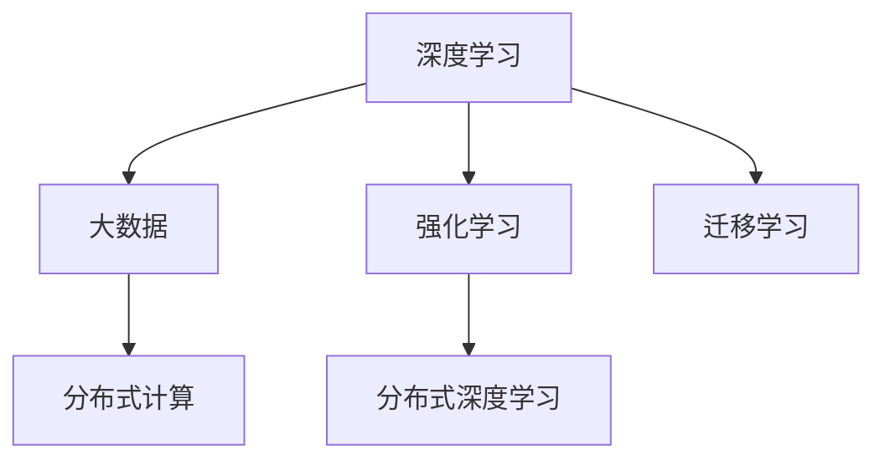

                 

# AI发展的三大支柱：回顾与展望

## 1. 背景介绍

随着人工智能(AI)技术的迅猛发展，其在各行各业的应用日益广泛，对社会的各个方面产生了深远的影响。本文将回顾和展望AI发展的三大支柱，包括深度学习、强化学习和大数据，探讨它们如何推动AI技术的进步，并展望未来发展的趋势。

### 1.1 深度学习
深度学习(Deep Learning)是AI领域的一个重要分支，通过模拟人脑神经网络的结构，实现了对复杂非线性数据的有效建模。深度学习的核心算法包括前馈神经网络(Feedforward Neural Network, FNN)、卷积神经网络(Convolutional Neural Network, CNN)、循环神经网络(Recurrent Neural Network, RNN)等。

### 1.2 强化学习
强化学习(Reinforcement Learning, RL)是一种通过试错学习，优化智能体在复杂环境中的决策能力的机器学习方法。其核心思想是智能体在与环境的交互中，根据当前状态和行动，通过奖惩机制不断调整策略，以最大化长期累积奖励。

### 1.3 大数据
大数据(大数据)技术是指在海量数据中提取、存储、处理和分析有用信息的技术。它与AI技术的结合，为深度学习和强化学习的训练和应用提供了坚实的基础。

## 2. 核心概念与联系

### 2.1 核心概念概述

为更好地理解AI发展的三大支柱，本节将介绍几个密切相关的核心概念：

- 深度学习：以多层神经网络为代表的机器学习范式，通过反向传播算法训练模型参数，使其能够自动提取数据中的高层次特征。

- 强化学习：通过智能体与环境的交互，学习优化决策策略的机器学习方法，广泛用于游戏、自动驾驶、机器人等领域。

- 大数据：指在海量数据中提取有价值信息的技术，包括数据采集、存储、处理和分析等环节。

- 迁移学习：将一个领域学到的知识迁移到另一个相关领域的技术，通过微调模型，快速适应新任务。

- 分布式计算：通过将任务分布到多台计算机上并行执行，提高大数据处理和深度学习模型的训练效率。

- 深度强化学习：将深度学习与强化学习结合，用于解决更复杂的环境决策问题，如AlphaGo、AlphaStar等。

- 分布式深度学习：通过分布式计算框架，如Apache Spark、TensorFlow分布式等，提高深度学习模型的训练速度和可扩展性。

这些核心概念之间的逻辑关系可以通过以下Mermaid流程图来展示：



这个流程图展示了大数据、深度学习和强化学习之间相互依赖和促进的关系：

1. 大数据为深度学习提供了数据基础，使其能够高效训练。
2. 深度学习模型在处理大数据时，也离不开分布式计算的支持。
3. 强化学习通过深度学习模型进行决策优化，使得智能体能够在复杂环境中做出合理选择。
4. 分布式深度学习和分布式计算进一步提升了大数据处理和深度学习模型的效率。
5. 迁移学习通过微调模型，使得深度学习模型可以适应新的任务。

这些核心概念共同构成了AI技术的核心框架，为其快速发展提供了强大的技术支撑。通过理解这些核心概念，我们可以更好地把握AI技术的演进方向和应用前景。

## 3. 核心算法原理 & 具体操作步骤

### 3.1 算法原理概述

AI发展的三大支柱均涉及复杂算法和计算模型。以下是深度学习、强化学习和大数据的核心算法原理：

#### 3.1.1 深度学习算法原理

深度学习通过多层神经网络对非线性数据进行建模。其核心算法包括反向传播算法(Backpropagation)、随机梯度下降算法(Stochastic Gradient Descent, SGD)、卷积神经网络(CNN)、循环神经网络(RNN)等。反向传播算法通过链式法则计算梯度，并更新模型参数，使得模型能够自动提取数据的高级特征。

#### 3.1.2 强化学习算法原理

强化学习通过智能体与环境的交互，学习优化决策策略。其核心算法包括Q-learning、SARSA、Deep Q-Network(DQN)等。Q-learning通过环境奖励信号指导智能体的行动，不断调整策略以最大化长期累积奖励。

#### 3.1.3 大数据算法原理

大数据算法包括数据采集、存储、处理和分析等环节。数据采集包括网络爬虫、传感器数据等；数据存储包括Hadoop、Spark等分布式文件系统；数据处理包括ETL(Extract, Transform, Load)过程；数据分析包括统计分析、机器学习等。

### 3.2 算法步骤详解

#### 3.2.1 深度学习算法步骤

深度学习算法的典型步骤如下：

1. 数据准备：收集和预处理数据集，分为训练集、验证集和测试集。
2. 模型设计：选择适当的神经网络结构，如卷积神经网络、循环神经网络等。
3. 模型训练：使用训练集数据，通过反向传播算法不断更新模型参数，以最小化损失函数。
4. 模型评估：在验证集上评估模型性能，调整超参数以优化模型。
5. 模型应用：使用测试集评估最终模型性能，并将其应用于实际问题中。

#### 3.2.2 强化学习算法步骤

强化学习算法的典型步骤如下：

1. 环境设定：定义智能体和环境，明确奖励机制。
2. 策略设计：选择适当的策略，如Q-learning、DQN等。
3. 策略优化：通过智能体与环境的交互，不断调整策略以最大化长期累积奖励。
4. 探索与利用：在策略优化过程中，平衡探索新策略和利用已有策略，以达到最佳效果。
5. 模型评估：在测试环境中评估策略性能，调整策略以优化决策能力。

#### 3.2.3 大数据算法步骤

大数据算法的典型步骤如下：

1. 数据采集：从各个数据源中采集数据。
2. 数据存储：将数据存储到分布式文件系统中，如Hadoop、Spark等。
3. 数据处理：使用ETL工具对数据进行清洗、转换和加载，提取有用信息。
4. 数据分析：使用统计分析、机器学习等方法，提取数据中的知识和模式。
5. 数据应用：将分析结果应用于实际问题中，如数据驱动的决策、预测和优化等。

### 3.3 算法优缺点

#### 3.3.1 深度学习的优缺点

深度学习的优点包括：

- 自动提取高级特征：能够自动从数据中提取复杂的特征，减少手动特征工程。
- 高性能：在大规模数据集上训练的模型通常具有较好的泛化能力。
- 可解释性：虽然模型本身难以解释，但可以通过模型压缩、可视化等技术，对特征和决策过程进行分析。

深度学习的缺点包括：

- 数据依赖：需要大量的标注数据进行训练，获取标注数据的成本较高。
- 过拟合风险：在标注数据不足的情况下，容易发生过拟合。
- 计算成本高：大规模深度学习模型的训练和推理需要大量计算资源。

#### 3.3.2 强化学习的优缺点

强化学习的优点包括：

- 自主学习：能够在没有明确标注的情况下，自主探索并优化决策策略。
- 适应性强：能够适应复杂的、动态的环境变化。
- 应用广泛：在游戏、机器人、自动驾驶等领域具有广泛应用前景。

强化学习的缺点包括：

- 不稳定：策略优化过程容易受到环境噪声和随机因素的影响，导致不稳定。
- 难以优化：优化过程通常是一个高维非凸问题，难以得到全局最优解。
- 需要大量试验：需要大量的环境试验，才能得到有效的策略。

#### 3.3.3 大数据的优缺点

大数据的优点包括：

- 数据来源广泛：可以从多个数据源获取数据，如传感器、社交网络、网络爬虫等。
- 处理能力强大：分布式计算框架能够处理海量数据，提高计算效率。
- 支持多领域应用：能够支持多领域的分析，如金融、医疗、交通等。

大数据的缺点包括：

- 数据质量问题：数据采集和存储过程中可能存在数据质量问题，影响分析结果。
- 存储和处理成本高：大规模数据的存储和处理需要大量硬件资源。
- 数据隐私和安全：大规模数据处理可能涉及用户隐私和数据安全问题，需要严格保护。

### 3.4 算法应用领域

#### 3.4.1 深度学习应用领域

深度学习在图像识别、语音识别、自然语言处理等领域有着广泛应用。例如，在图像识别中，可以使用卷积神经网络(CNN)对图像进行分类和识别；在语音识别中，可以使用循环神经网络(RNN)或Transformer模型进行语音转文本；在自然语言处理中，可以使用语言模型对文本进行情感分析、机器翻译等任务。

#### 3.4.2 强化学习应用领域

强化学习在游戏、自动驾驶、机器人等领域有重要应用。例如，在游戏领域，可以使用Q-learning或DQN等算法进行游戏策略优化；在自动驾驶中，可以使用强化学习进行路径规划和决策优化；在机器人领域，可以使用强化学习进行动作控制和任务执行。

#### 3.4.3 大数据应用领域

大数据技术在金融、医疗、交通等领域有广泛应用。例如，在金融领域，可以使用大数据技术进行风险控制、客户分析、欺诈检测等；在医疗领域，可以使用大数据技术进行疾病预测、基因分析、医学影像分析等；在交通领域，可以使用大数据技术进行交通流量分析、智能调度等。

## 4. 数学模型和公式 & 详细讲解 & 举例说明

### 4.1 数学模型构建

#### 4.1.1 深度学习数学模型构建

深度学习模型的数学模型可以表示为：

$$
y = f(x; \theta)
$$

其中 $x$ 为输入数据，$\theta$ 为模型参数，$f(x; \theta)$ 为模型输出函数。常见的深度学习模型包括前馈神经网络、卷积神经网络、循环神经网络等。

#### 4.1.2 强化学习数学模型构建

强化学习模型的数学模型可以表示为：

$$
V(s) = \max_{a} \left\{ r(s,a) + \gamma V(s') \right\}
$$

其中 $s$ 为当前状态，$a$ 为当前动作，$r(s,a)$ 为奖励函数，$V(s')$ 为下一个状态的预期值函数，$\gamma$ 为折扣因子。Q-learning和DQN等算法都是基于该模型进行策略优化的。

#### 4.1.3 大数据数学模型构建

大数据模型的数学模型可以表示为：

$$
y = f(x; \theta) + \epsilon
$$

其中 $x$ 为输入数据，$y$ 为输出结果，$\theta$ 为模型参数，$\epsilon$ 为噪声。大数据模型通常采用统计学方法进行参数估计和预测。

### 4.2 公式推导过程

#### 4.2.1 深度学习公式推导

深度学习模型的优化目标为最小化损失函数，如交叉熵损失函数：

$$
L = -\frac{1}{m} \sum_{i=1}^m \sum_{j=1}^k y_j \log p_j
$$

其中 $m$ 为样本数量，$y_j$ 为样本的真实标签，$p_j$ 为模型对标签的概率预测。

#### 4.2.2 强化学习公式推导

强化学习的优化目标为最大化累积奖励，如Q-learning的目标函数：

$$
Q_{w}(s,a) \leftarrow Q_{w}(s,a) + \alpha \left[ r(s,a) + \gamma \max_{a'} Q_{w}(s',a') - Q_{w}(s,a) \right]
$$

其中 $w$ 为模型参数，$\alpha$ 为学习率，$r(s,a)$ 为即时奖励，$\gamma$ 为折扣因子。

#### 4.2.3 大数据公式推导

大数据模型的优化目标为最小化损失函数，如均方误差损失函数：

$$
L = \frac{1}{m} \sum_{i=1}^m (y_i - f(x_i; \theta))^2
$$

其中 $m$ 为样本数量，$y_i$ 为样本的真实值，$f(x_i; \theta)$ 为模型对数据的预测值。

### 4.3 案例分析与讲解

#### 4.3.1 深度学习案例分析

以图像识别为例，使用卷积神经网络(CNN)进行图像分类任务：

1. 数据准备：收集图像数据集，如MNIST手写数字数据集。
2. 模型设计：设计卷积神经网络，包括卷积层、池化层和全连接层。
3. 模型训练：使用训练集数据，通过反向传播算法不断更新模型参数。
4. 模型评估：在验证集上评估模型性能，调整超参数以优化模型。
5. 模型应用：使用测试集评估最终模型性能，并将其应用于实际问题中。

#### 4.3.2 强化学习案例分析

以自动驾驶路径规划为例，使用强化学习进行路径规划任务：

1. 环境设定：定义智能体和环境，明确奖励机制。
2. 策略设计：设计Q-learning策略，对路径规划进行优化。
3. 策略优化：通过智能体与环境的交互，不断调整路径规划策略，以最大化长期累积奖励。
4. 模型评估：在测试环境中评估路径规划策略性能，调整策略以优化决策能力。
5. 模型应用：将优化后的路径规划策略应用于实际自动驾驶场景中。

#### 4.3.3 大数据案例分析

以金融风控为例，使用大数据技术进行风险控制任务：

1. 数据采集：从银行系统中采集交易数据。
2. 数据存储：将交易数据存储到Hadoop分布式文件系统中。
3. 数据处理：使用ETL工具对交易数据进行清洗、转换和加载，提取有用信息。
4. 数据分析：使用机器学习算法进行风险评估和预测。
5. 数据应用：将风险评估结果应用于信贷审批、欺诈检测等场景中。

## 5. 项目实践：代码实例和详细解释说明

### 5.1 开发环境搭建

在进行AI项目的开发前，需要先准备好开发环境。以下是使用Python进行TensorFlow开发的环境配置流程：

1. 安装Anaconda：从官网下载并安装Anaconda，用于创建独立的Python环境。

2. 创建并激活虚拟环境：
```bash
conda create -n tf-env python=3.8 
conda activate tf-env
```

3. 安装TensorFlow：根据CUDA版本，从官网获取对应的安装命令。例如：
```bash
conda install tensorflow tensorflow-gpu -c conda-forge
```

4. 安装其他必要的工具包：
```bash
pip install numpy pandas scikit-learn matplotlib tensorflow-hub tensorflow-text
```

完成上述步骤后，即可在`tf-env`环境中开始AI项目的开发。

### 5.2 源代码详细实现

下面我们以图像识别任务为例，给出使用TensorFlow对卷积神经网络进行训练的PyTorch代码实现。

首先，定义卷积神经网络模型：

```python
import tensorflow as tf
from tensorflow.keras import layers, models

model = models.Sequential([
    layers.Conv2D(32, (3,3), activation='relu', input_shape=(28,28,1)),
    layers.MaxPooling2D((2,2)),
    layers.Conv2D(64, (3,3), activation='relu'),
    layers.MaxPooling2D((2,2)),
    layers.Flatten(),
    layers.Dense(64, activation='relu'),
    layers.Dense(10, activation='softmax')
])
```

然后，定义损失函数和优化器：

```python
model.compile(optimizer='adam', loss='categorical_crossentropy', metrics=['accuracy'])
```

接着，加载并准备数据集：

```python
(train_images, train_labels), (test_images, test_labels) = tf.keras.datasets.mnist.load_data()

train_images = train_images.reshape((60000, 28, 28, 1)) / 255.0
test_images = test_images.reshape((10000, 28, 28, 1)) / 255.0
train_images = train_images.astype('float32')
test_images = test_images.astype('float32')

train_images = train_images[..., tf.newaxis]
test_images = test_images[..., tf.newaxis]

train_labels = tf.keras.utils.to_categorical(train_labels, 10)
test_labels = tf.keras.utils.to_categorical(test_labels, 10)
```

最后，训练和评估模型：

```python
model.fit(train_images, train_labels, epochs=5, batch_size=64, validation_data=(test_images, test_labels))
test_loss, test_acc = model.evaluate(test_images, test_labels, verbose=2)
print('Test accuracy:', test_acc)
```

以上就是使用TensorFlow对卷积神经网络进行图像识别任务训练的完整代码实现。可以看到，TensorFlow提供了强大的高级API和数据流图，可以方便地进行模型定义和训练。

### 5.3 代码解读与分析

让我们再详细解读一下关键代码的实现细节：

**卷积神经网络模型定义**：
- `layers.Conv2D`：定义卷积层，参数包括卷积核大小、数量、激活函数等。
- `layers.MaxPooling2D`：定义池化层，用于降采样。
- `layers.Flatten`：将特征图展开成一维向量。
- `layers.Dense`：定义全连接层，参数包括节点数、激活函数等。

**损失函数和优化器定义**：
- `model.compile`：编译模型，设置损失函数和优化器等参数。

**数据集加载与准备**：
- `tf.keras.datasets.mnist.load_data`：加载MNIST数据集。
- `train_images.reshape`：调整图像尺寸和通道数。
- `train_images.astype`：将图像数据转换为浮点数。
- `train_images[..., tf.newaxis]`：将图像数据扩展为四维张量。
- `tf.keras.utils.to_categorical`：将标签转换为one-hot编码。

**模型训练和评估**：
- `model.fit`：在训练集上训练模型，设置训练轮数和批大小。
- `test_loss, test_acc = model.evaluate`：在测试集上评估模型性能。
- `print('Test accuracy:', test_acc)`：输出测试集准确率。

可以看到，TensorFlow提供了简单易用的API和强大的计算图，使得模型训练和评估变得非常方便。同时，TensorFlow还支持分布式计算、模型部署等高级功能，为AI项目的开发提供了全面的支持。

## 6. 实际应用场景

### 6.1 图像识别

图像识别是深度学习在计算机视觉领域的重要应用。深度卷积神经网络(CNN)在图像识别任务上取得了显著成果。例如，在ImageNet数据集上，基于深度卷积神经网络的AlexNet、VGG、ResNet等模型已经取得了SOTA的性能。

### 6.2 语音识别

语音识别是深度学习在自然语言处理领域的重要应用。循环神经网络(RNN)和Transformer模型在语音识别任务上取得了显著成果。例如，在ASR(自动语音识别)任务上，基于深度神经网络技术的模型已经接近甚至超越了人类的识别水平。

### 6.3 自然语言处理

自然语言处理是深度学习在NLP领域的重要应用。语言模型、Transformer模型在机器翻译、情感分析、文本分类等任务上取得了显著成果。例如，在机器翻译任务上，基于Transformer模型的模型已经在WMT(国际机器翻译评估竞赛)中多次刷新了SOTA。

### 6.4 游戏策略优化

强化学习在游戏领域有广泛应用。Q-learning和DQN等算法在游戏策略优化任务上取得了显著成果。例如，AlphaGo和AlphaStar等基于深度强化学习的模型在围棋和星际争霸游戏中取得了SOTA的性能。

## 7. 工具和资源推荐

### 7.1 学习资源推荐

为了帮助开发者系统掌握AI技术的基础知识和应用方法，这里推荐一些优质的学习资源：

1. 《深度学习》系列书籍：由杨鸣鹤等学者编写的深度学习入门教材，全面系统地介绍了深度学习的理论基础和实际应用。

2. 《强化学习》系列书籍：由David Silver等学者编写的强化学习教材，深入浅出地介绍了强化学习的理论基础和实际应用。

3. 《Python数据科学手册》：由Jake VanderPlas等学者编写的Python数据分析入门教材，全面系统地介绍了Python在数据科学中的应用。

4. TensorFlow官方文档：TensorFlow官方文档提供了详细的API文档和教程，是TensorFlow学习和应用的重要参考资料。

5. PyTorch官方文档：PyTorch官方文档提供了详细的API文档和教程，是PyTorch学习和应用的重要参考资料。

6. Coursera《机器学习》课程：由Andrew Ng教授开设的机器学习课程，系统介绍了机器学习的理论基础和应用方法。

通过对这些资源的学习实践，相信你一定能够快速掌握AI技术的基本概念和实际应用，并用于解决实际的AI问题。

### 7.2 开发工具推荐

高效的开发离不开优秀的工具支持。以下是几款用于AI开发和训练的常用工具：

1. TensorFlow：由Google主导开发的开源深度学习框架，支持分布式计算和模型部署。

2. PyTorch：由Facebook主导开发的开源深度学习框架，支持动态计算图和GPU加速。

3. TensorFlow Hub：TensorFlow提供的高层API，用于方便地构建和应用预训练模型。

4. TensorBoard：TensorFlow提供的可视化工具，用于实时监测模型训练状态和性能。

5. PyTorch Lightning：PyTorch提供的高层框架，用于方便地构建和应用深度学习模型。

6. Jupyter Notebook：开源的Jupyter Notebook工具，支持Python等语言，用于数据处理和模型训练。

合理利用这些工具，可以显著提升AI项目的开发效率，加快创新迭代的步伐。

### 7.3 相关论文推荐

AI技术的进步离不开学界的持续研究。以下是几篇奠基性的相关论文，推荐阅读：

1. AlexNet：在2012年ImageNet图像识别竞赛中首次使用了深度卷积神经网络，取得了SOTA的性能。

2. VGGNet：使用多个卷积层和池化层，显著提升了图像识别的准确率。

3. ResNet：使用残差连接解决了深度网络中的梯度消失问题，使网络可以更深。

4. LSTM：使用长短期记忆网络解决序列数据的处理问题，广泛应用于自然语言处理任务。

5. Transformer：提出Transformer模型，使用自注意力机制解决了序列数据的处理问题，提升了语言模型的性能。

6. AlphaGo：使用深度强化学习技术，在围棋游戏中取得了SOTA的性能。

这些论文代表了大规模AI技术的发展脉络。通过学习这些前沿成果，可以帮助研究者把握学科前进方向，激发更多的创新灵感。

## 8. 总结：未来发展趋势与挑战

### 8.1 总结

本文对AI发展的三大支柱，包括深度学习、强化学习和大数据，进行了全面系统的回顾。深度学习、强化学习和大数据三者相互依赖、相互促进，共同推动了AI技术的进步，并在多个领域取得了显著成果。

通过本文的系统梳理，可以看到，AI技术的核心框架包括深度学习、强化学习和大数据，它们相互支撑，共同构建了AI技术的强大基础。深度学习用于提取和建模数据中的高级特征，强化学习用于优化决策策略，大数据用于提供数据支持和计算能力。通过三者的结合，AI技术在图像识别、语音识别、自然语言处理、游戏策略优化等众多领域取得了突破性进展。

### 8.2 未来发展趋势

展望未来，AI技术的发展将呈现以下几个趋势：

1. 模型规模和计算能力持续增强。深度学习和强化学习的模型规模和计算能力将不断提升，使AI技术能够处理更复杂、更庞大的数据集和任务。

2. 自监督和无监督学习的应用增加。自监督和无监督学习将逐渐取代传统的监督学习，使AI技术在缺乏标注数据的情况下也能够有效学习。

3. 模型可解释性和透明度的提高。模型的可解释性和透明度将成为未来研究的重要方向，通过模型压缩、可视化等技术，使AI技术的决策过程更加可理解、可信任。

4. 多模态学习的应用拓展。多模态学习将使AI技术能够处理多源数据，提升模型的泛化能力和适应性。

5. 联邦学习和分布式学习的兴起。联邦学习和分布式学习将使AI技术能够在保护数据隐私的前提下，实现高效的协作学习。

6. 伦理和法律约束的加强。AI技术的发展将受到更多伦理和法律的约束，确保技术的应用符合人类价值观和社会规范。

以上趋势凸显了AI技术的广泛应用前景和不断进化的动力。随着AI技术的持续演进，相信其在各个领域的落地应用将不断扩展，为社会带来更多的创新和变革。

### 8.3 面临的挑战

尽管AI技术取得了显著进展，但在迈向更加智能化、普适化应用的过程中，仍面临诸多挑战：

1. 数据质量和数据隐私问题。AI技术在处理大数据时，数据质量和数据隐私问题将变得愈加突出，需要更多的技术手段进行保护。

2. 模型可解释性和透明度不足。AI技术的决策过程往往难以解释，缺乏可解释性和可信任度。

3. 伦理和法律问题。AI技术的发展将受到更多伦理和法律的约束，确保技术的应用符合人类价值观和社会规范。

4. 计算资源的限制。大规模AI模型的训练和推理需要大量计算资源，如何高效利用计算资源，是一个重要的挑战。

5. 对抗性攻击问题。AI模型容易受到对抗性攻击，如何提升模型的鲁棒性和安全性，是一个亟需解决的问题。

6. 资源和技术的分配问题。如何合理分配AI技术的资源和应用，使技术惠及更多领域和人群，是一个重要的挑战。

正视AI技术面临的这些挑战，积极应对并寻求突破，将是大规模AI技术迈向成熟的关键。

### 8.4 研究展望

未来，AI技术的演进将需要在以下几个方面进行深入研究：

1. 自监督学习和无监督学习：通过无监督学习和自监督学习，使AI技术在缺乏标注数据的情况下也能够有效学习，降低对标注数据的依赖。

2. 多模态学习和融合：通过多模态学习，使AI技术能够处理多源数据，提升模型的泛化能力和适应性。

3. 模型压缩和可解释性：通过模型压缩和可视化技术，提升模型的可解释性和透明度，使AI技术的决策过程更加可理解、可信任。

4. 联邦学习和分布式学习：通过联邦学习和分布式学习，使AI技术能够在保护数据隐私的前提下，实现高效的协作学习。

5. 对抗性攻击防御：通过对抗性攻击防御技术，提升AI模型的鲁棒性和安全性，确保技术的安全可靠。

6. 伦理和法律问题：通过伦理和法律研究，确保AI技术的应用符合人类价值观和社会规范，避免技术滥用。

这些研究方向将推动AI技术不断演进，为大规模AI技术的发展奠定坚实基础。

## 9. 附录：常见问题与解答

**Q1：AI技术的发展有哪些重要的里程碑？**

A: AI技术的发展历程中，有许多重要的里程碑，以下是其中几个代表性的事件：

1. 1950年，图灵提出了著名的图灵测试，用于判断机器是否具备智能。
2. 1959年，Newell和Simon开发了逻辑理论家程序，标志着人工智能时代的开始。
3. 1966年，Shakey程序被开发出来，实现了自主操作机械臂的任务。
4. 1974年，Dorrit Henry Hoare开发了Robot GIRAFFE，实现了自主导航和环境感知。
5. 1997年，Deep Blue在IBM的研发下首次战胜国际象棋世界冠军Garry Kasparov。
6. 2011年，IBM的Watson在Jeopardy!比赛中击败人类选手，展示了AI在知识竞赛中的应用潜力。
7. 2012年，AlexNet在ImageNet图像识别竞赛中首次使用了深度卷积神经网络，取得了SOTA的性能。
8. 2016年，AlphaGo在围棋比赛中战胜世界冠军李世石，展示了AI在复杂博弈问题中的应用。

这些里程碑事件推动了AI技术的快速发展，并在多个领域取得了显著成果。

**Q2：AI技术在各个领域的应用有哪些？**

A: AI技术在各个领域都有广泛应用，以下是一些典型的应用场景：

1. 计算机视觉：图像识别、目标检测、图像分割、视频分析等。
2. 自然语言处理：机器翻译、情感分析、文本分类、自动摘要等。
3. 语音识别：语音转文本、语音合成、语音识别、语音情感分析等。
4. 自动驾驶：路径规划、环境感知、决策优化等。
5. 智能机器人：动作控制、路径规划、任务执行等。
6. 医疗健康：疾病诊断、医学影像分析、基因分析、个性化医疗等。
7. 金融服务：信用评估、欺诈检测、风险控制、智能投顾等。
8. 智能客服：自然语言理解、对话系统、知识库查询等。
9. 交通物流：交通流量分析、智能调度、自动驾驶等。

AI技术在多个领域的应用已经带来了显著的经济和社会效益，推动了各行各业的数字化转型。

**Q3：AI技术的未来发展方向有哪些？**

A: AI技术的未来发展方向包括：

1. 自我学习：通过自监督学习和无监督学习，使AI技术在缺乏标注数据的情况下也能够有效学习。
2. 可解释性：提升AI技术的可解释性和透明度，使决策过程更加可理解、可信任。
3. 多模态融合：通过多模态学习，使AI技术能够处理多源数据，提升模型的泛化能力和适应性。
4. 联邦学习：通过联邦学习，使AI技术能够在保护数据隐私的前提下，实现高效的协作学习。
5. 对抗性攻击防御：通过对抗性攻击防御技术，提升AI模型的鲁棒性和安全性。
6. 伦理和法律问题：通过伦理和法律研究，确保AI技术的应用符合人类价值观和社会规范。

这些方向将推动AI技术的不断演进，为大规模AI技术的发展奠定坚实基础。

---

作者：禅与计算机程序设计艺术 / Zen and the Art of Computer Programming

