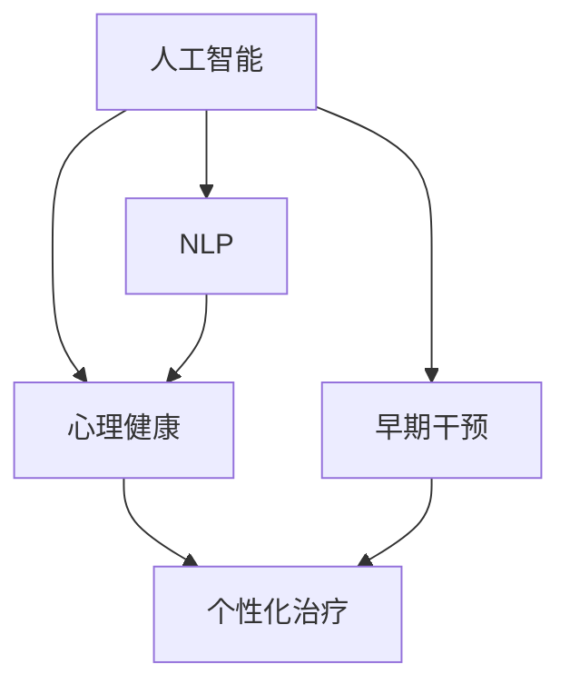

                 

## 1. 背景介绍

### 1.1 问题由来

心理健康问题是一个普遍存在的全球性挑战。据世界卫生组织（WHO）统计，全球约有7亿人面临心理健康问题，每年因心理健康问题导致的生产力损失高达3.5万亿美元。这些数据表明，心理健康问题的负担极其沉重，迫切需要创新的解决方案来缓解这一状况。

在人工智能（AI）技术日益发展的今天，利用AI技术对心理健康进行早期干预和治疗，已经被证明是一种有效的途径。AI技术能够快速、精准地分析大量的数据，帮助心理学家和医生更早地发现问题，并提供个性化的治疗方案，这不仅能够减轻心理疾病对社会的负担，还能够提升患者的生活质量。

### 1.2 问题核心关键点

本部分将详细探讨AI在心理健康领域应用的几个核心问题：

1. **数据收集与处理**：心理健康数据具有高度的敏感性和复杂性，如何安全、高效地收集和处理这些数据是实现AI应用的第一步。
2. **模型选择与训练**：心理健康问题复杂多样，选择合适的AI模型并进行有效的训练，能够提升模型的诊断和治疗效果。
3. **个性化治疗**：心理健康问题的治疗需要高度的个性化，AI技术如何实现这一点，将是提高治疗效果的关键。
4. **隐私保护与伦理**：心理健康数据的隐私保护和伦理问题必须得到充分考虑，以确保技术的可接受性和公平性。

## 2. 核心概念与联系

### 2.1 核心概念概述

为了更好地理解AI在心理健康领域的应用，本节将介绍几个关键概念：

1. **人工智能（AI）**：一种能够模拟人类智能行为的技术，包括但不限于机器学习、深度学习、自然语言处理等。
2. **心理健康（Mental Health）**：涉及到个体心理和情感的健康状态，包括情绪调节、心理治疗和行为改变等方面。
3. **早期干预（Early Intervention）**：在问题出现初期就采取行动，以防止问题恶化的一种方法。
4. **个性化治疗（Personalized Treatment）**：根据个体差异，量身定制治疗方案，以达到最佳的治疗效果。
5. **自然语言处理（NLP）**：AI领域的一个重要分支，涉及计算机与人类语言之间的交互，包括文本分析、情感分析、语音识别等。

这些概念之间的关系可以通过以下Mermaid流程图来展示：



这个流程图展示了几大核心概念之间的逻辑关系：

1. 人工智能通过自然语言处理技术，从心理健康数据中提取信息。
2. 早期干预利用AI模型对数据进行快速分析，识别潜在的心理健康问题。
3. 个性化治疗根据AI分析结果，制定个体化的治疗方案。

这些概念共同构成了AI在心理健康领域的综合应用框架。

## 3. 核心算法原理 & 具体操作步骤

### 3.1 算法原理概述

AI在心理健康领域的应用，通常涉及以下几个核心算法和原理：

1. **数据预处理**：清洗、归一化、特征工程等技术，用于提升数据的质量和可处理性。
2. **模型训练**：使用监督学习、无监督学习、半监督学习等方法，对心理健康数据进行建模，以识别和预测心理健康问题。
3. **模型评估与选择**：通过交叉验证、ROC曲线、AUC等指标，评估模型性能并选择最优模型。
4. **个性化治疗**：通过机器学习算法，分析个体数据，实现治疗方案的个性化设计。

### 3.2 算法步骤详解

以下是基于AI的早期干预和个性化治疗的详细步骤：

**Step 1: 数据收集与预处理**

1. **数据来源**：
   - 临床记录：包括心理评估问卷、心理健康档案等。
   - 电子健康记录（EHR）：涵盖病人的生理和心理健康数据。
   - 自然语言文本：如社交媒体帖子、电子邮件、日记等。

2. **数据清洗与处理**：
   - 去除缺失数据和异常值。
   - 标准化数据格式。
   - 特征提取与选择。

**Step 2: 模型选择与训练**

1. **模型选择**：
   - 监督学习：如逻辑回归、支持向量机（SVM）、随机森林等。
   - 无监督学习：如聚类分析、主成分分析（PCA）等。
   - 半监督学习：如半监督分类器、标签传播算法等。

2. **模型训练**：
   - 划分训练集、验证集和测试集。
   - 使用训练集训练模型，调整超参数。
   - 在验证集上评估模型性能，避免过拟合。

**Step 3: 早期干预**

1. **早期预警系统**：
   - 使用AI模型对心理健康数据进行实时监测。
   - 通过异常检测技术，识别潜在的心理健康问题。

2. **预警与干预**：
   - 系统生成预警，通知相关人员进行干预。
   - 根据预警结果，提供初步的治疗建议或转介给专业医生。

**Step 4: 个性化治疗**

1. **个体数据分析**：
   - 使用机器学习算法分析个体数据。
   - 提取关键特征，识别潜在问题。

2. **个性化治疗方案**：
   - 根据分析结果，制定个性化的治疗方案。
   - 实时调整治疗方案，确保最佳效果。

### 3.3 算法优缺点

AI在心理健康领域的应用具有以下优点：

1. **高效性**：能够快速处理大量数据，及时发现心理健康问题。
2. **精准性**：基于大量数据训练的模型，能够提供高精度的诊断和治疗建议。
3. **可扩展性**：能够应用于各种不同的心理健康问题，具有广泛的应用前景。

同时，这些技术也存在一些缺点：

1. **隐私问题**：心理健康数据高度敏感，隐私保护是技术应用的前提。
2. **伦理问题**：AI在心理健康领域的应用涉及伦理决策，需要考虑多方面因素。
3. **解释性**：AI模型的决策过程缺乏可解释性，难以让人理解。
4. **依赖数据质量**：模型效果依赖于数据的质量和数量，数据不足可能导致误诊。

### 3.4 算法应用领域

AI在心理健康领域的应用已经涵盖了多个方面，例如：

1. **情感分析**：通过分析社交媒体、电子邮件等自然语言文本，识别用户的情感状态。
2. **心理健康评估**：使用机器学习模型对心理健康问卷进行自动化评分。
3. **精神疾病预测**：通过分析电子健康记录（EHR）数据，预测个体患精神疾病的风险。
4. **心理危机干预**：实时监测用户行为，识别心理危机，提供即时帮助。
5. **在线咨询与治疗**：通过自然语言处理技术，提供自动化的心理辅导和治疗建议。

## 4. 数学模型和公式 & 详细讲解 & 举例说明

### 4.1 数学模型构建

在本节中，我们将介绍几个常用的数学模型及其应用场景。

**情感分析模型**：
- 使用文本数据作为输入，提取情感特征。
- 模型训练公式：
  $$
  \min_{\theta} \frac{1}{N}\sum_{i=1}^N \ell(M_{\theta}(x_i),y_i)
  $$
  其中，$x_i$ 为输入文本，$y_i$ 为情感标签，$M_{\theta}$ 为模型，$\ell$ 为损失函数。

**心理健康评估模型**：
- 使用心理健康问卷数据作为输入，训练分类器。
- 模型训练公式：
  $$
  \min_{\theta} \frac{1}{N}\sum_{i=1}^N \ell(M_{\theta}(x_i),y_i)
  $$
  其中，$x_i$ 为问卷数据，$y_i$ 为心理健康评分，$M_{\theta}$ 为分类器，$\ell$ 为损失函数。

### 4.2 公式推导过程

以情感分析为例，我们推导模型的损失函数：

假设输入文本 $x_i$ 的情感标签为 $y_i \in \{0,1\}$，模型输出为 $\hat{y}_i$。
- 二分类交叉熵损失函数：
  $$
  \ell(M_{\theta}(x_i),y_i) = -(y_i\log\hat{y}_i + (1-y_i)\log(1-\hat{y}_i))
  $$

在训练过程中，我们使用随机梯度下降（SGD）算法，更新模型参数 $\theta$：
- 更新公式：
  $$
  \theta \leftarrow \theta - \eta \nabla_{\theta} \mathcal{L}(\theta)
  $$
  其中，$\eta$ 为学习率，$\nabla_{\theta} \mathcal{L}(\theta)$ 为损失函数对模型参数的梯度。

### 4.3 案例分析与讲解

以下是一个情感分析的案例分析：

**案例背景**：某社交媒体平台希望通过情感分析技术，实时监测用户的情绪状态。

**数据集**：社交媒体帖子。

**模型选择**：BERT模型。

**模型训练**：
1. 收集社交媒体帖子数据，标签化情感。
2. 划分训练集、验证集和测试集。
3. 使用BERT模型对帖子进行情感分类。
4. 在验证集上调整超参数，优化模型性能。
5. 在测试集上评估模型效果，生成情感分析报告。

## 5. 项目实践：代码实例和详细解释说明

### 5.1 开发环境搭建

在进行项目实践前，我们需要准备好开发环境。以下是使用Python进行TensorFlow开发的环境配置流程：

1. 安装Anaconda：从官网下载并安装Anaconda，用于创建独立的Python环境。

2. 创建并激活虚拟环境：
```bash
conda create -n tf-env python=3.8 
conda activate tf-env
```

3. 安装TensorFlow：根据CUDA版本，从官网获取对应的安装命令。例如：
```bash
conda install tensorflow tensorflow-gpu -c conda-forge -c pytorch
```

4. 安装其他相关库：
```bash
pip install numpy pandas scikit-learn tensorflow
```

完成上述步骤后，即可在`tf-env`环境中开始项目实践。

### 5.2 源代码详细实现

下面我们以情感分析任务为例，给出使用TensorFlow进行模型训练的PyTorch代码实现。

```python
import tensorflow as tf
from tensorflow.keras.preprocessing.text import Tokenizer
from tensorflow.keras.preprocessing.sequence import pad_sequences
from tensorflow.keras.models import Sequential
from tensorflow.keras.layers import Embedding, LSTM, Dense

# 加载数据集
tokenizer = Tokenizer(num_words=10000, oov_token='<OOV>')
tokenizer.fit_on_texts(texts)

sequences = tokenizer.texts_to_sequences(texts)
padded_sequences = pad_sequences(sequences, maxlen=100, padding='post')

# 划分训练集和测试集
train_sequences = padded_sequences[:train_size]
train_labels = labels[:train_size]
test_sequences = padded_sequences[train_size:]
test_labels = labels[train_size:]

# 构建模型
model = Sequential([
    Embedding(10000, 64, input_length=100),
    LSTM(64),
    Dense(1, activation='sigmoid')
])

# 编译模型
model.compile(loss='binary_crossentropy', optimizer='adam', metrics=['accuracy'])

# 训练模型
model.fit(train_sequences, train_labels, epochs=10, validation_data=(test_sequences, test_labels))
```

### 5.3 代码解读与分析

让我们再详细解读一下关键代码的实现细节：

**数据预处理**：
- `Tokenizer`：用于将文本转换为数字序列，去除停用词，处理特殊符号。
- `pad_sequences`：将序列填充至相同长度，方便模型处理。

**模型构建**：
- `Embedding`：将文本序列转换为密集向量。
- `LSTM`：处理序列数据。
- `Dense`：输出情感分类结果。

**模型训练**：
- `compile`：设置模型的损失函数、优化器和评价指标。
- `fit`：使用训练集和验证集进行模型训练。

**模型评估**：
- `evaluate`：在测试集上评估模型性能。

## 6. 实际应用场景

### 6.1 在线心理咨询

在线心理咨询平台利用AI技术，提供自动化的心理辅导和治疗建议。用户通过填写问卷或与AI对话，AI系统分析数据，给出相应的心理健康建议和情感支持。

**具体流程**：
1. 用户填写心理健康问卷或与AI对话。
2. AI系统分析用户数据，提取关键特征。
3. 根据特征结果，生成心理健康建议和情感支持。
4. 用户反馈评价，AI系统优化模型。

### 6.2 精神疾病预测

精神疾病预测模型通过分析电子健康记录（EHR）数据，预测个体患精神疾病的风险。这有助于早期发现潜在问题，及时采取干预措施。

**具体流程**：
1. 收集EHR数据，标签化精神疾病状态。
2. 使用机器学习模型训练预测模型。
3. 对新病人数据进行预测，判断患病风险。
4. 根据预测结果，进行早期干预和治疗。

### 6.3 心理危机干预

心理危机干预系统实时监测用户行为，识别潜在的心理危机，提供即时帮助。系统通过分析用户数据，识别异常行为和情绪波动，生成预警，通知相关人员进行干预。

**具体流程**：
1. 收集用户行为数据，如社交媒体活动、手机使用记录等。
2. 使用AI模型分析用户行为，识别潜在的心理危机。
3. 生成预警，通知相关人员进行干预。
4. 根据预警结果，提供心理支持和紧急干预。

### 6.4 未来应用展望

未来，AI在心理健康领域的应用将更加广泛和深入。以下是几个可能的发展方向：

1. **多模态数据融合**：将文本、语音、图像等多种模态的数据融合，提升诊断和治疗的准确性。
2. **个性化治疗**：利用AI技术，实现更加精准和个性化的治疗方案，提高治疗效果。
3. **实时监测与干预**：通过实时监测用户数据，实现即时干预，防止问题恶化。
4. **跨领域应用**：将AI技术应用于教育、企业员工心理等更多领域，提升整体心理健康水平。

## 7. 工具和资源推荐

### 7.1 学习资源推荐

为了帮助开发者系统掌握AI在心理健康领域的应用，这里推荐一些优质的学习资源：

1. **《深度学习与心理健康》**：介绍深度学习在心理健康领域的应用，涵盖情感分析、精神疾病预测等多个方面。
2. **《心理健康数据分析》**：通过实际案例，展示如何使用Python进行心理健康数据分析。
3. **《人工智能在心理健康中的应用》**：系统介绍AI在心理健康领域的具体应用，包括模型选择、数据处理、模型评估等。
4. **Coursera心理健康数据分析课程**：由心理学和数据科学专家教授，涵盖心理健康数据的收集、处理和分析技术。
5. **Kaggle心理健康数据集**：包含丰富的心理健康数据集，可供学习和研究使用。

通过对这些资源的学习实践，相信你一定能够快速掌握AI在心理健康领域的应用方法和技术细节。

### 7.2 开发工具推荐

高效的开发离不开优秀的工具支持。以下是几款用于AI心理健康应用开发的常用工具：

1. **TensorFlow**：基于Python的开源深度学习框架，支持多GPU和TPU加速，适合大规模深度学习项目。
2. **Keras**：高层次的神经网络API，简化了深度学习模型的构建和训练过程。
3. **Pandas**：强大的数据处理库，支持多种数据格式和操作。
4. **NumPy**：高效的数值计算库，适用于矩阵运算和数据处理。
5. **Scikit-learn**：机器学习库，提供多种算法和评估工具。

合理利用这些工具，可以显著提升AI心理健康应用开发的效率，加快创新迭代的步伐。

### 7.3 相关论文推荐

AI在心理健康领域的应用涉及多个前沿研究方向，以下是几篇奠基性的相关论文，推荐阅读：

1. **《基于深度学习的情感分析方法》**：介绍深度学习在情感分析中的应用，涵盖文本预处理、模型选择和训练等方面。
2. **《使用机器学习进行精神疾病预测》**：使用机器学习模型，对EHR数据进行精神疾病预测，探讨模型性能和数据处理技术。
3. **《自然语言处理在心理健康中的应用》**：探讨NLP技术在心理健康评估和治疗中的应用，包括情感分析、意图识别等方面。
4. **《AI在心理健康危机干预中的应用》**：通过案例分析，展示AI技术在心理健康危机干预中的作用和效果。

这些论文代表了大规模心理健康数据分析和AI应用的前沿成果，能够为研究和实践提供宝贵的参考。

## 8. 总结：未来发展趋势与挑战

### 8.1 总结

本文对AI在心理健康领域的应用进行了全面系统的介绍。首先阐述了AI技术在心理健康领域应用的几个关键问题，明确了心理健康数据分析和AI模型训练的方法。其次，通过项目实践和案例分析，展示了AI在心理健康早期干预和治疗中的具体应用。最后，通过总结和学习资源推荐，帮助开发者系统掌握AI在心理健康领域的应用方法和技术细节。

通过本文的系统梳理，可以看到，AI在心理健康领域的应用已经取得了一定的进展，但仍然存在许多挑战。未来，随着AI技术的不断发展和数据量的积累，AI在心理健康领域的普及和应用将更加广泛和深入。

### 8.2 未来发展趋势

展望未来，AI在心理健康领域的应用将呈现以下几个发展趋势：

1. **模型精度提升**：随着模型算法和数据量的不断提升，心理健康诊断和治疗的准确性将进一步提高。
2. **多模态融合**：将文本、语音、图像等多种数据类型融合，提升心理健康诊断的全面性和准确性。
3. **实时监测与干预**：实时监测用户数据，实现即时干预，提升心理健康服务的及时性和有效性。
4. **个性化治疗**：利用AI技术，实现更加精准和个性化的治疗方案，提高治疗效果。
5. **跨领域应用**：将AI技术应用于更多领域，如教育、企业员工心理等，提升整体心理健康水平。

### 8.3 面临的挑战

尽管AI在心理健康领域的应用已经取得了一定的进展，但在迈向更加智能化、普适化应用的过程中，仍面临诸多挑战：

1. **数据隐私与安全**：心理健康数据的高度敏感性，对数据隐私和安全提出了更高的要求。
2. **伦理与法律问题**：心理健康数据的收集和使用涉及伦理和法律问题，需要严格遵守相关规定。
3. **模型解释性**：AI模型的决策过程缺乏可解释性，难以让人理解。
4. **模型依赖数据质量**：模型的效果依赖于数据的质量和数量，数据不足可能导致误诊。

### 8.4 研究展望

为了应对未来AI在心理健康领域应用的挑战，未来的研究需要在以下几个方面寻求新的突破：

1. **数据隐私保护**：开发更加安全、可靠的数据处理和存储技术，保障数据隐私和安全。
2. **模型可解释性**：研究可解释性模型，提高模型的透明度和可理解性。
3. **多模态融合**：研究多模态数据融合技术，提升心理健康诊断的全面性和准确性。
4. **跨领域应用**：研究跨领域心理健康应用，拓展AI技术的适用范围和效果。

这些研究方向的探索，将引领AI在心理健康领域的进一步发展，为构建安全、可靠、可解释、可控的智能系统铺平道路。未来，AI在心理健康领域的广泛应用，将为人类的心理健康带来深远的影响。

## 9. 附录：常见问题与解答

**Q1：AI在心理健康领域的应用是否安全可靠？**

A: AI在心理健康领域的应用具有一定的安全性和可靠性，但需要严格遵守数据隐私和伦理规范。合理的数据隐私保护和伦理约束，能够保障系统的安全性和可信度。

**Q2：AI在心理健康领域的决策过程是否透明？**

A: AI在心理健康领域的决策过程缺乏可解释性，难以让人理解。但通过引入可解释性模型和透明化的决策机制，能够提高系统的可信度和接受度。

**Q3：AI在心理健康领域的应用是否依赖高质量数据？**

A: AI在心理健康领域的应用高度依赖高质量数据。数据的质量和数量直接影响模型的诊断和治疗效果，因此数据收集和处理的重要性不言而喻。

**Q4：AI在心理健康领域的应用是否存在偏见？**

A: AI模型可能存在数据偏见和算法偏见，需要通过数据清洗和模型优化，减少偏见的影响。同时，引入专家知识库和人工审核，提高系统的公平性和公正性。

**Q5：AI在心理健康领域的应用是否具有可扩展性？**

A: AI在心理健康领域的应用具有良好的可扩展性。通过将AI技术应用于多个领域，能够提升整体心理健康水平，具有广泛的应用前景。

通过本文的系统梳理，可以看到，AI在心理健康领域的应用已经取得了一定的进展，但仍然存在许多挑战。未来，随着AI技术的不断发展和数据量的积累，AI在心理健康领域的普及和应用将更加广泛和深入。希望本文能够为AI在心理健康领域的研究和实践提供有价值的参考和指导。

---

作者：禅与计算机程序设计艺术 / Zen and the Art of Computer Programming

