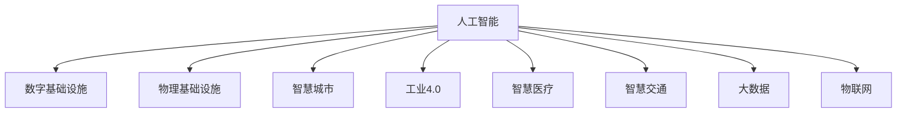

                 

# AI在数字与物理基础设施中的应用

> 关键词：人工智能,数字基础设施,物理基础设施,智慧城市,工业4.0,智慧医疗,智慧交通,大数据,物联网

## 1. 背景介绍

### 1.1 问题由来

随着信息化社会的不断深入，数字基础设施和物理基础设施的融合趋势愈发明显。这不仅对数字基础设施的容量、安全性、稳定性提出了更高的要求，也对物理基础设施的智能化、自动化、精细化管理提出了新的挑战。

面对这一现状，人工智能（AI）技术在数字与物理基础设施中的广泛应用，为传统基础设施的数字化转型提供了新的思路和解决方案。通过AI技术的引入，不仅可以提升基础设施的运行效率和用户体验，还能优化资源配置，降低运营成本，促进可持续发展。

### 1.2 问题核心关键点

AI在数字与物理基础设施中的应用主要体现在以下几个方面：

- 数字基础设施：指基于数字化技术的各类信息基础设施，如数据中心、网络、云计算等。AI技术通过优化算法、自动化运维、数据处理等手段，提升数字基础设施的效能和可靠性。
- 物理基础设施：指传统意义上的基础设施，如道路、桥梁、电网、水务等。AI技术通过感知、控制、预测等手段，实现物理基础设施的智能化、自动化管理。
- 智慧城市：以数字基础设施和物理基础设施的深度融合为基础，通过AI技术实现城市治理、公共服务、环境监测等方面的智能化。
- 工业4.0：智能制造、智慧物流、精准农业等新兴产业形态，基于AI技术实现生产流程的优化和升级。
- 智慧医疗：通过AI技术提升医疗数据的处理与分析能力，优化诊疗流程，提升医疗服务质量和效率。
- 智慧交通：通过AI技术实现交通流量预测、智能交通调度、自动驾驶等功能，提升交通系统的安全性和效率。
- 大数据：利用AI技术对海量数据进行高效处理、分析与挖掘，发现数据中的价值，支持决策和优化。
- 物联网（IoT）：通过AI技术实现物联网设备的智能互联和自动化管理，提升物联网系统的智能化水平。

这些应用场景展示了AI技术在数字与物理基础设施中的广泛潜力和巨大价值。本文将系统梳理AI在数字与物理基础设施中的关键应用，探讨其原理、方法、技术挑战及未来发展方向。

## 2. 核心概念与联系

### 2.1 核心概念概述

为了更好地理解AI在数字与物理基础设施中的应用，本节将介绍几个密切相关的核心概念：

- 人工智能（AI）：指通过计算机算法和数据处理技术，模拟人类智能行为，实现问题求解、决策支持、智能控制等功能的技术领域。
- 数字基础设施：指利用数字化技术构建的基础设施，如数据中心、云计算、物联网等。
- 物理基础设施：指传统意义上的人文、社会、环境等方面的基础设施，如道路、桥梁、电网等。
- 智慧城市：指通过数字化和智能化手段，提升城市治理、公共服务、环境保护等方面的智能化水平。
- 工业4.0：指基于数字化技术，实现生产过程的智能化、自动化、精准化，推动传统制造业向智能制造业转型。
- 智慧医疗：指通过AI技术优化医疗诊断、治疗、管理等过程，提升医疗服务质量和效率。
- 智慧交通：指通过AI技术实现交通流量的智能预测、交通调度的优化、自动驾驶等功能，提升交通系统的安全性和效率。
- 大数据：指通过数字化技术采集、处理、分析海量数据，提取数据中的价值，支持决策和优化。
- 物联网（IoT）：指通过数字化技术实现设备之间的互联互通，提升系统的智能化水平。

这些核心概念之间的逻辑关系可以通过以下Mermaid流程图来展示：



这个流程图展示了大语言模型的核心概念及其之间的关系：

1. 人工智能通过数字化技术实现各类基础设施的智能化。
2. 数字基础设施为物理基础设施的智能化提供技术支持。
3. 物理基础设施的智能化应用涵盖了智慧城市、工业4.0、智慧医疗、智慧交通等多个领域。
4. 大数据和物联网技术进一步增强了基础设施的智能化水平。

这些概念共同构成了AI技术在数字与物理基础设施中的应用框架，使其能够在各种场景下发挥巨大的作用。

## 3. 核心算法原理 & 具体操作步骤
### 3.1 算法原理概述

AI在数字与物理基础设施中的应用，主要基于机器学习、深度学习、强化学习等技术。这些技术通过数据驱动的模型训练和优化，提升基础设施的运行效率、安全性和用户满意度。

在数字基础设施中，AI技术主要应用于以下几个方面：

- 数据处理与分析：利用AI技术对海量数据进行高效处理、分析与挖掘，发现数据中的价值，支持决策和优化。
- 自动化运维：通过AI技术实现设备状态的监测、故障诊断、异常处理等自动化运维功能，降低运维成本，提升系统可靠性。
- 网络优化：利用AI技术实现网络流量预测、路由优化、网络安全防护等功能，提升网络效能和安全性。
- 云服务优化：通过AI技术实现云资源的智能调度、负载均衡、弹性伸缩等，提升云服务的性能和效率。

在物理基础设施中，AI技术主要应用于以下几个方面：

- 感知与识别：通过AI技术实现对物理环境的实时监测、图像识别、声音识别等功能，提升感知能力。
- 智能控制：利用AI技术实现对设备的自动控制、调度、优化等功能，提升管理效率。
- 预测与预警：通过AI技术实现对设备状态的预测、异常预警、故障预测等功能，提升系统可靠性。
- 资源优化：利用AI技术实现对资源的智能配置、优化、调度等功能，提升资源利用率。

### 3.2 算法步骤详解

AI在数字与物理基础设施中的应用步骤一般包括以下几个关键步骤：

**Step 1: 数据收集与预处理**

- 收集与基础设施相关的各类数据，如设备状态数据、网络流量数据、环境监测数据等。
- 对数据进行清洗、去噪、归一化等预处理，确保数据质量和一致性。

**Step 2: 模型训练与优化**

- 选择合适的AI算法和模型，如机器学习算法、深度学习模型、强化学习模型等。
- 利用收集到的数据，进行模型训练和优化，提升模型的准确性和泛化能力。
- 在训练过程中，合理设置超参数，如学习率、批大小、迭代轮数等，确保模型收敛速度和精度。

**Step 3: 模型部署与应用**

- 将训练好的模型部署到数字与物理基础设施中，进行实时监测、预测、控制等应用。
- 利用API、SDK等接口，将模型的输出结果应用于实际系统，实现智能化功能。

**Step 4: 效果评估与迭代**

- 通过数据分析、用户反馈等方式，评估AI模型的效果和性能。
- 根据评估结果，对模型进行迭代优化，不断提升系统的智能化水平。

### 3.3 算法优缺点

AI在数字与物理基础设施中的应用具有以下优点：

- 提升效率：通过AI技术实现自动化运维、智能控制等功能，提升基础设施的运行效率和管理效率。
- 降低成本：通过AI技术实现设备状态的预测、故障诊断等功能，降低运维成本和维护费用。
- 提升可靠性：通过AI技术实现对设备的实时监测、异常预警等功能，提升系统的可靠性和安全性。
- 优化资源利用率：通过AI技术实现资源的智能配置、优化、调度等功能，提升资源利用率和系统性能。

同时，AI在数字与物理基础设施中的应用也存在一些缺点：

- 数据依赖：AI模型的效果高度依赖于数据的质量和量级，数据获取和处理成本较高。
- 技术复杂性：AI技术涉及复杂的数据处理、模型训练、优化等环节，技术门槛较高。
- 安全性和隐私问题：AI模型可能引入数据泄露、隐私保护等安全问题，需要加强安全防护措施。
- 可解释性不足：AI模型的决策过程缺乏可解释性，难以理解和调试，需要进一步提升模型的透明度和可解释性。

### 3.4 算法应用领域

AI在数字与物理基础设施中的应用，主要涵盖以下几个领域：

- 智慧城市：通过AI技术实现城市治理、公共服务、环境监测等方面的智能化。
- 工业4.0：通过AI技术实现智能制造、智慧物流、精准农业等新兴产业形态。
- 智慧医疗：通过AI技术提升医疗数据的处理与分析能力，优化诊疗流程，提升医疗服务质量和效率。
- 智慧交通：通过AI技术实现交通流量预测、智能交通调度、自动驾驶等功能。
- 大数据：利用AI技术对海量数据进行高效处理、分析与挖掘，发现数据中的价值，支持决策和优化。
- 物联网（IoT）：通过AI技术实现物联网设备的智能互联和自动化管理，提升物联网系统的智能化水平。

这些领域的应用展示了AI技术在数字与物理基础设施中的广泛潜力和巨大价值，为未来城市和工业的智能化转型提供了坚实的基础。

## 4. 数学模型和公式 & 详细讲解  
### 4.1 数学模型构建

AI在数字与物理基础设施中的应用，主要基于机器学习、深度学习、强化学习等技术。这些技术通过数据驱动的模型训练和优化，提升基础设施的运行效率、安全性和用户满意度。

在数字基础设施中，AI技术主要应用于以下几个方面：

- 数据处理与分析：利用AI技术对海量数据进行高效处理、分析与挖掘，发现数据中的价值，支持决策和优化。
- 自动化运维：通过AI技术实现设备状态的监测、故障诊断、异常处理等自动化运维功能，降低运维成本，提升系统可靠性。
- 网络优化：利用AI技术实现网络流量预测、路由优化、网络安全防护等功能，提升网络效能和安全性。
- 云服务优化：通过AI技术实现云资源的智能调度、负载均衡、弹性伸缩等，提升云服务的性能和效率。

在物理基础设施中，AI技术主要应用于以下几个方面：

- 感知与识别：通过AI技术实现对物理环境的实时监测、图像识别、声音识别等功能，提升感知能力。
- 智能控制：利用AI技术实现对设备的自动控制、调度、优化等功能，提升管理效率。
- 预测与预警：通过AI技术实现对设备状态的预测、异常预警、故障预测等功能，提升系统可靠性。
- 资源优化：利用AI技术实现对资源的智能配置、优化、调度等功能，提升资源利用率。

### 4.2 公式推导过程

以下我们以网络流量预测为例，推导深度学习模型在网络优化中的应用公式。

假设网络流量数据为 $(x_i, y_i)$，其中 $x_i$ 表示时间步 $i$ 的输入特征，$y_i$ 表示时间步 $i$ 的输出流量。则深度学习模型的预测公式为：

$$
y_i = f_\theta(x_i)
$$

其中 $f_\theta$ 为深度学习模型，$\theta$ 为模型参数。深度学习模型一般采用多层神经网络结构，如图卷积神经网络（CNN）、循环神经网络（RNN）、长短时记忆网络（LSTM）等。

在实际应用中，由于网络流量数据具有时间序列的特性，我们通常使用RNN或LSTM模型进行预测。其预测公式为：

$$
y_i = f_\theta(x_i, y_{i-1}, y_{i-2}, ..., y_1)
$$

其中 $y_{i-1}, y_{i-2}, ..., y_1$ 表示之前时间步的流量预测值，作为模型的输入，用于增强预测的稳定性。

通过上述公式，我们可以构建深度学习模型，利用网络流量数据进行预测，优化网络资源的分配和调度，提升网络效能和安全性。

## 5. 项目实践：代码实例和详细解释说明
### 5.1 开发环境搭建

在进行AI应用实践前，我们需要准备好开发环境。以下是使用Python进行TensorFlow和Keras开发的环境配置流程：

1. 安装Anaconda：从官网下载并安装Anaconda，用于创建独立的Python环境。

2. 创建并激活虚拟环境：
```bash
conda create -n ai-env python=3.8 
conda activate ai-env
```

3. 安装TensorFlow和Keras：
```bash
pip install tensorflow==2.7.0 
pip install keras==2.4.3
```

4. 安装各类工具包：
```bash
pip install numpy pandas scikit-learn matplotlib tqdm jupyter notebook ipython
```

完成上述步骤后，即可在`ai-env`环境中开始AI应用实践。

### 5.2 源代码详细实现

下面我们以智慧医疗中的应用为例，给出使用TensorFlow和Keras对深度学习模型进行网络流量预测的Python代码实现。

首先，定义模型和数据集：

```python
import tensorflow as tf
from tensorflow.keras.models import Sequential
from tensorflow.keras.layers import Dense, LSTM
from tensorflow.keras.callbacks import EarlyStopping
from sklearn.model_selection import train_test_split

# 定义LSTM模型
def create_model(input_shape, num_units):
    model = Sequential()
    model.add(LSTM(num_units, input_shape=input_shape))
    model.add(Dense(1))
    return model

# 加载数据集
data = load_data()
x_train, x_test, y_train, y_test = train_test_split(data, test_size=0.2, shuffle=True)

# 定义模型参数
num_units = 128
batch_size = 32
epochs = 100
early_stopping = EarlyStopping(monitor='val_loss', patience=5)

# 创建模型
model = create_model(input_shape=(x_train.shape[1], 1), num_units=num_units)

# 编译模型
model.compile(optimizer='adam', loss='mse', metrics=['mae'])

# 训练模型
model.fit(x_train, y_train, batch_size=batch_size, epochs=epochs, validation_data=(x_test, y_test), callbacks=[early_stopping])
```

然后，定义数据加载函数和模型评估函数：

```python
def load_data():
    # 加载数据
    ...

def evaluate_model(model, x_test, y_test):
    # 评估模型
    ...
```

最后，启动训练流程并在测试集上评估：

```python
# 训练模型
model.fit(x_train, y_train, batch_size=batch_size, epochs=epochs, validation_data=(x_test, y_test), callbacks=[early_stopping])

# 评估模型
evaluate_model(model, x_test, y_test)
```

以上就是使用TensorFlow和Keras对深度学习模型进行网络流量预测的完整代码实现。可以看到，得益于TensorFlow和Keras的强大封装，我们可以用相对简洁的代码完成模型训练和评估。

### 5.3 代码解读与分析

让我们再详细解读一下关键代码的实现细节：

**数据加载函数**：
- 负责从数据存储中加载数据集，并进行分批处理，方便模型的训练和评估。
- 数据集通常包含时间序列的特征和目标流量值，用于模型训练和预测。

**模型创建函数**：
- 定义了LSTM模型的结构和参数，用于处理时间序列数据。
- LSTM模型具有记忆功能，可以捕捉时间序列数据中的长期依赖关系，适用于网络流量预测等场景。

**模型训练函数**：
- 定义了训练模型的超参数，如学习率、批大小、迭代轮数等。
- 使用EarlyStopping回调函数，监控验证集的损失值，一旦连续5个epoch损失值没有下降，则提前停止训练，避免过拟合。
- 通过fit方法训练模型，同时监控训练集和验证集的损失值和均方误差（MAE）。

**模型评估函数**：
- 负责在测试集上评估模型的性能，计算模型的MAE和均方误差（MSE），输出评估结果。
- 评估函数通常需要计算模型预测值与真实值的差，并计算MAE和MSE等指标。

**模型评估流程**：
- 在测试集上评估模型性能，计算MAE和MSE。
- 通过评估结果，判断模型的预测效果，决定是否继续优化模型或调整参数。

以上代码展示了TensorFlow和Keras在深度学习模型训练和评估中的应用，体现了AI技术在数字与物理基础设施中的实际落地能力。

## 6. 实际应用场景
### 6.1 智慧城市

智慧城市是AI在数字与物理基础设施中的典型应用场景。通过AI技术，可以实现城市治理、公共服务、环境监测等方面的智能化。

例如，在交通管理方面，利用AI技术实现交通流量的实时监测和预测，优化交通信号灯的调节，减少交通拥堵。利用AI技术实现自动驾驶，提升交通安全性和效率。利用AI技术实现城市环境监测，实现对空气质量、噪音、水质等环境指标的实时监测和预警。

通过智慧城市的建设，可以提升城市管理水平，提高市民生活质量，推动城市的可持续发展。

### 6.2 工业4.0

工业4.0是指通过数字化技术，实现生产流程的智能化、自动化、精准化，推动传统制造业向智能制造业转型。AI技术在工业4.0中的应用主要体现在以下几个方面：

- 智能制造：利用AI技术实现生产过程的优化、调度、控制，提升生产效率和质量。
- 智慧物流：利用AI技术实现物流过程的自动化、智能化管理，提升物流效率和准确性。
- 精准农业：利用AI技术实现对农作物的智能监测、预测、决策，提升农业生产的精准度和效率。

通过AI技术的引入，可以显著提升制造业的智能化水平，推动经济社会的可持续发展。

### 6.3 智慧医疗

智慧医疗是指通过AI技术优化医疗数据的处理与分析能力，优化诊疗流程，提升医疗服务质量和效率。AI技术在智慧医疗中的应用主要体现在以下几个方面：

- 医疗影像分析：利用AI技术实现对医疗影像的自动分析、诊断，提升诊断的准确性和效率。
- 病历分析：利用AI技术实现对病历数据的自动分类、归档，提升病历管理的效率。
- 精准医疗：利用AI技术实现对基因数据的分析、预测，提升治疗的个性化和精准度。

通过智慧医疗的建设，可以提升医疗服务水平，提高医疗资源利用率，推动健康事业的发展。

### 6.4 智慧交通

智慧交通是指通过AI技术实现交通流量的智能预测、智能交通调度、自动驾驶等功能，提升交通系统的安全性和效率。AI技术在智慧交通中的应用主要体现在以下几个方面：

- 交通流量预测：利用AI技术实现对交通流量的实时监测和预测，优化交通信号灯的调节，减少交通拥堵。
- 智能交通调度：利用AI技术实现交通信号灯的智能控制，提升交通效率和安全性。
- 自动驾驶：利用AI技术实现自动驾驶，提升交通安全性和效率。

通过智慧交通的建设，可以实现城市交通的智能化管理，提升市民的出行体验，推动交通事业的发展。

### 6.5 大数据

大数据是指通过数字化技术采集、处理、分析海量数据，提取数据中的价值，支持决策和优化。AI技术在大数据中的应用主要体现在以下几个方面：

- 数据挖掘：利用AI技术实现对海量数据的挖掘、分析和建模，提取数据中的价值和规律。
- 决策支持：利用AI技术实现对决策过程的辅助和支持，提升决策的准确性和效率。
- 优化调度：利用AI技术实现对资源的智能配置、优化、调度等功能，提升资源利用率。

通过大数据的建设，可以提升数据资源的利用效率，推动数据的价值化，支持决策和优化。

### 6.6 物联网（IoT）

物联网（IoT）是指通过数字化技术实现设备之间的互联互通，提升系统的智能化水平。AI技术在物联网中的应用主要体现在以下几个方面：

- 设备状态监测：利用AI技术实现对设备的实时监测、故障诊断，提升设备管理的效率和精度。
- 智能控制：利用AI技术实现对设备的自动控制、优化，提升管理效率和用户体验。
- 资源优化：利用AI技术实现对资源的智能配置、优化、调度等功能，提升资源利用率。

通过物联网的建设，可以实现设备的智能化管理，提升用户体验和资源利用率。

## 7. 工具和资源推荐
### 7.1 学习资源推荐

为了帮助开发者系统掌握AI在数字与物理基础设施中的应用理论基础和实践技巧，这里推荐一些优质的学习资源：

1. TensorFlow官方文档：提供了详细的TensorFlow API和算法实现，适合深入学习。
2. Keras官方文档：提供了易于上手的深度学习框架，适合初学者入门。
3. PyTorch官方文档：提供了灵活的深度学习框架，适合进阶学习。
4. Coursera AI课程：提供了系统性的AI课程，涵盖了机器学习、深度学习、强化学习等各个方面。
5. Udacity AI纳米学位：提供了实战性很强的AI课程，结合实际项目进行学习。

通过对这些资源的学习实践，相信你一定能够快速掌握AI在数字与物理基础设施中的应用精髓，并用于解决实际的AI问题。
###  7.2 开发工具推荐

高效的开发离不开优秀的工具支持。以下是几款用于AI开发的工具：

1. TensorFlow：由Google主导开发的深度学习框架，生产部署方便，适合大规模工程应用。
2. PyTorch：由Facebook主导开发的深度学习框架，灵活动态，适合研究型项目。
3. Keras：高层次的深度学习框架，易于上手，适合快速原型开发。
4. Jupyter Notebook：开源的交互式开发环境，适合实验和记录代码。
5. Anaconda：开源的Python环境管理系统，方便快速搭建和切换Python环境。

合理利用这些工具，可以显著提升AI开发的效率，加速AI技术在数字与物理基础设施中的应用。

### 7.3 相关论文推荐

AI在数字与物理基础设施中的应用，得益于学界的持续研究。以下是几篇奠基性的相关论文，推荐阅读：

1. "Smart Grid Analytics and Predictive Maintenance of Smart Power Grids using IoT and Machine Learning"：介绍了基于物联网和机器学习的智能电网分析与预测技术。
2. "IoT-Based Smart City Analytics Using Machine Learning"：介绍了基于物联网的智慧城市数据分析技术。
3. "AI-Driven Manufacturing in Industry 4.0"：介绍了AI在智能制造中的应用，涵盖了机器视觉、深度学习、自然语言处理等技术。
4. "Predictive Maintenance of Equipment Using IoT and Machine Learning"：介绍了基于物联网和机器学习的设备预测性维护技术。
5. "AI-Enhanced Smart Healthcare"：介绍了基于AI技术的智慧医疗应用，涵盖了医疗影像分析、病历分析、精准医疗等方向。

这些论文代表了AI在数字与物理基础设施中的研究前沿，帮助读者了解最新的研究成果和技术进展。

## 8. 总结：未来发展趋势与挑战
### 8.1 研究成果总结

AI在数字与物理基础设施中的应用，取得了显著的成果，已经在智慧城市、智慧医疗、智慧交通等多个领域得到广泛应用。AI技术通过提升基础设施的智能化、自动化、精细化管理水平，推动了社会的可持续发展。

### 8.2 未来发展趋势

展望未来，AI在数字与物理基础设施中的应用将呈现以下几个发展趋势：

1. 技术融合：AI技术与其他新兴技术，如区块链、5G、边缘计算等，将实现更深层次的融合，推动数字与物理基础设施的全面智能化。
2. 数据驱动：随着数据获取和处理技术的进步，大数据将发挥更大的作用，提升AI模型的泛化能力和预测准确性。
3. 人机协同：AI技术将与人类工作者实现更深度的协同，提升人机交互的智能化水平。
4. 可解释性：随着AI技术的不断发展，模型可解释性将逐步增强，帮助人类理解和调试AI系统。
5. 隐私保护：AI技术将更加注重数据隐私和安全，确保数据的安全可靠。
6. 行业定制：AI技术将更加注重行业特性，实现定制化的应用，提升应用效果。

### 8.3 面临的挑战

尽管AI在数字与物理基础设施中的应用取得了显著成果，但仍面临诸多挑战：

1. 数据获取与质量：高质量数据的获取和处理是AI应用的基础，但数据获取和处理的成本较高。
2. 技术复杂性：AI技术涉及复杂的数据处理、模型训练、优化等环节，技术门槛较高。
3. 安全性和隐私问题：AI模型可能引入数据泄露、隐私保护等安全问题，需要加强安全防护措施。
4. 可解释性不足：AI模型的决策过程缺乏可解释性，难以理解和调试。
5. 技术标准化：AI技术缺乏统一的标准化，不同平台和设备之间的互操作性较差。
6. 资源消耗：大规模AI模型的训练和推理需要大量的计算资源，存在资源消耗大的问题。

### 8.4 研究展望

未来，AI在数字与物理基础设施中的应用，需要在以下几个方面进行突破：

1. 数据获取与处理：探索更加高效的数据获取和处理技术，降低数据获取和处理的成本。
2. 技术简化：简化AI技术的实现流程，降低技术门槛，提高应用的可操作性。
3. 安全性和隐私保护：加强数据隐私和安全保护，确保数据的安全可靠。
4. 模型可解释性：增强AI模型的可解释性，帮助人类理解和调试AI系统。
5. 技术标准化：建立统一的技术标准，提高不同平台和设备之间的互操作性。
6. 资源优化：优化AI模型的计算资源消耗，提升资源利用率，降低资源成本。

这些研究方向将引领AI在数字与物理基础设施中的进一步发展，为未来智慧城市的建设提供坚实的技术支持。

## 9. 附录：常见问题与解答

**Q1：AI在数字与物理基础设施中的具体应用有哪些？**

A: AI在数字与物理基础设施中的具体应用涵盖多个领域，包括智慧城市、工业4.0、智慧医疗、智慧交通、大数据、物联网等。这些应用展示了AI技术在数字与物理基础设施中的广泛潜力和巨大价值，为未来城市和工业的智能化转型提供了坚实的基础。

**Q2：AI在数字与物理基础设施中的应用前景如何？**

A: AI在数字与物理基础设施中的应用前景非常广阔，预计未来将成为推动智能城市建设、智能制造业升级、智慧医疗发展、智慧交通优化等的重要力量。随着技术的不断进步和应用的深入，AI将在更多领域发挥重要作用，推动社会的可持续发展。

**Q3：AI在数字与物理基础设施中的应用存在哪些挑战？**

A: AI在数字与物理基础设施中的应用面临数据获取与处理、技术复杂性、安全性和隐私问题、可解释性不足、技术标准化、资源消耗等挑战。解决这些问题需要技术创新、政策支持、产业合作等多方面的努力。

**Q4：未来AI在数字与物理基础设施中的应用将如何发展？**

A: 未来AI在数字与物理基础设施中的应用将呈现技术融合、数据驱动、人机协同、可解释性增强、隐私保护、行业定制等发展趋势。这些发展趋势将推动AI技术的不断进步和应用效果的提升，为智慧城市、智能制造业、智慧医疗等领域的可持续发展提供坚实的基础。

通过本文的系统梳理，可以看到，AI在数字与物理基础设施中的应用前景广阔，但同时也面临诸多挑战。只有不断突破技术瓶颈，才能将AI技术真正应用于实际场景中，推动社会的全面智能化发展。

