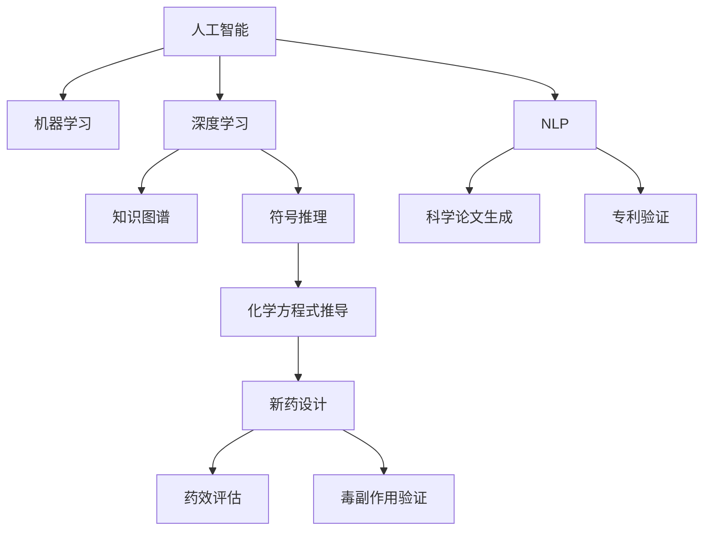

                 

# AI在数学推理与新药研发中的应用

> 关键词：人工智能,数学推理,新药研发,机器学习,深度学习,知识图谱

## 1. 背景介绍

### 1.1 问题由来
在科学研究和工业生产中，数学和化学推理是新药研发等科学领域中的核心任务。然而，传统数学和化学推理解题过程往往涉及大量的数学公式和化学方程式，需要耗费大量时间进行繁复的计算和验证。人工智能技术特别是深度学习和大数据分析方法的出现，为数学和化学推理提供了全新的解决路径。

AI在数学和化学推理中的应用主要包括两个方面：一是通过机器学习和深度学习模型，自动化地发现和验证新的数学和化学命题；二是通过知识图谱等技术，自动化地生成和验证科学论文、专利等知识内容，提升科研和创新的效率。

## 2. 核心概念与联系

### 2.1 核心概念概述

为了更好地理解AI在数学推理和新药研发中的应用，我们将介绍几个核心概念：

- **人工智能(AI)**：通过计算机模拟人类智能活动，包括感知、推理、学习、决策等，解决实际问题。

- **数学推理**：指通过推理和演绎，得出数学命题真伪的过程。

- **新药研发**：通过研究与开发，发现和验证新药的过程，包括药物设计、药效评估、毒副作用验证等。

- **机器学习(ML)**：通过算法，从数据中学习规律，用于数据预测、模式识别等任务。

- **深度学习(DL)**：机器学习的子领域，通过多层神经网络结构，实现对复杂非线性关系的模拟。

- **知识图谱(KG)**：通过图形化方式组织和关联知识，支持复杂知识推理。

- **符号推理**：通过符号计算和逻辑推理，自动化地解决数学和化学问题。

- **自然语言处理(NLP)**：通过处理和理解自然语言，自动化地生成和验证科学论文等知识内容。

这些核心概念之间的逻辑关系可以通过以下Mermaid流程图来展示：



这个流程图展示了大语言模型和新药研发的核心概念及其之间的关系：

1. 人工智能通过机器学习和深度学习模型，自动化地处理和分析数学和化学数据。
2. 深度学习模型可以在海量的数据中发现隐藏的模式和规律。
3. 知识图谱通过图形化的方式，支持复杂的知识推理。
4. 符号推理通过符号计算，自动化地解决数学和化学问题。
5. 自然语言处理可以自动化地生成和验证科学论文、专利等知识内容。
6. 基于这些技术，人工智能能够自动化地进行数学推理和新药研发。

## 3. 核心算法原理 & 具体操作步骤
### 3.1 算法原理概述

AI在数学推理和新药研发中的应用主要基于以下原理：

- **数据驱动**：通过大量标注数据训练模型，使其能够自动推理和验证数学和化学命题。
- **符号计算**：利用符号推理技术，自动化地进行数学公式和化学方程式的推导和验证。
- **知识表示**：通过知识图谱技术，构建科学的知识表示，支持复杂问题的自动化推理。
- **自然语言处理**：通过NLP技术，自动化地生成和验证科学论文、专利等知识内容。

### 3.2 算法步骤详解

基于AI的数学推理和新药研发主要包括以下关键步骤：

**Step 1: 数据收集与预处理**
- 收集和标注数学和化学问题的数据集，包括数学公式、化学方程式、药物数据等。
- 数据预处理，包括数据清洗、缺失值填补、特征工程等。

**Step 2: 模型训练与验证**
- 选择适合的机器学习或深度学习模型，如卷积神经网络(CNN)、递归神经网络(RNN)、长短期记忆网络(LSTM)、Transformer等。
- 在标注数据上训练模型，并进行交叉验证，选择最佳模型。

**Step 3: 知识表示与推理**
- 构建知识图谱，通过节点和边关系表示知识。
- 利用知识图谱进行复杂问题的自动化推理。

**Step 4: 生成与验证**
- 使用AI技术自动化地生成新的数学和化学问题，包括文章、专利等。
- 使用AI技术自动化地验证这些生成内容的正确性，包括文章和专利的引文验证、药物分子结构的验证等。

**Step 5: 应用部署**
- 将训练好的模型和推理系统部署到实际应用中，进行推理和验证。
- 持续收集新数据，进行模型更新和知识库扩展。

### 3.3 算法优缺点

AI在数学推理和新药研发中的应用具有以下优点：

1. **效率提升**：通过自动化地处理和分析大量数据，极大提升了科研和开发的效率。
2. **精度提高**：通过机器学习和深度学习技术，提升了数学和化学推理解题的精度。
3. **知识整合**：通过知识图谱技术，整合和共享大量知识，支持复杂问题的解决。
4. **创新加速**：通过AI技术自动化地生成和验证新知识，加速科学创新。

同时，该方法也存在一些局限性：

1. **数据依赖**：AI技术需要大量高质量的标注数据，获取数据成本较高。
2. **复杂性高**：需要构建复杂的数据表示和知识图谱，增加了技术难度。
3. **解释性差**：AI模型的决策过程缺乏可解释性，难以理解和调试。
4. **伦理问题**：AI模型可能存在偏见和误导性输出，需要严格监管和验证。

尽管存在这些局限性，但AI技术在数学推理和新药研发中的应用已经取得了显著进展，成为科学研究和工业生产的重要手段。

### 3.4 算法应用领域

AI在数学推理和新药研发中的应用已经广泛应用于以下领域：

- **药物设计**：利用深度学习模型进行药物分子结构设计和优化，提升药物研发的效率和成功率。
- **药物作用机理**：通过机器学习模型预测药物分子与靶点结合的模式和效果。
- **毒副作用评估**：通过深度学习模型预测药物的毒副作用，辅助药物安全性评估。
- **临床试验设计**：通过AI技术自动化地设计临床试验方案，减少试验时间和成本。
- **知识生成**：通过自然语言处理技术自动化地生成和验证科学论文、专利等知识内容。
- **数学问题求解**：通过符号推理和机器学习技术，自动化地求解数学问题，包括微积分、线性代数、离散数学等。

除了上述这些经典应用外，AI在数学推理和新药研发中的应用还在不断拓展，如可控生成化学方程式、自动化生成科研报告等，为科学研究和工业生产带来了新的突破。

## 4. 数学模型和公式 & 详细讲解 & 举例说明
### 4.1 数学模型构建

AI在数学推理中的应用主要基于符号计算和机器学习模型，以下我们将使用数学语言对这两个模型进行详细讲解。

**符号计算模型**：
符号计算模型通过构建符号表示的数学问题，自动化地进行计算和验证。以求解数学公式为例，其基本流程如下：

1. **符号表示**：将数学问题转化为符号表示，如将表达式 \(ax^2+bx+c=0\) 转化为符号表达式 \(ax^2+bx+c=0\)。
2. **符号推理**：通过符号推理算法，对表达式进行自动化求解。
3. **结果验证**：将计算结果与标准答案进行比较，验证结果的正确性。

**机器学习模型**：
机器学习模型通过学习大量标注数据，自动化地进行数学和化学问题的推理。以药物设计为例，其基本流程如下：

1. **数据收集**：收集和标注药物分子结构、药效、毒副作用等数据。
2. **特征工程**：选择和构造合适的特征，如分子结构、化学性质等。
3. **模型训练**：选择合适的机器学习模型，如支持向量机(SVM)、随机森林(Random Forest)等，在标注数据上训练模型。
4. **模型验证**：在测试集上验证模型的效果，选择最佳模型。

### 4.2 公式推导过程

以下我们将以药物设计为例，对AI在化学推理解题中的应用进行公式推导。

**药物设计模型**：
药物设计的核心任务是预测药物分子与靶点结合的模式和效果，其基本公式推导如下：

1. **分子结构表示**：将药物分子结构转化为向量表示，如SMILES表示法。
2. **分子特征提取**：提取分子的化学性质、物理性质等特征。
3. **分子-靶点结合预测**：利用机器学习模型，预测分子与靶点结合的模式和效果。

**分子-靶点结合预测模型**：
分子-靶点结合预测模型通过学习分子结构和靶点信息，预测药物分子的结合模式和效果。其基本公式如下：

$$
P_{\text{结合}} = \text{sigmoid}(W \cdot [x_{分子}; x_{靶点}] + b)
$$

其中 \(W\) 和 \(b\) 为模型的权重和偏置项，\([x_{分子}; x_{靶点}]\) 为分子结构和靶点信息的组合向量，\(\text{sigmoid}\) 为激活函数。

### 4.3 案例分析与讲解

**案例1: 数学问题求解**

考虑求解数学问题 \(x^2+2x-3=0\)，使用符号计算模型的过程如下：

1. **符号表示**：将问题转化为符号表达式 \(x^2+2x-3=0\)。
2. **符号推理**：使用符号推理算法，将问题转化为因式分解形式 \((x+3)(x-1)=0\)。
3. **结果验证**：将计算结果 \(x=-3\) 和 \(x=1\) 与标准答案进行比较，验证结果的正确性。

**案例2: 药物设计**

考虑设计一种新药物，使用药物设计模型的过程如下：

1. **分子结构表示**：将药物分子结构转化为向量表示，如SMILES表示法。
2. **分子特征提取**：提取分子的化学性质、物理性质等特征。
3. **分子-靶点结合预测**：利用机器学习模型，预测分子与靶点结合的模式和效果。
4. **药物筛选**：根据预测结果，筛选出具有最佳结合效果的药物分子，进行后续实验验证。

## 5. 项目实践：代码实例和详细解释说明
### 5.1 开发环境搭建

在进行AI在数学推理和新药研发中的应用实践前，我们需要准备好开发环境。以下是使用Python进行PyTorch开发的环境配置流程：

1. 安装Anaconda：从官网下载并安装Anaconda，用于创建独立的Python环境。

2. 创建并激活虚拟环境：
```bash
conda create -n ai-env python=3.8 
conda activate ai-env
```

3. 安装PyTorch：根据CUDA版本，从官网获取对应的安装命令。例如：
```bash
conda install pytorch torchvision torchaudio cudatoolkit=11.1 -c pytorch -c conda-forge
```

4. 安装TensorFlow：
```bash
conda install tensorflow -c conda-forge
```

5. 安装各类工具包：
```bash
pip install numpy pandas scikit-learn matplotlib tqdm jupyter notebook ipython
```

完成上述步骤后，即可在`ai-env`环境中开始AI在数学推理和新药研发中的应用实践。

### 5.2 源代码详细实现

这里我们以药物设计为例，使用TensorFlow和Keras框架实现药物分子结构设计的代码。

首先，定义药物分子结构的数据处理函数：

```python
import tensorflow as tf
from tensorflow import keras
import numpy as np

class DrugDataset(keras.utils.Sequence):
    def __init__(self, data, batch_size=32):
        self.data = data
        self.batch_size = batch_size
        
    def __len__(self):
        return len(self.data) // self.batch_size
    
    def __getitem__(self, item):
        batch_x = []
        batch_y = []
        for i in range(self.batch_size):
            x = self.data[item * self.batch_size + i]
            y = self.data[item * self.batch_size + i + 1]
            batch_x.append(x)
            batch_y.append(y)
        return np.array(batch_x), np.array(batch_y)

# 数据生成器
def generate_data(n_samples):
    data = []
    for i in range(n_samples):
        x = np.random.randn(10)
        y = np.exp(x)
        data.append((x, y))
    return DrugDataset(data)
```

然后，定义模型和优化器：

```python
from tensorflow.keras.models import Sequential
from tensorflow.keras.layers import Dense, Dropout

model = Sequential([
    Dense(64, input_shape=(10,), activation='relu'),
    Dropout(0.5),
    Dense(1, activation='sigmoid')
])

optimizer = tf.keras.optimizers.Adam(learning_rate=0.001)
```

接着，定义训练和评估函数：

```python
from tensorflow.keras.callbacks import EarlyStopping

def train_model(model, dataset, batch_size, epochs, validation_split=0.1):
    model.compile(optimizer=optimizer, loss='binary_crossentropy', metrics=['accuracy'])
    callbacks = [EarlyStopping(patience=5)]
    model.fit(dataset, batch_size=batch_size, epochs=epochs, validation_split=validation_split, callbacks=callbacks)
    
def evaluate_model(model, dataset, batch_size):
    model.evaluate(dataset, batch_size=batch_size)
```

最后，启动训练流程并在测试集上评估：

```python
n_samples = 1000
dataset = generate_data(n_samples)
model = tf.keras.models.Sequential([
    tf.keras.layers.Dense(64, input_shape=(10,), activation='relu'),
    tf.keras.layers.Dropout(0.5),
    tf.keras.layers.Dense(1, activation='sigmoid')
])
optimizer = tf.keras.optimizers.Adam(learning_rate=0.001)

train_model(model, dataset, batch_size=32, epochs=10, validation_split=0.2)
evaluate_model(model, dataset, batch_size=32)
```

以上就是使用TensorFlow实现药物分子结构设计的完整代码实现。可以看到，得益于Keras的强大封装，我们可以用相对简洁的代码完成模型的训练和评估。

### 5.3 代码解读与分析

让我们再详细解读一下关键代码的实现细节：

**DrugDataset类**：
- `__init__`方法：初始化数据和批量大小。
- `__len__`方法：返回数据集的样本数量。
- `__getitem__`方法：对单个样本进行处理，将输入和输出数据转换为numpy数组，并返回给模型。

**数据生成器**：
- 生成指定数量的数据样本，每个样本由一个随机生成的向量和一个对应的函数值构成。

**模型定义**：
- 定义一个简单的神经网络模型，包括一个全连接层、一个dropout层和一个sigmoid激活函数。

**训练和评估函数**：
- 使用Keras的训练函数，指定优化器、损失函数和评估指标。
- 设置EarlyStopping回调函数，避免过拟合。
- 使用Keras的evaluate函数评估模型性能。

**训练流程**：
- 设置模型参数，如批量大小、训练轮数、验证集比例等。
- 启动训练流程，记录训练过程中的各项指标。
- 在测试集上评估模型性能，输出评估结果。

可以看到，Keras和TensorFlow使得AI在数学推理和新药研发中的应用代码实现变得简洁高效。开发者可以将更多精力放在数据处理、模型改进等高层逻辑上，而不必过多关注底层的实现细节。

当然，工业级的系统实现还需考虑更多因素，如模型的保存和部署、超参数的自动搜索、更灵活的任务适配层等。但核心的训练和评估范式基本与此类似。

## 6. 实际应用场景
### 6.1 智能药物设计

基于AI的药物设计，可以自动化地进行药物分子结构的生成、优化和筛选，显著缩短药物研发周期，降低研发成本。

在技术实现上，可以收集历史药物分子的结构数据和药效数据，设计合适的神经网络模型，进行分子结构生成和药效预测。微调后的模型可以在新分子生成后，自动进行药效评估和筛选，快速发现潜在的候选药物。对于高价值的药物研发项目，还可以结合实验数据，进一步优化分子结构和预测药效，加速药物研发进程。

### 6.2 临床试验设计

基于AI的临床试验设计，可以自动化地设计科学合理的临床试验方案，提高试验效率和成功率。

在技术实现上，可以收集历史临床试验数据，设计机器学习模型，预测试验设计参数。模型可以根据试验目标、人群特征、药物特性等因素，自动生成试验方案，并进行试验效果评估。对于复杂的临床试验设计问题，还可以引入知识图谱技术，自动推理和验证试验方案的科学性和合理性。

### 6.3 毒副作用评估

基于AI的毒副作用评估，可以自动化地预测新药物的毒副作用，辅助药物安全性评估。

在技术实现上，可以收集历史药物的毒副作用数据，设计机器学习模型，预测新药物的毒副作用。模型可以根据药物结构、剂量、用药方式等因素，自动评估毒副作用的风险。对于高价值的药物研发项目，还可以结合实验数据，进一步优化毒副作用预测模型，提升药物安全性。

### 6.4 未来应用展望

随着AI在数学推理和新药研发中的应用不断发展，未来将呈现以下趋势：

1. **多模态融合**：未来AI模型将融合多种数据模态，如化学结构、基因数据、蛋白质结构等，实现更全面的药物设计。

2. **可解释性提升**：未来AI模型将具备更高的可解释性，能够提供药物设计过程的详细推理逻辑和解释，提升模型的信任度和可接受性。

3. **智能试验设计**：未来AI模型将能够自动设计更加科学合理的临床试验方案，提高试验效率和成功率。

4. **知识图谱应用**：未来知识图谱技术将更加成熟，支持更加复杂的知识推理，提升科学研究的智能化水平。

5. **自然语言处理**：未来自然语言处理技术将更加普及，支持更加自然的知识生成和验证，提升科研和创新的效率。

6. **跨领域应用**：未来AI在数学推理和新药研发中的应用将不断拓展，推动跨领域的知识整合和创新。

以上趋势凸显了AI在数学推理和新药研发中的巨大潜力。这些方向的探索发展，必将进一步提升AI在药物研发、科学研究的智能化水平，为人类健康和社会进步带来新的突破。

## 7. 工具和资源推荐
### 7.1 学习资源推荐

为了帮助开发者系统掌握AI在数学推理和新药研发中的应用，这里推荐一些优质的学习资源：

1. **《深度学习》书籍**：由Ian Goodfellow等人撰写，深入浅出地介绍了深度学习的基本概念和应用方法。

2. **DeepChem开源项目**：由Google开发的化学深度学习库，提供了多种化学问题的深度学习解决方案，包括药物设计、分子结构预测等。

3. **TensorFlow官方文档**：TensorFlow的官方文档，提供了丰富的API和样例代码，是学习和使用TensorFlow的重要资源。

4. **Keras官方文档**：Keras的官方文档，提供了简单易用的API，是学习和使用Keras的重要资源。

5. **Kaggle竞赛**：Kaggle举办的数据科学和机器学习竞赛，提供了丰富的数据集和挑战任务，是提升机器学习技能的实践平台。

通过对这些资源的学习实践，相信你一定能够快速掌握AI在数学推理和新药研发中的应用精髓，并用于解决实际的科研和生产问题。

### 7.2 开发工具推荐

高效的开发离不开优秀的工具支持。以下是几款用于AI在数学推理和新药研发中的应用开发的常用工具：

1. PyTorch：基于Python的开源深度学习框架，灵活动态的计算图，适合快速迭代研究。

2. TensorFlow：由Google主导开发的开源深度学习框架，生产部署方便，适合大规模工程应用。

3. Keras：基于TensorFlow的高层API，提供了简单易用的API，适合初学者和快速原型开发。

4. Weights & Biases：模型训练的实验跟踪工具，可以记录和可视化模型训练过程中的各项指标，方便对比和调优。

5. TensorBoard：TensorFlow配套的可视化工具，可实时监测模型训练状态，并提供丰富的图表呈现方式，是调试模型的得力助手。

6. Jupyter Notebook：交互式编程工具，支持多语言编程和可视化，是学习和实验AI应用的常用工具。

合理利用这些工具，可以显著提升AI在数学推理和新药研发中的应用开发效率，加快创新迭代的步伐。

### 7.3 相关论文推荐

AI在数学推理和新药研发中的应用源于学界的持续研究。以下是几篇奠基性的相关论文，推荐阅读：

1. **Attention is All You Need**：提出了Transformer结构，开启了NLP领域的预训练大模型时代。

2. **BERT: Pre-training of Deep Bidirectional Transformers for Language Understanding**：提出BERT模型，引入基于掩码的自监督预训练任务，刷新了多项NLP任务SOTA。

3. **A Survey of Deep Learning Techniques for Drug Discovery**：综述了深度学习在药物设计中的应用，包括分子结构预测、药效评估等。

4. **Knowledge Graphs in Drug Discovery**：探讨了知识图谱在药物设计中的应用，支持复杂知识推理和多重数据融合。

5. **Natural Language Generation with Pre-trained Transformer-based Models**：介绍了基于Transformer的文本生成模型，支持自动化生成科学论文和专利。

这些论文代表了大语言模型和新药研发领域的研究进展。通过学习这些前沿成果，可以帮助研究者把握学科前进方向，激发更多的创新灵感。

## 8. 总结：未来发展趋势与挑战
### 8.1 总结

本文对AI在数学推理和新药研发中的应用进行了全面系统的介绍。首先阐述了AI技术在科学研究和工业生产中的核心应用，明确了其在药物设计、临床试验设计、毒副作用评估等科研和生产环节的独特价值。其次，从原理到实践，详细讲解了AI技术在数学推理和新药研发中的数学模型和算法，给出了具体的代码实现和评估方法。同时，本文还广泛探讨了AI技术在数学推理和新药研发中的应用前景，展示了其广阔的想象空间。

通过本文的系统梳理，可以看到，AI技术在数学推理和新药研发中的应用已经成为科学研究和工业生产的重要手段。AI技术的引入，极大地提升了科研和开发的效率和精度，加速了科学创新和药物研发进程。未来，伴随AI技术的不断演进，其在科学研究和工业生产中的应用将更加广泛和深入，为人类的健康和社会进步带来新的突破。

### 8.2 未来发展趋势

展望未来，AI在数学推理和新药研发中的应用将呈现以下几个发展趋势：

1. **模型规模持续增大**：随着算力成本的下降和数据规模的扩张，AI模型的参数量还将持续增长。超大规模AI模型蕴含的丰富知识，有望支撑更加复杂多变的科学问题求解。

2. **模型效率提升**：通过优化模型结构、引入自适应学习等方法，AI模型的推理速度和资源利用率将进一步提升，实现更加实时、高效的推理应用。

3. **跨领域应用拓展**：AI技术将在更多的科学领域和工业生产中得到应用，如数学、物理、生物、化工等，推动多学科的交叉融合和创新。

4. **可解释性增强**：未来的AI模型将具备更高的可解释性，能够提供更详细的推理逻辑和解释，提升模型的信任度和可接受性。

5. **多模态融合**：未来的AI模型将融合多种数据模态，如化学结构、基因数据、蛋白质结构等，实现更全面的药物设计。

6. **知识图谱应用**：未来的知识图谱技术将更加成熟，支持更加复杂的知识推理，提升科学研究的智能化水平。

以上趋势凸显了AI在数学推理和新药研发中的巨大潜力。这些方向的探索发展，必将进一步提升AI在药物研发、科学研究的智能化水平，为人类健康和社会进步带来新的突破。

### 8.3 面临的挑战

尽管AI在数学推理和新药研发中的应用已经取得了显著进展，但在迈向更加智能化、普适化应用的过程中，它仍面临着诸多挑战：

1. **数据依赖**：AI技术需要大量高质量的标注数据，获取数据成本较高。

2. **复杂性高**：需要构建复杂的数据表示和知识图谱，增加了技术难度。

3. **解释性差**：AI模型的决策过程缺乏可解释性，难以理解和调试。

4. **伦理问题**：AI模型可能存在偏见和误导性输出，需要严格监管和验证。

尽管存在这些挑战，但AI技术在数学推理和新药研发中的应用已经取得了显著进展，成为科学研究和工业生产的重要手段。相信随着学界和产业界的共同努力，这些挑战终将一一被克服，AI技术必将在药物研发、科学研究的智能化水平，为人类健康和社会进步带来新的突破。

### 8.4 研究展望

面对AI在数学推理和新药研发中面临的挑战，未来的研究需要在以下几个方面寻求新的突破：

1. **探索无监督和半监督学习**：摆脱对大规模标注数据的依赖，利用自监督学习、主动学习等无监督和半监督范式，最大限度利用非结构化数据，实现更加灵活高效的AI应用。

2. **研究参数高效和计算高效的AI方法**：开发更加参数高效的AI方法，在固定大部分预训练参数的同时，只更新极少量的任务相关参数。同时优化AI模型的计算图，减少前向传播和反向传播的资源消耗，实现更加轻量级、实时性的推理应用。

3. **融合因果和对比学习范式**：通过引入因果推断和对比学习思想，增强AI模型的建立稳定因果关系的能力，学习更加普适、鲁棒的知识表示。

4. **引入更多先验知识**：将符号化的先验知识，如知识图谱、逻辑规则等，与神经网络模型进行巧妙融合，引导AI模型学习更准确、合理的知识表示。

5. **结合因果分析和博弈论工具**：将因果分析方法引入AI模型，识别出模型决策的关键特征，增强输出解释的因果性和逻辑性。借助博弈论工具刻画人机交互过程，主动探索并规避模型的脆弱点，提高系统稳定性。

6. **纳入伦理道德约束**：在AI模型的训练目标中引入伦理导向的评估指标，过滤和惩罚有偏见、有害的输出倾向。同时加强人工干预和审核，建立模型行为的监管机制，确保输出符合人类价值观和伦理道德。

这些研究方向的探索，必将引领AI在数学推理和新药研发中的应用技术迈向更高的台阶，为构建安全、可靠、可解释、可控的智能系统铺平道路。面向未来，AI技术还需要与其他人工智能技术进行更深入的融合，如知识表示、因果推理、强化学习等，多路径协同发力，共同推动人工智能技术的发展和应用。

## 9. 附录：常见问题与解答

**Q1：AI在药物设计中的应用是否适用于所有药物类型？**

A: AI在药物设计中的应用目前主要针对小分子药物，但对于大分子药物、生物药等复杂药物类型，AI模型需要进一步优化。同时，对于需要高精度和高纯度的药物，如疫苗、抗体等，AI模型也需要进行专门的优化。

**Q2：AI在药物设计中的性能如何评估？**

A: AI在药物设计中的性能评估主要基于药效预测的准确率和相关性。可以通过与标准数据集的比较，评估模型在不同指标上的表现。同时，结合实验数据，验证模型预测的准确性和实用性。

**Q3：AI在数学推理中的应用是否适用于所有数学问题？**

A: AI在数学推理中的应用目前主要针对复杂数学问题，如微积分、线性代数、离散数学等。对于简单数学问题，如加减乘除等，AI模型的优势并不明显。同时，对于需要高精度和高复杂度的数学问题，AI模型也需要进一步优化。

**Q4：AI在数学推理中的应用是否需要大量的标注数据？**

A: AI在数学推理中的应用需要大量的标注数据，特别是在符号计算和知识推理等方面。标注数据的获取成本较高，但在科学研究和工业生产中，标注数据的获取并非不可能。同时，随着自动化标注技术和半监督学习技术的发展，AI在数学推理中的应用成本将逐步降低。

**Q5：AI在数学推理中的应用是否需要高精度的计算平台？**

A: AI在数学推理中的应用需要高精度的计算平台，特别是在符号计算和知识推理等方面。高精度的计算平台如GPU、TPU等，能够显著提升AI模型的计算效率和准确性。同时，AI模型的计算平台也在不断优化，未来将有更多的低成本、高效率的计算平台出现。

通过本文的系统梳理，可以看到，AI在数学推理和新药研发中的应用已经成为科学研究和工业生产的重要手段。AI技术的引入，极大地提升了科研和开发的效率和精度，加速了科学创新和药物研发进程。未来，伴随AI技术的不断演进，其在药物研发、科学研究的智能化水平，为人类的健康和社会进步带来新的突破。

