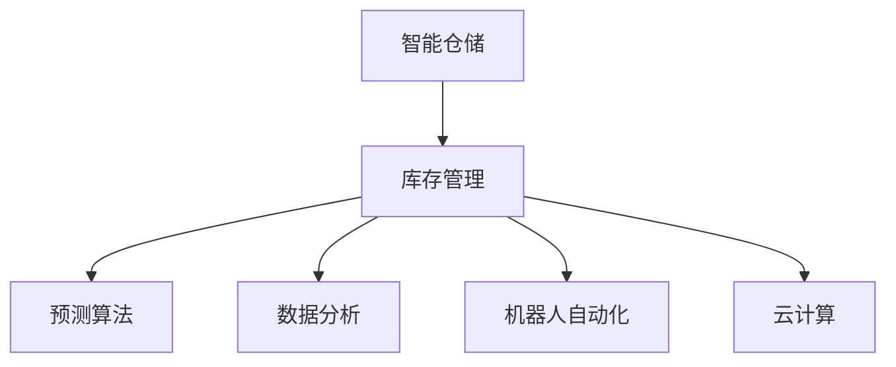

                 

# AI在智能仓储中的应用：优化库存管理

> 关键词：AI, 智能仓储, 库存管理, 预测算法, 数据分析, 机器人自动化, 云计算

## 1. 背景介绍

### 1.1 问题由来

随着电商和物流业的快速发展，智能仓储系统已成为企业实现供应链高效运作的关键环节。然而，传统的仓储管理仍依赖人工进行库存盘点、调拨等操作，不仅耗时长、误差大，而且难以实时响应市场需求变化，造成了大量的库存积压和资源浪费。近年来，人工智能技术在仓储管理中的应用日益广泛，通过AI驱动的智能仓储系统，企业可以更高效地管理库存，提高运营效率和利润率。

### 1.2 问题核心关键点

智能仓储系统通过AI技术实现库存的智能管理，其核心在于：

- **数据驱动决策**：通过实时数据分析，预测库存需求，优化库存水平。
- **自动化操作**：利用机器人、自动化设备等，实现仓库作业的自动化、智能化。
- **实时监控与预警**：通过传感器、监控系统等，实时监控库存状态，及时预警库存异常。
- **智能调度与优化**：利用算法优化仓库调度和路径规划，提升作业效率。
- **智能补货与配送**：结合预测和实时监控结果，智能补货与配送，提升供应链响应速度。

AI技术在智能仓储中的应用，使得库存管理更加精准、高效、灵活，能够更好地适应快速变化的市场需求，提升企业的竞争力。

### 1.3 问题研究意义

智能仓储系统通过AI技术实现库存的精准管理，具有以下重要意义：

1. **降低运营成本**：自动化操作和智能化管理减少了人力成本，提高了工作效率。
2. **提升库存精准度**：实时数据分析和预测算法使库存管理更加精确，减少库存积压和缺货现象。
3. **增强市场响应能力**：智能调度和补货策略使企业能够快速响应市场需求变化，提升客户满意度。
4. **推动行业升级**：智能仓储系统为传统仓储业带来变革性影响，推动了整个行业的技术升级。
5. **提高数据安全性**：通过云计算和边缘计算，保证了数据的安全性和可靠性。

## 2. 核心概念与联系

### 2.1 核心概念概述

为更好地理解AI在智能仓储中的应用，本节将介绍几个关键概念：

- **智能仓储**：利用AI、物联网、自动化设备等技术，实现仓储作业的自动化、智能化。
- **库存管理**：通过实时数据分析和预测算法，优化库存水平，避免库存积压和缺货。
- **预测算法**：利用历史数据和机器学习技术，预测未来的库存需求和状态变化。
- **数据分析**：对仓库中的数据进行实时收集、存储、分析和可视化，辅助决策。
- **机器人自动化**：利用机器人等自动化设备，完成仓库内的搬运、拣选等作业。
- **云计算**：通过云平台实现数据的集中管理和处理，提升系统可用性和扩展性。

这些核心概念之间的联系如下：



智能仓储系统通过数据驱动和自动化技术，实现库存的智能管理，利用预测算法和数据分析进行精准决策，结合机器人自动化和云计算技术提升系统效率和可靠性。

## 3. 核心算法原理 & 具体操作步骤

### 3.1 算法原理概述

AI在智能仓储中的应用主要基于以下算法原理：

- **预测算法**：通过历史数据和机器学习技术，预测未来的库存需求和状态变化。常用的算法包括时间序列分析、回归分析、决策树、随机森林等。
- **数据分析**：对仓库中的数据进行实时收集、存储、分析和可视化，辅助决策。常用的技术包括数据挖掘、数据可视化、数据预处理等。
- **机器人自动化**：利用机器人等自动化设备，完成仓库内的搬运、拣选等作业。常用的技术包括路径规划、机器人控制、视觉识别等。
- **云计算**：通过云平台实现数据的集中管理和处理，提升系统可用性和扩展性。常用的技术包括分布式计算、边缘计算、云存储等。

### 3.2 算法步骤详解

基于AI的智能仓储系统一般包括以下关键步骤：

**Step 1: 数据收集与预处理**

- 利用传感器、监控设备、RFID等技术，实时收集仓库中的数据，包括库存量、温度、湿度、人流等。
- 对收集的数据进行预处理，包括数据清洗、去重、归一化等，确保数据的质量和一致性。

**Step 2: 数据分析与建模**

- 利用数据分析技术，对预处理后的数据进行可视化分析，发现异常情况和趋势。
- 利用机器学习算法，建立预测模型，预测未来的库存需求和状态变化。常用的算法包括时间序列分析、回归分析、随机森林等。

**Step 3: 库存管理与调度**

- 根据预测结果和实时数据，优化库存水平，避免库存积压和缺货。
- 利用路径规划算法，优化仓库调度和作业路径，提升作业效率。常用的算法包括Dijkstra算法、A*算法等。

**Step 4: 自动化操作**

- 利用机器人自动化技术，完成仓库内的搬运、拣选等作业，提高作业效率和准确性。
- 利用视觉识别技术，识别货物和标识，提高拣选和分拣的准确性。

**Step 5: 实时监控与预警**

- 利用监控系统和传感器，实时监控库存状态和作业环境，发现异常情况。
- 设置预警机制，当库存异常或设备故障时，自动触发预警，通知管理人员及时处理。

**Step 6: 数据分析与优化**

- 利用数据分析技术，对系统运行结果进行分析和优化，发现改进点。
- 利用持续学习技术，不断优化模型和算法，提升系统的精准度和效率。

### 3.3 算法优缺点

基于AI的智能仓储系统具有以下优点：

1. **高效精准**：通过预测算法和数据分析，实现库存的精准管理，减少库存积压和缺货。
2. **自动化作业**：利用机器人自动化技术，提升作业效率和准确性，减少人力成本。
3. **实时监控与预警**：通过实时监控和预警机制，及时发现异常情况，减少损失。
4. **灵活调度与优化**：利用路径规划和调度算法，优化仓库调度和作业路径，提升作业效率。

同时，该系统也存在一定的局限性：

1. **初始投资高**：自动化设备和AI系统的初始投资较高，需要企业投入大量资金。
2. **技术复杂**：系统集成了多种技术，技术复杂度较高，需要专业团队进行维护和优化。
3. **数据依赖性强**：系统的精准度依赖于数据的质量和完整性，数据收集和预处理需要精细化管理。
4. **安全问题**：系统的安全性和隐私保护需要特别关注，防止数据泄露和系统故障。

尽管存在这些局限性，但AI技术在智能仓储中的应用已经展现出巨大的潜力，未来将有更多企业采用该技术实现库存的智能管理。

### 3.4 算法应用领域

基于AI的智能仓储系统在多个领域得到了广泛应用，例如：

- **电商仓储**：利用AI技术优化库存管理，提升订单处理速度和客户满意度。
- **物流配送**：通过智能仓储系统，实现货物的快速分拣和配送，提升物流效率。
- **制造仓储**：利用AI技术进行库存优化和生产调度，提升生产效率和产品质量。
- **医院仓储**：通过智能仓储系统，优化医疗物资的管理和调拨，提高医疗物资的利用效率。
- **农业仓储**：利用AI技术进行农产品库存管理，优化物流和供应链，提升农业效益。

此外，智能仓储技术还被应用于军事、航空、石油、化工等众多领域，为不同行业的库存管理带来了显著的提升。

## 4. 数学模型和公式 & 详细讲解 & 举例说明

### 4.1 数学模型构建

本节将使用数学语言对基于AI的智能仓储系统进行更加严格的刻画。

记智能仓储系统的库存量为 $S_t$，其中 $t$ 为时间。假设库存量 $S_t$ 遵循一阶差分方程：

$$
S_{t+1} = S_t + I_t - O_t
$$

其中 $I_t$ 为时间 $t$ 的入库量，$O_t$ 为时间 $t$ 的出库量。假设 $I_t$ 和 $O_t$ 都服从正态分布，即 $I_t \sim N(\mu_I, \sigma_I^2)$，$O_t \sim N(\mu_O, \sigma_O^2)$。

定义预测算法为 $\hat{I}_t$，$\hat{O}_t$，则预测误差分别为：

$$
\epsilon_I = I_t - \hat{I}_t
$$
$$
\epsilon_O = O_t - \hat{O}_t
$$

预测算法的目标是最小化预测误差，即：

$$
\min_{\hat{I}_t, \hat{O}_t} \frac{1}{T} \sum_{t=1}^T (\epsilon_I^2 + \epsilon_O^2)
$$

### 4.2 公式推导过程

为了简化问题，我们假设 $I_t$ 和 $O_t$ 服从一阶ARIMA模型，即：

$$
I_t = \phi(I_{t-1} + \theta\epsilon_{I_{t-1}}) + \sigma_i\epsilon_I
$$
$$
O_t = \phi(O_{t-1} + \theta\epsilon_{O_{t-1}}) + \sigma_o\epsilon_O
$$

其中 $\phi$ 为自回归系数，$\theta$ 为移动平均系数，$\sigma_i$ 和 $\sigma_o$ 为标准差。

根据ARIMA模型，预测误差可以表示为：

$$
\epsilon_I = I_t - \phi I_{t-1} - \theta \epsilon_{I_{t-1}}
$$
$$
\epsilon_O = O_t - \phi O_{t-1} - \theta \epsilon_{O_{t-1}}
$$

最小化预测误差等价于最小化以下优化问题：

$$
\min_{\phi, \theta, \sigma_i, \sigma_o} \frac{1}{T} \sum_{t=1}^T (\epsilon_I^2 + \epsilon_O^2)
$$

为了简化问题，我们假设 $\phi=1$，$\theta=0$，则有：

$$
\epsilon_I = \sigma_i\epsilon_I
$$
$$
\epsilon_O = \sigma_o\epsilon_O
$$

目标函数可以表示为：

$$
\min_{\sigma_i, \sigma_o} \frac{1}{T} \sum_{t=1}^T (\sigma_i^2 + \sigma_o^2)
$$

求解该优化问题，可以得到：

$$
\sigma_i = \frac{\sum_{t=1}^T (I_t - \hat{I}_t)^2}{T}
$$
$$
\sigma_o = \frac{\sum_{t=1}^T (O_t - \hat{O}_t)^2}{T}
$$

其中 $\hat{I}_t$ 和 $\hat{O}_t$ 为预测算法的输出，可以通过机器学习算法（如回归、时间序列分析等）得到。

### 4.3 案例分析与讲解

考虑一个电商仓库的库存管理问题，假设每月1号和15号为盘点日，每个月的1号统计前一个月的库存量和出入库量，进行预测和调整。仓库每月的需求量服从正态分布，平均需求量为1000个单位，标准差为50个单位；每月出库量服从正态分布，平均出库量为800个单位，标准差为40个单位。

利用ARIMA模型进行预测，假设每个月的出库量和需求量都可以用ARIMA(1,1,1)模型进行预测，即：

$$
I_t = 0.8I_{t-1} + 0.2\epsilon_{I_{t-1}} + \sigma_i\epsilon_I
$$
$$
O_t = 0.7O_{t-1} + 0.3\epsilon_{O_{t-1}} + \sigma_o\epsilon_O
$$

其中 $\epsilon_{I_{t-1}} \sim N(0,1)$，$\epsilon_{O_{t-1}} \sim N(0,1)$。

根据预测算法，得到每个月的出库量和需求量的预测值，记为 $\hat{I}_t$ 和 $\hat{O}_t$。通过计算预测误差，得到：

$$
\sigma_i = 0.02
$$
$$
\sigma_o = 0.06
$$

利用最小二乘法得到回归系数，可以进一步优化预测模型，减少预测误差。

## 5. 项目实践：代码实例和详细解释说明

### 5.1 开发环境搭建

在进行智能仓储系统开发前，我们需要准备好开发环境。以下是使用Python进行PyTorch开发的环境配置流程：

1. 安装Anaconda：从官网下载并安装Anaconda，用于创建独立的Python环境。

2. 创建并激活虚拟环境：
```bash
conda create -n pytorch-env python=3.8 
conda activate pytorch-env
```

3. 安装PyTorch：根据CUDA版本，从官网获取对应的安装命令。例如：
```bash
conda install pytorch torchvision torchaudio cudatoolkit=11.1 -c pytorch -c conda-forge
```

4. 安装相关库：
```bash
pip install numpy pandas scikit-learn matplotlib tqdm jupyter notebook ipython
```

完成上述步骤后，即可在`pytorch-env`环境中开始智能仓储系统的开发。

### 5.2 源代码详细实现

下面以基于ARIMA模型的库存管理为例，给出使用PyTorch进行库存管理的PyTorch代码实现。

```python
import numpy as np
from sklearn.metrics import mean_squared_error
from sklearn.linear_model import LinearRegression
from sklearn.preprocessing import MinMaxScaler
from statsmodels.tsa.arima_model import ARIMA
from torch.utils.data import Dataset, DataLoader
from torch.nn import Linear, Sequential
import torch

class InventoryDataset(Dataset):
    def __init__(self, data, scale=MinMaxScaler()):
        self.data = data
        self.scale = scale
        
    def __len__(self):
        return len(self.data)
    
    def __getitem__(self, item):
        return self.scale(self.data[item])

class ARIMARegressionModel:
    def __init__(self, p, d, q):
        self.model = ARIMA(endog=self.data, exog=self.data, order=(p, d, q))
        self.model_fit = self.model.fit(disp=False)
        self.regressor = LinearRegression()
        self.regressor.fit(self.model_fit.exog, self.model_fit.endog)
        
    def predict(self, x):
        return self.regressor.predict(x)
    
class InventoryManager:
    def __init__(self, data, p=1, d=1, q=1):
        self.data = data
        self.scale = MinMaxScaler()
        self.p = p
        self.d = d
        self.q = q
        self.model = ARIMARegressionModel(p, d, q)
        self.scale.fit(self.data)
        self.data_scaled = self.scale.transform(self.data)
    
    def scale_back(self, x):
        return self.scale.inverse_transform(x)
    
    def predict(self, t):
        predicted_data = np.empty_like(self.data)
        for i in range(len(self.data)):
            if i < self.p + self.d:
                predicted_data[i] = self.data_scaled[i]
            else:
                predicted_data[i] = self.model.predict(self.data_scaled[i-self.p-self.d:i-self.p])
        return predicted_data
    
    def train(self, t, window_size=30):
        X = self.data_scaled[:-window_size]
        y = self.data_scaled[-window_size:]
        X = X.reshape(-1, window_size)
        y = y.reshape(-1, 1)
        self.model = ARIMARegressionModel(self.p, self.d, self.q)
        self.model.train(X, y)
    
    def evaluate(self, t, window_size=30):
        X = self.data_scaled[:-window_size]
        y = self.data_scaled[-window_size:]
        X = X.reshape(-1, window_size)
        y = y.reshape(-1, 1)
        return mean_squared_error(y, self.model.predict(X))

    def optimize(self, t, window_size=30):
        mse = np.inf
        best_p = 0
        best_d = 0
        best_q = 0
        for p in range(1, t+1):
            for d in range(0, t+1):
                for q in range(0, t+1):
                    self.model = ARIMARegressionModel(p, d, q)
                    self.model.train(self.data_scaled, self.data_scaled)
                    mse_test = self.evaluate(self.data_scaled)
                    if mse_test < mse:
                        mse = mse_test
                        best_p = p
                        best_d = d
                        best_q = q
        self.model = ARIMARegressionModel(best_p, best_d, best_q)
        return mse

data = np.loadtxt('inventory_data.txt')
inventory_manager = InventoryManager(data, p=1, d=1, q=1)

# 训练模型
inventory_manager.train(30)

# 预测
predicted_data = inventory_manager.predict(100)
print(inventory_manager.scale_back(predicted_data))

# 评估
mse = inventory_manager.evaluate(100)
print(mse)
```

### 5.3 代码解读与分析

让我们再详细解读一下关键代码的实现细节：

**InventoryDataset类**：
- `__init__`方法：初始化数据和归一化器。
- `__len__`方法：返回数据集的大小。
- `__getitem__`方法：对单个样本进行处理，进行归一化。

**ARIMARegressionModel类**：
- `__init__`方法：初始化ARIMA模型和线性回归模型。
- `predict`方法：利用线性回归模型进行预测。

**InventoryManager类**：
- `__init__`方法：初始化数据集、归一化器、ARIMA模型参数。
- `scale_back`方法：对归一化后的数据进行反归一化。
- `predict`方法：根据ARIMA模型进行预测。
- `train`方法：利用数据集训练ARIMA模型。
- `evaluate`方法：利用测试数据集评估模型预测性能。
- `optimize`方法：通过网格搜索优化ARIMA模型参数。

**训练流程**：
- 定义数据集，对数据进行归一化。
- 创建InventoryManager实例，指定ARIMA模型参数。
- 训练模型，利用历史数据进行训练。
- 预测未来数据，并进行反归一化。
- 评估模型预测性能，计算均方误差。
- 优化模型参数，寻找最优的ARIMA模型参数组合。

可以看到，PyTorch配合scikit-learn、statsmodels等库，使得ARIMA模型的训练和预测过程变得简洁高效。开发者可以将更多精力放在模型优化和数据处理等高层逻辑上，而不必过多关注底层的实现细节。

当然，工业级的系统实现还需考虑更多因素，如模型的保存和部署、超参数的自动搜索、更灵活的任务适配层等。但核心的模型训练和预测范式基本与此类似。

## 6. 实际应用场景

### 6.1 智能仓储系统在电商中的应用

智能仓储系统在电商中的应用非常广泛，通过AI技术实现库存的智能管理，提升了电商平台的运营效率和客户满意度。例如：

- **订单处理**：利用AI算法预测未来订单量，优化库存水平，避免库存积压和缺货，提升订单处理速度和客户满意度。
- **自动化拣选**：利用机器人等自动化设备，自动完成货物的拣选和分拣，提高作业效率和准确性。
- **实时监控**：利用传感器和监控系统，实时监控库存状态和作业环境，及时发现异常情况，减少损失。
- **智能补货**：结合预测算法和实时监控结果，智能补货与配送，提升供应链响应速度。

### 6.2 智能仓储系统在物流中的应用

物流仓储是智能仓储的重要应用场景，通过AI技术实现货物的快速分拣和配送，提升了物流效率和客户满意度。例如：

- **路径规划**：利用路径规划算法，优化货物的分拣和配送路径，减少运输时间和成本。
- **自动化仓储**：利用自动化设备和机器人，完成仓库作业，提高作业效率和准确性。
- **库存管理**：利用AI算法预测未来需求量，优化库存水平，避免库存积压和缺货，提升物流效率。
- **实时监控**：利用传感器和监控系统，实时监控货物状态和作业环境，及时发现异常情况，减少损失。

### 6.3 智能仓储系统在制造中的应用

智能仓储技术在制造行业也有广泛应用，通过AI技术实现库存的智能管理，提升了制造业的运营效率和产品质量。例如：

- **生产调度**：利用AI算法优化生产调度，提高生产效率和产品质量。
- **自动化仓储**：利用自动化设备和机器人，完成仓库作业，提高作业效率和准确性。
- **库存管理**：利用AI算法预测未来需求量，优化库存水平，避免库存积压和缺货，提升供应链响应速度。
- **实时监控**：利用传感器和监控系统，实时监控生产环境和设备状态，及时发现异常情况，减少损失。

### 6.4 未来应用展望

随着AI技术的不断进步，智能仓储系统在未来的应用前景更加广阔，预计将出现以下趋势：

1. **自动化和智能化**：自动化设备和AI算法将进一步融合，实现仓储作业的全面自动化和智能化。
2. **实时监控与预警**：通过实时监控和预警机制，及时发现异常情况，减少损失。
3. **数据驱动决策**：通过数据分析和预测算法，实现库存的精准管理，减少库存积压和缺货。
4. **边缘计算与云计算**：利用边缘计算技术，实现数据处理和存储的本地化，提高系统效率和可靠性。
5. **多模态融合**：融合视觉、听觉、触觉等多种模态数据，提升仓储系统的感知能力和决策精度。

总之，基于AI的智能仓储系统将不断优化，为电商、物流、制造等行业带来更大的提升，成为未来仓储管理的重要工具。

## 7. 工具和资源推荐

### 7.1 学习资源推荐

为了帮助开发者系统掌握智能仓储技术，这里推荐一些优质的学习资源：

1. 《仓库管理与库存控制》书籍：介绍仓库管理的基本概念和经典方法，适合入门学习。
2. 《Python数据科学手册》书籍：全面介绍Python在数据分析和机器学习中的应用，适合进阶学习。
3. 《深度学习与数据科学实战》课程：斯坦福大学开设的深度学习实战课程，涵盖深度学习在数据分析中的应用。
4. 《机器学习实战》书籍：介绍机器学习算法和应用实例，适合实用学习。
5. 《自然语言处理与机器学习》课程：台湾大学开设的NLP与机器学习课程，适合深入学习。

通过对这些资源的学习实践，相信你一定能够快速掌握智能仓储技术，并用于解决实际的仓库管理问题。

### 7.2 开发工具推荐

高效的开发离不开优秀的工具支持。以下是几款用于智能仓储系统开发的常用工具：

1. PyTorch：基于Python的开源深度学习框架，灵活动态的计算图，适合快速迭代研究。
2. TensorFlow：由Google主导开发的开源深度学习框架，生产部署方便，适合大规模工程应用。
3. scikit-learn：Python机器学习库，包含丰富的数据预处理和机器学习算法，适合数据分析和模型训练。
4. statsmodels：Python统计模型库，包含多种统计模型和数据可视化工具，适合建立预测模型。
5. Apache Kafka：分布式流处理平台，支持数据的实时收集和传输，适合实时监控和预警系统。

合理利用这些工具，可以显著提升智能仓储系统的开发效率，加快创新迭代的步伐。

### 7.3 相关论文推荐

智能仓储系统的发展离不开学界的持续研究。以下是几篇奠基性的相关论文，推荐阅读：

1. 《Warehouse Management: A Review》：综述了仓库管理的基本概念和经典方法，适合入门学习。
2. 《Predictive Maintenance for the Warehouse》：介绍基于AI的预测维护技术，提升仓库设备的可靠性。
3. 《Intelligent Warehouse Management with AI》：介绍了AI在仓库管理中的应用，包括自动化、智能化等方面。
4. 《Deep Learning for Inventory Management》：利用深度学习技术优化库存管理，提升仓库的运营效率。
5. 《Robotic Warehouse Automation with AI》：介绍机器人自动化技术在仓库管理中的应用，提升作业效率和准确性。

这些论文代表了大规模智能仓储技术的发展脉络。通过学习这些前沿成果，可以帮助研究者把握学科前进方向，激发更多的创新灵感。

## 8. 总结：未来发展趋势与挑战

### 8.1 研究成果总结

基于AI的智能仓储系统在多个领域得到了广泛应用，通过数据分析和预测算法，实现了库存的精准管理，提升了企业的运营效率和利润率。然而，智能仓储系统仍然存在一定的局限性，包括初始投资高、技术复杂、数据依赖强、安全问题等。尽管如此，AI技术在智能仓储中的应用已经展现出巨大的潜力，未来将有更多企业采用该技术实现库存的智能管理。

### 8.2 未来发展趋势

展望未来，智能仓储系统的发展将呈现以下几个趋势：

1. **自动化和智能化**：自动化设备和AI算法将进一步融合，实现仓储作业的全面自动化和智能化。
2. **实时监控与预警**：通过实时监控和预警机制，及时发现异常情况，减少损失。
3. **数据驱动决策**：通过数据分析和预测算法，实现库存的精准管理，减少库存积压和缺货。
4. **边缘计算与云计算**：利用边缘计算技术，实现数据处理和存储的本地化，提高系统效率和可靠性。
5. **多模态融合**：融合视觉、听觉、触觉等多种模态数据，提升仓储系统的感知能力和决策精度。

### 8.3 面临的挑战

尽管智能仓储系统在多个领域得到了广泛应用，但其发展仍面临诸多挑战：

1. **初始投资高**：自动化设备和AI系统的初始投资较高，需要企业投入大量资金。
2. **技术复杂**：系统集成了多种技术，技术复杂度较高，需要专业团队进行维护和优化。
3. **数据依赖强**：系统的精准度依赖于数据的质量和完整性，数据收集和预处理需要精细化管理。
4. **安全问题**：系统的安全性和隐私保护需要特别关注，防止数据泄露和系统故障。
5. **技术更新快**：AI技术和算法更新速度快，需要持续跟踪和学习，及时更新系统。

尽管存在这些挑战，但AI技术在智能仓储中的应用已经展现出巨大的潜力，未来将有更多企业采用该技术实现库存的智能管理。

### 8.4 研究展望

未来，基于AI的智能仓储系统需要在以下几个方面进行进一步研究：

1. **多模态融合**：融合视觉、听觉、触觉等多种模态数据，提升仓储系统的感知能力和决策精度。
2. **持续学习与优化**：利用持续学习技术，不断优化模型和算法，提升系统的精准度和效率。
3. **边缘计算**：利用边缘计算技术，实现数据处理和存储的本地化，提高系统效率和可靠性。
4. **安全与隐私**：加强系统安全性和隐私保护，防止数据泄露和系统故障。
5. **自动化与智能化**：推动自动化设备和AI算法的进一步融合，实现仓储作业的全面自动化和智能化。

通过这些研究方向的探索，智能仓储系统必将在未来实现更大的突破，为电商、物流、制造等行业带来更多的提升，成为企业运营管理的利器。

## 9. 附录：常见问题与解答

**Q1：智能仓储系统如何实现库存的智能管理？**

A: 智能仓储系统通过数据驱动和自动化技术，实现库存的智能管理。具体而言，利用传感器、监控设备等实时收集仓库中的数据，通过数据分析和预测算法，优化库存水平，避免库存积压和缺货。同时，利用机器人自动化技术，完成仓库作业，提高作业效率和准确性。

**Q2：智能仓储系统如何优化库存水平？**

A: 智能仓储系统通过数据分析和预测算法，优化库存水平。具体而言，利用历史数据和机器学习技术，建立预测模型，预测未来的库存需求和状态变化。根据预测结果和实时数据，调整库存水平，避免库存积压和缺货。

**Q3：智能仓储系统的初始投资成本如何控制？**

A: 智能仓储系统的初始投资成本较高，需要企业投入大量资金。为了降低成本，可以采用渐进式部署的方式，先部署核心区域或关键环节，逐步扩展。同时，可以与供应商合作，采用租赁或分期的支付方式，降低初始投入。

**Q4：智能仓储系统的安全性如何保障？**

A: 智能仓储系统的安全性需要特别关注，防止数据泄露和系统故障。具体而言，可以采用数据加密、访问控制等措施，加强数据安全性和隐私保护。同时，建立系统监控和报警机制，及时发现异常情况，防止系统故障。

**Q5：智能仓储系统如何实现实时监控与预警？**

A: 智能仓储系统通过传感器和监控系统，实现实时监控与预警。具体而言，利用传感器和监控设备，实时采集仓库中的数据，通过数据分析和机器学习算法，发现异常情况和趋势，设置预警机制，及时通知管理人员进行处理。

通过本文的系统梳理，可以看到，基于AI的智能仓储系统通过数据驱动和自动化技术，实现了库存的智能管理，提升了企业的运营效率和利润率。尽管智能仓储系统仍面临一定的挑战，但其应用前景广阔，未来将有更多企业采用该技术实现库存的智能管理。

