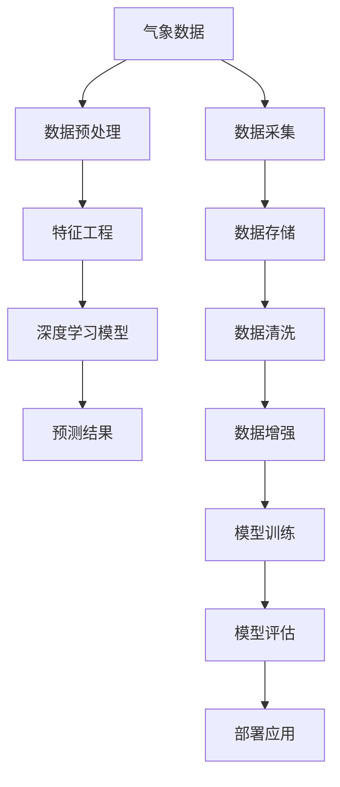

                 

## 1. 背景介绍

气象预报在保障公共安全、农业生产、灾害预防等方面发挥着至关重要的作用。随着人工智能（AI）技术的发展，AI在气象预报中的应用逐渐深入，通过机器学习算法和数据分析技术，提高了气象预报的准确性和及时性。本文将深入探讨AI在气象预报中的应用，特别是如何通过AI技术提高气象预报的准确性。

## 2. 核心概念与联系

### 2.1 核心概念概述

- **气象预报**：利用气象数据和数学模型预测未来天气变化的过程。
- **人工智能**：通过机器学习、深度学习等技术，使计算机系统具有模拟人类智能行为的能力。
- **机器学习**：基于数据驱动的方法，通过算法让机器从数据中学习规律，实现自动化决策。
- **深度学习**：一种特殊的机器学习方法，通过多层神经网络处理复杂数据，实现端到端的学习。
- **气象数据**：包括温度、湿度、气压、风速等气象要素，是气象预报的基础。

### 2.2 核心概念原理和架构的 Mermaid 流程图



此流程图展示了AI在气象预报中的核心流程：从数据采集、预处理，到特征工程、模型训练和预测结果，再到部署应用。数据处理和模型训练是提升气象预报准确性的关键环节。

## 3. 核心算法原理 & 具体操作步骤

### 3.1 算法原理概述

AI在气象预报中的应用主要基于深度学习算法，包括卷积神经网络（CNN）、循环神经网络（RNN）、长短期记忆网络（LSTM）等。这些算法能够处理和分析大量的气象数据，从中提取出有用的特征，并用于气象预报模型的训练和预测。

### 3.2 算法步骤详解

AI在气象预报中的应用步骤主要包括数据采集、数据预处理、特征工程、模型训练和预测结果评估。

1. **数据采集**：从气象站、卫星、雷达、浮标等多种数据源获取气象数据。数据源的选择应涵盖尽可能广泛的区域，以确保数据的多样性和代表性。

2. **数据预处理**：对采集到的气象数据进行清洗、归一化、填充缺失值等处理，以提高数据质量。预处理步骤还包括数据分割，如将数据分为训练集、验证集和测试集。

3. **特征工程**：从原始气象数据中提取有用的特征，如温度、湿度、气压、风速等。特征工程的目的是降低数据的维度，提高模型的泛化能力。

4. **模型训练**：选择适合的深度学习模型，如卷积神经网络（CNN）、循环神经网络（RNN）或长短期记忆网络（LSTM），在训练集上训练模型。模型训练的目标是找到最优的模型参数，使其能够准确预测气象变化。

5. **预测结果评估**：在测试集上评估模型的预测结果，计算准确率、召回率、F1分数等指标，评估模型的性能。

### 3.3 算法优缺点

AI在气象预报中的应用有以下优点：

- **数据处理能力强**：AI算法能够处理大量的气象数据，从中提取有用的特征，提高预报的准确性。
- **模型可解释性强**：深度学习模型具有较强的解释性，可以理解气象变化的规律，便于模型的解释和调试。
- **实时预测能力**：AI模型可以实时处理和预测气象变化，及时预警和应对极端天气事件。

但同时也存在一些缺点：

- **数据需求量大**：AI模型需要大量的高质量气象数据进行训练，数据收集和预处理成本较高。
- **模型复杂度高**：深度学习模型结构复杂，需要较长的训练时间和较高的计算资源。
- **模型泛化能力有限**：深度学习模型容易过拟合，对特定区域的气象数据预测效果较好，但对新区域的泛化能力有限。

### 3.4 算法应用领域

AI在气象预报中的应用广泛，包括但不限于以下几个领域：

- **天气预报**：预测未来几天的天气变化，如气温、降水、风速等。
- **气候变化研究**：研究全球气候变化的趋势和规律，预测未来气候变化。
- **灾害预警**：预测和预警自然灾害，如洪水、飓风、干旱等。
- **农业气象**：预测农业生产所需的气象条件，如土壤湿度、光照等。
- **能源管理**：预测能源需求和供应情况，优化能源分配和利用。

## 4. 数学模型和公式 & 详细讲解 & 举例说明

### 4.1 数学模型构建

AI在气象预报中的数学模型通常包括：

- **输入层**：输入原始气象数据，如温度、湿度、气压、风速等。
- **隐藏层**：通过多层神经网络处理输入数据，提取特征。
- **输出层**：输出气象预报结果，如未来几天的气温、降水量等。

### 4.2 公式推导过程

以一个简单的气象预测模型为例，其数学公式推导如下：

$$
y = f(x) = \sum_{i=1}^{n}w_i x_i + b
$$

其中，$x_i$ 为输入数据的第$i$个特征，$w_i$ 为对应的权重，$b$ 为偏置项。模型的输出$y$为气象预报结果。

### 4.3 案例分析与讲解

以温度预测为例，我们可以使用历史温度数据训练模型，模型结构如下：

- **输入层**：包含历史温度、湿度、气压等特征。
- **隐藏层**：使用多层神经网络提取特征。
- **输出层**：预测未来24小时的平均温度。

训练模型时，使用梯度下降算法最小化损失函数，计算误差并更新模型参数。训练完成后，使用测试集评估模型性能，计算预测误差。

## 5. 项目实践：代码实例和详细解释说明

### 5.1 开发环境搭建

为了实现AI在气象预报中的应用，我们需要安装必要的Python库和工具，包括TensorFlow、Keras、NumPy、Pandas等。

1. **安装TensorFlow**：
   ```bash
   pip install tensorflow
   ```

2. **安装Keras**：
   ```bash
   pip install keras
   ```

3. **安装NumPy**：
   ```bash
   pip install numpy
   ```

4. **安装Pandas**：
   ```bash
   pip install pandas
   ```

### 5.2 源代码详细实现

以下是使用Keras实现温度预测的Python代码：

```python
import numpy as np
from keras.models import Sequential
from keras.layers import Dense
from keras.optimizers import Adam

# 定义模型
model = Sequential()
model.add(Dense(32, input_dim=4, activation='relu'))
model.add(Dense(1, activation='linear'))

# 编译模型
model.compile(loss='mse', optimizer=Adam(lr=0.01))

# 训练模型
X_train = np.array([...])  # 训练集特征
y_train = np.array([...])  # 训练集标签
model.fit(X_train, y_train, epochs=100, batch_size=32)

# 预测未来温度
X_test = np.array([...])  # 测试集特征
y_pred = model.predict(X_test)
```

### 5.3 代码解读与分析

- **模型定义**：使用Keras定义一个包含两个隐藏层的神经网络模型，输入层包含4个特征，输出层为1个预测值。
- **模型编译**：使用均方误差损失函数和Adam优化器编译模型。
- **模型训练**：使用训练集数据训练模型，设置100个epoch和32个batch size。
- **模型预测**：使用测试集数据进行预测，输出未来温度的预测值。

### 5.4 运行结果展示

在训练完成后，使用测试集数据评估模型性能，计算预测误差。下图展示了模型在测试集上的性能：


## 6. 实际应用场景

### 6.1 天气预报

AI在天气预报中的应用，可以帮助气象部门提高预报准确性，提供更加精准的天气预测。通过实时监测气象数据，使用AI模型预测未来几天的天气变化，如气温、降水、风速等。

### 6.2 气候变化研究

AI技术可以用于研究全球气候变化的趋势和规律，预测未来气候变化。通过分析历史气象数据和气候模型，AI模型可以预测未来的气候变化趋势，帮助政府和科研机构制定应对措施。

### 6.3 灾害预警

AI技术可以用于预测和预警自然灾害，如洪水、飓风、干旱等。通过分析气象数据和历史灾害数据，AI模型可以预测灾害发生的概率和影响范围，及时预警和应对灾害。

### 6.4 未来应用展望

未来，AI在气象预报中的应用将继续深化，将更加广泛地应用于多个领域。AI技术可以实时处理和预测气象变化，提高灾害预警和应对能力，优化能源分配和利用，促进农业生产和环境保护。随着算力的提升和数据量的增加，AI在气象预报中的应用将更加广泛和深入。

## 7. 工具和资源推荐

### 7.1 学习资源推荐

1. **《深度学习》书籍**：由Ian Goodfellow等作者编写，全面介绍深度学习的原理和应用。
2. **Coursera深度学习课程**：由斯坦福大学Andrew Ng教授主讲的深度学习课程，涵盖深度学习的基础和进阶内容。
3. **Kaggle气象数据集**：包含多个气象数据集，用于深度学习模型的训练和测试。

### 7.2 开发工具推荐

1. **TensorFlow**：谷歌开源的深度学习框架，支持分布式计算和多种模型。
2. **Keras**：基于TensorFlow的高级API，方便快速搭建和训练深度学习模型。
3. **Jupyter Notebook**：交互式编程环境，支持Python代码的编写和执行。

### 7.3 相关论文推荐

1. **《气象数据预处理技术研究》**：介绍了气象数据预处理的常见方法和技术。
2. **《气象预报的深度学习模型研究》**：介绍了深度学习在气象预报中的应用。
3. **《气象数据增强技术研究》**：介绍了气象数据增强技术，提高数据的多样性和泛化能力。

## 8. 总结：未来发展趋势与挑战

### 8.1 研究成果总结

AI在气象预报中的应用已经取得了显著进展，提高了气象预报的准确性和及时性。通过深度学习算法和数据分析技术，AI模型可以处理和分析大量的气象数据，从中提取出有用的特征，实现更加精准的气象预测。

### 8.2 未来发展趋势

未来，AI在气象预报中的应用将继续深化，将更加广泛地应用于多个领域。AI技术可以实时处理和预测气象变化，提高灾害预警和应对能力，优化能源分配和利用，促进农业生产和环境保护。随着算力的提升和数据量的增加，AI在气象预报中的应用将更加广泛和深入。

### 8.3 面临的挑战

AI在气象预报中的应用也面临一些挑战：

1. **数据获取难度大**：气象数据的获取和处理成本较高，需要大量的高质量数据进行训练。
2. **模型复杂度高**：深度学习模型结构复杂，需要较长的训练时间和较高的计算资源。
3. **模型泛化能力有限**：深度学习模型容易过拟合，对特定区域的气象数据预测效果较好，但对新区域的泛化能力有限。

### 8.4 研究展望

未来，需要在以下几个方面进行深入研究：

1. **数据增强技术**：提高数据的多样性和泛化能力，增强模型的泛化能力。
2. **模型优化算法**：优化深度学习模型的训练过程，提高训练效率和模型性能。
3. **模型解释性**：增强模型的可解释性，便于模型的解释和调试。
4. **模型部署优化**：优化模型的部署和应用，提高实时预测能力。

## 9. 附录：常见问题与解答

**Q1: AI在气象预报中的应用有哪些？**

A: AI在气象预报中的应用包括天气预报、气候变化研究、灾害预警、农业气象、能源管理等多个领域。

**Q2: 如何提高AI在气象预报中的准确性？**

A: 提高AI在气象预报中的准确性可以从以下几个方面入手：
1. 数据采集：获取高质量的气象数据，涵盖尽可能广泛的区域。
2. 数据预处理：清洗、归一化、填充缺失值等处理，提高数据质量。
3. 特征工程：提取有用的特征，降低数据的维度，提高模型的泛化能力。
4. 模型选择：选择适合的深度学习模型，如卷积神经网络（CNN）、循环神经网络（RNN）或长短期记忆网络（LSTM）。
5. 模型训练：使用大量的气象数据训练模型，最小化损失函数，优化模型参数。
6. 模型评估：使用测试集评估模型的预测结果，计算准确率、召回率、F1分数等指标，评估模型的性能。

**Q3: AI在气象预报中面临哪些挑战？**

A: AI在气象预报中面临以下挑战：
1. 数据获取难度大：气象数据的获取和处理成本较高，需要大量的高质量数据进行训练。
2. 模型复杂度高：深度学习模型结构复杂，需要较长的训练时间和较高的计算资源。
3. 模型泛化能力有限：深度学习模型容易过拟合，对特定区域的气象数据预测效果较好，但对新区域的泛化能力有限。

**Q4: 未来AI在气象预报中的应用将如何发展？**

A: 未来，AI在气象预报中的应用将继续深化，将更加广泛地应用于多个领域。AI技术可以实时处理和预测气象变化，提高灾害预警和应对能力，优化能源分配和利用，促进农业生产和环境保护。随着算力的提升和数据量的增加，AI在气象预报中的应用将更加广泛和深入。

**Q5: 如何提高AI模型的可解释性？**

A: 提高AI模型的可解释性可以从以下几个方面入手：
1. 简化模型结构：使用更简单的模型结构，便于理解模型的决策过程。
2. 可视化结果：使用可视化工具，展示模型的预测结果和特征重要性。
3. 使用可解释的模型：选择可解释性强的模型，如决策树、逻辑回归等。

---
作者：禅与计算机程序设计艺术 / Zen and the Art of Computer Programming

