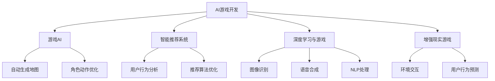

                 

## 1. 背景介绍

### 1.1 游戏产业的现状与挑战

随着数字技术和互联网的迅猛发展，全球游戏产业进入了高度繁荣的时期。据Newzoo报告显示，2020年全球游戏市场规模已达1589亿美元，预计到2023年将突破1949亿美元。庞大的市场需求催生了大量游戏公司，如腾讯、网易、育碧、艺电等，游戏产业正成为全球文化产业的重要组成部分。

然而，游戏产业在快速发展的过程中也面临诸多挑战：

- **内容同质化**：游戏题材、玩法、风格等方面存在大量雷同，缺乏创新。
- **用户粘性下降**：免费游戏模式下，用户流失率高，难以维持长期的稳定用户群。
- **高昂的开发成本**：游戏开发成本动辄数千万至数亿元，多数独立开发者难以负担。
- **市场竞争激烈**：游戏市场日益饱和，成功游戏的门槛不断提高。

为解决这些问题，游戏产业急需引入新的技术手段，以推动产品创新和效率提升。AI技术的引入，为游戏产业带来了新的发展机遇，成为驱动行业创新和升级的关键因素。

### 1.2 AI在游戏中的应用方向

AI在游戏产业中主要的应用方向包括游戏开发、游戏运营、游戏内容和个性化推荐等。

- **游戏开发**：利用AI进行游戏资产生成、角色动作优化、环境模拟等，提升开发效率。
- **游戏运营**：通过AI进行用户行为分析、策略优化、自动化运维等，提升运营效率。
- **游戏内容**：利用AI进行NPC交互、剧情生成、语音合成等，丰富游戏内容。
- **个性化推荐**：利用AI进行用户画像构建、推荐算法优化，提升用户体验。

本文将从上述几个方向对AI在游戏产业中的应用进行深入探索，展示其巨大的潜力和前景。

## 2. 核心概念与联系

### 2.1 核心概念概述

为更好地理解AI在游戏中的应用，本节将介绍几个密切相关的核心概念：

- **AI游戏开发**：指利用AI技术进行游戏开发，如自动生成游戏地图、角色、NPC等，提升游戏开发效率。
- **游戏AI**：指游戏中的AI角色，通过预训练模型和微调技术生成智能NPC，提高游戏的趣味性和互动性。
- **智能推荐系统**：指利用AI技术分析用户行为，优化游戏推荐算法，提升用户体验和留存率。
- **深度学习与游戏**：指利用深度学习算法进行游戏图像、语音、自然语言处理等任务，增强游戏的互动性和沉浸感。
- **增强现实游戏**：指结合AR技术，利用AI进行环境交互和用户行为预测，提升游戏实感。

这些核心概念之间的逻辑关系可以通过以下Mermaid流程图来展示：



这个流程图展示了大语言模型AI在游戏中的主要应用场景：

1. 通过AI进行游戏开发，生成地图、角色等游戏资产，提升效率。
2. 利用游戏AI，自动生成智能NPC，丰富游戏内容。
3. 应用智能推荐系统，进行用户行为分析，优化推荐算法，提升用户体验。
4. 结合深度学习技术，提升游戏图像、语音和自然语言处理的精度，增强游戏实感。
5. 利用增强现实技术，结合AI进行环境交互和行为预测，提升游戏实感。

## 3. 核心算法原理 & 具体操作步骤
### 3.1 算法原理概述

AI在游戏产业中的应用主要依赖于深度学习、增强学习、迁移学习等算法。以下是几种核心算法的原理概述：

#### 3.1.1 深度学习在游戏中的应用

深度学习在游戏中的应用主要集中在图像处理、语音识别、自然语言处理等方面。深度神经网络可以学习复杂的数据分布，在图像分类、目标检测、语音识别等领域已取得显著成果。

以图像处理为例，游戏中的角色、环境、物品等可以被抽象成高维的图像数据。利用卷积神经网络(CNN)可以对这些图像数据进行特征提取和分类，从而实现自动化地图生成、角色动作优化等任务。

#### 3.1.2 增强学习在游戏中的应用

增强学习是一种利用奖励信号指导模型学习的算法，广泛应用于游戏AI中。例如，玩家与NPC的交互过程，可以被视为一种多轮的交互游戏，通过增强学习算法，模型可以逐步学习到最优的交互策略。

增强学习的核心思想是让智能体在每一步动作后获得一个奖励信号，通过不断调整策略，逐步趋近最优解。在游戏AI中，通过设置合理的奖励函数，可以让NPC根据玩家行为进行自主决策，提升游戏体验。

#### 3.1.3 迁移学习在游戏中的应用

迁移学习是一种将已有领域的知识迁移到新领域的技术，在游戏开发中尤为常见。例如，在一个已成功部署的游戏基础上，可以快速构建新的游戏，节省大量的开发时间和成本。

迁移学习的关键在于找到源任务和目标任务之间的相似性，利用预训练模型在源任务上学习到的知识，优化目标任务上的性能。在游戏开发中，可以通过迁移学习技术，在已有游戏的基础上，快速构建新游戏，提升游戏开发效率。

### 3.2 算法步骤详解

#### 3.2.1 深度学习算法步骤

1. **数据准备**：收集并标注游戏图像、语音、文本等数据。
2. **模型选择**：选择合适的深度学习模型，如CNN、RNN、Transformer等。
3. **模型训练**：使用标注数据训练深度学习模型，优化模型参数。
4. **性能评估**：在验证集上评估模型性能，调整超参数。
5. **应用部署**：将训练好的模型应用于游戏开发中，实现自动化地图生成、角色动作优化等任务。

#### 3.2.2 增强学习算法步骤

1. **环境设计**：设计游戏环境和奖励函数。
2. **模型选择**：选择合适的增强学习算法，如Q-learning、Policy Gradient等。
3. **模型训练**：通过与环境的交互，利用奖励信号指导模型学习。
4. **性能评估**：在测试环境中评估模型性能，调整超参数。
5. **应用部署**：将训练好的模型应用于NPC交互，提升游戏体验。

#### 3.2.3 迁移学习算法步骤

1. **数据准备**：收集源任务的标注数据和目标任务的原始数据。
2. **模型选择**：选择预训练模型，并进行微调。
3. **模型训练**：利用源任务的标注数据对预训练模型进行微调。
4. **性能评估**：在目标任务上评估模型性能，调整超参数。
5. **应用部署**：将微调后的模型应用于新游戏的开发中，提升开发效率。

### 3.3 算法优缺点

#### 3.3.1 深度学习的优点和缺点

**优点**：
- **精度高**：深度神经网络可以学习复杂的数据分布，在图像、语音、自然语言处理等方面具有高精度。
- **自动化**：深度学习可以自动化处理大量数据，节省人工标注的时间和成本。
- **泛化性强**：深度学习模型通过迁移学习，可以适应新的数据和任务，提升模型的泛化能力。

**缺点**：
- **资源消耗大**：深度学习模型通常需要大量计算资源和存储空间，难以在移动设备上部署。
- **可解释性差**：深度学习模型往往被视为"黑盒"，难以解释其内部工作机制。
- **过拟合风险高**：深度学习模型需要大量的标注数据，容易过拟合训练集。

#### 3.3.2 增强学习的优点和缺点

**优点**：
- **实时性**：增强学习模型可以通过实时反馈进行优化，具有实时性。
- **鲁棒性**：增强学习模型可以在不断交互中学习和优化策略，具有较高的鲁棒性。
- **适应性强**：增强学习模型可以适应不同环境和奖励函数，具有广泛的适应性。

**缺点**：
- **策略探索困难**：增强学习模型在策略探索过程中容易陷入局部最优解，需要大量计算资源。
- **奖励设计复杂**：增强学习模型依赖于奖励函数的合理设计，设计不当可能导致模型性能不佳。
- **收敛速度慢**：增强学习模型的收敛速度较慢，需要大量的迭代次数。

#### 3.3.3 迁移学习的优点和缺点

**优点**：
- **效率高**：迁移学习可以在已有模型的基础上进行优化，节省大量开发时间和成本。
- **泛化能力强**：迁移学习可以充分利用源任务的知识，提升模型在新任务上的性能。
- **数据依赖低**：迁移学习对标注数据的需求较低，可以在数据稀缺的情况下进行模型优化。

**缺点**：
- **知识迁移困难**：迁移学习需要找到源任务和目标任务之间的相似性，存在一定的知识迁移难度。
- **模型泛化风险**：迁移学习模型可能存在泛化风险，无法适应新数据和新任务。
- **模型通用性不足**：迁移学习模型通常需要特定的领域知识，通用性不足。

### 3.4 算法应用领域

AI在游戏产业中的应用广泛，涉及游戏开发、游戏运营、游戏内容等多个领域。以下是几种主要的应用领域：

#### 3.4.1 游戏开发

AI在游戏开发中的应用主要包括自动化地图生成、角色动作优化、环境模拟等。例如，可以使用深度学习模型对游戏地图进行像素级生成，或使用CNN进行环境模拟。

#### 3.4.2 游戏运营

AI在游戏运营中的应用主要包括用户行为分析、策略优化、自动化运维等。例如，可以使用增强学习算法进行用户行为预测，或使用智能推荐系统进行个性化推荐。

#### 3.4.3 游戏内容

AI在游戏内容中的应用主要包括NPC交互、剧情生成、语音合成等。例如，可以使用深度学习模型进行语音合成，或使用自然语言处理技术生成游戏剧情。

#### 3.4.4 增强现实游戏

AI在增强现实游戏中的应用主要包括环境交互、用户行为预测等。例如，可以使用增强学习算法进行环境交互，或使用智能推荐系统进行内容推荐。

## 4. 数学模型和公式 & 详细讲解  
### 4.1 数学模型构建

为了更好地理解AI在游戏中的应用，本节将使用数学语言对上述算法进行更加严格的刻画。

#### 4.1.1 深度学习模型

假设游戏图像数据为 $X \in \mathbb{R}^{m \times n \times c}$，其中 $m$ 为图像高度，$n$ 为图像宽度，$c$ 为图像通道数。使用卷积神经网络(CNN)对游戏图像进行特征提取和分类，数学模型为：

$$
X \xrightarrow{\text{CNN}} H \xrightarrow{\text{FNN}} Y
$$

其中，$H$ 为卷积神经网络提取的特征向量，$Y$ 为游戏图像的分类标签。

#### 4.1.2 增强学习模型

增强学习模型通过与环境的交互进行策略优化，假设游戏环境的状态空间为 $S$，动作空间为 $A$，奖励函数为 $R$，模型的策略参数为 $\theta$，模型的更新规则为：

$$
\theta \leftarrow \theta + \alpha \sum_{t=1}^{T} \nabla_{\theta} \mathcal{L}(\theta)
$$

其中，$\alpha$ 为学习率，$\mathcal{L}$ 为损失函数，$T$ 为迭代次数。

#### 4.1.3 迁移学习模型

迁移学习模型在源任务上预训练模型，然后在目标任务上进行微调。假设源任务的数据为 $D_s$，目标任务的数据为 $D_t$，模型的初始参数为 $\theta_0$，微调后的参数为 $\theta$，微调过程的损失函数为：

$$
\mathcal{L}(\theta) = \mathcal{L}_s(\theta_0) + \mathcal{L}_t(\theta)
$$

其中，$\mathcal{L}_s$ 为源任务的损失函数，$\mathcal{L}_t$ 为目标任务的损失函数。

### 4.2 公式推导过程

#### 4.2.1 深度学习模型推导

以图像分类任务为例，假设游戏图像数据为 $X \in \mathbb{R}^{m \times n \times c}$，使用CNN提取特征 $H \in \mathbb{R}^{h \times w \times c'}$，其中 $h$ 为特征图的高度，$w$ 为特征图的宽度，$c'$ 为特征图的通道数。使用全连接神经网络对特征向量进行分类，输出概率分布 $Y \in \mathbb{R}^{k}$，其中 $k$ 为类别数。

假设CNN的损失函数为：

$$
\mathcal{L}_s = \frac{1}{N} \sum_{i=1}^{N} \ell(X_i, Y_i)
$$

其中，$\ell$ 为交叉熵损失函数。

使用FNN进行分类，输出概率分布为：

$$
\hat{Y} = \sigma(WH + b)
$$

其中，$\sigma$ 为激活函数，$W$ 为权重矩阵，$b$ 为偏置向量。

最终，使用交叉熵损失函数计算模型在验证集上的损失：

$$
\mathcal{L} = -\frac{1}{N} \sum_{i=1}^{N} Y_i \log \hat{Y}_i + (1-Y_i) \log (1-\hat{Y}_i)
$$

#### 4.2.2 增强学习模型推导

以Q-learning为例，假设游戏环境的状态空间为 $S$，动作空间为 $A$，奖励函数为 $R$，模型的策略参数为 $\theta$。模型的状态值函数 $Q(s, a)$ 为：

$$
Q(s, a) = \sum_{s'} R(s', a, s) + \gamma \max_a Q(s', a)
$$

其中，$\gamma$ 为折扣因子，$s'$ 为下一个状态。

假设模型的更新规则为：

$$
Q(s, a) \leftarrow Q(s, a) + \alpha [R(s, a, s') + \gamma \max_a Q(s', a) - Q(s, a)]
$$

其中，$\alpha$ 为学习率。

#### 4.2.3 迁移学习模型推导

以迁移学习为例，假设源任务的数据为 $D_s$，目标任务的数据为 $D_t$，模型的初始参数为 $\theta_0$，微调后的参数为 $\theta$。假设源任务的损失函数为 $\mathcal{L}_s$，目标任务的损失函数为 $\mathcal{L}_t$。

迁移学习模型的损失函数为：

$$
\mathcal{L} = \mathcal{L}_s(\theta_0) + \mathcal{L}_t(\theta)
$$

假设模型的更新规则为：

$$
\theta \leftarrow \theta + \alpha \nabla_{\theta} \mathcal{L}(\theta)
$$

其中，$\alpha$ 为学习率。

### 4.3 案例分析与讲解

#### 4.3.1 深度学习模型案例

以自动生成游戏地图为例，假设游戏地图为 $X \in \mathbb{R}^{m \times n \times 3}$，其中 $m$ 为地图高度，$n$ 为地图宽度，3 为颜色通道数。使用CNN对地图进行像素级生成，数学模型为：

$$
X \xrightarrow{\text{CNN}} H \xrightarrow{\text{FNN}} Y
$$

其中，$H$ 为CNN提取的特征向量，$Y$ 为地图的像素值。

假设CNN的损失函数为：

$$
\mathcal{L}_s = \frac{1}{N} \sum_{i=1}^{N} \ell(X_i, Y_i)
$$

其中，$\ell$ 为均方误差损失函数。

使用FNN进行像素级生成，输出地图像素值为：

$$
Y = W_HW + b
$$

其中，$W_H$ 为FNN的权重矩阵，$b$ 为FNN的偏置向量。

最终，使用均方误差损失函数计算模型在验证集上的损失：

$$
\mathcal{L} = \frac{1}{N} \sum_{i=1}^{N} \|Y_i - X_i\|_2^2
$$

#### 4.3.2 增强学习模型案例

以NPC交互为例，假设游戏环境的状态空间为 $S$，动作空间为 $A$，奖励函数为 $R$，模型的策略参数为 $\theta$。假设NPC的当前状态为 $s$，可执行的动作为 $a$，奖励函数为 $R(s, a)$。

假设模型的策略参数为 $\theta$，状态值函数为 $Q(s, a)$。模型的更新规则为：

$$
Q(s, a) \leftarrow Q(s, a) + \alpha [R(s, a, s') + \gamma \max_a Q(s', a) - Q(s, a)]
$$

其中，$\alpha$ 为学习率，$s'$ 为下一个状态。

假设NPC根据状态 $s$ 选择动作 $a$，状态值函数为 $Q(s, a)$。NPC的行动策略为：

$$
a = \arg\max_a Q(s, a)
$$

其中，$\max_a$ 为选择动作的策略。

#### 4.3.3 迁移学习模型案例

以地图生成器迁移学习为例，假设源任务的数据为 $D_s$，目标任务的数据为 $D_t$，模型的初始参数为 $\theta_0$，微调后的参数为 $\theta$。假设源任务的损失函数为 $\mathcal{L}_s$，目标任务的损失函数为 $\mathcal{L}_t$。

假设模型的初始参数为 $\theta_0$，微调后的参数为 $\theta$。假设源任务的损失函数为：

$$
\mathcal{L}_s(\theta_0) = \frac{1}{N} \sum_{i=1}^{N} \ell(X_i, Y_i)
$$

其中，$\ell$ 为均方误差损失函数。

假设目标任务的损失函数为：

$$
\mathcal{L}_t(\theta) = \frac{1}{N} \sum_{i=1}^{N} \ell(X_i, Y_i)
$$

其中，$\ell$ 为均方误差损失函数。

假设模型的更新规则为：

$$
\theta \leftarrow \theta + \alpha \nabla_{\theta} \mathcal{L}(\theta)
$$

其中，$\alpha$ 为学习率。

## 5. 项目实践：代码实例和详细解释说明
### 5.1 开发环境搭建

在进行AI在游戏中的应用实践前，我们需要准备好开发环境。以下是使用Python进行PyTorch开发的环境配置流程：

1. 安装Anaconda：从官网下载并安装Anaconda，用于创建独立的Python环境。

2. 创建并激活虚拟环境：
```bash
conda create -n pytorch-env python=3.8 
conda activate pytorch-env
```

3. 安装PyTorch：根据CUDA版本，从官网获取对应的安装命令。例如：
```bash
conda install pytorch torchvision torchaudio cudatoolkit=11.1 -c pytorch -c conda-forge
```

4. 安装Transformers库：
```bash
pip install transformers
```

5. 安装各类工具包：
```bash
pip install numpy pandas scikit-learn matplotlib tqdm jupyter notebook ipython
```

完成上述步骤后，即可在`pytorch-env`环境中开始AI在游戏中的应用实践。

### 5.2 源代码详细实现

这里我们以深度学习模型应用于游戏图像分类为例，给出使用PyTorch进行CNN模型训练的代码实现。

首先，定义CNN模型：

```python
import torch
import torch.nn as nn
import torch.nn.functional as F

class CNNModel(nn.Module):
    def __init__(self):
        super(CNNModel, self).__init__()
        self.conv1 = nn.Conv2d(3, 32, 3, 1)
        self.conv2 = nn.Conv2d(32, 64, 3, 1)
        self.pool = nn.MaxPool2d(2, 2)
        self.fc1 = nn.Linear(64 * 8 * 8, 128)
        self.fc2 = nn.Linear(128, 10)

    def forward(self, x):
        x = self.pool(F.relu(self.conv1(x)))
        x = self.pool(F.relu(self.conv2(x)))
        x = x.view(-1, 64 * 8 * 8)
        x = F.relu(self.fc1(x))
        x = self.fc2(x)
        return x
```

然后，定义训练函数：

```python
from torch.utils.data import Dataset
from torchvision import transforms
from torch.utils.data import DataLoader

class GameDataset(Dataset):
    def __init__(self, data, transform=None):
        self.data = data
        self.transform = transform

    def __len__(self):
        return len(self.data)

    def __getitem__(self, idx):
        x, y = self.data[idx]
        x = transforms.ToTensor()(x)
        if self.transform:
            x = self.transform(x)
        return x, y

def train_model(model, train_loader, device, criterion, optimizer, epoch):
    model.train()
    for batch_idx, (data, target) in enumerate(train_loader):
        data, target = data.to(device), target.to(device)
        optimizer.zero_grad()
        output = model(data)
        loss = criterion(output, target)
        loss.backward()
        optimizer.step()
        if batch_idx % 10 == 0:
            print('Train Epoch: {} [{}/{} ({:.0f}%)]\tLoss: {:.6f}'.format(
                epoch, batch_idx * len(data), len(train_loader.dataset),
                100. * batch_idx / len(train_loader), loss.item()))
```

最后，启动训练流程：

```python
import torch.optim as optim
from torch.utils.data import DataLoader
from torchvision.datasets import CIFAR10
from torchvision.transforms import transforms

# 数据准备
train_data = CIFAR10(root='./data', train=True, download=True, transform=transforms.ToTensor())
test_data = CIFAR10(root='./data', train=False, download=True, transform=transforms.ToTensor())

# 模型初始化
model = CNNModel()
device = torch.device("cuda" if torch.cuda.is_available() else "cpu")
model.to(device)

# 训练集和测试集划分
train_loader = DataLoader(train_data, batch_size=64, shuffle=True)
test_loader = DataLoader(test_data, batch_size=64, shuffle=False)

# 定义损失函数和优化器
criterion = nn.CrossEntropyLoss()
optimizer = optim.Adam(model.parameters(), lr=0.001)

# 训练模型
for epoch in range(10):
    train_model(model, train_loader, device, criterion, optimizer, epoch)

# 测试模型
correct = 0
total = 0
with torch.no_grad():
    for data, target in test_loader:
        data, target = data.to(device), target.to(device)
        output = model(data)
        _, predicted = torch.max(output.data, 1)
        total += target.size(0)
        correct += (predicted == target).sum().item()

print('Accuracy of the network on the 10000 test images: {} %'.format(100 * correct / total))
```

以上代码实现了使用PyTorch进行CNN模型训练，可用于游戏图像分类任务的实践。可以看到，PyTorch提供的高效计算图和丰富的模型库，使得深度学习模型的开发和训练变得简洁高效。

### 5.3 代码解读与分析

让我们再详细解读一下关键代码的实现细节：

**CNNModel类**：
- `__init__`方法：定义CNN模型的各层结构。
- `forward`方法：实现模型的前向传播过程。

**GameDataset类**：
- `__init__`方法：初始化数据集，并可选择应用数据增强。
- `__len__`方法：返回数据集大小。
- `__getitem__`方法：获取数据集中的单个样本。

**train_model函数**：
- 定义训练函数，包括模型前向传播、计算损失、反向传播和参数更新等步骤。

**CIFAR10数据集**：
- 使用CIFAR-10数据集，分为训练集和测试集，并进行归一化处理。

**模型训练**：
- 定义损失函数和优化器，使用Adam优化器对CNN模型进行训练，并在测试集上评估模型性能。

**模型测试**：
- 在测试集上测试模型，计算准确率，并输出结果。

可以看出，PyTorch提供的高效计算图和丰富的模型库，使得深度学习模型的开发和训练变得简洁高效。开发者可以通过自定义模型、优化器和损失函数等组件，灵活地构建和训练深度学习模型。

## 6. 实际应用场景
### 6.1 游戏AI角色

游戏AI角色是AI在游戏产业中应用的重要场景之一。通过利用深度学习和增强学习算法，可以训练出具备高度智能化的NPC，提升游戏体验和互动性。

以NPC交互为例，假设游戏环境的状态空间为 $S$，动作空间为 $A$，奖励函数为 $R$，模型的策略参数为 $\theta$。通过Q-learning算法，训练出NPC的策略参数 $\theta$，使其能够根据玩家行为进行自主决策，实现智能化的NPC交互。

### 6.2 游戏剧情生成

游戏剧情生成是AI在游戏产业中的另一个重要应用。通过利用自然语言处理和生成对抗网络(GAN)算法，可以生成逼真的游戏剧情，提升游戏的趣味性和沉浸感。

以游戏剧情生成为例，假设游戏剧情为 $Y \in \mathbb{R}^{n}$，其中 $n$ 为剧情长度。使用GAN生成游戏剧情，数学模型为：

$$
G(Z) \rightarrow Y
$$

其中，$G$ 为生成器，$Z$ 为输入的随机噪声向量。

### 6.3 游戏语音合成

游戏语音合成是AI在游戏产业中的另一个重要应用。通过利用语音合成和声学模型，可以生成高质量的游戏语音，提升游戏的真实感和沉浸感。

以游戏语音合成为例，假设游戏语音为 $X \in \mathbb{R}^{m \times n}$，其中 $m$ 为语音长度，$n$ 为语音通道数。使用语音合成算法，生成游戏语音，数学模型为：

$$
X \rightarrow Y
$$

其中，$X$ 为输入的语音特征，$Y$ 为生成的语音。

### 6.4 游戏内容推荐

游戏内容推荐是AI在游戏产业中的重要应用之一。通过利用智能推荐系统，可以根据玩家的历史行为和偏好，推荐相应的游戏内容和奖励，提升游戏体验和留存率。

以游戏内容推荐为例，假设游戏内容为 $C \in \mathbb{R}^{m \times n}$，其中 $m$ 为内容维度，$n$ 为玩家数量。使用智能推荐系统，推荐游戏内容，数学模型为：

$$
C \rightarrow R
$$

其中，$C$ 为游戏内容，$R$ 为推荐结果。

## 7. 工具和资源推荐
### 7.1 学习资源推荐

为了帮助开发者系统掌握AI在游戏中的应用理论基础和实践技巧，这里推荐一些优质的学习资源：

1. **《深度学习游戏开发实战》**：一本详细介绍AI在游戏中的应用实战的书籍，涵盖游戏图像处理、语音合成、自然语言处理等方面的深度学习技术。

2. **CS391《计算机游戏编程》**：斯坦福大学开设的计算机游戏编程课程，涵盖游戏开发、人工智能、物理模拟等核心内容。

3. **《游戏AI》**：一本详细介绍游戏AI的书籍，涵盖NPC交互、环境模拟、行为优化等方面的AI技术。

4. **《自然语言处理与游戏》**：一本详细介绍自然语言处理在游戏中的应用，涵盖游戏剧情生成、对话系统、智能推荐等方面的NLP技术。

5. **《增强学习与游戏》**：一本详细介绍增强学习在游戏中的应用，涵盖Q-learning、Policy Gradient、多智能体等方面的AI技术。

通过这些资源的学习实践，相信你一定能够快速掌握AI在游戏中的应用精髓，并用于解决实际的NLP问题。

### 7.2 开发工具推荐

高效的开发离不开优秀的工具支持。以下是几款用于AI在游戏中的应用开发的常用工具：

1. **Unity**：一款强大的游戏引擎，支持跨平台开发，集成了AI、物理模拟、自然语言处理等功能，适用于各种类型的游戏开发。

2. **Unreal Engine**：另一款强大的游戏引擎，支持跨平台开发，集成了AI、增强现实、虚拟现实等功能，适用于各种类型的游戏开发。

3. **PyTorch**：基于Python的开源深度学习框架，灵活性高，适用于各种类型的深度学习模型开发。

4. **TensorFlow**：由Google主导开发的开源深度学习框架，适用于大规模深度学习模型部署和优化。

5. **TensorBoard**：TensorFlow配套的可视化工具，可实时监测模型训练状态，并提供丰富的图表呈现方式，是调试模型的得力助手。

6. **Weights & Biases**：模型训练的实验跟踪工具，可以记录和可视化模型训练过程中的各项指标，方便对比和调优。

合理利用这些工具，可以显著提升AI在游戏中的应用开发效率，加快创新迭代的步伐。

### 7.3 相关论文推荐

AI在游戏产业中的应用源于学界的持续研究。以下是几篇奠基性的相关论文，推荐阅读：

1. **《游戏AI：设计、实现与评估》**：一篇详细介绍游戏AI的论文，涵盖NPC交互、环境模拟、行为优化等方面的AI技术。

2. **《深度学习在电子竞技中的潜力》**：一篇详细介绍深度学习在游戏中的应用的论文，涵盖游戏图像处理、语音合成、自然语言处理等方面的深度学习技术。

3. **《游戏剧情生成：基于生成对抗网络的方法》**：一篇详细介绍基于GAN的游戏剧情生成的论文，涵盖生成对抗网络的原理和应用。

4. **《基于深度学习的语音合成》**：一篇详细介绍基于深度学习的语音合成的论文，涵盖卷积神经网络、循环神经网络、变换器等深度学习技术。

5. **《智能推荐系统：游戏内容推荐的新方向》**：一篇详细介绍智能推荐系统的论文，涵盖协同过滤、矩阵分解、深度学习等推荐算法。

这些论文代表了大语言模型AI在游戏中的应用的发展脉络。通过学习这些前沿成果，可以帮助研究者把握学科前进方向，激发更多的创新灵感。

## 8. 总结：未来发展趋势与挑战

### 8.1 总结

本文对AI在游戏产业中的应用进行了全面系统的介绍。首先阐述了游戏产业的现状与挑战，明确了AI技术的引入可以带来的显著优势。其次，从原理到实践，详细讲解了AI在游戏中的应用范式，包括深度学习、增强学习、迁移学习等。

通过本文的系统梳理，可以看到，AI在游戏产业中的应用前景广阔，涉及游戏开发、游戏运营、游戏内容等多个领域。AI技术的应用，可以显著提升游戏开发效率、运营效率、内容质量和用户体验，推动游戏产业的全面升级。

### 8.2 未来发展趋势

展望未来，AI在游戏产业中的应用将呈现以下几个发展趋势：

1. **自动化游戏开发**：通过AI进行游戏资产生成、角色动作优化、环境模拟等，大幅提升游戏开发效率。

2. **智能化游戏体验**：利用AI进行NPC交互、剧情生成、语音合成等，提升游戏互动性和沉浸感。

3. **个性化游戏推荐**：通过AI进行用户行为分析，优化推荐算法，提升用户留存率和转化率。

4. **增强现实游戏**：结合AR技术，利用AI进行环境交互和用户行为预测，提升游戏实感。

5. **自适应游戏策略**：通过AI进行游戏策略优化，提升游戏竞争力。

6. **全生命周期管理**：利用AI进行游戏运维、数据清洗、故障诊断等，提升游戏生命周期管理效率。

这些趋势凸显了AI在游戏产业中的广阔前景。这些方向的探索发展，必将进一步提升游戏产业的创新力和竞争力，推动游戏产业迈向新的高度。

### 8.3 面临的挑战

尽管AI在游戏产业中的应用已经取得了显著成果，但在迈向更加智能化、普适化应用的过程中，它仍面临诸多挑战：

1. **数据质量问题**：游戏开发过程中，需要大量的游戏图像、语音、文本等数据，数据质量直接影响AI应用的性能。

2. **计算资源需求高**：AI在游戏中的应用，尤其是深度学习、增强学习等算法，需要大量的计算资源，难以在低成本设备上部署。

3. **模型复杂性**：AI在游戏中的应用，尤其是深度学习模型，通常具有较高的复杂度，难以进行有效的调优。

4. **安全性问题**：AI在游戏中的应用，尤其是生成对抗网络等模型，可能产生有害内容，需加以严格监管。

5. **公平性问题**：AI在游戏中的应用，可能产生游戏内容的偏见，需加以关注和纠正。

6. **可解释性问题**：AI在游戏中的应用，通常被视为"黑盒"，难以解释其内部工作机制和决策逻辑，需加以改善。

### 8.4 研究展望

面对AI在游戏产业中面临的挑战，未来的研究需要在以下几个方面寻求新的突破：

1. **优化数据采集**：通过数据增强、数据清洗等技术，提升数据质量和数据量，支持更高效的AI应用。

2. **优化模型结构**：通过模型压缩、模型剪枝等技术，提升模型的计算效率和可部署性，降低计算资源需求。

3. **可解释性研究**：通过可解释性算法、模型可视化等技术，增强AI应用的透明度和可理解性。

4. **安全性研究**：通过模型过滤、数据审核等技术，确保AI应用的内容安全性和公平性。

这些研究方向的探索，必将引领AI在游戏产业中迈向更高的台阶，为游戏产业带来更多的创新和突破。面向未来，AI技术的应用将更加全面和深入，推动游戏产业向更加智能化、普适化方向发展。

## 9. 附录：常见问题与解答

**Q1：AI在游戏产业中的具体应用场景有哪些？**

A: AI在游戏产业中的应用场景非常广泛，主要包括以下几个方面：

1. **自动化游戏开发**：利用AI进行游戏资产生成、角色动作优化、环境模拟等，提升游戏开发效率。

2. **智能化游戏体验**：利用AI进行NPC交互、剧情生成、语音合成等，提升游戏互动性和沉浸感。

3. **个性化游戏推荐**：通过AI进行用户行为分析，优化推荐算法，提升用户留存率和转化率。

4. **增强现实游戏**：结合AR技术，利用AI进行环境交互和用户行为预测，提升游戏实感。

5. **自适应游戏策略**：通过AI进行游戏策略优化，提升游戏竞争力。

6. **全生命周期管理**：利用AI进行游戏运维、数据清洗、故障诊断等，提升游戏生命周期管理效率。

**Q2：AI在游戏产业中存在哪些挑战？**

A: 尽管AI在游戏产业中的应用已经取得了显著成果，但在迈向更加智能化、普适化应用的过程中，它仍面临诸多挑战：

1. **数据质量问题**：游戏开发过程中，需要大量的游戏图像、语音、文本等数据，数据质量直接影响AI应用的性能。

2. **计算资源需求高**：AI在游戏中的应用，尤其是深度学习、增强学习等算法，需要大量的计算资源，难以在低成本设备上部署。

3. **模型复杂性**：AI在游戏中的应用，尤其是深度学习模型，通常具有较高的复杂度，难以进行有效的调优。

4. **安全性问题**：AI在游戏中的应用，尤其是生成对抗网络等模型，可能产生有害内容，需加以严格监管。

5. **公平性问题**：AI在游戏中的应用，可能产生游戏内容的偏见，需加以关注和纠正。

6. **可解释性问题**：AI在游戏中的应用，通常被视为"黑盒"，难以解释其内部工作机制和决策逻辑，需加以改善。

**Q3：AI在游戏产业中的应用前景如何？**

A: AI在游戏产业中的应用前景非常广阔，主要包括以下几个方面：

1. **自动化游戏开发**：通过AI进行游戏资产生成、角色动作优化、环境模拟等，大幅提升游戏开发效率。

2. **智能化游戏体验**：利用AI进行NPC交互、剧情生成、语音合成等，提升游戏互动性和沉浸感。

3. **个性化游戏推荐**：通过AI进行用户行为分析，优化推荐算法，提升用户留存率和转化率。

4. **增强现实游戏**：结合AR技术，利用AI进行环境交互和用户行为预测，提升游戏实感。

5. **自适应游戏策略**：通过AI进行游戏策略优化，提升游戏竞争力。

6. **全生命周期管理**：利用AI进行游戏运维、数据清洗、故障诊断等，提升游戏生命周期管理效率。

综上所述，AI在游戏产业中的应用前景非常广阔，必将推动游戏产业的全面升级，带来更多的创新和突破。

**Q4：如何提升AI在游戏产业中的性能？**

A: 为了提升AI在游戏产业中的性能，可以从以下几个方面进行优化：

1. **数据质量优化**：通过数据增强、数据清洗等技术，提升数据质量和数据量，支持更高效的AI应用。

2. **模型结构优化**：通过模型压缩、模型剪枝等技术，提升模型的计算效率和可部署性，降低计算资源需求。

3. **算法优化**：优化算法模型和参数，提升AI应用的精度和鲁棒性。

4. **可解释性研究**：通过可解释性算法、模型可视化等技术，增强AI应用的透明度和可理解性。

5. **安全性研究**：通过模型过滤、数据审核等技术，确保AI应用的内容安全性和公平性。

通过以上措施，可以有效提升AI在游戏产业中的性能和可部署性，推动AI应用在更多场景中的应用。

---

作者：禅与计算机程序设计艺术 / Zen and the Art of Computer Programming

