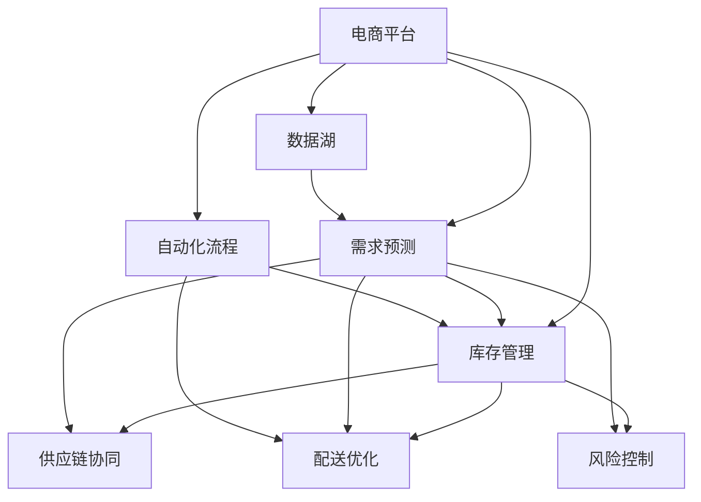

                 

# AI在电商平台供给链中的应用

## 1. 背景介绍

### 1.1 问题由来

随着电子商务的迅猛发展，电商平台在供给链管理上遇到了前所未有的挑战。传统的库存管理、配送优化、需求预测等环节中存在大量不确定性和复杂性，需要通过技术手段进行精细化管理。人工智能技术的引入，为电商平台供给链提供了全新的解决方案，极大提升了运营效率和用户体验。

### 1.2 问题核心关键点

AI在电商平台供给链中的应用主要体现在以下几个方面：

- **需求预测**：通过历史销售数据和市场趋势预测未来的需求，实现库存的精细化管理。
- **库存管理**：自动优化库存水平，实现零库存或低库存运营。
- **配送优化**：通过路径规划、交通状况预测、智能调度等技术提升配送效率。
- **供应链协同**：通过智能合约、区块链等技术促进供应链各环节的协同，减少信息不对称。
- **风险控制**：通过异常检测、信用评估等手段预防供应链中的欺诈行为和风险事件。

## 2. 核心概念与联系

### 2.1 核心概念概述

为更好地理解AI在电商平台供给链中的应用，本节将介绍几个密切相关的核心概念：

- **电商平台**：以互联网为平台，消费者、商家、供应商等角色通过网络进行商品交易、服务交互的商务平台。
- **需求预测**：根据历史销售数据、市场趋势、用户行为等，预测未来商品需求量。
- **库存管理**：通过对库存水平、补货策略等的优化，实现供应链的高效运转。
- **配送优化**：通过路径规划、车辆调度等技术，提高配送效率，降低配送成本。
- **供应链协同**：通过智能合约、区块链等技术，促进供应链各环节的协同，减少信息不对称。
- **风险控制**：通过异常检测、信用评估等手段，预防供应链中的欺诈行为和风险事件。
- **自动化流程**：通过RPA（机器人流程自动化）技术，实现业务流程的自动化，提升操作效率。
- **数据湖**：构建集中存储海量数据的数据仓库，为AI模型训练提供数据支撑。

这些核心概念之间的逻辑关系可以通过以下Mermaid流程图来展示：



这个流程图展示了一体化的电商平台供给链，从需求预测到库存管理，再到配送优化和供应链协同，每一环都通过AI技术进行了自动化和智能化处理。数据湖作为数据来源，为AI模型提供数据支撑，自动化流程则进一步提升了操作效率。

## 3. 核心算法原理 & 具体操作步骤
### 3.1 算法原理概述

AI在电商平台供给链中的应用，主要是通过构建一系列的AI模型和算法，对业务流程进行智能化改造。其核心思想是：利用AI模型预测和优化各个环节，提升效率，降低成本，增强用户体验。

### 3.2 算法步骤详解

**Step 1: 数据收集与预处理**

1. 收集电商平台的历史销售数据、用户行为数据、市场趋势数据等。
2. 清洗数据，处理缺失值、异常值，保证数据质量。
3. 将数据进行标准化和归一化处理，确保后续算法处理的一致性。

**Step 2: 模型训练与验证**

1. 选择适合的算法模型，如时间序列预测模型、线性回归、决策树、随机森林等。
2. 划分训练集和验证集，使用训练集对模型进行训练，使用验证集评估模型效果。
3. 调整模型参数，优化模型性能，如增加特征、调整正则化参数、增加迭代轮数等。

**Step 3: 模型应用与优化**

1. 将训练好的模型应用到实际业务流程中，如预测未来需求、优化库存水平、规划配送路径等。
2. 实时监控模型性能，使用A/B测试等方法不断优化模型效果。
3. 结合业务经验，对模型进行人工干预和调整，保证模型适应性。

**Step 4: 效果评估与反馈**

1. 对模型效果进行全面评估，如准确率、召回率、F1分数等。
2. 分析模型预测结果与实际业务数据之间的差异，发现模型缺陷。
3. 根据评估结果和业务反馈，调整模型参数，优化算法流程。

### 3.3 算法优缺点

AI在电商平台供给链中的应用具有以下优点：

- **高效性**：AI模型能够快速处理大量数据，提升决策效率。
- **精准性**：基于大量数据和复杂算法的预测结果，可以更准确地把握市场需求。
- **自适应性**：AI模型可以根据业务需求和数据变化进行自我学习和调整。

同时，该方法也存在一定的局限性：

- **数据依赖性强**：AI模型的效果高度依赖于数据质量和数据量，数据不足或数据偏差会影响模型效果。
- **算法复杂度高**：构建和优化AI模型需要较强的算法和数学背景，对技术要求高。
- **解释性不足**：AI模型通常缺乏可解释性，难以解释其内部工作机制和决策逻辑。
- **成本高**：构建和维护AI模型需要投入大量资源，包括数据、算法、计算等。

尽管存在这些局限性，但AI在电商平台供给链中的应用已经取得了显著的成效，成为推动电商运营智能化的重要手段。未来相关研究的重点在于如何进一步降低AI应用的成本，提升模型的解释性和鲁棒性，同时兼顾高效率和低成本的平衡。

### 3.4 算法应用领域

AI在电商平台供给链中的应用已经覆盖了诸多领域，包括但不限于：

- **需求预测**：基于历史销售数据和市场趋势，预测未来需求。
- **库存管理**：自动优化库存水平，实现零库存或低库存运营。
- **配送优化**：通过路径规划、交通状况预测、智能调度等技术提升配送效率。
- **供应链协同**：通过智能合约、区块链等技术促进供应链各环节的协同，减少信息不对称。
- **风险控制**：通过异常检测、信用评估等手段预防供应链中的欺诈行为和风险事件。
- **自动化流程**：通过RPA技术，实现业务流程的自动化，提升操作效率。
- **客户服务**：利用AI技术提升客户服务质量，如智能客服、情感分析等。
- **市场分析**：通过大数据分析和AI模型，进行市场趋势分析和用户行为分析。

这些应用领域展示了AI在电商平台供给链中的广泛潜力，相信随着技术的不断进步，AI将会在更多环节得到应用，推动电商运营的智能化升级。

## 4. 数学模型和公式 & 详细讲解 & 举例说明

### 4.1 数学模型构建

本节将使用数学语言对AI在电商平台供给链中的应用进行更加严格的刻画。

记需求预测模型为 $f(x_t)$，其中 $x_t$ 为时间 $t$ 的历史销售数据、市场趋势等特征。假设模型为线性回归模型，即：

$$
f(x_t) = \theta_0 + \sum_{i=1}^{n}\theta_ix_{ti}
$$

其中，$\theta$ 为模型参数，$n$ 为特征数量。需求预测的目标是最小化损失函数：

$$
\mathcal{L}(\theta) = \frac{1}{N}\sum_{i=1}^{N}(f(x_i) - y_i)^2
$$

其中 $y_i$ 为实际销售数据，$N$ 为样本数量。

### 4.2 公式推导过程

以线性回归模型为例，需求预测的梯度下降优化算法如下：

$$
\theta \leftarrow \theta - \alpha\nabla_{\theta}\mathcal{L}(\theta)
$$

其中，$\alpha$ 为学习率，$\nabla_{\theta}\mathcal{L}(\theta)$ 为损失函数对参数 $\theta$ 的梯度。

对于随机梯度下降（SGD）算法，梯度计算可以简化为：

$$
\nabla_{\theta}\mathcal{L}(\theta) = \frac{2}{N}\sum_{i=1}^{N}(f(x_i) - y_i)x_i
$$

在得到梯度后，带入参数更新公式：

$$
\theta \leftarrow \theta - \alpha \frac{2}{N}\sum_{i=1}^{N}(f(x_i) - y_i)x_i
$$

重复上述过程直至收敛，最终得到适应需求预测任务的最优模型参数 $\theta^*$。

### 4.3 案例分析与讲解

以某电商平台的需求预测为例，我们通过历史销售数据和市场趋势数据训练线性回归模型，预测未来一周的需求量。具体步骤如下：

1. 收集历史销售数据和市场趋势数据，如季节性因素、节假日、促销活动等。
2. 将数据进行预处理，去除缺失值和异常值，并进行归一化处理。
3. 使用训练集对线性回归模型进行训练，得到模型参数 $\theta$。
4. 使用验证集评估模型效果，通过交叉验证等方法优化模型参数。
5. 将训练好的模型应用到实时数据中，预测未来需求量，并根据预测结果进行库存和配送优化。

通过案例分析，可以看出，AI在电商平台供给链中的应用不仅仅是预测需求，更在于将预测结果应用于实际的业务流程优化，从而提升整体运营效率。

## 5. 项目实践：代码实例和详细解释说明
### 5.1 开发环境搭建

在进行AI在电商平台供给链中的应用实践前，我们需要准备好开发环境。以下是使用Python进行Pandas、NumPy、Scikit-Learn等库的开发环境配置流程：

1. 安装Anaconda：从官网下载并安装Anaconda，用于创建独立的Python环境。

2. 创建并激活虚拟环境：
```bash
conda create -n ai-env python=3.8 
conda activate ai-env
```

3. 安装必要的库：
```bash
conda install pandas numpy scikit-learn matplotlib seaborn tqdm jupyter notebook
```

4. 安装TensorFlow或PyTorch：
```bash
conda install tensorflow torch
```

5. 安装相关的第三方库：
```bash
pip install requests beautifulsoup4 tabulate sklearn
```

完成上述步骤后，即可在`ai-env`环境中开始项目实践。

### 5.2 源代码详细实现

这里我们以线性回归模型为例，给出使用Pandas、NumPy、Scikit-Learn库对需求预测模型进行实现的代码实现。

```python
import pandas as pd
import numpy as np
from sklearn.linear_model import LinearRegression
from sklearn.metrics import mean_squared_error, mean_absolute_error
from sklearn.model_selection import train_test_split

# 读取数据
df = pd.read_csv('sales_data.csv')

# 数据预处理
df.dropna(inplace=True)
df['date'] = pd.to_datetime(df['date'])
df['weekday'] = df['date'].dt.weekday
df['month'] = df['date'].dt.month
df['quarter'] = df['date'].dt.quarter
df['year'] = df['date'].dt.year

# 特征工程
features = ['price', 'weekday', 'month', 'quarter', 'year']
X = df[features]
y = df['sales']

# 数据划分
X_train, X_test, y_train, y_test = train_test_split(X, y, test_size=0.2, random_state=42)

# 模型训练
model = LinearRegression()
model.fit(X_train, y_train)

# 模型评估
y_pred = model.predict(X_test)
mse = mean_squared_error(y_test, y_pred)
mae = mean_absolute_error(y_test, y_pred)
print(f'Mean Squared Error: {mse:.2f}')
print(f'Mean Absolute Error: {mae:.2f}')

# 模型应用
future_sales = model.predict(X_future)
print(f'Predicted Sales: {future_sales}')
```

### 5.3 代码解读与分析

让我们再详细解读一下关键代码的实现细节：

**数据预处理**：
- 使用Pandas库对数据进行清洗，去除缺失值和异常值，并添加日期相关的特征。
- 使用特征工程技术，将日期数据分解为周、月、季度、年份等特征，以供模型学习。

**模型训练**：
- 使用Scikit-Learn库的LinearRegression模型进行线性回归训练。
- 通过train_test_split函数将数据划分为训练集和测试集。
- 在训练集上使用fit函数训练模型，得到模型参数。

**模型评估**：
- 在测试集上使用predict函数进行预测，并使用均方误差和平均绝对误差评估模型效果。
- 均方误差（MSE）和平均绝对误差（MAE）是常用的评估指标，用于衡量模型预测与真实值的差异。

**模型应用**：
- 使用训练好的模型对未来的销售数据进行预测，得到预测结果。
- 预测结果可用于库存管理和配送优化等业务流程中。

可以看到，Pandas、NumPy、Scikit-Learn等库的结合使用，使得需求预测模型的实现变得简洁高效。开发者可以将更多精力放在数据处理、模型改进等高层逻辑上，而不必过多关注底层的实现细节。

当然，工业级的系统实现还需考虑更多因素，如模型的保存和部署、超参数的自动搜索、更灵活的任务适配层等。但核心的AI应用流程基本与此类似。

## 6. 实际应用场景
### 6.1 智能库存管理

AI在智能库存管理中的应用，可以通过需求预测模型实现库存的精细化管理。通过实时获取市场需求数据，预测未来的销售趋势，动态调整库存水平，实现零库存或低库存运营。具体实现流程如下：

1. 收集电商平台的历史销售数据、用户行为数据、市场趋势数据等。
2. 使用时间序列预测模型对未来需求进行预测，如线性回归、ARIMA等。
3. 根据预测结果，自动调整库存水平，减少仓储成本。
4. 实时监控库存状态，使用A/B测试等方法不断优化模型效果。

通过AI在库存管理中的应用，电商平台可以大幅降低库存成本，提升运营效率。

### 6.2 智能配送优化

AI在智能配送优化中的应用，可以通过路径规划、交通状况预测等技术提升配送效率。具体实现流程如下：

1. 收集配送路径、交通状况、天气数据等。
2. 使用路径规划算法（如Dijkstra、A*等）对配送路径进行优化。
3. 引入交通状况预测模型，如深度学习模型，预测交通拥堵情况。
4. 根据预测结果，实时调整配送路径，优化配送顺序。

通过AI在配送优化中的应用，电商平台可以显著提升配送效率，降低配送成本，提升客户满意度。

### 6.3 供应链协同

AI在供应链协同中的应用，可以通过智能合约、区块链等技术促进供应链各环节的协同，减少信息不对称。具体实现流程如下：

1. 收集供应链各环节的业务数据，如订单信息、库存信息、物流信息等。
2. 使用智能合约技术，自动执行订单处理、货物交付等业务流程。
3. 引入区块链技术，确保数据的安全性和不可篡改性。
4. 实时监控供应链状态，使用A/B测试等方法不断优化协同流程。

通过AI在供应链协同中的应用，电商平台可以大幅提升供应链的透明度和效率，降低供应链成本，增强供应链的稳定性。

### 6.4 未来应用展望

随着AI技术的不断进步，电商平台供给链中的应用将更加广泛和深入。未来，AI将会在以下几个方面取得新的突破：

- **多模态融合**：将文本、图像、视频等多模态信息进行融合，提升AI模型的感知能力和决策能力。
- **联邦学习**：在保护数据隐私的前提下，通过联邦学习技术实现跨平台数据共享和模型优化。
- **自适应学习**：引入自适应学习算法，使得模型能够动态适应新的业务需求和数据变化。
- **边缘计算**：将AI模型部署到边缘设备上，提升实时处理能力，降低延迟。
- **自动化决策**：通过AI自动化决策系统，实时监控供应链状态，自动进行业务调整和优化。

这些技术趋势将进一步推动AI在电商平台供给链中的应用，提升运营效率，增强用户体验，为电商平台的智能化升级提供有力支持。

## 7. 工具和资源推荐
### 7.1 学习资源推荐

为了帮助开发者系统掌握AI在电商平台供给链中的应用，这里推荐一些优质的学习资源：

1. 《Python数据科学手册》系列书籍：全面介绍了Python在数据分析、机器学习中的应用，包括需求预测、库存管理等电商相关内容。
2. CS229《机器学习》课程：斯坦福大学开设的经典机器学习课程，涵盖了各种机器学习算法和实践案例。
3. TensorFlow官方文档：TensorFlow的官方文档，提供了丰富的算法模型和开发教程，助力深度学习模型的构建。
4. Kaggle数据科学竞赛平台：世界领先的数据科学竞赛平台，提供了大量电商相关数据集和竞赛任务，用于实战练习。
5. Coursera《深度学习与神经网络》课程：由Andrew Ng教授主讲，全面介绍了深度学习模型的原理和应用，包括在电商平台中的应用。

通过对这些资源的学习实践，相信你一定能够快速掌握AI在电商平台供给链中的应用精髓，并用于解决实际的电商运营问题。

### 7.2 开发工具推荐

高效的开发离不开优秀的工具支持。以下是几款用于AI在电商平台供给链中应用的开发工具：

1. Jupyter Notebook：基于Python的交互式开发环境，支持代码编写、数据可视化、模型评估等。
2. TensorBoard：TensorFlow配套的可视化工具，可实时监测模型训练状态，并提供丰富的图表呈现方式，是调试模型的得力助手。
3. PyCharm：功能强大的Python开发工具，支持数据科学、机器学习、深度学习等多个领域的开发。
4. Scikit-Learn：Python的机器学习库，提供了丰富的算法模型和数据处理工具，适用于需求预测、库存管理等任务。
5. Keras：Python的高层次深度学习库，提供了便捷的模型构建接口，适用于神经网络模型的开发。

合理利用这些工具，可以显著提升AI在电商平台供给链中的应用开发效率，加快创新迭代的步伐。

### 7.3 相关论文推荐

AI在电商平台供给链中的应用源于学界的持续研究。以下是几篇奠基性的相关论文，推荐阅读：

1. Time Series Forecasting with Deep Learning Models：展示了深度学习模型在时间序列预测中的应用，如LSTM、GRU等。
2. Optimizing Inventory Management with Artificial Intelligence：介绍了AI在库存管理中的应用，如需求预测、自动补货等。
3. AI in Logistics and Supply Chain Management：综述了AI在供应链管理中的应用，包括路径规划、配送优化、风险控制等。
4. An Overview of Machine Learning Approaches for Inventory Management：介绍了多种机器学习算法在库存管理中的应用，如决策树、随机森林等。
5. Blockchain Technology in Supply Chain Management：介绍了区块链技术在供应链管理中的应用，如智能合约、数据安全等。

这些论文代表了大规模AI在电商平台供给链中的应用趋势，通过学习这些前沿成果，可以帮助研究者把握学科前进方向，激发更多的创新灵感。

## 8. 总结：未来发展趋势与挑战
### 8.1 总结

本文对AI在电商平台供给链中的应用进行了全面系统的介绍。首先阐述了AI在电商供给链中的重要性，明确了AI在需求预测、库存管理、配送优化等方面的应用价值。其次，从原理到实践，详细讲解了需求预测模型的数学原理和关键步骤，给出了模型应用的完整代码实例。同时，本文还广泛探讨了AI在电商供给链中的实际应用场景，展示了AI的广泛潜力。

通过本文的系统梳理，可以看出，AI在电商平台供给链中的应用已经成为电商运营智能化升级的重要驱动力，极大提升了运营效率和用户体验。未来，随着AI技术的不断进步，AI将会在更多环节得到应用，推动电商运营的智能化升级。

### 8.2 未来发展趋势

展望未来，AI在电商平台供给链中的应用将呈现以下几个发展趋势：

1. **多模态融合**：将文本、图像、视频等多模态信息进行融合，提升AI模型的感知能力和决策能力。
2. **联邦学习**：在保护数据隐私的前提下，通过联邦学习技术实现跨平台数据共享和模型优化。
3. **自适应学习**：引入自适应学习算法，使得模型能够动态适应新的业务需求和数据变化。
4. **边缘计算**：将AI模型部署到边缘设备上，提升实时处理能力，降低延迟。
5. **自动化决策**：通过AI自动化决策系统，实时监控供应链状态，自动进行业务调整和优化。

这些趋势凸显了AI在电商平台供给链中的应用前景。这些方向的探索发展，必将进一步提升电商运营的智能化水平，为电商平台的智能化升级提供有力支持。

### 8.3 面临的挑战

尽管AI在电商平台供给链中的应用已经取得了显著的成效，但在迈向更加智能化、普适化应用的过程中，它仍面临着诸多挑战：

1. **数据依赖性强**：AI模型的效果高度依赖于数据质量和数据量，数据不足或数据偏差会影响模型效果。
2. **算法复杂度高**：构建和优化AI模型需要较强的算法和数学背景，对技术要求高。
3. **解释性不足**：AI模型通常缺乏可解释性，难以解释其内部工作机制和决策逻辑。
4. **成本高**：构建和维护AI模型需要投入大量资源，包括数据、算法、计算等。
5. **隐私和安全问题**：电商平台的业务数据涉及用户隐私和商业机密，如何在保护隐私的前提下进行AI应用，是亟待解决的问题。
6. **实时性要求高**：电商平台的业务流程要求实时响应，AI模型需要具备高效的实时处理能力。

尽管存在这些挑战，但AI在电商平台供给链中的应用已经取得了显著的成效，成为推动电商运营智能化升级的重要手段。未来相关研究的重点在于如何进一步降低AI应用的成本，提升模型的解释性和鲁棒性，同时兼顾高效率和低成本的平衡。

### 8.4 研究展望

面对AI在电商平台供给链中所面临的种种挑战，未来的研究需要在以下几个方面寻求新的突破：

1. **多模态融合**：将文本、图像、视频等多模态信息进行融合，提升AI模型的感知能力和决策能力。
2. **联邦学习**：在保护数据隐私的前提下，通过联邦学习技术实现跨平台数据共享和模型优化。
3. **自适应学习**：引入自适应学习算法，使得模型能够动态适应新的业务需求和数据变化。
4. **边缘计算**：将AI模型部署到边缘设备上，提升实时处理能力，降低延迟。
5. **自动化决策**：通过AI自动化决策系统，实时监控供应链状态，自动进行业务调整和优化。
6. **隐私保护**：在保护用户隐私和商业机密的前提下，探索数据隐私保护技术，确保AI应用的合法性和安全性。

这些研究方向将进一步推动AI在电商平台供给链中的应用，提升电商运营的智能化水平，增强用户体验，为电商平台的智能化升级提供有力支持。

## 9. 附录：常见问题与解答

**Q1：AI在电商平台供给链中的应用是否适用于所有电商场景？**

A: AI在电商平台供给链中的应用在大多数电商场景中都适用。但由于不同电商平台的业务特性和数据量差异较大，具体应用效果和模型选择需要根据实际情况进行优化和调整。

**Q2：AI在需求预测中的效果如何？**

A: AI在需求预测中的应用效果显著。通过历史销售数据和市场趋势数据训练模型，能够准确预测未来需求，帮助电商平台进行库存和配送优化。但模型效果高度依赖于数据质量和数据量，需要不断优化和调整。

**Q3：AI在库存管理中的应用有哪些？**

A: AI在库存管理中的应用包括需求预测、自动补货、库存预警等。通过需求预测模型，动态调整库存水平，实现零库存或低库存运营。同时，AI还可以通过库存预警系统，实时监控库存状态，自动调整补货策略。

**Q4：AI在配送优化中的应用有哪些？**

A: AI在配送优化中的应用包括路径规划、交通状况预测、智能调度等。通过路径规划算法和交通状况预测模型，实时调整配送路径和配送顺序，提升配送效率。

**Q5：AI在供应链协同中的应用有哪些？**

A: AI在供应链协同中的应用包括智能合约、区块链等技术。通过智能合约技术，自动执行订单处理、货物交付等业务流程。引入区块链技术，确保数据的安全性和不可篡改性。

通过以上问题的回答，可以看出AI在电商平台供给链中的应用已经得到了广泛应用，并在多个环节取得了显著效果。未来，随着AI技术的不断进步，AI将会在更多环节得到应用，推动电商运营的智能化升级。

---

作者：禅与计算机程序设计艺术 / Zen and the Art of Computer Programming

