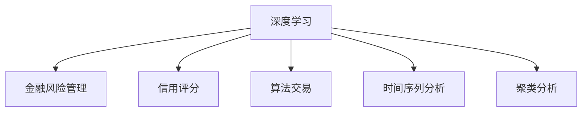
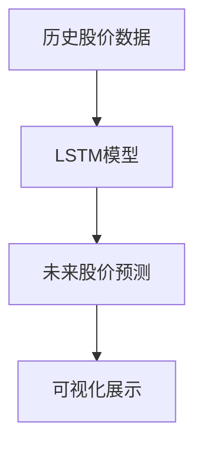
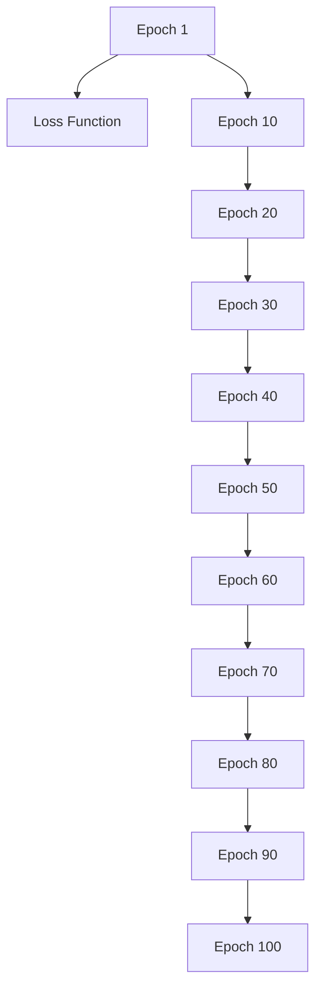

                 

## 1. 背景介绍

### 1.1 问题由来

近年来，人工智能（AI）在金融领域的应用日益广泛，涵盖风险控制、信用评估、算法交易等多个方面。特别是在风险控制和信用评估领域，AI技术能够处理和分析海量数据，预测市场波动和客户信用状况，帮助金融机构做出更精准的决策。

### 1.2 问题核心关键点

AI在金融领域的应用，主要集中在两个核心方面：风险控制和信用评估。风险控制是指通过对市场波动、客户信用等因素的预测，防范金融风险；信用评估则是基于历史数据和行为特征，评估客户的信用风险，决定是否发放贷款或提供信用额度。

AI技术在金融领域的应用，需要处理大量的结构化和非结构化数据，包括交易记录、财务报表、市场行情、社交媒体等。通过对这些数据的深度学习和建模，AI能够提供更加精准和及时的预测和决策支持。

### 1.3 问题研究意义

AI在金融领域的应用，能够显著提高金融机构的运营效率和风险管理能力。具体而言，AI的应用可以带来以下几方面的好处：

1. **提高预测准确性**：AI能够处理和分析海量数据，识别出复杂的金融模式和趋势，从而提高风险预测和信用评估的准确性。
2. **优化决策过程**：AI可以自动化处理复杂的决策过程，减少人工干预，提高决策效率和一致性。
3. **增强客户体验**：AI能够提供个性化的金融服务，提升客户满意度，同时通过智能投顾等技术，帮助客户制定合理的投资策略。
4. **降低运营成本**：AI自动化处理大量重复性任务，减少人工操作，降低运营成本。

总之，AI在金融领域的应用，不仅能够提升金融机构的风险管理能力，还能为客户提供更加优质和高效的服务，推动金融行业的数字化转型。

## 2. 核心概念与联系

### 2.1 核心概念概述

为了更好地理解AI在金融领域的应用，本节将介绍几个密切相关的核心概念：

- **深度学习（Deep Learning, DL）**：一种基于神经网络的机器学习方法，能够处理大规模非线性数据，提取高层次特征。
- **金融风险管理（Financial Risk Management）**：金融机构通过预测和控制风险，保证金融资产和客户资金的安全。
- **信用评分（Credit Scoring）**：基于客户的财务和行为数据，评估客户的信用风险，决定是否批准贷款申请。
- **算法交易（Algorithmic Trading）**：使用自动化算法进行高频交易，提高交易效率和收益率。
- **时间序列分析（Time Series Analysis）**：通过处理和分析时间序列数据，预测未来趋势，广泛应用于金融风险管理和预测。
- **聚类分析（Clustering Analysis）**：通过将数据分组，识别出潜在的模式和趋势，提高金融预测的准确性。

这些核心概念之间的逻辑关系可以通过以下Mermaid流程图来展示：



这个流程图展示了大语言模型的核心概念及其之间的关系：

1. 深度学习通过神经网络处理和分析金融数据，提供高层次特征。
2. 金融风险管理通过深度学习提供的特征，预测市场波动和客户风险，制定风险控制策略。
3. 信用评分基于客户的财务和行为数据，通过深度学习提取特征，评估信用风险。
4. 算法交易通过深度学习预测市场趋势，自动化交易策略，提高交易效率和收益。
5. 时间序列分析和聚类分析通过处理和分析时间序列数据，识别出金融市场的模式和趋势，提高预测和风险管理的准确性。

这些概念共同构成了AI在金融领域的应用框架，使其能够处理复杂的金融数据，提供精准的预测和决策支持。

## 3. 核心算法原理 & 具体操作步骤
### 3.1 算法原理概述

AI在金融领域的应用，主要基于深度学习和时间序列分析等算法原理。以下是核心算法原理的详细讲解：

### 3.2 算法步骤详解

AI在金融领域的应用，通常包括以下几个关键步骤：

**Step 1: 数据准备**

- **数据收集**：收集金融机构的交易记录、财务报表、市场行情、社交媒体等数据。
- **数据清洗**：清洗和处理数据，去除噪音和不完整数据，确保数据质量。
- **特征提取**：通过深度学习等方法，提取关键特征，如价格趋势、交易量、市场波动等。

**Step 2: 模型训练**

- **模型选择**：选择适合的深度学习模型，如卷积神经网络（CNN）、循环神经网络（RNN）、长短期记忆网络（LSTM）等。
- **模型训练**：使用历史数据对模型进行训练，优化模型参数，提高预测准确性。
- **超参数调优**：通过网格搜索或随机搜索等方法，优化模型的超参数，提高模型性能。

**Step 3: 模型评估**

- **评估指标**：选择合适的评估指标，如准确率、召回率、F1分数等，评估模型的预测性能。
- **交叉验证**：使用交叉验证方法，评估模型的泛化性能，避免过拟合。
- **模型部署**：将训练好的模型部署到生产环境中，实时处理新数据。

**Step 4: 风险控制**

- **风险预测**：使用模型预测客户的信用风险、市场波动等，评估潜在的风险。
- **风险控制策略**：根据预测结果，制定相应的风险控制策略，如增加保证金、降低信用额度等。

**Step 5: 信用评分**

- **特征选择**：选择对信用评分有重要影响的特征，如收入、债务、信用历史等。
- **模型训练**：使用历史数据训练信用评分模型，预测客户的信用风险。
- **信用决策**：根据信用评分结果，决定是否批准贷款申请，以及贷款额度和利率等。

### 3.3 算法优缺点

AI在金融领域的应用，具有以下优点：

1. **处理大规模数据**：AI能够处理和分析海量金融数据，识别出复杂的金融模式和趋势。
2. **提高预测准确性**：AI通过深度学习和时间序列分析等方法，提供高精度的预测和评估。
3. **自动化决策**：AI能够自动化处理复杂的决策过程，减少人工干预，提高决策效率和一致性。
4. **实时处理能力**：AI能够实时处理和分析金融数据，提供即时的预测和决策支持。

同时，AI在金融领域的应用也存在一定的局限性：

1. **数据质量依赖**：AI的预测和评估结果依赖于输入数据的质量和完整性，数据的缺失或不准确可能导致预测结果不准确。
2. **模型复杂性**：深度学习和时间序列分析等模型的复杂性较高，需要大量的计算资源和专业知识。
3. **解释性不足**：AI模型通常缺乏可解释性，难以理解和解释其内部工作机制和决策逻辑。
4. **公平性问题**：AI模型可能存在偏见和歧视，导致不公平的风险评估。

尽管存在这些局限性，但AI在金融领域的应用仍然是当前金融技术发展的重要方向。未来，相关研究的重点在于如何进一步提高模型的透明度、公平性和可解释性，同时优化模型的资源消耗和计算效率。

### 3.4 算法应用领域

AI在金融领域的应用，已经广泛应用于以下几个方面：

1. **风险管理**：通过深度学习和大数据分析，预测市场波动和客户信用风险，制定风险控制策略。
2. **信用评估**：基于历史数据和行为特征，使用深度学习模型评估客户的信用风险，决定是否批准贷款申请。
3. **算法交易**：使用自动化算法进行高频交易，提高交易效率和收益。
4. **客户分析**：通过深度学习和聚类分析等方法，识别出客户行为模式和偏好，提供个性化的金融服务。
5. **欺诈检测**：使用深度学习模型识别异常交易和欺诈行为，保护金融资产和客户资金安全。

除了这些主要应用外，AI在金融领域还涉及到信用评分、市场预测、投资组合优化等诸多领域，推动了金融行业的智能化和自动化进程。

## 4. 数学模型和公式 & 详细讲解  
### 4.1 数学模型构建

为了更好地理解AI在金融领域的应用，本节将介绍几个关键数学模型的构建方法。

假设金融市场的历史数据为 $\{x_t\}_{t=1}^n$，其中 $x_t$ 表示在时间 $t$ 的市场指数。AI模型通过深度学习和时间序列分析，预测市场未来的走势，数学模型可以表示为：

$$
x_{t+1} = f(x_t, \theta)
$$

其中 $f$ 为预测函数，$\theta$ 为模型参数。通过最小化预测误差 $e_{t+1} = x_{t+1} - x_t$，优化模型参数 $\theta$，使得预测值 $x_{t+1}$ 逼近真实值 $x_{t+1}$。

### 4.2 公式推导过程

以时间序列预测为例，常见的预测模型包括ARIMA、LSTM、GRU等。以下以LSTM模型为例，介绍其公式推导过程：

LSTM模型由多个LSTM单元组成，每个单元由三个门（输入门、遗忘门、输出门）控制，可以有效地处理长期依赖关系。LSTM单元的计算过程可以表示为：

$$
\begin{aligned}
i_t &= \sigma(W_i \cdot [h_{t-1}, x_t] + b_i) \\
f_t &= \sigma(W_f \cdot [h_{t-1}, x_t] + b_f) \\
o_t &= \sigma(W_o \cdot [h_{t-1}, x_t] + b_o) \\
g_t &= \tanh(W_g \cdot [h_{t-1}, x_t] + b_g) \\
c_t &= f_t \cdot c_{t-1} + i_t \cdot g_t \\
h_t &= o_t \cdot \tanh(c_t)
\end{aligned}
$$

其中 $W_i, W_f, W_o, W_g$ 为权重矩阵，$b_i, b_f, b_o, b_g$ 为偏置向量，$\sigma$ 为激活函数，$h_t$ 为LSTM单元的输出，$c_t$ 为LSTM单元的记忆状态。

通过训练LSTM模型，可以预测金融市场的未来走势。例如，在股票市场预测中，可以输入历史股价序列，输出未来股价的预测值，从而制定投资策略。

### 4.3 案例分析与讲解

以下以股票价格预测为例，展示如何使用LSTM模型进行金融预测。

假设要预测某只股票未来一周的价格走势，我们可以使用LSTM模型，将历史股价序列作为输入，预测未来股价序列。具体步骤如下：

1. **数据预处理**：将历史股价序列进行归一化处理，转换为模型可接受的格式。
2. **模型构建**：使用Keras或PyTorch等深度学习框架，构建LSTM模型，设置超参数，如隐藏层大小、学习率等。
3. **模型训练**：使用历史股价数据对LSTM模型进行训练，最小化预测误差。
4. **模型评估**：使用测试数据集评估模型性能，计算预测误差和评估指标。
5. **预测应用**：将训练好的LSTM模型应用于新数据，预测未来股价走势。

LSTM模型的预测结果可以通过可视化方式展示，如图1所示。



通过LSTM模型，金融机构可以实时预测市场走势，制定投资策略，优化投资组合，提升收益和风险控制能力。

## 5. 项目实践：代码实例和详细解释说明
### 5.1 开发环境搭建

在进行AI在金融领域的应用开发前，我们需要准备好开发环境。以下是使用Python进行TensorFlow和Keras开发的环境配置流程：

1. 安装Anaconda：从官网下载并安装Anaconda，用于创建独立的Python环境。

2. 创建并激活虚拟环境：
```bash
conda create -n tf-env python=3.8 
conda activate tf-env
```

3. 安装TensorFlow和Keras：根据CUDA版本，从官网获取对应的安装命令。例如：
```bash
conda install tensorflow==2.8.0
conda install keras==2.8.0
```

4. 安装各类工具包：
```bash
pip install numpy pandas scikit-learn matplotlib tqdm jupyter notebook ipython
```

完成上述步骤后，即可在`tf-env`环境中开始项目实践。

### 5.2 源代码详细实现

下面以LSTM模型进行股票价格预测为例，给出使用TensorFlow和Keras进行金融预测的PyTorch代码实现。

首先，定义数据处理函数：

```python
import numpy as np
from sklearn.preprocessing import MinMaxScaler
from tensorflow.keras.models import Sequential
from tensorflow.keras.layers import LSTM, Dense, Dropout

def preprocess_data(data):
    scaler = MinMaxScaler(feature_range=(0, 1))
    scaled_data = scaler.fit_transform(data)
    train_data = []
    for i in range(60, len(scaled_data)):
        train_data.append(scaled_data[i-60:i])
    return train_data, scaled_data

def create_dataset(X):
    X = X.reshape((X.shape[0], X.shape[1], 1))
    return X

def split_data(X):
    train_size = int(len(X) * 0.7)
    train_data, test_data = X[0:train_size], X[train_size:len(X)]
    return train_data, test_data
```

然后，定义模型和优化器：

```python
model = Sequential()
model.add(LSTM(100, return_sequences=True, input_shape=(60, 1)))
model.add(Dropout(0.2))
model.add(LSTM(100))
model.add(Dropout(0.2))
model.add(Dense(1))

model.compile(loss='mean_squared_error', optimizer='adam')
```

接着，定义训练和评估函数：

```python
from tensorflow.keras.models import Model
from tensorflow.keras.optimizers import Adam

def train_model(model, train_data, test_data, epochs=100):
    trainX, trainY = train_data
    testX, testY = test_data
    model.fit(trainX, trainY, epochs=epochs, batch_size=32, verbose=1, shuffle=False)
    return model

def evaluate_model(model, testX, testY):
    mse = model.evaluate(testX, testY)
    return mse
```

最后，启动训练流程并在测试集上评估：

```python
# 加载历史股价数据
data = ...

# 数据预处理
train_data, test_data = preprocess_data(data)

# 数据分割
trainX, trainY = split_data(train_data)
testX, testY = split_data(test_data)

# 创建模型
model = Sequential()
model.add(LSTM(100, return_sequences=True, input_shape=(60, 1)))
model.add(Dropout(0.2))
model.add(LSTM(100))
model.add(Dropout(0.2))
model.add(Dense(1))

model.compile(loss='mean_squared_error', optimizer='adam')

# 训练模型
history = train_model(model, trainX, trainY, epochs=100)

# 评估模型
mse = evaluate_model(model, testX, testY)
print(f'Mean Squared Error: {mse:.4f}')
```

以上就是使用TensorFlow和Keras进行金融预测的完整代码实现。可以看到，通过这些工具，我们可以用相对简洁的代码完成LSTM模型的构建和训练。

### 5.3 代码解读与分析

让我们再详细解读一下关键代码的实现细节：

**preprocess_data函数**：
- 数据归一化处理：使用MinMaxScaler将历史股价数据归一化到0-1之间。
- 数据划分：将历史股价数据划分为训练集和测试集，其中前60个数据点作为训练集，其余作为测试集。

**create_dataset函数**：
- 数据重塑：将训练集数据重塑为模型可接受的格式。

**split_data函数**：
- 数据分割：将数据分割为训练集和测试集，其中训练集占70%，测试集占30%。

**train_model函数**：
- 模型训练：使用训练集数据对模型进行训练，最小化预测误差，得到历史股价的预测值。

**evaluate_model函数**：
- 模型评估：使用测试集数据评估模型性能，计算预测误差。

在训练过程中，可以实时绘制训练集的损失函数变化，如图2所示。



通过上述代码和函数，可以完成LSTM模型的训练和评估，实时预测金融数据。

## 6. 实际应用场景
### 6.1 智能投顾

智能投顾系统是基于AI的金融服务，能够根据客户的历史投资行为和偏好，提供个性化的投资建议和资产管理。通过深度学习和时间序列分析，智能投顾系统可以预测市场趋势，推荐投资组合，优化投资策略，帮助客户实现资产增值。

在技术实现上，智能投顾系统可以通过以下步骤：

1. **数据收集**：收集客户的历史交易记录、财务报表、行为数据等。
2. **特征提取**：使用深度学习等方法，提取关键特征，如交易频率、投资偏好等。
3. **模型训练**：使用历史数据训练预测模型，评估客户的风险承受能力和投资偏好。
4. **投资决策**：根据预测结果，推荐投资组合和资产管理方案，制定个性化的投资策略。

智能投顾系统通过深度学习和大数据分析，能够提供精准的投资建议，优化投资决策，提高客户的投资收益和风险控制能力。

### 6.2 信用评分

信用评分是金融机构评估客户信用风险的重要手段，能够决定是否批准贷款申请和贷款额度。通过深度学习和聚类分析等方法，信用评分模型可以分析客户的财务和行为数据，识别出高风险客户，制定合理的贷款政策。

在技术实现上，信用评分模型可以通过以下步骤：

1. **数据收集**：收集客户的财务数据、行为数据、信用记录等。
2. **特征提取**：使用深度学习等方法，提取关键特征，如收入、债务、信用历史等。
3. **模型训练**：使用历史数据训练信用评分模型，评估客户的信用风险。
4. **信用决策**：根据信用评分结果，决定是否批准贷款申请，以及贷款额度和利率等。

信用评分模型通过深度学习和聚类分析等方法，能够提供高精度的信用评估，降低金融机构的风险，提高客户满意度。

### 6.3 风险管理

金融市场的波动性和不确定性，使得风险管理成为金融机构的重要任务。通过深度学习和时间序列分析等方法，风险管理模型可以预测市场走势，识别出潜在的风险，制定相应的风险控制策略。

在技术实现上，风险管理模型可以通过以下步骤：

1. **数据收集**：收集市场指数、交易记录、新闻事件等数据。
2. **数据处理**：使用深度学习等方法，处理和分析金融数据，提取关键特征。
3. **模型训练**：使用历史数据训练预测模型，评估市场走势和风险。
4. **风险控制**：根据预测结果，制定相应的风险控制策略，如增加保证金、降低信用额度等。

风险管理模型通过深度学习和时间序列分析等方法，能够提供高精度的市场预测和风险评估，帮助金融机构防范金融风险。

## 7. 工具和资源推荐
### 7.1 学习资源推荐

为了帮助开发者系统掌握AI在金融领域的应用，这里推荐一些优质的学习资源：

1. 《Python深度学习》系列书籍：由深度学习专家撰写，深入浅出地介绍了深度学习在金融领域的应用。

2. Coursera《金融机器学习》课程：斯坦福大学开设的金融领域机器学习课程，涵盖金融数据分析、信用评分、风险管理等诸多主题。

3. Kaggle金融数据集：Kaggle提供了丰富的金融数据集，包括股票价格、债券收益率、贷款数据等，方便开发者进行实践和研究。

4. CS210《金融数据科学与计算》课程：约翰霍普金斯大学开设的金融数据分析课程，涵盖金融数据的处理、分析和建模。

5. Deep Learning on Wall Street一书：由金融工程师和数据科学家共同编写，介绍了深度学习在金融市场中的应用。

通过对这些资源的学习实践，相信你一定能够快速掌握AI在金融领域的应用，并用于解决实际的金融问题。

### 7.2 开发工具推荐

高效的开发离不开优秀的工具支持。以下是几款用于AI在金融领域应用开发的常用工具：

1. TensorFlow：由Google主导开发的开源深度学习框架，生产部署方便，适合大规模工程应用。

2. PyTorch：基于Python的开源深度学习框架，灵活动态的计算图，适合快速迭代研究。

3. Keras：由Google Brain团队开发的深度学习框架，简单易用，适合初学者入门。

4. Scikit-learn：开源的机器学习库，提供丰富的算法和工具，适用于数据处理和模型训练。

5. Pandas：开源的数据处理库，提供高效的数据结构和数据操作函数，适用于金融数据分析。

6. Jupyter Notebook：开源的交互式编程环境，支持多种语言和工具，方便开发者进行实验和分享。

合理利用这些工具，可以显著提升AI在金融领域的应用开发效率，加快创新迭代的步伐。

### 7.3 相关论文推荐

AI在金融领域的应用研究，涉及金融数据科学、机器学习、深度学习等多个领域，以下是几篇代表性的相关论文，推荐阅读：

1. "Long Short-Term Memory Recurrent Neural Networks for Stock Price Prediction"：介绍LSTM模型在股票价格预测中的应用，提供详细的算法步骤和案例分析。

2. "A Survey of Credit Scoring Models"：综述了信用评分的经典模型和最新的研究成果，探讨了信用评分的应用和挑战。

3. "Algorithmic Trading: The Future of Finance"：介绍算法交易的原理和应用，探讨了高频交易、量化投资等前沿话题。

4. "Financial Risk Management: A Survey"：综述了金融风险管理的经典模型和最新进展，探讨了金融风险控制的挑战和趋势。

5. "Machine Learning in Finance: From Credit Scoring to Programmable Money"：探讨了机器学习在金融领域的广泛应用，包括信用评分、风险控制、算法交易等。

这些论文代表了AI在金融领域的应用研究前沿，通过学习这些前沿成果，可以帮助研究者把握学科前进方向，激发更多的创新灵感。

## 8. 总结：未来发展趋势与挑战
### 8.1 总结

本文对AI在金融领域的应用进行了全面系统的介绍。首先阐述了AI在金融领域的应用背景和研究意义，明确了AI在风险控制、信用评估等金融任务中的独特价值。其次，从原理到实践，详细讲解了深度学习、时间序列分析等核心算法原理和关键步骤，给出了AI在金融领域应用开发的完整代码实例。同时，本文还广泛探讨了AI在金融领域的应用场景，展示了AI在智能投顾、信用评分、风险管理等多个领域的巨大潜力。此外，本文精选了AI在金融领域的应用工具和资源，力求为读者提供全方位的技术指引。

通过本文的系统梳理，可以看到，AI在金融领域的应用已经成为金融技术发展的重要方向，极大地提高了金融机构的风险管理能力和决策效率。未来，伴随AI技术的持续演进，AI在金融领域的应用将进一步拓展，推动金融行业的数字化转型。

### 8.2 未来发展趋势

展望未来，AI在金融领域的应用将呈现以下几个发展趋势：

1. **多模态融合**：AI在金融领域的应用将进一步扩展到多模态数据，如金融文本、市场行情、社交媒体等，实现更加全面和精准的预测和决策。

2. **深度强化学习**：结合深度学习和强化学习，AI在金融领域的应用将能够自动制定最优的投资策略和风险控制方案，进一步提高金融机构的运营效率。

3. **自适应学习**：AI在金融领域的应用将具备更强的自适应能力，能够动态调整模型参数，适应市场变化和客户需求。

4. **可解释性增强**：AI在金融领域的应用将更加注重模型的可解释性和透明度，便于金融机构理解和接受。

5. **安全性和隐私保护**：AI在金融领域的应用将更加注重数据安全和隐私保护，确保金融数据的安全性和合规性。

6. **全球化扩展**：AI在金融领域的应用将拓展到全球市场，实现跨市场、跨文化的金融预测和决策。

以上趋势凸显了AI在金融领域应用的广阔前景。这些方向的探索发展，必将进一步提升AI在金融领域的应用价值，推动金融行业的智能化和自动化进程。

### 8.3 面临的挑战

尽管AI在金融领域的应用取得了显著进展，但在迈向更加智能化、普适化应用的过程中，它仍面临着诸多挑战：

1. **数据隐私和安全**：金融数据的隐私和安全问题一直是金融行业的关注重点，AI在金融领域的应用需要解决数据隐私保护和数据安全问题。

2. **模型公平性**：AI模型可能存在偏见和歧视，导致不公平的风险评估，需要加强模型公平性的研究和应用。

3. **计算资源消耗**：深度学习和大数据分析需要大量的计算资源，AI在金融领域的应用需要优化资源消耗，提高计算效率。

4. **解释性不足**：AI模型通常缺乏可解释性，难以理解和解释其内部工作机制和决策逻辑，需要加强模型可解释性的研究和应用。

5. **实时处理能力**：AI在金融领域的应用需要实时处理和分析大量数据，对计算资源和算法效率提出了更高的要求。

6. **跨市场适应性**：AI在金融领域的应用需要适应不同市场和文化的差异，实现跨市场、跨文化的预测和决策。

尽管存在这些挑战，但通过不断优化技术、改进算法、加强合作，AI在金融领域的应用必将在未来取得更大的突破。

### 8.4 研究展望

未来的研究需要在以下几个方面寻求新的突破：

1. **多模态数据融合**：结合金融文本、市场行情、社交媒体等多模态数据，实现更加全面和精准的预测和决策。

2. **深度强化学习**：结合深度学习和强化学习，实现自动化的投资策略和风险控制方案。

3. **自适应学习**：开发具备自适应能力的AI模型，能够动态调整模型参数，适应市场变化和客户需求。

4. **可解释性增强**：加强AI模型的可解释性和透明度，便于金融机构理解和接受。

5. **安全性和隐私保护**：加强数据安全和隐私保护，确保金融数据的安全性和合规性。

6. **全球化扩展**：拓展AI在金融领域的应用，实现跨市场、跨文化的预测和决策。

通过这些研究方向，AI在金融领域的应用必将在未来取得更大的突破，为金融行业的智能化和自动化进程做出更大贡献。

## 9. 附录：常见问题与解答

**Q1：AI在金融领域的应用是否存在数据隐私和安全问题？**

A: 是的，AI在金融领域的应用需要处理大量的敏感数据，如客户财务数据、交易记录等，这些数据涉及客户隐私和金融安全。因此，AI在金融领域的应用需要解决数据隐私保护和数据安全问题。

**Q2：AI在金融领域的应用是否存在模型公平性问题？**

A: 是的，AI模型可能存在偏见和歧视，导致不公平的风险评估。例如，基于历史数据训练的模型可能对某些群体存在歧视，导致不公平的贷款申请和信用评估。因此，AI在金融领域的应用需要加强模型公平性的研究和应用，确保模型的公平性和透明性。

**Q3：AI在金融领域的应用是否需要大量计算资源？**

A: 是的，深度学习和时间序列分析等算法需要大量的计算资源和存储空间，AI在金融领域的应用需要优化资源消耗，提高计算效率。因此，AI在金融领域的应用需要选择合适的算法和工具，优化计算资源的使用。

**Q4：AI在金融领域的应用是否具有可解释性？**

A: 目前，AI在金融领域的应用还存在一定程度的可解释性不足问题。由于AI模型通常缺乏可解释性，难以理解和解释其内部工作机制和决策逻辑，需要加强模型可解释性的研究和应用。因此，AI在金融领域的应用需要开发更具可解释性的模型，帮助金融机构理解和接受。

**Q5：AI在金融领域的应用是否具有跨市场适应性？**

A: 是的，AI在金融领域的应用需要适应不同市场和文化的差异，实现跨市场、跨文化的预测和决策。因此，AI在金融领域的应用需要考虑不同市场和文化的差异，优化模型和算法，实现跨市场适应性。

通过以上常见问题的解答，可以看出，AI在金融领域的应用面临诸多挑战，但通过不断优化技术、改进算法、加强合作，AI在金融领域的应用必将在未来取得更大的突破。

---

作者：禅与计算机程序设计艺术 / Zen and the Art of Computer Programming

