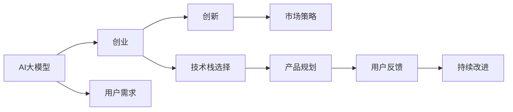

                 

# AI大模型创业：如何应对未来用户需求？

> 关键词：AI大模型, 创业, 用户需求, 创新, 市场策略, 技术栈选择, 产品规划, 用户反馈, 持续改进

## 1. 背景介绍

随着人工智能技术的快速发展，AI大模型在各行各业的应用日益广泛。从自然语言处理到图像识别，从语音识别到自动驾驶，AI大模型已经成为推动社会进步的关键力量。然而，尽管大模型在技术上取得了显著进展，但在实际应用过程中，如何满足用户的真正需求，实现商业化落地，仍然是一个巨大的挑战。本文将深入探讨AI大模型创业所面临的挑战，并提出一系列应对策略，帮助创业者在激烈的市场竞争中脱颖而出。

## 2. 核心概念与联系

### 2.1 核心概念概述

- **AI大模型（AI Large Models）**：指基于大规模深度学习框架训练的模型，如GPT、BERT等，具备强大的数据处理和决策能力，可以应用于各种复杂的自然语言处理和计算机视觉任务。
- **创业（Entrepreneurship）**：指创业者通过创新技术和商业模式，开发具有市场潜力的产品，解决实际问题，实现商业价值的过程。
- **用户需求（User Needs）**：指用户在产品使用过程中，对其功能、性能、体验等方面的具体要求。
- **创新（Innovation）**：指通过新技术和新方法，提供超越现有解决方案的新产品和服务。
- **市场策略（Market Strategy）**：指企业根据市场需求和竞争环境，制定并实施的营销和推广计划。
- **技术栈选择（Technology Stack Selection）**：指企业根据业务需求和团队技能，选择合适的开发工具和技术框架。
- **产品规划（Product Planning）**：指企业根据市场调研和用户反馈，制定产品的功能和设计方案。
- **用户反馈（User Feedback）**：指用户在产品使用过程中，对其功能、体验等方面的评价和建议。
- **持续改进（Continuous Improvement）**：指企业根据用户反馈和技术进步，不断优化产品和服务，提升用户体验。

这些核心概念之间的逻辑关系可以通过以下Mermaid流程图来展示：



这个流程图展示了AI大模型在创业过程中的关键节点和步骤：

1. AI大模型作为创业的基础技术支撑，能够为用户提供强大的功能和服务。
2. 创业者通过深入了解用户需求，制定创新产品策略。
3. 选择合适的技术栈，保障产品开发的高效性和可扩展性。
4. 制定详细的市场策略，确保产品在市场上的成功推广。
5. 通过产品规划，明确产品的功能和设计方向。
6. 收集用户反馈，不断优化产品，提升用户体验。
7. 持续改进产品和服务，保持市场竞争力。

## 3. 核心算法原理 & 具体操作步骤

### 3.1 算法原理概述

AI大模型创业的核心在于如何通过技术手段，满足用户需求，创造商业价值。在产品开发过程中，需要综合考虑以下因素：

- **模型选择**：根据业务需求和用户场景，选择合适的预训练模型。
- **数据处理**：采集、清洗和标注高质量的数据，确保模型训练的效果。
- **算法优化**：通过调参和优化算法，提升模型性能和效率。
- **产品设计**：根据用户需求，设计用户界面和交互逻辑，提升用户体验。
- **市场推广**：制定营销策略，通过各种渠道推广产品，提升品牌知名度和市场占有率。

### 3.2 算法步骤详解

以下是AI大模型创业的主要操作步骤：

1. **市场调研**：通过问卷调查、用户访谈等方式，了解用户需求和市场趋势。
2. **需求分析**：分析用户需求，明确产品功能和服务方向。
3. **模型选择**：根据用户需求，选择合适的预训练模型，如GPT、BERT等。
4. **数据准备**：采集、清洗和标注高质量的数据，确保模型训练的效果。
5. **模型微调**：在预训练模型的基础上，通过微调优化模型，适应特定业务场景。
6. **产品开发**：根据用户需求，设计用户界面和交互逻辑，提升用户体验。
7. **市场推广**：制定营销策略，通过各种渠道推广产品，提升品牌知名度和市场占有率。
8. **用户反馈**：收集用户反馈，不断优化产品，提升用户体验。
9. **持续改进**：根据用户反馈和技术进步，不断优化产品和服务，保持市场竞争力。

### 3.3 算法优缺点

AI大模型创业的优点包括：

- **技术优势**：AI大模型具备强大的数据处理和决策能力，能够提供超越传统技术的产品和服务。
- **市场潜力**：AI大模型能够解决复杂的自然语言处理和计算机视觉问题，具备广泛的应用前景。
- **创新能力**：AI大模型可以不断学习新知识，提升产品性能和功能，保持市场竞争力。

然而，AI大模型创业也存在一些挑战：

- **数据需求**：高质量数据的获取和标注成本较高，可能限制模型的训练效果。
- **技术门槛**：AI大模型需要深厚的技术积累和专业技能，创业门槛较高。
- **市场竞争**：AI大模型领域竞争激烈，需要不断创新才能获得市场份额。
- **用户需求**：用户需求多样，难以一概而论，需要精细化的产品设计。
- **持续投入**：AI大模型需要大量的计算资源和资金投入，需要持续的资金支持。

### 3.4 算法应用领域

AI大模型创业在多个领域都有广泛的应用：

- **自然语言处理**：如情感分析、智能客服、机器翻译等。
- **计算机视觉**：如图像识别、人脸识别、视频分析等。
- **智能推荐**：如电商推荐、内容推荐、广告推荐等。
- **金融科技**：如风险评估、信用评估、智能投顾等。
- **医疗健康**：如疾病诊断、基因分析、智能问诊等。
- **智能制造**：如设备监控、质量检测、供应链管理等。

## 4. 数学模型和公式 & 详细讲解

### 4.1 数学模型构建

AI大模型创业的核心在于通过数学模型，满足用户需求，创造商业价值。常用的数学模型包括：

- **回归模型**：用于预测连续型变量的值，如销售预测、股价预测等。
- **分类模型**：用于分类问题，如客户流失预测、产品推荐等。
- **聚类模型**：用于将数据分为不同的类别，如市场细分、客户群体分析等。
- **关联规则模型**：用于发现变量之间的关联关系，如购物篮分析、用户行为分析等。
- **深度学习模型**：如卷积神经网络（CNN）、循环神经网络（RNN）、Transformer等，用于处理复杂的数据和任务。

### 4.2 公式推导过程

以回归模型为例，其基本公式为：

$$
y = \theta_0 + \theta_1 x_1 + \theta_2 x_2 + \cdots + \theta_n x_n + \epsilon
$$

其中，$y$ 为预测值，$\theta_0$ 为截距，$\theta_1, \theta_2, \cdots, \theta_n$ 为回归系数，$x_1, x_2, \cdots, x_n$ 为输入特征，$\epsilon$ 为误差项。

通过最小化损失函数，可以求解出最优的回归系数 $\theta$。常用的损失函数包括均方误差（MSE）和均方根误差（RMSE）：

$$
MSE = \frac{1}{N} \sum_{i=1}^N (y_i - \hat{y_i})^2
$$

$$
RMSE = \sqrt{\frac{1}{N} \sum_{i=1}^N (y_i - \hat{y_i})^2}
$$

其中，$y_i$ 为真实值，$\hat{y_i}$ 为预测值，$N$ 为样本数量。

### 4.3 案例分析与讲解

假设我们有一个电商推荐系统的用户行为数据，包含用户的购买历史、浏览记录、评分等。我们可以构建一个回归模型，预测用户未来的购买行为。首先，通过数据预处理，将数据分为训练集和测试集。然后，使用线性回归模型进行训练和预测。最后，通过均方误差等指标评估模型效果，并进行调整和优化。

## 5. 项目实践：代码实例和详细解释说明

### 5.1 开发环境搭建

为了进行AI大模型创业项目的开发，我们需要搭建一个适合的技术环境。以下是一些常用的开发环境搭建步骤：

1. **安装Python**：确保Python版本在3.6以上，使用Anaconda或Miniconda安装。
2. **安装依赖库**：安装常用的依赖库，如TensorFlow、PyTorch、Pandas、NumPy等。
3. **配置开发环境**：使用Jupyter Notebook或PyCharm等开发工具，配置好开发环境。

### 5.2 源代码详细实现

以下是一个简单的电商推荐系统的代码实现：

```python
import pandas as pd
import numpy as np
from sklearn.linear_model import LinearRegression
from sklearn.model_selection import train_test_split

# 读取数据
data = pd.read_csv('user_behavior.csv')

# 数据预处理
X = data[['purchase_history', 'view_history', 'rating']]
y = data['purchase'].tolist()

# 划分训练集和测试集
X_train, X_test, y_train, y_test = train_test_split(X, y, test_size=0.2, random_state=42)

# 模型训练
model = LinearRegression()
model.fit(X_train, y_train)

# 模型预测
y_pred = model.predict(X_test)

# 评估模型
mse = np.mean((y_pred - y_test)**2)
rmse = np.sqrt(mse)
print('MSE:', mse)
print('RMSE:', rmse)
```

### 5.3 代码解读与分析

以上代码实现了一个简单的线性回归模型，用于预测电商用户的购买行为。具体步骤如下：

1. 读取用户行为数据，并将其分为输入特征和目标变量。
2. 使用train_test_split函数，将数据划分为训练集和测试集。
3. 使用LinearRegression模型，对训练集进行训练，并使用测试集进行预测。
4. 计算均方误差和均方根误差，评估模型效果。

## 6. 实际应用场景

### 6.4 未来应用展望

AI大模型创业的未来应用前景广阔，以下是一些潜在的应用场景：

1. **智能客服**：通过AI大模型，实现自动化的客服系统，提供24小时在线服务，提升客户满意度。
2. **智能投顾**：通过AI大模型，分析市场数据，提供个性化的投资建议，提高投资回报率。
3. **智能医疗**：通过AI大模型，分析病历数据，提供个性化的诊疗方案，提升医疗服务质量。
4. **智能制造**：通过AI大模型，分析设备运行数据，提供预防性维护建议，降低生产成本。
5. **智能交通**：通过AI大模型，分析交通数据，优化交通信号灯，减少拥堵和事故。
6. **智能安防**：通过AI大模型，分析监控视频，识别异常行为，提升安全防范能力。

## 7. 工具和资源推荐

### 7.1 学习资源推荐

为了帮助AI大模型创业的创业者更好地掌握相关知识和技能，以下是一些推荐的学习资源：

1. **深度学习框架教程**：如TensorFlow、PyTorch等框架的官方文档和教程，深入理解框架的使用方法和API。
2. **数据科学入门书籍**：如《Python数据科学手册》、《机器学习实战》等，了解数据预处理、特征工程、模型评估等基础知识。
3. **AI创业课程**：如Coursera、edX等平台上的AI创业课程，学习创业策略、市场营销、团队管理等知识。
4. **开源项目和案例分析**：如GitHub上的开源AI项目，学习实际案例的实现细节和经验教训。
5. **行业报告和研究论文**：如Gartner、IDC等机构的行业报告，了解市场趋势和前沿技术。

### 7.2 开发工具推荐

为了提升AI大模型创业的开发效率，以下是一些推荐的开发工具：

1. **Python IDE**：如PyCharm、Jupyter Notebook等，提供代码编写、调试、测试等全流程支持。
2. **数据处理工具**：如Pandas、NumPy等，方便数据预处理和分析。
3. **机器学习框架**：如Scikit-Learn、TensorFlow、PyTorch等，提供丰富的机器学习算法和模型。
4. **版本控制工具**：如Git、SVN等，方便代码管理和团队协作。
5. **项目管理工具**：如Jira、Trello等，帮助项目管理和任务分配。

### 7.3 相关论文推荐

为了深入了解AI大模型创业的最新研究成果，以下是一些推荐的论文：

1. **深度学习技术进展**：如NIPS、ICML等顶级会议的论文，了解前沿技术和方法。
2. **AI创业案例分析**：如《AI创业生存指南》、《AI大模型创业实战》等书籍，学习成功案例和经验。
3. **市场分析报告**：如Gartner、IDC等机构的市场分析报告，了解市场趋势和竞争格局。
4. **行业应用研究**：如IEEE、ACM等顶级期刊的文章，了解行业应用和未来趋势。

## 8. 总结：未来发展趋势与挑战

### 8.1 研究成果总结

AI大模型创业在过去的几年中取得了显著进展，主要体现在以下几个方面：

1. **技术进步**：AI大模型在自然语言处理和计算机视觉等领域取得了突破性进展，推动了相关技术的应用和落地。
2. **市场增长**：AI大模型创业得到了广泛的市场认可，相关应用场景不断拓展，市场规模不断扩大。
3. **人才储备**：AI大模型创业吸引了大量优秀人才的加入，推动了技术创新和市场开拓。

### 8.2 未来发展趋势

AI大模型创业的未来发展趋势主要体现在以下几个方面：

1. **技术演进**：AI大模型将不断演进，提升模型的性能和功能，满足更多用户需求。
2. **市场拓展**：AI大模型将拓展到更多行业和领域，推动行业数字化转型和智能化升级。
3. **用户定制**：AI大模型将支持更多用户定制需求，提供个性化的产品和服务。
4. **跨领域融合**：AI大模型将与其他技术如区块链、物联网等进行融合，提升系统整体性能。
5. **国际合作**：AI大模型创业将加强国际合作，推动全球技术共享和市场一体化。

### 8.3 面临的挑战

AI大模型创业在发展过程中也面临一些挑战：

1. **数据安全**：AI大模型需要大量的数据进行训练，数据安全和隐私保护问题亟待解决。
2. **技术门槛**：AI大模型创业需要深厚的技术积累和专业技能，创业门槛较高。
3. **市场竞争**：AI大模型领域竞争激烈，需要不断创新才能获得市场份额。
4. **用户需求多样化**：用户需求多样化，难以一概而论，需要精细化的产品设计。
5. **持续投入**：AI大模型需要大量的计算资源和资金投入，需要持续的资金支持。

### 8.4 研究展望

未来的AI大模型创业需要在以下几个方面进行深入研究：

1. **数据安全与隐私保护**：开发新的数据安全技术，保护用户隐私和数据安全。
2. **技术迭代与创新**：加强对新技术和新方法的研发，提升AI大模型的性能和功能。
3. **用户需求分析**：深入分析用户需求，提供更符合用户期望的产品和服务。
4. **市场策略制定**：制定科学的市场策略，提升产品竞争力，拓展市场份额。
5. **持续改进与优化**：不断收集用户反馈，优化产品和服务，提升用户体验。

## 9. 附录：常见问题与解答

### Q1: 如何选择合适的AI大模型？

A: 选择合适的AI大模型需要考虑以下几个因素：
1. **业务需求**：根据具体业务需求，选择合适的模型。如自然语言处理任务，可以选择BERT、GPT等模型；计算机视觉任务，可以选择ResNet、VGG等模型。
2. **数据规模**：根据数据规模，选择合适的模型。如数据量较大，可以选择BERT等大规模模型；数据量较小，可以选择MobileNet等轻量级模型。
3. **性能要求**：根据性能要求，选择合适的模型。如对实时性要求较高，可以选择GPU加速的模型；对准确性要求较高，可以选择精度更高的模型。

### Q2: 如何评估AI大模型的效果？

A: 评估AI大模型的效果需要考虑以下几个指标：
1. **准确率（Accuracy）**：模型预测结果与真实结果的匹配度，越高越好。
2. **召回率（Recall）**：模型正确预测的正样本数量占实际正样本数量的比例，越高越好。
3. **F1分数（F1 Score）**：准确率和召回率的综合指标，越高越好。
4. **均方误差（MSE）**：回归任务中的预测值与真实值之间的差距，越小越好。
5. **均方根误差（RMSE）**：均方误差平方根，越小越好。
6. **ROC曲线（Receiver Operating Characteristic Curve）**：用于评估二分类模型的性能，越靠近左上角，性能越好。

### Q3: 如何处理AI大模型训练中的过拟合问题？

A: 处理AI大模型训练中的过拟合问题需要考虑以下几个方法：
1. **数据增强**：通过增加数据样本和多样性，减少过拟合。
2. **正则化**：使用L2正则、Dropout等技术，限制模型的复杂度，避免过拟合。
3. **早停法**：在训练过程中，设置一定的验证集评估指标，一旦超过阈值，立即停止训练，避免过拟合。
4. **模型集成**：通过集成多个模型的预测结果，提升模型的泛化能力，减少过拟合。
5. **批量归一化**：对模型输出进行归一化处理，减少内部协变量偏移，提升模型的泛化能力。

### Q4: 如何提升AI大模型的推理效率？

A: 提升AI大模型的推理效率需要考虑以下几个方法：
1. **模型压缩**：通过剪枝、量化等技术，减小模型的规模和计算量。
2. **硬件加速**：使用GPU、TPU等硬件加速设备，提升推理速度。
3. **模型并行**：使用模型并行技术，将模型分布在多个设备上并行计算，提高推理效率。
4. **缓存技术**：使用缓存技术，减少重复计算，提升推理效率。
5. **优化算法**：使用高效的优化算法，如Adam、Adagrad等，提升模型的收敛速度。

### Q5: 如何提升AI大模型的可解释性？

A: 提升AI大模型的可解释性需要考虑以下几个方法：
1. **特征可视化**：通过可视化特征分布，了解模型的内部决策逻辑。
2. **模型解释器**：使用模型解释器，如LIME、SHAP等，解释模型的输出。
3. **决策树**：使用决策树模型，解释模型的决策过程。
4. **规则学习**：使用规则学习技术，生成模型的规则描述。
5. **用户反馈**：通过用户反馈，了解模型的表现和改进方向。

---

作者：禅与计算机程序设计艺术 / Zen and the Art of Computer Programming

