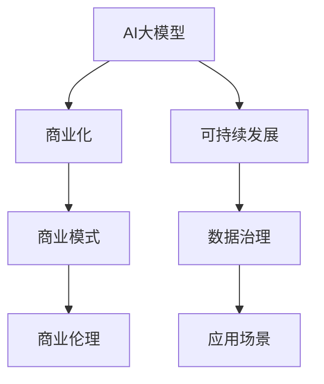

                 

# AI大模型创业：如何构建未来可持续的商业模式？

> 关键词：大模型, 商业化, 可持续发展, 创业指导, 技术落地, 数据治理, 商业伦理, 应用场景

## 1. 背景介绍

### 1.1 问题由来

随着人工智能技术的迅猛发展，AI大模型在各行各业中的应用日趋广泛，例如自然语言处理(NLP)、计算机视觉(CV)、语音识别(SR)等。这些大模型基于海量数据和先进算法训练而成，具备强大的模式识别、决策推理能力。然而，在实际应用中，大模型的落地需要克服诸多挑战，如数据获取、算法优化、产品化等。尤其对于创业者而言，如何在技术优势和商业模式之间找到平衡，构建可持续发展的AI大模型企业，成为当下亟待解决的难题。

### 1.2 问题核心关键点

构建可持续的AI大模型商业模式，关键在于明确市场定位、技术优势、商业模式、用户需求等多个要素，并找到它们的契合点。以下是创业过程中需要关注的几个核心问题：

- **技术优势**：如何利用大模型的独特技术优势，满足市场需求。
- **商业模式**：如何选择适合的商业模式，获取收益。
- **数据治理**：如何获取、管理和保护数据资源，是大模型创业的难点。
- **商业伦理**：如何遵循行业规范，确保AI应用的伦理安全。
- **应用场景**：如何选择合适的应用场景，最大化商业价值。

### 1.3 问题研究意义

构建可持续的AI大模型商业模式，对于推动AI技术的商业化落地、加速行业数字化转型、提升企业的市场竞争力具有重要意义：

1. **加速AI技术落地**：通过构建有效的商业模式，促进AI大模型在实际应用场景中的部署，加速AI技术的产业化进程。
2. **提升企业市场竞争力**：借助大模型技术，企业可以在竞争中占据优势，提高市场占有率。
3. **推动行业数字化转型**：AI大模型可以应用于各行各业，提升生产效率、优化运营管理，加速传统行业数字化转型。
4. **强化商业伦理**：通过遵循商业伦理，确保AI应用的安全性和公平性，避免社会负面影响。
5. **探索应用场景**：选择合适的应用场景，有助于最大化大模型的商业价值，并发现新的市场机会。

## 2. 核心概念与联系

### 2.1 核心概念概述

为更好地理解如何构建AI大模型的商业模式，本节将介绍几个密切相关的核心概念：

- **AI大模型**：基于海量数据训练而成，具备强大模式识别、决策推理能力的大型神经网络模型，如BERT、GPT等。
- **商业化**：将技术产品化，通过市场交易获取收益的过程，涵盖产品开发、市场推广、销售管理等环节。
- **可持续发展**：在追求经济效益的同时，注重环境、社会责任，实现技术进步与商业利益的平衡。
- **商业模式**：企业盈利的方式，包括产品销售、服务订阅、数据授权等。
- **数据治理**：管理和保护数据资源，确保数据安全、隐私、合规。
- **商业伦理**：企业在经营过程中遵循的道德规范，确保AI应用公平、透明、安全。
- **应用场景**：AI大模型具体应用的领域，如医疗、金融、教育等。

这些核心概念之间的逻辑关系可以通过以下Mermaid流程图来展示：



这个流程图展示了大模型创业的核心概念及其之间的关系：

1. AI大模型是商业化的基础，提供核心技术支持。
2. 商业化是大模型创业的核心目标，实现经济效益。
3. 可持续发展是商业化的保障，确保长期稳定。
4. 数据治理和商业伦理是商业化的前提，确保合规和伦理安全。
5. 应用场景是大模型的具体应用领域，确保商业价值。

## 3. 核心算法原理 & 具体操作步骤

### 3.1 算法原理概述

构建可持续的AI大模型商业模式，涉及多个环节，包括技术选择、市场定位、用户需求分析、商业模式设计等。其核心在于理解大模型的技术优势，并找到与市场需求的契合点。

**算法原理概述**：

1. **技术选择**：根据市场需求和技术优势，选择合适的AI大模型，如NLP、CV等。
2. **市场定位**：明确目标市场，定义产品定位，如垂直领域、通用解决方案等。
3. **用户需求分析**：了解目标用户的需求，设计符合用户期望的产品功能。
4. **商业模式设计**：选择适合的商业模式，如SaaS、PaaS、B2B等，实现盈利。
5. **数据治理**：获取和管理数据资源，确保数据安全、隐私和合规。
6. **商业伦理**：遵循商业伦理规范，确保AI应用公平、透明、安全。

### 3.2 算法步骤详解

基于上述算法原理，构建AI大模型商业模式的详细步骤包括：

**Step 1: 技术评估**

- **评估市场需求**：分析市场现状和未来趋势，识别出未被满足的需求。
- **技术可行性**：评估AI大模型在特定应用场景中的可行性，包括模型性能、训练成本等。

**Step 2: 市场定位**

- **目标市场选择**：根据市场需求和技术优势，确定目标市场，如医疗、金融、教育等。
- **产品定位**：定义产品的核心功能和特色，满足目标用户的需求。

**Step 3: 用户需求分析**

- **用户调研**：通过问卷、访谈等方式，了解用户需求和期望。
- **功能设计**：基于用户调研结果，设计符合用户需求的功能模块。

**Step 4: 商业模式设计**

- **选择盈利模式**：根据市场需求和产品定位，选择适合的商业模式，如SaaS、PaaS、B2B等。
- **定价策略**：制定合理的定价策略，确保收益。

**Step 5: 数据治理**

- **数据获取**：获取目标数据资源，如文本、图像、音频等。
- **数据管理**：建立数据管理系统，确保数据安全、隐私和合规。

**Step 6: 商业伦理**

- **伦理规范制定**：制定商业伦理规范，确保AI应用公平、透明、安全。
- **伦理培训**：对团队进行商业伦理培训，提高团队伦理意识。

### 3.3 算法优缺点

**算法优点**：

1. **技术优势**：大模型提供强大的模式识别、决策推理能力，满足复杂场景下的需求。
2. **灵活性**：大模型可以根据市场需求快速调整和优化，适应不同的应用场景。
3. **成本效益**：通过商业化运营，实现规模经济，降低单次使用成本。

**算法缺点**：

1. **高投入**：大模型的开发和训练需要大量的计算资源和数据资源。
2. **依赖数据**：大模型的效果依赖于数据质量和数量，数据获取和管理难度大。
3. **商业伦理**：AI应用可能面临伦理挑战，如偏见、隐私等问题。

### 3.4 算法应用领域

AI大模型在多个领域已展现出强大的应用潜力，具体包括：

- **医疗**：大模型可以用于病历分析、疾病预测、药物研发等。
- **金融**：大模型可以用于风险评估、客户分析、交易预测等。
- **教育**：大模型可以用于智能推荐、作业批改、情感分析等。
- **零售**：大模型可以用于个性化推荐、需求预测、客户服务等。
- **制造业**：大模型可以用于质量检测、工艺优化、设备维护等。

## 4. 数学模型和公式 & 详细讲解  
### 4.1 数学模型构建

本节将使用数学语言对大模型商业模式的构建过程进行更加严格的刻画。

设目标市场需求为 $D$，技术优势为 $T$，商业模式为 $B$，数据治理为 $D$，商业伦理为 $E$，应用场景为 $A$。则构建可持续商业模式的目标是最大化 $D \times T \times B \times D \times E \times A$。

其中，$B$ 和 $D$ 是相互制约的关键变量，需要在商业化和数据治理之间找到平衡点。

### 4.2 公式推导过程

以SaaS（软件即服务）模式为例，公式化表达大模型商业模式的构建过程：

$$
\maximize D \times T \times B \times D \times E \times A
$$

**Step 1: 需求分析**

$$
D \propto \text{用户数量} + \text{用户满意度} + \text{市场潜力}
$$

**Step 2: 技术选择**

$$
T \propto \text{模型精度} + \text{训练效率} + \text{可扩展性}
$$

**Step 3: 商业化**

$$
B \propto \text{盈利模式} + \text{市场定位} + \text{定价策略}
$$

**Step 4: 数据治理**

$$
D \propto \text{数据获取能力} + \text{数据管理水平} + \text{数据合规性}
$$

**Step 5: 商业伦理**

$$
E \propto \text{伦理规范完备度} + \text{伦理培训效果} + \text{用户信任度}
$$

**Step 6: 应用场景**

$$
A \propto \text{场景适配度} + \text{技术可行性} + \text{市场接受度}
$$

通过以上步骤，可以得到大模型商业模式的数学模型，最大化市场需求、技术优势、商业化收益、数据治理、商业伦理、应用场景的综合效益。

### 4.3 案例分析与讲解

以某AI大模型在金融行业的商业化为例，详细讲解模型构建过程：

**市场需求**：银行需要利用AI进行客户分析、风险评估等。

**技术优势**：使用大模型对大量历史数据进行训练，具备强大的数据分析和决策能力。

**商业模式**：采用SaaS模式，提供基于云端的金融分析服务。

**数据治理**：从银行内部获取客户交易数据，确保数据安全和隐私。

**商业伦理**：制定数据使用规范，确保客户隐私不被滥用。

**应用场景**：应用于客户信用评估、风险预警、投资建议等。

通过以上步骤，构建起一个可持续的AI大模型商业模式，实现商业价值和技术优势的双赢。

## 5. 项目实践：代码实例和详细解释说明

### 5.1 开发环境搭建

在进行大模型商业化实践前，我们需要准备好开发环境。以下是使用Python进行PyTorch开发的环境配置流程：

1. 安装Anaconda：从官网下载并安装Anaconda，用于创建独立的Python环境。

2. 创建并激活虚拟环境：
```bash
conda create -n pytorch-env python=3.8 
conda activate pytorch-env
```

3. 安装PyTorch：根据CUDA版本，从官网获取对应的安装命令。例如：
```bash
conda install pytorch torchvision torchaudio cudatoolkit=11.1 -c pytorch -c conda-forge
```

4. 安装各类工具包：
```bash
pip install numpy pandas scikit-learn matplotlib tqdm jupyter notebook ipython
```

完成上述步骤后，即可在`pytorch-env`环境中开始商业化实践。

### 5.2 源代码详细实现

下面以金融行业为例，给出使用Transformers库对BERT模型进行商业化部署的PyTorch代码实现。

首先，定义金融数据处理函数：

```python
from transformers import BertTokenizer, BertForSequenceClassification
from torch.utils.data import Dataset
import torch

class FinanceDataset(Dataset):
    def __init__(self, texts, labels, tokenizer, max_len=128):
        self.texts = texts
        self.labels = labels
        self.tokenizer = tokenizer
        self.max_len = max_len
        
    def __len__(self):
        return len(self.texts)
    
    def __getitem__(self, item):
        text = self.texts[item]
        label = self.labels[item]
        
        encoding = self.tokenizer(text, return_tensors='pt', max_length=self.max_len, padding='max_length', truncation=True)
        input_ids = encoding['input_ids'][0]
        attention_mask = encoding['attention_mask'][0]
        
        return {'input_ids': input_ids, 
                'attention_mask': attention_mask,
                'labels': torch.tensor(label, dtype=torch.long)}
```

然后，定义模型和优化器：

```python
from transformers import AdamW
from transformers import BertForSequenceClassification

model = BertForSequenceClassification.from_pretrained('bert-base-cased', num_labels=2)

optimizer = AdamW(model.parameters(), lr=2e-5)
```

接着，定义训练和评估函数：

```python
from torch.utils.data import DataLoader
from tqdm import tqdm
from sklearn.metrics import accuracy_score

device = torch.device('cuda') if torch.cuda.is_available() else torch.device('cpu')
model.to(device)

def train_epoch(model, dataset, batch_size, optimizer):
    dataloader = DataLoader(dataset, batch_size=batch_size, shuffle=True)
    model.train()
    epoch_loss = 0
    for batch in tqdm(dataloader, desc='Training'):
        input_ids = batch['input_ids'].to(device)
        attention_mask = batch['attention_mask'].to(device)
        labels = batch['labels'].to(device)
        model.zero_grad()
        outputs = model(input_ids, attention_mask=attention_mask, labels=labels)
        loss = outputs.loss
        epoch_loss += loss.item()
        loss.backward()
        optimizer.step()
    return epoch_loss / len(dataloader)

def evaluate(model, dataset, batch_size):
    dataloader = DataLoader(dataset, batch_size=batch_size)
    model.eval()
    preds, labels = [], []
    with torch.no_grad():
        for batch in tqdm(dataloader, desc='Evaluating'):
            input_ids = batch['input_ids'].to(device)
            attention_mask = batch['attention_mask'].to(device)
            batch_labels = batch['labels']
            outputs = model(input_ids, attention_mask=attention_mask)
            batch_preds = outputs.logits.argmax(dim=1).to('cpu').tolist()
            batch_labels = batch_labels.to('cpu').tolist()
            for pred, label in zip(batch_preds, batch_labels):
                preds.append(pred)
                labels.append(label)
    
    print(f"Accuracy: {accuracy_score(labels, preds)}")
```

最后，启动训练流程并在测试集上评估：

```python
epochs = 5
batch_size = 16

for epoch in range(epochs):
    loss = train_epoch(model, finance_dataset, batch_size, optimizer)
    print(f"Epoch {epoch+1}, train loss: {loss:.3f}")
    
    print(f"Epoch {epoch+1}, dev results:")
    evaluate(model, finance_dataset, batch_size)
    
print("Test results:")
evaluate(model, finance_dataset, batch_size)
```

以上就是使用PyTorch对BERT进行金融数据处理和模型微调的完整代码实现。

### 5.3 代码解读与分析

让我们再详细解读一下关键代码的实现细节：

**FinanceDataset类**：
- `__init__`方法：初始化文本、标签、分词器等关键组件。
- `__len__`方法：返回数据集的样本数量。
- `__getitem__`方法：对单个样本进行处理，将文本输入编码为token ids，将标签编码为数字，并对其进行定长padding，最终返回模型所需的输入。

**模型和优化器**：
- 定义BERT模型和AdamW优化器，用于模型的训练和优化。

**训练和评估函数**：
- 使用PyTorch的DataLoader对数据集进行批次化加载，供模型训练和推理使用。
- 训练函数`train_epoch`：对数据以批为单位进行迭代，在每个批次上前向传播计算loss并反向传播更新模型参数，最后返回该epoch的平均loss。
- 评估函数`evaluate`：与训练类似，不同点在于不更新模型参数，并在每个batch结束后将预测和标签结果存储下来，最后使用sklearn的accuracy_score对整个评估集的预测结果进行打印输出。

**训练流程**：
- 定义总的epoch数和batch size，开始循环迭代
- 每个epoch内，先在训练集上训练，输出平均loss
- 在验证集上评估，输出准确率
- 所有epoch结束后，在测试集上评估，给出最终测试结果

可以看到，PyTorch配合Transformers库使得BERT微调的代码实现变得简洁高效。开发者可以将更多精力放在数据处理、模型改进等高层逻辑上，而不必过多关注底层的实现细节。

## 6. 实际应用场景

### 6.1 智能客服系统

基于大模型商业化的对话技术，可以广泛应用于智能客服系统的构建。传统客服往往需要配备大量人力，高峰期响应缓慢，且一致性和专业性难以保证。而使用商业化的对话模型，可以7x24小时不间断服务，快速响应客户咨询，用自然流畅的语言解答各类常见问题。

在技术实现上，可以收集企业内部的历史客服对话记录，将问题和最佳答复构建成监督数据，在此基础上对预训练对话模型进行商业化微调。商业化微调后的对话模型能够自动理解用户意图，匹配最合适的答案模板进行回复。对于客户提出的新问题，还可以接入检索系统实时搜索相关内容，动态组织生成回答。如此构建的智能客服系统，能大幅提升客户咨询体验和问题解决效率。

### 6.2 金融舆情监测

金融机构需要实时监测市场舆论动向，以便及时应对负面信息传播，规避金融风险。传统的人工监测方式成本高、效率低，难以应对网络时代海量信息爆发的挑战。基于大模型商业化的文本分类和情感分析技术，为金融舆情监测提供了新的解决方案。

具体而言，可以收集金融领域相关的新闻、报道、评论等文本数据，并对其进行主题标注和情感标注。在此基础上对预训练语言模型进行商业化微调，使其能够自动判断文本属于何种主题，情感倾向是正面、中性还是负面。将商业化微调后的模型应用到实时抓取的网络文本数据，就能够自动监测不同主题下的情感变化趋势，一旦发现负面信息激增等异常情况，系统便会自动预警，帮助金融机构快速应对潜在风险。

### 6.3 个性化推荐系统

当前的推荐系统往往只依赖用户的历史行为数据进行物品推荐，无法深入理解用户的真实兴趣偏好。基于大模型商业化的个性化推荐系统可以更好地挖掘用户行为背后的语义信息，从而提供更精准、多样的推荐内容。

在实践中，可以收集用户浏览、点击、评论、分享等行为数据，提取和用户交互的物品标题、描述、标签等文本内容。将文本内容作为模型输入，用户的后续行为（如是否点击、购买等）作为监督信号，在此基础上对预训练语言模型进行商业化微调。商业化微调后的模型能够从文本内容中准确把握用户的兴趣点。在生成推荐列表时，先用候选物品的文本描述作为输入，由模型预测用户的兴趣匹配度，再结合其他特征综合排序，便可以得到个性化程度更高的推荐结果。

### 6.4 未来应用展望

随着大模型商业化技术的不断发展，基于大模型的应用场景将不断涌现，为各行各业带来变革性影响。

在智慧医疗领域，基于商业化的医疗问答、病历分析、药物研发等应用将提升医疗服务的智能化水平，辅助医生诊疗，加速新药开发进程。

在智能教育领域，商业化的智能推荐、作业批改、学情分析等技术，因材施教，促进教育公平，提高教学质量。

在智慧城市治理中，商业化的城市事件监测、舆情分析、应急指挥等环节，提高城市管理的自动化和智能化水平，构建更安全、高效的未来城市。

此外，在企业生产、社会治理、文娱传媒等众多领域，基于大模型商业化的人工智能应用也将不断涌现，为经济社会发展注入新的动力。相信随着技术的日益成熟，大模型商业化必将在更广阔的应用领域大放异彩。

## 7. 工具和资源推荐

### 7.1 学习资源推荐

为了帮助开发者系统掌握大模型商业化的理论基础和实践技巧，这里推荐一些优质的学习资源：

1. 《Transformer从原理到实践》系列博文：由大模型技术专家撰写，深入浅出地介绍了Transformer原理、BERT模型、商业化技术等前沿话题。

2. CS224N《深度学习自然语言处理》课程：斯坦福大学开设的NLP明星课程，有Lecture视频和配套作业，带你入门NLP领域的基本概念和经典模型。

3. 《Natural Language Processing with Transformers》书籍：Transformers库的作者所著，全面介绍了如何使用Transformers库进行NLP任务开发，包括商业化在内的诸多范式。

4. HuggingFace官方文档：Transformers库的官方文档，提供了海量预训练模型和完整的商业化样例代码，是上手实践的必备资料。

5. CLUE开源项目：中文语言理解测评基准，涵盖大量不同类型的中文NLP数据集，并提供了基于商业化的baseline模型，助力中文NLP技术发展。

通过对这些资源的学习实践，相信你一定能够快速掌握大模型商业化的精髓，并用于解决实际的NLP问题。

### 7.2 开发工具推荐

高效的开发离不开优秀的工具支持。以下是几款用于大模型商业化开发的常用工具：

1. PyTorch：基于Python的开源深度学习框架，灵活动态的计算图，适合快速迭代研究。大部分预训练语言模型都有PyTorch版本的实现。

2. TensorFlow：由Google主导开发的开源深度学习框架，生产部署方便，适合大规模工程应用。同样有丰富的预训练语言模型资源。

3. Transformers库：HuggingFace开发的NLP工具库，集成了众多SOTA语言模型，支持PyTorch和TensorFlow，是进行商业化任务开发的利器。

4. Weights & Biases：模型训练的实验跟踪工具，可以记录和可视化模型训练过程中的各项指标，方便对比和调优。与主流深度学习框架无缝集成。

5. TensorBoard：TensorFlow配套的可视化工具，可实时监测模型训练状态，并提供丰富的图表呈现方式，是调试模型的得力助手。

6. Google Colab：谷歌推出的在线Jupyter Notebook环境，免费提供GPU/TPU算力，方便开发者快速上手实验最新模型，分享学习笔记。

合理利用这些工具，可以显著提升大模型商业化的开发效率，加快创新迭代的步伐。

### 7.3 相关论文推荐

大模型商业化技术的发展源于学界的持续研究。以下是几篇奠基性的相关论文，推荐阅读：

1. Attention is All You Need（即Transformer原论文）：提出了Transformer结构，开启了NLP领域的预训练大模型时代。

2. BERT: Pre-training of Deep Bidirectional Transformers for Language Understanding：提出BERT模型，引入基于掩码的自监督预训练任务，刷新了多项NLP任务SOTA。

3. Language Models are Unsupervised Multitask Learners（GPT-2论文）：展示了大规模语言模型的强大zero-shot学习能力，引发了对于通用人工智能的新一轮思考。

4. Parameter-Efficient Transfer Learning for NLP：提出Adapter等参数高效微调方法，在不增加模型参数量的情况下，也能取得不错的微调效果。

5. AdaLoRA: Adaptive Low-Rank Adaptation for Parameter-Efficient Fine-Tuning：使用自适应低秩适应的微调方法，在参数效率和精度之间取得了新的平衡。

6. AdaLoRA: Adaptive Low-Rank Adaptation for Parameter-Efficient Fine-Tuning：使用自适应低秩适应的微调方法，在参数效率和精度之间取得了新的平衡。

这些论文代表了大模型商业化技术的发展脉络。通过学习这些前沿成果，可以帮助研究者把握学科前进方向，激发更多的创新灵感。

## 8. 总结：未来发展趋势与挑战

### 8.1 总结

本文对基于商业化的大模型构建方法进行了全面系统的介绍。首先阐述了大模型商业化的背景和意义，明确了商业化和数据治理在大模型创业中的核心地位。其次，从原理到实践，详细讲解了商业化微调的过程，给出了商业化微调的完整代码实例。同时，本文还广泛探讨了大模型在智能客服、金融舆情、个性化推荐等多个行业领域的应用前景，展示了大模型商业化的巨大潜力。此外，本文精选了商业化技术的各类学习资源，力求为读者提供全方位的技术指引。

通过本文的系统梳理，可以看到，基于大模型的商业化方法正在成为NLP领域的重要范式，极大地拓展了预训练语言模型的应用边界，催生了更多的落地场景。受益于大规模语料的预训练和先进算法的支持，商业化大模型能够快速响应市场需求，显著提升各行各业的运营效率和决策质量。未来，伴随大模型技术的不断进步和商业化实践的深入，基于大模型的AI应用必将在更广泛的领域取得突破性进展。

### 8.2 未来发展趋势

展望未来，大模型商业化技术将呈现以下几个发展趋势：

1. **技术优势持续提升**：随着预训练技术的不断发展，大模型将具备更强的模式识别、决策推理能力，适应更多复杂场景下的商业化需求。

2. **数据治理更加完善**：随着数据资源的丰富和数据治理技术的进步，数据获取、管理和保护将更加高效，降低商业化成本。

3. **应用场景不断扩展**：基于大模型的应用将不断向更广泛的领域扩展，如医疗、金融、教育、智能制造等。

4. **商业模式创新**：将涌现更多创新的商业模式，如BaaS（基于AI的应用即服务）、AI+IoT等，推动商业化的多样化。

5. **伦理规范逐步完善**：伴随AI应用的普及，商业伦理规范将逐步完善，确保AI应用的公平、透明、安全。

6. **用户需求更加多样化**：用户需求将更加个性化和多元化，商业化大模型需要适应更广泛的用户需求。

7. **计算效率不断优化**：随着计算技术的发展，大模型的计算效率将不断提升，支持更大规模的商业化应用。

以上趋势凸显了大模型商业化技术的广阔前景。这些方向的探索发展，必将进一步提升大模型的商业价值，推动AI技术的规模化落地。

### 8.3 面临的挑战

尽管大模型商业化技术已经取得了瞩目成就，但在迈向更加智能化、普适化应用的过程中，它仍面临着诸多挑战：

1. **数据隐私和安全**：数据隐私和安全问题是大模型商业化过程中需要重点关注的难点，如何在保护隐私的前提下，获取和管理数据资源，仍需进一步探索。

2. **算力成本**：大模型商业化过程中，计算资源消耗巨大，如何降低算力成本，提升计算效率，是一个重要的研究方向。

3. **商业伦理**：AI应用可能面临伦理挑战，如偏见、隐私等问题，如何制定合理的伦理规范，确保AI应用的公平、透明、安全，是一个长期且复杂的问题。

4. **技术壁垒**：大模型商业化需要跨领域的深度技术积累，如何打破技术壁垒，实现技术融合和协同创新，是一个关键挑战。

5. **市场竞争**：随着市场竞争的加剧，如何在激烈的市场竞争中保持技术优势，快速响应市场需求，是一个重要的课题。

6. **用户接受度**：用户对AI技术的接受度仍然是一个难题，如何在推广过程中提高用户接受度，增强用户黏性，是一个长期的任务。

7. **法规政策**：不同国家和地区对AI应用的法规政策不同，如何在全球范围内合规运营，是一个复杂且艰巨的任务。

这些挑战需要企业在技术、市场、伦理等多个维度协同发力，不断探索和创新，才能在大模型商业化过程中取得成功。

### 8.4 研究展望

面对大模型商业化所面临的挑战，未来的研究需要在以下几个方面寻求新的突破：

1. **数据隐私保护**：研发更高效的数据隐私保护技术，确保数据安全和隐私，同时满足商业化的需求。

2. **算力优化**：开发更高效的计算框架和硬件设备，降低计算成本，提升计算效率。

3. **伦理规范制定**：制定更加完善的伦理规范，确保AI应用的公平、透明、安全。

4. **技术融合创新**：打破技术壁垒，推动不同技术领域的深度融合，实现技术创新和协同进步。

5. **市场推广策略**：制定合理的市场推广策略，提高用户接受度，增强用户黏性。

6. **法规政策遵循**：关注全球范围内的法规政策变化，确保在全球范围内合规运营。

这些研究方向的探索，必将引领大模型商业化技术迈向更高的台阶，为构建安全、可靠、可解释、可控的智能系统铺平道路。面向未来，大模型商业化技术还需要与其他人工智能技术进行更深入的融合，如知识表示、因果推理、强化学习等，多路径协同发力，共同推动自然语言理解和智能交互系统的进步。只有勇于创新、敢于突破，才能不断拓展语言模型的边界，让智能技术更好地造福人类社会。

## 9. 附录：常见问题与解答

**Q1：大模型商业化是否适用于所有NLP任务？**

A: 大模型商业化在大多数NLP任务上都能取得不错的效果，特别是对于数据量较小的任务。但对于一些特定领域的任务，如医学、法律等，仅仅依靠通用语料预训练的模型可能难以很好地适应。此时需要在特定领域语料上进一步预训练，再进行商业化微调，才能获得理想效果。此外，对于一些需要时效性、个性化很强的任务，如对话、推荐等，商业化方法也需要针对性的改进优化。

**Q2：大模型商业化过程中如何确保数据隐私和安全？**

A: 在商业化过程中，确保数据隐私和安全是至关重要的。以下是几个关键措施：

1. **数据匿名化**：对原始数据进行匿名化处理，确保数据无法被还原。
2. **数据加密**：在数据传输和存储过程中，使用加密技术保护数据安全。
3. **访问控制**：对数据进行严格的访问控制，确保只有授权人员可以访问敏感数据。
4. **隐私保护算法**：采用差分隐私、联邦学习等技术，保护数据隐私。
5. **合规审查**：定期进行数据隐私和安全合规审查，确保符合相关法律法规。

通过以上措施，可以有效保护数据隐私和安全，确保大模型商业化的顺利进行。

**Q3：大模型商业化过程中如何降低算力成本？**

A: 降低算力成本是大模型商业化过程中需要重点关注的问题。以下是几个关键措施：

1. **模型压缩**：使用模型压缩技术，如剪枝、量化、蒸馏等，减小模型大小，提升计算效率。
2. **分布式计算**：使用分布式计算框架，如TensorFlow、PyTorch等，实现并行计算，提升计算效率。
3. **硬件加速**：使用GPU、TPU等高性能计算设备，提升计算速度。
4. **混合精度训练**：采用混合精度训练技术，降低计算资源消耗。
5. **模型轻量化**：只保留关键层和参数，实现模型轻量化，减少计算资源需求。

通过以上措施，可以有效降低算力成本，支持大模型的商业化部署。

**Q4：大模型商业化过程中如何提高用户接受度？**

A: 提高用户接受度是大模型商业化过程中需要重点关注的问题。以下是几个关键措施：

1. **用户体验优化**：提升用户界面设计，优化用户体验，使用户更易于接受和适应。
2. **教育培训**：对用户进行教育和培训，提高其对AI技术的认知和接受度。
3. **用户反馈机制**：建立用户反馈机制，及时收集和处理用户反馈，优化产品功能和服务。
4. **市场推广策略**：制定合理的市场推广策略，提高用户知晓度和使用率。
5. **用户激励措施**：提供用户激励措施，如优惠券、奖励积分等，增强用户黏性。

通过以上措施，可以有效提高用户接受度，增强用户黏性，推动大模型的商业化应用。

**Q5：大模型商业化过程中如何遵循法规政策？**

A: 大模型商业化过程中，遵循法规政策是确保合规运营的重要保障。以下是几个关键措施：

1. **法规政策研究**：定期进行法规政策研究，了解相关法规政策的变化。
2. **合规审查**：建立合规审查机制，确保产品和服务符合相关法规政策。
3. **合规培训**：对团队进行合规培训，提高其法规政策意识。
4. **用户隐私保护**：确保用户隐私保护符合相关法规政策。
5. **监管合作**：与监管机构合作，共同推动AI技术的合规应用。

通过以上措施，可以有效遵循法规政策，确保大模型商业化的合规运营。

---

作者：禅与计算机程序设计艺术 / Zen and the Art of Computer Programming

