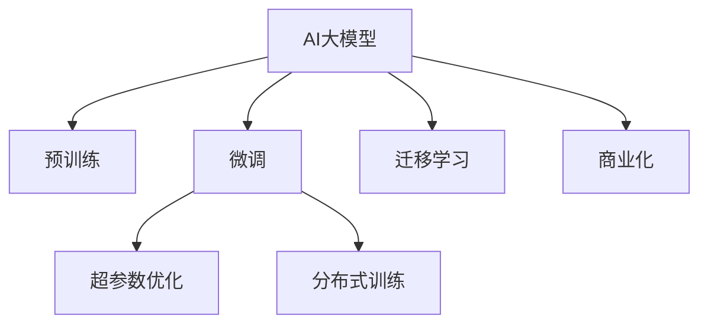

                 

# AI大模型创业：挑战与机遇并存的趋势分析

> 关键词：人工智能大模型，创业机会，市场竞争，技术壁垒，商业化挑战，未来趋势

## 1. 背景介绍

### 1.1 问题由来

在人工智能快速发展的今天，大模型（Large Model）在各个领域中大放异彩。这些模型基于深度学习技术，拥有海量的参数和强大的学习能力，能够处理复杂任务，带来前所未有的性能提升。从图像识别到自然语言处理，大模型正在改变世界。

然而，随着大模型的规模不断增大，其研发和部署的难度也在增加。大模型创业公司面临的不仅仅是技术挑战，更有商业化难题。如何把握机遇，迎接挑战，是所有创业者的思考重点。

### 1.2 问题核心关键点

AI大模型的创业机会，主要来源于以下几方面：

- **技术先进性**：大模型在特定任务上的性能通常优于传统模型，具有技术优势。
- **数据依赖性**：大模型的性能高度依赖于高质量的训练数据，数据标注成本较高。
- **资源需求高**：大模型的训练需要强大的计算资源和存储能力。
- **应用广泛性**：大模型在多个领域（如图像识别、自然语言处理、推荐系统等）都有广泛应用。
- **商业化障碍**：大规模模型的训练和部署成本高，且对数据隐私和安全有严格要求。

本文将围绕大模型的创业机会，从技术、市场、资源、应用和商业化等多个维度进行全面分析，探讨其在创业过程中的挑战与机遇。

## 2. 核心概念与联系

### 2.1 核心概念概述

为更好地理解AI大模型创业的挑战与机遇，本节将介绍几个关键概念及其相互关系：

- **AI大模型（Large Model）**：基于深度学习技术，拥有海量参数和复杂结构的模型，如GPT-3、BERT、ResNet等。这些模型在特定任务上通常表现优异。
- **预训练（Pre-training）**：在大规模无标签数据上进行的深度学习训练，以构建通用知识表示。
- **微调（Fine-tuning）**：在预训练模型的基础上，使用有标签数据进行特定任务训练，以提高模型在该任务上的性能。
- **迁移学习（Transfer Learning）**：将预训练模型的知识迁移到新的任务中，以减少训练时间和数据需求。
- **超参数优化（Hyperparameter Tuning）**：调整模型的超参数，以优化模型性能。
- **分布式训练（Distributed Training）**：将模型训练任务分布在多个计算节点上，以提升训练效率。
- **商业化（Commercialization）**：将技术转化为商业应用的过程，包括模型的训练、部署、服务化等。

这些概念之间的联系可以通过以下Mermaid流程图来展示：



此图展示了AI大模型从预训练到商业化的全过程，突出了微调和迁移学习在大模型应用中的重要性。

## 3. 核心算法原理 & 具体操作步骤

### 3.1 算法原理概述

AI大模型的创业机会，本质上来源于其在特定任务上的性能优势。核心算法原理包括以下几个方面：

- **深度学习模型**：基于神经网络结构的模型，能够处理复杂数据和任务。
- **自监督学习**：在大规模无标签数据上进行的训练，以构建通用的知识表示。
- **迁移学习**：利用预训练模型的知识，减少新任务上的训练数据需求。
- **超参数优化**：通过调整模型的超参数，如学习率、批量大小等，优化模型性能。

这些算法原理在大模型创业过程中，需要根据具体应用场景进行合理应用。

### 3.2 算法步骤详解

AI大模型创业的具体操作步骤如下：

**Step 1: 数据准备**

- **数据收集**：收集与目标任务相关的数据，如文本、图像、音频等。
- **数据预处理**：清洗和标注数据，将其转化为模型可接受的格式。
- **数据增强**：通过数据扩充、变换等技术，增加训练集的多样性。

**Step 2: 模型选择与预训练**

- **模型选择**：选择与目标任务匹配的预训练模型，如BERT、ResNet等。
- **预训练**：在大规模无标签数据上进行预训练，构建通用的知识表示。

**Step 3: 模型微调**

- **任务适配层设计**：在预训练模型的基础上，设计适合特定任务的输出层和损失函数。
- **微调训练**：使用标注数据对模型进行微调训练，优化模型在该任务上的性能。
- **超参数优化**：调整学习率、批量大小等超参数，以提高训练效率和模型性能。

**Step 4: 模型部署**

- **模型保存**：将训练好的模型保存为特定格式，如TensorFlow SavedModel、PyTorch模型文件等。
- **模型服务化**：将模型部署为API服务，供外部应用调用。
- **性能监控**：实时监控模型性能，根据实际情况进行调整。

**Step 5: 商业化落地**

- **产品开发**：基于模型服务，开发具体应用产品。
- **用户反馈**：收集用户反馈，不断优化模型和产品。
- **市场推广**：通过各种渠道，推广产品和服务。

### 3.3 算法优缺点

AI大模型的创业机会，带来了诸多优势，同时也存在一些挑战：

**优势**：
- **高性能**：在大规模数据和强大计算资源支持下，大模型通常能够在特定任务上取得优异性能。
- **通用性**：预训练模型通常具有较强的泛化能力，能够适应多种任务和数据。
- **技术壁垒高**：大模型的开发需要高水平的技术团队和大量资源投入。

**挑战**：
- **资源需求高**：大规模模型训练需要高性能计算资源和大量数据，成本较高。
- **数据依赖性**：高质量的标注数据对模型性能至关重要，获取成本较高。
- **商业化难度大**：如何将技术转化为稳定的商业应用，是一大难题。
- **模型复杂性**：大模型结构复杂，调整和优化难度较大。

## 4. 数学模型和公式 & 详细讲解 & 举例说明

### 4.1 数学模型构建

AI大模型的核心算法通常基于深度神经网络，其数学模型构建如下：

假设输入为 $x$，输出为 $y$，模型参数为 $\theta$，损失函数为 $\mathcal{L}$，则模型预测函数为：

$$
y = f_{\theta}(x)
$$

其中，$f_{\theta}$ 表示模型的前向传播过程。

损失函数 $\mathcal{L}$ 用于衡量模型预测输出与真实标签之间的差异，常用损失函数包括交叉熵损失、均方误差损失等。

### 4.2 公式推导过程

以交叉熵损失函数为例，其公式推导如下：

假设模型的输出为 $\hat{y}$，真实标签为 $y$，则交叉熵损失函数定义为：

$$
\mathcal{L}(\hat{y},y) = -y\log \hat{y} - (1-y)\log (1-\hat{y})
$$

在模型训练过程中，需要最小化损失函数 $\mathcal{L}$，通过梯度下降等优化算法更新模型参数 $\theta$。

具体步骤如下：
1. **前向传播**：将输入 $x$ 通过模型 $f_{\theta}$，得到预测输出 $\hat{y}$。
2. **计算损失**：使用交叉熵损失函数计算预测输出与真实标签之间的损失 $\mathcal{L}$。
3. **反向传播**：计算损失 $\mathcal{L}$ 对模型参数 $\theta$ 的梯度，更新模型参数。

### 4.3 案例分析与讲解

以自然语言处理任务为例，假设任务为文本分类。具体步骤如下：

1. **数据准备**：收集与分类任务相关的文本数据，并进行预处理和标注。
2. **模型选择**：选择预训练的BERT模型。
3. **微调训练**：在标注数据集上对BERT模型进行微调训练，设计适合分类任务的输出层和损失函数。
4. **超参数优化**：调整学习率、批量大小等超参数，优化模型性能。
5. **模型部署**：将训练好的模型保存为模型文件，并部署为API服务。

## 5. 项目实践：代码实例和详细解释说明

### 5.1 开发环境搭建

在进行AI大模型创业项目开发前，需要准备好开发环境。以下是Python环境下大模型创业的开发环境搭建流程：

1. **安装Python**：从官网下载并安装Python，建议安装最新版本。
2. **安装PyTorch**：使用pip命令安装PyTorch库，如 `pip install torch torchvision torchaudio`。
3. **安装TensorFlow**：同样使用pip命令安装TensorFlow库，如 `pip install tensorflow`。
4. **安装相关工具**：如Jupyter Notebook、Git等，方便项目开发和管理。

### 5.2 源代码详细实现

以下是一个基于BERT模型的文本分类项目示例代码：

```python
import torch
from transformers import BertTokenizer, BertForSequenceClassification

# 加载模型和分词器
model = BertForSequenceClassification.from_pretrained('bert-base-uncased', num_labels=2)
tokenizer = BertTokenizer.from_pretrained('bert-base-uncased')

# 加载训练数据
train_data = ...
train_labels = ...

# 数据预处理
def tokenize(text):
    tokens = tokenizer.tokenize(text)
    return [tokenizer.convert_tokens_to_ids(tokens)]

# 训练模型
device = torch.device('cuda' if torch.cuda.is_available() else 'cpu')
model.to(device)
optimizer = torch.optim.Adam(model.parameters(), lr=2e-5)
model.train()
for epoch in range(5):
    for text, label in train_data:
        input_ids = torch.tensor(tokenize(text)).to(device)
        attention_mask = torch.tensor([[1]*len(input_ids)]).to(device)
        labels = torch.tensor(label).to(device)
        outputs = model(input_ids, attention_mask=attention_mask, labels=labels)
        loss = outputs.loss
        optimizer.zero_grad()
        loss.backward()
        optimizer.step()
    print(f'Epoch {epoch+1}, loss: {loss.item()}')

# 模型保存
model.save_pretrained('model/')

# 模型部署
from flask import Flask, request
app = Flask(__name__)
@app.route('/predict', methods=['POST'])
def predict():
    data = request.json['data']
    input_ids = torch.tensor(tokenize(data)).to(device)
    attention_mask = torch.tensor([[1]*len(input_ids)]).to(device)
    with torch.no_grad():
        outputs = model(input_ids, attention_mask=attention_mask)
        pred_label = outputs.argmax().item()
    return {'pred_label': pred_label}
```

### 5.3 代码解读与分析

上述代码实现了一个基于BERT模型的文本分类器，其主要步骤如下：

1. **加载模型和分词器**：使用Transformers库加载预训练的BERT模型和分词器。
2. **加载训练数据**：从数据集中加载文本和标签，并进行预处理。
3. **数据预处理**：使用分词器将文本转换为模型可以接受的格式，即token ids。
4. **训练模型**：在GPU上训练模型，使用Adam优化器进行梯度更新。
5. **模型保存**：将训练好的模型保存为模型文件。
6. **模型部署**：使用Flask框架实现模型服务，提供API接口供外部调用。

## 6. 实际应用场景

### 6.1 智能客服

智能客服是大模型创业的重要应用场景之一。通过大模型，客服系统可以自动理解用户意图，并提供准确的回复。具体应用包括：

1. **自然语言理解**：使用大模型对用户输入进行理解，提取出关键信息。
2. **意图识别**：将用户意图分类为不同类型，如问题解答、订单处理等。
3. **回复生成**：根据用户意图和上下文，生成合适的回复。

### 6.2 医疗诊断

在医疗领域，大模型可以通过分析患者症状和病历，辅助医生进行诊断和治疗。具体应用包括：

1. **症状识别**：根据患者描述，识别出可能的症状。
2. **疾病诊断**：根据病历和症状，推断出可能的疾病类型。
3. **治疗方案**：根据诊断结果，推荐合适的治疗方案。

### 6.3 金融风险控制

金融行业需要实时监控市场动态，预测风险。大模型可以通过分析新闻、报告等文本数据，预测股票市场变化。具体应用包括：

1. **市场分析**：分析市场新闻、报告等文本数据，预测市场趋势。
2. **风险预测**：根据市场动态，预测股票价格变化，规避风险。
3. **交易策略**：根据预测结果，制定交易策略。

## 7. 工具和资源推荐

### 7.1 学习资源推荐

以下是一些推荐的AI大模型创业学习资源：

1. **《深度学习》（Ian Goodfellow）**：深度学习领域的经典教材，详细介绍了深度学习的基本概念和算法。
2. **《TensorFlow实战》（Claudia Yannakakis）**：TensorFlow实战指南，包含大量代码示例和项目实践。
3. **Coursera深度学习课程**：斯坦福大学和Coursera合作的深度学习课程，适合初学者和进阶者。
4. **Kaggle竞赛**：参加Kaggle数据科学竞赛，锻炼实际项目开发能力。
5. **Github开源项目**：通过Github上的开源项目，学习和借鉴他人的代码实现。

### 7.2 开发工具推荐

以下是一些推荐的AI大模型创业开发工具：

1. **PyTorch**：深度学习框架，适合研究和开发。
2. **TensorFlow**：由Google开发的深度学习框架，适合大规模工程应用。
3. **Jupyter Notebook**：交互式Python开发环境，适合快速迭代和实验。
4. **TensorBoard**：TensorFlow的可视化工具，方便调试和监控模型。
5. **Git**：版本控制系统，方便项目管理和协作。

### 7.3 相关论文推荐

以下是一些推荐的AI大模型创业相关论文：

1. **Attention is All You Need**：Transformer模型的开创性论文，奠定了深度学习模型的基础。
2. **BERT: Pre-training of Deep Bidirectional Transformers for Language Understanding**：BERT模型的基础论文，介绍了预训练和微调技术。
3. **Towards Better Understanding of Pre-trained Deep Learning Models**：关于预训练模型研究的综述性论文。
4. **Deep Learning for Healthcare**：医学领域的深度学习研究综述。
5. **Neural Network Architectures for Scalable AI**：关于深度学习模型架构的研究论文。

## 8. 总结：未来发展趋势与挑战

### 8.1 研究成果总结

AI大模型创业机会主要来源于其在特定任务上的性能优势，但同时也面临诸多挑战。以下是对现有研究的总结：

1. **技术进步**：深度学习模型不断进步，性能不断提升。
2. **数据驱动**：高质量的标注数据对模型性能至关重要。
3. **资源需求**：大规模模型的训练和部署需要大量资源。
4. **应用广泛**：大模型在多个领域都有广泛应用。
5. **商业化障碍**：将技术转化为商业应用是一大难题。

### 8.2 未来发展趋势

未来AI大模型创业的发展趋势包括：

1. **技术不断进步**：深度学习模型的性能将不断提升。
2. **数据需求降低**：自监督学习、主动学习等技术将减少对标注数据的依赖。
3. **资源优化**：分布式训练、模型压缩等技术将优化资源需求。
4. **应用场景丰富**：AI大模型将在更多领域得到应用。
5. **商业化加速**：开源社区和技术生态将加速大模型的商业化进程。

### 8.3 面临的挑战

AI大模型创业过程中面临的挑战包括：

1. **数据获取困难**：高质量的标注数据获取成本高。
2. **资源投入大**：大规模模型的训练和部署需要大量资源。
3. **模型复杂度高**：模型结构和超参数调整难度大。
4. **商业化困难**：将技术转化为商业应用存在一定难度。
5. **伦理和安全问题**：模型偏见和隐私问题需要考虑。

### 8.4 研究展望

未来AI大模型创业的研究展望包括：

1. **自监督学习**：利用无标签数据进行模型训练。
2. **数据增强**：通过数据扩充、变换等技术，增加训练集的多样性。
3. **分布式训练**：将模型训练任务分布在多个计算节点上，提升训练效率。
4. **模型压缩**：通过剪枝、量化等技术，减小模型尺寸。
5. **伦理和安全**：考虑模型偏见和隐私问题，建立监管机制。

## 9. 附录：常见问题与解答

**Q1: 大模型训练和部署需要哪些资源？**

A: 大模型训练和部署需要高性能计算资源、大量数据和存储资源。具体而言，需要高性能GPU/TPU、高速存储和带宽、大型数据集和标注工具等。

**Q2: 大模型训练过程中如何防止过拟合？**

A: 防止大模型过拟合的方法包括数据增强、正则化、早停等。数据增强可以通过回译、近义替换等方式扩充训练集；正则化可以采用L2正则、Dropout等技术；早停可以在验证集上监控模型性能，提前停止训练。

**Q3: 如何评估大模型在不同任务上的性能？**

A: 评估大模型性能通常使用常见的性能指标，如准确率、召回率、F1分数等。同时，也可以通过可视化工具（如TensorBoard）来监控模型训练过程和性能变化。

**Q4: 大模型的商业化过程中需要注意哪些问题？**

A: 大模型的商业化过程中需要注意数据隐私、模型安全、用户体验等问题。需要建立数据隐私保护机制，确保数据安全；同时，需要考虑用户反馈和需求，不断优化产品和服务。

通过本文的全面分析，我们可以更好地理解AI大模型创业的挑战与机遇，从而在实际项目中更好地把握技术优势和市场机会，推动AI技术在各个领域的应用和落地。

