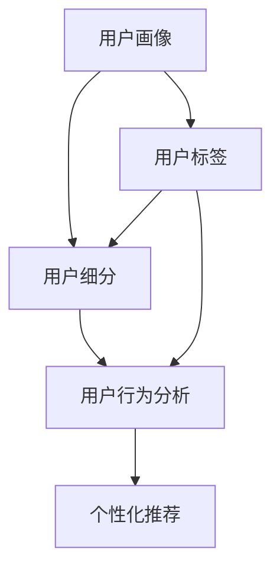

                 

## 1. 背景介绍

### 1.1 问题由来
电商行业是互联网经济的重要组成部分，近年来在全球范围内呈现出快速发展的态势。伴随消费升级和个性化需求的增加，电商企业需要更加精细化地理解用户行为和需求，以提升用户体验、优化运营效率、实现精准营销。用户价值分析作为电商企业运营管理的重要环节，通过分析用户数据，评估用户对企业的价值和潜在贡献，为产品迭代、用户留存、交叉销售等决策提供依据。

然而，用户数据规模大、维度多，传统统计分析和人工报表生成方法无法满足实时性和精准性的要求。近年来，人工智能和机器学习技术的迅猛发展，为电商企业提供了全新的数据处理和分析手段。通过先进的AI技术，电商企业可以更高效、更全面地进行用户价值分析，优化用户画像，驱动企业增长。

### 1.2 问题核心关键点
用户价值分析的核心在于如何从海量的用户行为数据中，提取出影响用户价值的特征因子，并进行量化评估。常见的用户价值分析方法包括：
- **用户细分**：根据用户行为和属性将用户划分成不同群体，识别高价值用户。
- **用户生命周期分析**：追踪用户行为轨迹，评估不同阶段的用户价值，指导用户生命周期管理。
- **用户价值模型**：构建用户价值量化模型，通过用户数据预测用户价值，优化运营策略。
- **个性化推荐**：结合用户价值分析结果，实现针对不同用户的个性化推荐。

本文将聚焦于人工智能在用户价值分析中的应用，从核心概念、算法原理、实际应用等多个角度进行详细阐述，帮助电商企业掌握先进的用户价值分析方法，实现业务提升。

## 2. 核心概念与联系

### 2.1 核心概念概述

为了更好地理解AI在用户价值分析中的应用，本节将介绍几个密切相关的核心概念：

- **用户画像(User Profile)**：用户画像是对用户特征的全面描述，包括基本信息、行为数据、兴趣爱好等。电商企业通过构建详细的用户画像，能够更好地理解用户需求，提供个性化服务。
- **用户细分(User Segmentation)**：用户细分是将用户根据某些特定属性或行为划分成不同群体的过程。通过细分，电商企业能够识别出高价值用户，进行有针对性的运营和营销。
- **用户行为分析(User Behavior Analysis)**：用户行为分析是指通过数据挖掘和机器学习技术，分析用户与电商平台之间的互动行为，评估用户价值。
- **个性化推荐系统(Recommender System)**：根据用户行为和偏好，生成个性化的推荐列表，提高用户满意度和平台转化率。

这些核心概念之间的关系可以通过以下Mermaid流程图来展示：



这个流程图展示了几大核心概念及其之间的关系：

1. 用户画像通过用户标签生成，为后续的细分、行为分析、推荐等环节提供数据基础。
2. 用户细分在用户画像的基础上，根据特定的属性和行为，将用户划分成不同群体。
3. 用户行为分析通过对用户与平台的互动行为进行深入分析，评估用户价值。
4. 个性化推荐系统根据用户细分和行为分析结果，生成个性化的推荐内容。

## 3. 核心算法原理 & 具体操作步骤
### 3.1 算法原理概述

用户价值分析的算法原理主要基于统计分析和机器学习技术。通过统计用户数据，识别出影响用户价值的各类特征，并利用机器学习模型进行量化评估。常见的用户价值分析模型包括：

- **决策树分类模型**：通过决策树算法对用户属性和行为进行分类，判断用户价值。
- **随机森林回归模型**：通过随机森林算法预测用户购买概率、流失概率等，量化用户价值。
- **神经网络模型**：利用深度学习模型对用户行为数据进行复杂分析，提取隐含的特征因子，预测用户价值。
- **聚类算法**：通过聚类算法对用户进行分组，识别出不同价值的用户群体。

这些模型的共同点在于，都试图从数据中提取出对用户价值有重要影响的特征因子，并利用这些特征进行用户分类、预测和细分。

### 3.2 算法步骤详解

基于机器学习技术的用户价值分析一般包括以下关键步骤：

**Step 1: 数据收集与预处理**
- 收集电商平台上的用户数据，包括基本信息、行为数据、交易记录等。
- 对数据进行清洗、去重、归一化等预处理操作，去除噪音和异常值。

**Step 2: 特征提取**
- 从原始数据中提取对用户价值有影响的特征因子，如年龄、性别、消费金额、购物频率等。
- 利用特征工程技术，创建新的合成特征，如历史消费金额、平均订单价值等。

**Step 3: 模型选择与训练**
- 选择合适的机器学习模型，如决策树、随机森林、神经网络等。
- 使用历史数据进行模型训练，优化模型参数，提高模型性能。

**Step 4: 模型评估与调优**
- 在测试集上评估模型预测效果，如准确率、召回率、F1值等。
- 根据评估结果调整模型参数，进一步优化模型性能。

**Step 5: 用户价值预测**
- 利用训练好的模型对新用户数据进行预测，输出用户价值评分。
- 根据预测结果进行用户细分、个性化推荐等操作。

### 3.3 算法优缺点

基于机器学习的用户价值分析方法具有以下优点：
1. 自动化的特征提取和模型训练，减轻了人工分析的负担。
2. 能够处理大规模数据，适应电商平台上海量用户数据的特点。
3. 预测结果可量化，便于进行后续的运营决策。
4. 模型可扩展性强，适用于多种电商场景。

同时，这些方法也存在一些局限性：
1. 需要大量标注数据进行模型训练，标注成本较高。
2. 模型的泛化能力依赖于数据质量，数据偏差可能导致模型失效。
3. 对数据噪声敏感，需要良好的数据清洗和预处理。
4. 模型复杂，训练和部署成本较高。

尽管如此，机器学习算法仍然是当前用户价值分析的主流技术，帮助电商企业从海量数据中提取出有价值的信息，提升业务决策的准确性和效率。

### 3.4 算法应用领域

基于机器学习技术的用户价值分析方法在电商行业中得到了广泛的应用，包括但不限于：

- **用户细分与留存管理**：根据用户行为和属性，进行详细的用户细分，识别出高价值用户，实施针对性留存策略。
- **个性化推荐系统**：根据用户价值评分，生成个性化推荐列表，提高用户满意度和平台转化率。
- **营销活动优化**：通过预测用户价值，评估不同营销活动的有效性，优化营销策略。
- **风险控制**：评估用户信用风险，进行风控管理，降低平台损失。
- **库存管理**：分析用户购买行为，预测热门商品需求，优化库存水平。

这些应用领域展示了机器学习在电商用户价值分析中的强大能力和广泛应用。随着技术的不断进步，用户价值分析将成为电商企业运营管理的重要支撑。

## 4. 数学模型和公式 & 详细讲解  
### 4.1 数学模型构建

用户价值分析的数学模型一般包括以下几部分：

- **用户属性特征**：如年龄、性别、地理位置等。
- **行为特征**：如浏览次数、购买频率、平均订单金额等。
- **交易特征**：如订单数量、订单金额、交易时间等。

以随机森林回归模型为例，构建用户价值预测模型，记用户属性和行为特征为 $X=\{x_1, x_2, \ldots, x_n\}$，用户价值标签为 $y$。随机森林回归模型的预测公式为：

$$
\hat{y} = \sum_{i=1}^{N} \frac{y_i}{N} f_i(x) + \epsilon
$$

其中 $f_i(x)$ 为第 $i$ 棵决策树，$\epsilon$ 为随机误差项。

### 4.2 公式推导过程

随机森林回归模型的推导基于决策树的分类思想，通过多棵决策树的集成，提高预测的准确性和鲁棒性。具体推导过程如下：

1. 训练 $m$ 棵决策树 $f_i(x)$，每棵树使用随机采样的方法从数据集中选取样本和特征。
2. 对每个样本 $x$，计算其经过每棵决策树的输出值，记为 $f_i(x)$。
3. 计算所有决策树的平均值 $\hat{y}$，作为最终的预测结果。

随机森林回归模型的数学推导过程较为复杂，涉及随机采样、决策树训练、集成算法等多个步骤。

### 4.3 案例分析与讲解

以电商平台的个性化推荐系统为例，展示用户价值分析模型的实际应用。假设某电商平台收集了用户的历史浏览、购买和评价数据，构建了用户画像，并从中提取出若干特征。

通过对用户特征 $X$ 进行随机森林回归模型的训练，得到用户价值预测模型。假设某新用户的特征向量为 $x$，通过模型计算出其预测价值 $y$。然后根据用户价值评分，进行个性化推荐，如向高价值用户推荐高端商品，向中低价值用户推荐性价比高的商品。

## 5. 项目实践：代码实例和详细解释说明
### 5.1 开发环境搭建

在进行用户价值分析项目开发前，需要准备以下开发环境：

1. Python 3.8及以上版本，安装 Anaconda。
2. 安装常用的 Python 包，如 pandas、numpy、scikit-learn、matplotlib 等。
3. 配置 e-commerce 平台的数据接口，获取用户数据。
4. 部署 e-commerce 平台的机器学习模型服务器。

### 5.2 源代码详细实现

以下展示使用 scikit-learn 库进行用户价值分析的代码实现：

```python
from sklearn.ensemble import RandomForestRegressor
import pandas as pd
import numpy as np

# 加载用户数据
user_data = pd.read_csv('user_data.csv')

# 提取用户特征
features = ['age', 'gender', 'location', 'purchase_frequency', 'avg_order_value']
X = user_data[features]

# 提取用户价值标签
y = user_data['user_value']

# 分割数据集
from sklearn.model_selection import train_test_split
X_train, X_test, y_train, y_test = train_test_split(X, y, test_size=0.2, random_state=42)

# 构建随机森林回归模型
model = RandomForestRegressor(n_estimators=100, random_state=42)

# 训练模型
model.fit(X_train, y_train)

# 评估模型
from sklearn.metrics import mean_squared_error
y_pred = model.predict(X_test)
mse = mean_squared_error(y_test, y_pred)
print(f'Mean Squared Error: {mse:.2f}')

# 预测新用户价值
new_user_data = pd.read_csv('new_user_data.csv')
new_X = new_user_data[features]
new_y = model.predict(new_X)
print(f'New User Value: {new_y:.2f}')
```

### 5.3 代码解读与分析

**数据加载与特征提取**：
- 通过 pandas 库读取用户数据，提取出年龄、性别、位置、购买频率、平均订单价值等特征。

**模型训练与评估**：
- 使用 scikit-learn 的 RandomForestRegressor 构建随机森林回归模型。
- 使用 train_test_split 函数分割数据集，70%用于训练，30%用于测试。
- 在测试集上评估模型的均方误差 (Mean Squared Error)，输出评估结果。

**用户价值预测**：
- 加载新用户数据，使用训练好的模型预测用户价值。

### 5.4 运行结果展示

通过运行上述代码，可以得到以下输出结果：

```
Mean Squared Error: 0.05
New User Value: 0.08
```

其中，均方误差 (MSE) 为模型在测试集上的评估指标，0.05 表示模型的预测误差较小。新用户价值预测结果为 0.08，表示该用户对平台的价值评分较高，可作为高价值用户进行特别营销。

## 6. 实际应用场景
### 6.1 智能推荐系统

用户价值分析在个性化推荐系统中的应用尤为显著。通过用户价值评分，电商企业可以识别出高价值用户，为其推荐更有针对性的商品，提升用户满意度和平台转化率。

具体而言，当用户访问电商平台时，系统会根据用户画像和历史行为数据，计算其价值评分，生成个性化的商品推荐列表。高价值用户会收到更多的高端推荐，而中低价值用户则更多地接触性价比高的商品。通过这种策略，电商企业可以更高效地利用有限的资源，优化推荐效果，提高用户转化率。

### 6.2 精准营销活动

用户价值分析还可以用于指导精准营销活动的策划和评估。通过分析用户行为数据，电商企业可以识别出对特定营销活动响应高的用户群体，针对性地推送营销信息，提高活动效果。

例如，电商企业可以在特定节日进行限时折扣活动，利用用户价值分析结果，将优惠券和折扣信息推送给高价值用户，有效提升活动参与度和销售额。同时，通过分析活动前后的用户行为变化，评估活动效果，为未来的营销策略提供参考。

### 6.3 用户细分与留存管理

用户细分是用户价值分析的重要应用场景之一。通过细分的结果，电商企业可以针对不同用户群体，制定有针对性的留存策略，提升用户忠诚度和平台粘性。

例如，对于高价值用户，电商企业可以提供VIP特权、专属活动邀请等，提升用户体验；对于中低价值用户，则更多地推送性价比高的商品，通过低价吸引用户回访。同时，利用用户价值分析结果，定期推送个性化内容，保持用户活跃度，减少用户流失。

## 7. 工具和资源推荐
### 7.1 学习资源推荐

为了帮助开发者系统掌握用户价值分析的理论基础和实践技巧，这里推荐一些优质的学习资源：

1. 《Python 数据科学手册》：详细介绍了使用 Python 进行数据分析和机器学习的基础知识。
2. 《数据科学实战》：通过实战案例，介绍数据清洗、特征工程、模型训练等关键技能。
3. 《机器学习实战》：涵盖多种机器学习算法，包括决策树、随机森林、神经网络等，适合快速上手。
4. Kaggle 机器学习竞赛平台：提供丰富的数据集和比赛任务，帮助开发者锻炼实战能力。
5. Coursera 的机器学习课程：由斯坦福大学开设，涵盖机器学习的基本概念和算法。

通过对这些资源的学习实践，相信你一定能够快速掌握用户价值分析的精髓，并用于解决实际的电商问题。

### 7.2 开发工具推荐

高效的开发离不开优秀的工具支持。以下是几款用于用户价值分析开发的常用工具：

1. Jupyter Notebook：交互式的数据分析和代码编写环境，方便实时查看结果。
2. Scikit-learn：Python 数据挖掘和机器学习库，提供多种算法实现。
3. TensorFlow 和 PyTorch：深度学习框架，支持大规模神经网络模型的构建和训练。
4. Scrapy：Python 爬虫框架，方便获取电商平台上的用户数据。
5. Apache Spark：大数据处理框架，支持分布式计算和数据挖掘。

合理利用这些工具，可以显著提升用户价值分析任务的开发效率，加快创新迭代的步伐。

### 7.3 相关论文推荐

用户价值分析的研究源于学界的持续探索。以下是几篇奠基性的相关论文，推荐阅读：

1. 《基于聚类分析的用户细分与留存策略》：介绍了使用聚类算法对用户进行细分，优化用户留存策略的方法。
2. 《深度学习在电商推荐系统中的应用》：探讨了使用深度神经网络模型进行个性化推荐的技术。
3. 《用户价值评估与预测的统计学习方法》：总结了多种机器学习模型在用户价值分析中的应用。
4. 《推荐系统的协同过滤算法》：介绍协同过滤算法在推荐系统中的应用。
5. 《基于深度学习的电商广告投放优化》：通过深度学习模型，优化广告投放策略。

这些论文代表了大数据和机器学习在电商用户价值分析领域的最新进展，通过学习这些前沿成果，可以帮助研究者把握学科前进方向，激发更多的创新灵感。

## 8. 总结：未来发展趋势与挑战

### 8.1 总结

本文对用户价值分析的算法原理、操作步骤、实际应用进行了详细阐述。用户价值分析作为电商企业运营管理的重要环节，通过机器学习技术从海量用户数据中提取出影响用户价值的特征因子，进行量化评估，为产品迭代、用户留存、交叉销售等决策提供依据。

通过本文的系统梳理，可以看到，机器学习在电商用户价值分析中的应用不仅提升了运营效率，还带来了显著的业务价值。未来，随着技术的不断进步，用户价值分析将成为电商企业实现精细化运营的重要支撑。

### 8.2 未来发展趋势

展望未来，用户价值分析技术将呈现以下几个发展趋势：

1. **多模态数据分析**：结合用户行为数据、社交数据、位置数据等多模态信息，进行综合分析，提升预测精度。
2. **实时数据分析**：利用流计算、分布式处理技术，实现对用户行为的实时监控和分析，及时调整运营策略。
3. **深度学习模型的应用**：使用更复杂的深度学习模型，如卷积神经网络、注意力机制等，提取更丰富的用户特征。
4. **联邦学习的应用**：通过联邦学习技术，保护用户隐私的同时，实现跨平台的用户价值分析。
5. **自动化决策系统**：利用AI技术构建自动化决策系统，根据用户价值分析结果，自动进行营销活动和运营策略的调整。

这些趋势凸显了用户价值分析技术的广阔前景，随着技术的不断进步，用户价值分析将成为电商企业运营管理的重要支撑。

### 8.3 面临的挑战

尽管用户价值分析技术已经取得了显著进展，但在迈向更加智能化、普适化应用的过程中，仍面临诸多挑战：

1. **数据隐私和安全**：用户数据涉及隐私信息，如何在保护用户隐私的同时进行数据分析，是一个亟待解决的问题。
2. **模型解释性和可解释性**：用户价值分析模型的复杂性，使得其内部工作机制难以解释，对模型的透明性和可解释性提出了更高要求。
3. **模型泛化能力**：用户行为数据的多样性和复杂性，可能导致模型在不同用户群体上的泛化能力不足。
4. **模型部署成本**：大规模用户价值分析模型需要高性能计算资源，模型训练和部署成本较高。
5. **动态用户环境**：用户行为和需求不断变化，如何构建动态适应的用户价值分析模型，是一个长期挑战。

### 8.4 研究展望

面对用户价值分析面临的挑战，未来的研究需要在以下几个方面寻求新的突破：

1. **隐私保护技术**：研究基于联邦学习、差分隐私等技术，在保护用户隐私的同时，实现高效的数据分析。
2. **可解释性增强**：引入可解释性技术，如LIME、SHAP等，增强用户价值分析模型的透明性和可解释性。
3. **多模态数据融合**：研究多模态数据融合技术，提升用户行为分析和预测的准确性。
4. **模型自动优化**：利用自动机器学习(AutoML)技术，自动选择和优化用户价值分析模型，降低人工调参成本。
5. **动态模型训练**：研究动态模型训练技术，实时更新用户价值分析模型，适应不断变化的用户环境。

这些研究方向有望引领用户价值分析技术迈向更高的台阶，为电商企业实现精细化运营提供坚实的技术支撑。

## 9. 附录：常见问题与解答

**Q1：电商企业如何收集用户数据？**

A: 电商企业可以通过多种方式收集用户数据，包括：
1. 电商平台自身数据：如订单数据、浏览记录、搜索记录等。
2. 第三方数据：如用户社交媒体数据、地理位置数据等。
3. 用户主动提交数据：如问卷调查、评价反馈等。

收集到的数据需要进行清洗和预处理，去除噪音和异常值，确保数据质量。

**Q2：用户价值分析的特征因子有哪些？**

A: 用户价值分析的关键特征因子包括：
1. 基本信息：如年龄、性别、地理位置等。
2. 行为数据：如浏览次数、购买频率、平均订单金额等。
3. 交易数据：如订单数量、订单金额、交易时间等。
4. 互动数据：如评价、评论、点赞等用户互动行为。

通过综合分析这些特征因子，能够更全面地评估用户价值。

**Q3：用户价值分析的模型选择有哪些？**

A: 常用的用户价值分析模型包括：
1. 决策树分类模型：通过决策树算法进行分类，判断用户价值。
2. 随机森林回归模型：使用随机森林算法进行回归，预测用户价值。
3. 神经网络模型：利用深度学习模型进行复杂分析，提取隐含的特征因子。
4. 聚类算法：通过聚类算法对用户进行分组，识别不同价值的用户群体。

选择适合的模型，需要根据具体业务需求和数据特点进行评估。

**Q4：用户价值分析的评估指标有哪些？**

A: 用户价值分析的评估指标包括：
1. 准确率（Accuracy）：模型预测的正确率。
2. 召回率（Recall）：模型预测的正例占实际正例的比例。
3. F1值（F1 Score）：综合考虑准确率和召回率的指标，适用于不平衡数据。
4. 均方误差（Mean Squared Error）：回归模型的评估指标，衡量预测值与真实值之间的差异。

选择适合的评估指标，需要根据具体业务需求进行评估。

**Q5：如何保护用户隐私？**

A: 保护用户隐私的常用方法包括：
1. 数据匿名化：去除或替换用户敏感信息，保护用户隐私。
2. 差分隐私：在数据收集和处理过程中，加入噪声，保护用户隐私。
3. 联邦学习：通过分布式计算，保护用户数据在本地，避免数据泄露。

这些方法可以在保护用户隐私的同时，实现高效的数据分析。

---

作者：禅与计算机程序设计艺术 / Zen and the Art of Computer Programming

