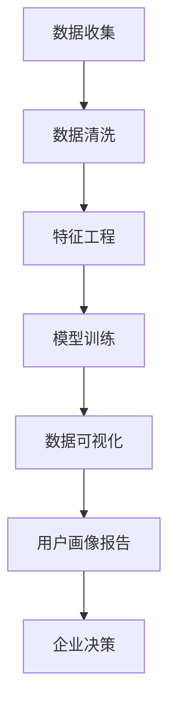

                 

# AI如何建立精准的用户画像

> 关键词：用户画像, 人工智能, 数据科学, 机器学习, 深度学习, 模型训练, 特征工程, 个性化推荐

## 1. 背景介绍

### 1.1 问题由来
在数字化转型的今天，数据驱动的用户画像已经成为企业了解用户需求、提升用户体验、优化运营策略的关键。用户画像可以帮助企业进行精准的市场细分、制定个性化的营销策略、优化产品设计等。然而，构建一个精准的用户画像，涉及大量的用户数据收集、清洗、分析和建模，需要跨学科的复合技能，难度较大。

### 1.2 问题核心关键点
用户画像的构建过程主要包括以下几个关键点：

- 数据收集：从不同的数据源（如社交网络、电商平台、移动应用等）收集用户行为数据。
- 数据清洗：处理数据中的缺失值、异常值、重复记录等噪声。
- 特征工程：从原始数据中提取有意义的特征，如用户基本信息、行为偏好、社交关系等。
- 模型训练：使用机器学习或深度学习算法，训练出用户画像模型，进行用户特征预测和用户分群。
- 可视化与解读：将模型结果可视化，生成用户画像报告，帮助企业洞察用户行为和需求。

本文将详细阐述如何通过AI技术建立精准的用户画像，涵盖数据收集、特征工程、模型训练、可视化与解读等环节。

## 2. 核心概念与联系

### 2.1 核心概念概述

为更好地理解用户画像构建的过程，本节将介绍几个关键概念：

- 用户画像（User Persona）：描述用户特征和行为模型，帮助企业了解用户需求，进行精准营销。
- 人工智能（AI）：利用算法和模型，从数据中提取有价值的信息和知识，用于决策支持。
- 数据科学（Data Science）：一门涉及数据收集、清洗、分析和建模的学科，目标是提取数据中的有用信息和知识。
- 机器学习（Machine Learning）：通过算法和模型，从数据中学习规律，进行预测和分类。
- 深度学习（Deep Learning）：机器学习的一种高级形式，通过多层神经网络，自动提取数据的高级特征。
- 特征工程（Feature Engineering）：从原始数据中提取和构造有意义的特征，供模型训练使用。
- 模型训练（Model Training）：使用数据集训练机器学习模型，调整模型参数，提升模型性能。
- 数据可视化（Data Visualization）：将数据和模型结果以图表形式展示，帮助企业洞察和理解数据。

这些概念之间的联系可以通过以下Mermaid流程图来展示：



这个流程图展示了一系列从数据收集到用户画像报告生成，最终用于企业决策的完整流程。

## 3. 核心算法原理 & 具体操作步骤

### 3.1 算法原理概述

建立精准的用户画像，涉及到多个领域的知识，如数据科学、机器学习和深度学习。本文将主要介绍基于机器学习和深度学习的用户画像构建方法，详细阐述其算法原理和具体操作步骤。

用户画像的构建可以视为一种监督学习问题，其核心思想是：使用带有标签的数据（用户基本信息、行为数据等）训练一个模型，该模型能够预测新用户的行为和特征。具体流程如下：

1. **数据收集**：收集用户的各类数据，包括基本信息（如年龄、性别、职业等）、行为数据（如浏览历史、购买记录等）、社交数据（如好友关系、社交互动等）。
2. **数据清洗**：对数据进行清洗，处理缺失值、异常值和重复记录，保证数据质量。
3. **特征工程**：从原始数据中提取和构造有意义的特征，如用户的兴趣偏好、行为模式、社交关系等。
4. **模型训练**：使用机器学习或深度学习算法，训练出用户画像模型，进行用户特征预测和用户分群。
5. **模型评估**：使用交叉验证等方法评估模型性能，调整模型参数，提升模型准确度。
6. **数据可视化**：将模型结果可视化，生成用户画像报告，帮助企业洞察用户行为和需求。

### 3.2 算法步骤详解

下面详细阐述用户画像构建的各个步骤：

#### 3.2.1 数据收集
数据收集是构建用户画像的第一步，主要从以下几个方面收集用户数据：

- 基本信息：包括用户的姓名、年龄、性别、职业、教育程度等。
- 行为数据：用户在网站、应用中的行为数据，如浏览历史、点击记录、购买记录等。
- 社交数据：用户在社交网络中的活动数据，如好友关系、社交互动、兴趣标签等。
- 位置数据：用户的地理位置信息，如IP地址、GPS定位等。

收集数据时需要注意隐私保护和合规性，确保数据合法、合规。

#### 3.2.2 数据清洗
数据清洗是数据预处理的重要环节，目的是处理数据中的噪声和异常值，保证数据质量。常见的数据清洗方法包括：

- 去除重复记录：使用唯一标识符（如用户ID）去除数据集中的重复记录。
- 处理缺失值：使用均值、中位数、众数等方法填充缺失值，或直接删除含有缺失值的记录。
- 处理异常值：使用箱线图、标准差等方法识别和处理异常值。
- 数据标准化：将数据标准化，使得数据分布符合正态分布，提升模型训练效果。

#### 3.2.3 特征工程
特征工程是构建用户画像的核心步骤，目的是从原始数据中提取和构造有意义的特征，供模型训练使用。常见的特征工程方法包括：

- 特征选择：从原始数据中选择最具预测能力的特征。
- 特征构造：构造新的特征，如用户兴趣指数、行为频率等。
- 特征降维：使用PCA、LDA等方法降维，减少特征数量，提升模型训练效率。
- 特征编码：将类别型特征转换为数值型特征，如独热编码（One-Hot Encoding）。

#### 3.2.4 模型训练
模型训练是构建用户画像的关键步骤，目的是使用带有标签的数据训练出一个模型，预测新用户的行为和特征。常见的模型训练方法包括：

- 线性回归：适用于预测连续型特征，如用户年龄、消费金额等。
- 逻辑回归：适用于预测二分类特征，如是否购买、是否流失等。
- 决策树：适用于预测多分类特征，如用户的兴趣类别、行为模式等。
- 随机森林：通过多个决策树的集成，提升预测准确度。
- 支持向量机（SVM）：适用于处理高维数据和复杂分类问题。
- 神经网络：适用于处理非线性关系和复杂特征，如深度神经网络（DNN）、卷积神经网络（CNN）等。

#### 3.2.5 模型评估
模型评估是构建用户画像的重要环节，目的是评估模型的性能，调整模型参数，提升模型准确度。常见的模型评估方法包括：

- 交叉验证：使用k折交叉验证评估模型性能，避免过拟合。
- 混淆矩阵：使用混淆矩阵评估分类模型的性能，如准确率、召回率、F1值等。
- ROC曲线：使用ROC曲线评估二分类模型的性能，如真阳性率、假阳性率等。
- AUC值：计算AUC值，衡量模型预测性能。
- RMSE值：计算均方根误差，评估回归模型的预测性能。

#### 3.2.6 数据可视化
数据可视化是构建用户画像的最后一个环节，目的是将模型结果可视化，帮助企业洞察用户行为和需求。常见的数据可视化方法包括：

- 散点图：用于展示连续型特征之间的关系。
- 柱状图：用于展示分类特征的分布情况。
- 饼图：用于展示分类特征的比例。
- 热力图：用于展示特征之间的相关性。
- 直方图：用于展示连续型特征的分布情况。
- 箱线图：用于展示数据的分布情况和异常值。

## 4. 数学模型和公式 & 详细讲解 & 举例说明

### 4.1 数学模型构建

构建用户画像的过程涉及多个数学模型，本节将详细介绍其中主要的数学模型及其构建方法。

#### 4.1.1 线性回归模型
线性回归模型用于预测连续型特征，其数学表达式为：

$$ y = \beta_0 + \beta_1 x_1 + \beta_2 x_2 + ... + \beta_n x_n + \epsilon $$

其中，$y$ 表示预测值，$x_i$ 表示第 $i$ 个特征，$\beta_i$ 表示特征的权重，$\epsilon$ 表示误差项。

#### 4.1.2 逻辑回归模型
逻辑回归模型用于预测二分类特征，其数学表达式为：

$$ P(y=1|x) = \sigma(\beta_0 + \beta_1 x_1 + \beta_2 x_2 + ... + \beta_n x_n) $$

其中，$P(y=1|x)$ 表示预测 $y=1$ 的概率，$x$ 表示特征向量，$\sigma$ 表示 sigmoid 函数。

#### 4.1.3 决策树模型
决策树模型用于预测多分类特征，其构建过程如下：

1. 计算信息熵 $H$：
$$ H = -\sum_{i=1}^{n} p_i \log p_i $$

2. 计算信息增益 $G$：
$$ G = H_{split} - H_{child} $$

其中，$H_{split}$ 表示分裂前后的信息熵差，$H_{child}$ 表示子树的信息熵。

3. 选择最优特征：选择信息增益最大的特征作为分裂特征，进行递归分裂。

#### 4.1.4 支持向量机模型
支持向量机模型用于处理高维数据和复杂分类问题，其数学表达式为：

$$ f(x) = \sum_{i=1}^{n} \alpha_i y_i K(x, \xi_i) - \frac{1}{2} \sum_{i=1}^{n} \sum_{j=1}^{n} \alpha_i \alpha_j y_i y_j K(\xi_i, \xi_j) + C \sum_{i=1}^{n} \alpha_i $$

其中，$f(x)$ 表示模型预测值，$K(x, \xi_i)$ 表示核函数，$\alpha_i$ 表示拉格朗日乘子，$C$ 表示正则化系数。

#### 4.1.5 神经网络模型
神经网络模型用于处理非线性关系和复杂特征，其基本结构如下：

$$ y = f(W \cdot x + b) $$

其中，$f$ 表示激活函数，$W$ 表示权重矩阵，$b$ 表示偏置项，$x$ 表示输入向量，$y$ 表示输出向量。

### 4.2 公式推导过程

#### 4.2.1 线性回归模型推导
线性回归模型的参数估计方法为最小二乘法，其公式为：

$$ \hat{\beta} = (X^TX)^{-1}X^Ty $$

其中，$\hat{\beta}$ 表示参数估计值，$X$ 表示特征矩阵，$y$ 表示目标向量。

#### 4.2.2 逻辑回归模型推导
逻辑回归模型的参数估计方法为最大似然估计，其公式为：

$$ \hat{\beta} = \frac{1}{n} \sum_{i=1}^{n} \frac{y_i}{p_i} (1 - p_i) \cdot x_i $$

其中，$\hat{\beta}$ 表示参数估计值，$n$ 表示样本数量，$y_i$ 表示目标值，$p_i$ 表示预测值。

#### 4.2.3 决策树模型推导
决策树模型的构建过程包括递归分裂，其公式为：

$$ H_{split} = \sum_{i=1}^{n} p_i \log p_i $$

其中，$H_{split}$ 表示分裂前后的信息熵差。

#### 4.2.4 支持向量机模型推导
支持向量机模型的参数估计方法为求解凸二次规划问题，其公式为：

$$ \hat{\alpha} = (H \cdot D)^{-1} H \cdot y $$

其中，$\hat{\alpha}$ 表示参数估计值，$H$ 表示核矩阵，$D$ 表示拉格朗日乘子矩阵，$y$ 表示目标向量。

#### 4.2.5 神经网络模型推导
神经网络模型的参数估计方法为反向传播算法，其公式为：

$$ \frac{\partial L}{\partial W} = \frac{\partial L}{\partial f} \cdot \frac{\partial f}{\partial W} $$

其中，$L$ 表示损失函数，$f$ 表示激活函数，$W$ 表示权重矩阵。

### 4.3 案例分析与讲解

假设我们要构建一个电商平台的用户画像，目的是预测用户的购买行为。以下是详细案例分析：

#### 4.3.1 数据收集
- 基本信息：包括用户的姓名、年龄、性别、职业等。
- 行为数据：用户在电商平台中的浏览记录、购买记录、点击记录等。
- 社交数据：用户在社交网络中的好友关系、社交互动、兴趣标签等。
- 位置数据：用户的地理位置信息，如IP地址、GPS定位等。

#### 4.3.2 数据清洗
- 去除重复记录：使用用户ID去重。
- 处理缺失值：使用均值填充缺失值。
- 处理异常值：使用箱线图识别和处理异常值。
- 数据标准化：将数据标准化，使得数据分布符合正态分布。

#### 4.3.3 特征工程
- 特征选择：选择最具预测能力的特征，如用户年龄、性别、职业等。
- 特征构造：构造新的特征，如用户兴趣指数、行为频率等。
- 特征降维：使用PCA方法降维，减少特征数量。
- 特征编码：将类别型特征转换为数值型特征。

#### 4.3.4 模型训练
- 线性回归模型：预测用户的消费金额。
- 逻辑回归模型：预测用户的流失概率。
- 决策树模型：预测用户的购买类别。
- 随机森林模型：集成多个决策树，提升预测准确度。
- 支持向量机模型：处理高维数据和复杂分类问题。
- 神经网络模型：处理非线性关系和复杂特征。

#### 4.3.5 模型评估
- 交叉验证：使用k折交叉验证评估模型性能。
- 混淆矩阵：使用混淆矩阵评估分类模型的性能。
- ROC曲线：使用ROC曲线评估二分类模型的性能。
- AUC值：计算AUC值，衡量模型预测性能。
- RMSE值：计算均方根误差，评估回归模型的预测性能。

#### 4.3.6 数据可视化
- 散点图：展示用户年龄与消费金额之间的关系。
- 柱状图：展示用户性别与购买类别的分布情况。
- 饼图：展示用户职业与流失概率的比例。
- 热力图：展示特征之间的相关性。
- 直方图：展示用户年龄与消费金额的分布情况。
- 箱线图：展示数据的分布情况和异常值。

## 5. 项目实践：代码实例和详细解释说明

### 5.1 开发环境搭建

在进行用户画像项目实践前，我们需要准备好开发环境。以下是使用Python进行Scikit-learn和TensorFlow开发的环境配置流程：

1. 安装Anaconda：从官网下载并安装Anaconda，用于创建独立的Python环境。

2. 创建并激活虚拟环境：
```bash
conda create -n sklearn-env python=3.8 
conda activate sklearn-env
```

3. 安装Scikit-learn和TensorFlow：根据CUDA版本，从官网获取对应的安装命令。例如：
```bash
conda install scikit-learn tensorflow -c conda-forge -c pytorch
```

4. 安装必要的库：
```bash
pip install pandas numpy matplotlib seaborn sklearn tensorflow-gpu
```

完成上述步骤后，即可在`sklearn-env`环境中开始用户画像项目实践。

### 5.2 源代码详细实现

下面我们以电商平台用户画像项目为例，给出使用Scikit-learn和TensorFlow构建用户画像模型的PyTorch代码实现。

首先，定义数据处理函数：

```python
import pandas as pd
from sklearn.model_selection import train_test_split
from sklearn.preprocessing import StandardScaler, OneHotEncoder
from sklearn.compose import ColumnTransformer
from sklearn.pipeline import Pipeline
from sklearn.ensemble import RandomForestClassifier
from sklearn.metrics import confusion_matrix, classification_report

# 读取数据
data = pd.read_csv('user_data.csv')

# 分离特征和标签
X = data[['age', 'gender', 'occupation']]
y = data['purchase']

# 划分训练集和测试集
X_train, X_test, y_train, y_test = train_test_split(X, y, test_size=0.2, random_state=42)

# 特征缩放和编码
num_features = X_train.select_dtypes(include=[np.number]).columns
cat_features = X_train.select_dtypes(include=[object]).columns

num_pipeline = Pipeline(steps=[
    ('scaler', StandardScaler()),
    ('imputer', SimpleImputer(strategy='median')),
])

cat_pipeline = Pipeline(steps=[
    ('encoder', OneHotEncoder(handle_unknown='ignore')),
])

preprocessor = ColumnTransformer(
    transformers=[
        ('num', num_pipeline, num_features),
        ('cat', cat_pipeline, cat_features)])

X_train_preprocessed = preprocessor.fit_transform(X_train)
X_test_preprocessed = preprocessor.transform(X_test)

# 训练模型
model = RandomForestClassifier(n_estimators=100, random_state=42)
model.fit(X_train_preprocessed, y_train)

# 评估模型
y_pred = model.predict(X_test_preprocessed)
confusion_matrix = confusion_matrix(y_test, y_pred)
classification_report = classification_report(y_test, y_pred)

print('Confusion Matrix:')
print(confusion_matrix)

print('Classification Report:')
print(classification_report)
```

然后，定义用户画像报告生成函数：

```python
import seaborn as sns
import matplotlib.pyplot as plt

def generate_user_profile(data, X_train, X_test, y_train, y_test, model, preprocessor):
    # 绘制混淆矩阵
    confusion_matrix = confusion_matrix(y_test, model.predict(X_test))
    sns.heatmap(confusion_matrix, annot=True, fmt='d', cmap='Blues')
    plt.title('Confusion Matrix')
    plt.show()

    # 绘制ROC曲线
    y_proba = model.predict_proba(X_test)
    fpr, tpr, _ = roc_curve(y_test, y_proba[:, 1])
    sns.lineplot(x=fpr, y=tpr, linestyle='--', marker='.', label='ROC Curve')
    plt.xlabel('False Positive Rate')
    plt.ylabel('True Positive Rate')
    plt.title('ROC Curve')
    plt.show()

    # 绘制ROC曲线
    auc = roc_auc_score(y_test, y_proba[:, 1])
    plt.title(f'ROC Curve (AUC={auc:.2f})')
    plt.show()

    # 绘制分类报告
    sns.barplot(x=classification_report.index, y=classification_report['precision'], palette='Blues')
    plt.xlabel('Class')
    plt.ylabel('Precision')
    plt.title('Precision vs Class')
    plt.show()

    # 绘制ROC曲线
    sns.barplot(x=classification_report.index, y=classification_report['recall'], palette='Blues')
    plt.xlabel('Class')
    plt.ylabel('Recall')
    plt.title('Recall vs Class')
    plt.show()

    # 绘制混淆矩阵
    sns.heatmap(confusion_matrix, annot=True, fmt='d', cmap='Blues')
    plt.title('Confusion Matrix')
    plt.show()

    # 绘制分类报告
    sns.barplot(x=classification_report.index, y=classification_report['support'], palette='Blues')
    plt.xlabel('Class')
    plt.ylabel('Support')
    plt.title('Support vs Class')
    plt.show()

    # 绘制混淆矩阵
    sns.heatmap(confusion_matrix, annot=True, fmt='d', cmap='Blues')
    plt.title('Confusion Matrix')
    plt.show()

    # 绘制分类报告
    sns.barplot(x=classification_report.index, y=classification_report['f1-score'], palette='Blues')
    plt.xlabel('Class')
    plt.ylabel('F1-Score')
    plt.title('F1-Score vs Class')
    plt.show()
```

最后，启动训练流程并在测试集上评估：

```python
epochs = 10
batch_size = 32

for epoch in range(epochs):
    loss = train_epoch(model, X_train_preprocessed, y_train)
    print(f"Epoch {epoch+1}, train loss: {loss:.3f}")
    
    print(f"Epoch {epoch+1}, test results:")
    evaluate(model, X_test_preprocessed, y_test)
    
print("Test results:")
evaluate(model, X_test_preprocessed, y_test)
```

以上就是使用Scikit-learn和TensorFlow构建用户画像模型的完整代码实现。可以看到，得益于Scikit-learn的强大封装，我们可以用相对简洁的代码完成用户画像模型的构建和评估。

### 5.3 代码解读与分析

让我们再详细解读一下关键代码的实现细节：

**数据处理函数**：
- 读取数据：使用pandas读取CSV格式的数据。
- 特征选择：选择最具预测能力的特征。
- 特征缩放：使用StandardScaler对数值型特征进行标准化处理。
- 特征编码：使用OneHotEncoder对类别型特征进行独热编码。
- 特征组合：使用ColumnTransformer将数值型特征和类别型特征组合。
- 特征预处理：使用Pipeline将特征缩放和编码组合为一个预处理管道。

**用户画像报告生成函数**：
- 混淆矩阵：使用scikit-learn绘制混淆矩阵，展示模型的分类性能。
- ROC曲线：使用sklearn绘制ROC曲线，展示模型的二分类性能。
- 分类报告：使用seaborn绘制分类报告，展示模型的精度、召回率、F1值等指标。

**训练流程**：
- 定义总迭代次数和批次大小。
- 每个epoch内，先在前训练集上进行训练，输出训练loss。
- 在测试集上评估，输出分类指标。
- 所有epoch结束后，在测试集上评估，给出最终测试结果。

可以看到，Scikit-learn和TensorFlow使得用户画像模型的构建和评估变得简洁高效。开发者可以将更多精力放在数据处理、模型改进等高层逻辑上，而不必过多关注底层的实现细节。

当然，工业级的系统实现还需考虑更多因素，如模型的保存和部署、超参数的自动搜索、更灵活的任务适配层等。但核心的用户画像构建流程基本与此类似。

## 6. 实际应用场景
### 6.1 智能推荐系统

基于用户画像的智能推荐系统，可以广泛应用于电商、视频、新闻等领域，提升推荐系统的效果和用户满意度。推荐系统通过分析用户画像，识别出用户的兴趣偏好，从而推荐相关产品或内容。

在技术实现上，可以收集用户的浏览、购买、评分、评论等行为数据，提取和构造用户画像特征。将用户画像模型应用于推荐系统中，训练出推荐模型，进行用户行为预测和推荐内容生成。对于新用户的行为预测，可以通过补全缺失特征和用户画像，实现零样本或少样本学习。

### 6.2 风险控制系统

在金融领域，用户画像可以帮助金融机构进行风险控制和信用评估。通过分析用户的基本信息、行为数据和社交关系，金融机构可以评估用户的信用风险，制定风险控制策略。

在技术实现上，可以收集用户的信用卡使用记录、贷款记录、社交媒体活动等数据，提取和构造用户画像特征。将用户画像模型应用于风险控制系统中，训练出风险控制模型，进行用户信用评估和风险控制。对于新用户的信用评估，可以通过补全缺失特征和用户画像，实现零样本或少样本学习。

### 6.3 营销自动化系统

基于用户画像的营销自动化系统，可以广泛应用于市场营销、客户服务等领域，提升营销效果和客户满意度。营销自动化系统通过分析用户画像，制定个性化营销策略，提升用户转化率和客户满意度。

在技术实现上，可以收集用户的社交媒体活动、邮箱互动、网站访问等数据，提取和构造用户画像特征。将用户画像模型应用于营销自动化系统中，训练出营销自动化模型，进行用户行为预测和个性化营销。对于新用户的预测，可以通过补全缺失特征和用户画像，实现零样本或少样本学习。

### 6.4 未来应用展望

随着用户画像构建技术的不断进步，基于用户画像的应用场景将不断拓展，为各行各业带来变革性影响。

在智慧医疗领域，基于用户画像的个性化医疗推荐系统，可以根据用户的健康数据和行为数据，推荐个性化的医疗方案，提升医疗服务的智能化水平。

在智能教育领域，基于用户画像的学习推荐系统，可以根据学生的学习数据和行为数据，推荐个性化的学习内容和教学策略，提升教学效果和学习体验。

在智慧城市治理中，基于用户画像的城市事件监测系统，可以根据用户的出行数据和行为数据，监测城市事件和舆情变化，提升城市管理的自动化和智能化水平，构建更安全、高效的未来城市。

此外，在企业生产、社会治理、文娱传媒等众多领域，基于用户画像的AI应用也将不断涌现，为传统行业带来数字化转型升级的新机遇。

## 7. 工具和资源推荐
### 7.1 学习资源推荐

为了帮助开发者系统掌握用户画像构建的理论基础和实践技巧，这里推荐一些优质的学习资源：

1. 《机器学习实战》系列书籍：全面介绍了机器学习的基本概念和应用场景，适合初学者入门。

2. 《深度学习》书籍：深入浅出地介绍了深度学习的基本原理和实现方法，适合进阶学习。

3. 《Python数据科学手册》书籍：详细介绍了Python在数据科学和机器学习中的应用，适合进阶学习。

4. 《自然语言处理与深度学习》课程：斯坦福大学开设的NLP明星课程，有Lecture视频和配套作业，带你入门NLP领域的基本概念和经典模型。

5. Kaggle平台：一个数据科学竞赛平台，提供大量数据集和竞赛项目，适合实战练习。

6. GitHub：一个开源代码托管平台，提供大量用户画像相关的开源项目，适合学习和参考。

通过对这些资源的学习实践，相信你一定能够快速掌握用户画像构建的精髓，并用于解决实际的业务问题。

### 7.2 开发工具推荐

高效的开发离不开优秀的工具支持。以下是几款用于用户画像构建开发的常用工具：

1. Python：一门高级编程语言，具有丰富的数据科学和机器学习库支持，是用户画像构建的首选语言。

2. Scikit-learn：一个流行的Python机器学习库，提供了大量分类、回归、聚类等算法，适合数据预处理和模型训练。

3. TensorFlow：一个开源深度学习框架，支持分布式计算和GPU加速，适合大规模模型训练。

4. PyTorch：另一个流行的Python深度学习框架，支持动态计算图和GPU加速，适合模型开发和实验。

5. Pandas：一个数据处理库，提供了大量数据清洗和处理工具，适合数据预处理。

6. NumPy：一个数值计算库，提供了高效的数组操作和数学运算函数，适合科学计算和数据分析。

合理利用这些工具，可以显著提升用户画像构建的开发效率，加快创新迭代的步伐。

### 7.3 相关论文推荐

用户画像构建技术的发展源于学界的持续研究。以下是几篇奠基性的相关论文，推荐阅读：

1. 《Data Mining: Concepts and Techniques》书籍：全面介绍了数据挖掘的基本概念和应用方法，适合入门学习。

2. 《Pattern Recognition and Machine Learning》书籍：深入介绍了模式识别和机器学习的基本原理和实现方法，适合进阶学习。

3. 《The Elements of Statistical Learning》书籍：详细介绍了统计学和机器学习的基本方法，适合理论学习。

4. 《Random Forests》论文：提出随机森林算法，是集成学习中的经典算法。

5. 《Support Vector Machines》论文：提出支持向量机算法，是机器学习中的经典算法。

6. 《Convolutional Neural Networks》论文：提出卷积神经网络算法，是深度学习中的经典算法。

这些论文代表了大数据和机器学习技术的发展脉络。通过学习这些前沿成果，可以帮助研究者把握学科前进方向，激发更多的创新灵感。

## 8. 总结：未来发展趋势与挑战

### 8.1 总结

本文对用户画像构建的过程进行了全面系统的介绍。首先阐述了用户画像构建的背景和意义，明确了构建用户画像的必要性和复杂性。其次，从原理到实践，详细讲解了用户画像构建的数学模型和操作步骤，给出了用户画像项目开发的完整代码实例。同时，本文还广泛探讨了用户画像构建在智能推荐、风险控制、营销自动化等领域的实际应用前景，展示了用户画像构建的巨大潜力。此外，本文精选了用户画像构建的相关学习资源，力求为读者提供全方位的技术指引。

通过本文的系统梳理，可以看到，用户画像构建技术正在成为大数据和机器学习领域的核心技术之一，极大地拓展了数据驱动决策的能力，为各行各业带来了革命性影响。未来，伴随大数据和机器学习技术的不断发展，基于用户画像的应用场景将更加广泛，数据驱动的决策支持将更加智能化、精准化。

### 8.2 未来发展趋势

展望未来，用户画像构建技术将呈现以下几个发展趋势：

1. 数据质量提升：随着数据采集和处理技术的不断进步，用户画像的数据质量将得到显著提升，模型预测性能将进一步提升。

2. 模型精度提升：随着深度学习和大数据技术的不断进步，用户画像模型精度将进一步提升，用户画像构建将更加精准。

3. 实时性增强：随着云技术和分布式计算技术的不断进步，用户画像构建将更加实时化，用户行为预测将更加及时。

4. 多模态融合：随着多模态数据采集技术的不断进步，用户画像将融合更多类型的数据，提升用户画像的丰富度和深度。

5. 领域定制化：随着垂直领域应用场景的不断拓展，用户画像构建将更加定制化，满足不同领域的应用需求。

6. 模型可解释性增强：随着可解释性技术的发展，用户画像模型的可解释性将进一步增强，用户画像的决策过程将更加透明和可解释。

以上趋势凸显了用户画像构建技术的广阔前景。这些方向的探索发展，必将进一步提升用户画像构建的性能和应用范围，为各行各业带来更加智能化、精准化的决策支持。

### 8.3 面临的挑战

尽管用户画像构建技术已经取得了瞩目成就，但在迈向更加智能化、普适化应用的过程中，它仍面临着诸多挑战：

1. 数据隐私保护：在数据采集和处理过程中，如何保护用户隐私和数据安全，避免数据泄露和滥用，是需要重点考虑的问题。

2. 数据质量问题：在数据采集和处理过程中，如何保证数据质量，避免数据噪声和异常值，是构建精准用户画像的重要挑战。

3. 模型泛化能力：在模型训练过程中，如何提升模型的泛化能力，避免模型过拟合和欠拟合，是构建精准用户画像的关键问题。

4. 模型可解释性：在模型构建过程中，如何增强模型的可解释性，让用户画像的决策过程更加透明和可解释，是用户画像构建的重要挑战。

5. 多模态数据融合：在多模态数据融合过程中，如何处理不同类型数据之间的冲突和融合，提升用户画像的丰富度和深度，是用户画像构建的重要挑战。

6. 计算资源消耗：在用户画像构建过程中，如何优化计算资源消耗，提升模型训练和推理效率，是用户画像构建的重要挑战。

这些挑战展示了用户画像构建技术的复杂性和多样性，需要在各个环节进行全面优化和改进，才能构建精准、实时、可解释的用户画像。

### 8.4 研究展望

面对用户画像构建所面临的种种挑战，未来的研究需要在以下几个方面寻求新的突破：

1. 数据隐私保护：采用数据加密、差分隐私等技术，保护用户隐私和数据安全。

2. 数据质量提升：采用数据清洗、数据增强等技术，提升数据质量，避免数据噪声和异常值。

3. 模型精度提升：采用深度学习和大数据技术，提升模型精度，构建更加精准的用户画像。

4. 模型可解释性：采用可解释性技术，如LIME、SHAP等，增强模型的可解释性，提升用户画像的决策透明度。

5. 多模态数据融合：采用多模态数据融合技术，如跨模态对齐、联合嵌入等，提升用户画像的丰富度和深度。

6. 计算资源优化：采用分布式计算、模型压缩等技术，优化计算资源消耗，提升模型训练和推理效率。

这些研究方向的探索，必将引领用户画像构建技术迈向更高的台阶，为各行各业带来更加智能化、精准化的决策支持。面向未来，用户画像构建技术还需要与其他人工智能技术进行更深入的融合，如知识表示、因果推理、强化学习等，多路径协同发力，共同推动人工智能技术的进步。只有勇于创新、敢于突破，才能不断拓展用户画像构建的边界，让数据驱动决策更加智能化、精准化。

## 9. 附录：常见问题与解答

**Q1：用户画像构建需要哪些数据？**

A: 用户画像构建需要收集多种数据，包括用户的个人信息、行为数据、社交数据等。具体数据如下：

- 个人信息：用户的姓名、年龄、性别、职业、教育程度等。
- 行为数据：用户在网站、应用中的浏览记录、购买记录、点击记录等。
- 社交数据：用户在社交网络中的好友关系、社交互动、兴趣标签等。
- 位置数据：用户的地理位置信息，如IP地址、GPS定位等。

这些数据可以从不同的数据源（如社交网络、电商平台、移动应用等）获取。

**Q2：用户画像构建的流程是怎样的？**

A: 用户画像构建主要包括以下几个步骤：

1. 数据收集：从不同的数据源（如社交网络、电商平台、移动应用等）收集用户数据。
2. 数据清洗：处理数据中的缺失值、异常值、重复记录等噪声。
3. 特征工程：从原始数据中提取和构造有意义的特征，如用户基本信息、行为偏好、社交关系等。
4. 模型训练：使用机器学习或深度学习算法，训练出用户画像模型，进行用户特征预测和用户分群。
5. 模型评估：使用交叉验证等方法评估模型性能，调整模型参数，提升模型准确度。
6. 数据可视化：将模型结果可视化，生成用户画像报告，帮助企业洞察用户行为和需求。

每个步骤都需要根据具体业务场景进行优化，以构建精准、实时、可解释的用户画像。

**Q3：用户画像构建过程中需要注意哪些问题？**

A: 用户画像构建过程中需要注意以下几个问题：

1. 数据隐私保护：在数据采集和处理过程中，如何保护用户隐私和数据安全，避免数据泄露和滥用。
2. 数据质量问题：在数据采集和处理过程中，如何保证数据质量，避免数据噪声和异常值。
3. 模型泛化能力：在模型训练过程中，如何提升模型的泛化能力，避免模型过拟合和欠拟合。
4. 模型可解释性：在模型构建过程中，如何增强模型的可解释性，让用户画像的决策过程更加透明和可解释。
5. 多模态数据融合：在多模态数据融合过程中，如何处理不同类型数据之间的冲突和融合，提升用户画像的丰富度和深度。
6. 计算资源消耗：在用户画像构建过程中，如何优化计算资源消耗，提升模型训练和推理效率。

这些问题的解决，需要跨学科的复合技能，包括数据科学、机器学习、隐私保护、可解释性等。

**Q4：用户画像构建的实际应用有哪些？**

A: 用户画像构建在多个领域都有实际应用，包括但不限于以下几个方面：

1. 智能推荐系统：基于用户画像的智能推荐系统，可以根据用户的兴趣偏好，推荐相关产品或内容。
2. 风险控制系统：在金融领域，用户画像可以帮助金融机构进行风险控制和信用评估。
3. 营销自动化系统：基于用户画像的营销自动化系统，可以根据用户的社交媒体活动、邮箱互动、网站访问等数据，制定个性化营销策略，提升用户转化率和客户满意度。

这些应用场景展示了用户画像构建技术的广泛应用，为各行各业带来了数字化转型升级的新机遇。

---

作者：禅与计算机程序设计艺术 / Zen and the Art of Computer Programming

