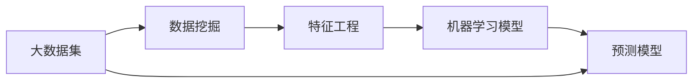

                 

# AI如何通过大数据分析预测需求

## 1. 背景介绍

在当今信息爆炸的时代，数据已成为企业获取竞争优势的关键资产。然而，如何在大数据中提取有用信息，洞察市场趋势和消费者需求，始终是一个复杂而棘手的问题。传统的统计分析方法难以应对海量数据和复杂关系，而人工智能和大数据分析技术则提供了一种全新的解决途径。本文将深入探讨AI如何通过大数据分析来预测需求，包括数据挖掘、模型构建、特征工程等方面的核心技术。

## 2. 核心概念与联系

### 2.1 核心概念概述

为更好地理解AI在大数据分析中的应用，我们首先需要了解以下几个核心概念：

- **大数据分析**：指的是通过对大规模、高速率和多样化的数据集进行收集、处理、分析和解释，从中提取有价值的信息和洞察。
- **数据挖掘**：是指从大量数据中自动发现隐藏模式、相关性和可操作的业务信息。
- **机器学习**：一种让计算机通过数据学习模式，进行预测和决策的技术。
- **深度学习**：一种基于神经网络的机器学习技术，能够处理高度复杂的非线性关系。
- **预测模型**：通过分析历史数据，建立模型来预测未来事件或趋势。

这些概念相互联系，共同构成了AI在数据分析中预测需求的核心方法。大数据分析通过数据挖掘技术从海量数据中提取信息，利用机器学习尤其是深度学习模型进行建模，最终通过预测模型进行需求预测。

### 2.2 核心概念原理和架构的 Mermaid 流程图



这个流程图展示了从大数据集到需求预测的核心流程。首先，数据集通过数据挖掘技术被转化为可操作的信息，然后通过特征工程提取重要特征，再通过机器学习模型进行训练，最终得到可用于需求预测的预测模型。

## 3. 核心算法原理 & 具体操作步骤

### 3.1 算法原理概述

基于AI的大数据分析需求预测，主要是通过构建和训练机器学习模型来实现。其核心思想是利用历史数据和相关特征，建立模型来预测未来需求。常用的机器学习模型包括线性回归、决策树、随机森林、神经网络等，而深度学习模型如循环神经网络(RNN)、长短期记忆网络(LSTM)、卷积神经网络(CNN)等则更加适合处理复杂的时序数据和特征。

### 3.2 算法步骤详解

**Step 1: 数据准备与预处理**

- 收集相关历史数据，包括时间序列数据、市场趋势、客户行为等。
- 清洗数据，处理缺失值、异常值等。
- 标准化或归一化数据，确保所有特征都在相同的尺度上。

**Step 2: 特征工程**

- 选择与需求预测相关的特征，如季节性、节假日、促销活动、竞争对手表现等。
- 构建衍生特征，如季节性调整、趋势分解、季节性分解移动平均(ADF)等。
- 数据转换，如对数变换、多项式变换等。

**Step 3: 模型选择与训练**

- 选择合适的机器学习或深度学习模型。
- 使用交叉验证技术评估模型性能。
- 调整模型超参数，如学习率、迭代次数等。
- 训练模型，通过梯度下降等优化算法最小化损失函数。

**Step 4: 模型评估与验证**

- 在验证集上评估模型性能，如均方误差(MSE)、均方根误差(RMSE)、平均绝对误差(MAE)等。
- 可视化模型输出与真实值对比，检查残差分布。
- 进行回测，评估模型对历史数据的拟合情况。

**Step 5: 模型部署与应用**

- 将训练好的模型部署到生产环境。
- 定期更新模型，重新训练或微调。
- 实时监控模型预测结果，调整模型参数。
- 集成到业务系统中，自动生成需求预测报告。

### 3.3 算法优缺点

**优点**：

- 能够处理大规模数据，自动发现数据中的模式和趋势。
- 利用历史数据进行预测，能够提供较为准确的未来需求。
- 深度学习模型具有较强的泛化能力，适用于复杂的时序和特征关系。

**缺点**：

- 需要大量的标注数据和计算资源，成本较高。
- 模型的可解释性较弱，难以解释预测结果背后的逻辑。
- 对于异常情况和突发事件的响应能力有限，需要不断更新和调整。

### 3.4 算法应用领域

基于AI的大数据分析需求预测方法，在多个领域得到了广泛应用，包括但不限于：

- **零售业**：预测消费者需求，优化库存管理，提高销售额。
- **金融业**：预测市场波动，风险管理，投资策略优化。
- **制造业**：预测原材料需求，生产计划优化，供应链管理。
- **医疗保健**：预测患者需求，资源调配，个性化医疗服务。
- **能源行业**：预测能源需求，优化能源分配，提升能效。

## 4. 数学模型和公式 & 详细讲解 & 举例说明

### 4.1 数学模型构建

假设我们有一个时间序列数据集 $\{D_t\}_{t=1}^T$，其中 $D_t$ 表示第 $t$ 时刻的需求量。我们的目标是通过分析历史数据，建立一个预测模型来预测未来时刻的需求。

### 4.2 公式推导过程

假设我们使用时间序列的滑动窗口作为特征，构建自回归模型(AR)来预测未来需求。设 $\{D_t\}_{t=1}^T$ 的时间序列为 $\{D_{t+1}, ..., D_{t+p}\}_{t=1}^T$，其中 $p$ 为滑动窗口大小，$D_{t+1}$ 为未来需求，$X_t = (D_{t}, ..., D_{t+p-1})$ 为历史需求特征。

设自回归模型的预测公式为：

$$
D_{t+1} = \beta_0 + \sum_{i=1}^{p} \beta_i D_{t-i} + \epsilon_{t+1}
$$

其中 $\beta_0, \beta_1, ..., \beta_p$ 为模型参数，$\epsilon_{t+1}$ 为随机误差项。

通过最小化预测误差 $\epsilon_{t+1}$ 的平方和，即均方误差(MSE)，可以得到模型参数的估计值：

$$
\hat{\beta} = \mathop{\arg\min}_{\beta} \frac{1}{T} \sum_{t=1}^T (D_{t+1} - \beta_0 - \sum_{i=1}^p \beta_i D_{t-i})^2
$$

通过求解上述优化问题，可以得到自回归模型的参数估计值，进而得到未来需求的预测模型。

### 4.3 案例分析与讲解

以零售业为例，我们收集了过去一年中每日的销售数据，目标预测未来30天的销售量。首先，我们将数据集进行时间序列的滑动窗口处理，得到每个时刻的前30天的销售数据作为特征。然后，我们使用AR模型对未来需求进行预测，通过调整模型参数，使得预测误差最小化。最后，我们通过在验证集上的回测，评估模型的预测性能。

## 5. 项目实践：代码实例和详细解释说明

### 5.1 开发环境搭建

在进行需求预测项目实践前，我们需要准备好开发环境。以下是使用Python进行PyTorch开发的环境配置流程：

1. 安装Anaconda：从官网下载并安装Anaconda，用于创建独立的Python环境。

2. 创建并激活虚拟环境：
```bash
conda create -n pytorch-env python=3.8 
conda activate pytorch-env
```

3. 安装PyTorch：根据CUDA版本，从官网获取对应的安装命令。例如：
```bash
conda install pytorch torchvision torchaudio cudatoolkit=11.1 -c pytorch -c conda-forge
```

4. 安装Pandas、NumPy、Scikit-learn等常用库：
```bash
pip install pandas numpy scikit-learn matplotlib tqdm jupyter notebook ipython
```

完成上述步骤后，即可在`pytorch-env`环境中开始项目开发。

### 5.2 源代码详细实现

以下是一个使用PyTorch实现AR模型进行需求预测的代码示例：

```python
import torch
import torch.nn as nn
import torch.optim as optim
from sklearn.metrics import mean_squared_error
from sklearn.model_selection import train_test_split

class ARModel(nn.Module):
    def __init__(self, p):
        super(ARModel, self).__init__()
        self.p = p
        self.regularization = nn.Linear(p, 1)
    
    def forward(self, x):
        x = x[:, :self.p]
        return self.regularization(x)

def train(model, x_train, y_train, x_val, y_val, num_epochs, learning_rate):
    criterion = nn.MSELoss()
    optimizer = optim.Adam(model.parameters(), lr=learning_rate)
    
    for epoch in range(num_epochs):
        model.train()
        optimizer.zero_grad()
        y_pred = model(x_train)
        loss = criterion(y_pred, y_train)
        loss.backward()
        optimizer.step()
        
        model.eval()
        with torch.no_grad():
            y_pred = model(x_val)
            mse = criterion(y_pred, y_val).item()
            print(f"Epoch {epoch+1}, loss: {mse:.4f}")
    
    return model

def test(model, x_test, y_test):
    with torch.no_grad():
        y_pred = model(x_test)
        mse = mean_squared_error(y_test, y_pred.numpy(), squared=False)
        rmse = torch.sqrt(torch.tensor(mse, dtype=torch.float32))
        print(f"Test RMSE: {rmse.item()}")

# 数据准备
data = pd.read_csv('sales_data.csv')
train, val, test = train_test_split(data.drop('sales', axis=1), data['sales'], test_size=0.2, random_state=42)

# 数据预处理
x_train = torch.tensor(train.values[:, :30], dtype=torch.float32)
x_val = torch.tensor(val.values[:, :30], dtype=torch.float32)
x_test = torch.tensor(test.values[:, :30], dtype=torch.float32)
y_train = torch.tensor(train.values[:, 30], dtype=torch.float32)
y_val = torch.tensor(val.values[:, 30], dtype=torch.float32)
y_test = torch.tensor(test.values[:, 30], dtype=torch.float32)

# 模型训练
p = 30
model = ARModel(p)
model.to('cuda')
train(model, x_train, y_train, x_val, y_val, num_epochs=100, learning_rate=0.001)
test(model, x_test, y_test)
```

在这个代码示例中，我们首先定义了AR模型的结构，然后使用均方误差(MSE)作为损失函数，使用Adam优化器进行模型训练。在训练过程中，我们每轮迭代更新模型参数，并打印当前损失值。最后，我们在测试集上计算预测误差的均方根误差(RMSE)。

### 5.3 代码解读与分析

让我们再详细解读一下关键代码的实现细节：

- `ARModel`类：定义了AR模型的结构，包括特征输入和回归输出。
- `train`函数：用于模型训练，包括前向传播、损失计算、梯度更新等步骤。
- `test`函数：用于模型测试，计算预测误差。
- `data`变量：从CSV文件中加载销售数据。
- `train_test_split`函数：将数据集划分为训练集、验证集和测试集。
- `x_train`、`x_val`、`x_test`、`y_train`、`y_val`、`y_test`：特征数据和标签数据，使用TensorFlow进行张量转换。
- `model`变量：创建AR模型，并将其迁移到GPU上进行加速计算。
- `to('cuda')`：将模型迁移到GPU上，加速计算。

这些代码展示了AR模型的实现过程，包括模型的定义、训练和测试步骤。通过简单的逻辑实现，我们便能够完成基于AR模型的需求预测项目。

## 6. 实际应用场景

### 6.1 零售业需求预测

在零售业中，需求预测可以帮助企业优化库存管理，降低成本，提升销售额。传统的零售需求预测方法基于统计分析，但难以处理复杂的时序和季节性因素。而基于AI的大数据分析方法，通过机器学习模型，可以自动发现历史数据的规律和趋势，生成精确的需求预测。

具体而言，零售商可以收集历史销售数据、促销活动、节假日、季节性变化等信息，建立需求预测模型。模型通过分析这些数据，预测未来30天的销售量，帮助企业制定更有效的库存管理策略。

### 6.2 金融业风险管理

金融业中，风险管理是至关重要的任务。基于AI的大数据分析方法，可以通过预测模型分析市场趋势和波动，及时发现风险信号。金融公司可以通过实时监控模型输出，快速响应市场变化，减少潜在的财务损失。

以股票市场为例，公司可以收集历史股价数据、交易量、公司财报、新闻报道等，建立风险预测模型。模型通过分析这些数据，预测未来股票价格的波动，帮助公司及时调整投资组合，规避市场风险。

### 6.3 制造业供应链管理

制造业中，供应链管理是复杂且耗时的任务。通过需求预测，企业可以优化生产计划，减少库存成本，提高供应链效率。

具体而言，制造企业可以收集历史订单数据、生产数据、市场需求、季节性因素等信息，建立需求预测模型。模型通过分析这些数据，预测未来产品的需求量，帮助企业制定更合理的生产计划，优化供应链管理。

### 6.4 未来应用展望

随着AI和大数据技术的不断发展，基于数据分析的需求预测方法将越来越精准和高效。未来，需求预测将不仅仅局限于传统的统计分析方法，而是通过更先进的AI技术，实现更广泛的业务应用。

例如，在医疗领域，通过分析历史诊疗数据、药品销售数据、患者行为数据等，可以预测未来疾病流行趋势和医疗资源需求，帮助医院优化资源配置，提升医疗服务质量。

在能源行业，通过分析历史能源消耗数据、天气数据、用户行为数据等，可以预测未来能源需求，优化能源分配，提高能源利用效率。

## 7. 工具和资源推荐

### 7.1 学习资源推荐

为了帮助开发者系统掌握AI在大数据分析中的需求预测技术，这里推荐一些优质的学习资源：

1. 《深度学习》课程（Coursera）：由斯坦福大学Andrew Ng教授主讲的经典课程，涵盖深度学习的基本概念和经典算法。

2. 《Python数据分析》书籍：详细介绍了使用Python进行数据分析的各项技术，包括Pandas、NumPy、Scikit-learn等库的使用。

3. 《机器学习实战》书籍：由Peter Harrington所著，介绍了机器学习的基本原理和实用技巧，包含多种经典算法和实际案例。

4. 《Deep Learning with PyTorch》书籍：由Eli Stevens等著，全面介绍了使用PyTorch进行深度学习开发的各项技术，包括模型的定义、训练、评估等。

5. 《Kaggle学习之路》博客系列：由Kaggle社区的顶尖数据科学家撰写，提供丰富的实际项目和代码实现，适合实践学习。

通过对这些资源的学习实践，相信你一定能够快速掌握AI在大数据分析中的需求预测技术，并用于解决实际的商业问题。

### 7.2 开发工具推荐

高效的开发离不开优秀的工具支持。以下是几款用于需求预测开发的常用工具：

1. PyTorch：基于Python的开源深度学习框架，灵活动态的计算图，适合快速迭代研究。PyTorch提供了丰富的深度学习模型库和优化器，支持模型训练和推理。

2. TensorFlow：由Google主导开发的开源深度学习框架，生产部署方便，适合大规模工程应用。TensorFlow支持多种模型架构和优化器，适合复杂模型的训练和推理。

3. Jupyter Notebook：开源的交互式笔记本工具，支持Python、R等多种语言，适合数据探索、模型训练和结果展示。

4. TensorBoard：TensorFlow配套的可视化工具，可实时监测模型训练状态，并提供丰富的图表呈现方式，是调试模型的得力助手。

5. Weights & Biases：模型训练的实验跟踪工具，可以记录和可视化模型训练过程中的各项指标，方便对比和调优。

6. Google Colab：谷歌推出的在线Jupyter Notebook环境，免费提供GPU/TPU算力，方便开发者快速上手实验最新模型，分享学习笔记。

合理利用这些工具，可以显著提升需求预测任务的开发效率，加快创新迭代的步伐。

### 7.3 相关论文推荐

需求预测的研究始于1970年代，经过多年的发展和演变，已经成为数据科学和人工智能领域的经典问题。以下是几篇奠基性的相关论文，推荐阅读：

1. **《Time Series Analysis and Its Applications》**：由R.S. Tsay著，是时间序列分析的经典著作，涵盖时间序列模型和应用案例。

2. **《Forecasting: Principles and Practice》**：由Rob J. Hyndman和George Athanasopoulos著，详细介绍了各种时间序列预测方法。

3. **《Probabilistic Forecasts》**：由Christian Francq和Philippe Zakoian著，介绍了概率预报方法和应用。

4. **《Prediction Markets: How Collective Expertise Can be Harnessed》**：由Charles M. Jones等著，介绍了预测市场的基本原理和应用。

5. **《Machine Learning Yearning》**：由Andrew Ng著，介绍了机器学习在实际应用中的各项技巧和策略。

这些论文代表了需求预测技术的演进脉络，通过学习这些前沿成果，可以帮助研究者把握学科前进方向，激发更多的创新灵感。

## 8. 总结：未来发展趋势与挑战

### 8.1 研究成果总结

本文对基于AI的大数据分析需求预测方法进行了全面系统的介绍。首先阐述了需求预测的背景和意义，明确了AI在数据分析中预测需求的核心方法。其次，从原理到实践，详细讲解了机器学习模型的构建和训练过程，给出了需求预测任务的完整代码实现。同时，本文还广泛探讨了需求预测方法在多个领域的应用前景，展示了AI技术在数据分析中的巨大潜力。

通过本文的系统梳理，可以看到，基于AI的大数据分析方法，能够处理大规模数据，自动发现数据中的模式和趋势，预测未来需求。这些方法在零售业、金融业、制造业等多个领域得到了广泛应用，为业务决策提供了有力的支持。未来，随着AI和大数据技术的不断发展，需求预测将越来越精准和高效，为各行各业带来更多的价值。

### 8.2 未来发展趋势

展望未来，AI在大数据分析中的需求预测技术将呈现以下几个发展趋势：

1. **模型复杂度提升**：随着计算资源和算法的不断进步，未来的需求预测模型将更加复杂和精确，能够处理更复杂的时序和特征关系。

2. **多模态数据融合**：未来的需求预测模型将不再局限于单一数据源，而是能够整合多模态数据（如文本、图像、语音等），提升预测精度。

3. **自适应学习**：未来的模型将具备更强的自适应能力，能够根据环境变化和用户反馈不断调整模型参数，提升预测效果。

4. **分布式计算**：随着数据规模的不断扩大，分布式计算将成为一个重要的技术趋势，通过并行计算和联邦学习等技术，提升预测效率和模型性能。

5. **实时预测**：未来的需求预测系统将具备更强的实时性，能够即时处理和分析数据，快速响应业务需求。

### 8.3 面临的挑战

尽管AI在大数据分析中的需求预测技术已经取得了显著进展，但在迈向更加智能化、普适化应用的过程中，它仍面临着诸多挑战：

1. **数据质量和多样性**：数据质量和多样性是影响需求预测精度的重要因素。如何确保数据的质量和多样性，以及如何处理缺失值、异常值等数据问题，仍然是一个挑战。

2. **模型复杂性和可解释性**：现代深度学习模型虽然精度高，但复杂性较大，难以解释其内部工作机制。如何在保证模型精度的情况下，提高模型的可解释性和透明性，仍然是一个重要的问题。

3. **计算资源和成本**：深度学习模型需要大量的计算资源和存储空间，训练和推理过程成本较高。如何降低计算成本，提升模型的可部署性和可扩展性，仍然是一个亟待解决的问题。

4. **实时性和鲁棒性**：需求预测模型需要具备实时性，能够及时响应业务需求。同时，模型需要具备一定的鲁棒性，能够处理异常情况和突发事件。

5. **隐私和安全**：在数据收集和处理过程中，如何保护用户隐私和数据安全，防止数据泄露和滥用，仍然是一个重要的伦理问题。

### 8.4 研究展望

面对需求预测面临的这些挑战，未来的研究需要在以下几个方面寻求新的突破：

1. **数据预处理技术**：开发更先进的数据清洗和预处理技术，提升数据质量，减少数据噪音。

2. **模型压缩与优化**：研究更高效的模型压缩和优化技术，降低模型复杂度和计算成本。

3. **分布式计算框架**：研究更高效的分布式计算框架，提升模型的可扩展性和实时性。

4. **联邦学习与隐私保护**：研究联邦学习和差分隐私等技术，保护用户隐私和数据安全。

5. **自适应和鲁棒性增强**：研究更具自适应和鲁棒性的模型，提升模型的泛化能力和应对突发事件的能力。

这些研究方向的探索，必将引领需求预测技术迈向更高的台阶，为各行各业带来更多的价值。面向未来，需求预测技术还需要与其他AI技术进行更深入的融合，如知识图谱、因果推理、强化学习等，多路径协同发力，共同推动需求预测技术的进步。

## 9. 附录：常见问题与解答

**Q1: 需求预测模型如何应对异常数据和突发事件？**

A: 需求预测模型应对异常数据和突发事件的方法包括：

1. 使用鲁棒性较强的模型，如随机森林、深度学习等，减少异常数据对模型的影响。

2. 引入异常检测技术，如孤立森林、局部离群因子等，及时发现和处理异常数据。

3. 使用模型集成技术，通过结合多个模型的预测结果，降低单一模型的风险。

4. 使用时间序列分解技术，如季节性分解移动平均(ADF)，分离趋势和随机波动，提高模型的鲁棒性。

5. 实时监控模型输出，及时调整模型参数，应对突发事件。

通过这些方法，可以提升模型的鲁棒性和应对突发事件的能力，确保预测结果的可靠性。

**Q2: 需求预测模型的可解释性如何提升？**

A: 需求预测模型的可解释性可以通过以下方法提升：

1. 使用可解释性较强的模型，如线性回归、决策树等，减少模型的复杂性，提高可解释性。

2. 引入模型可视化工具，如TensorBoard，可视化模型训练过程和输出结果，帮助理解模型的内部工作机制。

3. 使用模型压缩技术，如剪枝、量化等，减少模型参数和计算资源消耗，提高模型的可解释性。

4. 引入领域知识，如专家规则、符号逻辑等，结合神经网络模型，增强模型的可解释性和透明性。

5. 进行模型调参，通过调整模型超参数，优化模型输出，提高模型的可解释性。

这些方法可以帮助提升需求预测模型的可解释性，增强模型的可信度和可靠性。

**Q3: 需求预测模型如何在多模态数据上实现融合？**

A: 需求预测模型在多模态数据上的融合可以通过以下方法实现：

1. 使用多模态特征融合技术，如特征加权、特征拼接等，将不同模态的数据融合为统一的特征表示。

2. 使用深度学习模型，如卷积神经网络(CNN)、循环神经网络(RNN)、长短期记忆网络(LSTM)等，处理不同模态的数据。

3. 引入注意力机制，如自注意力机制、交叉注意力机制等，增强不同模态数据之间的关系建模。

4. 使用迁移学习技术，将单模态模型迁移到多模态数据上，提升模型的泛化能力和预测精度。

5. 结合领域知识，如专家规则、符号逻辑等，增强模型的多模态数据融合能力。

通过这些方法，可以提升需求预测模型在多模态数据上的融合能力，增强模型的泛化能力和预测精度。

这些问题的解答，为我们提供了需求预测模型在实际应用中的关键思路和方法，帮助我们更好地理解和应用AI技术。总之，需求预测技术需要不断优化和创新，才能更好地服务于各行业的业务决策和战略规划。

---

作者：禅与计算机程序设计艺术 / Zen and the Art of Computer Programming

