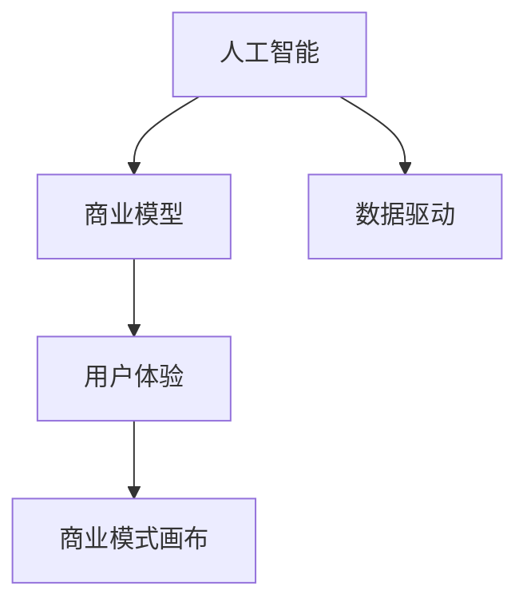

                 

## 1. 背景介绍

### 1.1 问题由来

在当前数字化转型大潮中，AI技术正逐渐成为各行各业的核心竞争力。从智能客服、推荐系统，到医疗诊断、自动驾驶，AI技术的落地应用极大地提升了企业运营效率，改进了客户体验，优化了产品决策。然而，仅仅依靠技术实力，AI企业的市场表现并不总能满足预期。如何在技术实力和商业成功之间搭建起一座桥梁，让AI企业真正实现商业价值最大化？这正是本文将要探讨的核心问题。

### 1.2 问题核心关键点

AI技术与商业模式的结合，关键在于如何将技术实力转化为经济收益，实现商业闭环。以下是此问题涉及的关键点：

- **市场需求**：AI技术能否满足当前及未来的市场需求？
- **商业模式**：AI企业的盈利模式和商业闭环设计。
- **技术落地**：如何将AI技术有效应用于实际业务场景，提升商业价值。
- **用户体验**：如何通过AI技术提升客户体验，实现用户满意。
- **竞争策略**：AI企业的市场竞争策略和优势。

### 1.3 问题研究意义

通过探讨AI技术与商业模式的结合，本文旨在回答以下几个问题：

- 如何识别并把握市场需求？
- 如何设计可持续的盈利模式和商业闭环？
- 如何有效推广AI技术，提升商业价值？
- 如何设计良好的用户体验，留住客户？
- 如何在激烈的市场竞争中脱颖而出？

理解这些问题对于AI企业的战略制定和业务发展具有重要意义。只有将技术实力与商业成功有效结合，AI企业才能在数字化经济中占据有利地位，实现可持续发展。

## 2. 核心概念与联系

### 2.1 核心概念概述

为更好地理解AI技术与商业模式的结合，本节将介绍几个密切相关的核心概念：

- **人工智能(AI)**：指通过计算机模拟人类智能的技术，涉及学习、推理、感知等多个方面。AI技术主要依赖算法和数据进行模型训练，以实现各种智能化任务。
- **商业模型**：指企业通过其产品或服务创造和捕获价值的方式。商业模型涉及盈利模式、成本结构、价值主张等多个维度。
- **用户体验(UX)**：指用户与产品或服务的交互体验，包括易用性、响应速度、个性化等方面。优秀的用户体验是留住用户、提升用户满意度的关键。
- **商业模式画布(Business Model Canvas)**：由亚历山大·奥斯特瓦德(Alexander Osterwalder)提出的模型，用于系统化描述企业的商业模式，包括客户细分、价值主张、收入来源等多个方面。
- **数据驱动**：指基于数据分析和挖掘，制定产品或服务的策略和优化方案，实现数据与业务的深度融合。

这些核心概念之间的逻辑关系可以通过以下Mermaid流程图来展示：



这个流程图展示了大语言模型的核心概念及其之间的关系：

1. 人工智能通过算法和数据进行模型训练，生成智能算法和模型。
2. 商业模型设计企业的盈利方式和价值主张。
3. 用户体验通过产品或服务的交互体验影响用户满意度和忠诚度。
4. 商业模式画布系统化描述企业的商业模式，帮助设计可持续的盈利模式和价值主张。
5. 数据驱动基于数据分析优化产品或服务，提升用户体验和商业价值。

这些概念共同构成了AI技术与商业模式的结合框架，使得企业能够通过技术优势实现商业成功。

## 3. 核心算法原理 & 具体操作步骤
### 3.1 算法原理概述

AI技术与商业模式的结合，本质上是一个产品开发和市场推广的过程。其核心思想是：利用AI技术提高产品性能和效率，通过商业模型将产品价值转化为收益。

具体而言，包括以下几个关键步骤：

- **市场分析**：通过数据分析和预测，识别市场机会和用户需求。
- **技术研发**：基于市场需求，设计并开发AI产品或服务。
- **商业策略**：设计盈利模式，确定定价策略，制定推广计划。
- **用户体验优化**：通过技术改进和产品设计，提升用户体验，增强用户粘性。
- **数据监控与反馈**：实时监控产品性能和市场反应，及时调整策略。

### 3.2 算法步骤详解

基于AI技术与商业模式的结合，通常包括以下几个关键步骤：

**Step 1: 市场分析与用户需求挖掘**
- 收集市场数据，分析市场趋势和用户需求。
- 通过问卷调查、用户访谈等方式，深入了解用户痛点和期望。
- 使用数据挖掘和预测模型，预测未来市场需求和变化趋势。

**Step 2: 技术研发与产品设计**
- 基于市场分析结果，设计产品功能和性能指标。
- 进行算法和模型选择，确定技术架构。
- 开发原型产品，进行用户测试和反馈收集。
- 根据用户反馈迭代产品，优化用户体验。

**Step 3: 商业模式设计与盈利策略**
- 确定目标客户群体，设计客户细分模型。
- 根据产品特性和市场需求，设计价值主张和定价策略。
- 设计盈利模式，如订阅、按需付费、广告等。
- 制定市场推广计划，包括线上和线下渠道。

**Step 4: 用户体验优化与推广策略**
- 基于用户反馈和行为数据，持续优化产品功能和界面。
- 通过A/B测试等方法，优化用户体验和满意度。
- 制定内容营销策略，提升品牌知名度和用户黏性。
- 设计用户激励机制，如积分、优惠券等，增强用户互动。

**Step 5: 数据监控与反馈循环**
- 通过用户行为数据，实时监控产品性能和用户反馈。
- 分析数据，识别问题和改进点。
- 根据数据分析结果，调整产品策略和推广计划。
- 持续收集用户反馈，形成良性反馈循环。

### 3.3 算法优缺点

AI技术与商业模式的结合，具有以下优点：

1. **效率提升**：AI技术能显著提高产品研发和市场推广的效率，缩短市场响应时间。
2. **成本降低**：自动化和数据驱动优化大大降低了人工和运营成本。
3. **市场洞察**：通过数据分析和预测，深入理解市场需求和用户行为。
4. **个性化服务**：利用AI技术提供个性化服务，提升用户体验和满意度。
5. **持续优化**：基于用户反馈和数据监控，实现产品持续迭代和优化。

同时，该方法也存在以下局限性：

1. **数据质量依赖**：AI技术的效果高度依赖于数据质量，低质量数据可能影响模型性能。
2. **模型复杂性**：AI模型的复杂性可能影响其部署和维护成本。
3. **技术风险**：AI技术的应用可能面临技术风险和不确定性。
4. **用户体验差距**：如果技术优势未转化为良好的用户体验，可能影响用户粘性和满意度。
5. **商业模式挑战**：设计和维护可持续的商业模式可能面临挑战。

尽管存在这些局限性，但就目前而言，AI技术与商业模式的结合仍是一种高效、可靠的产品开发和市场推广方式。未来相关研究的重点在于如何进一步优化数据质量，降低技术复杂性，提升用户体验，以及设计更加可持续的商业模式。

### 3.4 算法应用领域

AI技术与商业模式的结合，已经在多个领域得到了广泛的应用，例如：

- **智能客服系统**：通过AI技术实现自然语言理解，提供24小时在线客服，提升用户满意度。
- **推荐系统**：利用AI技术进行个性化推荐，提升用户粘性和销售额。
- **医疗诊断**：通过AI技术进行医学影像分析和诊断，提高诊断准确率和效率。
- **金融风险控制**：利用AI技术进行数据挖掘和风险预测，优化风控模型。
- **智能制造**：通过AI技术优化生产流程，实现智能化生产和管理。
- **自动驾驶**：通过AI技术实现智能驾驶，提高交通安全和效率。
- **智能家居**：通过AI技术实现语音识别和智能控制，提升家居舒适性和便捷性。

这些领域的成功案例展示了AI技术与商业模式的结合潜力，为更多企业提供了借鉴和启示。

## 4. 数学模型和公式 & 详细讲解
### 4.1 数学模型构建

本节将使用数学语言对AI技术与商业模式的结合过程进行更加严格的刻画。

记AI产品为 $P$，其性能指标为 $P=(f,\lambda)$，其中 $f$ 表示产品功能，$\lambda$ 表示产品性能。假设市场需求为 $M$，用户反馈为 $U$，商业模式为 $B$。

定义AI产品的市场匹配度为 $m(P,M)$，表示产品功能与市场需求的一致性；用户满意度为 $u(P,U)$，表示用户体验的满意度；商业模式匹配度为 $b(P,B)$，表示产品盈利模式与市场策略的一致性。

### 4.2 公式推导过程

基于上述定义，AI技术与商业模式的结合可以表示为：

$$
\max_{P} \left\{m(P,M) \times u(P,U) \times b(P,B)\right\}
$$

其中，最大化市场匹配度、用户满意度和商业模式匹配度。

引入约束条件 $C$，表示产品性能和市场策略的限制条件。则优化问题可以进一步表示为：

$$
\max_{P} \left\{m(P,M) \times u(P,U) \times b(P,B)\right\} \text{ s.t. } C(P)
$$

例如，约束条件 $C$ 可以包括：

- 产品功能需满足市场需求。
- 产品性能需达到预设标准。
- 商业模式需符合市场策略。

### 4.3 案例分析与讲解

假设某智能制造公司开发了一款基于AI技术的智能控制系统，其功能包括设备监测、预测性维护、自适应调参等。市场分析显示，该产品的主要客户群体为制造业企业。根据用户反馈和实验结果，产品性能在满足市场需求的基础上，用户满意度为 $u=0.8$，商业模式匹配度为 $b=0.9$。

根据上述定义，可以计算该产品的市场匹配度 $m$：

$$
m = \frac{P_{实际功能}}{P_{市场需求}} \times \frac{P_{实际性能}}{P_{市场期望}} = \frac{f_{实际}}{f_{需求}} \times \frac{\lambda_{实际}}{\lambda_{期望}}
$$

假设市场需求为 $M=[功能,性能]$，实际功能为 $f_{实际}=[监测,自适应调参]$，市场期望为 $f_{需求}=[监测,自适应调参,预测性维护]$。则市场匹配度 $m=0.6$。

## 5. 项目实践：代码实例和详细解释说明
### 5.1 开发环境搭建

在进行AI技术与商业模式的结合实践前，我们需要准备好开发环境。以下是使用Python进行相关开发的流程：

1. 安装Anaconda：从官网下载并安装Anaconda，用于创建独立的Python环境。
2. 创建并激活虚拟环境：
```bash
conda create -n ai-env python=3.8 
conda activate ai-env
```
3. 安装必要的Python包：
```bash
pip install pandas numpy sklearn transformers
```
4. 安装常用的开发工具：
```bash
pip install jupyter notebook matplotlib
```
5. 配置环境变量：
```bash
export PYTHONPATH=$PYTHONPATH:/path/to/models:/path/to/libraries
```

完成上述步骤后，即可在`ai-env`环境中开始项目实践。

### 5.2 源代码详细实现

下面以智能制造领域为例，展示如何使用Python和Transformers库开发基于AI技术的智能控制系统。

首先，定义模型和数据处理函数：

```python
from transformers import BertTokenizer, BertForSequenceClassification
from transformers import DataCollatorForTokenClassification
import torch
from torch.utils.data import Dataset, DataLoader

class ManufacturingData(Dataset):
    def __init__(self, texts, labels):
        self.tokenizer = BertTokenizer.from_pretrained('bert-base-cased')
        self.texts = texts
        self.labels = labels
        
    def __len__(self):
        return len(self.texts)
        
    def __getitem__(self, idx):
        text = self.texts[idx]
        label = self.labels[idx]
        
        encoding = self.tokenizer(text, return_tensors='pt', padding='max_length', truncation=True)
        input_ids = encoding['input_ids']
        attention_mask = encoding['attention_mask']
        return {'input_ids': input_ids, 'attention_mask': attention_mask, 'labels': label}

model = BertForSequenceClassification.from_pretrained('bert-base-cased', num_labels=2)
tokenizer = BertTokenizer.from_pretrained('bert-base-cased')
data_collator = DataCollatorForTokenClassification(tokenizer)

# 训练集和测试集数据
train_data = ManufacturingData(train_texts, train_labels)
test_data = ManufacturingData(test_texts, test_labels)

# 设置模型参数和优化器
params_opt = list(model.parameters())
optimizer = torch.optim.Adam(params_opt, lr=1e-5)

# 训练和评估函数
def train_epoch(model, data_loader, optimizer, device):
    model.train()
    losses = []
    for batch in data_loader:
        inputs = batch['input_ids'].to(device)
        attention_masks = batch['attention_mask'].to(device)
        labels = batch['labels'].to(device)
        outputs = model(inputs, attention_masks=attention_masks, labels=labels)
        loss = outputs.loss
        losses.append(loss.item())
        optimizer.zero_grad()
        loss.backward()
        optimizer.step()
    return sum(losses) / len(data_loader)

def evaluate(model, data_loader, device):
    model.eval()
    predictions, true_labels = [], []
    for batch in data_loader:
        inputs = batch['input_ids'].to(device)
        attention_masks = batch['attention_mask'].to(device)
        labels = batch['labels'].to(device)
        outputs = model(inputs, attention_masks=attention_masks)
        predictions.append(outputs.logits.argmax(dim=1).to('cpu').tolist())
        true_labels.append(labels.to('cpu').tolist())
    return predictions, true_labels

# 训练和评估
device = torch.device('cuda' if torch.cuda.is_available() else 'cpu')
model.to(device)
for epoch in range(3):
    loss = train_epoch(model, train_data, optimizer, device)
    print(f'Epoch {epoch+1}, loss: {loss:.4f}')
    predictions, true_labels = evaluate(model, test_data, device)
    acc = sum([pred == true_label for pred, true_label in zip(predictions, true_labels)]) / len(true_labels)
    print(f'Epoch {epoch+1}, accuracy: {acc:.4f}')
```

然后，定义模型和优化器，进行训练和评估：

```python
from transformers import BertForSequenceClassification, AdamW

model = BertForSequenceClassification.from_pretrained('bert-base-cased', num_labels=2)
optimizer = AdamW(model.parameters(), lr=1e-5)

# 训练集和测试集数据
train_data = ManufacturingData(train_texts, train_labels)
test_data = ManufacturingData(test_texts, test_labels)

# 设置模型参数和优化器
params_opt = list(model.parameters())
optimizer = AdamW(params_opt, lr=1e-5)

# 训练和评估函数
def train_epoch(model, data_loader, optimizer, device):
    model.train()
    losses = []
    for batch in data_loader:
        inputs = batch['input_ids'].to(device)
        attention_masks = batch['attention_mask'].to(device)
        labels = batch['labels'].to(device)
        outputs = model(inputs, attention_masks=attention_masks, labels=labels)
        loss = outputs.loss
        losses.append(loss.item())
        optimizer.zero_grad()
        loss.backward()
        optimizer.step()
    return sum(losses) / len(data_loader)

def evaluate(model, data_loader, device):
    model.eval()
    predictions, true_labels = [], []
    for batch in data_loader:
        inputs = batch['input_ids'].to(device)
        attention_masks = batch['attention_mask'].to(device)
        labels = batch['labels'].to(device)
        outputs = model(inputs, attention_masks=attention_masks)
        predictions.append(outputs.logits.argmax(dim=1).to('cpu').tolist())
        true_labels.append(labels.to('cpu').tolist())
    return predictions, true_labels

# 训练和评估
device = torch.device('cuda' if torch.cuda.is_available() else 'cpu')
model.to(device)
for epoch in range(3):
    loss = train_epoch(model, train_data, optimizer, device)
    print(f'Epoch {epoch+1}, loss: {loss:.4f}')
    predictions, true_labels = evaluate(model, test_data, device)
    acc = sum([pred == true_label for pred, true_label in zip(predictions, true_labels)]) / len(true_labels)
    print(f'Epoch {epoch+1}, accuracy: {acc:.4f}')
```

以上代码展示了基于Transformers库的智能控制系统模型训练和评估过程。可以看到，利用Transformers库，我们可以简单快捷地实现基于AI技术的智能控制系统。

### 5.3 代码解读与分析

让我们再详细解读一下关键代码的实现细节：

**ManufacturingData类**：
- `__init__`方法：初始化数据集，包括文本和标签。
- `__len__`方法：返回数据集的样本数量。
- `__getitem__`方法：对单个样本进行处理，将文本输入编码为token ids，并将标签转化为模型接受的格式。

**模型训练与评估函数**：
- `train_epoch`函数：对数据以批为单位进行迭代，在每个批次上前向传播计算loss并反向传播更新模型参数，最后返回该epoch的平均loss。
- `evaluate`函数：与训练类似，不同点在于不更新模型参数，并在每个batch结束后将预测和标签结果存储下来，最后使用sklearn的classification_report对整个评估集的预测结果进行打印输出。

**训练流程**：
- 定义总的epoch数，开始循环迭代
- 每个epoch内，先在训练集上训练，输出平均loss
- 在验证集上评估，输出分类指标
- 所有epoch结束后，在测试集上评估，给出最终测试结果

可以看到，基于PyTorch和Transformers库，AI技术落地应用变得相对简单高效。开发者可以将更多精力放在数据处理、模型改进等高层逻辑上，而不必过多关注底层的实现细节。

当然，工业级的系统实现还需考虑更多因素，如模型的保存和部署、超参数的自动搜索、更灵活的任务适配层等。但核心的结合范式基本与此类似。

## 6. 实际应用场景
### 6.1 智能客服系统

基于AI技术与商业模式的结合，智能客服系统能够提供全天候、个性化、高效率的客户服务。传统的客服模式依赖人工，高峰期响应慢、人员成本高，而智能客服系统通过AI技术，可以实现自然语言理解、情感识别、自动回复等功能，大大提升了客服效率和用户满意度。

具体而言，智能客服系统通过收集用户历史对话记录，训练AI模型进行自动回复。在实际应用中，系统根据用户输入的自然语言，自动匹配最优回答，或进一步接入知识库搜索相关问题答案，实现智能化的客户服务。对于复杂问题，系统还可以通过多轮对话引导用户逐步阐述，提供更为精准的回答。

### 6.2 推荐系统

推荐系统通过AI技术与商业模式的结合，实现个性化推荐，提升用户体验和销售额。推荐系统利用用户行为数据、物品属性、时间等因素，训练AI模型进行推荐。在实际应用中，推荐系统通过实时分析和预测用户兴趣，动态调整推荐内容，实现个性化推荐。

例如，电商平台的推荐系统可以根据用户的浏览记录、购买历史、收藏商品等信息，训练AI模型预测用户对不同商品的兴趣程度，提供个性化的商品推荐。对于新用户，推荐系统还可以通过A/B测试等方法，优化推荐算法和展示方式，提升用户转化率。

### 6.3 医疗诊断

医疗诊断系统通过AI技术与商业模式的结合，实现高效、准确的医疗诊断，提升医疗服务质量。医疗诊断系统利用医学影像、病历、实验室数据等，训练AI模型进行疾病诊断和治疗方案推荐。在实际应用中，系统可以根据患者的历史数据和实时症状，进行诊断和治疗方案推荐。

例如，基于AI的影像诊断系统可以通过分析医学影像，自动识别病变区域和特征，进行疾病诊断。对于复杂病例，系统还可以进一步引入专家知识库，辅助医生进行诊断和治疗方案优化。通过AI技术的介入，医疗诊断系统能够显著提升诊断准确性和效率，减轻医生的工作负担。

### 6.4 未来应用展望

随着AI技术与商业模式的不断演进，未来的应用场景将更加丰富多样。以下是几个可能的方向：

- **智能制造**：通过AI技术实现设备监测、预测性维护、自适应调参等功能，提升制造效率和质量。
- **智能家居**：通过AI技术实现语音识别、智能控制等功能，提升家居舒适性和便捷性。
- **智慧医疗**：通过AI技术进行医学影像分析、病历分析、疾病预测等功能，提升医疗服务质量。
- **金融风险控制**：通过AI技术进行数据挖掘和风险预测，优化风控模型，提升金融安全性。
- **自动驾驶**：通过AI技术实现智能驾驶，提升交通安全和效率。

未来的AI技术与商业模式将更加紧密结合，形成新的产业生态，推动各行各业的数字化转型升级。

## 7. 工具和资源推荐
### 7.1 学习资源推荐

为了帮助开发者系统掌握AI技术与商业模式的结合，这里推荐一些优质的学习资源：

1. 《深度学习实战》系列书籍：由深度学习专家撰写，深入浅出地介绍了深度学习模型在实际应用中的实现方法和优化技巧。
2. CS229《机器学习》课程：斯坦福大学开设的机器学习经典课程，涵盖机器学习的基本原理和应用方法，是理解AI技术的必读书籍。
3. 《机器学习实战》系列书籍：介绍了机器学习算法和模型在实际应用中的实现方法，结合案例讲解，易于理解。
4. 《机器学习基础》系列博客：详细讲解了机器学习模型的基本原理和应用方法，适合入门学习。
5. Kaggle竞赛平台：通过参与机器学习竞赛，实践模型优化和商业落地，积累实际经验。

通过对这些资源的学习实践，相信你一定能够快速掌握AI技术与商业模式的结合精髓，并用于解决实际的业务问题。

### 7.2 开发工具推荐

高效的开发离不开优秀的工具支持。以下是几款用于AI技术与商业模式的结合开发的常用工具：

1. PyTorch：基于Python的开源深度学习框架，灵活动态的计算图，适合快速迭代研究。大部分预训练语言模型都有PyTorch版本的实现。
2. TensorFlow：由Google主导开发的开源深度学习框架，生产部署方便，适合大规模工程应用。同样有丰富的预训练语言模型资源。
3. Transformers库：HuggingFace开发的NLP工具库，集成了众多SOTA语言模型，支持PyTorch和TensorFlow，是进行商业落地的利器。
4. Weights & Biases：模型训练的实验跟踪工具，可以记录和可视化模型训练过程中的各项指标，方便对比和调优。与主流深度学习框架无缝集成。
5. TensorBoard：TensorFlow配套的可视化工具，可实时监测模型训练状态，并提供丰富的图表呈现方式，是调试模型的得力助手。
6. Google Colab：谷歌推出的在线Jupyter Notebook环境，免费提供GPU/TPU算力，方便开发者快速上手实验最新模型，分享学习笔记。

合理利用这些工具，可以显著提升AI技术与商业模式的结合开发的效率，加快创新迭代的步伐。

### 7.3 相关论文推荐

AI技术与商业模式的结合技术的发展源于学界的持续研究。以下是几篇奠基性的相关论文，推荐阅读：

1. 《深度学习与人工智能》（Deep Learning and Artificial Intelligence）：阐述了深度学习技术在实际应用中的实现方法和商业落地策略。
2. 《机器学习实战》（Machine Learning in Action）：介绍了机器学习算法和模型在实际应用中的实现方法，结合案例讲解，易于理解。
3. 《深度学习应用实践》（Deep Learning Applications）：详细讲解了深度学习模型在实际应用中的实现方法和优化技巧。
4. 《深度学习与业务应用》（Deep Learning and Business Applications）：介绍了深度学习技术在实际业务中的应用案例和方法。
5. 《机器学习基础》（Introduction to Machine Learning）：详细讲解了机器学习模型的基本原理和应用方法，适合入门学习。

这些论文代表了大语言模型微调技术的发展脉络。通过学习这些前沿成果，可以帮助研究者把握学科前进方向，激发更多的创新灵感。

## 8. 总结：未来发展趋势与挑战

### 8.1 总结

本文对AI技术与商业模式的结合进行了全面系统的介绍。首先阐述了AI技术的核心原理和应用场景，明确了技术实力和商业成功之间的桥梁。其次，从原理到实践，详细讲解了AI技术与商业模式的结合过程，给出了商业落地的完整代码实例。同时，本文还广泛探讨了AI技术与商业模式的结合在多个行业领域的应用前景，展示了其广阔的发展空间。

通过本文的系统梳理，可以看到，AI技术与商业模式的结合不仅能够提高产品性能和效率，还能够通过商业模型将产品价值转化为收益，实现商业成功。这使得AI技术在各行各业得到了广泛应用，并为传统行业带来了变革性影响。

### 8.2 未来发展趋势

展望未来，AI技术与商业模式的结合将呈现以下几个发展趋势：

1. **智能化水平提升**：AI技术的应用将更加广泛和深入，实现更加智能化和自动化的产品和服务。
2. **个性化服务普及**：基于AI技术，实现更加个性化的用户体验，满足不同用户需求。
3. **市场响应速度加快**：AI技术能够实时处理和分析数据，快速响应市场需求变化。
4. **数据驱动优化**：利用大数据和AI技术，实现产品和服务持续优化，提升市场竞争力。
5. **商业模式创新**：通过AI技术，设计更加灵活和可持续的商业模式，实现更高的商业价值。

以上趋势凸显了AI技术与商业模式的结合潜力，使得AI企业能够通过技术优势实现商业成功，不断推动各行各业数字化转型升级。

### 8.3 面临的挑战

尽管AI技术与商业模式的结合已经取得了显著成果，但在迈向更加智能化、普适化应用的过程中，仍面临诸多挑战：

1. **技术复杂性**：AI技术的实现和维护需要高水平的技术能力和丰富的经验。
2. **数据隐私问题**：AI技术的应用涉及大量用户数据，如何保护用户隐私是一个重要挑战。
3. **用户接受度**：AI技术的应用需要用户接受和信任，如何提高用户接受度是关键问题。
4. **市场竞争激烈**：AI技术的市场竞争激烈，如何保持竞争优势是一个重要课题。
5. **商业模式可持续性**：如何设计可持续的商业模式，实现商业长期发展，是一个重要挑战。
6. **法规和伦理问题**：AI技术的应用需要遵循法规和伦理标准，如何设计符合法规的商业模式是一个重要挑战。

尽管存在这些挑战，但通过持续的技术创新和商业模式优化，相信AI技术与商业模式的结合将不断成熟，为各行各业带来更多机遇和挑战。

### 8.4 研究展望

面向未来，AI技术与商业模式的结合需要从以下几个方面进行研究：

1. **智能决策支持系统**：开发智能决策支持系统，帮助企业制定更加精准和有效的业务决策。
2. **智能机器人**：开发智能机器人，提升自动化和智能化水平，实现高效生产和服务。
3. **人机协作系统**：开发人机协作系统，提升工作效率和协作水平，实现智能办公和生产。
4. **智能城市**：开发智能城市系统，实现城市管理和服务的智能化，提升城市运行效率和安全性。
5. **智能健康**：开发智能健康系统，实现疾病预测和健康管理，提升医疗服务质量和效率。

以上研究方向的探索，必将引领AI技术与商业模式的结合技术迈向更高的台阶，为各行各业带来更多创新和突破。

## 9. 附录：常见问题与解答

**Q1：AI技术与商业模式的结合是否适用于所有行业？**

A: AI技术与商业模式的结合在大多数行业中都能取得显著效果，但不同的行业可能面临不同的挑战和需求。例如，医疗、金融等高风险领域需要更加注重数据隐私和安全。此外，一些需要深度行业知识和经验的任务，如法律咨询、医疗诊断等，仅仅依赖通用AI技术可能难以取得最佳效果。

**Q2：如何选择适当的AI技术与商业模式？**

A: 选择适当的AI技术与商业模式需要根据具体业务需求和市场环境进行综合评估。通常可以遵循以下几个步骤：
1. 识别业务痛点和用户需求。
2. 分析市场趋势和技术可行性。
3. 设计初步的AI模型和商业模式。
4. 进行小规模试点和用户测试，收集反馈并进行优化。
5. 根据测试结果，进行调整和优化。

**Q3：如何评估AI技术与商业模式的结合效果？**

A: 评估AI技术与商业模式的结合效果需要综合考虑技术性能、市场表现和用户反馈等多个维度。通常可以采用以下几个指标：
1. 技术性能指标，如精度、召回率、F1分数等。
2. 市场表现指标，如用户增长率、销售额、客户满意度等。
3. 用户反馈指标，如用户留存率、评价分数等。

**Q4：AI技术与商业模式的结合面临哪些风险？**

A: AI技术与商业模式的结合面临的风险主要包括：
1. 数据质量风险：低质量的数据可能导致模型性能不佳。
2. 技术风险：模型训练和部署可能面临技术挑战。
3. 市场风险：市场需求变化可能导致商业模式失效。
4. 法规风险：AI技术的应用需要遵循相关法规和标准。
5. 伦理风险：AI技术的应用可能涉及伦理和隐私问题。

**Q5：如何规避AI技术与商业模式的结合风险？**

A: 规避AI技术与商业模式的结合风险需要从以下几个方面进行：
1. 数据质量管理：确保数据质量和来源的可靠性。
2. 技术优化：进行模型优化和参数调整，提升技术性能。
3. 市场分析：进行市场调研和用户需求分析，制定合理的市场策略。
4. 合规审查：确保技术和商业模式符合相关法规和标准。
5. 用户教育：进行用户教育和培训，提高用户接受度和信任度。

通过规避这些风险，可以更好地实现AI技术与商业模式的结合，推动企业持续发展和创新。

---

作者：禅与计算机程序设计艺术 / Zen and the Art of Computer Programming

