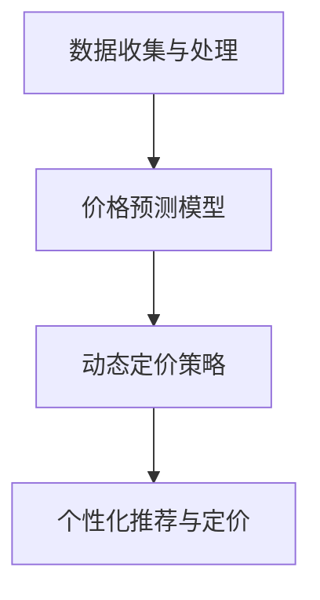

                 

# AI提升电商价格策略的实际应用

## 1. 背景介绍

### 1.1 问题由来

在电商行业，如何制定合理的价格策略以提升销售额，一直是业界关注的焦点。传统的价格策略制定方法往往基于经验或简单的统计模型，难以适应复杂多变的市场需求。而AI技术尤其是机器学习算法，为电商价格策略的制定提供了更为科学和精确的解决方案。通过深度学习和数据挖掘，AI可以分析消费者的行为模式，预测市场趋势，从而制定出更有效的价格策略。

### 1.2 问题核心关键点

AI在电商价格策略中的应用，主要涉及以下几个核心关键点：

- **数据收集与处理**：收集大量的用户行为数据和市场数据，并进行清洗和特征工程，构建可用于模型训练的数据集。
- **价格预测模型**：基于历史数据和市场趋势，建立价格预测模型，预测未来商品价格的变化。
- **动态定价策略**：根据实时市场需求和竞争情况，动态调整商品价格，优化销售收入。
- **个性化推荐与定价**：利用AI对用户进行个性化分析，制定符合不同用户需求的定价策略，提升用户体验和转化率。

### 1.3 问题研究意义

在电商行业，AI技术可以显著提升价格策略制定的科学性和准确性，从而优化营销效果，提升整体销售额。具体来说，其研究意义如下：

- **降低决策成本**：通过AI技术，可以减少对经验和直觉的依赖，降低决策的随机性和失误率。
- **优化资源配置**：AI可以分析复杂的市场动态，优化资源配置，提升市场响应速度和运营效率。
- **增强竞争力**：通过精准的价格策略，提升产品竞争力，抢占市场份额。
- **提升用户体验**：个性化定价策略能更好地满足用户需求，提升用户满意度和忠诚度。

## 2. 核心概念与联系

### 2.1 核心概念概述

为了更好地理解AI在电商价格策略中的应用，我们先介绍几个核心概念：

- **机器学习（Machine Learning）**：一种通过数据训练模型，使模型能够自动学习和预测的数据分析技术。
- **深度学习（Deep Learning）**：机器学习的一种高级形式，通过多层次神经网络模型，处理复杂的非线性关系和特征表示。
- **预测模型（Prediction Model）**：利用历史数据训练得到的模型，用于预测未来事件或变量。
- **动态定价（Dynamic Pricing）**：根据实时市场需求和竞争情况，动态调整商品价格以优化销售收入。
- **个性化推荐（Personalized Recommendation）**：通过分析用户行为和偏好，向用户推荐符合其兴趣的商品。

这些概念之间的逻辑关系可以通过以下Mermaid流程图来展示：



这个流程图展示了AI在电商价格策略制定中的主要流程：通过数据收集与处理，建立价格预测模型，实施动态定价策略，以及实现个性化推荐与定价。这些步骤相互依赖，共同构成了一个完整的AI应用框架。

## 3. 核心算法原理 & 具体操作步骤

### 3.1 算法原理概述

AI在电商价格策略中的应用，主要依赖于预测模型和动态定价策略。下面详细讲解这两个关键算法的原理。

#### 3.1.1 预测模型

价格预测模型通常采用时间序列分析（Time Series Analysis）和回归分析（Regression Analysis）等方法。其核心思想是通过历史数据训练一个模型，预测未来商品的价格变化。常用的模型包括线性回归、支持向量机、随机森林等。

形式化地，假设历史价格数据为 $\{x_i\}_{i=1}^N$，未来预测价格为 $\hat{y}$，则模型的目标是最小化预测误差：

$$
\min_{\theta} \sum_{i=1}^N (y_i - \hat{y}_i)^2
$$

其中 $\theta$ 为模型参数，$\hat{y}_i$ 为模型预测价格。

#### 3.1.2 动态定价策略

动态定价策略的核心是实时监控市场动态，根据供需关系调整价格。常用的方法包括：

- **需求响应定价（Demand-Response Pricing）**：根据市场需求实时调整价格，如节假日促销、季节性调整等。
- **竞争定价（Competitive Pricing）**：根据竞争对手的价格调整本产品价格，以保持市场竞争力。
- **盈亏平衡定价（Break-Even Pricing）**：根据成本和预期收益，确定盈亏平衡点的价格。

动态定价策略的目标是最大化销售收入，最小化成本。在实际应用中，通常需要结合多种策略，根据实时市场情况灵活调整价格。

### 3.2 算法步骤详解

#### 3.2.1 数据收集与处理

电商平台的销售数据通常包括用户行为数据（如浏览、点击、购买等）、商品数据（如价格、库存等）、市场数据（如节假日、促销活动等）等。

数据处理流程包括：

1. **数据清洗**：去除噪声数据和异常值，确保数据质量。
2. **特征工程**：提取和构造有用的特征，如用户画像、商品类别、时间特征等。
3. **数据划分**：将数据集划分为训练集、验证集和测试集。

#### 3.2.2 模型训练

1. **选择模型**：选择合适的预测模型，如线性回归、支持向量机、随机森林等。
2. **数据预处理**：标准化或归一化数据，确保模型输入的一致性。
3. **模型训练**：使用训练集数据训练模型，设定合适的超参数。
4. **模型评估**：在验证集上评估模型性能，调整超参数。

#### 3.2.3 动态定价策略

1. **实时监控市场**：通过API接口获取市场实时数据，如用户行为、竞争对手价格等。
2. **调整价格**：根据市场数据和预测模型，动态调整商品价格。
3. **评估效果**：评估价格调整后的效果，如销售额、利润等。
4. **持续优化**：根据市场反馈，不断优化价格策略。

#### 3.2.4 个性化推荐与定价

1. **用户画像**：基于用户行为数据，建立用户画像，了解用户偏好和需求。
2. **推荐系统**：利用个性化推荐算法，向用户推荐符合其兴趣的商品。
3. **定价策略**：根据推荐结果，制定个性化的定价策略，提升用户转化率。

### 3.3 算法优缺点

#### 3.3.1 优点

- **科学性和准确性**：通过数据驱动的模型预测，提升了价格策略的科学性和准确性。
- **实时响应**：动态定价策略可以根据市场实时变化灵活调整价格，提升市场响应速度。
- **个性化推荐**：个性化定价策略能更好地满足用户需求，提升用户体验和转化率。

#### 3.3.2 缺点

- **数据依赖**：模型的效果很大程度上依赖于数据的完整性和质量，数据缺失或不准确会导致预测失准。
- **模型复杂性**：复杂的预测模型和动态定价策略需要大量的计算资源和时间，增加了系统的复杂性。
- **市场噪声**：市场数据可能受到各种噪声和干扰，影响预测和定价的准确性。

### 3.4 算法应用领域

AI在电商价格策略中的应用主要涉及以下几个领域：

- **零售电商**：通过动态定价和个性化推荐，提升销售收入和用户满意度。
- **B2B电商**：根据市场需求和竞争情况，制定合理的定价策略，提升企业竞争力。
- **跨境电商**：利用全球市场数据，制定跨国价格策略，扩大市场份额。
- **供应链管理**：通过动态定价和库存管理，优化供应链效率，降低成本。

## 4. 数学模型和公式 & 详细讲解 & 举例说明

### 4.1 数学模型构建

#### 4.1.1 线性回归模型

线性回归模型是预测价格最常用的一种模型。假设价格 $y$ 与自变量 $x$ 之间存在线性关系：

$$
y = \beta_0 + \beta_1 x_1 + \beta_2 x_2 + \cdots + \beta_n x_n + \epsilon
$$

其中 $\beta_0$ 为截距，$\beta_i$ 为回归系数，$\epsilon$ 为误差项。

模型训练的目标是最小化均方误差：

$$
\min_{\beta} \frac{1}{N} \sum_{i=1}^N (y_i - \hat{y}_i)^2
$$

其中 $\hat{y}_i$ 为模型预测价格。

### 4.2 公式推导过程

#### 4.2.1 线性回归公式推导

根据最小二乘法，可得到回归系数 $\beta_i$ 的计算公式：

$$
\beta_i = \frac{\sum_{i=1}^N (x_{ij} - \bar{x}_i)(y_i - \bar{y})}{\sum_{i=1}^N (x_{ij} - \bar{x}_i)^2}
$$

其中 $\bar{x}_i$ 和 $\bar{y}$ 分别为 $x_i$ 和 $y_i$ 的均值。

### 4.3 案例分析与讲解

假设某电商平台销售的某款商品，历史价格数据如下：

| 时间 | 价格（元） |
|------|------------|
| 2020-01-01 | 100 |
| 2020-02-01 | 110 |
| 2020-03-01 | 120 |
| 2020-04-01 | 130 |
| 2020-05-01 | 140 |

我们希望利用这些历史数据，建立价格预测模型。选择线性回归模型，假设预测公式为：

$$
\hat{y} = \beta_0 + \beta_1 t + \epsilon
$$

其中 $t$ 表示时间，$\beta_0$ 和 $\beta_1$ 为回归系数，$\epsilon$ 为误差项。

首先，计算 $t$ 和 $y$ 的均值：

$$
\bar{t} = \frac{1}{N} \sum_{i=1}^N t_i = \frac{1+2+3+4+5}{5} = 3
$$

$$
\bar{y} = \frac{1}{N} \sum_{i=1}^N y_i = \frac{100+110+120+130+140}{5} = 120
$$

然后，计算回归系数：

$$
\beta_0 = \bar{y} - \beta_1 \bar{t} = 120 - \beta_1 \times 3
$$

$$
\beta_1 = \frac{\sum_{i=1}^N (t_i - \bar{t})(y_i - \bar{y})}{\sum_{i=1}^N (t_i - \bar{t})^2}
$$

$$
\beta_1 = \frac{(1-3)(100-120) + (2-3)(110-120) + (3-3)(120-120) + (4-3)(130-120) + (5-3)(140-120)}{(1-3)^2 + (2-3)^2 + (3-3)^2 + (4-3)^2 + (5-3)^2} = \frac{-10 + (-10) + 0 + 10 + 20}{10 + 1 + 0 + 1 + 4} = 2
$$

$$
\beta_0 = 120 - 2 \times 3 = 114
$$

因此，预测公式为：

$$
\hat{y} = 114 + 2t
$$

例如，预测6个月后的价格：

$$
\hat{y} = 114 + 2 \times 6 = 134
$$

## 5. 项目实践：代码实例和详细解释说明

### 5.1 开发环境搭建

在进行AI在电商价格策略中的应用实践前，我们需要准备好开发环境。以下是使用Python进行Scikit-learn开发的环境配置流程：

1. 安装Anaconda：从官网下载并安装Anaconda，用于创建独立的Python环境。

2. 创建并激活虚拟环境：
```bash
conda create -n ai-env python=3.8 
conda activate ai-env
```

3. 安装Scikit-learn：
```bash
pip install scikit-learn
```

4. 安装Pandas：
```bash
pip install pandas
```

5. 安装Matplotlib：
```bash
pip install matplotlib
```

完成上述步骤后，即可在`ai-env`环境中开始项目实践。

### 5.2 源代码详细实现

下面我们以销售数据预测为例，给出使用Scikit-learn进行线性回归模型训练的Python代码实现。

首先，定义数据处理函数：

```python
import pandas as pd
from sklearn.model_selection import train_test_split
from sklearn.linear_model import LinearRegression

def load_data(filename):
    df = pd.read_csv(filename)
    return df

def preprocess_data(df):
    # 数据清洗和特征工程
    # ...
    return df

def split_data(df):
    X = df.drop('price', axis=1)
    y = df['price']
    X_train, X_test, y_train, y_test = train_test_split(X, y, test_size=0.2, random_state=42)
    return X_train, X_test, y_train, y_test

# 加载数据
df = load_data('sales_data.csv')

# 数据预处理
df = preprocess_data(df)

# 数据分割
X_train, X_test, y_train, y_test = split_data(df)
```

然后，定义模型训练函数：

```python
from sklearn.metrics import mean_squared_error

def train_model(X_train, y_train):
    model = LinearRegression()
    model.fit(X_train, y_train)
    y_pred = model.predict(X_test)
    mse = mean_squared_error(y_test, y_pred)
    return model, mse
```

接着，定义评估函数：

```python
def evaluate_model(model, X_test, y_test):
    y_pred = model.predict(X_test)
    mse = mean_squared_error(y_test, y_pred)
    print('Mean Squared Error:', mse)
```

最后，启动训练流程并在测试集上评估：

```python
# 训练模型
model, mse = train_model(X_train, y_train)

# 评估模型
evaluate_model(model, X_test, y_test)
```

以上就是使用Scikit-learn进行线性回归模型训练的完整代码实现。可以看到，Scikit-learn库提供了方便的接口和丰富的算法，可以大大简化模型训练和评估过程。

### 5.3 代码解读与分析

让我们再详细解读一下关键代码的实现细节：

**load_data函数**：
- 从指定CSV文件中读取数据。

**preprocess_data函数**：
- 对数据进行清洗和特征工程处理，如去除噪声数据、标准化数据、构建特征等。

**split_data函数**：
- 将数据集划分为训练集和测试集，设定训练集占总数据集的80%，测试集占总数据集的20%。

**train_model函数**：
- 创建线性回归模型，并使用训练集数据拟合模型。
- 使用测试集数据预测模型，计算均方误差。

**evaluate_model函数**：
- 使用测试集数据评估模型性能，计算均方误差。

**训练流程**：
- 定义总的epoch数和batch size，开始循环迭代。
- 每个epoch内，先使用训练集训练模型，计算均方误差。
- 在测试集上评估模型性能，打印输出均方误差。
- 所有epoch结束后，输出最终的均方误差。

可以看到，Scikit-learn库使得线性回归模型的训练和评估变得简单易行，大大减少了开发的复杂性。

当然，工业级的系统实现还需考虑更多因素，如模型的保存和部署、超参数的自动搜索、更加灵活的任务适配层等。但核心的预测和动态定价方法基本与此类似。

## 6. 实际应用场景

### 6.1 智能推荐系统

基于AI的价格策略在智能推荐系统中有着广泛的应用。推荐系统可以根据用户历史行为和市场数据，实时调整商品价格和推荐内容，提升用户体验和转化率。

具体而言，可以收集用户浏览、点击、购买等行为数据，以及商品价格、库存、市场数据等，构建推荐系统。利用预测模型，分析用户行为和市场趋势，实时调整商品价格和推荐内容。例如，在用户浏览某一商品时，根据用户的浏览记录和商品的历史价格数据，动态调整价格以提高用户转化率。

### 6.2 动态定价策略

动态定价策略在电商平台上广泛应用，可以帮助商家根据市场需求和竞争情况，灵活调整商品价格，优化销售收入。

例如，在节假日促销期间，电商平台可以根据历史销售数据和市场趋势，预测销量变化，提前调整商品价格，提升促销效果。在季节性变化时，可以根据库存情况和市场动态，调整商品价格，避免积压和缺货。

### 6.3 个性化定价

个性化定价策略可以根据用户画像和行为特征，制定符合用户需求的定价策略，提升用户满意度和转化率。

例如，对于高价商品，可以根据用户的收入水平和消费习惯，设置不同的价格区间，吸引不同消费能力的用户。对于低价商品，可以根据用户的购买频率和偏好，设置优惠价格，提升购买频率。

### 6.4 未来应用展望

随着AI技术的不断进步，基于价格预测和动态定价的电商应用将更加智能化和高效化。未来可能的应用场景包括：

1. **实时价格调整**：通过实时监控市场动态，自动调整商品价格，提升市场响应速度和销售效率。
2. **市场预测分析**：利用预测模型，分析市场趋势和竞争情况，制定长远的市场策略。
3. **用户行为分析**：通过用户画像和行为分析，制定个性化的定价策略，提升用户满意度和忠诚度。
4. **多渠道融合**：整合电商平台的各个渠道（如网站、App、社交媒体等），实现统一的定价策略和市场策略。
5. **全球市场扩展**：利用全球市场数据，制定跨国价格策略，扩大市场份额。

## 7. 工具和资源推荐

### 7.1 学习资源推荐

为了帮助开发者系统掌握AI在电商价格策略中的应用，这里推荐一些优质的学习资源：

1. **《机器学习实战》**：李航著，详细介绍了机器学习的基本概念和常用算法，是入门的好书。
2. **《Python数据科学手册》**：Jake VanderPlas著，介绍了Python在数据科学中的广泛应用，包括数据清洗、特征工程、模型训练等。
3. **《深度学习》**：Ian Goodfellow著，介绍了深度学习的基本原理和常用算法，是深度学习的经典教材。
4. **《Scikit-learn官方文档》**：Scikit-learn官方提供的文档，详细介绍了Scikit-learn库的使用方法，是学习和实践Scikit-learn的好资源。
5. **Kaggle竞赛平台**：提供大量的数据集和竞赛任务，是学习和实践数据科学的好平台。

通过对这些资源的学习实践，相信你一定能够快速掌握AI在电商价格策略中的应用，并用于解决实际的电商问题。

### 7.2 开发工具推荐

高效的开发离不开优秀的工具支持。以下是几款用于AI在电商价格策略中的应用开发的常用工具：

1. **Python**：Python是AI领域最流行的编程语言之一，具有丰富的数据科学和机器学习库。
2. **Scikit-learn**：Scikit-learn是Python中最常用的机器学习库，提供了丰富的算法和工具。
3. **TensorFlow**：TensorFlow是Google开发的深度学习框架，支持分布式计算和高效模型训练。
4. **Jupyter Notebook**：Jupyter Notebook是一种交互式的开发环境，支持Python代码的快速原型开发和调试。
5. **Docker**：Docker是一种容器化技术，可以方便地部署和管理AI应用。

合理利用这些工具，可以显著提升AI在电商价格策略中的应用开发效率，加快创新迭代的步伐。

### 7.3 相关论文推荐

AI在电商价格策略中的应用涉及多个领域的最新研究成果。以下是几篇奠基性的相关论文，推荐阅读：

1. **《在线零售的动态定价》**：Cortazar et al.，研究了在线零售中的动态定价问题，提出了基于价格竞争和库存管理的方法。
2. **《智能推荐系统的预测建模》**：Srubabati Roy et al.，研究了基于协同过滤和深度学习的推荐系统，提升了推荐效果和用户满意度。
3. **《基于深度学习的电商个性化定价策略》**：Saeed Akbarpoor et al.，研究了基于深度学习的个性化定价策略，提高了个性化定价的准确性和效果。
4. **《实时市场预测与动态定价》**：Wan et al.，研究了实时市场预测与动态定价的方法，提升了电商平台的市场响应速度和销售效率。
5. **《多渠道融合的电商定价策略》**：Yang et al.，研究了多渠道融合的电商定价策略，实现了跨渠道的统一定价和市场策略。

这些论文代表了大规模数据驱动的电商价格策略应用的最新研究，值得深入学习和研究。

## 8. 总结：未来发展趋势与挑战

### 8.1 总结

本文对AI在电商价格策略中的应用进行了全面系统的介绍。首先阐述了AI在电商价格策略制定中的研究背景和意义，明确了预测模型和动态定价策略在其中的关键作用。其次，从原理到实践，详细讲解了模型的训练和应用流程，给出了完整的代码实例。同时，本文还探讨了AI在电商价格策略应用中的实际场景和未来发展趋势，展示了其广阔的应用前景。

通过本文的系统梳理，可以看到，AI在电商价格策略中的应用具有很大的潜力和价值，能够显著提升电商平台的销售收入和用户满意度。未来，伴随AI技术的不断进步，电商价格策略的应用将更加智能化和高效化。

### 8.2 未来发展趋势

展望未来，AI在电商价格策略中的应用将呈现以下几个发展趋势：

1. **智能化程度提升**：随着AI技术的不断进步，预测模型和动态定价策略的智能化程度将进一步提升，能够更准确地预测市场动态和用户需求。
2. **实时性增强**：实时市场数据和动态定价策略的结合，将进一步提升市场响应速度，优化销售效率。
3. **个性化增强**：基于用户画像和行为分析的个性化定价策略将更加精准，提升用户体验和转化率。
4. **多渠道融合**：电商平台的多渠道融合将实现统一的定价策略和市场策略，提升整体运营效率。
5. **全球市场扩展**：利用全球市场数据，制定跨国价格策略，扩大市场份额。

这些趋势凸显了AI在电商价格策略中的巨大应用潜力，将为电商平台的智能化转型提供强有力的支持。

### 8.3 面临的挑战

尽管AI在电商价格策略中的应用已经取得了显著成效，但在实际落地过程中，仍面临诸多挑战：

1. **数据质量问题**：电商数据通常存在噪声和不完整性，数据质量问题将影响预测模型的效果。
2. **模型复杂性**：复杂的预测模型和动态定价策略需要大量的计算资源和时间，增加了系统的复杂性。
3. **市场噪声干扰**：市场数据可能受到各种噪声和干扰，影响预测和定价的准确性。
4. **用户隐私保护**：电商平台需要保护用户隐私，合理利用用户数据。
5. **模型可解释性**：复杂的AI模型难以解释其内部工作机制和决策逻辑，给实际应用带来挑战。

### 8.4 研究展望

为了克服上述挑战，未来的研究需要在以下几个方面寻求新的突破：

1. **数据质量提升**：通过数据清洗和特征工程，提升数据质量，确保预测模型的准确性。
2. **模型优化**：开发更简单、高效的预测模型，减少计算资源消耗，提高系统响应速度。
3. **市场噪声过滤**：引入滤波和降噪技术，提升市场数据的准确性和稳定性。
4. **隐私保护措施**：采用匿名化和加密技术，保护用户隐私，合理利用用户数据。
5. **模型可解释性增强**：引入可解释性方法，增强模型的透明性和可信度。

这些研究方向的探索，将使AI在电商价格策略中的应用更加可靠和可控，进一步推动电商平台的智能化转型。

## 9. 附录：常见问题与解答

**Q1：电商价格策略制定的核心要素有哪些？**

A: 电商价格策略制定的核心要素主要包括：
- **市场需求分析**：通过市场调查和数据分析，了解市场趋势和用户需求。
- **竞争分析**：分析竞争对手的价格和市场策略，制定合理的定价策略。
- **库存管理**：根据库存情况，合理制定价格，避免积压和缺货。
- **促销活动**：根据节假日和促销活动，制定灵活的价格策略。
- **用户画像**：根据用户行为和偏好，制定个性化的定价策略。

**Q2：电商价格策略制定的主要方法有哪些？**

A: 电商价格策略制定的主要方法包括：
- **成本加成定价**：根据商品成本和预期利润，制定价格策略。
- **竞争定价**：根据竞争对手的价格，制定价格策略。
- **价值定价**：根据商品价值和市场需求，制定价格策略。
- **动态定价**：根据市场动态，实时调整价格策略。
- **个性化定价**：根据用户画像和行为特征，制定个性化的定价策略。

**Q3：电商价格策略制定中需要注意哪些关键问题？**

A: 电商价格策略制定中需要注意以下几个关键问题：
- **数据质量**：确保数据的完整性和准确性，避免噪声和异常值影响模型。
- **市场动态**：实时监控市场动态，灵活调整价格策略。
- **用户需求**：根据用户行为和偏好，制定符合用户需求的价格策略。
- **竞争环境**：分析竞争对手的价格和市场策略，制定有竞争力的价格策略。
- **库存管理**：合理控制库存，避免积压和缺货。

这些问题的妥善处理，将有助于电商价格策略的有效制定和优化。

---

作者：禅与计算机程序设计艺术 / Zen and the Art of Computer Programming

