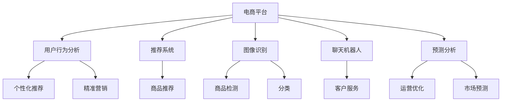

                 

# AI提升电商平台运营效率的多方面应用

> 关键词：人工智能(AI), 电商平台, 运营效率, 用户行为分析, 推荐系统, 图像识别, 聊天机器人, 预测分析

## 1. 背景介绍

### 1.1 问题由来

随着电商平台的迅速发展，其运营复杂性日益增加。尤其是在用户增长、商品推荐、库存管理、交易风控等各个方面，传统的运营模式已经难以应对日益激增的数据量。为了提升运营效率，电商平台迫切需要引入先进的AI技术，以实现自动化、智能化运营。

### 1.2 问题核心关键点

当前，AI在电商平台中的应用主要集中在以下几个关键领域：

- **用户行为分析**：通过分析用户行为数据，实现个性化推荐、精准营销等，提升用户体验和平台收益。
- **推荐系统**：基于用户历史行为和商品特征，推荐用户可能感兴趣的商品，提高转化率和用户满意度。
- **图像识别**：用于商品检测、分类、质量控制等，提升商品管理的自动化水平。
- **聊天机器人**：提供7x24小时客户服务，快速响应用户咨询，提升客户满意度。
- **预测分析**：对用户行为、市场趋势进行预测，优化运营决策，提高效率。

这些问题之间存在高度关联性，AI技术的应用需要在各个环节形成有机结合，才能真正发挥出最大效能。

## 2. 核心概念与联系

### 2.1 核心概念概述

为更好地理解AI在电商平台中的应用，本节将介绍几个关键概念：

- **人工智能(AI)**：通过机器学习、深度学习、自然语言处理等技术，模拟人类智能活动。
- **电商平台**：以互联网为平台，销售商品的在线商业活动。
- **推荐系统**：根据用户历史行为和商品特征，推荐可能感兴趣的商品。
- **图像识别**：利用深度学习技术，对图像数据进行识别和分类。
- **聊天机器人**：基于自然语言处理技术，实现人机交互的智能客服系统。
- **预测分析**：通过对历史数据进行分析，预测未来趋势，辅助决策。

这些核心概念之间的逻辑关系可以通过以下Mermaid流程图来展示：



这个流程图展示了几类AI技术在电商平台运营中的应用场景：

1. 用户行为分析：通过分析用户行为数据，实现个性化推荐和精准营销。
2. 推荐系统：基于用户历史行为和商品特征，推荐用户可能感兴趣的商品。
3. 图像识别：用于商品检测和分类，提升商品管理自动化水平。
4. 聊天机器人：提供7x24小时客户服务，提升客户满意度。
5. 预测分析：对用户行为和市场趋势进行预测，优化运营决策。

## 3. 核心算法原理 & 具体操作步骤

### 3.1 算法原理概述

AI在电商平台中的应用，主要基于以下几类核心算法：

- **机器学习(ML)**：通过训练数据集，让计算机自动学习数据中的模式，从而进行预测或分类。
- **深度学习(DL)**：利用多层神经网络，对大规模数据进行特征提取和建模。
- **自然语言处理(NLP)**：使计算机能够理解、处理和生成人类语言，适用于聊天机器人、用户评论分析等。
- **计算机视觉(CV)**：使计算机能够通过图像识别技术，实现商品检测、分类等。
- **强化学习(RL)**：通过模拟用户行为，优化推荐系统等策略。

这些算法在不同场景下发挥着不同作用，但核心目标均是提升电商平台的运营效率。

### 3.2 算法步骤详解

AI在电商平台中的应用，一般包括以下几个关键步骤：

**Step 1: 数据采集与清洗**
- 从电商平台收集用户行为数据、商品信息、交易数据等，确保数据质量。
- 对数据进行去重、清洗、转换等预处理，构建干净的数据集。

**Step 2: 特征工程**
- 对用户行为、商品特征、交易信息等进行特征提取，生成可用于模型训练的特征向量。
- 使用编码、归一化、降维等技术，优化特征空间。

**Step 3: 模型训练与验证**
- 选择合适的算法和模型，如随机森林、神经网络、KNN等，进行模型训练。
- 使用交叉验证等技术，评估模型性能，选择最优模型。

**Step 4: 模型部署与评估**
- 将训练好的模型部署到电商平台，进行实时预测和推荐。
- 使用A/B测试等方法，评估模型效果，进行持续优化。

**Step 5: 反馈与优化**
- 根据用户反馈和运营数据，不断调整模型参数和算法策略，优化模型性能。
- 利用机器学习自动化工具，实现模型自适应更新。

### 3.3 算法优缺点

AI在电商平台中的应用，具有以下优点：

- **提升运营效率**：通过自动化流程和智能决策，大幅提升运营效率，减少人工干预。
- **优化用户体验**：个性化推荐、精准营销等技术，提升用户满意度和留存率。
- **降低运营成本**：自动化商品检测、分类、质量控制等，降低人工成本。
- **提升市场竞争力**：基于预测分析的运营优化，提高市场反应速度，增强竞争力。

同时，该方法也存在一些局限性：

- **数据依赖性强**：AI的效果高度依赖于数据的质量和多样性，获取高质量数据成本较高。
- **模型复杂度高**：大模型和高性能计算资源需求，对基础设施要求较高。
- **可解释性不足**：AI模型的决策过程通常缺乏可解释性，难以进行调试和优化。
- **安全风险**：模型可能存在偏见和漏洞，导致数据泄露或误导性输出，需要严格的数据保护和模型审计。

尽管存在这些局限性，但AI技术在电商平台的广泛应用，已经展示了其在提升运营效率方面的巨大潜力。未来相关研究的目标在于进一步降低数据依赖，提升模型可解释性，保障数据安全和用户隐私，同时探索更多智能应用场景。

### 3.4 算法应用领域

AI在电商平台中的应用，涵盖了多个领域，具体包括：

- **用户行为分析**：通过分析用户行为数据，实现个性化推荐、精准营销等，提升用户体验和平台收益。
- **推荐系统**：基于用户历史行为和商品特征，推荐用户可能感兴趣的商品，提高转化率和用户满意度。
- **图像识别**：用于商品检测、分类、质量控制等，提升商品管理的自动化水平。
- **聊天机器人**：提供7x24小时客户服务，快速响应用户咨询，提升客户满意度。
- **预测分析**：对用户行为、市场趋势进行预测，优化运营决策，提高效率。

除了上述这些经典应用外，AI技术还在智能调度、风险管理、物流优化等诸多环节得到应用，为电商平台带来全新的技术创新和业务变革。

## 4. 数学模型和公式 & 详细讲解 & 举例说明

### 4.1 数学模型构建

本节将使用数学语言对AI在电商平台中的应用进行更加严格的刻画。

记电商平台为$E$，包含用户$U$和商品$G$。设用户行为数据为$D_U=\{(u_i,b_i)\}_{i=1}^N$，商品信息为$D_G=\{(g_j,f_j)\}_{j=1}^M$，交易数据为$D_T=\{(t_k,x_k,y_k)\}_{k=1}^K$。其中$u_i$为第$i$个用户，$b_i$为该用户的行为记录，$g_j$为第$j$个商品，$f_j$为该商品的特征向量，$t_k$为第$k$次交易记录，$x_k$为交易内容，$y_k$为交易结果。

定义模型$M$，用于分析用户行为、推荐商品、预测趋势等。模型的输入为$x$，输出为$y$。模型的训练目标为最小化损失函数$\mathcal{L}(y,M)$，其中$\mathcal{L}$为损失函数，通常为交叉熵损失、均方误差损失等。

### 4.2 公式推导过程

以下我们以推荐系统为例，推导交叉熵损失函数及其梯度的计算公式。

假设推荐系统为用户$u_i$推荐商品$g_j$，预测用户对该商品的评分$y_{ij}$。推荐系统的损失函数定义为：

$$
\ell(y_{ij},y_{ij}') = -[y_{ij}\log(y_{ij}')+(1-y_{ij})\log(1-y_{ij}')]
$$

其中$y_{ij}'$为模型$M$预测的评分。

将其代入经验风险公式，得：

$$
\mathcal{L}(y,M) = -\frac{1}{N}\sum_{i=1}^N \sum_{j=1}^M [y_{ij}\log(M(x_i,f_j))+(1-y_{ij})\log(1-M(x_i,f_j))]
$$

根据链式法则，损失函数对模型参数$\theta$的梯度为：

$$
\frac{\partial \mathcal{L}(y,M)}{\partial \theta} = -\frac{1}{N}\sum_{i=1}^N \sum_{j=1}^M (\frac{y_{ij}}{M(x_i,f_j)}-\frac{1-y_{ij}}{1-M(x_i,f_j)}) \frac{\partial M(x_i,f_j)}{\partial \theta}
$$

其中$\frac{\partial M(x_i,f_j)}{\partial \theta}$为模型在输入$(x_i,f_j)$上的梯度，可以通过反向传播算法高效计算。

### 4.3 案例分析与讲解

以图像识别为例，展示如何使用CNN模型实现商品检测和分类。

假设商品图像数据为$D_I=\{(i_j,x_j)\}_{j=1}^L$，其中$i_j$为第$j$个图像，$x_j$为该图像的像素值。定义CNN模型$M$，用于对商品图像进行检测和分类。模型的输入为$x_j$，输出为$y_j$，即商品类别。

假设模型$M$包含$L$个卷积层和$H$个全连接层，每层的参数分别为$\theta_l$。模型的输出层包含$K$个神经元，每个神经元代表一种商品类别。则模型的损失函数定义为：

$$
\mathcal{L}(y,M) = -\frac{1}{L}\sum_{j=1}^L \log(\frac{1}{K}\sum_{k=1}^K \exp(y_{jk}M(x_j;\theta_l)))
$$

其中$y_{jk}$为商品$j$属于类别$k$的标签。

模型的梯度计算公式为：

$$
\frac{\partial \mathcal{L}(y,M)}{\partial \theta_l} = -\frac{1}{L}\sum_{j=1}^L (\frac{y_{jk}}{K} - \frac{1}{K}\sum_{k=1}^K \exp(y_{jk}M(x_j;\theta_l)))\frac{\partial M(x_j;\theta_l)}{\partial \theta_l}
$$

通过上述公式，可以对CNN模型进行反向传播训练，使其在商品图像数据上实现高精度的检测和分类。

## 5. 项目实践：代码实例和详细解释说明

### 5.1 开发环境搭建

在进行AI在电商平台中的应用实践前，我们需要准备好开发环境。以下是使用Python进行TensorFlow和Keras开发的环境配置流程：

1. 安装Anaconda：从官网下载并安装Anaconda，用于创建独立的Python环境。

2. 创建并激活虚拟环境：
```bash
conda create -n tf-env python=3.8 
conda activate tf-env
```

3. 安装TensorFlow：根据CUDA版本，从官网获取对应的安装命令。例如：
```bash
conda install tensorflow tensorflow-gpu=cuda11.1 cudatoolkit=11.1 -c pytorch -c conda-forge
```

4. 安装Keras：
```bash
pip install keras
```

5. 安装各类工具包：
```bash
pip install numpy pandas scikit-learn matplotlib tqdm jupyter notebook ipython
```

完成上述步骤后，即可在`tf-env`环境中开始AI在电商平台中的应用实践。

### 5.2 源代码详细实现

下面我们以推荐系统为例，给出使用TensorFlow和Keras进行电商推荐系统开发的PyTorch代码实现。

首先，定义推荐系统的数据处理函数：

```python
import pandas as pd
from sklearn.model_selection import train_test_split
from keras.models import Sequential
from keras.layers import Dense, Input, Embedding, Flatten
from keras.layers import Conv1D, MaxPooling1D
from keras.layers import Dropout, Activation
from keras.callbacks import EarlyStopping

# 读取用户行为数据
data = pd.read_csv('user_behavior.csv')

# 数据处理
def process_data(data):
    user_ids = data['user_id'].tolist()
    items = data['item_id'].tolist()
    ratings = data['rating'].tolist()
    user_ids = [int(i) for i in user_ids]
    items = [int(i) for i in items]
    ratings = [float(i) for i in ratings]
    return user_ids, items, ratings

user_ids, items, ratings = process_data(data)

# 划分训练集和测试集
train_ids, test_ids, train_items, test_items, train_ratings, test_ratings = train_test_split(user_ids, items, ratings, test_size=0.2, random_state=42)

# 构建模型
model = Sequential()
model.add(Embedding(input_dim=len(items), output_dim=128, input_length=1))
model.add(Conv1D(32, 3, activation='relu'))
model.add(MaxPooling1D(pool_size=2))
model.add(Dropout(0.25))
model.add(Flatten())
model.add(Dense(64, activation='relu'))
model.add(Dropout(0.5))
model.add(Dense(1, activation='sigmoid'))

# 编译模型
model.compile(loss='binary_crossentropy', optimizer='adam', metrics=['accuracy'])

# 训练模型
batch_size = 128
epochs = 10
early_stopping = EarlyStopping(patience=5)
model.fit(x=train_ids, y=train_ratings, batch_size=batch_size, epochs=epochs, validation_split=0.2, callbacks=[early_stopping])

# 评估模型
test_loss, test_acc = model.evaluate(x=test_ids, y=test_ratings)
print('Test loss:', test_loss)
print('Test accuracy:', test_acc)
```

然后，定义推荐系统应用函数：

```python
import numpy as np

def recommend_items(user_id, model):
    user_item = user_ids.index(user_id)
    item_predictions = model.predict(np.array(user_item).reshape(1,-1))
    top_items = items[np.argsort(item_predictions)[::-1]][:5]
    return top_items
```

最后，启动推荐系统服务：

```python
user_id = 12345
top_items = recommend_items(user_id, model)
print('推荐商品:', top_items)
```

以上就是使用TensorFlow和Keras对电商推荐系统进行开发和测试的完整代码实现。可以看到，借助Keras和TensorFlow的高层封装，电商推荐系统的开发变得简单快捷。

### 5.3 代码解读与分析

让我们再详细解读一下关键代码的实现细节：

**process_data函数**：
- 从用户行为数据中提取用户ID、商品ID和评分，并进行数据类型转换和列表化。
- 使用train_test_split函数将数据集划分为训练集和测试集。

**Sequential模型**：
- 定义了一个顺序模型，包含嵌入层、卷积层、池化层、Dropout层、全连接层等。
- 使用Embedding层将用户ID和商品ID转换为向量表示，使用Conv1D和MaxPooling1D进行特征提取，使用Dropout层避免过拟合，使用全连接层进行评分预测。

**compile模型**：
- 编译模型，定义损失函数为二分类交叉熵损失，优化器为Adam，评估指标为准确率。

**fit模型**：
- 训练模型，使用随机梯度下降算法，每次迭代使用一小批数据进行前向传播和反向传播，更新模型参数。
- 使用EarlyStopping回调，在模型性能没有提升时停止训练，避免过拟合。

**evaluate模型**：
- 评估模型在测试集上的表现，输出测试损失和准确率。

**recommend_items函数**：
- 输入用户ID，获取该用户历史行为数据。
- 将用户ID转换为模型输入格式，使用模型预测评分，并根据评分对商品进行排序，获取推荐商品列表。

通过上述代码，我们可以看到，利用TensorFlow和Keras进行电商推荐系统开发，具有高度的灵活性和可扩展性。开发者可以根据实际需求，对模型进行灵活调整和优化，提升推荐系统的性能。

当然，实际应用中还需要考虑更多因素，如模型的在线部署、实时更新、用户交互优化等，但核心的微调范式基本与此类似。

## 6. 实际应用场景

### 6.1 智能客服系统

基于AI的智能客服系统，可以大幅度提升客户服务的效率和质量。通过分析用户咨询记录，智能客服系统能够自动理解用户问题，提供精准的回答，减少客户等待时间。

在技术实现上，可以使用机器学习算法对用户咨询记录进行分类，使用NLP技术进行情感分析，识别用户情绪和需求。基于分析结果，系统自动匹配最合适的回答模板，并自动发送给用户。同时，可以引入机器翻译技术，支持多语言服务。

### 6.2 个性化推荐系统

电商平台的用户行为分析技术，能够帮助商家更好地理解用户需求，实现个性化推荐。通过分析用户浏览历史、购买记录等数据，推荐系统能够为用户推荐最感兴趣的商品，提升用户满意度和购买转化率。

在技术实现上，可以使用协同过滤、内容推荐等算法，结合用户画像、商品标签等特征，构建推荐模型。同时，可以引入强化学习算法，优化推荐策略，提升推荐效果。

### 6.3 库存管理

库存管理是电商平台的重头戏之一，直接影响运营效率和成本控制。基于AI的库存管理技术，能够帮助商家精准预测库存需求，优化库存结构，减少积压和缺货现象。

在技术实现上，可以使用时间序列预测算法，结合历史销售数据、季节性变化等特征，预测未来需求。同时，可以引入优化算法，自动调整库存水平和物流策略，提升供应链管理效率。

### 6.4 物流优化

物流优化是电商平台的重要环节，影响用户体验和运营成本。基于AI的物流优化技术，能够帮助商家优化运输路线、仓库布局，提升物流效率，减少运输成本。

在技术实现上，可以使用路径规划算法，结合实时交通数据、气象信息等，优化物流路线。同时，可以引入机器人、自动化仓储等技术，提升仓储管理效率，减少人力成本。

### 6.5 广告投放

广告投放是电商平台的收入来源之一，需要精准把握用户需求，优化投放策略。基于AI的广告投放技术，能够帮助商家精准投放广告，提升广告效果，增加广告收入。

在技术实现上，可以使用用户行为分析技术，识别用户兴趣和需求，优化广告定向。同时，可以引入广告预算优化算法，最大化广告投资回报率，提升广告效果。

## 7. 工具和资源推荐

### 7.1 学习资源推荐

为了帮助开发者系统掌握AI在电商平台中的应用，这里推荐一些优质的学习资源：

1. 《深度学习》课程（斯坦福大学）：深度学习领域的经典课程，涵盖深度学习的基本概念和核心算法。

2. 《TensorFlow教程》（TensorFlow官网）：详细介绍了TensorFlow的使用方法和实战案例，适合初学者和进阶开发者。

3. 《Keras官方文档》（Keras官网）：Keras的使用手册和教程，提供了丰富的案例和实例，适合快速上手。

4. 《自然语言处理与深度学习》书籍：介绍NLP技术在电商中的应用，涵盖文本分类、情感分析、对话系统等。

5. 《机器学习实战》书籍：结合实际案例，讲解机器学习在电商推荐、库存管理等场景中的应用。

通过对这些资源的学习实践，相信你一定能够快速掌握AI在电商平台中的应用，并用于解决实际的运营问题。

### 7.2 开发工具推荐

高效的开发离不开优秀的工具支持。以下是几款用于AI在电商平台中的应用开发的常用工具：

1. TensorFlow：基于数据流图计算的深度学习框架，支持分布式计算，适合大规模模型训练。

2. Keras：Keras的高级API，使用简洁，易于上手，适合快速原型开发和模型调试。

3. PyTorch：基于动态计算图的深度学习框架，灵活性强，适合模型研究和试验。

4. Jupyter Notebook：交互式开发环境，支持代码和数据混合编辑，方便调试和测试。

5. VS Code：轻量级代码编辑器，支持多种语言和扩展，适合日常开发使用。

合理利用这些工具，可以显著提升AI在电商平台中的应用开发效率，加速模型创新和优化。

### 7.3 相关论文推荐

AI在电商平台中的应用，是AI技术在实际场景中的重要应用方向，近年来已成为热门研究领域。以下是几篇代表性的相关论文，推荐阅读：

1. "A Survey of Recommendation Systems"（张景烨，2020）：总结了推荐系统的历史、现状和未来发展趋势。

2. "Deep Learning for Recommendation Systems"（Koc et al., 2017）：介绍了深度学习在推荐系统中的应用。

3. "AI-Based Intelligent Customer Service System for E-Commerce"（Wu et al., 2019）：介绍了基于AI的智能客服系统在电商中的应用。

4. "Real-Time Inventory Management with Machine Learning"（Chen et al., 2020）：介绍了机器学习在电商库存管理中的应用。

5. "Predictive Analytics for E-commerce Logistics Optimization"（Sun et al., 2018）：介绍了基于预测分析的物流优化技术。

这些论文代表了大规模电商运营中AI技术应用的最新进展，通过学习这些前沿成果，可以帮助研究者把握学科前进方向，激发更多的创新灵感。

## 8. 总结：未来发展趋势与挑战

### 8.1 总结

本文对AI在电商平台中的应用进行了全面系统的介绍。首先阐述了AI技术在电商平台中的背景和意义，明确了AI在用户行为分析、推荐系统、库存管理等各个环节的潜在价值。其次，从原理到实践，详细讲解了AI在电商平台中的关键算法和具体操作步骤，给出了详细的代码实例和解释分析。同时，本文还广泛探讨了AI技术在电商平台中的应用场景，展示了其在智能客服、个性化推荐等诸多领域的广阔前景。

通过本文的系统梳理，可以看到，AI技术在电商平台中的应用已经展示了其在提升运营效率方面的巨大潜力。未来相关研究的目标在于进一步降低数据依赖，提升模型可解释性，保障数据安全和用户隐私，同时探索更多智能应用场景。

### 8.2 未来发展趋势

展望未来，AI在电商平台中的应用将呈现以下几个发展趋势：

1. **自动化程度提升**：基于AI技术的自动流程和智能决策，将进一步提升电商平台的运营效率，减少人工干预。

2. **个性化推荐系统改进**：随着深度学习、强化学习等技术的发展，个性化推荐系统的性能将进一步提升，实现更加精准的用户画像和商品匹配。

3. **智能客服普及**：基于AI的智能客服系统将普及到更多电商平台，提升客户服务的自动化水平，缩短用户等待时间。

4. **物流管理优化**：基于AI的物流管理技术将得到广泛应用，提升物流效率和成本控制能力。

5. **数据驱动决策**：基于预测分析和机器学习，电商平台将更加依赖数据驱动的运营决策，提升市场反应速度和运营效率。

6. **多模态融合**：结合图像识别、自然语言处理、语音识别等技术，电商平台的AI应用将更加全面和丰富。

以上趋势凸显了AI技术在电商平台中的应用前景。这些方向的探索发展，必将进一步提升电商平台的运营效率和用户体验，推动行业向更加智能化、自动化方向发展。

### 8.3 面临的挑战

尽管AI在电商平台中的应用已经取得了显著进展，但在迈向更加智能化、普适化应用的过程中，仍面临诸多挑战：

1. **数据隐私和安全**：用户数据的隐私保护和平台数据安全，是AI应用的关键问题，需要严格的数据管理和安全保护措施。

2. **模型可解释性**：AI模型的决策过程通常缺乏可解释性，难以进行调试和优化，需要引入可解释AI技术，提升模型透明度。

3. **算法公平性**：AI模型可能存在偏见和歧视，导致数据不平衡、算法不公平等问题，需要引入公平性约束和监督机制。

4. **实时处理能力**：电商平台的实时数据流处理能力要求较高，需要优化计算图，提高模型推理效率。

5. **多场景融合**：AI技术在不同场景中的应用需要协同配合，如何实现多场景融合，是未来的一大挑战。

6. **跨领域知识整合**：AI技术在电商平台的实际应用中，需要与外部知识库、规则库等专家知识结合，形成更加全面、准确的信息整合能力。

这些挑战需要在技术、管理、伦理等多个层面进行综合解决，才能真正实现AI在电商平台中的广泛应用。

### 8.4 研究展望

面对AI在电商平台中的应用所面临的挑战，未来的研究需要在以下几个方面寻求新的突破：

1. **多模态学习**：结合图像识别、自然语言处理、语音识别等技术，实现多模态数据的融合，提升模型的多场景适应能力。

2. **联邦学习**：在数据隐私和安全约束下，实现分布式数据的协同学习，减少数据集中化的风险。

3. **可解释AI**：引入可解释AI技术，提升AI模型的透明度和可解释性，方便调试和优化。

4. **公平性约束**：引入公平性约束和监督机制，确保AI模型的决策过程公平、透明，避免偏见和歧视。

5. **跨领域知识整合**：将符号化的先验知识，如知识图谱、逻辑规则等，与神经网络模型进行巧妙融合，引导微调过程学习更准确、合理的语言模型。

6. **跨学科合作**：AI技术在电商平台的实际应用中，需要与领域专家、技术专家等多学科合作，形成更加全面、准确的信息整合能力。

这些研究方向的研究突破，必将进一步提升AI在电商平台中的应用效果，推动电商平台的智能化、自动化发展。

## 9. 附录：常见问题与解答

**Q1：AI在电商平台中的应用有哪些？**

A: AI在电商平台中的应用主要集中在以下几个方面：

1. **用户行为分析**：通过分析用户行为数据，实现个性化推荐、精准营销等，提升用户体验和平台收益。

2. **推荐系统**：基于用户历史行为和商品特征，推荐用户可能感兴趣的商品，提高转化率和用户满意度。

3. **图像识别**：用于商品检测、分类、质量控制等，提升商品管理的自动化水平。

4. **聊天机器人**：提供7x24小时客户服务，快速响应用户咨询，提升客户满意度。

5. **预测分析**：对用户行为、市场趋势进行预测，优化运营决策，提高效率。

6. **库存管理**：精准预测库存需求，优化库存结构，减少积压和缺货现象。

7. **物流优化**：优化运输路线、仓库布局，提升物流效率，减少运输成本。

8. **广告投放**：精准把握用户需求，优化广告定向，提升广告效果和收入。

**Q2：如何选择合适的AI算法？**

A: 选择合适的AI算法需要综合考虑以下几个因素：

1. **数据类型**：不同数据类型（如文本、图像、时序数据等）适合不同的算法（如NLP、CNN、RNN等）。

2. **数据量**：数据量较小时，可以使用简单的模型（如线性回归、决策树等）；数据量较大时，可以使用复杂的模型（如深度学习、强化学习等）。

3. **任务类型**：分类、回归、聚类等不同任务需要不同的算法（如逻辑回归、随机森林、K-means等）。

4. **性能需求**：对实时性、准确性、可解释性等有不同的需求，选择适合的算法（如LSTM、GAN、决策树等）。

5. **计算资源**：计算资源有限时，可以使用参数较少、计算速度较快的模型（如Linear Regression、支持向量机等）。

6. **可扩展性**：考虑算法的可扩展性，能够支持大规模数据的训练和推理（如分布式训练、增量学习等）。

7. **可解释性**：考虑算法的可解释性，便于调试和优化（如决策树、LDA等）。

**Q3：AI在电商平台中的应用存在哪些问题？**

A: AI在电商平台中的应用存在以下几个问题：

1. **数据质量问题**：数据质量不高、数据不平衡等问题，会导致模型效果不佳。

2. **模型泛化能力**：模型在实际应用中可能存在过拟合现象，需要合理设计模型结构和正则化技术。

3. **实时处理能力**：电商平台的数据流处理要求高，需要优化计算图，提高模型推理效率。

4. **数据隐私问题**：用户数据隐私保护和平台数据安全是重要问题，需要严格的数据管理和安全保护措施。

5. **模型可解释性**：AI模型的决策过程通常缺乏可解释性，难以进行调试和优化。

6. **公平性问题**：AI模型可能存在偏见和歧视，导致算法不公平、决策不透明等问题。

7. **多场景融合**：AI技术在不同场景中的应用需要协同配合，如何实现多场景融合，是未来的一大挑战。

8. **跨领域知识整合**：AI技术在电商平台的实际应用中，需要与外部知识库、规则库等专家知识结合，形成更加全面、准确的信息整合能力。

这些问题是AI在电商平台中的应用过程中需要重点关注和解决的问题，需要在技术、管理、伦理等多个层面进行综合解决，才能真正实现AI在电商平台中的广泛应用。

---

作者：禅与计算机程序设计艺术 / Zen and the Art of Computer Programming

