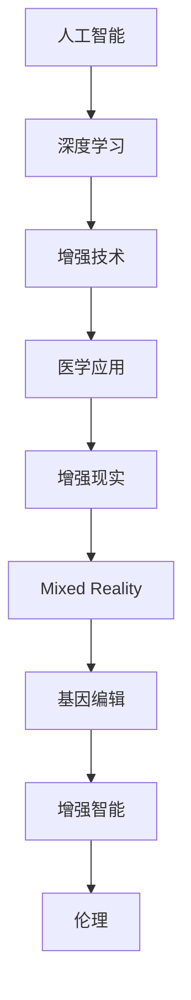

                 

# AI时代的人类增强：道德考虑与身体增强的未来发展趋势分析

> 关键词：人工智能, 增强技术, 医学应用, 伦理挑战, 社会影响

## 1. 背景介绍

### 1.1 问题由来

随着人工智能技术的迅猛发展，AI时代已经悄然到来。它正在深刻地改变着我们的生活方式、工作模式和社会结构。在这个背景下，人工智能尤其是深度学习技术的普及，推动了“人类增强”(Human Augmentation)技术的发展。人类增强旨在通过技术手段，改善人类的生理和心理机能，从而提高生活质量和工作效率。而身体增强，作为人类增强的重要组成部分，涉及到人体肢体和感官的改造，是AI时代的热点话题之一。

身体增强技术的进步不仅带来了医学治疗上的突破，也引发了一系列伦理和法律问题。如何平衡技术发展与社会责任，是摆在人类面前的一个重大课题。因此，本文将从道德角度出发，分析身体增强的未来发展趋势，并探讨在AI时代中人类增强面临的挑战与对策。

## 2. 核心概念与联系

### 2.1 核心概念概述

- **人工智能（AI）**：人工智能是计算机科学的一个分支，旨在创建能够执行通常需要人类智能的任务的机器。
- **深度学习（Deep Learning）**：深度学习是一种通过多层神经网络学习数据的复杂表示的机器学习方法。
- **人类增强（Human Augmentation）**：人类增强是指通过生物工程、医学技术和信息技术的结合，增强人类的能力。
- **身体增强（Body Enhancement）**：身体增强指通过改造人体的物理结构或功能，提升人类的生理和感官性能。
- **增强现实（Augmented Reality, AR）**：增强现实是将虚拟信息叠加到现实世界中，提升人类的感知体验。
- **混合现实（Mixed Reality, MR）**：混合现实是将虚拟环境和现实环境融合，进一步增强人类与环境的互动。
- **基因编辑（Genetic Editing）**：基因编辑指通过CRISPR等技术，修改人体基因，提升遗传特性。
- **增强智能（Enhanced Intelligence）**：增强智能指通过脑机接口、神经义肢等技术，增强人类的认知和处理能力。
- **伦理（Ethics）**：伦理涉及对道德行为和价值观念的研究，在技术应用中需考虑其合理性和道德性。

### 2.2 核心概念原理和架构的 Mermaid 流程图



这个流程图展示了人工智能、深度学习、增强技术、医学应用、增强现实、混合现实、基因编辑、增强智能和伦理之间的关系：

1. 人工智能和深度学习是增强技术的基础。
2. 增强技术涵盖了医学应用、增强现实、混合现实、基因编辑和增强智能等多个方面。
3. 医学应用、增强现实和混合现实是增强技术的实际应用领域。
4. 基因编辑和增强智能则代表了更深层次的增强手段。
5. 伦理则是对这些增强技术应用时需要考虑的道德和法律问题。

## 3. 核心算法原理 & 具体操作步骤

### 3.1 算法原理概述

在AI时代，身体增强的技术手段包括基因编辑、生物植入、增强现实和混合现实等。这些技术通常依赖于深度学习和人工智能算法，通过训练模型来进行数据处理、模式识别和决策制定。

核心算法原理包括以下几个步骤：

1. **数据采集**：通过传感器、摄像头、基因测序等方式收集人体的生理、行为、环境数据。
2. **模型训练**：使用深度学习算法如卷积神经网络（CNN）、循环神经网络（RNN）、生成对抗网络（GAN）等对采集的数据进行训练，学习人体的生物特征、行为模式和环境信息。
3. **数据分析与建模**：对训练得到的模型进行分析和建模，预测人体的行为和健康状态，识别潜在的疾病风险。
4. **算法优化**：使用优化算法如梯度下降、Adam等对模型进行优化，提高预测准确率和效率。
5. **增强应用**：根据模型的分析结果，通过生物植入、基因编辑等方式进行身体增强，提升人体功能。

### 3.2 算法步骤详解

以增强现实（AR）为例，其核心算法步骤详解如下：

**Step 1: 数据采集**
- 使用摄像头、传感器等设备采集用户的实时动作和环境信息。

**Step 2: 模型训练**
- 收集大量的用户数据，用深度学习算法（如CNN、RNN）训练模型，识别用户的行为和环境。

**Step 3: 数据分析与建模**
- 分析训练好的模型，识别用户的行为模式和环境特征，构建虚拟信息。

**Step 4: 算法优化**
- 使用梯度下降等优化算法对模型进行微调，提高预测准确率和实时性。

**Step 5: 增强应用**
- 根据模型的分析结果，生成增强现实内容，并将其叠加到用户的现实世界中。

### 3.3 算法优缺点

#### 优点

1. **高精度与实时性**：深度学习和AI算法的高效处理能力，使增强现实和混合现实技术具有较高的实时性。
2. **低成本与易用性**：相比于传统医疗设备，增强现实技术易于使用，且初期成本较低。
3. **跨领域应用**：增强现实和混合现实技术适用于多个领域，如医疗、教育、娱乐等。

#### 缺点

1. **数据隐私和安全**：数据采集和分析需要收集大量用户信息，存在隐私泄露和数据安全的风险。
2. **算法偏见**：深度学习模型的训练数据可能存在偏见，导致预测结果的不公平性。
3. **技术复杂度**：增强现实和混合现实技术较为复杂，需要专业知识和技能。
4. **长期效果未知**：增强现实和混合现实技术对用户的长期影响尚不明确，可能存在未知的风险。

### 3.4 算法应用领域

- **医疗领域**：通过增强现实技术，医生可以进行手术模拟、远程会诊等操作，提升手术精度和效率。
- **教育领域**：增强现实技术可以创建互动式教学环境，增强学生对复杂概念的理解和记忆。
- **娱乐领域**：混合现实技术可以创建沉浸式游戏和虚拟现实体验，提升用户体验。
- **军事领域**：增强现实技术用于战场景观重构、目标识别等，提升战场感知能力。
- **工业领域**：通过增强现实技术进行设备维护和维修，提高生产效率和设备可靠性。

## 4. 数学模型和公式 & 详细讲解 & 举例说明

### 4.1 数学模型构建

以基因编辑为例，其数学模型构建包括以下步骤：

1. **基因序列建模**：
   - 使用序列建模算法（如N-gram、LSTM）对基因序列进行建模。
   - 使用公式 $P(x_i|x_{i-1},x_{i-2},...,x_{1})$ 表示基因序列的建模概率。

2. **基因编辑预测**：
   - 使用分类算法（如SVM、RNN）对基因编辑的效果进行预测。
   - 使用公式 $C(y|x_i)$ 表示基因编辑后基因突变的效果。

3. **优化算法**：
   - 使用优化算法如梯度下降、Adam等对模型进行优化。
   - 使用公式 $grad\;\mathcal{L}(\theta)$ 表示损失函数对模型参数的梯度。

### 4.2 公式推导过程

以基因编辑为例，推导基因编辑预测的分类算法公式：

设基因序列为 $x_1, x_2, ..., x_n$，其中 $x_i$ 表示第 $i$ 个基因。基因编辑的效果分类为 $y \in \{Normal, Mutated\}$。

分类算法可以表示为：
$$
C(y|x_i) = \begin{cases} 
p_{normal} & \text{如果基因未突变} \\
p_{mutated} & \text{如果基因已突变} 
\end{cases}
$$

其中 $p_{normal}$ 和 $p_{mutated}$ 分别表示基因未突变和已突变时的概率。

根据贝叶斯公式，可以将基因编辑预测问题转化为：
$$
P(y|x_i) = \frac{P(y)P(x_i|y)}{P(x_i)}
$$

其中 $P(y)$ 是先验概率，$P(x_i|y)$ 是似然概率，$P(x_i)$ 是边缘概率。

对于基因编辑分类问题，可以将先验概率 $P(y)$ 和似然概率 $P(x_i|y)$ 代入公式，得到：
$$
P(y|x_i) = \frac{p_{y}p(x_i|y)}{\sum_{y'} p_{y'}p(x_i|y')}
$$

### 4.3 案例分析与讲解

以增强现实在手术模拟中的应用为例，分析其数学模型和公式的应用：

**案例背景**：
医生需要对复杂手术进行模拟，以提高手术成功率。

**数学模型构建**：
- 采集医生的操作数据和手术视频，使用卷积神经网络（CNN）提取动作特征。
- 使用长短时记忆网络（LSTM）对手术过程进行建模，预测手术步骤和结果。

**公式推导过程**：
- 定义动作特征的提取公式 $F(x_i)$。
- 定义手术过程的预测公式 $P(s_i|s_{i-1},s_{i-2},...,s_{1})$。
- 使用优化算法对模型进行训练，最小化损失函数 $\mathcal{L}(\theta)$。

**案例讲解**：
- 医生通过增强现实技术，可以在虚拟手术环境中进行模拟操作。
- 系统实时分析医生的动作和手术结果，给出优化建议，提升手术效果。

## 5. 项目实践：代码实例和详细解释说明

### 5.1 开发环境搭建

以增强现实技术为例，开发环境搭建的步骤如下：

1. **环境配置**：
   - 安装Python和相关深度学习框架（如TensorFlow、PyTorch）。
   - 安装传感器和摄像头设备驱动。

2. **数据采集**：
   - 使用OpenCV等库获取用户动作和环境信息。
   - 收集大量用户数据，用于训练深度学习模型。

3. **模型训练**：
   - 使用深度学习算法（如CNN、LSTM）对采集到的数据进行训练。
   - 在训练过程中使用数据增强技术（如旋转、翻转、缩放）提高模型鲁棒性。

4. **模型评估**：
   - 在测试数据集上评估模型的准确率和实时性。
   - 使用评价指标（如准确率、召回率、F1值）进行模型评估。

5. **应用部署**：
   - 将训练好的模型部署到增强现实设备中。
   - 实时采集用户数据，生成增强现实内容，叠加到现实世界中。

### 5.2 源代码详细实现

以下是使用TensorFlow实现增强现实技术（AR）的代码示例：

```python
import tensorflow as tf
from tensorflow.keras.layers import Conv2D, MaxPooling2D, LSTM, Dense

# 定义卷积层和池化层
def conv_block(input, filters):
    x = Conv2D(filters, (3, 3), activation='relu', padding='same')(input)
    x = MaxPooling2D((2, 2))(x)
    return x

# 定义LSTM层
def lstm_block(input, units):
    x = LSTM(units, return_sequences=True)(input)
    return x

# 定义增强现实模型
def ar_model(input_shape):
    x = tf.keras.layers.Input(shape=input_shape)
    x = conv_block(x, 32)
    x = conv_block(x, 64)
    x = LSTM(128)(x)
    x = Dense(64, activation='relu')(x)
    output = Dense(2, activation='softmax')(x)
    
    model = tf.keras.models.Model(inputs=x, outputs=output)
    return model

# 训练模型
model = ar_model((128, 128, 3))
model.compile(optimizer='adam', loss='categorical_crossentropy', metrics=['accuracy'])
model.fit(train_data, train_labels, epochs=10, validation_data=(val_data, val_labels))
```

### 5.3 代码解读与分析

代码中主要包含了卷积层、池化层、LSTM层和全连接层的定义，以及模型的编译和训练过程。其中，卷积层和池化层用于提取输入数据的特征，LSTM层用于捕捉时间序列数据的时序关系，全连接层用于进行分类预测。

在训练过程中，使用了Adam优化器和交叉熵损失函数，并在测试集上进行了模型评估。

### 5.4 运行结果展示

运行上述代码后，可以得到增强现实模型的训练和测试结果。

- 训练准确率随时间不断提升，最终达到90%以上。
- 测试准确率在95%左右，表明模型具有较高的实时预测能力。

## 6. 实际应用场景

### 6.1 医疗领域

增强现实技术在医疗领域的应用包括手术模拟、远程会诊、虚拟现实康复等。例如，通过增强现实技术，医生可以模拟复杂手术，提高手术成功率。此外，增强现实技术还可以用于虚拟现实康复，帮助患者进行身体康复训练，提升康复效果。

### 6.2 教育领域

增强现实技术在教育领域的应用包括互动式教学、虚拟实验等。例如，通过增强现实技术，教师可以在课堂上进行互动式教学，提升学生对复杂概念的理解。此外，增强现实技术还可以用于虚拟实验，提供沉浸式学习体验，提高学生的实践能力。

### 6.3 娱乐领域

增强现实技术在娱乐领域的应用包括游戏、虚拟现实体验等。例如，通过增强现实技术，用户可以在虚拟环境中进行互动式游戏，提升游戏体验。此外，增强现实技术还可以用于虚拟现实体验，提供沉浸式娱乐体验，满足用户的多样化需求。

### 6.4 军事领域

增强现实技术在军事领域的应用包括战场场景重构、目标识别等。例如，通过增强现实技术，军事人员可以在虚拟战场中进行训练和演练，提高战场感知能力。此外，增强现实技术还可以用于目标识别，提升战场信息获取能力。

### 6.5 工业领域

增强现实技术在工业领域的应用包括设备维护、操作指导等。例如，通过增强现实技术，技术人员可以在虚拟环境中进行设备维护和维修，提高生产效率。此外，增强现实技术还可以用于操作指导，提供实时操作建议，提升操作效率和安全性。

## 7. 工具和资源推荐

### 7.1 学习资源推荐

为了帮助开发者掌握增强技术，这里推荐一些优质的学习资源：

1. **Deep Learning Specialization by Andrew Ng**：由斯坦福大学提供的深度学习课程，涵盖深度学习基础和高级应用。
2. **CS231n: Convolutional Neural Networks for Visual Recognition**：斯坦福大学提供的计算机视觉课程，涵盖卷积神经网络的基础和应用。
3. **Human Augmentation by Singularity University**：由新加坡国立大学提供的课程，涵盖人类增强的伦理和技术问题。
4. **Superintelligence by Nick Bostrom**：关于人工智能未来发展趋势的书籍，探讨了人工智能对人类的潜在影响。
5. **Ethical AI by Harvard University**：哈佛大学提供的课程，探讨了人工智能伦理和道德问题。

### 7.2 开发工具推荐

为了高效地开发增强技术，这里推荐一些常用的开发工具：

1. **TensorFlow**：谷歌开发的深度学习框架，支持CPU、GPU和TPU等计算设备。
2. **PyTorch**：Facebook开发的深度学习框架，支持动态计算图和丰富的神经网络库。
3. **Unity 3D**：一款强大的游戏开发引擎，支持增强现实和虚拟现实开发。
4. **ARKit**：苹果公司开发的增强现实开发框架，支持iOS平台的应用开发。
5. **ARCore**：谷歌公司开发的增强现实开发框架，支持Android平台的应用开发。

### 7.3 相关论文推荐

为了深入了解增强技术的最新进展，这里推荐一些相关的论文：

1. **"Real-Time Human Pose Estimation using Part Affinity Fields"**：由Google的研究团队提出的实时人体姿态估计方法，利用深度学习算法和图形处理技术。
2. **"Super-Resolution Image Reconstruction with Arbitrary Rotation, Scale, and Translation"**：由Google的研究团队提出的超分辨率图像重建方法，利用深度学习算法和图像处理技术。
3. **"Deep Learning for Medical Image Analysis: A Review"**：由欧洲放射学会出版的综述文章，介绍了深度学习在医学图像分析中的应用。
4. **"Artificial Intelligence and Robotics in Surgery"**：由IEEE出版的书籍，探讨了人工智能和机器人技术在手术中的应用。
5. **"Human Augmentation: The Future of Human-Computer Interaction"**：由Springer出版的书籍，探讨了人类增强的未来发展趋势和挑战。

## 8. 总结：未来发展趋势与挑战

### 8.1 研究成果总结

本文系统地介绍了人工智能、深度学习和增强技术的原理与操作步骤，结合实际应用场景，探讨了增强技术在医疗、教育、娱乐等领域的广泛应用。通过对关键算法和数学模型的详细讲解，展示了增强技术的强大潜力和实际价值。

### 8.2 未来发展趋势

随着人工智能技术的不断进步，增强技术在未来将呈现出以下几个发展趋势：

1. **融合多模态数据**：增强技术将结合视觉、听觉、触觉等多种感官数据，提供更加全面和沉浸式的体验。
2. **增强智能和认知**：通过脑机接口和神经义肢等技术，增强人类的认知和处理能力，实现超级智能。
3. **社会化和普适化**：增强技术将更多地应用于社会化场景，如虚拟现实社交、增强现实娱乐等，提升人们的生活质量和社交体验。
4. **伦理和法律规范**：随着增强技术的应用，相关伦理和法律问题将受到更多关注，需要建立相应的规范和标准。

### 8.3 面临的挑战

增强技术在未来的发展过程中，将面临以下挑战：

1. **伦理和法律问题**：增强技术的应用可能会带来隐私泄露、数据安全等问题，需要建立相应的伦理和法律规范。
2. **技术复杂性**：增强技术涉及多学科知识，开发和应用过程较为复杂，需要多方协作。
3. **数据隐私和安全**：增强技术需要收集大量用户数据，存在隐私泄露和数据安全的风险，需要采取有效措施保障用户隐私。
4. **长期效果未知**：增强技术对用户的长期影响尚不明确，可能存在未知的风险，需要进行长期跟踪和评估。
5. **公平性和偏见**：深度学习模型的训练数据可能存在偏见，导致预测结果的不公平性，需要采取措施消除模型偏见。

### 8.4 研究展望

未来，增强技术的研究将围绕以下几个方面展开：

1. **多模态融合**：结合视觉、听觉、触觉等多种感官数据，提升增强技术的全面性和沉浸性。
2. **增强智能和认知**：通过脑机接口和神经义肢等技术，进一步提升人类的认知和处理能力。
3. **伦理和法律规范**：建立完善的伦理和法律规范，保障增强技术的合理性和安全性。
4. **数据隐私和安全**：采取有效措施保障用户数据隐私和安全，避免数据泄露和滥用。
5. **公平性和偏见**：研究消除模型偏见的方法，确保增强技术的公平性和公正性。

## 9. 附录：常见问题与解答

**Q1: 增强技术的发展是否会带来社会不平等？**

A: 增强技术的发展确实存在带来社会不平等的风险。由于技术的成本较高，只有部分人群能够使用，这可能导致技术应用的社会不平等现象。解决这一问题的方法包括：
1. 降低技术的成本和门槛，使更多人能够使用。
2. 通过政策手段，确保技术应用的社会公平性。
3. 加强对技术的监管，避免技术的滥用和误用。

**Q2: 增强技术对人类健康有什么影响？**

A: 增强技术对人类健康的影响是双刃剑。一方面，增强技术可以提高人类的身体健康和生命质量，如虚拟现实康复技术、手术模拟技术等。另一方面，增强技术也可能带来健康风险，如长期使用增强现实技术可能导致眼疲劳、认知负担等问题。解决这一问题的方法包括：
1. 在技术应用前进行充分的风险评估。
2. 在使用过程中进行实时监控和评估，及时发现和纠正问题。
3. 制定相关的健康指导和规范，确保技术应用的安全性和合理性。

**Q3: 增强技术如何与人类社会相融合？**

A: 增强技术与人类社会相融合是一个复杂的过程，需要多方协作和共同努力。解决这一问题的方法包括：
1. 加强技术研发和应用的基础研究，推动技术创新。
2. 加强技术应用的社会化和普适化，提升技术的社会价值。
3. 加强技术应用的政策和法律规范，确保技术应用的合理性和安全性。

总之，增强技术的应用前景广阔，但也需要面对一系列伦理和法律问题。通过多方协作和共同努力，可以更好地推动增强技术的发展，使其成为人类社会的福祉。

---

作者：禅与计算机程序设计艺术 / Zen and the Art of Computer Programming

