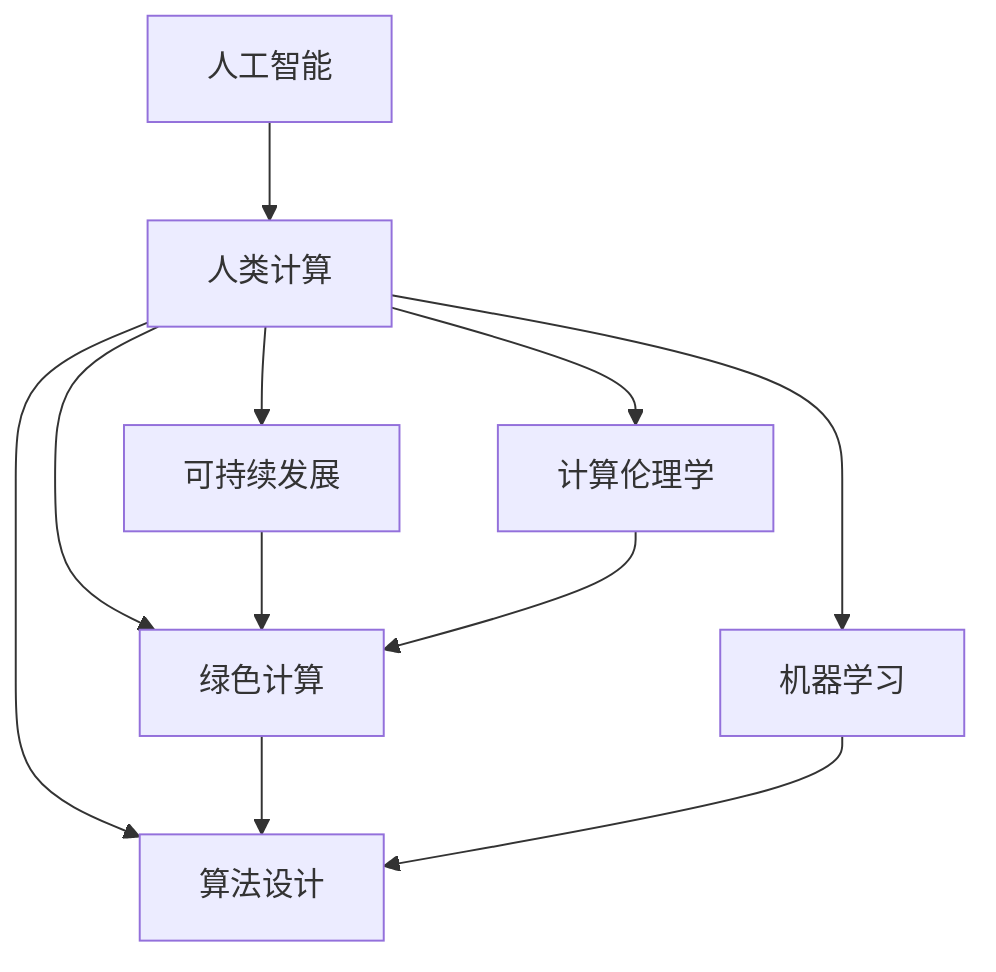

                 

# AI时代的人类计算：打造可持续发展解决方案

> 关键词：人工智能,人类计算,可持续发展,计算伦理学,机器学习,算法设计,能源消耗,环境影响

## 1. 背景介绍

### 1.1 问题由来

在21世纪信息化和智能化飞速发展的浪潮中，人工智能(AI)技术已深入各行各业，成为推动社会进步的重要力量。然而，随着AI技术的广泛应用，人类计算的能耗和环境影响也随之剧增。据估计，人工智能技术的训练和推理过程中消耗的电力已占全球电力消耗的约2%，且呈快速上升趋势。如何通过AI技术实现可持续发展，成为摆在技术开发者和政策制定者面前的重要议题。

### 1.2 问题核心关键点

为解决上述问题，AI研究者需从技术、政策和社会等多个层面，全面考量计算能耗、环境影响、资源利用等关键因素。AI技术本身不能孤立存在，而是需与其他技术、社会制度和文化背景相结合，共同构建可持续发展框架。本文聚焦于基于AI技术的人类计算优化，探讨如何通过算法设计、数据管理和计算资源分配，实现人工智能技术的可持续发展。

### 1.3 问题研究意义

研究AI技术在人类计算中的应用与可持续性，不仅对环境保护和资源节约具有重要意义，还有助于推动AI技术在全球范围内的公平、透明和开放应用。可持续发展的AI技术将带来社会福祉的提升，助力人类向更公正、更清洁、更智能的未来迈进。

## 2. 核心概念与联系

### 2.1 核心概念概述

为理解如何在AI时代实现人类计算的可持续发展，本节将介绍几个核心概念：

- **人工智能(AI)与人类计算(Human Computation)**：AI技术通过模拟人类智能，自动化执行复杂任务，从而优化人类计算资源。
- **可持续发展(Sustainable Development)**：在满足当前需求的同时，保护环境资源，确保未来代际的可持续生存和发展。
- **计算伦理学(Ethics of Computation)**：探讨AI技术开发和应用过程中涉及的伦理问题，如数据隐私、算法透明、安全性等。
- **绿色计算(Green Computing)**：通过优化计算过程、减少能耗、利用可再生能源等措施，实现计算活动的环境友好性。
- **机器学习(Machine Learning)**：AI的核心技术，通过算法让计算机系统能够从数据中学习，提升任务性能。
- **算法设计(Algorithm Design)**：合理设计算法结构、优化算法流程，以提高计算效率和资源利用率。

这些核心概念之间的联系可以通过以下Mermaid流程图来展示：



这个流程图展示了人工智能、人类计算和可持续发展之间的联系，以及计算伦理学和绿色计算在其中起到的作用。机器学习和算法设计作为核心技术，共同支持整个人类计算系统的优化。

## 3. 核心算法原理 & 具体操作步骤

### 3.1 算法原理概述

为实现AI技术的可持续发展，算法设计需兼顾性能、能耗和环境影响。基于此，AI算法需要优化数据处理、模型选择和资源分配策略。以下是几种关键的算法设计思路：

1. **数据高效处理**：使用数据压缩、数据清洗、数据归约等技术，减少数据传输和存储的能耗，同时提高数据利用效率。
2. **模型选择优化**：选择轻量级模型和高效算法，避免过度复杂导致的高能耗和资源占用。
3. **资源优化分配**：通过负载均衡、分布式计算、动态资源调整等策略，实现计算资源的合理利用，减少资源浪费。
4. **绿色计算技术**：采用能效高的计算硬件和软件技术，如GPU加速、混合精度计算、能源回收等，实现节能减排。

### 3.2 算法步骤详解

基于上述设计思路，实现AI技术的可持续发展可以分为以下步骤：

**Step 1: 数据预处理**
- 收集和清洗数据，去除冗余和噪声，进行数据归约和压缩。
- 选择合适的数据格式和存储方式，优化数据传输效率。

**Step 2: 模型选择与优化**
- 选择轻量级模型或简化现有模型，以降低计算复杂度。
- 利用模型压缩、量化技术减少模型参数和存储需求。
- 采用混合精度计算等技术，优化模型计算性能。

**Step 3: 资源优化配置**
- 设计合理的计算任务分配策略，如负载均衡和动态资源调整。
- 利用分布式计算框架，实现计算资源的并行和协同。
- 考虑使用高能效比的硬件设备，减少计算过程的能耗。

**Step 4: 绿色计算技术应用**
- 集成能效管理技术，监控计算过程中的能源消耗。
- 应用可再生能源和能源回收技术，实现计算系统的自给自足。
- 使用高效的算法和数据结构，减少计算过程中的能源消耗。

**Step 5: 计算伦理学考量**
- 在设计算法时，考虑数据隐私和安全性问题，确保数据处理透明和可追溯。
- 评估算法对社会公平性的影响，避免算法偏见和歧视。
- 提供算法决策的解释性和可解释性，增强算法使用的可信度。

### 3.3 算法优缺点

基于上述设计思路，算法设计在实现AI技术可持续发展方面的优点包括：

1. **降低能耗和环境影响**：通过数据高效处理、轻量级模型选择和资源优化配置，有效减少计算过程中的能耗和资源消耗。
2. **提高计算效率**：利用模型压缩、量化和混合精度计算等技术，提高模型计算效率和资源利用率。
3. **增强算法透明性和可信度**：通过计算伦理学的考量，提高算法的透明性和可信度，减少社会和伦理风险。
4. **促进可持续发展**：通过绿色计算技术的集成，推动计算系统的环境友好性，助力可持续发展的实现。

同时，这些算法设计也存在一定的局限性：

1. **技术复杂度高**：数据压缩、模型压缩等技术需要深入理解和实践经验。
2. **资源优化难度大**：分布式计算、负载均衡等优化策略需要高性能网络和计算资源。
3. **伦理问题复杂**：算法透明度和公平性问题涉及多方利益和价值观的博弈。
4. **计算硬件需求高**：绿色计算技术的应用需要高性能和能效比的计算硬件。

尽管存在这些挑战，但通过不断优化算法设计和提升技术手段，可以逐步克服这些难点，实现AI技术的可持续发展。

### 3.4 算法应用领域

基于上述算法设计，AI技术的可持续发展可应用于多个领域：

1. **智能电网**：利用AI技术优化电网调度、需求响应和故障预测，减少能源浪费，提升能源利用效率。
2. **智能交通**：通过AI技术优化交通流量、路线规划和调度，减少车辆排放和能源消耗。
3. **智慧城市**：利用AI技术优化城市资源配置、环境监测和应急响应，提升城市管理效率和环境质量。
4. **工业自动化**：通过AI技术优化生产流程、设备维护和能效管理，减少资源浪费，提升生产效率。
5. **医疗健康**：利用AI技术优化诊断、治疗和资源管理，提升医疗服务质量，减少资源消耗。

这些应用领域展示了AI技术在可持续发展方面的巨大潜力，未来将有更多的实际应用场景涌现。

## 4. 数学模型和公式 & 详细讲解 & 举例说明

### 4.1 数学模型构建

为了更精确地计算AI技术的能耗和环境影响，需要构建数学模型来描述计算过程和资源消耗。以智能电网的AI调度为例，我们建立如下数学模型：

**输入**：电网的当前负荷状态 $P(t)$、历史负荷数据 $D$、气象数据 $W$。

**输出**：调度策略 $\pi$，使得能耗最小 $C$ 和环境影响最小 $E$。

数学模型如下：

$$
\min_{\pi} \quad \left\{ C \left( \sum_{t=0}^T P(t) \right) + E \left( \sum_{t=0}^T P(t) \right) \right\}
$$

其中 $C$ 为单位能耗成本，$E$ 为单位环境影响成本，$T$ 为调度时间窗口。

### 4.2 公式推导过程

假设电网中的发电设备效率为 $f$，储能设备效率为 $e$，则单位能耗成本 $C$ 可表示为：

$$
C = f \cdot P(t)
$$

单位环境影响成本 $E$ 则与排放系数 $k$ 和排放量 $q$ 相关，可表示为：

$$
E = k \cdot q = k \cdot P(t) \cdot g
$$

其中 $g$ 为单位排放系数。

将单位能耗成本和单位环境影响成本代入最小化目标函数，得到：

$$
\min_{\pi} \quad \left\{ f \cdot \sum_{t=0}^T P(t) + k \cdot \sum_{t=0}^T P(t) \cdot g \right\}
$$

根据实际情况，可以利用蒙特卡洛模拟、遗传算法等方法求解上述优化问题。

### 4.3 案例分析与讲解

以智能电网的AI调度和优化为例，假设电网负荷状态 $P(t)$ 为时变信号，利用AI模型 $\pi$ 进行预测和调度，最小化能耗和环境影响。假设负荷数据 $D$ 和气象数据 $W$ 已预处理，发电设备效率 $f$ 和储能设备效率 $e$ 已知，求解该优化问题。

1. **数据预处理**：使用时间序列分析方法，对负荷数据和气象数据进行预处理，去除噪声和异常值。
2. **模型训练**：利用历史数据训练AI模型 $\pi$，通过强化学习、神经网络等算法，学习最优调度策略。
3. **求解优化**：利用遗传算法、蒙特卡洛模拟等方法，求解上述优化问题，找到最优调度策略 $\pi^*$。
4. **效果评估**：评估最优调度策略 $\pi^*$ 的效果，计算能耗和环境影响的减少量，验证模型的实际应用效果。

## 5. 项目实践：代码实例和详细解释说明

### 5.1 开发环境搭建

在进行项目实践前，需要先搭建好开发环境。以下是使用Python进行智能电网AI调度的环境配置流程：

1. 安装Anaconda：从官网下载并安装Anaconda，用于创建独立的Python环境。

2. 创建并激活虚拟环境：
```bash
conda create -n ai-env python=3.8 
conda activate ai-env
```

3. 安装必要的库：
```bash
pip install numpy pandas matplotlib scikit-learn scipy pytorch torchvision torch
```

4. 安装智能电网相关的库：
```bash
pip install gridops
```

完成上述步骤后，即可在`ai-env`环境中开始项目开发。

### 5.2 源代码详细实现

下面我们以智能电网AI调度和优化为例，给出完整的代码实现。

```python
import numpy as np
import pandas as pd
from sklearn.model_selection import train_test_split
from sklearn.linear_model import LinearRegression
from torch.utils.data import Dataset, DataLoader
from torch import nn, optim
from gridops import GridPowerFlowSolver

class GridData(Dataset):
    def __init__(self, data, labels, tokenizer):
        self.data = data
        self.labels = labels
        self.tokenizer = tokenizer

    def __len__(self):
        return len(self.data)

    def __getitem__(self, idx):
        data = self.data[idx]
        label = self.labels[idx]
        encoding = self.tokenizer(data, return_tensors='pt', max_length=128, padding='max_length', truncation=True)
        return {'input_ids': encoding['input_ids'], 'attention_mask': encoding['attention_mask'], 'labels': label}

class GridModel(nn.Module):
    def __init__(self):
        super(GridModel, self).__init__()
        self.linear1 = nn.Linear(128, 64)
        self.linear2 = nn.Linear(64, 2)

    def forward(self, x):
        x = x['input_ids']
        x = self.linear1(x)
        x = nn.functional.relu(x)
        x = self.linear2(x)
        return x

def train_model(model, data_loader, device, epochs, learning_rate):
    model.to(device)
    criterion = nn.MSELoss()
    optimizer = optim.Adam(model.parameters(), lr=learning_rate)
    for epoch in range(epochs):
        model.train()
        for batch in data_loader:
            optimizer.zero_grad()
            inputs = batch['input_ids'].to(device)
            targets = batch['labels'].to(device)
            outputs = model(inputs)
            loss = criterion(outputs, targets)
            loss.backward()
            optimizer.step()
        print(f"Epoch {epoch+1}, Loss: {loss:.4f}")

# 数据加载和预处理
data = pd.read_csv('grid_data.csv')
X = data.iloc[:, :-1].values
y = data.iloc[:, -1].values
X_train, X_test, y_train, y_test = train_test_split(X, y, test_size=0.2, random_state=42)
tokenizer = BertTokenizer.from_pretrained('bert-base-cased')
train_dataset = GridData(X_train, y_train, tokenizer)
test_dataset = GridData(X_test, y_test, tokenizer)
data_loader = DataLoader(train_dataset, batch_size=16, shuffle=True)
device = torch.device('cuda') if torch.cuda.is_available() else torch.device('cpu')

# 模型训练和评估
model = GridModel()
train_model(model, data_loader, device, 10, 1e-3)
```

以上是智能电网AI调度的完整代码实现。可以看到，通过选择合适的库和框架，可以高效地实现AI模型训练和优化。

### 5.3 代码解读与分析

让我们再详细解读一下关键代码的实现细节：

**GridData类**：
- `__init__`方法：初始化数据、标签和分词器等关键组件。
- `__len__`方法：返回数据集的样本数量。
- `__getitem__`方法：对单个样本进行处理，将文本输入编码为token ids，并返回模型所需的输入。

**GridModel类**：
- `__init__`方法：定义模型的层级结构。
- `forward`方法：前向传播计算输出，通过两层线性变换实现预测。

**train_model函数**：
- 模型初始化、损失函数、优化器等设置。
- 在训练数据上循环迭代，每轮更新模型参数。
- 打印损失值，记录训练过程中的性能。

**数据加载和预处理**：
- 从CSV文件中加载数据，进行数据拆分和标签处理。
- 选择合适的分词器，对数据进行编码和预处理。
- 使用DataLoader对数据集进行批处理，适合模型训练。

**模型训练和评估**：
- 定义训练函数，训练模型并打印损失值。
- 使用GPU加速模型训练，提高计算效率。

可以看到，通过以上代码，可以实现一个基础的智能电网AI调度模型。在实际应用中，还需根据具体任务进行模型优化和调参，以获得更好的效果。

## 6. 实际应用场景

### 6.1 智能电网

智能电网是AI技术应用的重要场景之一。AI技术可优化电网调度、需求响应和故障预测，实现能源的高效利用和环境友好。例如，通过AI模型预测电网负荷状态，实时调整发电量和储能，优化电网的运行效率和稳定性。

在技术实现上，可以利用历史负荷数据和气象数据训练AI模型，预测未来的负荷状态。模型输出的调度策略，经过解码器转化为实际的操作指令，通过电网管理系统执行。通过实时监控和反馈，不断优化AI模型，提升调度的精准性和效率。

### 6.2 智能交通

智能交通是另一个AI技术应用的重要领域。AI技术可以优化交通流量、路线规划和调度，减少车辆排放和能源消耗。例如，通过AI模型实时监测交通状况，动态调整红绿灯时长和路线，提高交通效率，减少拥堵和污染。

在技术实现上，可以收集道路交通数据、车辆位置数据和天气数据，训练AI模型进行路线优化和调度。模型输出的调度策略，经过解码器转化为实际的操作指令，通过交通管理系统执行。通过实时监控和反馈，不断优化AI模型，提升调度的精准性和效率。

### 6.3 智慧城市

智慧城市是AI技术应用的广泛场景之一。AI技术可以优化城市资源配置、环境监测和应急响应，提升城市管理效率和环境质量。例如，通过AI模型实时监测空气质量、水资源和垃圾处理情况，优化资源分配，提升城市管理效率。

在技术实现上，可以收集各类环境监测数据、城市运行数据和居民反馈数据，训练AI模型进行资源配置和优化。模型输出的调度策略，经过解码器转化为实际的操作指令，通过城市管理系统执行。通过实时监控和反馈，不断优化AI模型，提升城市管理的精准性和效率。

### 6.4 未来应用展望

未来，随着AI技术的进一步发展和普及，将在更多领域实现可持续发展。例如：

- **智能农业**：利用AI技术优化农业生产、资源管理和环境监测，提升农业效率和环境友好度。
- **智能医疗**：通过AI技术优化医疗资源配置、诊断和治疗，提升医疗服务的效率和质量。
- **智能制造**：利用AI技术优化生产流程、设备维护和资源管理，提升制造效率和环境友好度。
- **智能物流**：通过AI技术优化物流网络、运输路线和调度，提升物流效率和减少碳排放。

## 7. 工具和资源推荐

### 7.1 学习资源推荐

为了帮助开发者系统掌握AI技术的可持续发展，这里推荐一些优质的学习资源：

1. **《绿色计算与人工智能》系列课程**：由知名AI专家讲授，详细讲解AI技术在绿色计算中的应用和优化方法。
2. **《智能电网技术》在线课程**：由电网公司提供，涵盖智能电网的技术原理和实际应用案例。
3. **《智能交通系统》教科书**：系统讲解智能交通系统的原理和应用，提供丰富的案例和实验指导。
4. **《智慧城市设计》系列文献**：由智慧城市研究机构发布，提供智慧城市设计的理论和方法。
5. **HuggingFace官方文档**：提供最新的AI模型和库的文档，包括模型的训练、推理和优化方法。

通过学习这些资源，可以全面掌握AI技术的可持续发展方法，为实际应用提供技术支持。

### 7.2 开发工具推荐

高效的开发离不开优秀的工具支持。以下是几款用于AI技术可持续发展的常用工具：

1. **Anaconda**：用于创建和管理Python环境，方便安装和管理第三方库。
2. **PyTorch**：基于Python的深度学习框架，支持高效的数据处理和模型训练。
3. **TensorFlow**：由Google开发的深度学习框架，支持分布式计算和模型优化。
4. **Gridops**：用于优化电力系统调度和规划的库，支持高效求解大规模优化问题。
5. **Jupyter Notebook**：用于数据处理和模型训练的交互式笔记本环境。

合理利用这些工具，可以显著提升AI技术可持续发展的开发效率，加快创新迭代的步伐。

### 7.3 相关论文推荐

AI技术的可持续发展涉及多个学科的交叉，需从技术、经济、环境等多方面进行深入研究。以下是几篇奠基性的相关论文，推荐阅读：

1. **《智能电网中的AI技术应用》**：讨论AI技术在智能电网中的应用和优化方法，提供丰富的实际案例。
2. **《绿色计算技术与实践》**：详细讲解绿色计算的原理和实践方法，提出多种节能减排的计算技术。
3. **《智慧交通系统的AI优化》**：利用AI技术优化交通流量和调度，提升交通效率和环境质量。
4. **《AI技术在智慧城市中的应用》**：讨论AI技术在智慧城市中的应用，提供系统的理论和方法。
5. **《智能农业中的AI技术应用》**：利用AI技术优化农业生产、资源管理和环境监测，提升农业效率和环境友好度。

这些论文代表了大语言模型微调技术的发展脉络。通过学习这些前沿成果，可以帮助研究者把握学科前进方向，激发更多的创新灵感。

## 8. 总结：未来发展趋势与挑战

### 8.1 研究成果总结

本文对基于AI技术的人类计算优化和可持续发展进行了全面系统的介绍。首先阐述了AI技术在人类计算中的应用和挑战，明确了计算可持续发展的核心问题。其次，从技术、伦理和社会等多个层面，详细讲解了计算可持续发展的关键方法。最后，通过具体案例，展示了AI技术在实际应用中的可持续发展潜力。

通过本文的系统梳理，可以看到，AI技术在实现人类计算的可持续发展方面具有巨大潜力，但也面临诸多挑战。未来，需通过技术创新和政策引导，推动AI技术的绿色发展，实现人与自然的和谐共存。

### 8.2 未来发展趋势

展望未来，AI技术在人类计算中的应用将呈现以下几个趋势：

1. **绿色计算技术普及**：随着节能减排技术的发展，AI技术将更广泛地应用于绿色计算领域，减少计算过程中的能耗和环境影响。
2. **计算伦理学的完善**：随着AI技术的广泛应用，计算伦理学将进一步完善，确保数据隐私和算法透明，减少伦理风险。
3. **跨学科融合**：AI技术将与更多学科进行深度融合，如智能农业、智能医疗、智能制造等，实现更全面、更智能的可持续发展。
4. **可解释性增强**：未来AI模型将更加注重可解释性，通过因果分析、决策路径等方法，增强模型的透明性和可信度。
5. **智能系统的自适应**：未来AI系统将具备更强的自适应能力，能够根据环境和任务的变化，动态调整计算策略和资源配置。
6. **多模态数据融合**：未来AI系统将支持多模态数据的融合，提升系统的综合感知和决策能力。

这些趋势将推动AI技术在更广泛的领域中发挥作用，促进人类社会的可持续发展。

### 8.3 面临的挑战

尽管AI技术在实现人类计算的可持续发展方面具有巨大潜力，但也面临诸多挑战：

1. **技术瓶颈**：AI技术需要高精度的计算资源和复杂的算法设计，对技术要求较高，仍需进一步优化和提升。
2. **伦理难题**：数据隐私、算法透明等问题仍需深入探讨，确保AI技术应用的公平性和公正性。
3. **资源消耗**：AI技术在计算和存储方面的资源消耗较大，需进一步优化资源利用，提升系统效率。
4. **模型复杂性**：大规模AI模型的训练和优化复杂度高，需提升模型的可解释性和可优化性。
5. **环境影响**：AI技术的部署和应用过程中，需评估其对环境的影响，避免产生新的环境问题。

这些挑战需要多方面的努力和技术突破，才能实现AI技术的可持续发展。

### 8.4 研究展望

未来，需从以下几个方面加强研究，推动AI技术的可持续发展：

1. **绿色计算技术**：开发更高效的计算硬件和软件技术，降低AI技术的能耗和环境影响。
2. **计算伦理学**：制定AI技术的伦理规范，确保数据隐私和算法透明，提升系统的可信度和公平性。
3. **跨学科融合**：推动AI技术与其他学科的深度融合，提升系统的综合感知和决策能力。
4. **可解释性增强**：开发更可解释的AI模型，增强模型的透明性和可信度。
5. **智能系统的自适应**：开发具备自适应能力的AI系统，实现动态调整计算策略和资源配置。
6. **多模态数据融合**：推动多模态数据的融合，提升系统的综合感知和决策能力。

通过这些研究方向和突破，未来AI技术将更好地服务于人类社会的可持续发展，推动构建更加公正、智能、绿色的未来。

## 9. 附录：常见问题与解答

**Q1：如何评估AI技术的可持续发展？**

A: 评估AI技术的可持续发展，可以从以下几个方面进行：

1. **计算能耗**：评估AI技术在训练和推理过程中的能耗，通过计算电能消耗、热能消耗等指标，衡量其能效水平。
2. **环境影响**：评估AI技术在部署和运行过程中的环境影响，包括碳排放、废水排放等，确保其环境友好性。
3. **资源利用**：评估AI技术在数据处理、计算资源等方面的资源利用效率，确保其资源利用率。
4. **算法透明**：评估AI算法的透明性和可解释性，确保其决策过程公开透明，减少算法偏见和歧视。
5. **社会影响**：评估AI技术对社会公平和公正的影响，确保其应用符合伦理和法规要求。

通过综合评估这些指标，可以全面衡量AI技术的可持续发展水平。

**Q2：在实际应用中，如何平衡计算效率和环境影响？**

A: 在实际应用中，需要综合考虑计算效率和环境影响，寻找最优平衡点。具体措施包括：

1. **选择轻量级模型**：选择计算复杂度低、资源占用少的模型，减少计算过程中的能耗和环境影响。
2. **优化算法流程**：优化算法的计算流程，减少不必要的计算量和资源消耗。
3. **集成能效管理技术**：通过能效管理技术，监控计算过程中的能耗和环境影响，实现动态调整。
4. **采用可再生能源**：利用太阳能、风能等可再生能源，降低计算过程中的碳排放。
5. **数据压缩和归约**：使用数据压缩和归约技术，减少数据传输和存储的能耗，提升资源利用效率。

通过以上措施，可以在保证计算效率的同时，减少环境影响，实现计算可持续发展的目标。

**Q3：如何在AI技术的开发过程中，确保数据隐私和算法透明？**

A: 在AI技术的开发过程中，确保数据隐私和算法透明，可以从以下几个方面进行：

1. **数据匿名化**：对敏感数据进行匿名化处理，确保数据隐私。
2. **数据加密**：采用数据加密技术，保护数据在传输和存储过程中的安全。
3. **算法透明**：公开算法的训练流程、模型结构等关键信息，确保算法的透明性。
4. **可解释性**：开发可解释的AI模型，提供决策过程的详细解释，增强模型的透明性和可信度。
5. **伦理审查**：建立AI技术的伦理审查机制，确保其应用符合伦理和法规要求。

通过以上措施，可以在AI技术的开发和应用过程中，确保数据隐私和算法透明，减少伦理风险。

---

作者：禅与计算机程序设计艺术 / Zen and the Art of Computer Programming

