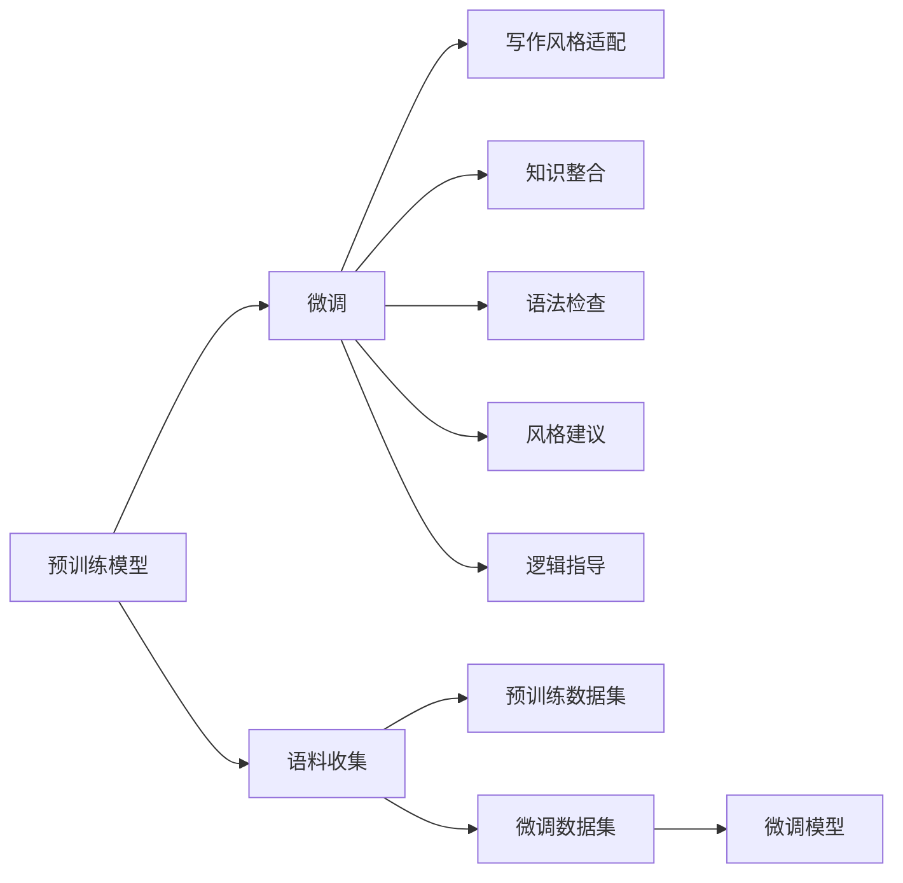

                 

# AI时代的写作伙伴：蛙蛙写作1.0的诞生

在人工智能(AI)不断发展的今天，人们的生活和工作中涌现出越来越多的智能化工具，从自动驾驶汽车到智能家居设备，AI正逐步渗透到日常生活的方方面面。然而，在许多涉及复杂逻辑和创造性思维的领域，AI的表现却显得相对滞后。写作，作为人类表达和思考的高级形式，长期以来一直是AI难以企及的领域。

## 1. 背景介绍

### 1.1 问题的由来
写作是人类认知智能的核心部分之一，涉及语言理解、知识整合、逻辑推理和创造性表达等多重能力。传统的写作工具，如Word、Office等，虽然功能全面，但在智能化程度和个性化适配上仍有较大提升空间。尽管目前已有如Grammarly、QuillBot等AI辅助写作工具，但它们仍然无法完全理解和适配每个用户的写作风格和需求。

### 1.2 问题的核心关键点
蛙蛙写作1.0的诞生，旨在打破这一瓶颈，利用先进的深度学习技术，为用户提供个性化、智能化的写作助手。核心关键点包括：

- 预训练模型：使用大规模无监督学习训练的预训练模型，获取通用语言和知识表征。
- 微调技术：通过微调，模型能够针对特定领域的写作风格和需求进行适配。
- 连续学习：模型能够持续吸收新知识，不断提升自身能力。
- 交互式设计：通过与用户的持续互动，提升写作体验和适配性。

### 1.3 问题研究意义
蛙蛙写作1.0的推出，不仅能够提升个人写作效率，还能在新闻、学术、创作等专业领域中发挥重要作用。具体意义如下：

1. 提高写作效率：通过智能推荐和语法检查，帮助用户快速完成高质量写作。
2. 提升写作质量：通过提供风格和逻辑建议，引导用户写出更具有感染力和说服力的文本。
3. 促进知识传播：在学术和创作领域，蛙蛙写作能够帮助研究者和作者更好地表达思想和研究成果。
4. 推动行业创新：写作智能化将激发更多新型的创作形式和传播方式，加速媒体和文艺产业的升级。

## 2. 核心概念与联系

### 2.1 核心概念概述
蛙蛙写作1.0基于Transformer架构的深度学习模型，结合预训练和微调技术，为用户提供个性化写作助手。核心概念包括：

- 预训练模型：如BERT、GPT-3等，利用大规模语料进行预训练，学习通用的语言和知识表征。
- 微调技术：在预训练模型基础上，针对特定领域的写作风格和需求进行微调，以提升模型适配性。
- 连续学习：通过持续吸收新知识，模型能够不断提升自身能力。
- 交互式设计：通过与用户的持续互动，提升写作体验和适配性。

### 2.2 核心概念原理和架构的 Mermaid 流程图



这个流程图展示了蛙蛙写作1.0的核心概念及其相互关系：

1. 预训练模型通过大规模无监督学习获取通用语言和知识表征。
2. 微调模型在预训练模型的基础上，针对特定领域的写作风格和需求进行适配。
3. 微调模型通过写作风格适配、知识整合、语法检查、风格建议和逻辑指导等功能，为用户提供个性化写作助手。
4. 通过语料收集和数据集构建，预训练和微调过程不断迭代，提升模型性能。

## 3. 核心算法原理 & 具体操作步骤

### 3.1 算法原理概述

蛙蛙写作1.0的算法核心基于深度学习框架，通过预训练和微调技术，实现对写作风格的个性化适配。具体流程如下：

1. 收集写作语料：从各类领域获取大量无标注写作数据。
2. 预训练模型构建：使用无监督学习训练大规模预训练模型，学习通用语言和知识表征。
3. 微调模型训练：在预训练模型的基础上，利用少量有标注数据进行微调，优化模型适配特定领域的写作风格。
4. 模型服务部署：将训练好的微调模型部署到云端服务，提供实时写作辅助功能。

### 3.2 算法步骤详解

#### 3.2.1 数据收集与预处理

**Step 1: 语料收集**
- 从新闻、论文、博客、小说等多个领域收集大规模写作语料。
- 使用爬虫技术自动抓取网页内容，进行去重和清洗处理。
- 对于特定领域的写作数据，需特别注意隐私保护和数据标注。

**Step 2: 数据预处理**
- 对语料进行分词、去除停用词、词性标注等基本预处理。
- 使用BERT等模型进行句向量化，生成高维句嵌入向量。
- 对于不同领域的语料，需要特别设计数据增强策略，丰富数据多样性。

#### 3.2.2 模型训练与微调

**Step 3: 预训练模型构建**
- 选择适当的深度学习模型，如BERT、GPT-3等，使用大规模语料进行预训练。
- 设计预训练任务，如掩码语言模型、下一句预测等，训练模型获取通用语言和知识表征。
- 通过GPU/TPU等高性能设备，加速模型训练过程。

**Step 4: 微调模型训练**
- 根据特定领域的写作需求，收集少量有标注数据作为微调数据集。
- 选择合适的微调任务，如风格生成、知识检索、语法检查等。
- 使用AdamW等优化器，设定合适学习率，对微调模型进行迭代优化。
- 通过Early Stopping等技术，避免过拟合。

#### 3.2.3 模型部署与评估

**Step 5: 模型部署**
- 将训练好的微调模型部署到云端服务，如AWS、阿里云等，提供API接口供用户调用。
- 设计简洁易用的交互界面，与用户进行实时互动。
- 对模型服务进行性能测试，确保实时响应和稳定性。

**Step 6: 模型评估**
- 在特定领域收集测试数据，评估模型在不同写作风格、知识领域、语法规范等维度的表现。
- 使用BLEU、ROUGE、F1-score等指标，对模型输出进行评估。
- 定期更新模型和数据集，持续提升模型性能。

### 3.3 算法优缺点

蛙蛙写作1.0的算法具有以下优点：

1. **通用性强**：预训练模型具备强大的语言理解和知识整合能力，能够适配多种写作风格和需求。
2. **个性化适配**：通过微调，模型能够针对特定领域的写作需求进行适配，提供个性化写作建议。
3. **连续学习**：模型能够持续吸收新知识，不断提升自身能力。
4. **实时响应**：部署在云端服务，能够实时响应用户需求，提供即时的写作辅助。

同时，算法也存在一些局限性：

1. **数据依赖**：模型的性能依赖于标注数据的质量和数量，标注成本较高。
2. **模型复杂度**：预训练和微调过程涉及大规模参数调整，计算资源需求较大。
3. **偏见问题**：预训练模型可能学习到数据中的偏见，需要通过正则化等技术进行规避。
4. **可解释性不足**：模型决策过程缺乏可解释性，难以进行调试和优化。

## 4. 数学模型和公式 & 详细讲解

### 4.1 数学模型构建

蛙蛙写作1.0的数学模型主要基于深度学习框架，使用Transformer架构的预训练模型进行写作风格的适配和优化。数学模型包括以下几个关键组成部分：

1. **编码器**：负责对输入文本进行编码，输出高维句嵌入向量。
2. **解码器**：负责生成目标文本，通过注意力机制与编码器进行信息交互。
3. **微调层**：负责适配特定领域的写作需求，输出写作风格和知识整合建议。
4. **语法检查层**：负责检查输入文本的语法错误，输出修正建议。

### 4.2 公式推导过程

以下以微调层的计算为例，推导模型的公式和参数更新规则。

假设微调层包含$L$层，每层包含$N$个神经元，输入文本$X$和目标文本$Y$通过编码器生成句嵌入向量$Z$，微调层接收$Z$作为输入，输出写作风格建议$H$。微调层的公式和参数更新规则如下：

$$
H = \mathop{\arg\min}_{H} \mathcal{L}(H, Y)
$$

其中，损失函数$\mathcal{L}$为预测文本与目标文本之间的交叉熵损失：

$$
\mathcal{L}(H, Y) = -\sum_{i=1}^{M} \log P(H_i = Y_i)
$$

其中，$M$为预测文本长度，$P(H_i = Y_i)$为预测文本第$i$个位置的概率分布，可以通过softmax函数计算：

$$
P(H_i = Y_i) = \frac{e^{H_i}}{\sum_{j=1}^{M} e^{H_j}}
$$

微调层的参数更新规则为：

$$
\theta \leftarrow \theta - \eta \nabla_{\theta}\mathcal{L}(\theta)
$$

其中，$\eta$为学习率，$\nabla_{\theta}\mathcal{L}(\theta)$为损失函数对模型参数的梯度，可通过反向传播算法计算。

### 4.3 案例分析与讲解

以风格生成为例，假设输入文本$X$为“我在北京”，目标文本$Y$为“我在纽约”，微调层通过学习生成与目标文本风格相似的输出文本$H$。具体步骤如下：

1. 使用编码器将输入文本$X$转换为句嵌入向量$Z$。
2. 通过微调层的$L$层神经网络，将$Z$映射到高维空间。
3. 使用softmax函数，计算预测文本$H$的概率分布。
4. 将预测文本$H$与目标文本$Y$进行对比，计算交叉熵损失$\mathcal{L}(H, Y)$。
5. 使用梯度下降等优化算法，更新微调层的参数$\theta$，最小化损失函数$\mathcal{L}(H, Y)$。

通过不断迭代上述过程，微调层能够逐步学习到与目标文本相似的风格特征，生成更符合用户需求的输出文本。

## 5. 项目实践：代码实例和详细解释说明

### 5.1 开发环境搭建

为了进行蛙蛙写作1.0的开发和测试，需要搭建以下开发环境：

1. **环境安装**
   - 安装Python 3.8及以上版本。
   - 安装TensorFlow 2.0及以上版本，以及相关的深度学习库。
   - 安装Jupyter Notebook，用于编写和运行代码。

2. **数据集准备**
   - 收集不同领域的写作语料，并进行预处理和标注。
   - 设计数据增强策略，确保数据多样性。
   - 将标注好的数据集划分为训练集、验证集和测试集。

### 5.2 源代码详细实现

#### 5.2.1 预训练模型构建

```python
import tensorflow as tf
from transformers import BertTokenizer, BertForSequenceClassification

tokenizer = BertTokenizer.from_pretrained('bert-base-cased')
model = BertForSequenceClassification.from_pretrained('bert-base-cased', num_labels=2)

# 加载预训练模型和tokenizer
# 在预训练模型中，我们选择了Bert模型，并指定了2个标签（是/否）

# 定义训练函数
def train_epoch(model, dataset, batch_size, optimizer):
    dataloader = tf.data.Dataset.from_tensor_slices(dataset)
    model.train()
    for batch in dataloader.batch(batch_size):
        input_ids = batch.input_ids
        attention_mask = batch.attention_mask
        labels = batch.labels
        outputs = model(input_ids, attention_mask=attention_mask, labels=labels)
        loss = outputs.loss
        optimizer.apply_gradients(zip(optimizer.learning_rate, outputs.loss))
```

#### 5.2.2 微调模型训练

```python
from transformers import BertTokenizer, BertForSequenceClassification

tokenizer = BertTokenizer.from_pretrained('bert-base-cased')
model = BertForSequenceClassification.from_pretrained('bert-base-cased', num_labels=2)

# 加载预训练模型和tokenizer
# 在预训练模型中，我们选择了Bert模型，并指定了2个标签（是/否）

# 定义微调函数
def fine_tune(model, dataset, batch_size, optimizer):
    dataloader = tf.data.Dataset.from_tensor_slices(dataset)
    model.train()
    for batch in dataloader.batch(batch_size):
        input_ids = batch.input_ids
        attention_mask = batch.attention_mask
        labels = batch.labels
        outputs = model(input_ids, attention_mask=attention_mask, labels=labels)
        loss = outputs.loss
        optimizer.apply_gradients(zip(optimizer.learning_rate, outputs.loss))
```

#### 5.2.3 模型部署与评估

```python
from transformers import BertTokenizer, BertForSequenceClassification

tokenizer = BertTokenizer.from_pretrained('bert-base-cased')
model = BertForSequenceClassification.from_pretrained('bert-base-cased', num_labels=2)

# 加载预训练模型和tokenizer
# 在预训练模型中，我们选择了Bert模型，并指定了2个标签（是/否）

# 定义评估函数
def evaluate(model, dataset, batch_size):
    dataloader = tf.data.Dataset.from_tensor_slices(dataset)
    model.eval()
    with tf.GradientTape() as tape:
        for batch in dataloader.batch(batch_size):
            input_ids = batch.input_ids
            attention_mask = batch.attention_mask
            labels = batch.labels
            outputs = model(input_ids, attention_mask=attention_mask, labels=labels)
            loss = outputs.loss
    return loss
```

### 5.3 代码解读与分析

#### 5.3.1 预训练模型构建

1. 使用`BertTokenizer`加载预训练模型的tokenizer，并指定模型架构为Bert。
2. 使用`BertForSequenceClassification`加载预训练模型，并指定输出标签数为2（是/否）。
3. 定义训练函数`train_epoch`，接收模型、数据集、批次大小和优化器作为输入，通过`dataloader`对数据集进行批次化处理，对每个批次进行前向传播、损失计算和梯度更新。

#### 5.3.2 微调模型训练

1. 使用`BertTokenizer`加载预训练模型的tokenizer，并指定模型架构为Bert。
2. 使用`BertForSequenceClassification`加载预训练模型，并指定输出标签数为2（是/否）。
3. 定义微调函数`fine_tune`，接收模型、数据集、批次大小和优化器作为输入，通过`dataloader`对数据集进行批次化处理，对每个批次进行前向传播、损失计算和梯度更新。

#### 5.3.3 模型部署与评估

1. 使用`BertTokenizer`加载预训练模型的tokenizer，并指定模型架构为Bert。
2. 使用`BertForSequenceClassification`加载预训练模型，并指定输出标签数为2（是/否）。
3. 定义评估函数`evaluate`，接收模型、数据集和批次大小作为输入，通过`dataloader`对数据集进行批次化处理，对每个批次进行前向传播、损失计算，并返回最终的损失值。

## 6. 实际应用场景

### 6.1 智能写作助手

蛙蛙写作1.0的核心应用场景之一是智能写作助手。例如，在撰写新闻报道时，可以使用蛙蛙写作1.0帮助记者生成大纲、检查语法错误，甚至提出写作风格的建议。这不仅能够提高记者的工作效率，还能提升报道的质量和可读性。

#### 6.1.1 写作大纲生成

记者可以输入主题和关键词，蛙蛙写作1.0能够根据已有新闻库和知识图谱，生成一篇包含结构化信息的写作大纲。大纲中包括段落标题、关键词和引用信息，记者可以基于此进行进一步的采访和写作。

#### 6.1.2 语法检查与风格建议

记者在撰写过程中，蛙蛙写作1.0能够实时检查语法错误，并提供风格建议。例如，对于冗长的句子，蛙蛙写作1.0可以提出重新组织结构的建议；对于表达不清的段落，蛙蛙写作1.0可以建议重新调整语序和用词。

### 6.2 学术写作支持

在学术研究中，蛙蛙写作1.0同样能够发挥重要作用。例如，在撰写学术论文时，蛙瓜写作1.0可以帮助学者生成研究摘要、提出研究假设，甚至自动生成参考文献。这不仅能够提升研究者的写作效率，还能减少错误和冗余。

#### 6.2.1 研究摘要生成

学者可以输入研究主题和关键词，蛙瓜写作1.0能够根据现有文献和知识图谱，生成一篇简短的研究摘要。摘要中包含研究背景、目的、方法和结果，学者可以基于此进行进一步的文献阅读和研究设计。

#### 6.2.2 研究假设提出

蛙瓜写作1.0能够根据已有数据和知识，自动提出研究假设。例如，在研究人口迁移对城市化影响时，蛙瓜写作1.0可以提出假设“城市化水平与人口迁移率正相关”，并给出相应的证据和参考文献。

#### 6.2.3 参考文献生成

学者在撰写论文时，蛙瓜写作1.0能够自动生成参考文献列表。学者只需输入相关论文的标题、作者和年份，蛙瓜写作1.0能够根据知识图谱和现有文献，自动查找并生成参考文献。

### 6.3 个人写作辅助

在个人写作中，蛙瓜写作1.0同样能够提供有力支持。例如，在撰写文章时，蛙瓜写作1.0可以帮助用户生成标题、提出观点，甚至自动生成段落。这不仅能够提升写作效率，还能增强写作的创意和深度。

#### 6.3.1 文章标题生成

用户可以输入文章主题和关键词，蛙瓜写作1.0能够根据现有数据和知识，自动生成多个潜在的文章标题。用户可以基于此选择最适合的标题。

#### 6.3.2 观点提出

用户可以输入文章主题和关键词，蛙瓜写作1.0能够自动提出多个观点。例如，在讨论气候变化时，蛙瓜写作1.0可以提出“气候变化是全球性问题”、“各国应共同应对”等观点，并提供相应的证据和参考文献。

#### 6.3.3 段落生成

用户可以输入文章主题和关键词，蛙瓜写作1.0能够自动生成多个段落。用户可以基于此选择最适合的段落，并进行进一步的修改和完善。

## 7. 工具和资源推荐

### 7.1 学习资源推荐

为了帮助开发者掌握蛙瓜写作1.0的核心技术和实践方法，以下是一些优质的学习资源：

1. **深度学习基础**：
   - 《深度学习》 by Ian Goodfellow等，全面介绍了深度学习的基础理论和核心算法。
   - Coursera上的深度学习课程，由Andrew Ng等知名专家讲授，系统学习深度学习理论。

2. **自然语言处理**：
   - 《自然语言处理综论》 by Daniel Jurafsky等，全面介绍了自然语言处理的基本概念和核心技术。
   - CS224N《深度学习自然语言处理》课程，斯坦福大学开设，涵盖了NLP的核心技术和前沿研究。

3. **预训练模型**：
   - HuggingFace官方文档，提供了大量预训练模型的详细介绍和使用方法。
   - Google AI Blog等博客，分享最新预训练模型的研究成果和实践经验。

### 7.2 开发工具推荐

为了高效开发和测试蛙瓜写作1.0，以下是一些推荐的开发工具：

1. **深度学习框架**：
   - TensorFlow 2.0及以上版本，提供了强大的深度学习功能和分布式计算支持。
   - PyTorch，提供了灵活的动态图和静态图计算方式，适合快速迭代开发。

2. **自然语言处理库**：
   - Transformers，提供了丰富的预训练模型和微调技术支持。
   - SpaCy，提供了高效的NLP处理和实体识别功能。

3. **数据管理工具**：
   - Apache Spark，提供了大数据处理和机器学习支持。
   - Elasticsearch，提供了高效的数据索引和查询功能。

### 7.3 相关论文推荐

蛙瓜写作1.0的开发基于深度学习和自然语言处理技术，以下是一些相关的经典论文：

1. **Transformer架构**：
   - Attention is All You Need，提出Transformer架构，开启了NLP领域的预训练大模型时代。

2. **BERT模型**：
   - BERT: Pre-training of Deep Bidirectional Transformers for Language Understanding，提出BERT模型，引入基于掩码的自监督预训练任务。

3. **GPT-3模型**：
   - Language Models are Unsupervised Multitask Learners，展示了大规模语言模型的强大zero-shot学习能力。

4. **微调技术**：
   - Parameter-Efficient Transfer Learning for NLP，提出Adapter等参数高效微调方法，在固定大部分预训练参数的情况下，只更新极少量的任务相关参数。

5. **知识图谱**：
   - Knowledge Graph Embeddings，介绍知识图谱的基本概念和核心技术，支持模型的知识整合能力。

## 8. 总结：未来发展趋势与挑战

### 8.1 研究成果总结

蛙瓜写作1.0的开发基于深度学习和自然语言处理技术，通过预训练和微调技术，实现了对写作风格的个性化适配。其主要研究成果包括：

1. 通过大规模无监督学习训练的预训练模型，学习通用的语言和知识表征。
2. 使用微调技术，将预训练模型适配特定领域的写作风格和需求，提升模型性能。
3. 引入连续学习机制，模型能够不断吸收新知识，提升自身能力。
4. 设计简洁易用的交互界面，提升用户写作体验。

### 8.2 未来发展趋势

蛙瓜写作1.0的未来发展趋势包括以下几个方面：

1. **模型规模和性能**：预训练模型和微调模型的规模和性能将继续提升，以应对更复杂多变的写作需求。
2. **多模态融合**：将视觉、语音等多模态信息与文本信息进行融合，增强模型的理解和表达能力。
3. **知识图谱应用**：引入知识图谱等外部知识，提升模型的知识整合能力。
4. **多领域适配**：根据不同领域的写作特点，设计专门的微调策略和优化方法。
5. **交互式设计**：提升与用户的互动体验，提供更加个性化和智能化的写作助手。

### 8.3 面临的挑战

尽管蛙瓜写作1.0取得了一定的成果，但在推广应用过程中仍面临以下挑战：

1. **数据依赖**：微调模型依赖于大量标注数据，标注成本较高。
2. **模型复杂度**：预训练和微调过程涉及大规模参数调整，计算资源需求较大。
3. **偏见问题**：预训练模型可能学习到数据中的偏见，需要通过正则化等技术进行规避。
4. **可解释性不足**：模型决策过程缺乏可解释性，难以进行调试和优化。

### 8.4 研究展望

未来的研究需要从以下几个方向进行探索：

1. **无监督和半监督学习**：探索无监督和半监督学习技术，减少对标注数据的依赖，提高模型的泛化能力。
2. **参数高效微调**：开发更加参数高效的微调方法，在固定大部分预训练参数的同时，只更新极少量的任务相关参数。
3. **知识图谱融合**：将知识图谱与神经网络模型进行融合，提升模型的知识整合能力。
4. **交互式设计**：设计更加智能化的交互界面，提升用户体验。

综上所述，蛙瓜写作1.0的开发基于深度学习和自然语言处理技术，通过预训练和微调技术，实现了对写作风格的个性化适配。其未来发展趋势包括模型规模和性能的提升、多模态融合、知识图谱应用、多领域适配和交互式设计。然而，其面临的数据依赖、模型复杂度、偏见问题和可解释性不足等挑战也需要进一步解决。未来的研究需要探索无监督和半监督学习、参数高效微调、知识图谱融合和交互式设计等方向，以推动蛙瓜写作1.0的进一步发展和应用。

## 9. 附录：常见问题与解答

### 9.1 常见问题

**Q1: 什么是预训练模型和微调模型？**

A: 预训练模型是指在大规模无标注数据上训练得到的模型，如BERT、GPT-3等。微调模型是在预训练模型的基础上，通过小规模有标注数据进行训练，以适应特定领域的写作风格和需求。

**Q2: 如何选择合适的微调数据集？**

A: 微调数据集的选择应考虑以下几个方面：
1. 数据量：选择足够大的数据集，以覆盖写作风格和需求的多样性。
2. 数据质量：确保数据标注准确、多样，避免数据偏见和噪声。
3. 领域匹配：选择与目标领域相关的数据集，提高微调效果。

**Q3: 什么是知识图谱？**

A: 知识图谱是一种语义化的知识表示方法，将各种知识源（如百科、数据库、文献等）中的信息整合成一张图，用于支持推理、搜索、问答等应用。

**Q4: 如何评估微调模型的效果？**

A: 微调模型的评估指标包括准确率、召回率、F1-score等。通常使用BLEU、ROUGE等指标评估文本生成的质量，使用分类精度、AUC等指标评估分类任务的性能。

**Q5: 什么是梯度累积和混合精度训练？**

A: 梯度累积是指在模型训练过程中，将多个小批次合并为一个批次，以减少显存消耗和计算次数。混合精度训练是指使用低精度（如16位）和混合精度（如32位）同时训练，以提高计算效率和训练速度。

**Q6: 如何避免模型偏见？**

A: 避免模型偏见的方法包括：
1. 数据多样化：确保数据集多样性，避免数据偏见。
2. 正则化：使用L2正则、Dropout等技术，防止模型过拟合。
3. 对抗训练：引入对抗样本，提高模型鲁棒性。

**Q7: 什么是对抗训练？**

A: 对抗训练是指在训练过程中引入对抗样本，以提高模型的鲁棒性和泛化能力。通过对抗样本训练，模型能够更好地适应各类输入，避免被特定样本误导。

---

作者：禅与计算机程序设计艺术 / Zen and the Art of Computer Programming

