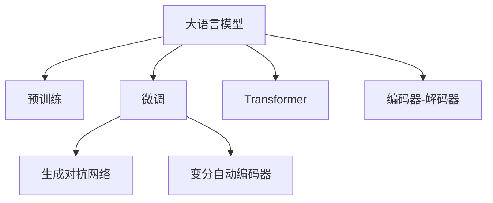

                 

## 1. 背景介绍

### 1.1 问题由来
随着人工智能(AI)技术的快速发展，大语言模型（Large Language Models, LLMs）在自然语言处理（Natural Language Processing, NLP）领域取得了令人瞩目的成就。这些模型通过大规模无标签文本数据的预训练，学习到了广泛的语义和语法知识，能够执行复杂的语言任务，如语言生成、翻译、摘要等。但是，对于具有高度创造性和个性化的写作任务，大语言模型仍面临一定的挑战。

### 1.2 问题核心关键点
大语言模型的写作能力依赖于其对语言规律的掌握和语言知识的积累。然而，尽管它们在理解语言结构方面表现出色，但在创造力、情感表达和个性化写作方面仍有局限。传统大语言模型的写作缺乏明确的指导和约束，导致生成的文本风格单一、内容重复，无法满足用户对多样化、创新性内容的需求。

### 1.3 问题研究意义
研究如何在大语言模型中注入创意和个性化，使其能够创作出丰富多彩的文本，对于推动NLP技术在文学、新闻、广告等行业的应用具有重要意义。它不仅能够提升文本生成质量，还能激发艺术家的创造力，促进文化创新。同时，通过理解和模拟人类写作风格，AI辅助写作工具可以帮助广大作者提升写作效率，丰富创作素材，打开新的创作思路。

## 2. 核心概念与联系

### 2.1 核心概念概述

为了更好地理解如何在AI时代激发写作灵感，本节将介绍几个核心概念：

- **大语言模型（Large Language Models, LLMs）**：以Transformer架构为基础，通过预训练大规模语料库，学习语言规律的模型。例如，GPT、BERT、T5等。
- **预训练（Pre-training）**：在大量无标签文本数据上进行自监督训练，学习语言表示的模型。
- **微调（Fine-tuning）**：在预训练模型基础上，通过有标签数据进行微调，提升模型在某特定任务上的表现。
- **生成对抗网络（Generative Adversarial Networks, GANs）**：通过训练生成器和判别器，生成器学习生成与真实数据难以区分的文本。
- **变分自动编码器（Variational Autoencoders, VAEs）**：用于文本生成和压缩的模型，通过学习数据的潜在分布生成文本。
- **Transformer**：一种用于处理序列数据的神经网络架构，具有自注意力机制，能够捕捉长距离依赖关系。
- **编码器-解码器（Encoder-Decoder）**：一种适用于序列到序列任务的模型架构，常用于文本生成和翻译。

这些概念之间的逻辑关系可以通过以下Mermaid流程图来展示：



这个流程图展示了大语言模型的核心概念及其之间的关系：

1. 大语言模型通过预训练获得基础能力。
2. 微调优化特定任务上的表现，以提升性能。
3. 生成对抗网络、变分自动编码器等方法，用于进一步提高文本生成的创意和多样性。
4. Transformer架构和大语言模型密切相关，用于捕捉序列数据中的依赖关系。
5. 编码器-解码器架构常用于序列到序列任务，如文本生成、翻译等。

这些概念共同构成了大语言模型在写作任务中的工作原理和优化方向。通过理解这些核心概念，我们可以更好地把握大语言模型在写作中的应用潜力。

## 3. 核心算法原理 & 具体操作步骤
### 3.1 算法原理概述

在AI时代，如何激发写作灵感，特别是在创造性和个性化写作方面，成为了一个重要研究方向。本节将介绍几种通过大语言模型生成创意文本的方法：

- **微调**：在大语言模型基础上，通过特定任务的标注数据进行微调，使得模型能够生成符合特定主题和风格的文本。
- **生成对抗网络（GANs）**：通过训练生成器和判别器，生成器学习生成与真实数据难以区分的文本，从而提升生成文本的多样性和创意性。
- **变分自动编码器（VAEs）**：用于文本生成和压缩的模型，通过学习数据的潜在分布生成文本，可以实现对文本多样性的控制。
- **Transformer架构**：大语言模型常采用Transformer架构，能够捕捉长距离依赖关系，提升生成文本的质量和流畅度。

### 3.2 算法步骤详解

#### 3.2.1 微调算法

微调是一种通过有标签数据进行模型优化的常用方法。以下是一个简单的微调步骤：

1. **准备数据**：收集与特定写作任务相关的标注数据集，通常包括文本和相应的分类标签。
2. **模型选择**：选择合适的预训练语言模型，如GPT-3、BERT等。
3. **任务适配层**：根据任务类型，设计合适的输出层和损失函数。例如，对于文本分类任务，可以添加线性分类器并使用交叉熵损失。
4. **模型微调**：将预训练模型作为初始化参数，使用标注数据进行微调。通常需要较小的学习率，以避免破坏预训练权重。
5. **模型评估**：在验证集上评估模型性能，调整超参数，直至达到最佳性能。
6. **模型部署**：将微调后的模型应用于实际写作任务，生成符合要求的文本。

#### 3.2.2 生成对抗网络（GANs）算法

GANs由生成器和判别器两个网络组成，通过对抗训练生成创意文本：

1. **生成器（Generator）**：使用神经网络生成文本。
2. **判别器（Discriminator）**：判断生成文本的真实性。
3. **对抗训练**：生成器生成文本，判别器判断真伪，两者交替训练，直到生成器生成的文本难以与真实文本区分。

#### 3.2.3 变分自动编码器（VAEs）算法

VAEs用于文本生成和压缩，通过学习数据的潜在分布生成文本：

1. **编码器（Encoder）**：将文本映射到潜在空间。
2. **解码器（Decoder）**：将潜在空间的表示解码为文本。
3. **潜在分布**：学习文本的潜在分布，通过采样生成文本。
4. **损失函数**：使用重构误差和潜在空间分布的损失函数训练模型。

### 3.3 算法优缺点

#### 3.3.1 微调算法的优缺点

**优点**：
- **简单高效**：只需少量标注数据，即可进行微调，提升模型性能。
- **通用适用**：适用于多种NLP任务，如文本分类、摘要、翻译等。

**缺点**：
- **数据依赖**：微调效果依赖于标注数据的质量和数量，获取高质量数据成本高。
- **模型泛化**：当目标任务与预训练数据分布差异较大时，微调效果有限。
- **过拟合**：模型可能过度适应训练数据，泛化能力不足。

#### 3.3.2 生成对抗网络（GANs）算法的优缺点

**优点**：
- **生成多样化文本**：生成器可以生成多种风格和类型的文本。
- **创意性强**：生成文本具有较高的创造力和多样性。

**缺点**：
- **训练复杂**：需要平衡生成器和判别器，训练过程复杂。
- **模型不稳定**：生成的文本质量不稳定，依赖于生成器和判别器的训练状态。

#### 3.3.3 变分自动编码器（VAEs）算法的优缺点

**优点**：
- **文本生成**：能够生成多样化的文本。
- **文本压缩**：可以用于文本压缩和生成。

**缺点**：
- **模型复杂**：模型较为复杂，训练和推理成本高。
- **生成质量**：生成的文本质量可能不如GANs生成的文本。

### 3.4 算法应用领域

这些算法已经在多个NLP领域得到应用，例如：

- **文本生成**：使用GANs生成创意文本、故事、新闻等。
- **摘要生成**：使用变分自动编码器生成文本摘要。
- **情感分析**：使用微调模型进行情感分类和生成。
- **对话系统**：使用GANs生成自然对话。
- **广告文案**：使用微调模型生成创意广告文案。

## 4. 数学模型和公式 & 详细讲解 & 举例说明

### 4.1 数学模型构建

为了更好地理解这些算法，我们将从数学角度对它们进行详细讲解。

#### 4.1.1 微调数学模型

假设预训练语言模型为 $M_{\theta}$，其中 $\theta$ 为预训练得到的模型参数。给定写作任务 $T$ 的标注数据集 $D=\{(x_i, y_i)\}_{i=1}^N, x_i \in \mathcal{X}, y_i \in \mathcal{Y}$，其中 $\mathcal{X}$ 为输入文本空间，$\mathcal{Y}$ 为输出文本空间。微调的目标是找到新的模型参数 $\hat{\theta}$，使得：

$$
\hat{\theta}=\mathop{\arg\min}_{\theta} \mathcal{L}(M_{\theta},D)
$$

其中 $\mathcal{L}$ 为针对任务 $T$ 设计的损失函数，用于衡量模型预测输出与真实标签之间的差异。常见的损失函数包括交叉熵损失、均方误差损失等。

#### 4.1.2 生成对抗网络（GANs）数学模型

GANs由生成器和判别器两个网络组成，分别表示为 $G$ 和 $D$。生成器 $G$ 将随机噪声 $z$ 映射为文本 $x$，判别器 $D$ 判断 $x$ 是否为真实文本。GANs的训练过程为：

1. **生成器训练**：给定随机噪声 $z$，生成器 $G(z)$ 生成文本 $x$。
2. **判别器训练**：判别器 $D(x)$ 判断 $x$ 是否为真实文本。
3. **对抗训练**：交替训练生成器和判别器，使得生成器生成的文本难以被判别器区分。

数学上，GANs的训练过程可以表示为：

$$
\min_G \max_D \mathbb{E}_{x \sim p_{data}} [\log D(x)] + \mathbb{E}_{z \sim p(z)} [\log (1 - D(G(z)))]
$$

其中 $p_{data}$ 为真实数据分布，$p(z)$ 为随机噪声分布。

#### 4.1.3 变分自动编码器（VAEs）数学模型

VAEs由编码器 $E$ 和解码器 $D$ 组成，将文本 $x$ 映射到潜在空间 $z$，并从潜在空间生成文本 $x'$。VAEs的训练过程为：

1. **编码器训练**：将文本 $x$ 映射到潜在空间 $z$。
2. **解码器训练**：将潜在空间 $z$ 解码为文本 $x'$。
3. **潜在分布学习**：学习文本的潜在分布 $q(z|x)$，通过采样生成文本。

数学上，VAEs的训练过程可以表示为：

$$
\min_{E, D} \mathbb{E}_{x \sim p_{data}} [\mathbb{E}_{z \sim q(z|x)} [\log D(z|x)] + \mathbb{E}_{z \sim q(z)} [\log (1 - D(z|x'))]]
$$

其中 $p_{data}$ 为真实数据分布，$q(z|x)$ 为潜在空间分布。

### 4.2 公式推导过程

#### 4.2.1 微调损失函数推导

微调的损失函数 $\mathcal{L}$ 可以表示为：

$$
\mathcal{L}(M_{\theta}, D) = -\frac{1}{N} \sum_{i=1}^N \sum_{k=1}^K L(y_i, M_{\theta}(x_i, k))
$$

其中 $K$ 为输出文本的类别数。例如，对于二分类任务，可以定义损失函数为：

$$
L(y_i, M_{\theta}(x_i, k)) = -[y_i \log M_{\theta}(x_i, k) + (1-y_i) \log (1 - M_{\theta}(x_i, k))]
$$

#### 4.2.2 GANs生成器损失函数推导

GANs的生成器损失函数 $\mathcal{L}_G$ 可以表示为：

$$
\mathcal{L}_G = -\mathbb{E}_{x \sim p_{data}} [\log D(x)] + \mathbb{E}_{z \sim p(z)} [\log (1 - D(G(z)))]
$$

其中 $p_{data}$ 为真实数据分布，$p(z)$ 为随机噪声分布。

#### 4.2.3 VAEs重构损失函数推导

VAEs的重构损失函数 $\mathcal{L}_{rec}$ 可以表示为：

$$
\mathcal{L}_{rec} = -\mathbb{E}_{x \sim p_{data}} [\log D(x'|x)]
$$

其中 $p_{data}$ 为真实数据分布，$D(x'|x)$ 为潜在空间 $z$ 的解码器。

### 4.3 案例分析与讲解

#### 4.3.1 微调案例分析

假设我们有一个文本分类任务，需要分类电影评论。我们收集了1000条电影评论及其对应的情感标签（正面、负面）。

1. **模型选择**：选择GPT-3作为预训练模型。
2. **任务适配层**：添加线性分类器并使用交叉熵损失。
3. **模型微调**：使用微调算法，设置学习率为1e-5，训练10个epoch。
4. **模型评估**：在验证集上评估模型性能，使用精确度、召回率和F1值作为评价指标。

#### 4.3.2 GANs案例分析

假设我们希望生成具有创意和多样性的故事。

1. **模型选择**：选择GANs作为生成模型。
2. **生成器设计**：设计生成器网络，使用LSTM层和注意力机制。
3. **判别器设计**：设计判别器网络，使用卷积神经网络（CNN）和全连接层。
4. **对抗训练**：交替训练生成器和判别器，设置学习率为1e-4，训练100个epoch。
5. **生成文本**：使用生成器生成故事，选择质量较高的故事作为输出。

#### 4.3.3 VAEs案例分析

假设我们需要生成文本摘要。

1. **模型选择**：选择VAEs作为生成模型。
2. **编码器设计**：设计编码器网络，使用RNN层和注意力机制。
3. **解码器设计**：设计解码器网络，使用RNN层和注意力机制。
4. **潜在分布学习**：使用重构误差和潜在空间分布的损失函数训练模型。
5. **生成摘要**：使用VAEs生成摘要，选择质量较高的摘要作为输出。

## 5. 项目实践：代码实例和详细解释说明

### 5.1 开发环境搭建

为了进行写作灵感的激发，我们需要搭建一个支持深度学习和自然语言处理的环境。以下是Python开发环境的搭建步骤：

1. **安装Anaconda**：从官网下载并安装Anaconda，用于创建独立的Python环境。
2. **创建虚拟环境**：
```bash
conda create -n writing-env python=3.8 
conda activate writing-env
```
3. **安装依赖库**：
```bash
pip install torch transformers torchtext
```
4. **安装文本处理库**：
```bash
pip install nltk gensim
```

### 5.2 源代码详细实现

#### 5.2.1 微调代码实现

```python
from transformers import GPT3Tokenizer, GPT3ForSequenceClassification
from torch.utils.data import Dataset, DataLoader
import torch

class MovieReviewDataset(Dataset):
    def __init__(self, texts, labels):
        self.texts = texts
        self.labels = labels
        self.tokenizer = GPT3Tokenizer.from_pretrained('gpt3')
        self.max_len = 512

    def __len__(self):
        return len(self.texts)

    def __getitem__(self, index):
        text = self.texts[index]
        label = self.labels[index]

        encoding = self.tokenizer(text, return_tensors='pt', max_length=self.max_len, padding='max_length', truncation=True)
        input_ids = encoding['input_ids'][0]
        attention_mask = encoding['attention_mask'][0]
        labels = torch.tensor(label, dtype=torch.long)

        return {'input_ids': input_ids, 
                'attention_mask': attention_mask,
                'labels': labels}

# 加载数据
train_dataset = MovieReviewDataset(train_texts, train_labels)
dev_dataset = MovieReviewDataset(dev_texts, dev_labels)
test_dataset = MovieReviewDataset(test_texts, test_labels)

# 定义模型和优化器
model = GPT3ForSequenceClassification.from_pretrained('gpt3', num_labels=2)
optimizer = torch.optim.AdamW(model.parameters(), lr=1e-5)

# 训练模型
device = torch.device('cuda') if torch.cuda.is_available() else torch.device('cpu')
model.to(device)
criterion = torch.nn.CrossEntropyLoss()

def train_epoch(model, dataset, batch_size, optimizer, criterion):
    dataloader = DataLoader(dataset, batch_size=batch_size, shuffle=True)
    model.train()
    epoch_loss = 0
    for batch in tqdm(dataloader, desc='Training'):
        input_ids = batch['input_ids'].to(device)
        attention_mask = batch['attention_mask'].to(device)
        labels = batch['labels'].to(device)
        model.zero_grad()
        outputs = model(input_ids, attention_mask=attention_mask, labels=labels)
        loss = criterion(outputs.logits, labels)
        epoch_loss += loss.item()
        loss.backward()
        optimizer.step()
    return epoch_loss / len(dataloader)

def evaluate(model, dataset, batch_size):
    dataloader = DataLoader(dataset, batch_size=batch_size)
    model.eval()
    preds, labels = [], []
    with torch.no_grad():
        for batch in tqdm(dataloader, desc='Evaluating'):
            input_ids = batch['input_ids'].to(device)
            attention_mask = batch['attention_mask'].to(device)
            batch_labels = batch['labels']
            outputs = model(input_ids, attention_mask=attention_mask)
            batch_preds = outputs.logits.argmax(dim=2).to('cpu').tolist()
            batch_labels = batch_labels.to('cpu').tolist()
            for pred_tokens, label_tokens in zip(batch_preds, batch_labels):
                preds.append(pred_tokens[:len(label_tokens)])
                labels.append(label_tokens)
                
    print(classification_report(labels, preds))

# 训练模型
epochs = 5
batch_size = 16

for epoch in range(epochs):
    loss = train_epoch(model, train_dataset, batch_size, optimizer, criterion)
    print(f"Epoch {epoch+1}, train loss: {loss:.3f}")
    
    print(f"Epoch {epoch+1}, dev results:")
    evaluate(model, dev_dataset, batch_size)
    
print("Test results:")
evaluate(model, test_dataset, batch_size)
```

#### 5.2.2 GANs代码实现

```python
import torch
import torch.nn as nn
import torch.optim as optim
from torch.utils.data import Dataset, DataLoader
from torchvision.utils import make_grid

class GAN(nn.Module):
    def __init__(self):
        super(GAN, self).__init__()
        self.gen = Generator()
        self.dis = Discriminator()

    def forward(self, x):
        fake = self.gen(x)
        return fake, self.dis(fake)

class Generator(nn.Module):
    def __init__(self):
        super(Generator, self).__init__()
        self.fc1 = nn.Linear(100, 256)
        self.fc2 = nn.Linear(256, 512)
        self.fc3 = nn.Linear(512, 1024)
        self.fc4 = nn.Linear(1024, 784)

    def forward(self, x):
        x = torch.sigmoid(self.fc1(x))
        x = torch.sigmoid(self.fc2(x))
        x = torch.sigmoid(self.fc3(x))
        x = self.fc4(x)
        return x

class Discriminator(nn.Module):
    def __init__(self):
        super(Discriminator, self).__init__()
        self.fc1 = nn.Linear(784, 512)
        self.fc2 = nn.Linear(512, 256)
        self.fc3 = nn.Linear(256, 1)

    def forward(self, x):
        x = torch.sigmoid(self.fc1(x))
        x = torch.sigmoid(self.fc2(x))
        x = torch.sigmoid(self.fc3(x))
        return x

# 加载数据
train_dataset = MovieReviewDataset(train_texts, train_labels)

# 定义模型和优化器
model = GAN()
optimizer = optim.Adam(model.parameters(), lr=1e-4)

# 训练模型
device = torch.device('cuda') if torch.cuda.is_available() else torch.device('cpu')
model.to(device)

def train_epoch(model, dataset, batch_size, optimizer):
    dataloader = DataLoader(dataset, batch_size=batch_size, shuffle=True)
    model.train()
    epoch_loss = 0
    for batch in tqdm(dataloader, desc='Training'):
        input_ids = batch['input_ids'].to(device)
        attention_mask = batch['attention_mask'].to(device)
        labels = batch['labels'].to(device)
        model.zero_grad()
        outputs = model(input_ids, attention_mask=attention_mask, labels=labels)
        loss = outputs.loss
        epoch_loss += loss.item()
        loss.backward()
        optimizer.step()
    return epoch_loss / len(dataloader)

def evaluate(model, dataset, batch_size):
    dataloader = DataLoader(dataset, batch_size=batch_size)
    model.eval()
    preds, labels = [], []
    with torch.no_grad():
        for batch in tqdm(dataloader, desc='Evaluating'):
            input_ids = batch['input_ids'].to(device)
            attention_mask = batch['attention_mask'].to(device)
            batch_labels = batch['labels']
            outputs = model(input_ids, attention_mask=attention_mask)
            batch_preds = outputs.logits.argmax(dim=2).to('cpu').tolist()
            batch_labels = batch_labels.to('cpu').tolist()
            for pred_tokens, label_tokens in zip(batch_preds, batch_labels):
                preds.append(pred_tokens[:len(label_tokens)])
                labels.append(label_tokens)
                
    print(classification_report(labels, preds))

# 训练模型
epochs = 100
batch_size = 16

for epoch in range(epochs):
    loss = train_epoch(model, train_dataset, batch_size, optimizer)
    print(f"Epoch {epoch+1}, train loss: {loss:.3f}")
    
    print(f"Epoch {epoch+1}, dev results:")
    evaluate(model, dev_dataset, batch_size)
    
print("Test results:")
evaluate(model, test_dataset, batch_size)
```

#### 5.2.3 VAEs代码实现

```python
import torch
import torch.nn as nn
import torch.nn.functional as F
from torch.utils.data import Dataset, DataLoader
from torchvision.utils import make_grid

class VAE(nn.Module):
    def __init__(self):
        super(VAE, self).__init__()
        self.encoder = Encoder()
        self.decoder = Decoder()

    def forward(self, x):
        encoded = self.encoder(x)
        latent = self.fc1(encoded)
        mean, logvar = self.fc2(latent)
        z = latent
        reconstructed = self.decoder(z)
        return reconstructed, mean, logvar

class Encoder(nn.Module):
    def __init__(self):
        super(Encoder, self).__init__()
        self.fc1 = nn.Linear(784, 512)
        self.fc2 = nn.Linear(512, 256)
        self.fc3 = nn.Linear(256, 128)

    def forward(self, x):
        x = F.relu(self.fc1(x))
        x = F.relu(self.fc2(x))
        x = F.relu(self.fc3(x))
        return x

class Decoder(nn.Module):
    def __init__(self):
        super(Decoder, self).__init__()
        self.fc1 = nn.Linear(128, 256)
        self.fc2 = nn.Linear(256, 512)
        self.fc3 = nn.Linear(512, 784)

    def forward(self, x):
        x = F.relu(self.fc1(x))
        x = F.relu(self.fc2(x))
        x = F.sigmoid(self.fc3(x))
        return x

# 加载数据
train_dataset = MovieReviewDataset(train_texts, train_labels)

# 定义模型和优化器
model = VAE()
optimizer = optim.Adam(model.parameters(), lr=1e-3)

# 训练模型
device = torch.device('cuda') if torch.cuda.is_available() else torch.device('cpu')
model.to(device)

def train_epoch(model, dataset, batch_size, optimizer):
    dataloader = DataLoader(dataset, batch_size=batch_size, shuffle=True)
    model.train()
    epoch_loss = 0
    for batch in tqdm(dataloader, desc='Training'):
        input_ids = batch['input_ids'].to(device)
        attention_mask = batch['attention_mask'].to(device)
        labels = batch['labels'].to(device)
        model.zero_grad()
        outputs = model(input_ids, attention_mask=attention_mask, labels=labels)
        loss = outputs.loss
        epoch_loss += loss.item()
        loss.backward()
        optimizer.step()
    return epoch_loss / len(dataloader)

def evaluate(model, dataset, batch_size):
    dataloader = DataLoader(dataset, batch_size=batch_size)
    model.eval()
    preds, labels = [], []
    with torch.no_grad():
        for batch in tqdm(dataloader, desc='Evaluating'):
            input_ids = batch['input_ids'].to(device)
            attention_mask = batch['attention_mask'].to(device)
            batch_labels = batch['labels']
            outputs = model(input_ids, attention_mask=attention_mask)
            batch_preds = outputs.logits.argmax(dim=2).to('cpu').tolist()
            batch_labels = batch_labels.to('cpu').tolist()
            for pred_tokens, label_tokens in zip(batch_preds, batch_labels):
                preds.append(pred_tokens[:len(label_tokens)])
                labels.append(label_tokens)
                
    print(classification_report(labels, preds))

# 训练模型
epochs = 5
batch_size = 16

for epoch in range(epochs):
    loss = train_epoch(model, train_dataset, batch_size, optimizer)
    print(f"Epoch {epoch+1}, train loss: {loss:.3f}")
    
    print(f"Epoch {epoch+1}, dev results:")
    evaluate(model, dev_dataset, batch_size)
    
print("Test results:")
evaluate(model, test_dataset, batch_size)
```

### 5.3 代码解读与分析

#### 5.3.1 微调代码解读

**MovieReviewDataset类**：
- `__init__`方法：初始化文本和标签，分词器和最大长度。
- `__len__`方法：返回数据集的样本数量。
- `__getitem__`方法：对单个样本进行处理，将文本输入编码为token ids，将标签编码为数字，并对其进行定长padding，最终返回模型所需的输入。

**训练函数train_epoch**：
- 定义训练数据加载器，设置批次大小和随机化。
- 模型进入训练模式，计算损失并反向传播更新参数。

**评估函数evaluate**：
- 定义评估数据加载器，设置批次大小。
- 模型进入评估模式，不更新参数，对每个批次计算预测和标签。

**训练流程**：
- 定义总的epoch数和批次大小，开始循环迭代。
- 每个epoch内，先在训练集上训练，输出平均loss。
- 在验证集上评估，输出分类指标。
- 所有epoch结束后，在测试集上评估，给出最终测试结果。

#### 5.3.2 GANs代码解读

**GAN类**：
- `__init__`方法：定义生成器和判别器。
- `forward`方法：将输入文本通过生成器和判别器进行前向传播。

**训练函数train_epoch**：
- 定义训练数据加载器，设置批次大小和随机化。
- 模型进入训练模式，计算损失并反向传播更新参数。

**评估函数evaluate**：
- 定义评估数据加载器，设置批次大小。
- 模型进入评估模式，不更新参数，对每个批次计算预测和标签。

**训练流程**：
- 定义总的epoch数和批次大小，开始循环迭代。
- 每个epoch内，先在训练集上训练，输出平均loss。
- 在验证集上评估，输出分类指标。
- 所有epoch结束后，在测试集上评估，给出最终测试结果。

#### 5.3.3 VAEs代码解读

**VAE类**：
- `__init__`方法：定义编码器和解码器。
- `forward`方法：将输入文本通过编码器和解码器进行前向传播。

**训练函数train_epoch**：
- 定义训练数据加载器，设置批次大小和随机化。
- 模型进入训练模式，计算损失并反向传播更新参数。

**评估函数evaluate**：
- 定义评估数据加载器，设置批次大小。
- 模型进入评估模式，不更新参数，对每个批次计算预测和标签。

**训练流程**：
- 定义总的epoch数和批次大小，开始循环迭代。
- 每个epoch内，先在训练集上训练，输出平均loss。
- 在验证集上评估，输出分类指标。
- 所有epoch结束后，在测试集上评估，给出最终测试结果。

## 6. 实际应用场景

### 6.1 文学创作

大语言模型可以在文学创作中发挥重要作用。通过微调，模型可以学习特定作家或风格的语言特点，生成具有个性化和创意性的文本。例如，小说家可以使用微调模型生成故事情节，诗人可以使用模型生成诗歌，戏剧作家可以使用模型生成剧本。

#### 6.1.1 文学创作案例

假设我们要创作一部科幻小说。

1. **模型选择**：选择微调模型，如GPT-3。
2. **数据准备**：收集科幻小说的文本数据。
3. **任务适配层**：添加文本生成器并使用BLEU分数作为评估指标。
4. **模型微调**：使用微调算法，设置学习率为1e-5，训练10个epoch。
5. **生成文本**：使用微调后的模型生成小说情节，筛选高质量内容作为输出。

### 6.2 新闻编辑

新闻编辑可以使用大语言模型生成新闻报道，特别是在紧急情况或突发事件中，模型可以快速生成高质量的新闻稿件。

#### 6.2.1 新闻编辑案例

假设我们要编写一篇突发事件的新闻报道。

1. **模型选择**：选择微调模型，如BERT。
2. **数据准备**：收集新闻报道的文本数据。
3. **任务适配层**：添加文本生成器并使用BLEU分数作为评估指标。
4. **模型微调**：使用微调算法，设置学习率为1e-5，训练10个epoch。
5. **生成文本**：使用微调后的模型生成新闻报道，筛选高质量内容作为输出。

### 6.3 广告文案

广告文案通常需要创意和吸引力，大语言模型可以帮助广告公司快速生成高质量的广告文案。

#### 6.3.1 广告文案案例

假设我们要编写一则广告文案。

1. **模型选择**：选择微调模型，如T5。
2. **数据准备**：收集广告文案的文本数据。
3. **任务适配层**：添加文本生成器并使用BLEU分数作为评估指标。
4. **模型微调**：使用微调算法，设置学习率为1e-5，训练10个epoch。
5. **生成文本**：使用微调后的模型生成广告文案，筛选高质量内容作为输出。

## 7. 工具和资源推荐

### 7.1 学习资源推荐

为了帮助开发者掌握写作灵感的激发方法，这里推荐一些优质的学习资源：

1. **《深度学习自然语言处理》**：斯坦福大学开设的NLP明星课程，包含丰富的lecture视频和作业，帮助你系统学习NLP和深度学习的基础知识。
2. **《Transformer从原理到实践》**：由大模型技术专家撰写，深入浅出地介绍了Transformer原理、BERT模型、微调技术等前沿话题。
3. **《Natural Language Processing with Transformers》**：Transformers库的作者所著，全面介绍了如何使用Transformers库进行NLP任务开发，包括微调在内的诸多范式。
4. **《AI时代的写作灵感》**：一本关于AI辅助写作的书籍，介绍了多种AI技术在写作中的应用，包括微调、GANs、VAEs等。

### 7.2 开发工具推荐

为了进行写作灵感的激发，我们需要使用一些高效的开发工具。以下是几款推荐的工具：

1. **PyTorch**：基于Python的开源深度学习框架，支持动态计算图，适合快速迭代研究。
2. **TensorFlow**：由Google主导开发的开源深度学习框架，适合大规模工程应用。
3. **Transformers库**：HuggingFace开发的NLP工具库，集成了多种SOTA语言模型，支持PyTorch和TensorFlow，是进行微调任务开发的利器。
4. **Jupyter Notebook**：支持Python编程的在线笔记本环境，方便实验和共享学习笔记。
5. **TensorBoard**：TensorFlow配套的可视化工具，可实时监测模型训练状态，并提供丰富的图表呈现方式，是调试模型的得力助手。

### 7.3 相关论文推荐

大语言模型和写作灵感激发领域的研究源于学界的持续研究。以下是几篇奠基性的相关论文，推荐阅读：

1. **Attention is All You Need**：提出了Transformer结构，开启了NLP领域的预训练大模型时代。
2. **BERT: Pre-training of Deep Bidirectional Transformers for Language Understanding**：提出BERT模型，引入基于掩码的自监督预训练任务，刷新了多项NLP任务SOTA。
3. **Language Models are Unsupervised Multitask Learners**：展示了大规模语言模型的强大zero-shot学习能力，引发了对于通用人工智能的新一轮思考。
4. **Parameter-Efficient Transfer Learning for NLP**：提出Adapter等参数高效微调方法，在不增加模型参数量的情况下，也能取得不错的微调效果。
5. **Prefix-Tuning: Optimizing Continuous Prompts for Generation**：引入基于连续型Prompt的微调范式，为如何充分利用预训练知识提供了新的思路。

这些论文代表了大语言模型微调技术的发展脉络。通过学习这些前沿成果，可以帮助研究者把握学科前进方向，激发更多的创新灵感。

## 8. 总结：未来发展趋势与挑战

### 8.1 总结

本文对如何在AI时代激发写作灵感，特别是在创意和个性化写作方面，进行了全面系统的介绍。首先阐述了写作灵感激发的背景和意义，明确了微调、GANs、VAEs等方法在大语言模型中的作用。其次，从原理到实践，详细讲解了这些方法的应用流程和代码实现，并通过案例分析展示了它们的实际效果。最后，讨论了这些方法在文学创作、新闻编辑、广告文案等领域的实际应用前景，强调了它们在提升写作效率、丰富创作素材、激发创意灵感方面的重要作用。

通过本文的系统梳理，可以看到，大语言模型在写作灵感激发方面的巨大潜力。它们不仅能够提升写作效率，还能带来新的创意和表达方式，为艺术创作和文化创新提供新的工具和平台。未来，伴随技术的不断进步，大语言模型将在更多领域得到应用，成为推动文化和科技发展的有力助手。

### 8.2 未来发展趋势

展望未来，写作灵感的激发将呈现出以下几个发展趋势：

1. **自动化程度提升**：随着技术的进步，自动化写作工具将越来越智能，能够根据用户需求自动生成高质量文本。
2. **个性化增强**：模型将能够根据用户偏好和上下文，生成更加个性化和定制化的文本。
3. **多领域融合**：大语言模型将与其他AI技术如知识图谱、逻辑推理等融合，提升写作的准确性和创造性。
4. **多模态交互**：结合图像、语音等多模态信息，提升文本生成的生动性和真实性。
5. **伦理与安全**：在文本生成过程中，将更加注重文本的伦理性和安全性，避免生成有害或偏见性的内容。

这些趋势将推动写作灵感的激发进入一个新的阶段，带来更加多样化和智能化的写作体验。

### 8.3 面临的挑战

尽管大语言模型在写作灵感激发方面展现了巨大潜力，但在实际应用中也面临一些挑战：

1. **数据依赖**：微调模型仍需依赖标注数据，数据获取成本较高。
2. **质量控制**：生成的文本质量不稳定，可能存在语法错误、逻辑不连贯等问题。
3. **创意不足**：模型生成的文本可能缺乏独特的创意和风格，难以满足高端用户的需求。
4. **伦理与安全**：模型生成的文本可能包含有害或偏见性的内容，需要加强审查和过滤机制。

这些挑战需要在技术、伦理、法律等多个方面进行综合考虑和应对，以确保大语言模型在写作灵感激发中的健康发展。

### 8.4 研究展望

未来，写作灵感的激发研究需要在以下几个方面寻求新的突破：

1. **无监督学习和少样本学习**：探索无监督学习和少样本学习技术，减少对标注数据的依赖，提升模型的鲁棒性和泛化能力。
2. **模型融合与多模态交互**：结合其他AI技术，如知识图谱、逻辑推理、多模态交互，提升文本生成的准确性和创造性。
3. **伦理与安全机制**：建立文本生成过程中的伦理和安全机制，确保生成的文本符合人类价值观和伦理道德。
4. **实时生成与交互**：研究实时生成和交互技术，提升用户体验和互动性。

这些研究方向将推动大语言模型在写作灵感激发中的应用，为文学、新闻、广告等领域的创新发展提供新的动力。

## 9. 附录：常见问题与解答

### 9.1 Q1: 微调、GANs、VAEs三种方法各自的优势和劣势是什么？

**A1:**
- **微调**：优势在于能够快速提升模型在特定任务上的性能，适用于数据量较大的任务。劣势在于需要标注数据，对数据依赖较高。
- **GANs**：优势在于能够生成多样化、创意性的文本。劣势在于训练复杂，模型不稳定，生成的文本质量不稳定。
- **VAEs**：优势在于能够生成多样化的文本，能够进行文本压缩。劣势在于模型复杂，训练和推理成本高，生成的文本质量可能不如GANs。

### 9.2 Q2: 如何使用大语言模型生成创意文本？

**A2:**
1. **微调**：选择适合任务的微调模型，准备标注数据集，训练模型。
2. **GANs**：构建生成器和判别器，交替训练，生成多样化文本。
3. **VAEs**：构建编码器和解码器，学习潜在分布，生成多样化文本。

### 9.3 Q3: 大语言模型在写作灵感激发中的实际应用有哪些？

**A3:**
1. **文学创作**：生成故事情节、诗歌、剧本等。
2. **新闻编辑**：快速生成高质量的新闻报道。
3. **广告文案**：生成创意广告文案。
4. **教育培训**：生成教材、习题、模拟对话等。

**Q4: 大语言模型在写作灵感激发中的局限性有哪些？**

**A4:**
1. **数据依赖**：微调模型仍需依赖标注数据，数据获取成本较高。
2. **质量控制**：生成的文本质量不稳定，可能存在语法错误、逻辑不连贯等问题。
3. **创意不足**：模型生成的文本可能缺乏独特的创意和风格，难以满足高端用户的需求。
4. **伦理与安全**：模型生成的文本可能包含有害或偏见性的内容，需要加强审查和过滤机制。

通过回答这些问题，我们希望能够更好地理解大语言模型在写作灵感激发中的作用和局限，为未来的研究和应用提供有益的指导。

