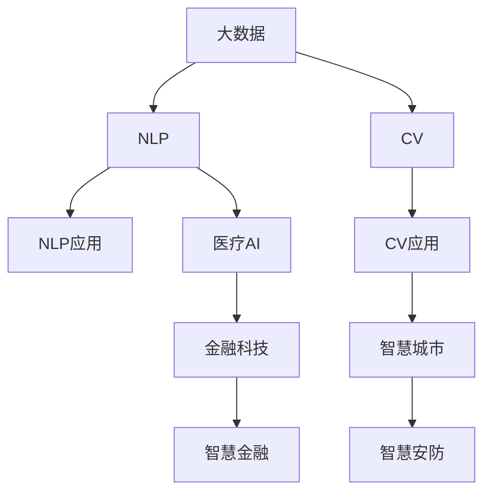

                 

# AI时代的创业选择：垂直领域的机遇

> 关键词：人工智能(AI)，创业机会，垂直领域，大数据，算法优化，自然语言处理(NLP)，计算机视觉(CV)，医疗AI，金融科技(FinTech)，智慧城市

## 1. 背景介绍

### 1.1 问题由来
随着人工智能(AI)技术的迅速发展，各行各业都迎来了新的变革机会。AI技术不仅能够提升生产效率，还能创造出全新的商业模式和市场空间。但与此同时，AI技术的复杂性和高成本也给创业公司带来了巨大的挑战。如何在AI时代选择正确的创业方向，成为许多创业者面临的首要问题。

### 1.2 问题核心关键点
选择垂直领域的创业机会时，应考虑以下核心要素：
- 市场需求：该领域是否存在真实、大规模的市场需求？
- 技术门槛：该领域的技术是否具有相对较高的壁垒，难以被轻易复制？
- 数据可用性：该领域是否容易获取大规模、高质量的数据？
- 产业成熟度：该领域的技术和应用是否已经发展相对成熟？
- 商业化难度：该领域的AI应用是否容易商业模式化，是否存在显著盈利模式？

通过对这些关键点的综合评估，创业者可以选择更具潜力的垂直领域进行创业。本文将详细探讨几个具备较大创业潜力的垂直领域，并介绍具体的技术实现方法和应用场景。

## 2. 核心概念与联系

### 2.1 核心概念概述

为更好地理解AI在垂直领域的创业机会，本节将介绍几个密切相关的核心概念：

- 人工智能(AI)：以机器学习、深度学习为代表的技术，通过大量数据训练模型，以实现自动化决策、自主学习、智能交互等功能。

- 大数据：指大规模、复杂、多源的数据集合。大数据技术能够帮助AI模型获取丰富的训练样本，提升模型的泛化能力。

- 自然语言处理(NLP)：涉及计算机对人类语言的处理和理解，包括文本分类、情感分析、机器翻译、对话系统等。

- 计算机视觉(CV)：涉及计算机对图像、视频等视觉数据的理解和处理，包括图像识别、目标检测、图像生成等。

- 医疗AI：利用AI技术进行医疗影像诊断、疾病预测、治疗方案推荐等，以提升医疗服务的效率和精准度。

- 金融科技(FinTech)：利用AI技术进行金融风险控制、交易预测、客户服务、投顾咨询等，以推动金融行业的智能化发展。

- 智慧城市：通过AI技术对城市交通、安防、环保、能源等进行智能化管理，提升城市运行效率和居民生活质量。

这些核心概念之间的逻辑关系可以通过以下Mermaid流程图来展示：



这个流程图展示了大数据、AI技术及其在不同垂直领域中的应用场景。

## 3. 核心算法原理 & 具体操作步骤
### 3.1 算法原理概述

在垂直领域的AI创业中，核心算法包括但不限于以下几种：

- 深度学习算法：用于处理高维度、大规模的数据，实现复杂模式的识别和预测。
- 自然语言处理算法：用于理解和生成人类语言，实现文本分类、情感分析、机器翻译、对话系统等功能。
- 计算机视觉算法：用于理解和处理视觉数据，实现图像识别、目标检测、图像生成等功能。

以自然语言处理为例，其核心算法包括但不限于以下几种：

- 词嵌入算法：如Word2Vec、GloVe等，用于将单词映射到高维向量空间，便于机器理解和处理。
- 文本分类算法：如SVM、CNN、RNN、Transformer等，用于将文本分类到预定义的类别中。
- 序列标注算法：如CRF、LSTM等，用于对文本进行命名实体识别、依存句法分析等。
- 机器翻译算法：如Seq2Seq、Transformer等，用于将一种语言翻译成另一种语言。
- 对话系统算法：如Seq2Seq、Transformer等，用于实现机器与人类之间的自然对话。

### 3.2 算法步骤详解

AI创业中的算法开发流程通常包括以下几个关键步骤：

**Step 1: 数据收集与处理**
- 确定数据需求：分析垂直领域的业务需求，确定需要处理的数据类型和数据量。
- 数据采集：通过网络爬虫、API接口等方式收集相关数据。
- 数据清洗：去除无用数据、填补缺失值、处理异常值等，确保数据质量。
- 数据标注：对数据进行标注，如文本分词、标注实体等，为模型训练提供监督信号。

**Step 2: 模型选择与训练**
- 选择模型架构：根据业务需求选择适合的模型，如BERT、GPT等。
- 训练模型：使用收集到的数据训练模型，调整超参数以优化模型性能。
- 模型评估：使用验证集评估模型效果，选择最优模型进行部署。

**Step 3: 模型部署与应用**
- 模型部署：将训练好的模型部署到服务器、云平台等环境中，供生产环境使用。
- 应用集成：将模型集成到业务系统中，实现自动化决策、智能推荐等功能。
- 持续优化：根据反馈数据持续优化模型，提升模型性能和用户体验。

### 3.3 算法优缺点

AI在垂直领域的应用具有以下优点：
1. 提升效率：通过自动化的决策和处理，大幅提升生产效率和业务流程的智能化水平。
2. 优化决策：通过数据分析和模型预测，提升决策的精准度和科学性。
3. 创新业务：通过AI技术开发新的业务模式和应用场景，创造新的市场机会。

同时，AI应用也存在以下缺点：
1. 数据依赖：AI模型需要大量数据进行训练，数据不足或数据质量不高都会影响模型效果。
2. 技术门槛高：AI技术复杂，需要高水平的技术人才和大量计算资源。
3. 成本高昂：AI技术的研发和部署需要高昂的成本，小型企业难以负担。
4. 可解释性不足：AI模型的决策过程往往难以解释，导致用户对其信任度较低。

尽管存在这些缺点，但AI技术在垂直领域的创业机会依然非常广阔。创业者需要针对具体领域，综合评估AI应用的潜在价值和实现难度。

### 3.4 算法应用领域

AI技术在多个垂直领域都具有广泛的应用潜力，例如：

- 金融科技(FinTech)：利用AI技术进行风险控制、交易预测、客户服务、投顾咨询等，提升金融服务的智能化水平。
- 医疗AI：利用AI技术进行医疗影像诊断、疾病预测、治疗方案推荐等，提高医疗服务的效率和精准度。
- 智慧城市：通过AI技术对城市交通、安防、环保、能源等进行智能化管理，提升城市运行效率和居民生活质量。
- 教育科技(e-Learning)：利用AI技术进行智能推荐、个性化学习、智能答疑等，提升教育资源的利用效率。
- 智能制造：利用AI技术进行生产调度、质量控制、设备维护等，提升制造业的自动化水平和生产效率。
- 智慧农业：利用AI技术进行精准农业、作物病虫害预测、农业机器人等，提升农业生产的智能化水平。
- 无人驾驶：利用AI技术进行智能驾驶、自动泊车、交通管理等，推动交通运输方式的变革。

AI技术在这些垂直领域的应用不仅能够带来显著的经济效益，还能推动社会进步和产业升级。

## 4. 数学模型和公式 & 详细讲解  
### 4.1 数学模型构建

在AI创业中，数学模型是其核心技术之一。本节将使用数学语言对常用的AI模型进行简要介绍。

**深度学习模型**：如多层感知机(MLP)、卷积神经网络(CNN)、循环神经网络(RNN)、Transformer等。其核心思想是通过多层神经网络进行特征提取和模式学习。例如，Transformer模型通常使用以下形式：

$$
h = \text{Transformer}(x; W)
$$

其中 $h$ 为模型输出，$x$ 为输入数据，$W$ 为模型的权重参数。

**自然语言处理模型**：如BERT、GPT等。其核心思想是通过预训练和微调，学习语言表征和语言模型。例如，BERT模型的预训练过程通常使用以下形式：

$$
\mathcal{L}_{\text{pre-train}} = \mathcal{L}_{\text{masked token}} + \mathcal{L}_{\text{next token}}
$$

其中 $\mathcal{L}_{\text{pre-train}}$ 为预训练损失函数，$\mathcal{L}_{\text{masked token}}$ 和 $\mathcal{L}_{\text{next token}}$ 分别为掩码语言模型和下一句预测损失函数。

**计算机视觉模型**：如CNN、ResNet、VGG、YOLO等。其核心思想是通过卷积神经网络进行特征提取和模式识别。例如，CNN模型的典型结构如下：

$$
h = \text{Conv}(x; W)
$$

其中 $h$ 为模型输出，$x$ 为输入图像，$W$ 为模型的权重参数。

**机器翻译模型**：如Seq2Seq、Transformer等。其核心思想是通过序列对序列的模型进行语言翻译。例如，Transformer模型通常使用以下形式：

$$
h = \text{Transformer}(x; W)
$$

其中 $h$ 为模型输出，$x$ 为输入序列，$W$ 为模型的权重参数。

### 4.2 公式推导过程

以自然语言处理模型BERT为例，进行数学推导。

BERT模型的预训练过程包括两个任务：掩码语言模型和下一句预测。其中，掩码语言模型旨在预测被掩码的单词，下一句预测旨在判断两句话是否具有连贯性。具体来说，掩码语言模型的目标函数为：

$$
\mathcal{L}_{\text{masked token}} = -\frac{1}{N}\sum_{i=1}^N \frac{1}{L} \sum_{j=1}^L [\log p(y_j|x_j)]
$$

其中 $x_j$ 为输入序列的第 $j$ 个单词，$y_j$ 为掩码后的输出单词，$p(y_j|x_j)$ 为条件概率。

下一句预测的目标函数为：

$$
\mathcal{L}_{\text{next token}} = -\frac{1}{N}\sum_{i=1}^N \frac{1}{L} \sum_{j=1}^L [\log p(x_{j+1}|x_{j-1}, x_j)]
$$

其中 $x_{j+1}$ 为输入序列的第 $j+1$ 个单词，$p(x_{j+1}|x_{j-1}, x_j)$ 为条件概率。

将两个损失函数相加，得到BERT的预训练损失函数：

$$
\mathcal{L}_{\text{pre-train}} = \mathcal{L}_{\text{masked token}} + \mathcal{L}_{\text{next token}}
$$

在预训练完成后，可以通过微调模型进行下游任务的适配。例如，文本分类任务的目标函数为：

$$
\mathcal{L}_{\text{classification}} = -\frac{1}{N}\sum_{i=1}^N \frac{1}{L} \sum_{j=1}^L [\log p(c_j|x_j)]
$$

其中 $c_j$ 为第 $j$ 个单词的分类标签，$p(c_j|x_j)$ 为条件概率。

在微调过程中，可以使用交叉熵损失函数，其公式如下：

$$
\mathcal{L}_{\text{classification}} = -\frac{1}{N}\sum_{i=1}^N \frac{1}{L} \sum_{j=1}^L [\log p(y_j|x_j)]
$$

其中 $y_j$ 为输入序列的第 $j$ 个单词的预测标签。

### 4.3 案例分析与讲解

以自然语言处理模型BERT为例，进行案例分析。

假设我们有一个文本分类任务，需要将新闻文本分类为体育、财经、娱乐等类别。首先，我们需要收集大量新闻文本数据，并对其进行标注，如体育新闻、财经新闻、娱乐新闻等。然后，使用BERT进行预训练，将其微调成文本分类器。具体步骤如下：

1. 数据准备：收集新闻文本数据，并对其进行标注，生成训练集和验证集。
2. 模型选择：选择BERT作为预训练模型，并进行微调。
3. 模型训练：使用预训练的BERT模型和微调后的分类器，在训练集上进行训练，调整超参数以优化模型性能。
4. 模型评估：使用验证集对模型进行评估，选择最优模型进行部署。
5. 模型部署：将训练好的模型部署到服务器上，供生产环境使用。
6. 模型优化：根据反馈数据持续优化模型，提升模型性能和用户体验。

## 5. 项目实践：代码实例和详细解释说明
### 5.1 开发环境搭建

在进行AI创业项目开发时，首先需要搭建开发环境。以下是使用Python进行TensorFlow开发的环境配置流程：

1. 安装Anaconda：从官网下载并安装Anaconda，用于创建独立的Python环境。

2. 创建并激活虚拟环境：
```bash
conda create -n tf-env python=3.8 
conda activate tf-env
```

3. 安装TensorFlow：根据GPU版本，从官网获取对应的安装命令。例如：
```bash
conda install tensorflow -c pytorch -c conda-forge
```

4. 安装TensorFlow Addons：用于使用Transformer等高级特性。
```bash
conda install tensorflow-addons
```

5. 安装各类工具包：
```bash
pip install numpy pandas scikit-learn matplotlib tqdm jupyter notebook ipython
```

完成上述步骤后，即可在`tf-env`环境中开始AI创业项目开发。

### 5.2 源代码详细实现

下面以自然语言处理任务为例，给出使用TensorFlow实现BERT模型微调的Python代码实现。

首先，定义BERT模型的数据处理函数：

```python
from transformers import BertTokenizer
from tensorflow.keras.preprocessing.text import Tokenizer
from tensorflow.keras.preprocessing.sequence import pad_sequences
from tensorflow.keras.layers import Dense, Embedding, GlobalMaxPooling1D

class BERTDataLoader:
    def __init__(self, text, labels):
        self.tokenizer = BertTokenizer.from_pretrained('bert-base-cased')
        self.text = text
        self.labels = labels
        self.tokenizer.build_inputs_with_special_tokens()
        
    def __len__(self):
        return len(self.text)
    
    def __getitem__(self, item):
        text = self.text[item]
        label = self.labels[item]
        
        encoding = self.tokenizer(text, return_tensors='tf')
        input_ids = encoding['input_ids']
        attention_mask = encoding['attention_mask']
        segment_ids = encoding['token_type_ids']
        
        tokenized_text = self.tokenizer.tokenize(text)
        token_ids = self.tokenizer.convert_tokens_to_ids(tokenized_text)
        labels = np.array([int(label)] * len(token_ids))
        
        return {'input_ids': input_ids, 
                'attention_mask': attention_mask,
                'segment_ids': segment_ids,
                'token_ids': token_ids,
                'labels': labels}

# 创建数据集
tokenizer = BertTokenizer.from_pretrained('bert-base-cased')
train_data = BERTDataLoader(train_text, train_labels)
dev_data = BERTDataLoader(dev_text, dev_labels)
test_data = BERTDataLoader(test_text, test_labels)
```

然后，定义BERT模型和优化器：

```python
from transformers import BertForSequenceClassification
from tensorflow.keras.optimizers import Adam

model = BertForSequenceClassification.from_pretrained('bert-base-cased', num_labels=num_labels, output_attentions=False, output_hidden_states=False)

optimizer = Adam(learning_rate=2e-5)
```

接着，定义训练和评估函数：

```python
from tensorflow.keras.callbacks import EarlyStopping
from sklearn.metrics import accuracy_score

device = tf.device('/cpu:0') # 使用CPU进行训练

def train_epoch(model, data, batch_size, optimizer, patience):
    dataloader = tf.data.Dataset.from_generator(lambda: data, output_signature={'input_ids': tf.TensorSpec(shape=(None, ), dtype=tf.int32),
                                                                            'attention_mask': tf.TensorSpec(shape=(None, ), dtype=tf.int32),
                                                                            'segment_ids': tf.TensorSpec(shape=(None, ), dtype=tf.int32),
                                                                            'token_ids': tf.TensorSpec(shape=(None, ), dtype=tf.int32),
                                                                            'labels': tf.TensorSpec(shape=(None, ), dtype=tf.int32)})
    dataloader = dataloader.batch(batch_size, drop_remainder=True)
    
    model.compile(optimizer=optimizer, loss='sparse_categorical_crossentropy', metrics=['accuracy'])
    model.summary()
    
    model.fit(dataloader, validation_data=dev_data, epochs=epochs, callbacks=[EarlyStopping(patience=patience)])
    
    print(f'Epoch {epoch+1}, train loss: {model.loss_loss:.4f}, train accuracy: {model.metrics[1]:.4f}')
    print(f'Epoch {epoch+1}, dev accuracy: {accuracy_score(dev_data.labels, model.predict(dev_data.input_ids, attention_mask=dev_data.attention_mask, token_ids=dev_data.token_ids, segment_ids=dev_data.segment_ids)):.4f}')
    
def evaluate(model, data, batch_size):
    dataloader = tf.data.Dataset.from_generator(lambda: data, output_signature={'input_ids': tf.TensorSpec(shape=(None, ), dtype=tf.int32),
                                                                            'attention_mask': tf.TensorSpec(shape=(None, ), dtype=tf.int32),
                                                                            'segment_ids': tf.TensorSpec(shape=(None, ), dtype=tf.int32),
                                                                            'token_ids': tf.TensorSpec(shape=(None, ), dtype=tf.int32),
                                                                            'labels': tf.TensorSpec(shape=(None, ), dtype=tf.int32)})
    dataloader = dataloader.batch(batch_size, drop_remainder=True)
    
    return accuracy_score(data.labels, model.predict(data.input_ids, attention_mask=data.attention_mask, token_ids=data.token_ids, segment_ids=data.segment_ids))

# 启动训练流程并在测试集上评估
epochs = 5
batch_size = 16
patience = 3

for epoch in range(epochs):
    loss = train_epoch(model, train_data, batch_size, optimizer, patience)
    print(f'Epoch {epoch+1}, train loss: {loss:.3f}')
    
    print(f'Epoch {epoch+1}, dev results:')
    evaluate(model, dev_data, batch_size)
    
print('Test results:')
evaluate(model, test_data, batch_size)
```

以上就是使用TensorFlow对BERT模型进行自然语言处理任务微调的完整代码实现。可以看到，得益于TensorFlow和HuggingFace Transformers库的强大封装，我们可以用相对简洁的代码完成BERT模型的加载和微调。

### 5.3 代码解读与分析

让我们再详细解读一下关键代码的实现细节：

**BERTDataLoader类**：
- `__init__`方法：初始化BERT分词器和数据。
- `__len__`方法：返回数据集的样本数量。
- `__getitem__`方法：对单个样本进行处理，将文本输入转换为BERT分词器能够处理的形式，并返回模型所需的输入。

**模型和优化器**：
- 使用`BertForSequenceClassification`从预训练模型中加载BERT模型。
- 选择Adam优化器，设置学习率为2e-5。

**训练和评估函数**：
- 使用`EarlyStopping`回调函数，防止过拟合。
- 使用TensorFlow的`Dataset.from_generator`创建数据生成器，用于批量处理数据。
- 使用`model.compile`编译模型，设置损失函数和评估指标。
- 使用`model.summary`打印模型结构。
- 在每个epoch的训练和验证中，打印训练损失和准确率，并在测试集上评估模型性能。

**训练流程**：
- 定义总的epoch数和batch size，开始循环迭代。
- 每个epoch内，先在训练集上训练，输出训练损失和验证集上的准确率。
- 在验证集上评估模型，输出验证集上的准确率。
- 所有epoch结束后，在测试集上评估模型，输出测试集上的准确率。

可以看到，TensorFlow配合HuggingFace Transformers库使得BERT微调的代码实现变得简洁高效。开发者可以将更多精力放在数据处理、模型改进等高层逻辑上，而不必过多关注底层的实现细节。

当然，工业级的系统实现还需考虑更多因素，如模型的保存和部署、超参数的自动搜索、更灵活的任务适配层等。但核心的微调范式基本与此类似。

## 6. 实际应用场景
### 6.1 金融科技(FinTech)

AI在金融科技领域的应用前景广阔。AI技术可以用于风险控制、交易预测、客户服务、投顾咨询等，提升金融服务的智能化水平。

**风险控制**：利用AI技术对贷款申请、信用卡申请等进行自动化审批，实时评估风险，降低坏账率。例如，可以通过分析用户的社交媒体行为、信用记录等，判断其信用风险，决定是否批准贷款申请。

**交易预测**：利用AI技术对市场行情进行预测，提高交易的精准度和收益。例如，可以构建基于机器学习模型的股市预测系统，实时分析和预测股票价格走势，帮助投资者做出更明智的决策。

**客户服务**：利用AI技术进行智能客服，自动回答客户咨询，提高服务效率和满意度。例如，可以构建基于自然语言处理的智能客服系统，自动理解客户的问题，并给出相应的解答。

**投顾咨询**：利用AI技术提供个性化的投资建议，提升投资管理服务。例如，可以构建基于机器学习模型的投资组合优化系统，根据客户风险偏好、市场情况等，推荐最优的投资组合。

### 6.2 医疗AI

AI在医疗领域的应用也具有巨大潜力。AI技术可以用于医疗影像诊断、疾病预测、治疗方案推荐等，提高医疗服务的效率和精准度。

**医疗影像诊断**：利用AI技术对X光片、CT片、MRI片等进行自动诊断，提高诊断的准确性和效率。例如，可以通过构建基于深度学习的医学影像识别模型，自动识别肿瘤、骨折等病变。

**疾病预测**：利用AI技术对患者数据进行分析，预测其患病风险，早期发现疾病。例如，可以构建基于机器学习模型的疾病预测系统，通过分析患者的基因数据、生活习惯等，预测其患某种疾病的概率。

**治疗方案推荐**：利用AI技术对患者数据进行分析，推荐最佳的治疗方案。例如，可以构建基于深度学习的个性化治疗推荐系统，根据患者的病情、基因等，推荐最佳的治疗方案。

### 6.3 智慧城市

AI在智慧城市中的应用主要体现在城市交通、安防、环保、能源等方面。

**交通管理**：利用AI技术进行交通流量预测和智能调度，提高交通效率和安全性。例如，可以构建基于机器学习模型的交通流量预测系统，实时分析交通数据，预测交通拥堵情况，并给出最佳交通路线建议。

**安防监控**：利用AI技术进行智能监控，提高安防效率和安全性。例如，可以构建基于深度学习的安防监控系统，自动识别异常行为，并发出警报。

**环保监测**：利用AI技术进行环境监测，提高环保管理的智能化水平。例如，可以构建基于机器学习模型的环境监测系统，实时分析环境数据，预测污染情况，并给出最佳环保措施建议。

**能源管理**：利用AI技术进行智能能源管理，提高能源利用效率和安全性。例如，可以构建基于深度学习的智能能源管理系统，实时分析能源数据，预测能源消耗，并给出最佳能源利用方案。

## 7. 工具和资源推荐
### 7.1 学习资源推荐

为了帮助开发者系统掌握AI在垂直领域的创业机会，这里推荐一些优质的学习资源：

1. **Deep Learning Specialization by Andrew Ng**：由Coursera推出的深度学习课程，涵盖深度学习的基本概念、算法、应用等，适合入门学习。

2. **CS231n: Convolutional Neural Networks for Visual Recognition**：斯坦福大学开设的计算机视觉课程，讲解CNN等深度学习算法在图像识别、目标检测等任务中的应用。

3. **Natural Language Processing with Python**：O'Reilly出版社的书籍，讲解NLP的基本概念、算法、应用等，适合深入学习。

4. **BERT: Pre-training of Deep Bidirectional Transformers for Language Understanding**：BERT论文原文，介绍BERT模型的预训练过程和微调方法，是深度学习领域的经典之作。

5. **TensorFlow官方文档**：TensorFlow的官方文档，提供详细的API文档、教程和示例，是学习和使用TensorFlow的重要资源。

6. **Transformers库官方文档**：HuggingFace Transformers库的官方文档，提供详细的模型介绍、微调范式和代码示例，是学习和使用Transformers的重要资源。

通过这些资源的学习实践，相信你一定能够快速掌握AI在垂直领域的创业机会，并用于解决实际的AI应用问题。

### 7.2 开发工具推荐

高效的开发离不开优秀的工具支持。以下是几款用于AI开发和微调任务的常用工具：

1. **TensorFlow**：由Google主导开发的深度学习框架，生产部署方便，适合大规模工程应用。

2. **PyTorch**：由Facebook主导开发的深度学习框架，灵活动态，适合快速迭代研究。

3. **HuggingFace Transformers**：HuggingFace开发的NLP工具库，集成了众多SOTA语言模型，支持TensorFlow和PyTorch，是进行微调任务开发的利器。

4. **Weights & Biases**：模型训练的实验跟踪工具，可以记录和可视化模型训练过程中的各项指标，方便对比和调优。

5. **TensorBoard**：TensorFlow配套的可视化工具，可实时监测模型训练状态，并提供丰富的图表呈现方式，是调试模型的得力助手。

6. **AWS SageMaker**：亚马逊提供的云服务平台，支持深度学习模型训练、部署和调优，适合大规模AI应用开发。

合理利用这些工具，可以显著提升AI创业项目的开发效率，加快创新迭代的步伐。

### 7.3 相关论文推荐

AI技术在垂直领域的应用源于学界的持续研究。以下是几篇奠基性的相关论文，推荐阅读：

1. **ImageNet Classification with Deep Convolutional Neural Networks**：AlexNet论文，提出卷积神经网络在图像分类任务上的突破性表现，奠定了深度学习在图像识别领域的基础。

2. **ImageNet Large Scale Visual Recognition Challenge**：ImageNet挑战赛的介绍，展示了深度学习在图像识别任务上的巨大潜力。

3. **BERT: Pre-training of Deep Bidirectional Transformers for Language Understanding**：BERT论文，介绍BERT模型的预训练过程和微调方法，是NLP领域的经典之作。

4. **Attention Is All You Need**：Transformer论文，提出Transformer结构，开创了NLP领域的预训练大模型时代。

5. **Super-Slow Fusion for Face Recognition**：提出的基于时序融合的深度学习模型，在人脸识别任务上取得了优异的表现。

这些论文代表了大语言模型和微调技术的发展脉络。通过学习这些前沿成果，可以帮助研究者把握学科前进方向，激发更多的创新灵感。

## 8. 总结：未来发展趋势与挑战

### 8.1 总结

本文对AI在垂直领域的创业机会进行了全面系统的介绍。首先阐述了AI技术在金融科技、医疗AI、智慧城市等垂直领域的潜在应用，明确了这些领域对AI技术的强烈需求和广阔前景。其次，从原理到实践，详细讲解了AI创业中常用的深度学习算法、自然语言处理算法、计算机视觉算法等核心技术。同时，本文还广泛探讨了AI在垂直领域的实际应用场景，展示了AI技术在不同领域的落地可能性。此外，本文精选了AI创业中的各类学习资源，力求为读者提供全方位的技术指引。

通过本文的系统梳理，可以看到，AI技术在垂直领域的创业机会非常广泛，既有传统行业的智能化改造，也有新兴领域的技术创新。AI技术能够在众多垂直领域实现大范围的应用，推动产业升级和经济社会发展。未来，随着AI技术的不断进步和应用场景的不断拓展，AI在垂直领域的创业将迎来更多的机遇和挑战。

### 8.2 未来发展趋势

展望未来，AI在垂直领域的发展趋势将呈现以下几个方向：

1. **技术成熟度提升**：随着AI技术的不断发展，其在垂直领域的应用将更加成熟和稳定，能够提供更加精准和可靠的服务。

2. **应用场景拓展**：AI技术将在更多垂直领域实现落地应用，如智慧农业、智能制造、智能物流等，推动行业数字化转型。

3. **用户体验优化**：AI技术将不断提升用户体验，实现更加智能、高效、个性化的服务。例如，智能客服将变得更加自然流畅，智能推荐将更加精准。

4. **技术融合加速**：AI技术将与其他技术进行深度融合，如区块链、物联网、边缘计算等，形成更加复杂、高效的智能系统。

5. **数据安全保障**：随着AI技术在垂直领域的应用深入，数据隐私和安全问题将受到更多关注，相关技术标准和法律法规也将不断完善。

6. **伦理道德约束**：AI技术的应用将面临更多伦理道德问题，如算法偏见、数据隐私、责任归属等，相关研究和规范也将逐步加强。

这些趋势凸显了AI技术在垂直领域的广阔前景，将推动行业智能化、数字化、智能化的全面升级。

### 8.3 面临的挑战

尽管AI技术在垂直领域的应用前景广阔，但在其落地应用过程中，仍面临诸多挑战：

1. **技术门槛高**：AI技术的复杂性要求从业者具备高水平的技术能力，且需要大量计算资源和数据支持。

2. **数据质量和隐私**：AI技术的应用需要大量高质量的数据，数据质量和隐私问题将是重要的瓶颈。

3. **算法可解释性**：AI算法的决策过程往往难以解释，导致用户对其信任度较低，相关研究仍需深入。

4. **市场竞争激烈**：AI技术在垂直领域的应用竞争激烈，市场门槛高，需要持续投入研发和营销。

5. **法规和伦理**：AI技术的应用将面临更多的法律法规和伦理问题，需要不断完善相关标准和规范。

6. **数据安全和隐私**：AI技术的应用将带来数据隐私和安全问题，相关技术标准和法律法规也将不断完善。

这些挑战需要从业者不断探索和解决，才能使AI技术在垂直领域得到更好的应用。

### 8.4 研究展望

面对AI技术在垂直领域的应用挑战，未来的研究需要在以下几个方面寻求新的突破：

1. **模型压缩和优化**：通过模型压缩和优化，降低模型的计算和存储开销，提高模型的实时性和可扩展性。

2. **多模态融合**：将视觉、语音、文本等多种模态数据进行融合，实现更加全面、智能的智能系统。

3. **数据增强和迁移学习**：利用数据增强和迁移学习技术，最大化利用数据，提升模型的泛化能力和鲁棒性。

4. **算法可解释性**：开发可解释性更高的算法，帮助用户理解AI系统的决策过程，提升系统的可信度和接受度。

5. **数据安全和隐私保护**：研究数据安全和隐私保护技术，保障数据隐私和安全，提升用户对AI系统的信任度。

6. **伦理和社会影响研究**：研究AI技术的伦理和社会影响，建立相应的法律法规和规范，保障AI技术的应用安全。

这些研究方向的探索，将引领AI技术在垂直领域的进一步发展，为构建更加智能、可靠、安全的AI系统铺平道路。

## 9. 附录：常见问题与解答

**Q1: 如何选择垂直领域的创业方向？**

A: 选择垂直领域的创业方向，需要综合考虑市场需求、技术难度、数据可用性、产业成熟度、盈利模式等多个因素。可以先分析所在行业的痛点和需求，寻找AI技术可以解决的问题，再评估技术实现的可能性，最后选择最具潜力的领域进行创业。

**Q2: AI在垂直领域的应用效果如何？**

A: AI在垂直领域的应用效果因具体任务而异。一般来说，AI技术在数据量充足、标注数据完整、任务复杂性适中的场景下表现较好。但对于数据量较少、标注数据不完整的场景，AI技术的效果可能有限。因此，在垂直领域应用AI技术时，需要根据具体情况进行评估和调整。

**Q3: AI在垂直领域的研发和部署成本如何？**

A: AI在垂直领域的研发和部署成本较高，需要大量的数据、计算资源和专业人才。但一旦部署成功，AI技术可以大幅提升生产效率和业务流程的智能化水平，带来显著的经济效益。因此，需要在前期投入较多的资源和精力，以实现长期的可持续发展。

**Q4: AI在垂直领域的技术实现有哪些难点？**

A: AI在垂直领域的技术实现难点主要集中在以下几个方面：
1. 数据获取：获取大规模、高质量的数据是AI技术应用的瓶颈。
2. 算法优化：优化算法的性能和可解释性是AI技术落地的关键。
3. 模型训练：训练大规模模型需要大量计算资源，成本较高。
4. 部署和维护：将AI模型部署到生产环境中，并进行持续优化和维护，需要较强的技术能力。

**Q5: AI在垂直领域的应用前景如何？**

A: AI在垂直领域的应用前景非常广阔，涉及金融、医疗、智慧城市、教育、制造业等多个行业。AI技术可以大幅提升这些领域的生产效率和业务智能化水平，带来显著的经济效益和社会价值。未来，随着AI技术的不断进步和应用场景的不断拓展，AI在垂直领域的应用将迎来更多的机遇和挑战。

**Q6: 如何选择适合的AI算法和工具？**

A: 选择适合的AI算法和工具，需要根据具体任务和数据特点进行评估和选择。一般来说，数据量较大的任务适合使用深度学习算法，数据量较小的任务适合使用传统机器学习算法。同时，选择合适的AI工具和框架，可以提高开发效率和模型性能。常用的AI工具包括TensorFlow、PyTorch、HuggingFace Transformers等，可以根据项目需求进行选择。

通过本文的系统梳理，可以看到，AI在垂直领域的创业机会非常广泛，既有传统行业的智能化改造，也有新兴领域的技术创新。AI技术能够在众多垂直领域实现大范围的应用，推动产业升级和经济社会发展。未来，随着AI技术的不断进步和应用场景的不断拓展，AI在垂直领域的创业将迎来更多的机遇和挑战。

